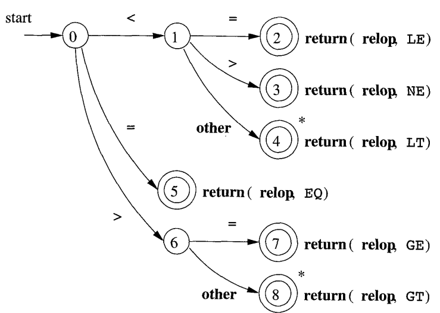
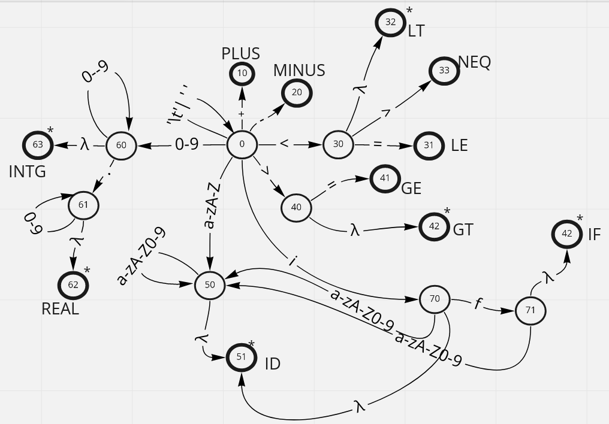

:data-transition-duration: 1000
:skip-help: true
:data-width: 1024
:data-height: 768
:css: ./style.css
:substep: true
:slide-numbers: true

.. role:: ltr
    :class: ltr

----

Lexical Analyzer
===================
Tokenizer
--------------
Ahmad Yoosofan

Compiler course

University of Kashan

* https://yoosofan.github.io/course/compiler.html

----

.. code:: cpp

  int a, b;

.. class:: substep

* { INT }
* { ID     "a" }
* { COMMA }
* { ID  "b" }
* { SEMICOLON }

.. code:: cpp
  :class: substep

    b = 10;
    c = 24;

.. class:: substep

* {ID "b"}
* {ASSIGN}
* {INTEGER, 10}
* {SEMICOLON}
* {END_OF_LINE}
* {ID "c"}
* {ASSIGN}
* {INTEGER, 24}
* {SEMICOLON}

----

Ignoring Some Characters
========================
.. class:: substep

* Depends on Language (c, c++, python)
* Depend on the place of the character (space at the end)
* White space characters (space, tab, new line)
* Old Fortran (Depends on the column of the character)
* Other Consideration (time consuming, memory, etc.)

----

Token (نشانه)
=============================
.. code:: cpp
  :class: substep

  struct token {
    tokenType t;
    string s;
    double x;
    int a;
  };

.. code:: cpp
  :class: substep

  struct token {
    tokenType t;
    char s[256];
    double x;
    int a;
  };

.. code:: cpp
  :class: substep

  struct token {
    tokenType t;
    char* s;
    double x;
    int a;
  };

.. code:: cpp
  :class: substep

  struct token {
    tokenType t;
    union {
      char* s;
      double x;
      int a;
    };
  };

----

.. code:: cpp

  struct token {
    tokenType t;
    union {
      char* s;
      double x;
      int a;
    };
  };

.. code:: cpp

  int a, b, count, x1;

.. image:: img/buffer1.png

----

:class: t2c

Token Types
=====================
.. code:: cpp
  :class: substep

  enum tokenType{
    INTEGER,             /* 25, 543, 1, 78070*/
    DOUBLE /* NUMBER */,
    IDENTIFIER,          /* x, count, f1, power*/
    IF,                  /* if */
    WHILE,               /* while */
    OPEN_PARANTHESIS,    /* ( */
    CLOSE_PARANTHESIS,   /* ) */
    ASSIGN,              /* = */
    OPEN_CURLY_BRACKET,  /* { */
    CLOSE_CURLY_BRACKET, /* } */
    OPEN_BRACKET,        /* [ */
    CLOSE_BRACKET,       /* ] */
    EQUAL,               /* == */
    LESS_THAN,           /* <  */
    GREATER_THAN,        /* > */
    LESS_THAN_EQUAL,     /* <= */
    GREATER_THAN_EQUAL,  /* >= */
    COMMA,               /* , */
    SEMICOLON,           /* ; */
    END_OF_LINE,
    END_OF_FILE
  }

.. code:: cpp
  :class: substep

  enum tokenType{
    NINT,  /* 25, 543, 1, 78070*/
    NDOB   /* NUMBER */,
    ID,    /* x, count, f1, power*/
    IF,    /* if */
    WHILE, /* while */
    OP,    /* ( */
    CP,    /* ) */
    ASG,   /* = */
    OC,    /* { */
    CC,    /* } */
    OB,    /* [ */
    CB,    /* ] */
    EQ,    /* == */
    LT,    /* <  */
    GT,    /* > */
    LTE,   /* <= */
    GTE,   /* >= */
    COM,   /* , */
    SEM,   /* ; */
    EOL,
    EOF    /* $ */
  }

----

.. code:: cpp

  if(a==4){
     a++;
  }

.. code:: cpp

  enum tokenType {
    INT, COM, ID, SEMI, IF, WHILE, OP,
    CP, EOF, AS, INTG, DOB /* NUM */,
    EOL, OCB, CCB, OB, CB, EQ, LT, GT, LTE,
    GTE, PLUS, MINUS, MUL, EOL, EOF
  };

.. class:: substep

* {if}
* {OP}
* {ID, "a"}
* {EQ}
* {INTG 4}
* {CP}
* {OC}
* {ID "a"}
* {PLUS}
* {PLUS}
* {SEMI}
* {CB}
* {EOF}

----

:class: t2c

More Samples
===============
.. code:: cpp
  :class: substep

  printf("Error");

.. class:: substep

* ID, printf
* OP,
* CS, Error
* CP,
* SEM

.. code:: cpp
  :class: substep

  a = '"';

.. class:: substep

* ID, a
* ASG,
* CC, "
* SEM,

.. code:: cpp
  :class: substep

  a = 2; // slfjsl slkjfsl slkjf sdf
  b = a+21;/* dsf
  sdfs
  sdfs */
  c = 323;

.. class:: substep

* ID, a
* ASG
* NINT, 2
* SEM
* ID, b
* ASG,
* ID, a
* PLUS,
* NINT, 21
* SEM,
* ID, c
* ASG,
* NINT, 323
* SEM

----

Some Issues
=================
.. class:: substep

* >>
    * i >> 2
    * cin >> a;
* > >
    * array<int,Node<int> >m1(10);
    * array<int,Node<int>>m1(10);
    * template<T, template<K> >
    * template<T, template<K>>

----

.. include:: src/la/template.in.template.cpp
  :code: cpp
  :number-lines:
  :class: ltr
  :start-line: 47

----

Writing Code
===============
Applications of Lexical Analyzer
--------------------------------
* Editors
    * `zed.dev <https://zed.dev/>`_ , `zed github <https://github.com/zed-industries/zed>`_
    * `Atom <https://atom-editor.cc/>`_ `Atom github <https://github.com/atom/atom>`_
    * `LPG2 <https://github.com/A-LPG/LPG2>`_
        * `Eclipse IDE <https://github.com/impulse-org>`_

----

Relational Operators
==========================

----

ID
===
.. image:: img/id.png
  :width: 800px

----

.. yographviz::

    digraph {
      rankdir = "LR";
      node     [shape=circle];  0 7;

      node     [shape=doublecircle];  1 2 3 4 5 6;

      node     [shape=doublecircle, xlabel="✷", tooltip="integer number"]; 8;

      0 -> 1   [label="("];
      0 -> 2   [label=")"];
      0 -> 3   [label="+"];
      0 -> 4   [label="-"];
      0 -> 5   [label="*"];
      0 -> 6   [label="/"];
      0 -> 7   [label="[0-9]"];
      7 -> 7   [label="[0-9]"];
      7 -> 8   [label="other"];
    }

.. :

    digraph G {
      edge [arrowhead=none];
      nodesep = 1;
      ranksep=0.05;
      splines = ortho;
      rankdir = LR;

      node [ shape="box", width = 2, height = 1, fixedsize=true];
      A1;
      B4 B5 B6 B3 B2 B1;

      node [ shape="point", width = 0, height = 0 ];
      { rank = same; W4 W5 W6 W0 W3 W2 W1 }

      A1 -> W0;
      W4 -> W5 -> W6 -> W0 -> W3 -> W2 -> W1;        /* critical! */
      W1 -> B1;
      W2 -> B2;
      W3 -> B3;
      W4 -> B4;
      W5 -> B5;
      W6 -> B6;
    }

.. :

        8 -> SY  [arrowhead=none, penwidth=0, len=0];

----

:class: t2c

.. include:: src/la/lexical440.cpp
  :code: cpp
  :number-lines:
  :class: ltr
  :start-line: 0
  :end-line: 35

.. include:: src/la/lexical440.cpp
  :code: cpp
  :number-lines:
  :class: ltr
  :start-line: 35
  :end-line: 74

----

:class: t2c

.. include:: src/la/lexical455.cpp
  :code: cpp
  :number-lines: 3
  :class: ltr
  :start-line: 2
  :end-line: 35

.. include:: src/la/lexical455.cpp
  :code: cpp
  :number-lines: 36
  :class: ltr
  :start-line: 35
  :end-line: 74

----

Keywords(I)
=============
then
-------
.. image:: img/keywords1.png
  :width: 700px

----

Keywords(II)
================
English Words
------------------
.. image:: img/keyword2.png

----

Number
=============
1, 322, 34.34, 34E3, 34E-3

.. image:: img/number.png
  :width: 740px

----

Delimiter
=============
.. image:: img/delim.png

----

Psudo Code
=============
.. image:: img/psudocode1.png
  :height: 500px

----

----

:class: t2c

Symbol Table
================
.. container::

  .. code:: cpp

    a = 2
    count = count + a

  .. class:: substep

  * ID, "a"
  * ASG
  * NINT, 2
  * EOL
  * ID, "count"
  * ASG
  * ID, "count"
  * PLUS
  * ID, "a"
  * EOL

.. container::

  .. csv-table::
    :header-rows: 1
    :class: substep  smallerelementwithfullborder

    Name, Type, Value
    a,ID ,
    count, ID,

  .. class:: substep

  * ID, 0
  * ASG
  * NINT, 2
  * EOL
  * ID, 1
  * ASG
  * ID, 1
  * PLUS
  * ID, 0
  * EOL

----

:class: t2c

Keywords in Symbol Table
============================
.. container::

  .. csv-table::
    :header-rows: 1
    :class: smallerelementwithfullborder

    Name, Type, Value
    if, IF,
    while, WHILE,
    int, INT,
    "...","...",
    a, ID,
    count, ID,

  .. code:: cpp

    a = 2
    count = count + a

  .. code:: cpp

    a = 2\ncount = count + a\0

  .. code:: cpp

    |a| |=| |2|\n|c|o|u|n|t| |=| |c|o|u|n|t| |+| |a|\0|

  .. :

      .. csv-table::
        :class: substep  smallerelementwithfullborder

          ` a `,`   `,` = `,`   `,` 2 `,` \\n`,` c `,` o `,` u `, ` n `,` t `, `   `,` = `,` c `, ` o `, ` u `,` n `,` t `,`  `,` + `,` a `,` \\0`

.. include:: src/la//symbol_table34.cpp
  :code: cpp
  :number-lines:

----

.. image:: img/la/token_state_machine_no_keywords.png

----

.. include:: src/la/scanner1.cpp
  :code: cpp
  :number-lines:
  :end-line: 34

----

.. include:: src/la/scanner1.cpp
  :code: cpp
  :number-lines: 35
  :start-line: 34
  :end-line: 90

----

:class: t2c

Memory Allocation
===================

.. csv-table::
  :class: smallerelementwithfullborder

  " i "," f "," w "," h "," i "
  " l "," e "," i "," n "," t "
  " a "," c "," o "," u "," n "
  " t ","\\0 "

.. csv-table::
  :header-rows: 1
  :class: smallerelementwithfullborder

  Name, Type, Value
  0, IF,
  2, WHILE,
  7, INT,
  10, ID,
  11, ID,

----

:class: t2c

Regular Expression
=======================
.. container::

  #. 0|1|2|3 : 0 or 1 or 2 or 3
  #. [0123] : 0 or 1 or 2 or 3
  #. [0-3] : 0 or 1 or 2 or 3
  #. [-03] : 0 or - or 3
  #. (abc) : Capture group abc
  #. (a|b) : Match a or b
  #. . : Any character, except newline
  #. \\. \\* \\\\ \\t \\n \\r \\-
  #. [0\\-3] : 0 or - or 3
  #. \\w : Word
  #. \\d : digit
  #. ^ `:` start of String
  #. ^abc : Start with abc
  #. $ `:` End of string
  #. abc$ : End with abc
  #. [ \\t] : space or tab
  #. [\\n\\t] : new line or tab

.. container::

  #. a+ ``:`` Match 1 or more a
  #. [0-9]+
  #. a* `:` Match 0 or more a
  #. [a-zA-Z\_][a-zA-Z\_]*
  #. [a-zA-Z\_]+
  #. a? `:` Match 0 or 1 of a
  #. if(def)?
  #. [0-9]+(\\.[0-9]+)?
  #. a{3}   : Match exactly 3 , aaa
  #. a{1,3} : Match between 1 and 3
  #. a{,3}  : Match up to 3
  #. a{3,}  : Match 3 or more
  #. [^abc] : Any character except a, b or c
  #. [^\\n] : . ,  scanf("[^\\n]", st);
  #. [a^c] : one of: a ^ c
  #. a/b `:` a when followed by b
  #. (abc)/(xyz) : abcsldsxyzss , abcsldsxzss ×
  #. (https?|ftp):/(/[^/\\r\\n]+)+/?
      https://yoosofan.github.io/course/

----

Some References of Regular Expression
========================================
*  https://stackoverflow.com/a/3513858
*  https://web.cs.hacettepe.edu.tr/~bbm301/lectures/lecture3_lex.pdf
*  https://devhints.io/regexp
*  https://web.mit.edu/hackl/www/lab/turkshop/slides/regex-cheatsheet.pdf
*  https://developer.mozilla.org/en-US/docs/Web/JavaScript/Guide/Regular_Expressions/Cheatsheet
*  https://developer.mozilla.org/en-US/docs/Web/JavaScript/Guide/Regular_Expressions/Cheatsheet#character_classes
*  https://www.rexegg.com/regex-quickstart.html
*  https://cheatography.com/davechild/cheat-sheets/regular-expressions/

----

Online Regular Expression Tools
===================================
* https://regex101.com/
* https://regexr.com/
* https://www.regextester.com/
* https://www.freeformatter.com/regex-tester.html
* https://extendsclass.com/regex-tester.html
* https://www.debuggex.com/
* https://developer.mozilla.org/en-US/docs/Web/JavaScript/Reference/Global_Objects/RegExp/test
* https://appdevtools.com/regular-expression-tester
* https://www.regular-expressions.info/javascriptexample.html

----

Regular Expression in Programming(re/regex)
=============================================
* C++
    * https://en.cppreference.com/w/cpp/regex
    * https://www.cplusplus.com/reference/regex/
    * https://www.geeksforgeeks.org/regex-regular-expression-in-c/
* Python
    * https://docs.python.org/3/library/re.html
    * https://www.tutorialspoint.com/python/python_reg_expressions.htm
    * https://www.w3schools.com/python/python_regex.asp
    * https://developers.google.com/edu/python/regular-expressions
    * https://www.programiz.com/python-programming/regex
    * https://realpython.com/regex-python/
    * https://www.geeksforgeeks.org/regular-expression-python-examples-set-1/

* Javascript
    * https://developer.mozilla.org/en-US/docs/Web/JavaScript/Guide/Regular_Expressions
    * https://www.w3schools.com/js/js_regexp.asp
    * https://www.programiz.com/javascript/regex
    * https://www.javascripttutorial.net/javascript-regular-expression/
    * https://eloquentjavascript.net/09_regexp.html

----

Next topic LEX
===================

.. comment:

  rst2s5.py calculator_recursive_descendant.rst calculator_recursive_descendant.html -d -t --section-numbering --stylesheet=farsi.css,html4css1.css
  rst2html.py calculator_recursive_descendant.rst calculator_recursive_descendant.html --stylesheet=farsi.css,html4css1.css
