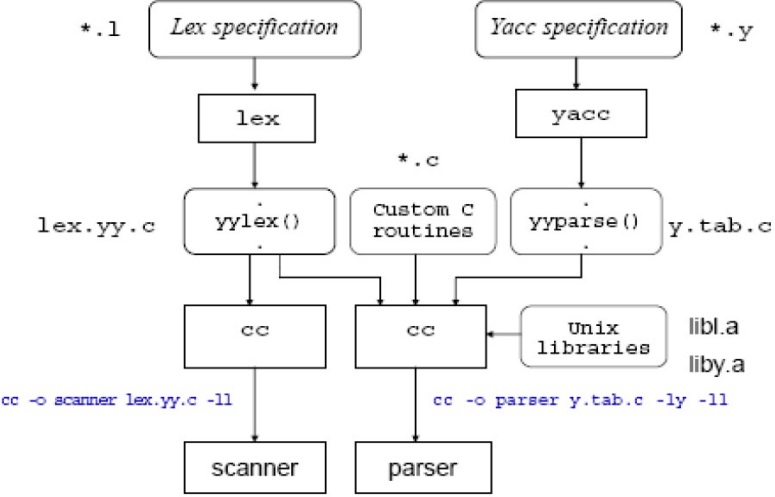

:data-transition-duration: 1000
:skip-help: true
:css: ./style.css
:substep: true
:slide-numbers: true
:data-width: 1024
:data-height: 768

.. role:: ltr
    :class: ltr

----

Lexical Analyzer
===================
LEX (Lex/Yacc , flex/bison)
------------------------------------
Ahmad Yoosofan

Compiler course

University of Kashan

* https://yoosofan.github.io/course/compiler.html

----

https://web.cs.hacettepe.edu.tr/~bbm301/lectures/lecture3_lex.pdf

.. :

  https://web.cs.hacettepe.edu.tr/~bbm301/lectures/lecture3_lex.pdf
  https://www.cs.utexas.edu/users/novak/lexpaper.htm
  https://silcnitc.github.io/lex.html
  https://www.opensourceforu.com/2017/04/lex-waving-the-magic-wand-of-regular-expressions/
  http://www.cs.columbia.edu/~aho/cs4115/Lectures/15-02-02.html
  compiler lex regular expression examples

----

:class: t2c

Install and Compile Lex File
================================
.. include:: src/lex/01.count_words.l
  :code: cpp
  :number-lines:

.. code:: console
  :number-lines:

  # Install flex in Ubuntu

  sudo apt install g++

  sudo apt install flex

  # Compile Lex File

  flex 01.count_words.l

  gcc lex.yy.c -lfl

  ./a.out < count_words_input_1.txt

----

:class: scrollbar-box800x500px-overflow

.. include:: src/lex/01.count_words.c
  :code: c
  :number-lines:

----

:class: t2c

Count words(I)
================
.. container::

  .. include:: src/lex/01.count_words.l
    :code: cpp
    :number-lines:

  .. include:: src/lex/count_words_input_1.txt
    :code: text
    :number-lines:

.. code:: console
  :number-lines:
  :class: substep

  ID :aDDDaaHHbm412abAmns12bm2
  ID :aabbbbbb2341abcccccc
  INT:79
  ID :aaaaabbbbbm8888888882
  ID :ab6669bm8888884
  ID :ab6669bm888888
  ID :abbaldkjA
  INT:1
  ID :ab
  INT:238234234
  INT:2342
  INT:234234
  INT:34
  INT:3
  INT:3
  ID :abm
  INT:9
  ID :bm88888
  INT:66
  ID :abm

----

:class: t2c

Count words(II)
==================
.. container::

  .. include:: src/lex/02.count_words.l
    :code: cpp
    :number-lines:

  .. include:: src/lex/count_words_input_1.txt
    :code: text
    :number-lines:

.. code:: console
  :number-lines:
  :class: substep

  lex$ ./a.out < count_words_input_1.txt

  ID :aDDDaaHHbm412abAmns12bm2
  ID :aabbbbbb2341abcccccc
  int:79
  ID :aaaaabbbbbm8888888882
  ID :ab6669bm8888884
  ID :ab6669bm888888
  ID :abbaldkjA
  2  :1ab
  int:238234234
  int:2342
  int:234234
  int:34
  int:3
  int:3
  ID :abm
  int:9
  ID :bm88888
  int:66
  ID :abm

----

:class: t2c

Count words(III)-input(I)
===============================
.. container::

  .. include:: src/lex/04.count_words.l
    :code: cpp
    :number-lines:

  .. include:: src/lex/count_words_input_1.txt
    :code: text
    :number-lines:

.. code:: console
  :number-lines:
  :class: substep

  lex$ flex 04.count_words.l
  lex$ gcc lex.yy.c -lfl
  lex$ ./a.out < count_words_input_1.txt

  3 aDDDaaHHbm4
  2 12ab
  2 2341abcccccc
  1 79aaaaabbbbb
  3 4
  4 9bm888888
  1 1ab
  3 4
  3 4
  3 4
  3 4
  3 4
  3 4
  4 9bm88888
  1 66ab

----

:class: t2c

Count words(III)-input(II)
===============================
.. container::

  .. include:: src/lex/04.count_words.l
    :code: cpp
    :number-lines:

  .. include:: src/lex/count_words_input_2.txt
    :code: text
    :number-lines:

.. code:: console
  :number-lines:
  :class: substep

  lex$ flex 04.count_words.l
  lex$ gcc lex.yy.c -lfl
  lex$ ./a.out < count_words_input_2.txt

  3 aDDDaaHHbm4
  2 12ab
  2 2341abcccccc
  1 79aaaaabbbbb
  3 4
  4 9bm888888
  1 1ab
  3 4
  3 4
  3 4
  3 4
  3 4
  3 4
  4 9bm88888
  1 66ab

----

:class: t2c

Simple Number
===============================
.. container::

  .. include:: src/lex/05.simpleNumber.l
    :code: cpp
    :number-lines:

  .. include:: src/lex/05.simpleNumber_input.txt
    :code: text
    :number-lines:

.. code:: console
  :number-lines:
  :class: substep

  lex$ flex 05.simpleNumber.l
  lex$ gcc lex.yy.c -lfl
  lex$ ./a.out < 05.simpleNumber_input.txt

  Integer:: 12
  Integer:: 234
  Real :: 434.45
  Real :: 676.45
  AAAAAAA
  SSSSSSS
  Integer:: 654
  Integer:: 123
  AAAAAAA

----

:class: t2c

Number of Characters
===============================
.. include:: src/lex/08.numberOfCharacters.l
  :code: cpp
  :number-lines:

.. container::

  .. include:: src/lex/08.numberOfCharacters_input.txt
    :code: text
    :number-lines:

  .. code:: console
    :number-lines:
    :class: substep

    lex$ flex 08.numberOfCharacters.l
    lex$ gcc lex.yy.c -lfl
    lex$ ./a.out < 08.numberOfCharacters_input.txt

    Int::10
    Double::0
    Double::12
    Line::6
    Dot::0
    Other::0

----

:class: t2c

Parts of Speech(I)
===============================
.. include:: src/lex/12.wordsInEnglish1.l
  :code: cpp
  :number-lines:

.. container::

  .. include:: src/lex/12.wordsInEnglish1.input.txt
    :code: text
    :number-lines:

  .. code:: console
    :number-lines:
    :class: substep

    aaa :::: mytest
    bbb: don't recognize, a noun
    is: is a verb
    am: is a verb
    above: is a preposition

    I: in a pronoun
    you: in a pronoun
    23764297342342.23423

.. :

  flex 12.wordsInEnglish1.l
  gcc lex.yy.c -lfl
  ./a.out < 12.wordsInEnglish1.input.txt

----

:class: t2c

Parts of Speech(II)
===============================
.. include:: src/lex/testBetterWordInEnglishComment.txt
  :code: text
  :number-lines:

.. code:: console
  :number-lines:
  :class: substep

  I:don't recognize
  am:verb
  an:don't recognize
  instructor:don't recognize
  They:don't recognize
  have:verb
  a:don't recognize
  situation:don't recognize
  This:don't recognize
  orange:noun
  is:verb
  not:don't recognize
  red:don't recognize
  My:don't recognize
  name:don't recognize
  is:verb
  Ahmad:noun
  I:pronoun
  m:don't recognize
  an:don't recognize
  instructor:don't recognize
  at:preposition
  the:don't recognize
  university:noun
  of:preposition
  Kashan:noun
  You:don't recognize
  are:verb
  students:don't recognize

----

:class: t2c

Parts of Speech(III)
===============================
.. include:: src/lex/wordsTypeInEnglish.l
  :code: c
  :number-lines:
  :start-line: 0
  :end-line: 28

.. include:: src/lex/wordsTypeInEnglish.l
  :code: c
  :number-lines:
  :start-line: 28
  :end-line: 56

.. :

  flex wordsTypeInEnglish.l
  gcc lex.yy.c -lfl
  ./a.out < testBetterWordInEnglishComment.txt

----

:class: t2c

Parts of Speech(IV)
===============================
.. include:: src/lex/wordsTypeInEnglish.l
  :code: c
  :number-lines:
  :start-line: 56
  :end-line: 80

.. include:: src/lex/wordsTypeInEnglish.l
  :code: c
  :number-lines:
  :start-line: 80
  :end-line: 108

.. :

  flex wordsTypeInEnglish.l
  gcc lex.yy.c -lfl
  ./a.out < testBetterWordInEnglishComment.txt

----

Some References
==================
* Most Samples have been written by Ahmad Yoosofan (https://yoosofan.github.io)
* http://dinosaur.compilertools.net/#flex
* https://www.oreilly.com/library/view/lex-yacc/9781565920002/bi01.html
* http://compilerbook.org (https://www3.nd.edu/~dthain/compilerbook/)
* https://web.cs.hacettepe.edu.tr/~bbm301/lectures/lecture3_lex.pdf
* https://www.cs.utexas.edu/users/novak/lexpaper.htm
* https://silcnitc.github.io/lex.html
* https://www.opensourceforu.com/2017/04/lex-waving-the-magic-wand-of-regular-expressions/
* http://www.cs.columbia.edu/~aho/cs4115/Lectures/15-02-02.html

.. :

  compiler lex regular expression examples

----

Similar Lexer and Parser
========================
#. PLY
#. `Lemon for SQLite <https://www.sqlite.org/lemon.html>`_
    #. https://www.sqlite.org/lang.html
    #. https://www.sqlite.org/pragma.html

----

PLY / lex part
==============
* https://github.com/dabeaz/ply/
* www.dabeaz.com/ply/
* https://github.com/dabeaz/ply/tree/master/src/ply

.. image:: img/ply.github.png

----

Sample I
=========
.. include:: src/ply/115.id.plus.py
  :code: python
  :number-lines:

----

Sample II
=========
.. include:: src/ply/124.plus.py
  :code: python
  :number-lines:

----

Sample III
==========
.. include:: src/ply/126.error.plus.py
  :code: python
  :number-lines:

----

:class: t2c

Sample IV
=========
.. include:: src/ply/128.plus.mul.py
  :code: python
  :number-lines:
  :end-line: 21

.. include:: src/ply/128.plus.mul.py
  :code: python
  :number-lines: 22
  :start-line: 21

----

:class: t2c

Sample V
========
.. include:: src/ply/130.id.py
  :code: python
  :number-lines:
  :end-line: 20

.. include:: src/ply/130.id.py
  :code: python
  :number-lines: 21
  :start-line: 20

----

:class: t2c

Sample VI
=========
.. include:: src/ply/132.assign.py
  :code: python
  :number-lines:
  :end-line: 23

.. include:: src/ply/132.assign.py
  :code: python
  :number-lines: 24
  :start-line: 23

----

:class: t2c

Sample VII
==========
.. include:: src/ply/133.comp.py
  :code: python
  :number-lines:
  :end-line: 21

.. include:: src/ply/133.comp.py
  :code: python
  :number-lines: 22
  :start-line: 21

----

:class: t2c

Sample VIII
===========
.. include:: src/ply/134.newline.py
  :code: python
  :number-lines:
  :end-line: 29

.. include:: src/ply/134.newline.py
  :code: python
  :number-lines: 29
  :start-line: 28

----

:class: t2c

A calculator
============
.. include:: src/ply/140.plus.py
  :code: python
  :number-lines:
  :end-line: 23

.. include:: src/ply/140.plus.py
  :code: python
  :number-lines: 23
  :start-line: 22

----

END