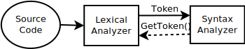
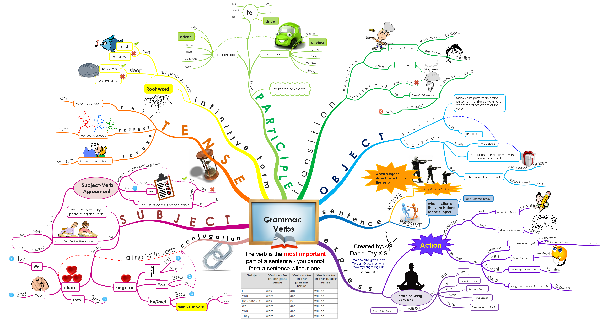

:data-transition-duration: 1000
:skip-help: true
:css: ./style.css
:substep: true
:slide-numbers: true

----

Syntax Analysis
===================
Parser
--------------
Ahmad Yoosofan

Compiler course

University of Kashan

.. :

  :js: https://d3js.org/d3.v5.min.js
  :js: https://unpkg.com/@hpcc-js/wasm@0.3.11/dist/index.min.js
  :js: https://unpkg.com/d3-graphviz@3.0.5/build/d3-graphviz.js

.. raw:: html

  
  
  

----

Checking Syntax
=================
#. I am student
#. ⊠ I are student
#. ⊠ You am student
#. ⊠ They am student
#. 342 + 261 * 5
#. 45 * (23 + 332)
#. ⊠ 23 * + 54
#. ⊠ 2323 +
#. ⊠ * 232
#. ⊠ 2323 + 23 * (23 (23))
#. ⊠ 234 * (45 * (23+3)
#. We need more theory to simplify the task

----

:class: t2c

Grammar
==========================
* Regular Expression Weakness
    * Nested comments ``/* /*  */  */``
    * Parenthesis and Braces () {} []
    * State machine needs memory
* context-free grammar (CFG)
* BNF (Backus-Naur Form) notation
* checks a given source program
* creates the parse tree
* Otherwise gives the error messages
* → , λ , |
* S → aA
* S → b
* You can use
    * -> instead of →

.. container::

  .. image:: img/sa/tree.the.dog.saw.a.man.in.the.park.png

  https://www.nltk.org/book/ch08.html

.. :

  ρ φ λ θ ∀ ∈ Σ ∩ ∪ ∧ ∨ ˅ ˄
  ← ↑ → ↓ ↔ ↕ ↨ ∂ ∆ ≤ ≥ ∩ ∞ ≈ ≠
  I ≡ √ ∏ ζ η θ ά Θ α β γ δ ε ζ
  π Ω Ψ Φ μ φ ∉ © Γ ∋ ∌ ∍ ∇ ∅
  ∄ ∃ ⇒ ⇐ ⇔ ⇏ ⇎ ⇚ ⇛ ⇠ ⇡ ⇢ ⇣ ∐
  ∥ ≣ ≤ ≥ ≪ ≫ ≮ ≯ ≰ ≱ ≲ ≳ ≴
  ≵ ≺ ≻ ≼ ≽ ≾ ≿ ⊂ ⊃ ⊄ ⊅ ⊆ ⊇ ⊈
  ⊉ ⊊ ⊋ ⊏ ⊐ ⊑ ⊒ ⊓ ⊔ ⊕ ⊖ ⊗ ⊘ ⊙
  ⊚ ⊛ ⊜ ⊝ ⊞ ⊟ ⊠ ⊡ ⊢ ⊣ ⊤ ⊥ ⊦ ⊧
  ⊨ ⊩ ⊪ ⊰ ⊱ ⊲ ⊳ ⊴ ⊵ ⊶ ⊻ ⊼ ⊽
  ⊿ ⋈ ⌘ ⌨ 〈 〉 ① ② ③ ④ ⑤ ⑥ ⑦ ⑧
  ⑨ ⑩ ⑪ ⑫ ⑬ ⑭ ⑮ ⑯ ⑰ ⑱ ⑲ ⑳ Ⓐ Ⓑ
  Ⓒ Ⓓ Ⓔ Ⓕ Ⓖ Ⓗ Ⓘ Ⓙ Ⓚ Ⓛ Ⓜ Ⓝ Ⓞ
  Ⓟ Ⓠ Ⓡ Ⓢ ᆖ
  ͅ
  █
  ▀▄█▌▐░▒▓■▬▲►▼◄

  ██

----

.. image:: img/sa/english.grammar.tree.jpeg
  :width: 800px

.. :

  https://www.scribd.com/document/367888033/English-Grammar-Tree-Diagram
  https://twitter.com/interactiveeng/status/849225602620108801/photo/1

----

.. :

  https://vishub.org/excursions/2071.full
  https://thumbnails-visually.netdna-ssl.com/EnglishGrammarVerbs_5277cb7da4ac3.png

----

:class: t2c

Simple Grammars
===================
* I
    #. S → aSb
    #. S → b
    #. abb, aabbb, aaabbbb, 
* II
    * S → (S)
    * S → a
    * a, (a), ((a))
* III
    * S → [A]
    * A → aS
    * A → λ
    * [], [a[]], [a[a[]]]

#. Writing grammar is harder than finding sentences of a grammar
    * 87
    * 78968 + (3334+43)
    * 78968 * (3334+43)
    * 78968 * (334+43)
    * 78968 * ((334+43) * 4)
    * 78968 * ((334+43)* 4)
    * (23 + 45) + 45
    * (23 + 45) + (45 * 443)
    * 2 * ((23 + 45) + (45 * 443))

----

:class: t2c

Grammar of simpler calculator
================================
#. It has just ``+, *, (, )``
#. There is no priority
#. No unary operator (+)
#. Use paranthesis for more that one operator
    #. (2+3)+4
    #. 2+(4+3)
    #. (2+(4+3))+5
    #. (2*(4*3))*5
#. Terminals
#. INT (for simplicity we use token.type: i)
    #. (i+i)+i
    #. i+(i+i)
    #. (i+(i+i))+i
    #. (i*(i*i))*i
#. {'+', '*'}
#. {'(', ')'}
#. No need for naming operators, just using the symbol
#. Use recursion

.. class:: substep

#. Start Symbol (S)
#. S → A + A
#. S → A * A
#. S → A
#. A → (S)
#. A → i
#. Derivation Tree

----

:class: t2c

Derivation Tree(I)
====================
.. container::

  #. S → A + A
  #. S → A * A
  #. S → A
  #. A → (S)
  #. A → i

  * 43 + 87

  .. class:: substejp

    Left Most Derivation

    #. S ⇒ A + A ⇒
    #. i[43] + A ⇒
    #. i[43] + i[87]

    Right Most Derivation

    #. S ⇒ A + A ⇒
    #. A + i[87] ⇒
    #. i[43] + i[87]

.. raw:: html

  

  

----

:class: t2c

Derivation Tree(II)
====================
.. container::

  #. S → A + A
  #. S → A * A
  #. S → A
  #. A → (S)
  #. A → i

  * (32 * 5)

  .. class:: substep

    Left Most Derivation

    #. S ⇒ A ⇒
    #. ``(S)`` ⇒
    #. (A * A) ⇒
    #. (i[32] * A) ⇒
    #. (i[32] * i[5])

    Right Most Derivation

    #. S ⇒ A ⇒
    #. ``(S)`` ⇒
    #. ( A * A ) ⇒
    #. ( A * i[5] ) ⇒
    #. ( i[32] * i[5] )

.. raw:: html

  

  

----

:class: t2c

Derivation Tree(III)
====================
.. container::

  * S → A + A | A * A | A
  * A → (S) | i

  * 3 * (32 + 5)

  .. class:: substep

    Left Most Derivation

    #. S ⇒ A * A ⇒
    #. i[3] * A ⇒
    #. i[3] * (S) ⇒
    #. i[3] * ( A + A ) ⇒
    #. i[3] * ( i[32] + A ) ⇒
    #. i[3] * ( i[32] + i[5] )

    Right Most Derivation

    #. S ⇒ A * A ⇒
    #. A * ( S ) ⇒
    #. A * ( A + A ) ⇒
    #. A * ( A + i[5] ) ⇒
    #. A * ( i[32] + i[5] ) ⇒
    #. i[3] * ( i[32] + i[5] )

.. raw:: html

  

  

----

More Languages
=================
#. Adding Priority
#. Adding Minus and Divide
#. Adding Variables (Assignment)
#. A simple Programming Language (if and while)

----

Next Topic: Recursive Descendant Parser
=============================================

----

End
========

.. comments:

    rst2html syn.rst syn.html
    hovercraft syn.rst

    https://www.csd.uwo.ca/~mmorenom/CS447/Lectures/Syntax.html/node8.html

    https://www.researchgate.net/publication/2367776_An_Introduction_to_Compilers?enrichId=rgreq-3d6589b36b650b1be61ea0ce1b1b7805-XXX&enrichSource=Y292ZXJQYWdlOzIzNjc3NzY7QVM6OTg4Mjk0MzcyNDMzOTVAMTQwMDU3NDE4MjE5Ng%3D%3D&el=1_x_2&_esc=publicationCoverPdf

    https://www.tutorialspoint.com/compiler_design/compiler_design_syntax_analysis.htm

