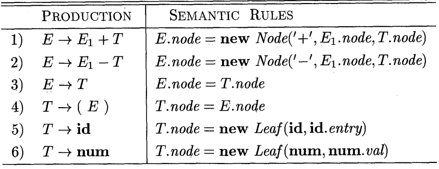
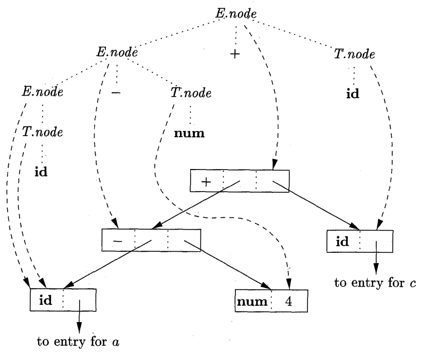
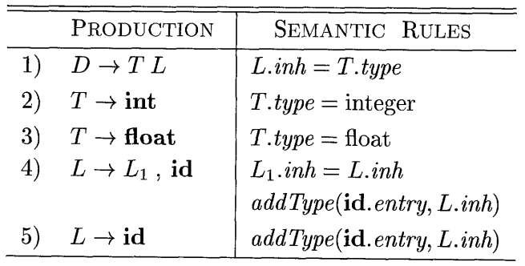
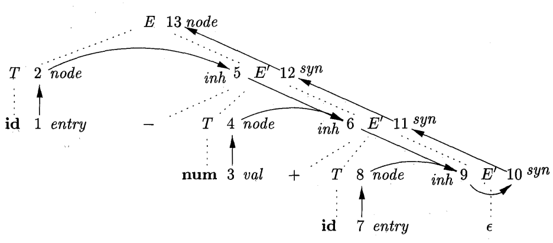
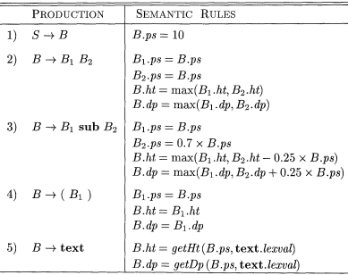

:data-transition-duration: 1000
:skip-help: true
:css: style.css semantic.css
:substep: true
:slide-numbers: true
:data-width: 1024

.. role:: raw-html(raw)
   :format: html

----

Semantic Analyzer
===================
Ahmad Yoosofan

Compiler course

University of Kashan

----

:class: grid-2col-class

#. E → E + a
#. E → a

..  csv-table::
    :header: ` `, a, `+`, `$`, `E`
    :class: smallerelementwithfullborder

    0, s2, , , 1
    1, , s3, acc,
    2, , r2, r2,
    3, s4, , ,
    4, , r1, r1,

..  csv-table::
    :header: Stack, Input, Action
    :class: smallerelementwithfullborder yoosofantextalignleft

    :math:`I_0`, a[8]+a[9]$,
    :math:`I_0` a[8] :math:`I_2`, +a[9]$, r2(E → a)
    :math:`I_0` E[8] :math:`I_1`, +a[9]$
    :math:`I_0` E[8] :math:`I_1` + :math:`I_3`, a[9]$
    :math:`I_0` E[8] :math:`I_1` + :math:`I_3` a[9] :math:`I_4`, $, r1(E→E+a)
    :math:`I_0` E[17] :math:`I_1`, $
    acc

.. yographviz::

      digraph g {
        node [ shape = "plaintext" ];

        "a" [ label = "E[17]" ];
        "b" [ label = "E[8]" ];
        "d" [ label = "+" ];
        "c" [ label = "9" ];
        "e" [ label = "8" ];

        a -> c [dir="back"];
        a -> d [dir="back"];
        a -> b [dir="back"];
        b -> e [dir="back"];
      }

.. :

    https://stackoverflow.com/a/61416465/886607
    https://stackoverflow.com/a/28863761/886607

----

:class: grid-2col-class

..  csv-table::
    :header: ` `, Production, Semantic
    :class: smallerelementwithfullborder yoosofantextalignleft

    1, "E → a", "E.val = lexValue(a)"
    2, "E → E + a", "E.val = :math:`E_1`.val + lexValue(a)"

..  csv-table::
    :header: ` `, a, `+`, `$`, `E`
    :class: smallerelementwithfullborder

    0, s2, , , 1
    1, , s3, acc,
    2, , r2, r2,
    3, s4, , ,
    4, , r1, r1,

..  csv-table::
    :header: n, Stack, Input, Action
    :class: smallerelementwithfullborder yoosofantextalignleft

    0, :math:`I_0`, a[8]+a[9]+a[2]$,
    1, :math:`I_0` a[8] :math:`I_2`, +a[9]+a[2]$, r2(E → a)
    2, :math:`I_0` E[8] :math:`I_1`, +a[9]+a[2]$,
    3, :math:`I_0` E[8] :math:`I_1` + :math:`I_3`, a[9]+a[2]$,
    4, :math:`I_0` E[8] :math:`I_1` + :math:`I_3` a[9] :math:`I_4`, +a[2]$, r1(E→E+a)
    5, :math:`I_0` E[17] :math:`I_1`, +a[2]$,
    6, :math:`I_0` E[17] :math:`I_1` + :math:`I_3`, a[2]$,
    7, :math:`I_0` E[17] :math:`I_1` + :math:`I_3` a[2] :math:`I_4`, $, r1(E→E+a)
    8, :math:`I_0` E[19] :math:`I_1`, $,
    9, acc ,

.. yographviz::

      digraph g {
        node [ shape = "plaintext" ];

        "i" [ label = "E[19]" ];
        "a" [ label = "E[17]" ];
        "r" [ label = "+" ];
        "p" [ label = "a[2]" ];
        "b" [ label = "E[8]" ];
        "d" [ label = "+" ];
        "c" [ label = "a[9]" ];
        "e" [ label = "a[8]" ];

        i -> a [dir="back"];
        i -> r [dir="back"];
        i -> p [dir="back"];
        a -> c [dir="back"];
        a -> d [dir="back"];
        a -> b [dir="back"];
        b -> e [dir="back"];
      }

----

Anotated parse tree
==========================
a[8]+a[9]+a[2]

.., yographviz::

      digraph g {
        node [ shape = "plaintext" ];

        "i" [ label = "E.val=19" ];
        "a" [ label = "E.val=17" ];
        "r" [ label = "+" ];
        "p" [ label = "a.val=2" ];
        "b" [ label = "E.val=8" ];
        "d" [ label = "+" ];
        "c" [ label = "a.val=9" ];
        "e" [ label = "a.val=8" ];

        i -> a [dir="back"];
        i -> r [dir="back"];
        i -> p [dir="back"];
        a -> c [dir="back"];
        a -> d [dir="back"];
        a -> b [dir="back"];
        b -> e [dir="back"];
      }

----

:class: t2c

Dependency Graph
=========================
#. E → T + E
#. E → T
#. T → F * T
#. T → F
#. F → ( E )
#. F → a

.. yographviz::

      digraph g {
        node [ shape = "plaintext" ];

        "i" [ label = "E.val=19" ];
        "a" [ label = "E.val=17" ];
        "r" [ label = "+" ];
        "p" [ label = "a.val=2" ];
        "b" [ label = "E.val=8" ];
        "d" [ label = "+" ];
        "c" [ label = "a.val=9" ];
        "e" [ label = "a.val=8" ];

        i -> a [dir="back"];
        i -> r [dir="back"];
        i -> p [dir="back"];
        a -> c [dir="back"];
        a -> d [dir="back"];
        a -> b [dir="back"];
        b -> e [dir="back"];
      }

.. :

  .. image:: img/semantic/Anotated_parse_tree1.png
      :align: center

----

:class: t2c

Syntax-Directed Definition
=============================
..  csv-table::
    :header: Production, Semantic Rules
    :class: smallerelementwithfullborder yoosofantextalignleft center

    S → E n, print(E.v)
    E → :math:`E_1+T`, :math:`E.v=E_1.v + T.v`
    E → T, :math:`E.v=T.v`
    T → :math:`T_1*F.v`, :math:`T.v=T_1.v * F.v`
    T → F, :math:`T.v=F.v`
    F → ( E ), :math:`F.v=E.v`
    F → a, :math:`F.v=a.lexval`

.. yographviz::

      digraph g {
        node [ shape = "plaintext" ];

        "i" [ label = "F.val=19" ];
        "a" [ label = "F.val=17" ];
        "r" [ label = "+" ];
        "p" [ label = "a.val=2" ];
        "b" [ label = "E.val=8" ];
        "d" [ label = "+" ];
        "c" [ label = "a.val=9" ];
        "e" [ label = "a.val=8" ];

        i -> a [dir="back"];
        i -> r [dir="back"];
        i -> p [dir="back"];
        a -> c [dir="back"];
        a -> d [dir="back"];
        a -> b [dir="back"];
        b -> e [dir="back"];
      }

----

:class: grid-2col-class

.. include:: src/semantic/ply_calc220.py
    :code: python
    :number-lines:
    :start-line: 0
    :end-line: 18

.. include:: src/semantic/ply_calc220.py
    :code: python
    :number-lines:
    :start-line: 60
    :end-line: 69

----

:class: grid-2col-class

.. include:: src/semantic/ply_calc220.py
    :code: python
    :number-lines:
    :start-line: 18
    :end-line: 38

.. include:: src/semantic/ply_calc220.py
    :code: python
    :number-lines:
    :start-line: 38
    :end-line: 58

.. :

  .. image:: img/semantic/anotated_parse_tree.png
      :height: 300px

----

Inherited Attribute
===========================
..  csv-table::
    :header: Production, Semantic Rules
    :class: smallerelementwithfullborder yoosofantextalignleft center
    :align: center

    "D → T L", "L.in = T.type"
    "T → int", "T.type = integer"
    "T → real", "T.type = real"
    "L → L1, id", "L1.in = L.in,   addtype(id.entry,L.in)"
    "L → id", "addtype(id.entry,L.in)"

* int i
* int a,b,c
* real x,y

#. D → T {L.in = T.type} L
#. T → int {T.type = integer}
#. T → real {T.type = real}
#. L → {L1.in = L.in} L1, id {addtype(id.entry,L.in)}
#. L → id {addtype(id.entry,L.in)}

----

real a, b, c

.. image:: img/semantic/dependency_graph_for_declaration.png
    :align: center

----

:class: t2c

.. include:: src/rd/aB.plus.E.recursive.parser.py
  :code: python
  :number-lines:
  :class: substep
  :start-line: 2
  :end-line: 24

.. include:: src/rd/aB.plus.E.recursive.parser.py
  :code: python
  :number-lines:
  :class: substep
  :start-line: 2
  :end-line: 24

----

:class: t2c

.. include:: src/ply/420.type.py
  :code: python
  :number-lines:
  :end-line: 24

.. include:: src/ply/420.type.py
  :code: python
  :number-lines: 24
  :start-line: 23

----

:class: t2c

.. include:: src/ply/426.type.py
  :code: python
  :number-lines:
  :end-line: 24

.. include:: src/ply/426.type.py
  :code: python
  :number-lines: 24
  :start-line: 23

----

:class: t2c

.. include:: src/ply/430.type.py
  :code: python
  :number-lines:
  :end-line: 24

.. include:: src/ply/430.type.py
  :code: python
  :number-lines: 24
  :start-line: 23

----

:class: t2c

.. include:: src/ply/436.type.literals.py
  :code: python
  :number-lines:
  :end-line: 24

.. include:: src/ply/436.type.literals.py
  :code: python
  :number-lines: 24
  :start-line: 23

----

..  csv-table::
    :header: Production, Semantic Rules
    :class: smallerelementwithfullborder yoosofantextalignleft center

    "L → E \\n", "print(val[top-1])"
    "E → E1 + T", "val[ntop] = val[top-2] + val[top]"
    "E → T",
    "T → T1 * F", "val[ntop] = val[top-2] * val[top]"
    "T → F",
    "F → ( E )", "val[ntop] = val[top-1]"
    "F → digit"

----

:class: t2c

..  csv-table::
    :header: ,Production, Semantic Rules
    :class: smallerelementwithfullborder yoosofantextalignleft center

    1, "A → B", "print(B.n0),  print(B.n1)"
    2, "B → 0 :math:`B_1`", "B.n0=B1.n0+1,  B.n1=B1.n1"
    3, "B → 1 :math:`B_1`", "B.n0=B1.n0,  B.n1=B1.n1+1"
    4, "B → λ ", "B.n0=0,  B.n1=0"

.. yographviz::

      digraph g {
        node [ shape = "plaintext" ];

        "A" [ label = "print(B.n0);print(B.n1);" ];
        "B1" [ label = "E.val=17" ];
        "r" [ label = "+" ];
        "p" [ label = "a.val=2" ];
        "b" [ label = "E.val=8" ];
        "d" [ label = "+" ];
        "c" [ label = "a.val=9" ];
        "e" [ label = "a.val=8" ];

        A -> a [dir="back"];
        i -> r [dir="back"];
        i -> p [dir="back"];
        a -> c [dir="back"];
        a -> d [dir="back"];
        a -> b [dir="back"];
        b -> e [dir="back"];
      }

----

----

----

:class: t2c

..  csv-table::
    :header: Production, Semantic Rules
    :class: smallerelementwithfullborder yoosofantextalignleft

    "E → E1 + T", "E.loc=newtemp() , :raw-html:` ` E.code = E1.code || T.code || 'add E.loc, E1.loc, T.loc'"
    "E → T", "E.loc = T.loc, E.code=T.code"
    "T → T1 * F", "T.loc=newtemp() , :raw-html:` ` T.code = T1.code || F.code  || 'mult T.loc, T1.loc, F.loc'"
    "T → F", "T.loc = F.loc, T.code=F.code "
    "F → ( E )", "F.loc = E.loc,  F.code=E.code"
    "F → id", "F.loc = id.name,  F.code= '' "

* 3 * 4 + 5
* t1 ← 3 * 4,  mult t1, 3 , 4
* t2 ← t1 + 5, add t2, t1, 5

* mult t1, 3 , 4
* add t2, t1, 5

* (3 * 4) + 5
* F → (E)
* E → T
* T → T * F
* t1 ← 3 * 4,  mult t1, 3 , 4
* t2 ← t1 + 5, add t2, t1, 5

.. :

  ←

----

:class: grid-2col-class

.. include:: src/ply/ply_calc220_code.py
    :code: python
    :number-lines:
    :start-line: 19
    :end-line: 50

.. include:: src/ply/ply_calc220_code.py
    :code: python
    :number-lines:
    :start-line: 50
    :end-line: 80

----

:class: t2c

Translation Scheme
=========================
.. container::

  * E → T R
  * R → + T { print("+") } R1
  * R → λ
  * T → id { print(id.name) }

  #. a+b+c
  #. a b + c +

* E → T R → id(a){print(id.name)} R
* → R → + T {print("+")} R1 
* → T  {print("+")} R1 → 
* id(b){print(id.name)}{print("+")} R1
* → {print("+")} R1
* → R1 → + T {print("+")} R1
* → T {print("+")} R1
* → id(c){print(id.name)}{print("+")} R1
* → {print("+")} R1 → R1 → λ

----

:class: t2c

..  csv-table::
    :header: ,Production, Semantic Rules
    :class: smallerelementwithfullborder yoosofantextalignleft center

    1, "T → F T ' ", "T '.inh = F.val ,  T.val = T '.syn"
    2, "T ' → * F :math:`T '_1` ", ":math:`T '_1`.inh = T '.inh * F.val,  T '.syn = :math:`T '_1`.syn"
    3, "T ' → λ", "T '.syn = T '.inh"
    4, "F → id  ", "F.val = id.name"

.. :

    5 * 7 * 2

.. :

    .. image:: img/semantic/sdd_top_down_expression.png
        :align: center

.. image:: img/semantic/sdd_top_down_expression_dependency_graph.png
    :align: center
    :width: 400px

----

----

.. image:: img/semantic/constructing_tree_top_down_parsing.png
    :align: center

----

----

Specification
======================
.. class:: substep

  * attributes
  * Semantic Rules
  * may generate intermediate codes
  * may put information into the symbol table
  * may perform type checking
  * may issue error messages
  * may perform some other activities
  * in fact, they may perform almost any activities.
  * An attribute may hold almost any thing.
  * a string, a number, a memory location, a complex record.
  * inherited attribute
  * synthesized attribute

----

S-Attributed Definitions
=============================
.. class:: substep

    * An SDD that involves only synthesized attributes is called S-attributed
    * An S-attributed SDD can be implemented naturally in conjunction with an LR parser.

----

circular dependency
==============================
..  csv-table::
    :header: Production, Semantic Rules
    :class: smallerelementwithfullborder yoosofantextalignleft center

    "A → B", "A.s = B.i  ,   B.i = A.s + 1"

.. image:: img/semantic/The_circular_dependency.png
    :align: center

----

L-Attributed Definitions
================================
Each attribute must be either

.. class:: substep

    1. Synthesized, or
    2. Inherited, but for every rule like :math:`A → X_1X_2 ... X_n` which contains an inherited attribute :math:`X_i.a`, the rule may use only:

        * Inherited attributes associated with the head A.
        * attributes associated with the occurrences of symbols :math:`X_1, X_2 , . . . , X_{i-1}` is located to the left of :math:`X_i`.

----

Examples

..  csv-table::
    :header: Production, Semantic Rules
    :class: smallerelementwithfullborder yoosofantextalignleft center

    "D → T L", "L.in = T.type"
    "T → int", "T.type = integer"
    "T → real", "T.type = real"
    "L → :math:`L_1`, id", ":math:`L_1`.in = L.in,   addtype(id.entry,L.in)"
    "L → id", "addtype(id.entry,L.in)"

..  csv-table::
    :header: Production, Semantic Rules
    :class: smallerelementwithfullborder yoosofantextalignleft center

    E → F R, "R.inh = F.val , E.val = R.val"
    R → + F :math:`R_1`, ":math:`R_1`.inh = R.inh + F.val , R.val = :math:`R_1`.val"
    R → λ, R.val = R.inh
    F → ( E ), F.val = E.val
    F → digit, F.val = digit.lexval

----

Not L-Attributed

..  csv-table::
    :header: Production, Semantic Rules
    :class: smallerelementwithfullborder yoosofantextalignleft center

    "A → B D", "A.s = B.b , B.i = f(D.d, A.s)"

..  csv-table::
    :header: Production, Semantic Rules
    :class: smallerelementwithfullborder yoosofantextalignleft center

    "A → L M", "L.in = f1(A.i), M.in = f2(L.s), A.s = f3(M.s)"
    A → Q R, "R.in = f4(A.in), Q.in = f5(R.s), A.s = f3(Q.s)"

----

Translation Scheme vs SDD
=========================
SDD

..  csv-table::
    :header: Production, Semantic Rules
    :class: smallerelementwithfullborder yoosofantextalignleft center

    E → F R, "R.inh = F.val , E.val = R.val"
    R → + F :math:`R_1`, ":math:`R_1`.inh = R.inh + F.val , R.val = :math:`R_1`.val"
    R → λ, R.val = R.inh
    F → ( E ), F.val = E.val
    F → digit, F.val = digit.lexval

Translation Scheme

..  csv-table::
    :header: Production and Semantic Rules
    :class: smallerelementwithfullborder yoosofantextalignleft center

    E → F {R.inh = F.val} R {E.val = R.val}
    R → + F {:math:`R_1`.inh = R.inh + F.val} :math:`R_1` {R.val = :math:`R_1`.val}
    R → λ {R.val = R.inh}
    F → ( E ) {F.val = E.val}
    F → digit {F.val = digit.lexval}

----

SDD for typesetting boxes

----

End
===========

.. :

    .. yographviz::

        digraph g {
          node [ shape = "plaintext" ];

          "a" [ label = "E.val = 9" ];
          "b" [ label = "E.val = 5" ];
          "d" [ label = "+" ];
          "c" [ label = "a.val = 4" ];
          "e" [ label = "a.val = 5" ];

          a -> { c d b } [dir="back"];
          b -> e [dir="back"];
        }

.. :

    https://stackoverflow.com/a/29008563/886607
