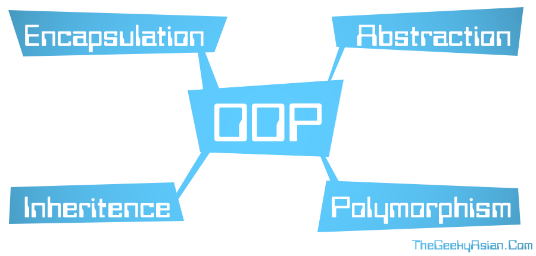

####################################################################################################
C++
####################################################################################################
****************************************************************************************************
The second course on programming language after C
****************************************************************************************************

.. |FullTime| date:: %Y/%m/%d %H:%M

.. meta::
   :http-equiv=Content-Language: en

.. topic:: Overview

    C++ course

    :Time: |FullTime|
    :Author: **Ahmad Yoosofan**
            `Ahmad Yoosofan <http://yoosofan.github.io/en>`_ `احمد یوسفان <http://yoosofan.github.io>`_

.. role:: cpp(code)
   :language: cpp

..  section-numbering::

.. contents:: Table of Contents
   :depth: 7

clang tidy

slides
################

.. code:: cpp

  class Game{
    public:
    Game(const Game&) = delete;
    Game& operator=(const Game&) = delete;
    Game();
    void run();
    private:
    void processEvents();
    void update();
    void render();

    sf::RenderWindow _window;
    sf::CircleShape  _player;
  };
  int main()
  {
      Game game;
      game.run();
      return 0;
  }

.. :

  https://www.learncpp.com/cpp-tutorial/converting-constructors-explicit-and-delete/

----

Arrays as pointers(I)
=======================
.. include:: src/myArray/100479.cpp
  :code: cpp
  :number-lines:
  :class: ltr
  :start-line: 2

.. :

  struct myArray{
   static const int MAX = 100;
   double a[MAX];
   int n;
   myArray(const double *ma, int k){
     if( k > MAX )
       k = MAX ;
     for(n = k--; k >= 0; k--)
       *(a+k) = *(ma+k);
   }

----

Arrays as pointers(II)
=======================
.. include:: src/myArray/100610.cpp
  :code: cpp
  :number-lines:
  :class: ltr
  :start-line: 2
  :end-line: 12

----

nullptr(I)
=====================
.. include:: src/myArray/100620.cpp
  :code: cpp
  :number-lines:
  :class: ltr
  :start-line: 4
  :end-line: 12

----

nullptr(II)
=====================
.. include:: src/myArray/100630.cpp
  :code: cpp
  :number-lines:
  :class: ltr
  :start-line: 4
  :end-line: 12

----

.. class:: substep

  * What is the point of having myArray struct ?
  * Why do we need this structure?
  * How can we have more functionality?
  * consider the follwoing example

  .. code:: cpp
    :number-lines:

    void f1(void){
      double x[]{10, 12, 34, 54};
      myArray d(x, sizeof(x) / sizeof(double));
      d.a[300] = 5000; //  dangerous
      d.print();
    }

----

.. include:: src/myArray/100640.cpp
  :code: cpp
  :number-lines:
  :class: ltr
  :start-line: 2
  :end-line: 10

.. include:: src/myArray/100640.cpp
  :code: cpp
  :number-lines:
  :class: ltr
  :start-line: 27
  :end-line: 31

----

.. include:: src/myArray/100650.cpp
  :code: cpp
  :number-lines:
  :class: ltr
  :start-line: 2
  :end-line: 12

----

yrd

.. :

  .. include:: src/myArray/100650.cpp
    :code: cpp
    :number-lines:
    :class: ltr
    :start-line: 32
    :end-line: 39

----

Error(I)
=========
.. include:: src/myArray/100660.cpp
  :code: cpp
  :number-lines:
  :class: ltr
  :start-line: 33
  :end-line: 40

----

Error(II)
=============
.. class:: substep

  * How can we protect these kind of mistakes?
  * Look at the following example

  .. code:: cpp

    void f1(void){
      double x[]{10, 12, 34, 54};
      myArray d(x, sizeof(x) / sizeof(double));
      d.set(30, 500);
      d.a[500] = 300;
      d.print();
    }

----

private & public
===================
.. include:: src/myArray/100710.cpp
  :code: cpp
  :number-lines:
  :class: ltr
  :start-line: 2
  :end-line: 17

----

The following code cannot be compiled

.. code:: cpp

  void f1(void){
    double x[]{10, 12, 34, 54};
    myArray d(x, sizeof(x) / sizeof(double));
    d.set(30, 500);
    d.a[500] = 300;
    d.print();
  }

----

You can only use public members

.. code:: cpp

  void f1(void){
    double x[]{10, 12, 34, 54};
    myArray d(x, sizeof(x) / sizeof(double));
    d.set(30, 500);
    // d.a[500] = 300;
    // d.n = 1000;
    d.print();
  }

----

* Think more about objects in real world
* Radio
* Car
* `....`

----

class
=======
.. include:: src/myArray/100740.cpp
  :code: cpp
  :number-lines:
  :class: ltr
  :start-line: 2
  :end-line: 17

----

new
=====
.. include:: src/myArray/100810.cpp
  :code: cpp
  :number-lines:

.. class:: substep

  * Scope
  * Life time

----

.. include:: src/polym01.cpp
    :code: cpp
    :number-lines:
    :class: ltr
    :start-line: 3
    :end-line: 18

----

:id: polym02-id

.. include:: src/polym01.cpp
    :code: cpp
    :number-lines:
    :class: ltr
    :start-line: 3
    :end-line: 18

.. include:: src/polym01.cpp
    :code: cpp
    :number-lines:
    :class: ltr substep
    :start-line: 19
    :end-line: 40

.. include:: src/polym01.cpp
    :code: cpp
    :number-lines:
    :class: ltr substep
    :start-line: 41
    :end-line: 51

.. code:: sh
  :class: substep

  0
  9
  0
  9

----

:id: polym01-id

.. code:: cpp
  :number-lines:

  class Shape{
    // ....
    public

    virtual int Area(void){
      return 0;
    }
  };

  class square: public Shape{
    int d;

    public:

    virtual int Area(void){
      return d*d;
    }
    // .....
  };

  void f1(void){
    Shape s;
    cout << s.Area() << endl;
    Square sq(3);
    cout << sq.Area() << endl;
    Shape *ps = &s;
    cout << ps->Area() << endl;
    ps = &sq;
    cout << ps -> Area() << endl;
  }

.. code:: sh

  0
  9
  0
  9

----

Object-Oriented Programming
####################################################################################################
Object-Oriented Programming is an object-oriented programming (OOPs) language as opposed to a process-oriented one. Process-oriented languages like C utilized programs where a list of instructions that acted on memory [#blockgeekspythonblockchain]_.

OOPs, on the other hand, allows for the creation of a blueprint called “class” from where one can generate objects which can interact with each other. These objects execute the program.

Now, there are four pillars to OOPs:

    * Encapsulation
    * Abstraction
    * Polymorphism
    * Inheritence

Encapsulation
****************************************************************************************************
Encapsulation is the idea of wrapping together data and function within one unit. The idea is to hide the initial state of the objects and to bind everything in a solid pack [#blockgeekspythonblockchain]_.

Abstraction
****************************************************************************************************
Abstraction means that a user can use the program without getting into the complications behind it.

Think of a car.

When you drive a car, all that you care about is putting your key in and maneuvering the vehicle in a way that you don’t hit anything else. You don’t care about how the engines work and how the ignition is burning your fuel.

Inheritance
****************************************************************************************************
Inheritance is one of the most important properties of OOPs.

Inheritance allows an object or a class to based upon another object or a class and retain some of its implementation. In most class-based object-oriented languages, an object created through inheritance acquires most of the properties and behaviors of the parent object

Polymorphism
****************************************************************************************************
Polymorphism is the property by which an operator in the language can have more than one properties. The most famous example of this is “+”. Not only is it used as the mathematical addition operator, but it can also be used to combine two strings into one as well. This is called concatenation.

Eg. if we add two strings “Block” + “Geeks” the result will be “BlockGeeks”.

Constructor
***************
Why is this working.

.. code:: cpp

    complexCls f1(void){
      double a=1;
      return a;
    }

.. include:: src/complexCls21.cpp
    :code: cpp

Compile Error

.. code:: sh

    g++ complexCls21.cpp
    complexCls21.cpp: In function ‘void f1()’:
    complexCls21.cpp:47:6: error: cannot bind non-const lvalue reference of type ‘complexCls&’ to an rvalue of type ‘complexCls’
       c=a+b;
         ~^~
    complexCls21.cpp:10:3: note:   initializing argument 1 of ‘complexCls::complexCls(complexCls&)’
       complexCls(complexCls&a)
       ^~~~~~~~~~
    complexCls21.cpp:20:14: note:   initializing argument 1 of ‘complexCls complexCls::operator=(complexCls)’
       complexCls operator=(complexCls a){
                  ^~~~~~~~
    complexCls21.cpp:50:11: error: cannot bind non-const lvalue reference of type ‘complexCls&’ to an rvalue of type ‘complexCls’
       c = a + 12;
               ^~
    complexCls21.cpp:10:3: note:   initializing argument 1 of ‘complexCls::complexCls(complexCls&)’
       complexCls(complexCls&a)
       ^~~~~~~~~~
    complexCls21.cpp:8:3: note:   after user-defined conversion: complexCls::complexCls(double, double)
       complexCls(double m=0 , double n=0) {re=m;im=n;}
       ^~~~~~~~~~
    complexCls21.cpp:14:14: note:   initializing argument 1 of ‘complexCls complexCls::operator+(complexCls)’
       complexCls operator+(complexCls a){
                  ^~~~~~~~

.. include:: src/complexCls22.cpp
    :code: cpp

Compile Error

.. code:: sh

    g++ complexCls22.cpp
    complexCls22.cpp: In function ‘void f1()’:
    complexCls22.cpp:52:9: error: no match for ‘operator+’ (operand types are ‘complexCls’ and ‘int’)
       c = a + 12;
           ~~^~~~
    complexCls22.cpp:16:14: note: candidate: complexCls complexCls::operator+(complexCls)
       complexCls operator+(complexCls a){
                  ^~~~~~~~
    complexCls22.cpp:16:14: note:   no known conversion for argument 1 from ‘int’ to ‘complexCls’
    In file included from /usr/include/c++/7/bits/stl_algobase.h:67:0,
                     from /usr/include/c++/7/bits/char_traits.h:39,
                     from /usr/include/c++/7/ios:40,
                     from /usr/include/c++/7/ostream:38,
                     from /usr/include/c++/7/iostream:39,
                     from complexCls22.cpp:2:
    /usr/include/c++/7/bits/stl_iterator.h:400:5: note: candidate: template<class _Iterator> std::reverse_iterator<_Iterator> std::operator+(typename std::reverse_iterator<_Iterator>::difference_type, const std::reverse_iterator<_Iterator>&)
         operator+(typename reverse_iterator<_Iterator>::difference_type __n,
         ^~~~~~~~
    /usr/include/c++/7/bits/stl_iterator.h:400:5: note:   template argument deduction/substitution failed:
    complexCls22.cpp:52:11: note:   mismatched types ‘const std::reverse_iterator<_Iterator>’ and ‘int’
       c = a + 12;
               ^~
    In file included from /usr/include/c++/7/bits/stl_algobase.h:67:0,
                     from /usr/include/c++/7/bits/char_traits.h:39,
                     from /usr/include/c++/7/ios:40,
                     from /usr/include/c++/7/ostream:38,
                     from /usr/include/c++/7/iostream:39,
                     from complexCls22.cpp:2:
    /usr/include/c++/7/bits/stl_iterator.h:1201:5: note: candidate: template<class _Iterator> std::move_iterator<_IteratorL> std::operator+(typename std::move_iterator<_IteratorL>::difference_type, const std::move_iterator<_IteratorL>&)
         operator+(typename move_iterator<_Iterator>::difference_type __n,
         ^~~~~~~~
    /usr/include/c++/7/bits/stl_iterator.h:1201:5: note:   template argument deduction/substitution failed:
    complexCls22.cpp:52:11: note:   mismatched types ‘const std::move_iterator<_IteratorL>’ and ‘int’
       c = a + 12;
               ^~
    In file included from /usr/include/c++/7/string:52:0,
                     from /usr/include/c++/7/bits/locale_classes.h:40,
                     from /usr/include/c++/7/bits/ios_base.h:41,
                     from /usr/include/c++/7/ios:42,
                     from /usr/include/c++/7/ostream:38,
                     from /usr/include/c++/7/iostream:39,
                     from complexCls22.cpp:2:
    /usr/include/c++/7/bits/basic_string.h:5888:5: note: candidate: template<class _CharT, class _Traits, class _Alloc> std::__cxx11::basic_string<_CharT, _Traits, _Alloc> std::operator+(const std::__cxx11::basic_string<_CharT, _Traits, _Alloc>&, const std::__cxx11::basic_string<_CharT, _Traits, _Alloc>&)
         operator+(const basic_string<_CharT, _Traits, _Alloc>& __lhs,
         ^~~~~~~~
    /usr/include/c++/7/bits/basic_string.h:5888:5: note:   template argument deduction/substitution failed:
    complexCls22.cpp:52:11: note:   ‘complexCls’ is not derived from ‘const std::__cxx11::basic_string<_CharT, _Traits, _Alloc>’
       c = a + 12;
               ^~
    In file included from /usr/include/c++/7/string:53:0,
                     from /usr/include/c++/7/bits/locale_classes.h:40,
                     from /usr/include/c++/7/bits/ios_base.h:41,
                     from /usr/include/c++/7/ios:42,
                     from /usr/include/c++/7/ostream:38,
                     from /usr/include/c++/7/iostream:39,
                     from complexCls22.cpp:2:
    /usr/include/c++/7/bits/basic_string.tcc:1157:5: note: candidate: template<class _CharT, class _Traits, class _Alloc> std::__cxx11::basic_string<_CharT, _Traits, _Alloc> std::operator+(const _CharT*, const std::__cxx11::basic_string<_CharT, _Traits, _Alloc>&)
         operator+(const _CharT* __lhs,
         ^~~~~~~~
    /usr/include/c++/7/bits/basic_string.tcc:1157:5: note:   template argument deduction/substitution failed:
    complexCls22.cpp:52:11: note:   mismatched types ‘const _CharT*’ and ‘complexCls’
       c = a + 12;
               ^~
    In file included from /usr/include/c++/7/string:53:0,
                     from /usr/include/c++/7/bits/locale_classes.h:40,
                     from /usr/include/c++/7/bits/ios_base.h:41,
                     from /usr/include/c++/7/ios:42,
                     from /usr/include/c++/7/ostream:38,
                     from /usr/include/c++/7/iostream:39,
                     from complexCls22.cpp:2:
    /usr/include/c++/7/bits/basic_string.tcc:1173:5: note: candidate: template<class _CharT, class _Traits, class _Alloc> std::__cxx11::basic_string<_CharT, _Traits, _Alloc> std::operator+(_CharT, const std::__cxx11::basic_string<_CharT, _Traits, _Alloc>&)
         operator+(_CharT __lhs, const basic_string<_CharT, _Traits, _Alloc>& __rhs)
         ^~~~~~~~
    /usr/include/c++/7/bits/basic_string.tcc:1173:5: note:   template argument deduction/substitution failed:
    complexCls22.cpp:52:11: note:   mismatched types ‘const std::__cxx11::basic_string<_CharT, _Traits, _Alloc>’ and ‘int’
       c = a + 12;
               ^~
    In file included from /usr/include/c++/7/string:52:0,
                     from /usr/include/c++/7/bits/locale_classes.h:40,
                     from /usr/include/c++/7/bits/ios_base.h:41,
                     from /usr/include/c++/7/ios:42,
                     from /usr/include/c++/7/ostream:38,
                     from /usr/include/c++/7/iostream:39,
                     from complexCls22.cpp:2:
    /usr/include/c++/7/bits/basic_string.h:5925:5: note: candidate: template<class _CharT, class _Traits, class _Alloc> std::__cxx11::basic_string<_CharT, _Traits, _Alloc> std::operator+(const std::__cxx11::basic_string<_CharT, _Traits, _Alloc>&, const _CharT*)
         operator+(const basic_string<_CharT, _Traits, _Alloc>& __lhs,
         ^~~~~~~~
    /usr/include/c++/7/bits/basic_string.h:5925:5: note:   template argument deduction/substitution failed:
    complexCls22.cpp:52:11: note:   ‘complexCls’ is not derived from ‘const std::__cxx11::basic_string<_CharT, _Traits, _Alloc>’
       c = a + 12;
               ^~
    In file included from /usr/include/c++/7/string:52:0,
                     from /usr/include/c++/7/bits/locale_classes.h:40,
                     from /usr/include/c++/7/bits/ios_base.h:41,
                     from /usr/include/c++/7/ios:42,
                     from /usr/include/c++/7/ostream:38,
                     from /usr/include/c++/7/iostream:39,
                     from complexCls22.cpp:2:
    /usr/include/c++/7/bits/basic_string.h:5941:5: note: candidate: template<class _CharT, class _Traits, class _Alloc> std::__cxx11::basic_string<_CharT, _Traits, _Alloc> std::operator+(const std::__cxx11::basic_string<_CharT, _Traits, _Alloc>&, _CharT)
         operator+(const basic_string<_CharT, _Traits, _Alloc>& __lhs, _CharT __rhs)
         ^~~~~~~~
    /usr/include/c++/7/bits/basic_string.h:5941:5: note:   template argument deduction/substitution failed:
    complexCls22.cpp:52:11: note:   ‘complexCls’ is not derived from ‘const std::__cxx11::basic_string<_CharT, _Traits, _Alloc>’
       c = a + 12;
               ^~
    In file included from /usr/include/c++/7/string:52:0,
                     from /usr/include/c++/7/bits/locale_classes.h:40,
                     from /usr/include/c++/7/bits/ios_base.h:41,
                     from /usr/include/c++/7/ios:42,
                     from /usr/include/c++/7/ostream:38,
                     from /usr/include/c++/7/iostream:39,
                     from complexCls22.cpp:2:
    /usr/include/c++/7/bits/basic_string.h:5953:5: note: candidate: template<class _CharT, class _Traits, class _Alloc> std::__cxx11::basic_string<_CharT, _Traits, _Alloc> std::operator+(std::__cxx11::basic_string<_CharT, _Traits, _Alloc>&&, const std::__cxx11::basic_string<_CharT, _Traits, _Alloc>&)
         operator+(basic_string<_CharT, _Traits, _Alloc>&& __lhs,
         ^~~~~~~~
    /usr/include/c++/7/bits/basic_string.h:5953:5: note:   template argument deduction/substitution failed:
    complexCls22.cpp:52:11: note:   ‘complexCls’ is not derived from ‘std::__cxx11::basic_string<_CharT, _Traits, _Alloc>’
       c = a + 12;
               ^~
    In file included from /usr/include/c++/7/string:52:0,
                     from /usr/include/c++/7/bits/locale_classes.h:40,
                     from /usr/include/c++/7/bits/ios_base.h:41,
                     from /usr/include/c++/7/ios:42,
                     from /usr/include/c++/7/ostream:38,
                     from /usr/include/c++/7/iostream:39,
                     from complexCls22.cpp:2:
    /usr/include/c++/7/bits/basic_string.h:5959:5: note: candidate: template<class _CharT, class _Traits, class _Alloc> std::__cxx11::basic_string<_CharT, _Traits, _Alloc> std::operator+(const std::__cxx11::basic_string<_CharT, _Traits, _Alloc>&, std::__cxx11::basic_string<_CharT, _Traits, _Alloc>&&)
         operator+(const basic_string<_CharT, _Traits, _Alloc>& __lhs,
         ^~~~~~~~
    /usr/include/c++/7/bits/basic_string.h:5959:5: note:   template argument deduction/substitution failed:
    complexCls22.cpp:52:11: note:   ‘complexCls’ is not derived from ‘const std::__cxx11::basic_string<_CharT, _Traits, _Alloc>’
       c = a + 12;
               ^~
    In file included from /usr/include/c++/7/string:52:0,
                     from /usr/include/c++/7/bits/locale_classes.h:40,
                     from /usr/include/c++/7/bits/ios_base.h:41,
                     from /usr/include/c++/7/ios:42,
                     from /usr/include/c++/7/ostream:38,
                     from /usr/include/c++/7/iostream:39,
                     from complexCls22.cpp:2:
    /usr/include/c++/7/bits/basic_string.h:5965:5: note: candidate: template<class _CharT, class _Traits, class _Alloc> std::__cxx11::basic_string<_CharT, _Traits, _Alloc> std::operator+(std::__cxx11::basic_string<_CharT, _Traits, _Alloc>&&, std::__cxx11::basic_string<_CharT, _Traits, _Alloc>&&)
         operator+(basic_string<_CharT, _Traits, _Alloc>&& __lhs,
         ^~~~~~~~
    /usr/include/c++/7/bits/basic_string.h:5965:5: note:   template argument deduction/substitution failed:
    complexCls22.cpp:52:11: note:   ‘complexCls’ is not derived from ‘std::__cxx11::basic_string<_CharT, _Traits, _Alloc>’
       c = a + 12;
               ^~
    In file included from /usr/include/c++/7/string:52:0,
                     from /usr/include/c++/7/bits/locale_classes.h:40,
                     from /usr/include/c++/7/bits/ios_base.h:41,
                     from /usr/include/c++/7/ios:42,
                     from /usr/include/c++/7/ostream:38,
                     from /usr/include/c++/7/iostream:39,
                     from complexCls22.cpp:2:
    /usr/include/c++/7/bits/basic_string.h:5977:5: note: candidate: template<class _CharT, class _Traits, class _Alloc> std::__cxx11::basic_string<_CharT, _Traits, _Alloc> std::operator+(const _CharT*, std::__cxx11::basic_string<_CharT, _Traits, _Alloc>&&)
         operator+(const _CharT* __lhs,
         ^~~~~~~~
    /usr/include/c++/7/bits/basic_string.h:5977:5: note:   template argument deduction/substitution failed:
    complexCls22.cpp:52:11: note:   mismatched types ‘const _CharT*’ and ‘complexCls’
       c = a + 12;
               ^~
    In file included from /usr/include/c++/7/string:52:0,
                     from /usr/include/c++/7/bits/locale_classes.h:40,
                     from /usr/include/c++/7/bits/ios_base.h:41,
                     from /usr/include/c++/7/ios:42,
                     from /usr/include/c++/7/ostream:38,
                     from /usr/include/c++/7/iostream:39,
                     from complexCls22.cpp:2:
    /usr/include/c++/7/bits/basic_string.h:5983:5: note: candidate: template<class _CharT, class _Traits, class _Alloc> std::__cxx11::basic_string<_CharT, _Traits, _Alloc> std::operator+(_CharT, std::__cxx11::basic_string<_CharT, _Traits, _Alloc>&&)
         operator+(_CharT __lhs,
         ^~~~~~~~
    /usr/include/c++/7/bits/basic_string.h:5983:5: note:   template argument deduction/substitution failed:
    complexCls22.cpp:52:11: note:   mismatched types ‘std::__cxx11::basic_string<_CharT, _Traits, _Alloc>’ and ‘int’
       c = a + 12;
               ^~
    In file included from /usr/include/c++/7/string:52:0,
                     from /usr/include/c++/7/bits/locale_classes.h:40,
                     from /usr/include/c++/7/bits/ios_base.h:41,
                     from /usr/include/c++/7/ios:42,
                     from /usr/include/c++/7/ostream:38,
                     from /usr/include/c++/7/iostream:39,
                     from complexCls22.cpp:2:
    /usr/include/c++/7/bits/basic_string.h:5989:5: note: candidate: template<class _CharT, class _Traits, class _Alloc> std::__cxx11::basic_string<_CharT, _Traits, _Alloc> std::operator+(std::__cxx11::basic_string<_CharT, _Traits, _Alloc>&&, const _CharT*)
         operator+(basic_string<_CharT, _Traits, _Alloc>&& __lhs,
         ^~~~~~~~
    /usr/include/c++/7/bits/basic_string.h:5989:5: note:   template argument deduction/substitution failed:
    complexCls22.cpp:52:11: note:   ‘complexCls’ is not derived from ‘std::__cxx11::basic_string<_CharT, _Traits, _Alloc>’
       c = a + 12;
               ^~
    In file included from /usr/include/c++/7/string:52:0,
                     from /usr/include/c++/7/bits/locale_classes.h:40,
                     from /usr/include/c++/7/bits/ios_base.h:41,
                     from /usr/include/c++/7/ios:42,
                     from /usr/include/c++/7/ostream:38,
                     from /usr/include/c++/7/iostream:39,
                     from complexCls22.cpp:2:
    /usr/include/c++/7/bits/basic_string.h:5995:5: note: candidate: template<class _CharT, class _Traits, class _Alloc> std::__cxx11::basic_string<_CharT, _Traits, _Alloc> std::operator+(std::__cxx11::basic_string<_CharT, _Traits, _Alloc>&&, _CharT)
         operator+(basic_string<_CharT, _Traits, _Alloc>&& __lhs,
         ^~~~~~~~
    /usr/include/c++/7/bits/basic_string.h:5995:5: note:   template argument deduction/substitution failed:
    complexCls22.cpp:52:11: note:   ‘complexCls’ is not derived from ‘std::__cxx11::basic_string<_CharT, _Traits, _Alloc>’
       c = a + 12;
               ^~

Main error is:

code:: sh

    c = a + 12;
           ^~

.. include:: src/complexCls23.cpp
    :code: cpp

Compiled!

.. include:: src/complexCls24.cpp
    :code: cpp

.. code:: sh

    g++ complexCls24.cpp
    complexCls24.cpp: In function ‘void f1()’:
    complexCls24.cpp:48:6: error: cannot bind non-const lvalue reference of type ‘complexCls&’ to an rvalue of type ‘complexCls’
       c=a+b;
         ~^~
    complexCls24.cpp:11:3: note:   initializing argument 1 of ‘complexCls::complexCls(complexCls&)’
       complexCls(complexCls&a)
       ^~~~~~~~~~
    complexCls24.cpp:21:14: note:   initializing argument 1 of ‘complexCls complexCls::operator=(complexCls)’
       complexCls operator=(complexCls a){
                  ^~~~~~~~

Main error

.. code:: sh

    cannot bind non-const lvalue reference

change

.. code:: cpp

    complexCls operator=(complexCls a){

.. code:: cpp

    complexCls operator=(const complexCls& a){

.. include:: src/complexCls25.cpp
    :code: cpp

Adding line:

.. code:: cpp

    c = a + 12;

.. include:: src/complexCls26.cpp
    :code: cpp

Error

.. code:: sh

    g++ complexCls24.cpp
    complexCls24.cpp: In function ‘void f1()’:
    complexCls24.cpp:48:6: error: cannot bind non-const lvalue reference of type ‘complexCls&’ to an rvalue of type ‘complexCls’
       c=a+b;
         ~^~
    complexCls24.cpp:11:3: note:   initializing argument 1 of ‘complexCls::complexCls(complexCls&)’
       complexCls(complexCls&a)
       ^~~~~~~~~~
    complexCls24.cpp:21:14: note:   initializing argument 1 of ‘complexCls complexCls::operator=(complexCls)’
       complexCls operator=(complexCls a){
                  ^~~~~~~~
    ahmad@ahmad-X58A-UD3R:/media/ahmad/yoosofan/yoosofanFiles/yoosofan/course/cpp/slides/rst/src$ g++ complexCls24.cpp
    complexCls24.cpp: In function ‘void f1()’:
    complexCls24.cpp:49:6: error: cannot bind non-const lvalue reference of type ‘complexCls&’ to an rvalue of type ‘complexCls’
       c=a+b;
         ~^~
    complexCls24.cpp:12:3: note:   initializing argument 1 of ‘complexCls::complexCls(complexCls&)’
       complexCls(complexCls&a)
       ^~~~~~~~~~
    complexCls24.cpp:22:14: note:   initializing argument 1 of ‘complexCls complexCls::operator=(complexCls)’
       complexCls operator=(complexCls a){
                  ^~~~~~~~
    ahmad@ahmad-X58A-UD3R:/media/ahmad/yoosofan/yoosofanFiles/yoosofan/course/cpp/slides/rst/src$ g++ complexCls25.cpp
    complexCls25.cpp: In function ‘void f1()’:
    complexCls25.cpp:48:6: error: cannot bind non-const lvalue reference of type ‘complexCls&’ to an rvalue of type ‘complexCls’
       c=a+b;
         ~^~
    complexCls25.cpp:21:14: note:   initializing argument 1 of ‘complexCls complexCls::operator=(complexCls&)’
       complexCls operator=(complexCls&a){
                  ^~~~~~~~
    ahmad@ahmad-X58A-UD3R:/media/ahmad/yoosofan/yoosofanFiles/yoosofan/course/cpp/slides/rst/src$ g++ complexCls23.cpp
    ahmad@ahmad-X58A-UD3R:/media/ahmad/yoosofan/yoosofanFiles/yoosofan/course/cpp/slides/rst/src$ g++ complexCls24.cpp
    complexCls24.cpp: In function ‘void f1()’:
    complexCls24.cpp:49:6: error: cannot bind non-const lvalue reference of type ‘complexCls&’ to an rvalue of type ‘complexCls’
       c=a+b;
         ~^~
    complexCls24.cpp:12:3: note:   initializing argument 1 of ‘complexCls::complexCls(complexCls&)’
       complexCls(complexCls&a)
       ^~~~~~~~~~
    complexCls24.cpp:22:14: note:   initializing argument 1 of ‘complexCls complexCls::operator=(complexCls)’
       complexCls operator=(complexCls a){
                  ^~~~~~~~
    ahmad@ahmad-X58A-UD3R:/media/ahmad/yoosofan/yoosofanFiles/yoosofan/course/cpp/slides/rst/src$ g++ complexCls25.cpp
    complexCls25.cpp: In function ‘void f1()’:
    complexCls25.cpp:48:6: error: cannot bind non-const lvalue reference of type ‘complexCls&’ to an rvalue of type ‘complexCls’
       c=a+b;
         ~^~
    complexCls25.cpp:21:14: note:   initializing argument 1 of ‘complexCls complexCls::operator=(complexCls&)’
       complexCls operator=(complexCls&a){
                  ^~~~~~~~
    ahmad@ahmad-X58A-UD3R:/media/ahmad/yoosofan/yoosofanFiles/yoosofan/course/cpp/slides/rst/src$ g++ complexCls25.cpp
    complexCls25.cpp: In function ‘void f1()’:
    complexCls25.cpp:48:6: error: cannot bind non-const lvalue reference of type ‘complexCls&’ to an rvalue of type ‘complexCls’
       c=a+b;
         ~^~
    complexCls25.cpp:11:3: note:   initializing argument 1 of ‘complexCls::complexCls(complexCls&)’
       complexCls(complexCls&a)
       ^~~~~~~~~~
    complexCls25.cpp:21:14: note:   initializing argument 1 of ‘complexCls complexCls::operator=(complexCls)’
       complexCls operator=(const complexCls a){
                  ^~~~~~~~
    ahmad@ahmad-X58A-UD3R:/media/ahmad/yoosofan/yoosofanFiles/yoosofan/course/cpp/slides/rst/src$ g++ complexCls25.cpp
    ahmad@ahmad-X58A-UD3R:/media/ahmad/yoosofan/yoosofanFiles/yoosofan/course/cpp/slides/rst/src$ g++ complexCls26.cpp
    complexCls26.cpp: In function ‘void f1()’:
    complexCls26.cpp:52:9: error: no match for ‘operator+’ (operand types are ‘complexCls’ and ‘int’)
       c = a + 12;
           ~~^~~~
    complexCls26.cpp:16:14: note: candidate: complexCls complexCls::operator+(complexCls)
       complexCls operator+(complexCls a){
                  ^~~~~~~~
    complexCls26.cpp:16:14: note:   no known conversion for argument 1 from ‘int’ to ‘complexCls’
    In file included from /usr/include/c++/7/bits/stl_algobase.h:67:0,
                     from /usr/include/c++/7/bits/char_traits.h:39,
                     from /usr/include/c++/7/ios:40,
                     from /usr/include/c++/7/ostream:38,
                     from /usr/include/c++/7/iostream:39,
                     from complexCls26.cpp:2:
    /usr/include/c++/7/bits/stl_iterator.h:400:5: note: candidate: template<class _Iterator> std::reverse_iterator<_Iterator> std::operator+(typename std::reverse_iterator<_Iterator>::difference_type, const std::reverse_iterator<_Iterator>&)
         operator+(typename reverse_iterator<_Iterator>::difference_type __n,
         ^~~~~~~~
    /usr/include/c++/7/bits/stl_iterator.h:400:5: note:   template argument deduction/substitution failed:
    complexCls26.cpp:52:11: note:   mismatched types ‘const std::reverse_iterator<_Iterator>’ and ‘int’
       c = a + 12;
               ^~
    In file included from /usr/include/c++/7/bits/stl_algobase.h:67:0,
                     from /usr/include/c++/7/bits/char_traits.h:39,
                     from /usr/include/c++/7/ios:40,
                     from /usr/include/c++/7/ostream:38,
                     from /usr/include/c++/7/iostream:39,
                     from complexCls26.cpp:2:
    /usr/include/c++/7/bits/stl_iterator.h:1201:5: note: candidate: template<class _Iterator> std::move_iterator<_IteratorL> std::operator+(typename std::move_iterator<_IteratorL>::difference_type, const std::move_iterator<_IteratorL>&)
         operator+(typename move_iterator<_Iterator>::difference_type __n,
         ^~~~~~~~
    /usr/include/c++/7/bits/stl_iterator.h:1201:5: note:   template argument deduction/substitution failed:
    complexCls26.cpp:52:11: note:   mismatched types ‘const std::move_iterator<_IteratorL>’ and ‘int’
       c = a + 12;
               ^~
    In file included from /usr/include/c++/7/string:52:0,
                     from /usr/include/c++/7/bits/locale_classes.h:40,
                     from /usr/include/c++/7/bits/ios_base.h:41,
                     from /usr/include/c++/7/ios:42,
                     from /usr/include/c++/7/ostream:38,
                     from /usr/include/c++/7/iostream:39,
                     from complexCls26.cpp:2:
    /usr/include/c++/7/bits/basic_string.h:5888:5: note: candidate: template<class _CharT, class _Traits, class _Alloc> std::__cxx11::basic_string<_CharT, _Traits, _Alloc> std::operator+(const std::__cxx11::basic_string<_CharT, _Traits, _Alloc>&, const std::__cxx11::basic_string<_CharT, _Traits, _Alloc>&)
         operator+(const basic_string<_CharT, _Traits, _Alloc>& __lhs,
         ^~~~~~~~
    /usr/include/c++/7/bits/basic_string.h:5888:5: note:   template argument deduction/substitution failed:
    complexCls26.cpp:52:11: note:   ‘complexCls’ is not derived from ‘const std::__cxx11::basic_string<_CharT, _Traits, _Alloc>’
       c = a + 12;
               ^~
    In file included from /usr/include/c++/7/string:53:0,
                     from /usr/include/c++/7/bits/locale_classes.h:40,
                     from /usr/include/c++/7/bits/ios_base.h:41,
                     from /usr/include/c++/7/ios:42,
                     from /usr/include/c++/7/ostream:38,
                     from /usr/include/c++/7/iostream:39,
                     from complexCls26.cpp:2:
    /usr/include/c++/7/bits/basic_string.tcc:1157:5: note: candidate: template<class _CharT, class _Traits, class _Alloc> std::__cxx11::basic_string<_CharT, _Traits, _Alloc> std::operator+(const _CharT*, const std::__cxx11::basic_string<_CharT, _Traits, _Alloc>&)
         operator+(const _CharT* __lhs,
         ^~~~~~~~
    /usr/include/c++/7/bits/basic_string.tcc:1157:5: note:   template argument deduction/substitution failed:
    complexCls26.cpp:52:11: note:   mismatched types ‘const _CharT*’ and ‘complexCls’
       c = a + 12;
               ^~
    In file included from /usr/include/c++/7/string:53:0,
                     from /usr/include/c++/7/bits/locale_classes.h:40,
                     from /usr/include/c++/7/bits/ios_base.h:41,
                     from /usr/include/c++/7/ios:42,
                     from /usr/include/c++/7/ostream:38,
                     from /usr/include/c++/7/iostream:39,
                     from complexCls26.cpp:2:
    /usr/include/c++/7/bits/basic_string.tcc:1173:5: note: candidate: template<class _CharT, class _Traits, class _Alloc> std::__cxx11::basic_string<_CharT, _Traits, _Alloc> std::operator+(_CharT, const std::__cxx11::basic_string<_CharT, _Traits, _Alloc>&)
         operator+(_CharT __lhs, const basic_string<_CharT, _Traits, _Alloc>& __rhs)
         ^~~~~~~~
    /usr/include/c++/7/bits/basic_string.tcc:1173:5: note:   template argument deduction/substitution failed:
    complexCls26.cpp:52:11: note:   mismatched types ‘const std::__cxx11::basic_string<_CharT, _Traits, _Alloc>’ and ‘int’
       c = a + 12;
               ^~
    In file included from /usr/include/c++/7/string:52:0,
                     from /usr/include/c++/7/bits/locale_classes.h:40,
                     from /usr/include/c++/7/bits/ios_base.h:41,
                     from /usr/include/c++/7/ios:42,
                     from /usr/include/c++/7/ostream:38,
                     from /usr/include/c++/7/iostream:39,
                     from complexCls26.cpp:2:
    /usr/include/c++/7/bits/basic_string.h:5925:5: note: candidate: template<class _CharT, class _Traits, class _Alloc> std::__cxx11::basic_string<_CharT, _Traits, _Alloc> std::operator+(const std::__cxx11::basic_string<_CharT, _Traits, _Alloc>&, const _CharT*)
         operator+(const basic_string<_CharT, _Traits, _Alloc>& __lhs,
         ^~~~~~~~
    /usr/include/c++/7/bits/basic_string.h:5925:5: note:   template argument deduction/substitution failed:
    complexCls26.cpp:52:11: note:   ‘complexCls’ is not derived from ‘const std::__cxx11::basic_string<_CharT, _Traits, _Alloc>’
       c = a + 12;
               ^~
    In file included from /usr/include/c++/7/string:52:0,
                     from /usr/include/c++/7/bits/locale_classes.h:40,
                     from /usr/include/c++/7/bits/ios_base.h:41,
                     from /usr/include/c++/7/ios:42,
                     from /usr/include/c++/7/ostream:38,
                     from /usr/include/c++/7/iostream:39,
                     from complexCls26.cpp:2:
    /usr/include/c++/7/bits/basic_string.h:5941:5: note: candidate: template<class _CharT, class _Traits, class _Alloc> std::__cxx11::basic_string<_CharT, _Traits, _Alloc> std::operator+(const std::__cxx11::basic_string<_CharT, _Traits, _Alloc>&, _CharT)
         operator+(const basic_string<_CharT, _Traits, _Alloc>& __lhs, _CharT __rhs)
         ^~~~~~~~
    /usr/include/c++/7/bits/basic_string.h:5941:5: note:   template argument deduction/substitution failed:
    complexCls26.cpp:52:11: note:   ‘complexCls’ is not derived from ‘const std::__cxx11::basic_string<_CharT, _Traits, _Alloc>’
       c = a + 12;
               ^~
    In file included from /usr/include/c++/7/string:52:0,
                     from /usr/include/c++/7/bits/locale_classes.h:40,
                     from /usr/include/c++/7/bits/ios_base.h:41,
                     from /usr/include/c++/7/ios:42,
                     from /usr/include/c++/7/ostream:38,
                     from /usr/include/c++/7/iostream:39,
                     from complexCls26.cpp:2:
    /usr/include/c++/7/bits/basic_string.h:5953:5: note: candidate: template<class _CharT, class _Traits, class _Alloc> std::__cxx11::basic_string<_CharT, _Traits, _Alloc> std::operator+(std::__cxx11::basic_string<_CharT, _Traits, _Alloc>&&, const std::__cxx11::basic_string<_CharT, _Traits, _Alloc>&)
         operator+(basic_string<_CharT, _Traits, _Alloc>&& __lhs,
         ^~~~~~~~
    /usr/include/c++/7/bits/basic_string.h:5953:5: note:   template argument deduction/substitution failed:
    complexCls26.cpp:52:11: note:   ‘complexCls’ is not derived from ‘std::__cxx11::basic_string<_CharT, _Traits, _Alloc>’
       c = a + 12;
               ^~
    In file included from /usr/include/c++/7/string:52:0,
                     from /usr/include/c++/7/bits/locale_classes.h:40,
                     from /usr/include/c++/7/bits/ios_base.h:41,
                     from /usr/include/c++/7/ios:42,
                     from /usr/include/c++/7/ostream:38,
                     from /usr/include/c++/7/iostream:39,
                     from complexCls26.cpp:2:
    /usr/include/c++/7/bits/basic_string.h:5959:5: note: candidate: template<class _CharT, class _Traits, class _Alloc> std::__cxx11::basic_string<_CharT, _Traits, _Alloc> std::operator+(const std::__cxx11::basic_string<_CharT, _Traits, _Alloc>&, std::__cxx11::basic_string<_CharT, _Traits, _Alloc>&&)
         operator+(const basic_string<_CharT, _Traits, _Alloc>& __lhs,
         ^~~~~~~~
    /usr/include/c++/7/bits/basic_string.h:5959:5: note:   template argument deduction/substitution failed:
    complexCls26.cpp:52:11: note:   ‘complexCls’ is not derived from ‘const std::__cxx11::basic_string<_CharT, _Traits, _Alloc>’
       c = a + 12;
               ^~
    In file included from /usr/include/c++/7/string:52:0,
                     from /usr/include/c++/7/bits/locale_classes.h:40,
                     from /usr/include/c++/7/bits/ios_base.h:41,
                     from /usr/include/c++/7/ios:42,
                     from /usr/include/c++/7/ostream:38,
                     from /usr/include/c++/7/iostream:39,
                     from complexCls26.cpp:2:
    /usr/include/c++/7/bits/basic_string.h:5965:5: note: candidate: template<class _CharT, class _Traits, class _Alloc> std::__cxx11::basic_string<_CharT, _Traits, _Alloc> std::operator+(std::__cxx11::basic_string<_CharT, _Traits, _Alloc>&&, std::__cxx11::basic_string<_CharT, _Traits, _Alloc>&&)
         operator+(basic_string<_CharT, _Traits, _Alloc>&& __lhs,
         ^~~~~~~~
    /usr/include/c++/7/bits/basic_string.h:5965:5: note:   template argument deduction/substitution failed:
    complexCls26.cpp:52:11: note:   ‘complexCls’ is not derived from ‘std::__cxx11::basic_string<_CharT, _Traits, _Alloc>’
       c = a + 12;
               ^~
    In file included from /usr/include/c++/7/string:52:0,
                     from /usr/include/c++/7/bits/locale_classes.h:40,
                     from /usr/include/c++/7/bits/ios_base.h:41,
                     from /usr/include/c++/7/ios:42,
                     from /usr/include/c++/7/ostream:38,
                     from /usr/include/c++/7/iostream:39,
                     from complexCls26.cpp:2:
    /usr/include/c++/7/bits/basic_string.h:5977:5: note: candidate: template<class _CharT, class _Traits, class _Alloc> std::__cxx11::basic_string<_CharT, _Traits, _Alloc> std::operator+(const _CharT*, std::__cxx11::basic_string<_CharT, _Traits, _Alloc>&&)
         operator+(const _CharT* __lhs,
         ^~~~~~~~
    /usr/include/c++/7/bits/basic_string.h:5977:5: note:   template argument deduction/substitution failed:
    complexCls26.cpp:52:11: note:   mismatched types ‘const _CharT*’ and ‘complexCls’
       c = a + 12;
               ^~
    In file included from /usr/include/c++/7/string:52:0,
                     from /usr/include/c++/7/bits/locale_classes.h:40,
                     from /usr/include/c++/7/bits/ios_base.h:41,
                     from /usr/include/c++/7/ios:42,
                     from /usr/include/c++/7/ostream:38,
                     from /usr/include/c++/7/iostream:39,
                     from complexCls26.cpp:2:
    /usr/include/c++/7/bits/basic_string.h:5983:5: note: candidate: template<class _CharT, class _Traits, class _Alloc> std::__cxx11::basic_string<_CharT, _Traits, _Alloc> std::operator+(_CharT, std::__cxx11::basic_string<_CharT, _Traits, _Alloc>&&)
         operator+(_CharT __lhs,
         ^~~~~~~~
    /usr/include/c++/7/bits/basic_string.h:5983:5: note:   template argument deduction/substitution failed:
    complexCls26.cpp:52:11: note:   mismatched types ‘std::__cxx11::basic_string<_CharT, _Traits, _Alloc>’ and ‘int’
       c = a + 12;
               ^~
    In file included from /usr/include/c++/7/string:52:0,
                     from /usr/include/c++/7/bits/locale_classes.h:40,
                     from /usr/include/c++/7/bits/ios_base.h:41,
                     from /usr/include/c++/7/ios:42,
                     from /usr/include/c++/7/ostream:38,
                     from /usr/include/c++/7/iostream:39,
                     from complexCls26.cpp:2:
    /usr/include/c++/7/bits/basic_string.h:5989:5: note: candidate: template<class _CharT, class _Traits, class _Alloc> std::__cxx11::basic_string<_CharT, _Traits, _Alloc> std::operator+(std::__cxx11::basic_string<_CharT, _Traits, _Alloc>&&, const _CharT*)
         operator+(basic_string<_CharT, _Traits, _Alloc>&& __lhs,
         ^~~~~~~~
    /usr/include/c++/7/bits/basic_string.h:5989:5: note:   template argument deduction/substitution failed:
    complexCls26.cpp:52:11: note:   ‘complexCls’ is not derived from ‘std::__cxx11::basic_string<_CharT, _Traits, _Alloc>’
       c = a + 12;
               ^~
    In file included from /usr/include/c++/7/string:52:0,
                     from /usr/include/c++/7/bits/locale_classes.h:40,
                     from /usr/include/c++/7/bits/ios_base.h:41,
                     from /usr/include/c++/7/ios:42,
                     from /usr/include/c++/7/ostream:38,
                     from /usr/include/c++/7/iostream:39,
                     from complexCls26.cpp:2:
    /usr/include/c++/7/bits/basic_string.h:5995:5: note: candidate: template<class _CharT, class _Traits, class _Alloc> std::__cxx11::basic_string<_CharT, _Traits, _Alloc> std::operator+(std::__cxx11::basic_string<_CharT, _Traits, _Alloc>&&, _CharT)
         operator+(basic_string<_CharT, _Traits, _Alloc>&& __lhs,
         ^~~~~~~~
    /usr/include/c++/7/bits/basic_string.h:5995:5: note:   template argument deduction/substitution failed:
    complexCls26.cpp:52:11: note:   ‘complexCls’ is not derived from ‘std::__cxx11::basic_string<_CharT, _Traits, _Alloc>’
       c = a + 12;
               ^~

Main error is

.. code:: sh

    c = a + 12;
           ^~

Remove **explicit**

.. include:: src/complexCls27.cpp
    :code: cpp

Compile error

.. code:: sh

    g++ complexCls27.cpp
    complexCls27.cpp: In function ‘void f1()’:
    complexCls27.cpp:52:11: error: cannot bind non-const lvalue reference of type ‘complexCls&’ to an rvalue of type ‘complexCls’
       c = a + 12;
               ^~
    complexCls27.cpp:12:3: note:   initializing argument 1 of ‘complexCls::complexCls(complexCls&)’
       complexCls(complexCls&a)
       ^~~~~~~~~~
    complexCls27.cpp:9:3: note:   after user-defined conversion: complexCls::complexCls(double, double)
       complexCls(double m=0, double n=0)
       ^~~~~~~~~~
    complexCls27.cpp:16:14: note:   initializing argument 1 of ‘complexCls complexCls::operator+(complexCls)’
       complexCls operator+(complexCls a){
                  ^~~~~~~~

Change

.. code:: cpp

    complexCls(complexCls&a){

to

.. code:: cpp

    complexCls(const complexCls&a){

.. include:: src/complexCls28.cpp
    :code: cpp

Run

.. code:: sh

    ./a.out
    Copy constructor
     c is zero
    (2,3)
    Copy constructor
    Copy constructor
    Copy constructor
    destructor
    destructor
    destructor
    Copy constructor
    Copy constructor
    destructor
    destructor
    destructor
    terminate called after throwing an instance of 'int'
    Aborted (core dumped)

default constructors
====================================================================================================
A default constructor is a constructor that either has no parameters, or if it has parameters, all the parameters have default values.

If no user-defined constructor exists for a class A and one is needed, the compiler implicitly declares a default parameterless constructor A::A(). This constructor is an inline public member of its class. The compiler will implicitly define A::A() when the compiler uses this constructor to create an object of type A. The constructor will have no constructor initializer and a null body.

The compiler first implicitly defines the implicitly declared C++11 beginsor explicitly defaultedC++11 ends constructors of the base classes and nonstatic data members of a class A before defining the implicitly declared C++11 beginsor explicitly defaultedC++11 ends constructor of A. No default constructor is created for a class that has any constant or reference type members.

A constructor of a class A is trivial if all the following are true:

It is implicitly declared C++11 beginsor explicitly defaultedC++11 ends.
A has no virtual functions and no virtual base classes
All the direct base classes of A have trivial constructors
The classes of all the nonstatic data members of A have trivial constructors
If any of the above are false, then the constructor is nontrivial.

A union member cannot be of a class type that has a nontrivial constructor.

Like all functions, a constructor can have default arguments. They are used to initialize member objects. If default values are supplied, the trailing arguments can be omitted in the expression list of the constructor. Note that if a constructor has any arguments that do not have default values, it is not a default constructor.

The following example defines a class with one constructor and two default constructors.

A default constructor is a constructor that either has no parameters, or if it has parameters, all the parameters have default values.

.. code:: cpp

    class X {
    public:
      X();                       // Default constructor with no arguments
      X(int = 0);                // Default constructor with one default argument
      X(int, int , int = 0);     // Constructor
    };

.. include:: src/constructor_default01.cpp
  :code: cpp
  :number-lines:

.. comment:

    https://www.ibm.com/support/knowledgecenter/en/SSLTBW_2.3.0/com.ibm.zos.v2r3.cbclx01/cplr376.htm
    .. image:: img/memory_segmentation_logical_address.png
       :align: center

default keywords in class
====================================================================================================
stackoverflow: what-does-default-mean-after-a-class-function-declaration
----------------------------------------------------------------------------------------------------
`<https://stackoverflow.com/questions/6502828/what-does-default-mean-after-a-class-function-declaration>`_

I've seen default used next to function declarations in a class. What does it do?

.. code:: cpp

    class C {
      C(const C&) = default;
      C(C&&) = default;
      C& operator=(const C&) & = default;
      C& operator=(C&&) & = default;
      virtual ~C() { }
    };

`<https://stackoverflow.com/a/6502854/886607>`_

It's a new C++11 feature.

It means that you want to use the compiler-generated version of that function, so you don't need to specify a body.

You can also use = delete to specify that you don't want the compiler to generate that function automatically.

With the introduction of move constructors and move assignment operators, the rules for when automatic versions of constructors, destructors and assignment operators are generated has become quite complex. Using = default and = delete makes things easier as you don't need to remember the rules: you just say what you want to happen.

`<https://stackoverflow.com/a/6502860/886607>`_

This is a new C++0x feature that tells the compiler to create the default version of the respective constructor or assignment operator, i.e. the one which just performs the copy or move action for each member. This is useful because the move constructor isn't always generated by default (e.g. if you have a custom destructor), unlike the copy constructor (and likewise for assignment), but if there's nothing non-trivial to write, it's better to let the compiler handle it than to spell it out yourself each time.

Also notice that a default constructor would not be generated if you provide any other non-default constructor. If you still want the default constructor, too, you can use this syntax to have the compiler make one.

As another use case, there are several situations in which a copy constructor would not be generated implicitly (e.g. if you provide a custom move constructor). If you still want the default version, you can request it with this syntax.

See Section 12.8 of the standard for details.

wikipedia: Explicitly_defaulted_and_deleted_special_member_functions
----------------------------------------------------------------------------------------------------

`<https://en.wikipedia.org/wiki/C%2B%2B11#Explicitly_defaulted_and_deleted_special_member_functions>`_

Explicitly defaulted and deleted special member functions
In C++03, the compiler provides, for classes that do not provide them for themselves, a default constructor, a copy constructor, a copy assignment operator (operator=), and a destructor. The programmer can override these defaults by defining custom versions. C++ also defines several global operators (such as operator new) that work on all classes, which the programmer can override.

However, there is very little control over creating these defaults. Making a class inherently non-copyable, for example, requires declaring a private copy constructor and copy assignment operator and not defining them. Attempting to use these functions is a violation of the One Definition Rule (ODR). While a diagnostic message is not required,[16] violations may result in a linker error.

In the case of the default constructor, the compiler will not generate a default constructor if a class is defined with any constructors. This is useful in many cases, but it is also useful to be able to have both specialized constructors and the compiler-generated default.

C++11 allows the explicit defaulting and deleting of these special member functions.[17] For example, this type explicitly declares that it is using the default constructor:

.. code:: c++

    struct SomeType
    {
        SomeType() = default; //The default constructor is explicitly stated.
        SomeType(OtherType value);
    };

Alternatively, certain features can be explicitly disabled. For example, this type is non-copyable:

.. code:: c++

    struct NonCopyable
    {
        NonCopyable() = default;
        NonCopyable(const NonCopyable&) = delete;
        NonCopyable& operator=(const NonCopyable&) = delete;
    };

The = delete specifier can be used to prohibit calling any function, which can be used to disallow calling a member function with particular parameters. For example:

.. code:: c++

    struct NoInt
    {
        void f(double i);
        void f(int) = delete;
    };

An attempt to call f() with an int will be rejected by the compiler, instead of performing a silent conversion to double. This can be generalized to disallow calling the function with any type other than double as follows:

.. code:: c++

    struct OnlyDouble
    {
        void f(double d);
        template<class T> void f(T) = delete;
    };

cppreference: default_constructor
----------------------------------------------------------------------------------------------------

`<https://en.cppreference.com/w/cpp/language/default_constructor>`_

A default constructor is a constructor which can be called with no arguments (either defined with an empty parameter list, or with default arguments provided for every parameter). A type with a public default constructor is `DefaultConstructible <https://en.cppreference.com/w/cpp/named_req/DefaultConstructible>`_ .

Syntax

========================================  ==============  =======================
code                                      number          comments
========================================  ==============  =======================
ClassName ( ) ;                             (1)
ClassName :: ClassName ( ) body             (2)
ClassName() = delete ;                      (3)             (since C++11)
ClassName() = default ;                     (4)             (since C++11)
ClassName :: ClassName ( ) = default ;      (5)             (since C++11)
========================================  ==============  =======================

Explanation
^^^^^^^^^^^^^^^^^^^^^^^^^^^^^^^^^^^^^^^^^^^^^^^^^^^^^^^^^^^^^^^^^^^^^^^^^^^^^^^^^^^^^^^^^^^^^^^^^^^^

#.  Declaration of a default constructor inside of class definition.
#.  Definition of the constructor outside of class definition (the class must contain a declaration (1)). See `constructors and member initailizer lists <https://en.cppreference.com/w/cpp/language/initializer_list>`_ for details on the constructor ``body``
#.  Deleted default constructor: if it is selected by `overload resolution <https://en.cppreference.com/w/cpp/language/overload_resolution>`_, the program fails to compile.
#.  Defaulted default constructor: the compiler will define the implicit default constructor even if other constructors are present.
#.  Defaulted default constructor outside of class definition (the class must contain a declaration (1)). Such constructor is treated as user-provided (see below and `value initialization <https://en.cppreference.com/w/cpp/language/value_initialization>`_).

ClassName is the identifier of the enclosing class

Default constructors are called during `default initializations <https://en.cppreference.com/w/cpp/language/default_initialization>`_ and `value initializations <https://en.cppreference.com/w/cpp/language/value_initialization>`_.

Implicitly-declared default constructor
^^^^^^^^^^^^^^^^^^^^^^^^^^^^^^^^^^^^^^^^^^^^^^^^^^^^^^^^^^^^^^^^^^^^^^^^^^^^^^^^^^^^^^^^^^^^^^^^^^^^

If no user-declared constructors of any kind are provided for a class type (**struct**, **class**, or **union**), the compiler will always declare a default constructor as an inline public member of its class.

If some user-declared constructors are present, the user may still force the automatic generation of a default constructor by the compiler that would be implicitly-declared otherwise with the keyword default.    (since C++11)
The implicitly-declared (or defaulted on its first declaration) default constructor has an exception specification as described in `dynamic exception specification <https://en.cppreference.com/w/cpp/language/except_spec>`_ (until C++17)`exception specification  <https://en.cppreference.com/w/cpp/language/noexcept_spec>`_ (since C++17)

Implicitly-defined default constructor
^^^^^^^^^^^^^^^^^^^^^^^^^^^^^^^^^^^^^^^^^^^^^^^^^^^^^^^^^^^^^^^^^^^^^^^^^^^^^^^^^^^^^^^^^^^^^^^^^^^^

If the implicitly-declared default constructor is not defined as deleted, it is defined (that is, a function body is generated and compiled) by the compiler if `odr-used <https://en.cppreference.com/w/cpp/language/definition#ODR-use>`_, and it has exactly the same effect as a user-defined constructor with empty body and empty initializer list. That is, it calls the default constructors of the bases and of the non-static members of this class. If this satisfies the requirements of a `constexpr constructor <https://en.cppreference.com/w/cpp/language/constexpr>`_, the generated constructor is constexpr. (since C++11)

If some user-defined constructors are present, the user may still force the automatic generation of a default constructor by the compiler that would be implicitly-declared otherwise with the keyword default. (since C++11)

Deleted implicitly-declared default constructor
^^^^^^^^^^^^^^^^^^^^^^^^^^^^^^^^^^^^^^^^^^^^^^^^^^^^^^^^^^^^^^^^^^^^^^^^^^^^^^^^^^^^^^^^^^^^^^^^^^^^

The implicitly-declared or defaulted default constructor for class T is undefined (until C++11)defined as deleted (since C++11) if any of the following is true:

*   T has a member of reference type without a default initializer. (since C++11)
*   T has a **const** member without user-defined default constructor or a default member initializer (since C++11).
*   T has a member (without a default member initializer) (since C++11) which has a deleted default constructor, or its default constructor is ambiguous or inaccessible from this constructor.
*   T has a direct or virtual base which has a deleted default constructor, or it is ambiguous or inaccessible from this constructor.
*   T has a direct or virtual base which has a deleted destructor, or a destructor that is inaccessible from this constructor.
*   T is a **union** with at least one variant member with non-trivial default constructor, and no variant member of T has a default member initializer.(since C++11)
*   T is a non-union class with a variant member M with a non-trivial default constructor, and no variant member of the anonymous union containing M has a default member initializer.(since C++11)
*   T is a **union** and all of its variant members are **const**.

If no user-defined constructors are present and the implicitly-declared default constructor is not trivial, the user may still inhibit the automatic generation of an implicitly-defined default constructor by the compiler with the keyword delete.   (since C++11)

Trivial default constructor
^^^^^^^^^^^^^^^^^^^^^^^^^^^^^^^^^^^^^^^^^^^^^^^^^^^^^^^^^^^^^^^^^^^^^^^^^^^^^^^^^^^^^^^^^^^^^^^^^^^^

The default constructor for class T is trivial (i.e. performs no action) if all of the following is true:

*   The constructor is not user-provided (i.e., is implicitly-defined or defaulted on its first declaration)
*   T has no virtual member functions
*   T has no virtual base classes
*   T has no non-static members with default initializers. (since C++11)
*   Every direct base of T has a trivial default constructor
*   Every non-static member of class type has a trivial default constructor

A trivial default constructor is a constructor that performs no action. All data types compatible with the C language (POD types) are trivially default-constructible. Unlike `in C <https://en.cppreference.com/w/c/language/object#Effective_type>`_, however, objects with trivial default constructors cannot be created by simply reinterpreting suitably aligned storage, such as memory allocated with `std::malloc <https://en.cppreference.com/w/cpp/memory/c/malloc>`_: placement-new is required to formally `introduce a new object <https://en.cppreference.com/w/cpp/language/object>`_ and avoid potential undefined behavior.

Defect reports
^^^^^^^^^^^^^^^^^^^^^^^^^^^^^^^^^^^^^^^^^^^^^^^^^^^^^^^^^^^^^^^^^^^^^^^^^^^^^^^^^^^^^^^^^^^^^^^^^^^^

The following behavior-changing defect reports were applied retroactively to previously published C++ standards.

=============================================================================   ===========     ==============================================================================================================      =================================================================================
DR                                                                              Applied to      Behavior as published                                                                                               Correct behavior
=============================================================================   ===========     ==============================================================================================================      =================================================================================
`CWG 2084 <http://open-std.org/JTC1/SC22/WG21/docs/cwg_defects.html#2084>`_     C++11           default member initializers have no effect on whether a defaulted default constructor of a union is deleted         they prevent the defaulted default constructor from being defined as deleted
=============================================================================   ===========     ==============================================================================================================      =================================================================================

Example
^^^^^^^^^^^^^^^^^^^^^^^^^^^^^^^^^^^^^^^^^^^^^^^^^^^^^^^^^^^^^^^^^^^^^^^^^^^^^^^^^^^^^^^^^^^^^^^^^^^^

.. code:: c++

    struct A
    {
        int x;
        A(int x = 1): x(x) {} // user-defined default constructor
    };

    struct B: A
    {
        // B::B() is implicitly-defined, calls A::A()
    };

    struct C
    {
        A a;
        // C::C() is implicitly-defined, calls A::A()
    };

    struct D: A
    {
        D(int y): A(y) {}
        // D::D() is not declared because another constructor exists
    };

    struct E: A
    {
        E(int y): A(y) {}
        E() = default; // explicitly defaulted, calls A::A()
    };

    struct F
    {
        int& ref; // reference member
        const int c; // const member
        // F::F() is implicitly defined as deleted
    };

    int main()
    {
        A a;
        B b;
        C c;
    //  D d; // compile error
        E e;
    //  F f; // compile error
    }

IBM: deleted functions
====================================================================================================

`<https://www.ibm.com/support/knowledgecenter/SSLTBW_2.3.0/com.ibm.zos.v2r3.cbclx01/deleted_functions.htm>`_

Note: IBM supports selected features of C++11, known as C++0x before its ratification. IBM will continue to develop and implement the features of this standard. The implementation of the language level is based on IBM's interpretation of the standard. Until IBM's implementation of all the C++11 features is complete, including the support of a new C++11 standard library, the implementation may change from release to release. IBM makes no attempt to maintain compatibility, in source, binary, or listings and other compiler interfaces, with earlier releases of IBM's implementation of the new C++11 features.
Deleted function declaration is a new form of function declaration that is introduced into the C++11 standard. To declare a function as a deleted function, you can append the =delete; specifier to the end of that function declaration. The compiler disables the usage of a deleted function.

You can declare an implicitly defined function as a deleted function if you want to prevent its usage. For example, you can declare the implicitly defined copy assignment operator and copy constructor of a class as deleted functions to prevent object copy of that class.

.. code:: c++

    class A{
    public:
      A(int x) : m(x) {}
      A& operator = (const A &) = delete;  // Declare the copy assignment operator
                                           // as a deleted function.
      A(const A&) = delete;                // Declare the copy constructor
                                           // as a deleted function.

    private:
      int m;
    };

    int main(){
      A a1(1), a2(2), a3(3);
      a1 = a2;     // Error, the usage of the copy assignment operator is disabled.
      a3 = A(a2);  // Error, the usage of the copy constructor is disabled.
    }

You can also prevent problematic conversions by declaring the undesirable conversion constructors and operators as deleted functions. The following example shows how to prevent undesirable conversions from double to a class type.

.. code:: c++

    class B{
    public:
      B(int){}
      B(double) = delete;  // Declare the conversioin constructor as a deleted function
    };

    int main(){
      B b1(1);
      B b2(100.1);         // Error, conversion from double to class B is disabled.
    }

A deleted function is implicitly inline. A deleted definition of a function must be the first declaration of the function. For example:

.. code:: c++

    class C {
    public:
      C();
    };

    C::C() = delete;  // Error, the deleted definition of function C must be
                      // the first declaration of the function.

IBM: defaulted functions
====================================================================================================

Note: IBM supports selected features of C++11, known as C++0x before its ratification. IBM will continue to develop and implement the features of this standard. The implementation of the language level is based on IBM's interpretation of the standard. Until IBM's implementation of all the C++11 features is complete, including the support of a new C++11 standard library, the implementation may change from release to release. IBM makes no attempt to maintain compatibility, in source, binary, or listings and other compiler interfaces, with earlier releases of IBM's implementation of the new C++11 features.
Explicitly defaulted function declaration is a new form of function declaration that is introduced into the C++11 standard. You can append the =default; specifier to the end of a function declaration to declare that function as an explicitly defaulted function. The compiler generates the default implementations for explicitly defaulted functions, which are more efficient than manually programmed function implementations. A function that is explicitly defaulted must be a special member function and has no default arguments. Explicitly defaulted functions can save your effort of defining those functions manually.

You can declare both inline and out-of-line explicitly defaulted functions. For example:

.. code:: c++

    class A{
    public:
       A() = default;         // Inline explicitly defaulted constructor definition
       A(const A&);
       ~A() = default;        // Inline explicitly defaulted destructor definition
    };

    A::A(const A&) = default; // Out-of-line explicitly defaulted constructor definition

You can declare a function as an explicitly defaulted function only if the function is a special member function and has no default arguments. For example:

.. code:: c++

    class B {
    public:
      int func() = default;  // Error, func is not a special member function.
      B(int, int) = default; // Error, constructor B(int, int) is not
                             // a special member function.
      B(int=0) = default;    // Error, constructor B(int=0) has a default argument.
    };

The explicitly defaulted function declarations enable more opportunities in optimization, because the compiler might treat explicitly defaulted functions as trivial.

IBM: Delegating constructors (C++11)
====================================================================================================

`<https://www.ibm.com/support/knowledgecenter/SSLTBW_2.3.0/com.ibm.zos.v2r3.cbclx01/delegating_ctors.htm?view=kc>`_

Note: IBM supports selected features of C++11, known as C++0x before its ratification. IBM will continue to develop and implement the features of this standard. The implementation of the language level is based on IBM's interpretation of the standard. Until IBM's implementation of all the C++11 features is complete, including the support of a new C++11 standard library, the implementation may change from release to release. IBM makes no attempt to maintain compatibility, in source, binary, or listings and other compiler interfaces, with earlier releases of IBM's implementation of the new C++11 features.
Before C++11, common initializations in multiple constructors of the same class could not be concentrated in one place in a robust, maintainable manner. To partially alleviate this problem in the existing C++ programs, you could use assignment instead of initialization or add a common initialization function.

With the delegating constructors feature, you can concentrate common initializations and post initializations in one constructor named target constructor. Delegating constructors can call the target constructor to do the initialization. A delegating constructor can also be used as the target constructor of one or more delegating constructors. You can use this feature to make programs more readable and maintainable.

Delegating constructors and target constructors present the same interface as other constructors. Target constructors do not need special handling to become the target of a delegating constructor. They are selected by overload resolution or template argument deduction. After the target constructor completes execution, the delegating constructor gets control back.

In the following example, ``X(int x, int y) and X(int x, int y, int z)`` both delegate to ``X(int x)``. This example demonstrates a typical usage of placing common initializations in a single constructor.

.. code:: c++

    #include <cstdio>

    struct X {
       const int i;
       X(int x, int y) : X(x+y) { }
       X(int x, int y, int z) : X(x*y*z) {}
       X(int x) : i(x) { }
    };

    int main(void){
       X var1(55,11);
       X var2(2,4,6);
       std::printf("%d, %d\n", var1.i, var2.i);
       return 0;
    }

The output of the example is:

66,48

A delegating constructor can be a target constructor of another delegating constructor, thus forming a delegating chain. The first constructor invoked in the construction of an object is called principal constructor. A constructor cannot delegate to itself directly or indirectly. The compiler can detect this violation if the constructors involved in a recursive chain of delegation are all defined in one translation unit. Consider the following example:

.. code:: c++

    struct A{
      int x,y;
      A():A(42){}
      A(int x_):A() {x = x_;}
    };

In the example, there is an infinitely recursive cycle that constructor A() delegates to constructor ``A(int x_)``, and ``A(int x_)`` also delegates to ``A()``. The compiler issues an error to indicate the violation.

You can use the delegating constructors feature interacting with other existing techniques:

When several constructors have the same name, name and overload resolution can determine which constructor is the target constructor.

When using delegating constructors in a template class, the deduction of template parameters works normally.

IBM: Constexpr constructors (C++11)
====================================================================================================

`<https://www.ibm.com/support/knowledgecenter/SSLTBW_2.3.0/com.ibm.zos.v2r3.cbclx01/constexpr_constructors.htm>`_

A constructor that is declared with a **constexpr** specifier is a **constexpr** constructor. Previously, only expressions of built-in types could be valid constant expressions. With constexpr constructors, objects of user-defined types can be included in valid constant expressions.

Definitions of constexpr constructors must satisfy the following requirements:

*   The containing class must not have any virtual base classes.
*   Each of the parameter types is a literal type.
*   Its function body is = delete or = default; otherwise, it must satisfy the following constraints:
        *   It is not a function try block.
        *   The compound statement in it must contain only the following statements:

            *   **null** statements
            *   **static_assert** declarations
            *   **typedef** declarations that do not define classes or enumerations
            *   **using** directives
            *   **using** declarations
*   Each nonstatic data member and base class subobject is initialized.
*   Each constructor that is used for initializing nonstatic data members and base class subobjects is a constexpr constructor.
*   Initializers for all nonstatic data members that are not named by a member initializer identifier are constant expressions.
*   When initializing data members, all implicit conversions that are involved in the following context must be valid in a constant expression:

    *   Calling any constructors
    *   Converting any expressions to data member types

The implicitly defined default constructor performs the set of initializations of the class that would be performed by a user-written default constructor for that class with no initializer and an empty compound-statement. If that user-defined default constructor would satisfy the requirements of a constexpr constructor, the implicitly defined default constructor is a constexpr constructor.

A constexpr constructor is implicitly inline.

The following examples demonstrate the usage of constexpr constructors:

.. code:: c++

    struct BASE {
    };

    struct B2 {
      int i;
    };

    //NL is a non-literal type.
    struct NL {
      virtual ~NL() {
      }
    };

    int i = 11;

    struct D1 : public BASE {
      //OK, the implicit default constructor of BASE is a constexpr constructor.
      constexpr D1() : BASE(), mem(55) { }

      //OK, the implicit copy constructor of BASE is a constexpr constructor.
      constexpr D1(const D1& d) : BASE(d), mem(55) { }

      //OK, all reference types are literal types.
      constexpr D1(NL &n) : BASE(), mem(55) { }

      //The conversion operator is not constexpr.
      operator int() const { return 55; }

    private:
      int mem;
    };

    struct D2 : virtual BASE {
      //error, D2 must not have virtual base class.
      constexpr D2() : BASE(), mem(55) { }

    private:
      int mem;
    };

    struct D3 : B2 {
      //error, D3 must not be a function try block.
      constexpr D3(int) try : B2(), mem(55) { } catch(int) { }

      //error, illegal statement is in body.
      constexpr D3(char) : B2(), mem(55) { mem = 55; }

      //error, initializer for mem is not a constant expression.
      constexpr D3(double) : B2(), mem(i) { }

      //error, implicit conversion is not constexpr.
      constexpr D3(const D1 &d) : B2(), mem(d) { }

      //error, parameter NL is a non-literal type.
      constexpr D3(NL) : B2(), mem(55) { }

    private:
      int mem;
    };

IBM: Explicit initialization with constructors
====================================================================================================

A class object with a constructor must be explicitly initialized or have a default constructor. Except for aggregate initialization, explicit initialization using a constructor is the only way to initialize non-static constant and reference class members.

A class object that has only implicitly declared C++11 beginsor explicitly defaultedC++11 ends constructors, and has no virtual functions, no private or protected non-static data members, and no base classes is called an aggregate. Examples of aggregates are C-style structures and unions.

You explicitly initialize a class object when you create that object. There are two ways to initialize a class object:

Using a parenthesized expression list. The compiler calls the constructor of the class using this list as the constructor's argument list.
Using a single initialization value and the = operator. Because this type of expression is an initialization, not an assignment, the assignment operator function, if one exists, is not called. The type of the single argument must match the type of the first argument to the constructor. If the constructor has remaining arguments, these arguments must have default values.
Read syntax diagramSkip visual syntax diagram
Initializer syntax

::

    >>-+-(--expression--)-------------------+----------------------><
       '-=--+-expression------------------+-'
            |    .-,----------.           |
            |    V            |           |
            '-{----expression-+--+---+--}-'
                                 '-,-'

The following example shows the declaration and use of several constructors that explicitly initialize class objects:

CCNX13A

.. code:: c++

    // This example illustrates explicit initialization
    // by constructor.
    #include <iostream>
    using namespace std;

    class complx {
      double re, im;
    public:

      // default constructor
      complx() : re(0), im(0) { }

      // copy constructor
      complx(const complx& c) { re = c.re; im = c.im; }

      // constructor with default trailing argument
      complx( double r, double i = 0.0) { re = r; im = i; }

      void display() {
        cout << "re = "<< re << " im = " << im << endl;
      }
    };

    int main() {

      // initialize with complx(double, double)
      complx one(1);

      // initialize with a copy of one
      // using complx::complx(const complx&)
      complx two = one;

      // construct complx(3,4)
      // directly into three
      complx three = complx(3,4);

      // initialize with default constructor
      complx four;

      // complx(double, double) and construct
      // directly into five
      complx five = 5;

      one.display();
      two.display();
      three.display();
      four.display();
      five.display();
    }

The above example produces the following output:

re = 1 im = 0
re = 1 im = 0
re = 3 im = 4
re = 0 im = 0
re = 5 im = 0

IBM: Initialization of base classes and members
====================================================================================================

`<https://www.ibm.com/support/knowledgecenter/SSLTBW_2.3.0/com.ibm.zos.v2r3.cbclx01/cplr388.htm>`_

Constructors can initialize their members in two different ways. A constructor can use the arguments passed to it to initialize member variables in the constructor definition:

:cpp:`complx(double r, double i = 0.0) { re = r; im = i; }`

Or a constructor can have an initializer list within the definition but prior to the constructor body:

:cpp:`complx(double r, double i = 0) : re(r), im(i) { /* ... */ }`

Both methods assign the argument values to the appropriate data members of the class.

Read syntax diagramSkip visual syntax diagram

Initializer list syntax

::

          .-,---------------------------------------------------.
          |                    .---------------------------.    |
          V                    V                           |    |
    >>-:----+-identifier-+--(----+-----------------------+-+--)-+--><
            '-class_name-'       '-assignment_expression-'

Include the initialization list as part of the constructor definition, not as part of the constructor declaration. For example:

.. code:: C++

    #include <iostream>
    using namespace std;

    class B1 {
      int b;
    public:
      B1() { cout << "B1::B1()" << endl; };

      // inline constructor
      B1(int i) : b(i) { cout << "B1::B1(int)" << endl; }
    };
    class B2 {
      int b;
    protected:
      B2() { cout << "B2::B2()" << endl; }

      // noninline constructor
      B2(int i);
    };

    // B2 constructor definition including initialization list
    B2::B2(int i) : b(i) { cout << "B2::B2(int)" << endl; }

    class D : public B1, public B2 {
      int d1, d2;
    public:
      D(int i, int j) : B1(i+1), B2(), d1(i) {
        cout << "D1::D1(int, int)" << endl;
        d2 = j;}
    };

    int main() {
      D obj(1, 2);
    }

The output of this example:

::

    B1::B1(int)
    B2::B2()
    D1::D1(int, int)

If you do not explicitly initialize a base class or member that has constructors by calling a constructor, the compiler automatically initializes the base class or member with a default constructor. In the above example, if you leave out the call B2() in the constructor of class D (as shown below), a constructor initializer with an empty expression list is automatically created to initialize B2. The constructors for class D, shown above and below, result in the same construction of an object of class D:

.. code:: C++

    class D : public B1, public B2 {
      int d1, d2;
    public:

      // call B2() generated by compiler
      D(int i, int j) : B1(i+1), d1(i) {
        cout << "D1::D1(int, int)" << endl;
        d2 = j;}
    };

In the above example, the compiler will automatically call the default constructor for B2().

Note that you must declare constructors as public or protected to enable a derived class to call them. For example:

.. code:: C++

    class B {
      B() { }
    };

    class D : public B {

      // error: implicit call to private B() not allowed
      D() { }
    };

The compiler does not allow the definition of D::D() because this constructor cannot access the private constructor B::B().

You must initialize the following cases with an initializer list: base classes with no default constructors, reference data members, non-static const data members, or a class type which contains a constant data member. The following example demonstrates this:

.. code:: C++

    class A {
    public:
      A(int) { }
    };

    class B : public A {
      static const int i;
      const int j;
      int &k;
    public:
      B(int& arg) : A(0), j(1), k(arg) { }
    };

    int main() {
      int x = 0;
      B obj(x);
    };

The data members j and k, as well as the base class A must be initialized in the initializer list of the constructor of B.

You can use data members when initializing members of a class. The following example demonstrate this:

.. code:: C++

    struct A {
      int k;
      A(int i) : k(i) { }
    };
    struct B: A {
      int x;
      int i;
      int j;
      int& r;
      B(int i): r(x), A(i), j(this->i), i(i) { }
    };

The constructor B(int i) initializes the following items:

B::r to refer to B::x

Class A with the value of the argument to B(int i)

::

    B::j with the value of B::i
    B::i with the value of the argument to B(int i)

You can also call member functions (including virtual member functions) or use the operators typeid or dynamic_cast when initializing members of a class. However if you perform any of these operations in a member initialization list before all base classes have been initialized, the behavior is undefined. The following example demonstrates this:

.. code:: C++

    #include <iostream>
    using namespace std;

    struct A {
      int i;
      A(int arg) : i(arg) {
        cout << "Value of i: " << i << endl;
      }
    };

    struct B : A {
      int j;
      int f() { return i; }
      B();
    };

    B::B() : A(f()), j(1234) {
       cout << "Value of j: " << j << endl;
    }

    int main() {
      B obj;
    }

The output of the above example would be similar to the following result:

::

    Value of i: 8
    Value of j: 1234

The behavior of the initializer A(f()) in the constructor of B is undefined. The run time will call B::f() and try to access A::i even though the base A has not been initialized.

The following example is the same as the previous example except that the initializers of B::B() have different arguments:

.. code:: C++

    #include <iostream>
    using namespace std;

    struct A {
      int i;
      A(int arg) : i(arg) {
        cout << "Value of i: " << i << endl;
      }
    };

    struct B : A {
      int j;
      int f() { return i; }
      B();
    };

    B::B() : A(5678), j(f()) {
       cout << "Value of j: " << j << endl;
    }

    int main() {
      B obj;
    }

See the output of the above example:

::

    Value of i: 5678
    Value of j: 5678

The behavior of the initializer j(f()) in the constructor of B is well-defined. The base class A is already initialized when B::j is initialized.

C++11
If the delegating constructors feature is enabled, initialization can only be done within the non-delegating constructor. In other words, a delegating constructor cannot both delegate and initialize. Consider the following example:

.. code:: C++

    struct A{
      int x,y;
      A(int x):x(x),y(0){}

      /* the following statement is not allowed */
      A():y(0),A(42) {}
    }

Constructor A() delegates to A(int x), but A() also does the initialization, which is not permitted. The compiler issues an error to indicate the violation.

IBM: Initialization of base classes and members
====================================================================================================

`<https://www.ibm.com/support/knowledgecenter/en/SSLTBW_2.3.0/com.ibm.zos.v2r3.cbclx01/cplr389.htm>`_

When a class object is created using constructors, the execution order of constructors is:

#.  Constructors of Virtual base classes are executed, in the order that they appear in the base list.
#.  Constructors of nonvirtual base classes are executed, in the declaration order.
#.  Constructors of class members are executed in the declaration order (regardless of their order in the initialization list).
#. The body of the constructor is executed.

The following example demonstrates these:

.. code:: cpp

    #include <iostream>
    using namespace std;
    struct V {
      V() { cout << "V()" << endl; }
    };
    struct V2 {
      V2() { cout << "V2()" << endl; }
    };
    struct A {
      A() { cout << "A()" << endl; }
    };
    struct B : virtual V {
      B() { cout << "B()" << endl; }
    };
    struct C : B, virtual V2 {
      C() { cout << "C()" << endl; }
    };
    struct D : C, virtual V {
      A obj_A;
      D() { cout << "D()" << endl; }
    };
    int main() {
      D c;
    }

The following is the output of the above example:

::

    V()
    V2()
    B()
    C()
    A()
    D()

The above output lists the order in which the C++ run time calls the constructors to create an object of type D.

C++11
When the construction of a class object is done through a delegating constructor, the body of the delegating constructor is processed after the execution of its target constructor. The rule also applies to the target constructor if the target constructor is another delegating constructor.

Example:

.. code:: cpp

    #include <cstdio>
    using std::printf;

    class X{
    public:
        int i,j;
        X();
        X(int x);
        X(int x, int y);
        ~X();
    }

    X::X(int x):i(x),j(23) {printf("X:X(int)\n");}
    X::X(int x, int y): X(x+y) { printf("X::X(int,int)\n");}
    X::X():X(44,11) {printf("X:X()\n");}
    X::~X() {printf("X::~X()\n");}

    int main(void){
      X x;
    }
    The output of the example is:
    X::X(int)
    X::X(int,int)
    X:X()
    X::~X()

Move constructors
****************************************************************************************************

`<https://en.cppreference.com/w/cpp/language/move_constructor>`_

A move constructor of class T is a non-template constructor whose first parameter is :cpp:`T&&`, :cpp:`const T&&`, :cpp:`volatile T&&`, or :cpp:`const volatile T&&`, and either there are no other parameters, or the rest of the parameters all have default values.

Syntax
====================================================================================================

====== =============================================== ==============
`(1)`  :cpp:`class_name ( class_name && )`             (since C++11)
`(2)`  :cpp:`class_name ( class_name && ) = default;`  (since C++11)
`(3)`  :cpp:`class_name ( class_name && ) = delete;`   (since C++11)
====== =============================================== ==============

Explanation
====================================================================================================

#.  Typical declaration of a move constructor.
#.  Forcing a move constructor to be generated by the compiler.
#.  Avoiding implicit move constructor.

The move constructor is typically called when an object is initialized (by direct-initialization or copy-initialization) from rvalue (xvalue or prvalue) (until C++17)xvalue (since C++17) of the same type, including

*   initialization: T a = std::move(b); or T a(std::move(b));, where b is of type T;
*   function argument passing: f(std::move(a));, where a is of type T and f is void f(T t);
*   function return: return a; inside a function such as T f(), where a is of type T which has a move constructor.

When the initializer is a prvalue, the move constructor call is often optimized out (until C++17)never made (since C++17), see copy elision.

Move constructors typically "steal" the resources held by the argument (e.g. pointers to dynamically-allocated objects, file descriptors, TCP sockets, I/O streams, running threads, etc.) rather than make copies of them, and leave the argument in some valid but otherwise indeterminate state. For example, moving from a std::string or from a std::vector may result in the argument being left empty. However, this behavior should not be relied upon. For some types, such as std::unique_ptr, the moved-from state is fully specified.

Implicitly-declared move constructor
====================================================================================================

If no user-defined move constructors are provided for a class type (struct, class, or union), and all of the following is true:

there are no user-declared copy constructors;
there are no user-declared copy assignment operators;
there are no user-declared move assignment operators;
there are no user-declared destructors;
the implicitly-declared move constructor is not defined as deleted due to conditions detailed in the next section,
(until C++14)
then the compiler will declare a move constructor as a non-explicit inline public member of its class with the signature T::T(T&&).

A class can have multiple move constructors, e.g. both T::T(const T&&) and T::T(T&&). If some user-defined move constructors are present, the user may still force the generation of the implicitly declared move constructor with the keyword default.

The implicitly-declared (or defaulted on its first declaration) move constructor has an exception specification as described in dynamic exception specification (until C++17)exception specification (since C++17)

Deleted implicitly-declared move constructor
====================================================================================================

The implicitly-declared or defaulted move constructor for class T is defined as deleted if any of the following is true:

T has non-static data members that cannot be moved (have deleted, inaccessible, or ambiguous move constructors);
T has direct or virtual base class that cannot be moved (has deleted, inaccessible, or ambiguous move constructors);
T has direct or virtual base class with a deleted or inaccessible destructor;
T is a union-like class and has a variant member with non-trivial move constructor;
T has a non-static data member or a direct or virtual base without a move constructor that is not trivially copyable.
(until C++14)
The deleted implicitly-declared move constructor is ignored by overload resolution (otherwise it would prevent copy-initialization from rvalue).

(since C++14)

Trivial move constructor
====================================================================================================

The move constructor for class T is trivial if all of the following is true:

it is not user-provided (meaning, it is implicitly-defined or defaulted);
T has no virtual member functions;
T has no virtual base classes;
the move constructor selected for every direct base of T is trivial;
the move constructor selected for every non-static class type (or array of class type) member of T is trivial;
T has no non-static data members of volatile-qualified type.
(since C++14)

A trivial move constructor is a constructor that performs the same action as the trivial copy constructor, that is, makes a copy of the object representation as if by std::memmove. All data types compatible with the C language (POD types) are trivially movable.

Implicitly-defined move constructor
====================================================================================================

If the implicitly-declared move constructor is neither deleted nor trivial, it is defined (that is, a function body is generated and compiled) by the compiler if odr-used. For union types, the implicitly-defined move constructor copies the object representation (as by std::memmove). For non-union class types (class and struct), the move constructor performs full member-wise move of the object's bases and non-static members, in their initialization order, using direct initialization with an xvalue argument.

Notes

To make strong exception guarantee possible, user-defined move constructors should not throw exceptions. For example, std::vector relies on std::move_if_noexcept to choose between move and copy when the elements need to be relocated.

If both copy and move constructors are provided and no other constructors are viable, overload resolution selects the move constructor if the argument is an rvalue of the same type (an xvalue such as the result of std::move or a prvalue such as a nameless temporary (until C++17)), and selects the copy constructor if the argument is an lvalue (named object or a function/operator returning lvalue reference). If only the copy constructor is provided, all argument categories select it (as long as it takes a reference to const, since rvalues can bind to const references), which makes copying the fallback for moving, when moving is unavailable.

A constructor is called a 'move constructor' when it takes an rvalue reference as a parameter. It is not obligated to move anything, the class is not required to have a resource to be moved and a 'move constructor' may not be able to move a resource as in the allowable (but maybe not sensible) case where the parameter is a const rvalue reference (const T&&).

Example
====================================================================================================

.. code:: cpp

    #include <string>
    #include <iostream>
    #include <iomanip>
    #include <utility>

    struct A
    {
        std::string s;
        A() : s("test") { }
        A(const A& o) : s(o.s) { std::cout << "move failed!\n"; }
        A(A&& o) noexcept : s(std::move(o.s)) { }
    };

    A f(A a)
    {
        return a;
    }

    struct B : A
    {
        std::string s2;
        int n;
        // implicit move constructor B::(B&&)
        // calls A's move constructor
        // calls s2's move constructor
        // and makes a bitwise copy of n
    };

    struct C : B
    {
        ~C() { } // destructor prevents implicit move constructor C::(C&&)
    };

    struct D : B
    {
        D() { }
        ~D() { }          // destructor would prevent implicit move constructor D::(D&&)
        D(D&&) = default; // forces a move constructor anyway
    };

    int main()
    {
        std::cout << "Trying to move A\n";
        A a1 = f(A()); // move-constructs from rvalue temporary
        A a2 = std::move(a1); // move-constructs from xvalue

        std::cout << "Trying to move B\n";
        B b1;
        std::cout << "Before move, b1.s = " << std::quoted(b1.s) << "\n";
        B b2 = std::move(b1); // calls implicit move constructor
        std::cout << "After move, b1.s = " << std::quoted(b1.s) << "\n";

        std::cout << "Trying to move C\n";
        C c1;
        C c2 = std::move(c1); // calls copy constructor

        std::cout << "Trying to move D\n";
        D d1;
        D d2 = std::move(d1);
    }

Output:

.. code:: console

    Trying to move A
    Trying to move B
    Before move, b1.s = "test"
    After move, b1.s = ""
    Trying to move C
    move failed!
    Trying to move D

Move assignment operator
****************************************************************************************************
`<https://en.cppreference.com/w/cpp/language/move_assignment>`_

What is the rule of three/five/zero in C++?
===============================================
https://qr.ae/pGJPjP
Rule of Three (for C++98/03)

If a class needs you to define any one of a copy constructor, copy assignment, or destructor, it probably needs all three of them.

Rule of five (for C++11 and newer)

Same as above, but add in move construction and move assignment.

Rule of Zero

Ownership of a resource is sufficient responsibility for a single class, so you should normally plan on a class either dealing solely with ownership issues (à la std::unique_ptr and std::shared_ptr) or else it should delegate all ownership responsibilities to another class that does so, in which case, the parent class won’t need to implement any of the above.

Non-static member functions
****************************************************************************************************

`<https://en.cppreference.com/w/cpp/language/member_functions>`_

A non-static member function is a function that is declared in a member specification of a class without a static or friend specifier.

.. code:: cpp

    class S {
        int mf1(); // non-static member function declaration
        void mf2() volatile, mf3() &&; // can be cv-qualified and reference-qualified
        int mf4() const { return data; } // can be defined inline
        virtual void mf5() final; // can be virtual, can use final/override
        S() : data(12) {} // constructors are member functions too
        int data;
    };
    int S::mf1() { return 7; } // if not defined inline, has to be defined at namespace

Any function declarations are allowed, with additional syntax elements that are only available for non-static member functions: final and override specifiers, pure-specifiers, cv-qualifiers, ref-qualifiers, and member initialization lists.

A non-static member function of class X may be called

#.  For an object of type X using the class member access operator
#.  For an object of a class derived from X
#.  Directly from within the body of a member function of X
#.  Directly from within the body of a member function of a class derived from X

Calling a member function of class X on an object of any other type invokes undefined behavior.

Within the body of a non-static member function of X, any id-expression E (e.g. an identifier) that resolves to a non-type non-static member of X or of a base class of X, is transformed to a member access expression :cpp:`(*this)`.E (unless it's already a part of a member access expression). This does not occur in template definition context, so a name may have to be prefixed with :cpp:`this->` explicitly to become dependent.

.. code:: cpp

    struct S {
        int n;
        void f();
    };
    void S::f() {
        n = 1; // transformed to (*this).n = 1;
    }
    int main() {
        S s1, s2;
        s1.f(); // changes s1.n
    }

Within the body of a non-static member function of X, any unqualified-id that resolves to a static member, an enumerator or a nested type of X or of a base class of X, is transformed to the corresponding qualified-id.

.. code:: cpp

    struct S {
        static int n;
        void f();
    };
    void S::f() {
        n = 1; // transformed to S::n = 1;
    }
    int main() {
        S s1, s2;
        s1.f(); // changes S::n
    }

const-, volatile-, and ref-qualified member functions
====================================================================================================

A non-static member function can be declared with a const, volatile, or const volatile qualifier (this qualifier appears after the parameter list in the function declaration). Differently cv-qualified functions have different types and so may overload each other.

In the body of a cv-qualified function, the this pointer is cv-qualified, e.g. in a const member function, only other const member functions may be called normally. (A non-const member function may still be called if const_cast is applied or through an access path that does not involve this.)

.. code:: cpp

    #include <vector>
    struct Array {
        std::vector<int> data;
        Array(int sz) : data(sz) {}
        // const member function
        int operator const {
                              // this has type const Array*
            return data[idx]; // transformed to (*this).data[idx];
        }
        // non-const member function
        int& operator {
                              // this has type Array*
            return data[idx]; // transformed to (*this).data[idx]
        }
    };
    int main()
    {
        Array a(10);
        a[1] = 1; // OK: the type of a[1] is int&
        const Array ca(10);
        ca[1] = 2; // Error: the type of ca[1] is int
    }

A non-static member function can be declared with no ref-qualifier, with an lvalue ref-qualifier (the token & after the parameter list) or the rvalue ref-qualifier (the token && after the parameter list). During overload resolution, non-static cv-qualified member function of class X is treated as follows:

*   no ref-qualifier: the implicit object parameter has type lvalue reference to cv-qualified X and is additionally allowed to bind rvalue implied object argument
*   lvalue ref-qualifier: the implicit object parameter has type lvalue reference to cv-qualified X
*   rvalue ref-qualifier: the implicit object parameter has type rvalue reference to cv-qualified X

.. code:: cpp

    #include <iostream>
    struct S {
        void f() & { std::cout << "lvalue\n"; }
        void f() &&{ std::cout << "rvalue\n"; }
    };

    int main(){
        S s;
        s.f();            // prints "lvalue"
        std::move(s).f(); // prints "rvalue"
        S().f();          // prints "rvalue"
    }

Note: unlike cv-qualification, ref-qualification does not change the properties of the this pointer: within a rvalue ref-qualified function, :cpp:`*this` remains an lvalue expression.

Virtual and pure virtual functions
====================================================================================================
A non-static member function may be declared virtual or pure virtual. See virtual functions and abstract classes for details.

Special member functions
====================================================================================================
constructors and destructors are non-static member functions that use a special syntax for their declarations (see their pages for details).

Some member functions are special: under certain circumstances they are defined by the compiler even if not defined by the user. They are:

*   Default constructor
*   Copy constructor
*   Move constructor (since C++11)
*   Copy assignment operator
*   Move assignment operator (since C++11)
*   Destructor

Special member functions are the only functions that can be defaulted, that is, defined using = default instead of the function body (see their pages for details)

Example

.. code:: cpp

    #include <iostream>
    #include <string>
    #include <utility>
    #include <exception>

    struct S {
        int data;

        // simple converting constructor (declaration)
        S(int val);

        // simple explicit constructor (declaration)
        explicit S(std::string str);

        // const member function (definition)
        virtual int getData() const { return data; }

    };

    // definition of the constructor
    S::S(int val) : data(val) {
        std::cout << "ctor1 called, data = " << data << '\n';
    }

    // this constructor has a catch clause
    S::S(std::string str) try : data(std::stoi(str)) {
        std::cout << "ctor2 called, data = " << data << '\n';
    } catch(const std::exception&) {
        std::cout << "ctor2 failed, string was '" << str << "'\n";
        throw; // ctor's catch clause should always rethrow
    }

    struct D : S {
        int data2;
        // constructor with a default argument
        D(int v1, int v2 = 11) : S(v1), data2(v2) {}

        // virtual member function
        int getData() const override { return data*data2; }

        // lvalue-only assignment operator
        D& operator=(D other) & {
            std::swap(other.data, data);
            std::swap(other.data2, data2);
            return *this;
        }
    };

    int main()
    {
        D d1 = 1;
        S s2("2");
        try {
             S s3("not a number");
        } catch(const std::exception&) {}
        std::cout << s2.getData() << '\n';

       D d2(3, 4);
       d2 = d1; // OK: assignment to lvalue
    //   D(5) = d1; // ERROR: no suitable overload of operator=
    }

Output:

.. code:: console

    ctor1 called, data = 1
    ctor2 called, data = 2
    ctor2 failed, string was 'not a number'
    2
    ctor1 called, data = 3

Related links
===============
* `<https://en.cppreference.com/w/cpp/memory/unique_ptr>`_
* `<https://en.cppreference.com/w/cpp/language/overload_resolution>`_
* `<https://en.cppreference.com/w/cpp/language/throw>`_
* `<https://en.cppreference.com/w/cpp/language/noexcept>`_
* `<https://en.cppreference.com/w/cpp/language/noexcept_spec>`_

Operator Overloading
*************************
2021/12/27 23:36:22

Three way comparision <=> (spaceship operator)
=======================================================
2021/12/27 23:36:25

cppp reference: Three-way comparison
-------------------------------
https://en.cppreference.com/w/cpp/language/operator_comparison

The three-way comparison operator expressions have the form

lhs <=> rhs 		

The expression returns an object such that

* (a <=> b) < 0 if lhs < rhs
* (a <=> b) > 0 if lhs > rhs
* (a <=> b) == 0 if lhs and rhs are equal/equivalent. 

If one of the operands is of type bool and the other is not, the program is ill-formed.

If both operands have arithmetic types, or if one operand has unscoped enumeration type and the other has integral type, the usual arithmetic conversions are applied to the operands, and then

If a narrowing conversion is required, other than from an integral type to a floating point type, the program is ill-formed.
Otherwise, if the operands have integral type, the operator yields a prvalue of type std::strong_ordering: 

* std::strong_ordering::equal if both operands are arithmetically equal,
* std::strong_ordering::less if the first operand is arithmetically less than the second
* std::strong_ordering::greater otherwise. 

Otherwise, the operands have floating-point type, and the operator yields a prvalue of type std::partial_ordering. The expression a <=> b yields 

* std::partial_ordering::less if a is less than b
* std::partial_ordering::greater if a is greater than b
* std::partial_ordering::equivalent if a is equivalent to b (-0 <=> +0 is equivalent)
* std::partial_ordering::unordered (NaN <=> anything is unordered). 

If both operands have the same enumeration type E, the operator yields the result of converting the operands to the underlying type of E and applying <=> to the converted operands.

If at least one of the operands is a pointer or pointer-to-member, array-to-pointer conversions, derived-to-base pointer conversions, function pointer conversions, and qualification conversions are applied as necessary to convert both operands to the same pointer type, and the resulting pointer type is an object pointer type, p <=> q returns a prvalue of type std::strong_ordering:

* std::strong_ordering::equal if p == q,
* std::strong_ordering::less if p < q,
* std::strong_ordering::greater if p > q.
* unspecified result if comparison is unspecified for these pointer values (such as when they do not point into the same object or array). 

Otherwise, the program is ill-formed.

In overload resolution against user-defined operators, for pointer or enumeration type T, the following function signature participates in overload resolution:
R operator<=>(T, T);

Where R is the ordering category type defined above.
Example

.. code:: cpp

  #include <compare>
  #include <iostream>
   
  int main()
  {
      double foo = -0.0;
      double bar = 0.0;
   
      auto res = foo <=> bar;
   
      if (res < 0)
          std::cout << "-0 is less than 0";
      else if (res > 0)
          std::cout << "-0 is greater than 0";
      else // (res == 0)
          std::cout << "-0 and 0 are equal";
  }

Output:

-0 and 0 are equal

Notes

Three-way comparison can be automatically generated for class types, see default comparisons.

If both of the operands are arrays, three-way comparison is ill-formed.

.. code:: cpp

  unsigned int i = 1;
  auto r = -1 < i; // existing pitfall: returns ‘false’
  auto r2 = -1 <=> i; // Error: narrowing conversion required

What is the <=> ("spaceship", three-way comparison) operator in C++?
--------------------------------------------------------------------------------
https://stackoverflow.com/questions/47466358/what-is-the-spaceship-three-way-comparison-operator-in-c
https://stackoverflow.com/a/47466459/886607

There’s a new three-way comparison operator, <=>. The expression a <=> b returns an object that compares <0 if a < b, compares >0 if a > b, and compares ==0 if a and b are equal/equivalent.

To write all comparisons for your type, just write operator<=> that returns the appropriate category type:

* Return an _ordering if your type naturally supports <, and we’ll efficiently generate <, >, <=, >=, ==, and !=; otherwise return an _equality, and we’ll efficiently generate == and !=.
* Return strong if for your type a == b implies f(a) == f(b) (substitutability, where f reads only comparison-salient state accessible using the nonprivate const interface), otherwise return weak.

http://open-std.org/JTC1/SC22/WG21/docs/papers/2017/p0515r0.pdf

http://en.cppreference.com/w/cpp/language/operator_comparison

The three-way comparison operator expressions have the form

lhs <=> rhs   (1)  

The expression returns an object that

* compares <0 if lhs < rhs
* compares >0 if lhs > rhs
* and compares ==0 if lhs and rhs are equal/equivalent.

Simplify Your Code With Rocket Science: C++20’s Spaceship Operator
------------------------------------------------------------------------
https://devblogs.microsoft.com/cppblog/simplify-your-code-with-rocket-science-c20s-spaceship-operator/
Cameron
June 27th, 2019

This post is part of a regular series of posts where the C++ product team here at Microsoft and other guests answer questions we have received from customers. The questions can be about anything C++ related: MSVC toolset, the standard language and library, the C++ standards committee, isocpp.org, CppCon, etc. Today’s post is by Cameron DaCamara.

C++20 adds a new operator, affectionately dubbed the “spaceship” operator: <=>. There was a post awhile back by our very own Simon Brand detailing some information regarding this new operator along with some conceptual information about what it is and does.  The goal of this post is to explore some concrete applications of this strange new operator and its associated counterpart, the operator== (yes it has been changed, for the better!), all while providing some guidelines for its use in everyday code.

Comparisons
^^^^^^^^^^^^^
It is not an uncommon thing to see code like the following:

.. code:: cpp

  struct IntWrapper {
    int value;
    constexpr IntWrapper(int value): value{value} { }
    bool operator==(const IntWrapper& rhs) const { return value == rhs.value; }
    bool operator!=(const IntWrapper& rhs) const { return !(*this == rhs);    }
    bool operator<(const IntWrapper& rhs)  const { return value < rhs.value;  }
    bool operator<=(const IntWrapper& rhs) const { return !(rhs < *this);     }
    bool operator>(const IntWrapper& rhs)  const { return rhs < *this;        }
    bool operator>=(const IntWrapper& rhs) const { return !(*this < rhs);     }
  };

Note: eagle-eyed readers will notice this is actually even less verbose than it should be in pre-C++20 code because these functions should actually all be nonmember friends, more about that later.

That is a lot of boilerplate code to write just to make sure that my type is comparable to something of the same type. Well, OK, we deal with it for awhile. Then comes someone who writes this:

.. code:: cpp

  constexpr bool is_lt(const IntWrapper& a, const IntWrapper& b) {
    return a < b;
  }
  int main() {
    static_assert(is_lt(0, 1));
  }

The first thing you will notice is that this program will not compile.

error C3615: constexpr function 'is_lt' cannot result in a constant expression

Ah! The problem is that we forgot constexpr on our comparison function, drat! So one goes and adds constexpr to all of the comparison operators. A few days later someone goes and adds a is_gt helper but notices all of the comparison operators do not have an exception specification and goes through the same tedious process of adding noexcept to each of the 5 overloads.

This is where C++20’s new spaceship operator steps in to help us out. Let’s see how the original IntWrapper can be written in a C++20 world:

.. code:: cpp

  #include <compare>
  struct IntWrapper {
    int value;
    constexpr IntWrapper(int value): value{value} { }
    auto operator<=>(const IntWrapper&) const = default;
  };

The first difference you may notice is the new inclusion of <compare>. The <compare> header is responsible for populating the compiler with all of the comparison category types necessary for the spaceship operator to return a type appropriate for our defaulted function. In the snippet above, the return type auto will be deduced to std::strong_ordering.

Not only did we remove 5 superfluous lines, but we don’t even have to define anything, the compiler does it for us! Our is_lt remains unchanged and just works while still being constexpr even though we didn’t explicitly specify that in our defaulted operator<=>. That’s well and good but some people may be scratching their heads as to why is_lt is allowed to still compile even though it does not even use the spaceship operator at all. Let’s explore the answer to this question.

Rewriting Expressions
^^^^^^^^^^^^^^^^^^^^^^
In C++20, the compiler is introduced to a new concept referred to “rewritten” expressions. The spaceship operator, along with operator==, are among the first two candidates subject to rewritten expressions. For a more concrete example of expression rewriting, let us break down the example provided in is_lt.

During overload resolution the compiler is going to select from a set of viable candidates, all of which match the operator we are looking for. The candidate gathering process is changed very slightly for the case of relational and equivalency operations where the compiler must also gather special rewritten and synthesized candidates ([over.match.oper]/3.4).

For our expression a < b the standard states that we can search the type of a for an operator<=> or a namespace scope function operator<=> which accepts its type. So the compiler does and it finds that, in fact, a‘s type does contain IntWrapper::operator<=>. The compiler is then allowed to use that operator and rewrite the expression a < b as (a <=> b) < 0. That rewritten expression is then used as a candidate for normal overload resolution.

You may find yourself asking why this rewritten expression is valid and correct. The correctness of the expression actually stems from the semantics the spaceship operator provides. The <=> is a three-way comparison which implies that you get not just a binary result, but an ordering (in most cases) and if you have an ordering you can express that ordering in terms of any relational operations. A quick example, the expression 4 <=> 5 in C++20 will give you back the result std::strong_ordering::less. The std::strong_ordering::less result implies that 4 is not only different from 5 but it is strictly less than that value, this makes applying the operation (4 <=> 5) < 0 correct and exactly accurate to describe our result.

Using the information above the compiler can take any generalized relational operator (i.e. <, >, etc.) and rewrite it in terms of the spaceship operator. In the standard the rewritten expression is often referred to as (a <=> b) @ 0 where the @ represents any relational operation.

Synthesizing Expressions
^^^^^^^^^^^^^^^^^^^^^^^^^
Readers may have noticed the subtle mention of “synthesized” expressions above and they play a part in this operator rewriting process as well. Consider a different predicate function:

.. code:: cpp

  constexpr bool is_gt_42(const IntWrapper& a) {
    return 42 < a;
  }

If we use our original definition for IntWrapper this code will not compile.

error C2677: binary '<': no global operator found which takes type 'const IntWrapper' (or there is no acceptable conversion)

This makes sense in pre-C++20 land, and the way to solve this problem would be to add some extra friend functions to IntWrapper which take a left-hand side of int. If you try to build that sample with a C++20 compiler and our C++20 definition of IntWrapper you might notice that it, again, “just works”—another head scratcher. Let’s examine why the code above is still allowed to compile in C++20.

During overload resolution the compiler will also gather what the standard refers to as “synthesized” candidates, or a rewritten expression with the order of the parameters reversed. In the example above the compiler will try to use the rewritten expression (42 <=> a) < 0 but it will find that there is no conversion from IntWrapper to int to satisfy the left-hand side so that rewritten expression is dropped. The compiler also conjures up the “synthesized” expression 0 < (a <=> 42) and finds that there is a conversion from int to IntWrapper through its converting constructor so this candidate is used.

The goal of the synthesized expressions are to avoid the mess of needing to write the boilerplate of friend functions to fill in gaps where your object could be converted from other types. Synthesized expressions are generalized to 0 @ (b <=> a).

More Complex Types
^^^^^^^^^^^^^^^^^^^^^
The compiler-generated spaceship operator doesn’t stop at single members of classes, it will generate a correct set of comparisons for all of the sub-objects within your types:

.. code:: cpp

  struct Basics {
    int i;
    char c;
    float f;
    double d;
    auto operator<=>(const Basics&) const = default;
  };

  struct Arrays {
    int ai[1];
    char ac[2];
    float af[3];
    double ad[2][2];
    auto operator<=>(const Arrays&) const = default;
  };

  struct Bases : Basics, Arrays {
    auto operator<=>(const Bases&) const = default;
  };

  int main() {
    constexpr Bases a = { { 0, 'c', 1.f, 1. },
                          { { 1 }, { 'a', 'b' }, { 1.f, 2.f, 3.f }, { { 1., 2. }, { 3., 4. } } } };
    constexpr Bases b = { { 0, 'c', 1.f, 1. },
                          { { 1 }, { 'a', 'b' }, { 1.f, 2.f, 3.f }, { { 1., 2. }, { 3., 4. } } } };
    static_assert(a == b);
    static_assert(!(a != b));
    static_assert(!(a < b));
    static_assert(a <= b);
    static_assert(!(a > b));
    static_assert(a >= b);
  }

The compiler knows how to expand members of classes that are arrays into their lists of sub-objects and compare them recursively. Of course, if you wanted to write the bodies of these functions yourself you still get the benefit of the compiler rewriting expressions for you.
Looks Like a Duck, Swims Like a Duck, and Quacks Like operator==

Some very smart people on the standardization committee noticed that the spaceship operator will always perform a lexicographic comparison of elements no matter what. Unconditionally performing lexicographic comparisons can lead to inefficient generated code with the equality operator in particular.

The canonical example is comparing two strings. If you have the string "foobar" and you compare it to the string "foo" using == one would expect that operation to be nearly constant. The efficient string comparison algorithm is thus:

* First compare the size of the two strings, if the sizes differ return false, otherwise
* step through each element of the two strings in unison and compare until one differs or the end is reached, return the result.

Under spaceship operator rules we need to start with the deep comparison on each element first until we find the one that is different. In the our example of "foobar" and "foo" only when comparing 'b' to '\0' do you finally return false.

To combat this there was a paper, P1185R2 which details a way for the compiler to rewrite and generate operator== independently of the spaceship operator. Our IntWrapper could be written as follows:

.. code:: cpp

  #include <compare>
  struct IntWrapper {
    int value;
    constexpr IntWrapper(int value): value{value} { }
    auto operator<=>(const IntWrapper&) const = default;
    bool operator==(const IntWrapper&) const = default;
  };

Just one more step… however, there’s good news; you don’t actually need to write the code above, because simply writing auto operator<=>(const IntWrapper&) const = default is enough for the compiler to implicitly generate the separate—and more efficient—operator== for you!

The compiler applies a slightly altered “rewrite” rule specific to == and != wherein these operators are rewritten in terms of operator== and not operator<=>. This means that != also benefits from the optimization, too.

Old Code Won’t Break
^^^^^^^^^^^^^^^^^^^^^
At this point you might be thinking, OK if the compiler is allowed to perform this operator rewriting business what happens when I try to outsmart the compiler:

.. code:: cpp

  struct IntWrapper {
    int value;
    constexpr IntWrapper(int value): value{value} { }
    auto operator<=>(const IntWrapper&) const = default;
    bool operator<(const IntWrapper& rhs) const { return value < rhs.value; }
  };
  constexpr bool is_lt(const IntWrapper& a, const IntWrapper& b) {
    return a < b;
  }

The answer here is, you didn’t. The overload resolution model in C++ has this arena where all of the candidates do battle, and in this specific battle we have 3 candidates:

* IntWrapper::operator<(const IntWrapper& a, const IntWrapper& b)
* IntWrapper::operator<=>(const IntWrapper& a, const IntWrapper& b)

(rewritten)

 IntWrapper::operator<=>(const IntWrapper& b, const IntWrapper& a)

(synthesized)

If we accepted the overload resolution rules in C++17 the result of that call would have been ambiguous, but the C++20 overload resolution rules were changed to allow the compiler to resolve this situation to the most logical overload.

There is a phase of overload resolution where the compiler must perform a series tiebreakers. In C++20, there is a new tiebreaker that states we must prefer overloads that are not rewritten or synthesized, this makes our overload IntWrapper::operator< the best candidate and resolves the ambiguity. This same machinery prevents synthesized candidates from stomping on regular rewritten expressions.

Closing Thoughts
^^^^^^^^^^^^^^^^^^
The spaceship operator is a welcomed addition to C++ and it is one of the features that will simplify and help you to write less code, and, sometimes, less is more. So buckle up with C++20’s spaceship operator!

We urge you to go out and try the spaceship operator, it’s available right now in Visual Studio 2019 under /std:c++latest! As a note, the changes introduced through P1185R2 will be available in Visual Studio 2019 version 16.2. Please keep in mind that the spaceship operator is part of C++20 and is subject to some changes up until such a time that C++20 is finalized.

As always, we welcome your feedback. Feel free to send any comments through e-mail at visualcpp@microsoft.com, through Twitter @visualc, or Facebook at Microsoft Visual Cpp. Also, feel free to follow me on Twitter @starfreakclone.

If you encounter other problems with MSVC in VS 2019 please let us know via the Report a Problem option, either from the installer or the Visual Studio IDE itself. For suggestions or bug reports, let us know through DevComm.

Other references
-------------------
https://www.modernescpp.com/index.php/c-20-the-three-way-comparison-operator
https://brevzin.github.io/c++/2019/07/28/comparisons-cpp20/

Variables
####################################################################################################
Rvalues and lvalues
****************************************************************************************************
In C++, there are rvalues and lvalues. An lvalue is an expression whose address can be taken, a locator value--essentially, an lvalue provides a (semi)permanent piece of memory. You can make assignments to lvalues. For example [#cprogrammingcomcrvaluereferencesandmovesemanticsinc]_ :

.. code:: cpp

    int a;
    a = 1; // here, a is an lvalue

You can also have lvalues that aren't variables:

.. code:: cpp

    int& getRef(){
      static int x;
      return x;
    }
    getRef() = 4;

Here, getRef returns a reference to a static variable, so it's returning a value that is stored in a permanent location. (You could literally write & getRef() if you wanted to, and it would give you the address of x.)

Rvalues are--well, rvalues are not lvalues. An expression is an rvalue if it results in a temporary object. For example:

.. code:: cpp

    int getVal(){
      int x;
      return x;
    }
    getVal();

Here, getVal() is an rvalue--the value being returned is not a reference to x, it's just a temporary value. This gets a little bit more interesting if we use real objects instead of numbers:

.. code:: cpp

    std::string getName()s{
      return "Alex";
    }
    getName();

Here, getName returns a string that is constructed inside the function. You can assign the result of getName to a variable:

.. code:: cpp

    string name = getName();

But you're assigning from a temporary object, not from some value that has a fixed location. getName() is an rvalue.

Detecting temporary objects with rvalue references
====================================================================================================
The important thing is that rvalues refer to temporary objects--just like the value returned from doubleValues. Wouldn't it be great if we could know, without a shadow of a doubt, that a value returned from an expression was temporary, and somehow write code that is overloaded to behave differently for temporary objects? Why, yes, yes indeed it would be. And this is what rvalue references are for. An rvalue reference is a reference that will bind only to a temporary object. What do I mean [#cprogrammingcomcrvaluereferencesandmovesemanticsinc]_?

Prior to C++11, if you had a temporary object, you could use a "regular" or "lvalue reference" to bind it, but only if it was `const`:

.. code:: cpp

    std::string name = getName(); // ok
    const std::string name = getName(); // ok
    const std::string& name = getName(); // ok
    std::string& name = getName(); // NOT ok

The intuition here is that you cannot use a "mutable" reference because, if you did, you'd be able to modify some object that is about to disappear, and that would be dangerous. Notice, by the way, that holding on to a const reference to a temporary object ensures that the temporary object isn't immediately destructed. This is a nice guarantee of C++, but it is still a temporary object, so you don't want to modify it.

In C++11, however, there's a new kind of reference, an "rvalue reference", that will let you bind a mutable reference to an rvalue, but not an lvalue. In other words, rvalue references are perfect for detecting if a value is temporary object or not. Rvalue references use the && syntax instead of just &, and can be const and non-const, just like lvalue references, although you'll rarely see a const rvalue reference (as we'll see, mutable references are kind of the point):

.. code:: cpp

    const string&& name = getName(); // ok
    string&& name = getName(); // also ok - praise be!

So far this is all well and good, but how does it help? The most important thing about lvalue references vs rvalue references is what happens when you write functions that take lvalue or rvalue references as arguments. Let's say we have two functions:

.. code:: cpp

    printReference (const std::tring& str){
            cout << str;
    }

    printReference (std::string&& str){
            cout << str;
    }

Now the behavior gets interesting--the printReference function taking a const lvalue reference will accept any argument that it's given, whether it be an lvalue or an rvalue, and regardless of whether the lvalue or rvalue is mutable or not. However, in the presence of the second overload, printReference taking an rvalue reference, it will be given all values except mutable rvalue-references. In other words, if you write:

.. code:: cpp

    std::string me( "alex" );
    printReference(  me ); // calls the first printReference function, taking an lvalue reference

    printReference( getName() ); // calls the second printReference function, taking a mutable rvalue reference

Now we have a way to determine if a reference variable refers to a temporary object or to a permanent object. The rvalue reference version of the method is like the secret back door entrance to the club that you can only get into if you're a temporary object (boring club, I guess).

more about Rvalues and lvalues
****************************************************************************************************
Rvalue references are a feature of C++ that was added with the C++11 standard. What makes rvalue references a bit difficult to grasp is that when you first look at them, it is not clear what their purpose is or what problems they solve. Therefore, I will not jump right in and explain what rvalue references are. Instead, I will start with the problems that are to be solved and then show how rvalue references provide the solution. That way, the definition of rvalue references will appear plausible and natural to you [#httpthbeckernetarticlesrvalue_referencessection_01_html]_.

The original definition of lvalues and rvalues from the earliest days of C is as follows: An lvalue is an expression e that may appear on the left or on the right hand side of an assignment, whereas an rvalue is an expression that can only appear on the right hand side of an assignment. For example,

.. code:: cpp

    int a = 42;
    int b = 43;

    // a and b are both l-values:
    a = b; // ok
    b = a; // ok
    a = a * b; // ok

    // a * b is an rvalue:
    int c = a * b; // ok, rvalue on right hand side of assignment
    a * b = 42; // error, rvalue on left hand side of assignment

In C++, this is still useful as a first, intuitive approach to lvalues and rvalues. However, C++ with its user-defined types has introduced some subtleties regarding modifiability and assignability that cause this definition to be incorrect. There is no need for us to go further into this. Here is an alternate definition which, although it can still be argued with, will put you in a position to tackle rvalue references: An lvalue is an expression that refers to a memory location and allows us to take the address of that memory location via the & operator. An rvalue is an expression that is not an lvalue. Examples are:

.. code:: cpp

    // lvalues:
    //
    int i = 42;
    i = 43; // ok, i is an lvalue
    int* p = &i; // ok, i is an lvalue
    int& foo();
    foo() = 42; // ok, foo() is an lvalue
    int* p1 = &foo(); // ok, foo() is an lvalue

    // rvalues:
    //
    int foobar();
    int j = 0;
    j = foobar(); // ok, foobar() is an rvalue
    int* p2 = &foobar(); // error, cannot take the address of an rvalue
    j = 42; // ok, 42 is an rvalue

Reference
****************************************************************************************************
The compiler does not allow an rvalue reference to be bound to an lvalue [#httpthbeckernetarticlesrvalue_referencessection_01_html]_.

A named rvalue reference is an lvalue. int&& a = 1 ; // (a) is an lvalue
An rvalue reference can't be bound to an lvalue. int&& b = a ; is an error

An unnamed rvalue reference is an rvalue.

.. code:: cpp

    int&& c = static_cast<int&&>(a) ; // fine
    int&& d = std::move(a) ; // fine
    int&& fn() ; int&& e = fn() ; // fine

http://www.cplusplus.com/forum/beginner/156775/

*   https://holmeshe.me/cpp-rvalue-and-move/
*   https://holmeshe.me/cpp-pointers/

C++ Rvalue References Explained
====================================================================================================
*   http://thbecker.net/start_page_showing_articles.html
*   http://thbecker.net/articles/rvalue_references/section_01.html
*   https://www.cprogramming.com/c++11/rvalue-references-and-move-semantics-in-c++11.html
*   http://thbecker.net/articles/rvalue_references/section_01.html
*   https://www.internalpointers.com/post/c-rvalue-references-and-move-semantics-beginners
*   https://www.internalpointers.com/post/c-rvalue-references-and-move-semantics-beginners
*   https://en.cppreference.com/w/cpp/language/reference
*   https://www.learncpp.com/cpp-tutorial/15-3-move-constructors-and-move-assignment/
*   https://www.bogotobogo.com/cplusplus/C11/5_C11_Move_Semantics_Rvalue_Reference.php
*   https://www.youtube.com/watch?v=IOkgBrXCtfo
*   https://www.internalpointers.com/post/c-rvalue-references-and-move-semantics-beginners
*   https://www.learncpp.com/cpp-tutorial/10-7-stdinitializer_list/

C++ Rvalue References Explained
By Thomas Becker   about me   contact
Last updated: March 2013

introduction
----------------------------------------------------------------------------------------------------
Rvalue references are a feature of C++ that was added with the C++11 standard. What makes rvalue references a bit difficult to grasp is that when you first look at them, it is not clear what their purpose is or what problems they solve. Therefore, I will not jump right in and explain what rvalue references are. Instead, I will start with the problems that are to be solved and then show how rvalue references provide the solution. That way, the definition of rvalue references will appear plausible and natural to you.

Rvalue references solve at least two problems:

#.  Implementing move semantics
#.  Perfect forwarding

If you are not familiar with these problems, do not worry. Both of them will be explained in detail below. We'll start with move semantics. But before we're ready to go, I need to remind you of what lvalues and rvalues are in C++. Giving a rigorous definition is surprisingly difficult, but the explanation below is good enough for the purpose at hand.

Move Semantics
----------------------------------------------------------------------------------------------------
http://thbecker.net/articles/rvalue_references/section_02.html

Is an Rvalue Reference an Rvalue?
----------------------------------------------------------------------------------------------------
Page 5 of: Rvalue References Explained, by Thomas Becker   about me   contact
Is an Rvalue Reference an Rvalue?
As before, let X be a class for which we have overloaded the copy constructor and copy assignment operator to implement move semantics. Now consider:

.. code:: cpp

    void foo(X&& x)
    {
      X anotherX = x;
      // ...
    }

The interesting question is: which overload of X's copy constructor gets called in the body of foo? Here, x is a variable that is declared as an rvalue reference, that is, a reference which preferably and typically (although not necessarily!) refers to an rvalue. Therefore, it is quite plausible to expect that x itself should also bind like an rvalue, that is,

:cpp:`X(X&& rhs);`

should be called. In other words, one might expect that anything that is declared as an rvalue reference is itself an rvalue. The designers of rvalue references have chosen a solution that is a bit more subtle than that:

Things that are declared as rvalue reference can be lvalues or rvalues. The distinguishing criterion is: if it has a name, then it is an lvalue. Otherwise, it is an rvalue.

In the example above, the thing that is declared as an rvalue reference has a name, and therefore, it is an lvalue:

.. code:: cpp

    void foo(X&& x)
    {
      X anotherX = x; // calls X(X const & rhs)
    }

Here is an example of something that is declared as an rvalue reference and does not have a name, and is therefore an rvalue:

.. code:: cpp

    X&& goo();
    X x = goo(); // calls X(X&& rhs) because the thing on
                 // the right hand side has no name

And here's the rationale behind the design: Allowing move sematics to be applied tacitly to something that has a name, as in

.. code:: cpp

      X anotherX = x;
      // x is still in scope!

would be dangerously confusing and error-prone because the thing from which we just moved, that is, the thing that we just pilfered, is still accessible on subsequent lines of code. But the whole point of move semantics was to apply it only where it "doesn't matter," in the sense that the thing from which we move dies and goes away right after the moving. Hence the rule, "If it has a name, then it's an lvalue."

So then what about the other part, "If it does not have a name, then it's an rvalue?" Looking at the goo example above, it is technically possible, though not very likely, that the expression goo() in the second line of the example refers to something that is still accessible after it has been moved from. But recall from the previous section: sometimes that's what we want! We want to be able to force move semantics on lvalues at our discretion, and it is precisely the rule, "If it does not have a name, then it's an rvalue" that allows us to achieve that in a controlled manner. That's how the function std::move works. Although it is still too early to show you the exact implementation, we just got a step closer to understanding std::move. It passes its argument right through by reference, doing nothing with it at all, and its result type is rvalue reference. So the expression

:cpp:`std::move(x)`

is declared as an rvalue reference and does not have a name. Hence, it is an rvalue. Thus, std::move "turns its argument into an rvalue even if it isn't," and it achieves that by "hiding the name."

Here is an example that shows how important it is to be aware of the if-it-has-a-name rule. Suppose you have written a class Base, and you have implemented move semantics by overloading Base's copy constructor and assignment operator:

.. code:: cpp

    Base(Base const & rhs); // non-move semantics
    Base(Base&& rhs); // move semantics

Now you write a class Derived that is derived from Base. In order to assure that move semantics is applied to the Base part of your Derived objects, you must overload Derived's copy constructor and assignment operator as well. Let's look at the copy constructor. The copy assignment operator is handled analogously. The version for lvalues is straightforward:

.. code:: cpp

    Derived(Derived const & rhs)
      : Base(rhs)
    {
      // Derived-specific stuff
    }

The version for rvalues has a big fat subtlety. Here's what someone who is not aware of the if-it-has-a-name rule might have done:

.. code:: cpp

    Derived(Derived&& rhs)
      : Base(rhs) // wrong: rhs is an lvalue
    {
      // Derived-specific stuff
    }

If we were to code it like that, the non-moving version of Base's copy constructor would be called, because rhs, having a name, is an lvalue. What we want to be called is Base's moving copy constructor, and the way to get that is to write

.. code:: cpp

    Derived(Derived&& rhs)
      : Base(std::move(rhs)) // good, calls Base(Base&& rhs)
    {
      // Derived-specific stuff
    }

stroustrup on rvalue gvalue xvalue
====================================================================================================
http://www.stroustrup.com/terminology.pdf

copy elision
****************************************************************************************************
https://en.cppreference.com/w/cpp/language/copy_elision

value category
****************************************************************************************************
https://en.cppreference.com/w/cpp/language/value_category

reference initialization
****************************************************************************************************
*   https://en.cppreference.com/w/cpp/language/reference_initialization
*   https://en.cppreference.com/w/cpp/utility/forward

Reference declaration
****************************************************************************************************
https://en.cppreference.com/w/cpp/language/reference

Types
####################################################################################################
https://en.cppreference.com/w/cpp/language/types

Check type
****************
typeid
========
1
---
https://qr.ae/pGJPEO

.. code:: cpp

    #include <typeinfo>
    #include <stdio.h>

    namespace X {
      struct A {} a;
    }

    int main() {
      printf("%s\n", typeid(X::a).name());
      return 0;
    }

.. code:: c

    #include <typeinfo>
    #include <stdio.h>

    struct A {} a;

    int main() {
      printf("%s\n", typeid(a).name());
      return 0;
    }

chrono
****************************************************************************************************
https://en.cppreference.com/w/cpp/chrono/duration

Vector
****************************************************************************************************
emplace_back
====================================================================================================
std::vector::emplace_back
C++
Containers library
std::vector

template< class... Args >
void emplace_back( Args&&... args );
(since C++11)
(until C++17)
template< class... Args >
reference emplace_back( Args&&... args );
(since C++17)

Appends a new element to the end of the container. The element is constructed through std::allocator_traits::construct, which typically uses placement-new to construct the element in-place at the location provided by the container. The arguments args... are forwarded to the constructor as std::forward<Args>(args)....

If the new size() is greater than capacity() then all iterators and references (including the past-the-end iterator) are invalidated. Otherwise only the past-the-end iterator is invalidated.
Parameters
args    -   arguments to forward to the constructor of the element
Type requirements
-
T (the container's element type) must meet the requirements of MoveInsertable and EmplaceConstructible.
Return value
(none)  (until C++17)
A reference to the inserted element.    (since C++17)
Complexity

Amortized constant.
Exceptions

If an exception is thrown, this function has no effect (strong exception guarantee). If T's move constructor is not noexcept and is not CopyInsertable into :cpp:`*this`, vector will use the throwing move constructor. If it throws, the guarantee is waived and the effects are unspecified.
Notes

The specialization std::vector<bool> did not have emplace_back() member until C++14.
Example:
The following code uses emplace_back to append an object of type President to a std::vector. It demonstrates how emplace_back forwards parameters to the President constructor and shows how using emplace_back avoids the extra copy or move operation required when using push_back.
Run this code

.. code:: cpp

    #include <vector>
    #include <string>
    #include <iostream>

    struct President
    {
        std::string name;
        std::string country;
        int year;

        President(std::string p_name, std::string p_country, int p_year)
            : name(std::move(p_name)), country(std::move(p_country)), year(p_year)
        {
            std::cout << "I am being constructed.\n";
        }
        President(President&& other)
            : name(std::move(other.name)), country(std::move(other.country)), year(other.year)
        {
            std::cout << "I am being moved.\n";
        }
        President& operator=(const President& other) = default;
    };

    int main()
    {
        std::vector<President> elections;
        std::cout << "emplace_back:\n";
        elections.emplace_back("Nelson Mandela", "South Africa", 1994);

        std::vector<President> reElections;
        std::cout << "\npush_back:\n";
        reElections.push_back(President("Franklin Delano Roosevelt", "the USA", 1936));

        std::cout << "\nContents:\n";
        for (President const& president: elections) {
            std::cout << president.name << " was elected president of "
                      << president.country << " in " << president.year << ".\n";
        }
        for (President const& president: reElections) {
            std::cout << president.name << " was re-elected president of "
                      << president.country << " in " << president.year << ".\n";
        }
    }

Output:

::
    emplace_back:
    I am being constructed.

    push_back:
    I am being constructed.
    I am being moved.

Contents:
Nelson Mandela was elected president of South Africa in 1994.
Franklin Delano Roosevelt was re-elected president of the USA in 1936.

See also
push_back
adds an element to the end
(public member function)

Filesystem
####################################################################################################
https://en.cppreference.com/w/cpp/filesystem/path

u8path
****************************************************************************************************
https://en.cppreference.com/w/cpp/filesystem/path/u8path

Thread
####################################################################################################
https://en.cppreference.com/w/cpp/thread/mutex

lock_guard
****************************************************************************************************
Defined in header <mutex>

template< class Mutex >
class lock_guard;

The class lock_guard is a mutex wrapper that provides a convenient RAII-style mechanism for owning a mutex for the duration of a scoped block.

When a lock_guard object is created, it attempts to take ownership of the mutex it is given. When control leaves the scope in which the lock_guard object was created, the lock_guard is destructed and the mutex is released.

The lock_guard class is non-copyable.
Template parameters
Mutex   -   the type of the mutex to lock. The type must meet the BasicLockable requirements
Member types
Member type     Definition
mutex_type  Mutex
Member functions
(constructor)
constructs a lock_guard, optionally locking the given mutex
(public member function)
(destructor)
destructs the lock_guard object, unlocks the underlying mutex
(public member function)
operator=
[deleted]
not copy-assignable
(public member function)

Example

Run this code

.. code:: cpp

    #include <thread>
    #include <mutex>
    #include <iostream>

    int g_i = 0;
    std::mutex g_i_mutex;  // protects g_i

    void safe_increment()
    {
        std::lock_guard<std::mutex> lock(g_i_mutex);
        ++g_i;

        std::cout << std::this_thread::get_id() << ": " << g_i << '\n';

        // g_i_mutex is automatically released when lock
        // goes out of scope
    }

    int main()
    {
        std::cout << "main: " << g_i << '\n';

        std::thread t1(safe_increment);
        std::thread t2(safe_increment);

        t1.join();
        t2.join();

        std::cout << "main: " << g_i << '\n';
    }

Possible output:
::

    main: 0
    140641306900224: 1
    140641298507520: 2
    main: 2

Defect reports

The following behavior-changing defect reports were applied retroactively to previously published C++ standards.

scoped_lock
****************************************************************************************************
https://en.cppreference.com/w/cpp/thread/scoped_lock

std::scoped_lock C++

Thread support library Defined in header <mutex>

template< class... MutexTypes >
class scoped_lock;      (since C++17)

The class scoped_lock is a mutex wrapper that provides a convenient RAII-style mechanism for owning one or more mutexes for the duration of a scoped block.

When a scoped_lock object is created, it attempts to take ownership of the mutexes it is given. When control leaves the scope in which the scoped_lock object was created, the scoped_lock is destructed and the mutexes are released, in reverse order. If several mutexes are given, deadlock avoidance algorithm is used as if by std::lock.

The scoped_lock class is non-copyable.
Template parameters
MutexTypes  -   the types of the mutexes to lock. The types must meet the Lockable requirements unless sizeof...(MutexTypes)==1, in which case the only type must meet BasicLockable
Member types

Member type     Definition
mutex_type (if sizeof...(MutexTypes)==1)    Mutex, the sole type in MutexTypes...
Member functions
(constructor)
constructs a scoped_lock, optionally locking the given mutexes
(public member function)
(destructor)
destructs the scoped_lock object, unlocks the underlying mutexes
(public member function)
operator=
[deleted]
not copy-assignable
(public member function)
Example

The following example uses std::scoped_lock to lock pairs of mutexes without deadlock and is RAII-style.
Run this code

.. code:: cpp

    #include <mutex>
    #include <thread>
    #include <iostream>
    #include <vector>
    #include <functional>
    #include <chrono>
    #include <string>

    struct Employee {
        Employee(std::string id) : id(id) {}
        std::string id;
        std::vector<std::string> lunch_partners;
        std::mutex m;
        std::string output() const
        {
            std::string ret = "Employee " + id + " has lunch partners: ";
            for( const auto& partner : lunch_partners )
                ret += partner + " ";
            return ret;
        }
    };

    void send_mail(Employee &, Employee &)
    {
        // simulate a time-consuming messaging operation
        std::this_thread::sleep_for(std::chrono::seconds(1));
    }

    void assign_lunch_partner(Employee &e1, Employee &e2)
    {
        static std::mutex io_mutex;
        {
            std::lock_guard<std::mutex> lk(io_mutex);
            std::cout << e1.id << " and " << e2.id << " are waiting for locks" << std::endl;
        }

        {
            // use std::scoped_lock to acquire two locks without worrying about
            // other calls to assign_lunch_partner deadlocking us
            // and it also provides a convenient RAII-style mechanism

            std::scoped_lock lock(e1.m, e2.m);

            // Equivalent code 1 (using std::lock and std::lock_guard)
            // std::lock(e1.m, e2.m);
            // std::lock_guard<std::mutex> lk1(e1.m, std::adopt_lock);
            // std::lock_guard<std::mutex> lk2(e2.m, std::adopt_lock);

            // Equivalent code 2 (if unique_locks are needed, e.g. for condition variables)
            // std::unique_lock<std::mutex> lk1(e1.m, std::defer_lock);
            // std::unique_lock<std::mutex> lk2(e2.m, std::defer_lock);
            // std::lock(lk1, lk2);
            {
                std::lock_guard<std::mutex> lk(io_mutex);
                std::cout << e1.id << " and " << e2.id << " got locks" << std::endl;
            }
            e1.lunch_partners.push_back(e2.id);
            e2.lunch_partners.push_back(e1.id);
        }

        send_mail(e1, e2);
        send_mail(e2, e1);
    }

    int main()
    {
        Employee alice("alice"), bob("bob"), christina("christina"), dave("dave");

        // assign in parallel threads because mailing users about lunch assignments
        // takes a long time
        std::vector<std::thread> threads;
        threads.emplace_back(assign_lunch_partner, std::ref(alice), std::ref(bob));
        threads.emplace_back(assign_lunch_partner, std::ref(christina), std::ref(bob));
        threads.emplace_back(assign_lunch_partner, std::ref(christina), std::ref(alice));
        threads.emplace_back(assign_lunch_partner, std::ref(dave), std::ref(bob));

        for (auto &thread : threads) thread.join();
        std::cout << alice.output() << '\n'  << bob.output() << '\n'
                  << christina.output() << '\n' << dave.output() << '\n';
    }

Possible output:

::

    alice and bob are waiting for locks
    alice and bob got locks
    christina and bob are waiting for locks
    christina and alice are waiting for locks
    dave and bob are waiting for locks
    dave and bob got locks
    christina and alice got locks
    christina and bob got locks
    Employee alice has lunch partners: bob christina
    Employee bob has lunch partners: alice dave christina
    Employee christina has lunch partners: alice bob
    Employee dave has lunch partners: bob

Defect reports

The following behavior-changing defect reports were applied retroactively to previously published C++ standards.

Mutex
****************************************************************************************************
std::mutex
C++
Thread support library
std::mutex
Defined in header <mutex>
class mutex;
(since C++11)

The mutex class is a synchronization primitive that can be used to protect shared data from being simultaneously accessed by multiple threads.

mutex offers exclusive, non-recursive ownership semantics:

    A calling thread owns a mutex from the time that it successfully calls either lock or try_lock until it calls unlock.
    When a thread owns a mutex, all other threads will block (for calls to lock) or receive a false return value (for try_lock) if they attempt to claim ownership of the mutex.
    A calling thread must not own the mutex prior to calling lock or try_lock.

The behavior of a program is undefined if a mutex is destroyed while still owned by any threads, or a thread terminates while owning a mutex. The mutex class satisfies all requirements of Mutex and StandardLayoutType.

std::mutex is neither copyable nor movable.
Member types
Member type     Definition
native_handle_type(optional)    implementation-defined
Member functions
(constructor)
constructs the mutex
(public member function)
(destructor)
destroys the mutex
(public member function)
operator=
[deleted]
not copy-assignable
(public member function)
Locking
lock
locks the mutex, blocks if the mutex is not available
(public member function)
try_lock
tries to lock the mutex, returns if the mutex is not available
(public member function)
unlock
unlocks the mutex
(public member function)
Native handle
native_handle
returns the underlying implementation-defined native handle object
(public member function)
Notes

std::mutex is usually not accessed directly: std::unique_lock, std::lock_guard, or std::scoped_lock (since C++17) manage locking in a more exception-safe manner.
Example

This example shows how a mutex can be used to protect a std::map shared between two threads.

Run this code

.. code:: cpp

    #include <iostream>
    #include <map>
    #include <string>
    #include <chrono>
    #include <thread>
    #include <mutex>

    std::map<std::string, std::string> g_pages;
    std::mutex g_pages_mutex;

    void save_page(const std::string &url)
    {
        // simulate a long page fetch
        std::this_thread::sleep_for(std::chrono::seconds(2));
        std::string result = "fake content";

        std::lock_guard<std::mutex> guard(g_pages_mutex);
        g_pages[url] = result;
    }

    int main()
    {
        std::thread t1(save_page, "http://foo");
        std::thread t2(save_page, "http://bar");
        t1.join();
        t2.join();

        // safe to access g_pages without lock now, as the threads are joined
        for (const auto &pair : g_pages) {
            std::cout << pair.first << " => " << pair.second << '\n';
        }
    }

Output:

::

    http://bar => fake content
    http://foo => fake content

wait
*************
std::condition_variable::wait
C++
Thread support library
std::condition_variable

void wait( std::unique_lock<std::mutex>& lock );
(1)     (since C++11)

template< class Predicate >
void wait( std::unique_lock<std::mutex>& lock, Predicate pred );
(2)     (since C++11)

wait causes the current thread to block until the condition variable is notified or a spurious wakeup occurs, optionally looping until some predicate is satisfied.

1) Atomically releases lock, blocks the current executing thread, and adds it to the list of threads waiting on :cpp:`*this`. The thread will be unblocked when notify_all() or notify_one() is executed. It may also be unblocked spuriously. When unblocked, regardless of the reason, lock is reacquired and wait exits. If this function exits via exception, lock is also reacquired. (until C++14)
2) Equivalent to

.. code:: cpp

    while (!pred()) {
        wait(lock);
    }

This overload may be used to ignore spurious awakenings while waiting for a specific condition to become true.
Note that lock must be acquired before entering this method, and it is reacquired after wait(lock) exits, which means that lock can be used to guard access to pred().
If these functions fail to meet the postconditions (lock.owns_lock()==true and lock.mutex() is locked by the calling thread), std::terminate is called. For example, this could happen if relocking the mutex throws an exception,  (since C++14)
Parameters
lock    -   an object of type std::unique_lock<std::mutex>, which must be locked by the current thread
pred    -   predicate which returns ​false if the waiting should be continued.

The signature of the predicate function should be equivalent to the following:

bool pred();​
Return value

(none)
Exceptions
1) May throw std::system_error, may also propagate exceptions thrown by lock.lock() or lock.unlock(). (until C++14)

Does not throw (since C++14)

2) Same as (1) but may also propagate exceptions thrown by pred

Notes

Calling this function if lock.mutex() is not locked by the current thread is undefined behavior.

Calling this function if lock.mutex() is not the same mutex as the one used by all other threads that are currently waiting on the same condition variable is undefined behavior.

The effects of notify_one()/notify_all() and each of the three atomic parts of wait()/wait_for()/wait_until() (unlock+wait, wakeup, and lock) take place in a single total order that can be viewed as modification order of an atomic variable: the order is specific to this individual condition_variable. This makes it impossible for notify_one() to, for example, be delayed and unblock a thread that started waiting just after the call to notify_one() was made.

Example

Run this code

.. code:: cpp

    #include <iostream>
    #include <condition_variable>
    #include <thread>
    #include <chrono>

    std::condition_variable cv;
    std::mutex cv_m; // This mutex is used for three purposes:
                     // 1) to synchronize accesses to i
                     // 2) to synchronize accesses to std::cerr
                     // 3) for the condition variable cv
    int i = 0;

    void waits()
    {
        std::unique_lock<std::mutex> lk(cv_m);
        std::cerr << "Waiting... \n";
        cv.wait(lk, []{return i == 1;});
        std::cerr << "...finished waiting. i == 1\n";
    }

    void signals()
    {
        std::this_thread::sleep_for(std::chrono::seconds(1));
        {
            std::lock_guard<std::mutex> lk(cv_m);
            std::cerr << "Notifying...\n";
        }
        cv.notify_all();

        std::this_thread::sleep_for(std::chrono::seconds(1));

        {
            std::lock_guard<std::mutex> lk(cv_m);
            i = 1;
            std::cerr << "Notifying again...\n";
        }
        cv.notify_all();
    }

    int main()
    {
        std::thread t1(waits), t2(waits), t3(waits), t4(signals);
        t1.join();
        t2.join();
        t3.join();
        t4.join();
    }

Possible output:

::

    Waiting...
    Waiting...
    Waiting...
    Notifying...
    Notifying again...
    ...finished waiting. i == 1
    ...finished waiting. i == 1
    ...finished waiting. i == 1

See also
wait_for
blocks the current thread until the condition variable is woken up or after the specified timeout duration

(public member function)
wait_until
blocks the current thread until the condition variable is woken up or until specified time point has been reached

(public member function)
C documentation for cnd_wait

coroutines in C++20
#######################
https://www.youtube.com/watch?v=RhXaKOe3JZM
https://stackoverflow.com/questions/43503656/what-are-coroutines-in-c20
https://doc-0g-44-docs.googleusercontent.com/docs/securesc/h1knmu6t7ppvbm7en97eme0g5agpmd19/4ft69qlsg307cfc2005irl0ap59utgne/1574488800000/10723278804489696178/09373992624666195322/1sHtERPE4tgn2R4QeAAN-TlSD_gd9CE3d?e=download&authuser=0&nonce=es6cjivfh6770&user=09373992624666195322&hash=8g7b53cv4ijl9ltrbnfn94lgvpcjfmri
https://news.ycombinator.com/item?id=19235702
https://www.modernescpp.com/index.php/thebigfour
https://developers.slashdot.org/story/19/08/03/0449227/c20-is-feature-complete
https://www.infoq.com/news/2019/07/cpp20-draft-finalized/
https://dev.to/dwd/coroutines-in-c-2i5b
https://blog.panicsoftware.com/co_awaiting-coroutines/
https://en.cppreference.com/w/cpp/language/coroutines
https://en.wikipedia.org/wiki/Coroutine

Other useful rst code
####################################################################################################

.. math::
  :class: ltr

   EAT = 2 * ( h_c * t_c + (1-h_c) * (t_m + t_c) )

   EAT = 2 * ( h_c * t_c + t_m + t_c - h_c * t_m - h_c * t_c )

   EAT = 2 * ( t_c + (1 - h_c) * t_m )

پس با کاهش سرعت روبرو هستی

*  t\ :sub:`t` : زمان دسترسی به حافظه‌ی نهان جدول صفحه
*  t\ :sub:`c` : زمان دسترستی به حافظه‌ی نهان
*  t\ :sub:`m` : زمان دسترسی به حافظه‌ی اصلی
*  h\ :sub:`T` : ضریب اصابت به حافظه‌ی نهان جدول صفحه
*  h\ :sub:`c` : ضریب اصابت به حافظه‌ی نهان

.. math::
  :class: ltr

  EAT = table +  memory

  table =  h_t * t_t + ( 1 - h_t ) * ( t_t + t_m )

  memory = h_c * t_c + ( 1 - h_c ) * ( t_m + t_c )

با فرض برابر بودن نسبت‌های اصابت و زمان‌های یکسان برای دسترسی به حافظهٔ نهان  و حافظهٔ TLB خواهیم داشت

.. math::
  :class: ltr

  EAT = 2* (h * t_c + ( 1 - h ) * ( t_c + t_m ))

Future read:
####################################################################################################
https://github.com/AnthonyCalandra/modern-cpp-features
http://www.cs.ukzn.ac.za/~hughm/ap/notes/apNotes.pdf
https://www.freeaibook.com/book/advanced-computer-programming-pdf-free-download-9100.html

*    https://en.cppreference.com/w/cpp/language/overload_resolution
*    https://en.cppreference.com/w/cpp/language/default_constructor
*    https://stackoverflow.com/questions/6502828/what-does-default-mean-after-a-class-function-declaration
*    https://en.cppreference.com/w/cpp/language/member_functions#Special_member_functions
*    https://www.ibm.com/support/knowledgecenter/en/SSLTBW_2.3.0/com.ibm.zos.v2r3.cbclx01/cplr376.htm

compile and run
####################################################################################################
Clang
****************************************************************************************************
https://clang.llvm.org/
https://releases.llvm.org/download.html
https://llvm.org/docs/GettingStarted.html#checkout
https://github.com/llvm/llvm-project/releases/
https://stackoverflow.com/questions/9427356/how-to-compile-clang-on-windows

Linux
****************************************************************************************************
gcc
clang

prerequisitesj for compile C++ program on Linux to run on windows
====================================================================================================
sudo apt-get install mingw-w64

install Wine
----------------------------------------------------------------------------------------------------
sudo apt install wine64
https://vitux.com/how-to-install-wine-on-ubuntu/
http://ubuntuhandbook.org/index.php/2017/01/install-wine-2-0-ubuntu-16-04-14-04-16-10/
https://wiki.winehq.org/Ubuntu
https://www.techrepublic.com/article/how-to-install-wine-4-0-on-ubuntu-and-its-derivatives/

how to use for simple C++ program
----------------------------------------------------------------------------------------------------
i586-mingw32msvc-g++ -o myApp.exe myApp.cpp

ubuntu compile C++ code run windows depends system

C++ for compile links
----------------------------------------------------------------------------------------------------
https://stackoverflow.com/a/44670656/886607
https://stackoverflow.com/a/17740458/886607
https://stackoverflow.com/questions/2033997/how-to-compile-for-windows-on-linux-with-gcc-g

search keywords
^^^^^^^^^^^^^^^^^^^^^^^^^^^^^^^^^^^^^^^^^^^^^^^^^^^^^^^^^^^^^^^^^^^^^^^^^^^^^^^^^^^^^^^^^^^^^^^^^^^^
ubuntu compile C++ code run windows depends system

other thing that does not work right now
====================================================================================================
sudo apt-get install mingw32 mingw32-binutils mingw32-runtime
sudo apt-get install wine

Windows
****************************************************************************************************

msys2
====================================================================================================
Download and install this in windows to easily use gcc compiler and other tools from linux in windows
https://www.msys2.org/
https://github.com/msys2/msys2/wiki/MSYS2-installation

https://github.com/msys2
https://github.com/msys2/msys2.github.io
https://www.msys2.org/docs/package-management/
https://github.com/msys2/MSYS2-packages/issues/293

pacman -Syu

Installation
--------------------
Download the installer: msys2-x86_64-20200903.exe

SHA256 checksum: 1424eee8175ad63e0db08e1b7ac47f90a2ea43df0a1b53d9a433849fcc5f6762

Run the installer. MSYS2 requires 64 bit Windows 7 or newer.

Click "Next"

msyS2 MSYS terminal
--------------------------
Update the package database and core system packages with:

pacman -Syu

pacman -Su

Install g++
^^^^^^^^^^^^^^
https://stackoverflow.com/questions/51724007/msys2-install-gcc-or-toolchain

pacman -Sy mingw-w64-x86_64-gcc
pacman -S base-devel git vim cmake

or

pacman -Sy mingw-w64-x86_64-toolchain

In Command Prompt of windows
----------------------------------

C:\msys64\mingw64\bin>g++
g++: fatal error: no input files
compilation terminated.

C:\msys64\mingw64\bin>g++ c:\test.cpp

C:\msys64\mingw64\bin>ls a.exe
'ls' is not recognized as an internal or external command,
operable program or batch file.

C:\msys64\mingw64\bin>fir a.exe
'fir' is not recognized as an internal or external command,
operable program or batch file.

C:\msys64\mingw64\bin>a.exe
i : 1

C:\msys64\mingw64\bin>76878678675675
'76878678675675' is not recognized as an internal or external command,
operable program or batch file.

C:\msys64\mingw64\bin>
C:\msys64\mingw64\bin>
C:\msys64\mingw64\bin>
C:\msys64\mingw64\bin>6567
'6567' is not recognized as an internal or external command,
operable program or batch file.

C:\msys64\mingw64\bin>dir a.exe -a
 Volume in drive C has no label.
 Volume Serial Number is 340C-91D3

 Directory of C:\msys64\mingw64\bin

11/09/2020  03:22 PM           129,706 a.exe

 Directory of C:\msys64\mingw64\bin

               1 File(s)        129,706 bytes
               0 Dir(s)  57,212,899,328 bytes free

C:\msys64\mingw64\bin>./a.exe
'.' is not recognized as an internal or external command,
operable program or batch file.

C:\msys64\mingw64\bin>a.exe
i : 1

C:\msys64\mingw64\bin>

Cygwin
============
https://cygwin.com/install.html
https://cygwin.com/git/gitweb.cgi?p=newlib-cygwin.git
https://stackoverflow.com/questions/25705726/bash-gcc-command-not-found-using-cygwin-when-compiling-c

CygWin Terminal
-------------------------

amin /
$ ls
Cygwin-Terminal.ico  Cygwin.ico  cygdrive  etc   lib   sbin  usr
Cygwin.bat           bin         dev       home  proc  tmp   var

ahmad@amin /
$ cd cygdrive/

ahmad@amin /cygdrive
$ ls
c  d

ahmad@amin /cygdrive
$ cd c

ahmad@amin /cygdrive/c
$ ls
'$Recycle.Bin'             Screenshots                  marks.ods
 BOOTNXT                  'System Volume Information'   marks_cpp.ods
'Documents and Settings'   Users                        msys64
 PerfLogs                  Windows                      pagefile.sys
'Program Files'            bootmgr                      swapfile.sys
'Program Files (x86)'      cygwin64                     test.cpp
 ProgramData               hiberfil.sys

ahmad@amin /cygdrive/c
$ g++ test.cpp
/usr/lib/gcc/x86_64-pc-cygwin/10/../../../../x86_64-pc-cygwin/bin/ld: cannot open output file a.exe: Permission denied
collect2: error: ld returned 1 exit status

ahmad@amin /cygdrive/c
$ cp test.cpp ~/

ahmad@amin /cygdrive/c
$ cd ~/

ahmad@amin ~
$ ls
test.cpp

ahmad@amin ~
$ g++ test.cpp

ahmad@amin ~
$ ls
a.exe  test.cpp

ahmad@amin ~
$ a.exe
-bash: a.exe: command not found

ahmad@amin ~
$ ./a.exe
i : 1

ahmad@amin ~
$

visual studio
====================================================================================================

cl /std c++lastest hello.cpp /Fe:a.exe

https://code.visualstudio.com/docs/languages/cpp
https://www.youtube.com/watch?v=FLbUfkIDTbE
https://code.visualstudio.com/docs/cpp/config-mingw

online compile and run
****************************************************************************************************
Compile and show assembly code:
https://godbolt.org
https://github.com/mattgodbolt/compiler-explorer

https://cppinsights.io

Ahmad Yoosofan احمد یوسفان, [15.10.19 23:42]
برای آزمایش کردن کد خود بویژه هنگامی که فقط در یک پرونده است حتی نیاز ندارید کامپایلری نصب کنید و می‌توانید از ابزارهایی که در
http://yoosofan.github.io/course/fp.html
گذاشته‌ام کمک بگیرید یا دو ابزار زیر را به کار ببرید
https://godbolt.org
https://cppinsights.io

Ahmad Yoosofan احمد یوسفان, [16.10.19 00:17]
بنابراین حتی روی کامپیوتری که هیچ کامپایلری روی آن نصب نیست می‌توانید کار کنید و برنامه‌تان را در یک کافی‌نت هم بنویسید.
یا می‌توانید ابزارهای زیر را به کار ببرید که روی کامپیوتر نصب شود.
https://www.kdevelop.org/download
https://www.embarcadero.com/products/cbuilder/starter/free-download
https://downloads.codelite.org
https://www.ultimatepp.org/www$uppweb$download$en-us.html
http://win-builds.org/doku.php/download_and_installation_from_windows
حتی اگر فقط سیستم عامل DOS داشته باشید یا شبیه ساز آن را روی هز سیستم عامل دیگری داشته باشید باز می‌توانید با کمک
http://na.mirror.garr.it/mirrors/djgpp/current/v2gnu/gcc920b.zip
برنامه را کامپایل کنید آن هم با آخرین نسخهٔ مهم‌ترین و با قدمت‌ترین کامپایلر متن‌باز یعنی gcc از http://www.delorie.com/djgpp/getting.html
فهرست جدیدی از این ابزارها در
https://www.bfilipek.com/2019/10/cppecosystem.html
برای کامپایل فقط نیاز به کامپایلر خط فرمان نیاز دارید که البته در لینوکس به صورت پیش فرض هست و به سادگی نیز نصب یا به روز می‌شود.
برای نوشتن نیز تعداد زیادی ویرایشگر متنی مخصوص برنامه‌نویسی وجود دارد که حدود ۱۹ سال است geany را به کار می‌برم که هم در لینوکس و هم در ویندوز کار می‌کند.

Debug options
****************************************************************************************************
Black Duck Software Composition Analysis
https://www.synopsys.com/software-integrity/security-testing/software-composition-analysis.html

https://www.blackducksoftware.com/

Black Duck Audit Services

Get fast analysis of open source, legal, security, and quality risks​ for M&A due diligence or internal reporting​

https://www.synopsys.com/software-integrity/open-source-software-audit.html

Replacing old define __LINE__ by library on C++20
======================================================
2021/12/25 11:14:00
https://qr.ae/pGzWtb
https://en.cppreference.com/w/cpp/utility/source_location
std::source_location
Utilities library
std::source_location
Defined in header <source_location>
struct source_location;		(since C++20)

The source_location class represents certain information about the source code, such as file names, line numbers, and function names. Previously, functions that desire to obtain this information about the call site (for logging, testing, or debugging purposes) must use macros so that predefined macros like __LINE__ and __FILE__ are expanded in the context of the caller. The source_location class provides a better alternative.

source_location meets the DefaultConstructible, CopyConstructible, CopyAssignable and Destructible requirements. Lvalue of source_location meets the Swappable requirement. Additionally, the following conditions are true:

* std::is_nothrow_move_constructible_v<std::source_location>,
* std::is_nothrow_move_assignable_v<std::source_location>, and
* std::is_nothrow_swappable_v<std::source_location>. 

It is intended that source_location has a small size and can be copied efficiently.

It is unspecified whether the copy/move constructors and the copy/move assignment operators of source_location are trivial and/or constexpr.
Member functions
-------------------
Creation (constructor)
^^^^^^^^^^^^^^^^^^^^^^^
constructs a new source_location with implementation-defined values
(public member function) current [static] 	constructs a new source_location corresponding to the location of the call site (public static member function)

Field access
^^^^^^^^^^^^^^^^^
line 	return the line number represented by this object (public member function)
column 	return the column number represented by this object (public member function)
file_name 	return the file name represented by this object (public member function)
function_name 	return the name of the function represented by this object, if any (public member function)

Example
------------
Run this code

.. code:: cpp

  #include <iostream>
  #include <string_view>
  #include <source_location>
   
  void log(const std::string_view message,
           const std::source_location location = 
                 std::source_location::current())
  {
      std::cout << "file: "
                << location.file_name() << "("
                << location.line() << ":"
                << location.column() << ") `"
                << location.function_name() << "`: "
                << message << '\n';
  }
   
  template <typename T> void fun(T x)
  {
      log(x);
  }
   
  int main(int, char*[])
  {
      log("Hello world!");
      fun("Hello C++20!");
  }

Possible output:

.. code:: sh

  file: main.cpp(23:8) `int main(int, char**)`: Hello world!
  file: main.cpp(18:8) `void fun(T) [with T = const char*]`: Hello C++20!

Stack Trace / Function Trace in C++23
=========================================
2021/12/25 11:13:50
https://en.cppreference.com/w/cpp/utility/stacktrace_entry
https://qr.ae/pGzWtb

function-tracing-modern-gcc
====================================================================================================
https://www.linuxjournal.com/content/simplifying-function-tracing-modern-gcc

Steven Rostedt wanted to do a little housekeeping, specifically with the function tracing code used in debugging the kernel. Up until then, the kernel could enable function tracing using either GCC's -pg flag or a combination of -pg and -mfentry. In each case, GCC would create a special routine that would execute at the start of each function, so the kernel could track calls to all functions. With just -pg, GCC would create a call to mcount() in all C functions, although with -pg coupled with -mfentry, it would create a call to fentry().

Steven pointed out that using -mfentry was generally regarded as superior, so much so that the kernel build system always would choose it over the mcount() alternative by testing GCC at compile time to see if it actually supported that command-line argument.

This is all very normal. Since any user might have any version of a given piece of software in the toolchain, or a variety of different CPUs and so on, each with different capabilities, the kernel build system runs many tests to identify the best available features that the kernel will be able to rely on.

But in this case, Steven noticed that for Linux version 4.19, Linus Torvalds had agreed to bump the minimum supported GCC version to 4.6. Coincidentally, as Steven now pointed out, GCC version 4.6 was the first to support the -mfentry argument. And, this was his point—all supported versions of GCC now supported the better function tracing option, and so there was no need for the kernel build system to cling to the mcount() implementation at all.

Steven posted a patch to rip it out by the roots.

Peter Zijlstra gave his support for this plan, as did Jiri Kosina. And, Jiri in particular spat upon the face of the mcount() solution.

Other tools
****************************************************************************************************
lint like tools as clang-tidy
you would need to adapt some lint like tools as clang-tidy or request you compiler provider to provide this kind of features. But the language cannot forbid them because they are really useful and removing them would break a lot of code :(
https://www.youtube.com/channel/UClb7oLAiWB_3QJf48N7IbxA

Exercise
############
c++ object oriented programming exercises
https://www.tenouk.com/Module17.html
https://www.w3schools.com/cpp/cpp_oop.asp
http://www.staff.city.ac.uk/c.kloukinas/cpp/Session%2002/lab2-solutions.pdf
http://www.lix.polytechnique.fr/~catuscia/teaching/cg428/exercises/OO_CPP_exercises.html
https://www.cs.purdue.edu/homes/bxd/CandC++/
https://erlerobotics.gitbooks.io/erle-robotics-cpp-gitbook/content/object-oriented_programming__oop_and_inheritance/polymorphism.html

References
####################################################################################################
https://www.quora.com/Which-programming-language-has-the-easiest-to-read-programming-documentation/answer/Mario-Galindo-Queralt

.. [#cprogrammingcomcrvaluereferencesandmovesemanticsinc] https://www.cprogramming.com/c++11/rvalue-references-and-move-semantics-in-c++11.html
.. [#httpthbeckernetarticlesrvalue_referencessection_01_html] http://thbecker.net/articles/rvalue_references/section_01.html
.. [#blockgeekspythonblockchain] https://blockgeeks.com/guides/python-blockchain/

* https://github.com/cplusplus/draft/tree/master/papers
* https://en.cppreference.com/w/cpp/compiler_support
* https://en.cppreference.com/w/Cppreference:Archives
* https://github.com/PeterFeicht/cppreference-doc
* https://github.com/lefticus/cppbestpractices
* https://legacy.gitbook.com/book/lefticus/cpp-best-practices/details
* https://github.com/lefticus/cppbestpractices/blob/master/01-Preface.md
* http://shop.oreilly.com/product/0636920049814.do
* https://github.com/puppetlabs/cppbestpractices
* https://articles.emptycrate.com/training.html

* http://www.onlineprogrammingbooks.com/cplusplus/
* http://people.cs.vt.edu/~shaffer/Book/
* http://people.cs.vt.edu/~shaffer/Book/C++3e20130328.pdf
* http://python.cs.southern.edu/cppbook/progcpp.pdf

* https://github.com/lefticus
* https://github.com/lefticus/cppbestpractices
* https://github.com/lefticus/cpp_starter_project

videos and online conferences
****************************************************************************************************
CopperSpice
=============
https://www.copperspice.com/
https://www.youtube.com/channel/UC-lNlWEq0kpMcThO-I81ZdQ
https://github.com/copperspice/copperspice

Concepts in C++20
-----------------------
https://youtu.be/0ft3XR4ffNE

https://cppcon.org
====================================================================================================
https://github.com/CppCon/CppCon2019
https://cppcon.org
https://www.youtube.com/channel/UCMlGfpWw-RUdWX_JbLCukXg

CppCon 2019: Arthur O'Dwyer “Back to Basics: Lambdas from Scratch”
https://www.youtube.com/watch?v=3jCOwajNch0
Discussion & Comments: https://www.reddit.com/r/cpp/
—
Presentation Slides, PDFs, Source Code and other presenter materials are available at: https://github.com/CppCon/CppCon2019
—
Lambdas — even C++14's mysterious "generic lambdas" — are just syntactic sugar atop constructs that are perfectly understandable when approached from the right direction.

We'll start with the implementation of C-style functions, then move to overloading, function templates, non-static member functions, C++11 lambdas, and then demystify C++14's generic lambdas. We'll cover the minor changes to lambdas in C++17, such as the ability to capture `*this` by value, and indicate some of the minor changes coming in C++2a. Finally, we'll detour into the implementations of std::function and std::bind to show how they're different from lambdas.

Attendees will leave this session with a clear understanding of how C++ — a language without dynamic typing or garbage collection — can nevertheless support efficient lambda closures.
—
Arthur O'Dwyer
New York

Arthur O'Dwyer is the author of "Colossal Cave: The Board Game," "Mastering the C++17 STL" (the book), and "The STL From Scratch" (the training course). He runs professional C++ training courses, is occasionally active on the C++ Standards Committee, and has a blog mostly about C++.
—

Beginner Guide
*********************
https://beginnersbook.com/2017/08/c-plus-plus-tutorial-for-beginners/

Other Related topics
######################
Educational notes
************************
Need to implement std classes
================================
Not using string datatype and implement its own string
-------------------------------------------------------------
https://qr.ae/pGxN37

My C++ teacher, who seems crazy old school, won't let us use the string datatype in C++, but instead makes us use the character array datatype from C. He says the strings in C++ are "just not good". Is there any truth to what he is saying?

If I was teaching C++, I’d need to teach about pointers and arrays. Hand-coding string operations using arrays and pointers would be a good way to do that. I’d kinda want to teach std::string too, once I’d shown how complicated it can get with pointers.

The most important weakness of std::string is that every string is dynamically allocated. Allocation is perhaps 1,000 times as expensive as any other C++ feature. Allocation overhead can really slow down a program, especially a multithreaded one. Even an elementary course on C++ should cover the cost of calling into the allocator.

std::string isn’t really well designed. Sometimes it has value semantics (“hello” + “ world”), and sometimes it has reference semantics (s.append(“!”)). String was designed as an STL container class with iterators. But to keep iterators from being invalidated too often, the implementation had to be constrained, in ways that make more copies. This is expensive. But you wouldn’t expect a student just learning C++ to be sensitive to these weaknesses, so it’s probably just confusing to teach them.

On the other hand be simplistic
----------------------------------
https://qr.ae/pGxN3g

What are some C++ mistakes that you should absolutely avoid as a C++ beginner?

If you are a C++ beginner, consider these things:

C++ is not Java, so, do not design your systems thinking that everything is an object:
    You do not need to create classes for everything. It is ok to have structs and free functions.
    You do not need to have one base Object class and derive all your other classes from it. You can have completely orthogonal class hierarchies or you could not have class hierarchies at all, and nothing would be wrong with your design.
    You do not need to create class instances using operator new. In C++ think on objects created in stack as first class citizens. Prefer stack instantiation over heap when possible. When instances live in stack, the C++ compiler makes sure all resources being used are released when your instances go out of scope.
    You do not need to make virtual methods to have extensibility. In fact, there are a lot of ways you can skip dynamic polymorphism at all (you could use policies, function pointers, function object, std::variant, etc.)… and it is ok.
    In C++ there are no interfaces, so, do not force the language to emulate them through virtual inheritance.
    Use function pointers, function objects or lambdas when you need notifications. You do not need to create a base class and derive from it (à la Java listeners).
    Design your memory management. Remember, you do not have a garbage collector, but you have RAII and smart pointers that can help you to have deterministic resource deallocation.
    Though design patterns are cool, they are designed to work in an object-oriented world, so, probably you could implement alternative ways to them instead of the OO way (for example, think on Policy-based design instead of Strategy Pattern); or forget about them and think first on your solution instead of looking for something to fit your solution on.
Use pointers when needed, but avoid them as much as possible: References and stack-based objects are by far better alternatives.
Variables of primitive types or pointers are not automatically initialized to 0 or to some default value, so, leaving them “as is” could bring you unexpected results, including crashes or memory corruptions.
Avoid to use “const char*” to handle strings. std::string and std::string_view are by far better and safer alternatives to it.

You can use std::begin and std::end with arrays. Combined with auto, you can use one common method to iterate over old-school arrays as well as the standard library containers. (Although I’d recommend std::array over an old school array in many cases, and range-based for is also your friend.)

I would add two more bullets:

1) Before you write a particular loop or function, see if there’s already a suitable implementation in the standard library.

Even something as simple as initializing an array to an incrementing sequence can be handled by std::iota.

2) Learn the power of const. The more things you make const, the less you need to look for where they might be modified. Adding more variables to compensate doesn’t necessarily translate to “bloat.” The compiler knows when a given value is last used and will optimize accordingly.

If you get in the habit of const-ing all the things, then a non-const variable sticks out and serves as a hint that you need to watch for where it might get modified.

Profile photo for Johann Joss

Johann Joss
^^^^^^^^^^^^^^^
August 9

You forget some very important things:

array bounds are not checked. Be very careful to avoid array bound errors.

class casts are not checked. It is your responsibility to avoid class cast errors.

You can free memory and still use it. This results in very difficult to find errors. The effect of this error is usually seen in a perfectly correct part whos variables are clobbered by the wrong code.

Just in general: You have to be more careful, when programming C++ than Java, Of course, you should also be careful in Java. But you can get away with much more carelessness. C++ is unforgiving.

Git
====
.. code:: sh

  git config --global user.name "نام و نام خانوادگی شما"
  git config --global user.email "رایانامه‌ی شما"

  git config --global user.name "Ahmad Yoosofan"
  git config --global user.email "yoosofan@gmx.com"

  git clone https://github.com/yoosofan/cpp991.git

.. code:: sh

  cpp991$ g++ myArray.cpp 
  cpp991$ ./a.out > output.txt
  2
  4
  5
  cpp991$ 

.. include:: output.txt
  :code: sh

.. code:: sh

  ./a.out > output.txt
  ./a.out > output.txt  < input.txt
  cpp991$ ./a.out < input.txt > output.txt

2020/11/23 10:17:55

https://en.cppreference.com/w/cpp/language/operator_precedence

Why c++
*************
Rust vs C++
==============
This is what Rust vs. C++ performance is all about
---------------------------------------------------------
There is nothing inherently fast about Rust that isn’t also true of C and/or C++. Rust is just inherently safer because a lot of protection mechanisms that, in principle, are also doable in C++ are just fundamental to the language itself. And while in C++, you can make use of unique_ptr and shared_ptr and so on to get the same kind of safety that Rust has, you have to do so explicitly and set down standards and force patterns that increase the development effort. With Rust, it’s the default behavior, and the fact that it’s inbuilt in the language also means that mistakes don’t create runtime errors — they create compile errors.

What this means is that performance in Rust is something that happens because you have these guarantees which make the developer more at ease with exploring higher performance methods. You still have to put in the work to make things fast. When Mozilla talks about how much more performance they could get out of Servo’s rendering engine compared to every other browser on the planet, it’s not because they’re doing something that is impossible in C++ and only possible in Rust… it’s because Rust makes it more securely achievable with less explicit programming effort.

Taking the effort to achieve the same kind of parallelism and memory security and so on that they were trying to achieve is not that easy, and browsers are not tiny projects. In something as big as a browser engine, no matter how skilled your developers are, they are going to make safety-destroying mistakes here and there. Doing this in C++ means those mistakes get caught at runtime and sometimes, they’re going to only get caught in the most esoteric of repro cases, which means development is going to involve a tremendous dedication of time to just plain triage of crash bugs. In Rust, safety-destroying mistakes get caught at compile time. Obviously, you’re not going to solve the problem of logic errors (that’s not actually possible anyway), but effectively eliminating one class of software flaws is a pretty significant helper.

It is worth noting, though, that when the Rust project began, C++ didn’t have a lot of the safety mechanisms it has now. What eventually became C++11 with its array of smart pointers, move semantics, additional compiler keywords, etc. didn’t really exist yet. Rust was already announced about a year or so before ISO even approved the C++11 standard.

If you compare implementations that are pretty much identical in principle between a C++ and Rust implementation, chances are they’re going to be pretty similar in performance. And in kind of naive or trial-run-at-the-problem implementations, C++ is almost always faster. That said, C++ has been going into a self-destructive spiral of just throwing more kitchen sinks at the standard that I have my own issues with… and sure, there will probably be a set of new C++ idioms that grant it Rust-level safety while maintaining all its performance. The thing is that there’s a reason C++ is still many times more highly used and will continue to be so — there’s a huge body of existing C++ code out there that’s been built up over decades. That also means that there’s plenty of C++ code that predates any modern idioms, so just because you can get there on safety, doesn’t mean you will. Because there is no real guarantee of safety without a lot of work, we as developers often hold back in C++ to the “safer” alternatives which may end up doing a lot of otherwise needless copying, not exploiting parallelism, relying on the compiler optimizations more, etc… in the interest of ensuring the stability of our software.

Even that aside, it also means that there are a tremendous number of developers out there who are familiar with C++ as compared to Rust, and that means that if you really wanted to take the effort, there are ways to eke that performance out of C++ and there are people out there who know how. Rust doesn’t have that … yet. Rust is still young and doesn’t really have quite the same strong standard library or set of bindings for common use cases. There are packages in crates and Github put out by the community, but there aren’t even really de facto standards for a wide range of boilerplate functions. Though the fact that Rust has Cargo as the standard for packaging and dependency management is something it has that C++ probably never will, and that will help. I think the strongest growth in Rust development will come from people who are introduced to it early in their career development as opposed to old luddites like myself who grew up on IBM 360 and 6502 hardware who still find it difficult to embrace C++ lambdas beyond its most trivial usages.

https://qr.ae/pGqzD8

More job for C++ today than Rust or Nim
--------------------------------------------
2021/12/25 11:34:31

Kurt Guntheroth
^^^^^^^^^^^^^^^^^^^^^
2021/12/25 11:34:28
· March 14
https://qr.ae/pGzWtb

You’re right. You don’t ever have to learn C++. You can just learn Nim. And then you can wait 20 years to find a job ad looking for a Nim programmer, and then hope you’re better than the 3 other Nim programmers who apply for it.

I guess what I meant to say, in full pedantic detail, was if you want to be able to find a programming job, and you want to program in a high-performance language, you still have to learn C++. Rust is starting to show some promise, so its 20 year ramp of popularity may already be underway, but you still don’t see a lot of job ads for Rust programmers.

It’s interesting to find a person who thinks python is a “shitshow” and a “disaster,” and who has anything at all positive to say about Nim, at least from a syntax point of view. Maybe you simply cannot be satisfied with any language other people have heard of.

Radu Viorel Cosnita
^^^^^^^^^^^^^^^^^^^^
2021/12/25 11:34:24
· March 9

The quick answer to your biased question is: C++ is not a giant mess. It is actually one of the long lasting programming language which managed to evolve to the modern era faster than …. Java for example.

Overall, programming languages are only tools. If you choose the tool correctly for the problem you want to solve everything will work out great.

Secondly, try to follow the evolution and try to read newer C++ standards: C++20 for instance. You will soon realise how mature and how great C++ community is in comparison with other programming languages.

FYI: I don’t have a strong preference for a specific programming language and I do code Java, Scala, C++ and GoLang.

C# vs C++
====================
Why did Microsoft use C++ to write Windows instead of their own C#?
------------------------------------------------------------------------
https://qr.ae/pGqCSy
http://joeduffyblog.com/2015/11/03/blogging-about-midori/
https://www.pulumi.com/docs/index.html

Profile photo for Sedat Kapanoglu
Sedat Kapanoglu
Worked at Microsoft (company)Updated 1y
Why did Microsoft use C++ to write Windows instead of their own C#?

Great and accurate answers here but there is a small omission: Microsoft has tried to write Windows in C#, multiple times.

The first one was when Microsoft was writing the Windows Longhorn, the codename that had later turned out to be Windows Vista. Longhorn was a very ambitious project. Even the trimmed down version, Windows Vista has significant changes from Windows XP like consumer level 64-bit support, new device driver model, GPU accelerated GUI, transactional FS etc. Longhorn was even more ambitious. Microsoft had decided to write many components, like Windows Explorer, in C#, to make it more secure and easier to develop and extend.

That plan failed catastrophically as teams struggled to merge their changes together to build a testable version of Windows and C# had turned out to be too slow for some scenarios they used it for. So the plug was pulled and the project was reset, causing the long delay in Longhorn’s release.

The second time when Microsoft tried it was when Microsoft Research worked on a research operating system, built completely with C#, called Singularity. It was later renamed to Midori.

Midori was a tremendous success as a research OS because it allowed Microsoft to understand the bottlenecks of the managed runtime. They finally shelved the project but one of the devs in Midori team, Joe Duffy, shared his experience in a very well written blog post series. I strongly recommend it: Joe Duffy - Blogging about Midori

In the end, managed languages and runtime environments allow easier programming and provide some level of safety guarantees but they are not perfectly suitable for systems programming performance-wise. Even Google banned their rockstar programming language Go from being used in development of their new operating system Fuchsia: Fuchsia Programming Language Policy

Why is C++ "a giant mess of a language"?
============================================
https://qr.ae/pGzWtb
Q: Why is C++ “a giant mess of a language”?
A: Because you (and I and everyone) wanted it to be so.

If you’re a fresher just starting out, it’s important to understand that C++ is old enough to be your dad. When C++ was being designed, people wanted to learn object oriented programming gradually, so C++ was built to be a superset of the then-popular C programming language. The many C developers could take up as much or as little of C++ as they had time for. I can tell you this made C++ an extremely popular language. A whole generation of developers acquired C++ skills at their own pace in the 1990s, when commercial C++ compilers first became available.

Since then, C++ has maintained backward compatibility, so that even programs written in the 1990s can still be compiled. At the same time, weaknesses in the early design have been addressed with modern features.

If you’re just starting out, and C++ is your first programming language, it may look overly complicated to you. (This is not exactly a mistaken impression.) But if C++ was not the way it is, you’d be learning some other programming language because C++ would not be popular.

Sometimes it takes a lot of ingenuity to squeeze new features into the existing framework of C++. If the standard committee didn’t bother, C++ would die out. If they made breaking changes, people would abandon C++.

Someday another language will come along that can do all the things that C++ can do, with clearer syntax and semantic rules. After fighting to gain popularity for say 20 years, it will become the new hotness for high performance applications, and C++ will fade away. Not many candidates are evident today, so you still have to learn C++.

----

Profile photo for Joe Zbiciak
Joe Zbiciak
· February 28

If the C++ committee manages to deprecate and remove some of the worst warts, maybe that new hotness that replaces C++ will just be a future version of C++.

For example, it's taken quite a long time, but we've eliminated many of the reasons to use the preprocessor.

Templates, constexpr, constexpr-if, modules, std::source_location,[1] and so on.

A couple things the preprocessor can do that the rest of the language can't:

    Stringification
    Token pasting

I believe some of the generative programming work Herb Sutter is working on includes introspective capabilities that'll absorb the main uses for these remaining preprocessor features.

Could you imagine, say, a significant C++26 or C++29 program with zero obvious use of the preprocessor?

OK, you could do that now in C++20 if you're willing to give up some functionality. In fact, that might be a worthwhile goal for a greenfield project starting in C++20.

That's pretty big, IMHO. If they could deprecate the preprocessor by, say, C++32, and remove it in C++38, that'd be great.

Footnotes
[1] std::source_location - cppreference.com
https://en.cppreference.com/w/cpp/utility/source_location

-----

Why does C++ turn out to be a nightmare for beginner programmers?
=============================================================================
https://qr.ae/pGSS3v

Profile photo for Kurt Guntheroth
Kurt Guntheroth
Software Engineer for 40 years, author of book Optimized C++August 9
Why does C++ turn out to be a nightmare for beginner programmers?

Here’s a big surprise; people whose favorite language is not C++ think C++ is a terrible language.

I want to summarize some of the complaints about C++ in this thread and respond from the viewpoint of a person comfortable with C++. But first let me say a word about why people like to use C++. C++ produces fast code, for situations where fast code is important. If you don’t need to go fast, try python. It’s great. It has a zillion libraries to do the hard stuff. And guess what, those libraries are written in C++. Doh! C++ lets you have performance when you need it, and fancy error checking when you want it. You don’t get that in other languages.

Complaints:

* Borland C++ in the 1980s was harder to begin using than interpreted BASIC.
* Well duh! And how many people are writing commercial applications today in interpreted BASIC? It’s 2021 now, and In 2021 you can use any of several on-line C++ compilers to learn C++. It’s actually almost as simple as interpreted BASIC. No code to install, no IDE to learn, just type it into the browser, and when the last syntax error is fixed, it runs automatically. Brilliant.
* C++ has cryptic compile-time error messages.
* This is true if you are doing something advanced like partial template instantiation. Unfortunately, this makes it true sometimes when you are instantiating one of the standard container classes or algorithms. Perhaps you would feel like C++ was a better language if it didn’t come with standard algorithms and containers. You’d like C then. Or FORTRAN.
* The error messages produced for most C++ errors are as readable as those for Java or C#. Is that a recommendation? I can’t say.
* C++ doesn’t produce good run-time error messages.
* Really? Depends on whether you ask it to or not. Yes, if you want the best speed, you might use raw arrays, and you get undefined behavior if you index an item outside the declared bounds of the array. But you can also use std::vector and the at() member function and get terrific error messages at some extra run-time cost. Java only gives you the choice to go slow.
* C++ isn’t mainstream anymore like Java and C# are.
* Really? The TIOBE index

of the top 20 most popular programming languages puts C++ in fourth place, right between Java and C#.
C++ has added a lot of features in the last 10 years.
This is either a strength of a weakness depending as you want better solutions to your performance problems or well-remembered workarounds to weak old features. Even as a fan of C++, the last 10 years has been a roller-coaster of new things to learn. On balance though, I can’t think of a new feature I’d want to live without once I got used to using it. Java and C# have also evolved significantly in the last 10 years.
Managing memory is hard!
True, but garbage collection is s. l. o. w. If slow doesn’t matter, I’d suggest using another language, like python maybe.
C++ requires a lot of boilerplate.
That’s only true if the defaults don’t work for you. In java, it just sucks for you if the defaults don’t work, because there is not another option. Once again, C++ offers a tradeoff between fast and easy that other languages don’t provide.
C++ has pointers, which are icky.
This is the one complaint that seems to have any validity to me. If I were designing a language today, I wouldn’t put pointers in. But C++ was designed by your grandparents, when the compiler and the operating system had to fit into 128Kbytes. Pointers let dumb compilers produce smart code. Now C++ is stuck with ‘em. They’re not that hard.
C++ has different syntax than FORTRAN…so it’s confusing for a beginner who just learned FORTRAN.
Wow. Just wow.

Who uses C and C++ to develop products?
==============================================
https://qr.ae/pGSnrI

Here are some examples. This is not an exhaustive list.

C and/or C++ (two separate languages) are used by developers of (or contributors to):

    high-performance libraries and/or frameworks, used by a variety of other languages
    runtime execution environments/interpreters/just-in-time compilers, used by a variety of other languages (e.g., JVM, CLR, etc.)
    operating systems
    device drivers
    file systems
    AAA games, and libraries/frameworks used by AAA games
    Adobe applications
    Adobe plug-ins
    compilers
    interpreters
    assemblers
    development tools (e.g., linkers, debuggers, profilers, static analyzers, etc.)
    embedded systems with real-time requirements, based on microprocessors or microcontrollers
        You are surrounded by vehicles, appliances, entertainment devices, medical devices, etc. which contain embedded software/firmware.
    industrial control systems
    robotics
    web browsers
    email clients
    database engines
    media players
    civil engineering and surveying applications
    computer-aided design (CAD) applications
    network protocol implementations
    cryptography implementations
    emulators, simulators, test equipment, etc.
    animation tools
    special effects tools
    large-scale e-commerce systems
    telecommunication systems
    financial analysis software

Again, this is not an exhaustive list. And, of course, you can also find examples of most of the above that use languages other than C or C++, too. In some cases, multiple languages are used (e.g., C# for front-end UI, C for high-performance computation, etc.).

Have a look at these blog posts for more insight:

    Is the C language outdated and obsolete?

Are C and C++ still relevant and are they worth learning?

Personally, I have been working with C and C++ (among several other languages) since the 1980s, on and off (mostly on). Currently, I use them almost every day for software development projects for my clients.

As both a software development practitioner and a trainer of aspiring and professional software developers, I see no sign of slowing demand for either C or C++.

https://blog.bytellect.com/software-development/c-cplusplus/are-c-and-cplusplus-still-relevant-and-are-they-worth-learning/
https://blog.bytellect.com/software-development/c/is-the-c-language-outdated-and-obsolete/

C vs Python
================
https://qr.ae/pG3BTD
Blake Senftner
I work in computer vision and trained algorithms.Updated Jul 24
If C is so strong a programming language why can't it replace Python in AI and data science?

My (former*) employer is a facial recognition company with our core technology written in C styled C++, meaning we use classes and STL, but the code is basically C. Our machine learning group also does all it’s work and training in C/C++.

The result is an extremely fast product, with a very small footprint. Granted, the memory handling requires extra, significant effort, but the result is a single integrated application with a web server, a database, the facial recognition core, and a modern UI. This is in contrast to the “traditional” machine learning application that is hosted inside a “server stack”, requires multiple servers and hardware instances to operate, and is accessed through an external UI such as a web browser.

We can put our single application on an Intel Compute Stick (those look like a big USB drive) and it runs perfectly fine, requiring no other software.

It takes effort, and old school C programmers, but it can be done. The result of the extra effort is a product which those working with a traditional server stack simply cannot out perform. We can process 25 million faces per second per CPU core, a level exponentially higher than anyone working in a higher level language can achieve. Combine that with servers having 32+ cores, and that is a hell of a lot more facial compares per second than can be achieved with the limited number of GPUs one can have on as single server.

I left the position end of April, ’21 after working there 7 years

Profile photo for Nathan Smith
Nathan Smith
· February 8, 2021

The heavy lifting in Tensorflow and PyTorch is ultimately done in C++ and CUDA. The PyTorch C++ libraries are fairly easy to access directly and there are other open source frame works aimed at C/C++ development.

A team producing their own private libraries that work well for their specific purposes without the bloat of a library trying to cover every possible use case seems completely reasonable and feasible.

Machine learning is complex, but what's happening under the hood still follows basic math and computer science principles that don't require a billion dollar budget to implement, with most advances being openly published.

Python is great for learning and experimenting, but using it efficiently in production requires such an intimate knowledge of the time and space complexities of the features you're using, it's often easier just to use C/C++ where it's much clearer from looking at the code what is really going on, plus the benefits of using a compiled language

End
####
   
.. comment:

    rst2html5 cpp_course.rst cpp_course.html
    rst2html cpp_course.rst cpp_course.html -stg

