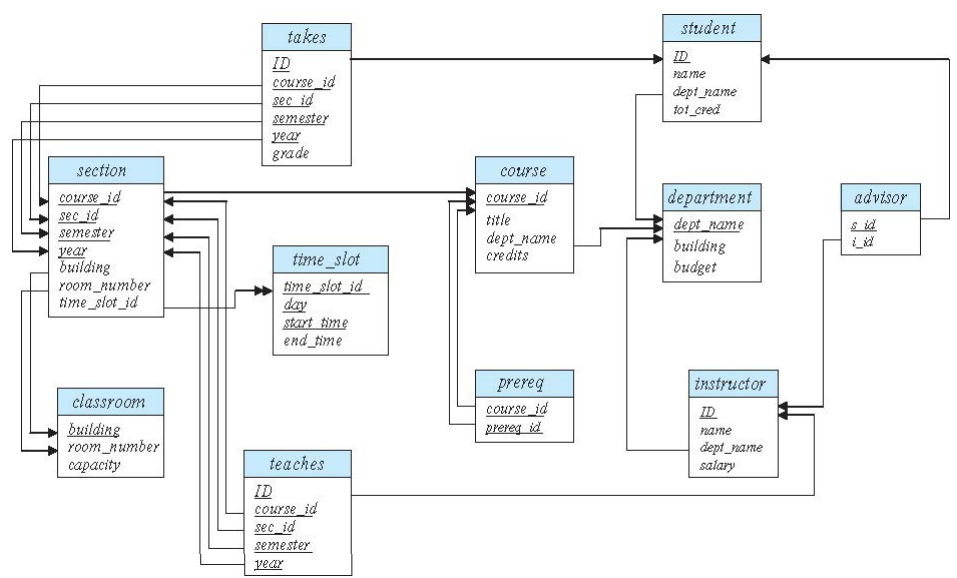

.. meta::
   :http-equiv=Content-Language: fa

..  section-numbering::


.. role:: ltr
    :class: ltr


.. role:: raw-html(raw)
   :format: html

.. |nbsp| unicode:: 0xA0


===================================================
هنجارسازی (نرمال سازی) Normalization
===================================================
-------------------------------------------
احمد یوسفان ، دانشگاه کاشان
-------------------------------------------

نرمال سازی پایگاه داده روندی برای ساماندهی ویژگی‌ها (ستون‌ها) و رابطه‌ها (جدول‌ها) در یک پایگاه داده‌ی رابطه‌ای به منظور کاهش افزونگی داده است.


هدف از نرمال سازی؟


یک فروشگاه را در نظر بگیرید که اطلاعاتی مانند زیر را بخواهد در خود نگهداری کند.


..  csv-table:: جدول فروش یک فروشگاه
    :header-rows: 1
    :file: normalization/wrong.normal.1.csv

نرمال سطح ۱
=====================================================

تبدیل شده به نرمال ۱
-------------------------------------------

..  csv-table:: جدول فروش یک فروشگاه
    :header: `شماره جنس`_,نام جنس,موجودی,`شماره فاکتور فروش`_,میزان فروش

    1,شکر,1000,1,12
    1,شکر,1000,4,14
    1,شکر,1000,5,5
    2,نمک,1500,2,10
    2,نمک,1500,4,20
    2,نمک,1500,5,30
    2,نمک,1500,3,40


کلید؟

ترکیب «شماره جنس» و «شماره فاکتور فروش» کلید را تشکیل می‌دهد.

روشن است که این جدول مشکل دارد و روشن این که باید دو جدول باشد ولی چه قانونی این را می‌گوید.

-----------------------------------------------------------

دو جدول پیشنهادی
-----------------------------------------------------------

..  csv-table:: جدول موجودی فروشگاه
    :header: `شماره جنس`_,نام جنس,موجودی

    1,شکر,1000
    2,نمک,1500


..  csv-table:: جدول فروش یک فروشگاه
    :header: `شماره جنس`_,`شماره فاکتور فروش`_,میزان فروش

    1,1,12
    1,4,14
    1,5,5
    2,2,10
    2,4,20
    2,5,30
    2,3,40

مشکل‌های جدول‌های پیشین چه بودند؟

ناهنجاری افزودن داده، حذف داده،‌به روز رسانی داده

قانون تقسیم چه می‌تواند باشد.

وابستگی تابعی
====================================

در جدول موجودی فروشگاه، شماره‌ی جنس تعیین کننده‌ی (determinant) دو ویژگی دیگر یعنی «نام جنس» و «موجودی» است. از طرف دیگر می‌توان گفت نام جنس و موجودی وابسته (dependant) به شماره‌ی جنس هستند.

به این نوع وابستگی، «وابستگی تابعی»(Functional Deppendancy) یا FD گفته می‌شود. وابستگی تابعی میان ویژگی‌های جدول برخاسته از تعریف و نوع ارتباط آنها با هم دیگر در جدول است و طراح پایگاه داده باید بتواند وابستگی‌های تابعی میان ویژگی‌های درون جدول‌های خود را بیابد.

بنابراین در هر جدول یک یا چند وابستگی تابعی وجود دارد. برای نمونه تعدادی از وابستگی‌های تابعی دو جدول بالا به قرار زیر است

*  در جدول موجودی فروشگاه

    *  شماره جنس ⭠ نام جنس
    *  شماره جنس ⭠ موجودی
    *  یا به صورت دیگر :  شماره جنس ⭠ {نام جنس ، موجودی}

*  در جدول فروش

    *  {شماره جنس ، شماره فاکتور} ⭠ میزان فروش

همان گونه که روشن است وابستگی‌ها به کلید هستند ولی وابستگی‌های دیگری نیز می‌تواند وجود داشته باشد.

در رابطهٔ R دو مجموعه از ویژگی‌های α و β دارای وابستگی تابعی  α → β است اگر و تنها اگر برای هر دو چندتایی t1 و t2 ممکن در رابطهٔ R مقدارهای α  برابر باشند آن‌گاه مقدارهای β نیز برابر است. به عبارت دیگر

..  class:: ltr

    ∀ t1, t2 ∈ R, t1[α] = t2[α] ⇒ t1[β] = t2[β]

با توجه به جدول زیر کدام وابستگی‌های وجود ندارند


.. csv-table::
    :header: A, B , C
    :class: ltr

    a1,b1,c1
    a1,b1,c2
    a1,b2,c2
    a2,b2,c2
    a3,b3,c3


..  class:: ltr

#. A →B
#. A →C
#. B→C
#. AB→C
#. ‌B→A
#. AC→B
#. BC→A

ویژگی‌های ریاضی وابستگی تابعی
-------------------------------------------------------

به این ترتیب وابستگی تابعی می‌تواند به صورت یک عمل ریاضی تعریف شود و ویژگی‌های آن از دید ریاضی بر روی رابطه‌ها بررسی گردد.  بنابراین تعدادی اصل و تعدادی ویژگی و قضیه ار روی آن به دست می‌آید که در اینجا به بخشی از آن پرداخته می‌شود.

 اگر X ، Y و Z مجموعه‌هایی از ویژگی‌ها در یک رابطه‌ی R باشند برخی از قانون‌هایی که نتیجه می‌شود در ادامه نوشته شده است.

اصول آرمسترانگ

*  بازتابی بودن:  اگر Y زیر مجموعه‌ی X باشد آن‌گاه X ⭢ Y
*  بسط پذیری   :  اگر X ⭢ Y آن‌گاه XZ ⭢ YZ
*  تراگذری     :  اگر X ⭢ Y و Y ⭢ Z  آن‌گاه X ⭢ Z

قانون‌های زیر می‌تواند از روی سه قانون بالا به دست آید:

*  خود تعیینی : همواره داریم X ⭢ X
*  اجتماع     : اگر X ⭢ Y و X ⭢ Z آن‌گاه X ⭢ YZ
*  تجزیه      : اگر X ⭢ YZ آن‌گاه  X ⭢ Y و X ⭢ Z
*  شبه تراگذری: اگر  X ⭢ Y و WY ⭢ Z آن‌گاه WX ⭢ Z
*  ترکیب      : اگر X ⭢ Y و Z ⭢ W آن‌گاه XZ ⭢ YW
*  اتحاد کلی  :  اگر X ⭢ Y و Z ⭢ W آن‌گاه X ⋃ (Z - Y) ⭢ YW

بستار وابستگی تابعی
------------------------------------------------------------

به مجموعه‌ی همه‌ی وابستگی‌های تابعی که می‌تواند از روی چند وابستگی تابعی به دست آید بستار آن وابستگی‌های تابعی گفته می‌شود. اگر F یک مجموعه وابستگی باشد :math:`{}^+F` مجموعه‌ی بستار F است.


برای نمونه اگر  در رابطه‌ی R ویژگی‌های A,B,C,D را به همراه قانون‌های وابستگی زیر داشته باشیم

..  class:: ltr

    1. A → B
    2. B → C
    3. AB → D

آن‌گاه قانون‌های زیر (بخشی از بستار این قانون‌ها) می‌تواند به دست آید:

..  class:: ltr


    a) A → A
    b) A → AB
    c) A → ABD
    d) A → ABCD
    e) B → B
    f) B → BC
    g) A → D


مجموعه‌ی کاهش ناپذیر وابستگی‌ها
------------------------------------------------

در یک رابطه (جدول) به مجموعه‌ای از وابستگی‌های تابعی گفته می‌شود که کمینه باشد یا به عبارت دیگر هیچ کدام از قانون‌های وابستگی درون این مجموعه نتواند به شکلی از روی دیگر قانون‌ها به دست آید. مجموعه‌ای کاهش ناپذیر از وابستگی‌ها است اگر و فقط اگر سه قانون زیر را داشته باشد.

*  سمت چپ (تعیین کننده) هر وابستگی تابعی کاهش ناپذیر باشد. یعنی اگر سمت چپ یکی از قانون‌های وابستگی را کاهش دادیم حتما مجموعه‌ی بستار به دست آمده از آن تغییر کند(نه اینکه بتواند از قانون‌های دیگر به دست آید). به عبارت دیگر همه‌ی وابستگی‌ها باید کاهش ناپذیر چپ باشند.
*  هیچ وابستگی تابعی نتواند بدون تغییر بستار از این مجموعه حذف شود.
*  سمت راست(وابسته) هر وابستگی تابعی فقط یک ویژگی داشته باشد.

نرمال سطح دوم
====================================

اگر ویژگی‌هایی به بخشی از کلید اصلی وابسته باشند به آن *وابستگی جزئی* گفته می‌شود. جدولی در سطح دوم نرمال است که درون آن وابستگی جزئی وجود نداشته باشد. یعنی هیچ قانون وابستگی که سمت چپ آن (تعیین کننده) آن بخشی از کلید باشد در وابستگی‌های آن جدول وجود نداشته باشد. به عبارت دیگر بخشی از کلید در سمت چپ هیچ وابستگی تابعی نباشد.

اکنون به جدول اولیه‌ی فروش دقت کنید. در این جدول کلید دو ویژگی شماره فاکتور و شماره جنس است در حالی که وابستگی تابعی شماره جنس ⭠ {نام جنس ، موجودی} را داریم که در سمت چپ آن (تعیین کننده آن) فقط بخشی از کلید اصلی است. ویژگی یا ويژگی‌هایی از جدول به بخشی از کلید اصلی وابسته هستند و بنابراین باید جدا شوند.

برای به دست آوردن فرم نرمال دوم باید همه‌ی وابستگی‌های جزئی را به دست آوریم و از آنها جدول‌های جداگانه ایجاد کنیم. دقت کنید که وابستگی‌های جزئی که در آنها سمت چپ (تعیین کننده) یکسان است باید با هم ترکیب شوند.

در جدول مجموعه‌ی کاهش ناپذیر وابستگی‌های زیر را داریم

*  شماره جنس   ⭠ نام جنس
*  شماره جنس   ⭠ موجودی
*  {شماره جنس ، شماره فاکتور} ⭠ میزان فروش

با ترکیب قانون‌هایی که تعیین کننده‌ی یکسان دارند دو قانون زیر به دست می‌آید.

*  شماره جنس ⭠ {نام جنس ، موجودی}
*  {شماره جنس ، شماره فاکتور} ⭠ میزان فروش

بنابراین باید جدول یاد شده را به دو جدول بشکنیم تا وابستگی جزئی درون آن نباشد.


نرمال سطح سوم
========================================================
..  csv-table:: جدول دانشجو
    :header:
     `شمارهٔ دانشجویی`_, نام, نام خانوادگی, نام دبیرستان, شهر دبیرستان, کدپستی دبیرستان

    ۹۸۱۲۵۶۱, علی, رحیمی, امام صادق, شهرضا, ۸۹۲۷۳۹۸۷۴
    ۹۸۱۲۵۶۲, کوروش, پارسایی, امام صادق, شهرضا, ۸۹۲۷۳۹۸۷۴
    ۹۸۱۲۵۶۳, احمد, یوسفان, منتظری, نجف‌آباد, ۷۶۷۶۵۶۷۸۷۴
    ۹۸۱۲۵۶۴, کامران, خداپرستی, امام صادق, شهرضا, ۸۹۲۷۳۹۸۷۴
    ۹۸۱۲۵۶۵, رضا, حقیقی, امام صادق, شهرضا, ۸۹۲۷۳۹۸۷۴
    ۹۸۱۲۵۶۶, محمدرضا, مغزی, منتظری, نجف‌آباد, ۷۶۷۶۵۶۷۸۷۴

* ناهنجاری حذف
* ناهنجاری ویرایش
* ناهنجاری افزودن

کدپستی دبیرستان  ⭠ {نام دبیرستان، شهر دبیرستان}

وابستگی باواسطه
---------------------------------

`شمارهٔ دانشجویی`_, نام, نام خانوادگی, کدپستی دبیرستان

`کدپستی دبیرستان`_, نام دبیرستان, شهر دبیرستان

..  csv-table:: جدول دانشجو
    :header:
     `شمارهٔ دانشجویی`_, نام, نام خانوادگی, کدپستی دبیرستان

    ۹۸۱۲۵۶۱, علی, رحیمی, ۸۹۲۷۳۹۸۷۴
    ۹۸۱۲۵۶۲, کوروش, پارسایی, ۸۹۲۷۳۹۸۷۴
    ۹۸۱۲۵۶۳, احمد, یوسفان, ۷۶۷۶۵۶۷۸۷۴
    ۹۸۱۲۵۶۴, کامران, خداپرستی,  ۸۹۲۷۳۹۸۷۴
    ۹۸۱۲۵۶۵, رضا, حقیقی, ۸۹۲۷۳۹۸۷۴
    ۹۸۱۲۵۶۶, محمدرضا, مغزی, ۷۶۷۶۵۶۷۸۷۴


..  csv-table:: جدول دبیرستان
    :header:
     `کدپستی دبیرستان`_, نام دبیرستان, شهر دبیرستان

    ۸۹۲۷۳۹۸۷۴ , امام صادق, شهرضا
    ۷۶۷۶۵۶۷۸۷۴, منتظری, نجف‌آباد


استثناها
------------

..  csv-table:: جدول خریدار
    :header: `نام خریدار`_, کدپستی خریدار,شهر, خیابان, کوچه, پلاک

    Ali,    558633,Kashan,  Street1,alley1,23
    Kamran, 912133,Arsanjan,Street2,alley2,32
    Hamid,  234553,Kohdasht,Street3,alley3,21
    Koroush,494833,Mamasani,Street4,alley3,20
    Reza,   232444,Kazeron, Street5,alley6,12


..  csv-table:: جدول دانشجو
  :header-rows: 1

    `شمارهٔ دانشجویی`_, نام و نام خانوادگی , شمارهٔ ملی , نام پدر, نام و نام خانوادگی مادر, کدپستی, شهر, خیابان, کوچه, پلاک
    ۹۸۲۳۲۳, علی رضایی, ۲۹۸۷۳۹۲۸۳, رضا, اختر صالحی, ۷۶۸۷۹۸۷, کاشان, باباافضل, محمدی, ۲۳
    ۹۷۲۳۸۲۳, کامران خداپرست, ۳۹۸۴۵۰۹۳, بهرام, اختر شیرین, ۹۰۴۸۴۲۰۹۳, زاهدان, رضایی, سعیدی, ۳۴
    ۹۷۳۸۳۸۷, مهدی رضایی, ۲۹۸۷۳۹۲۸۴, رضا, اختر صالحی, ۷۶۸۷۹۸۷, کاشان, باباافضل, محمدی, ۲۳
    ۹۸۲۳۷۴, حسین رضایی, ۲۹۸۷۳۹۲۸۵, رضا, اختر صالحی, ۷۶۸۷۹۸۷, کاشان, باباافضل, محمدی, ۲۳
    ۹۶۰۹۸۳۴, زینب رضایی, ۲۹۸۷۳۹۲۸۶, رضا, اختر صالحی, ۷۶۸۷۹۸۷, کاشان, باباافضل, محمدی, ۲۳

نرمال BCNF
========================================================
۱. هر دانشجو ممکن است در چندین رشته تحصیل کند.

۲. برای هر رشته، یک دانشجو فقط یک استاد راهنما دارد

۳. در هر رشته چندین استاد راهنما وجود دارد

۴. هر استاد راهنما فقط در یک رشته راهنمایی می‌کند.

* استاد راهنما ⭠ رشته
* {شماره دانشجویی و رشته } ⭠ استاد راهنما


..  csv-table:: جدول راهنمایی
    :header: `شماره دانشجویی`_, `رشته`_, استاد راهنما

    123,کامپیوتر,یوسفان
    243,هنر, عرب بیگی
    342,مکانیک,عباسیان
    342,کامپیوتر,یوسفان
    123,هنر, عرب بیگی
    243,مکانیک,عباسیان
    243,کامپیوتر,یوسفان
    342,هنر, عرب بیگی
    123,مکانیک,عباسیان

یک مشکل مهم این جدول این است که در آن وابستگی مهم میان استاد راهنما و رشته نشان داده نشده است. روشن است که ساختار جدول‌ها بهتر است به گونه‌ای باشد که تا جایی که بشود بتواند شرایط واقعی را نشان دهد و وابستگی تابعی را نشان دهد.

شماره دانشجویی   و   استاد راهنما


..  csv-table:: جدول شماره دانشجویی - استاد راهنما
    :header: `شماره دانشجویی`_, `استاد راهنما`_

    123, یوسفان
    123, عرب بیگی
    123, عباسیان
    243, عرب بیگی
    243, یوسفان
    342,عباسیان
    342, یوسفان
    342, عرب بیگی


رشته و استاد راهنما


..  csv-table:: جدول رشته - استاد راهنما
    :header: `استاد راهنما`_, رشته

    یوسفان,کامپیوتر
    عرب بیگی,هنر
    عباسیان,مکانیک


همهٔ وابستگی‌ها در جدول فقط به کلید اصلی باشد.
-----------------------------------------------------------------


نرمال سطح چهارم
========================================================
.. list-table::
  :class: ltr

  * - .. raw:: html
            :file: normalization/ssn_sport_book.html

    - .. csv-table::
           :header: SSN_,	Sport_, Book_

           54467, Volleyball, We
           54467, Volleyball, Hafez
           54467, Basketball, We
           54467, Basketball, Hafez
           65231, Tennis, Pinocchio
           65231, Tennis, Animal Farm
           65231, Tennis, Hafez
           65231, Basketball, Pinocchio
           65231, Basketball, Animal Farm
           65231, Basketball, Hafez


----

multivalued dependency
---------------------------
وابستگی چند مقداری

.. class:: ltr center

     SSN →→ Book | Sport


.. :

  database course fourth normal form multivalued

.. list-table::
  :class: ltr

  * - .. csv-table::
           :header: SSN_,	Sport_, Book_

           54467, Volleyball, We
           54467, Volleyball, Hafez
           54467, Basketball, We
           54467, Basketball, Hafez
           65231, Tennis, Pinocchio
           65231, Tennis, Animal Farm
           65231, Tennis, Hafez
           65231, Basketball, Pinocchio
           65231, Basketball, Animal Farm
           65231, Basketball, Hafez

    - .. csv-table::
            :header: SSN_,	Sport_

            54467, Volleyball
            54467, Basketball
            65231, Tennis
            65231, Basketball

      .. csv-table::
        :header: SSN_, Book_

        54467, We
        54467, Hafez
        65231, Pinocchio
        65231, Animal Farm
        65231, Hafez

------------

جدولی را در نظر بگیرید که شمارهٔ ملی یک نفر را به همراه نام فرزندان و شماره تلفن‌های فرد نگهداری می‌کند. هر فرد می‌تواند چند شمارهٔ تلفن و چند فرزند داشته باشد.


.. csv-table::
  :header: SSN_, child_, phone_

  54467, ali, 90284902
  54467, ali, 82434893
  54467, reza, 90284902
  54467, reza, 82434893
  65231, hamid, 9284028
  65231, hamid, 9284026
  65231, hamed, 9284028
  65231, hamed, 9284026
  65231, mahmood, 9284028
  65231, mahmood, 9284026

می‌تواند به دو جدول زیر شکسته شود.

.. list-table::
  :class: ltr

  * - .. csv-table::
        :header: SSN_, child_

        54467, ali
        54467, reza
        65231, hamid
        65231, hamed
        65231, mahmood

    - .. csv-table::
        :header: SSN_, phone_

        54467,  90284902
        54467, 82434893
        65231, 9284028
        65231, 9284026


--------


فرض کنید در فروشگاهی امکان خرید گروهی نیز باشد یعنی یک گروه از خریداران با نام‌های گوناگون یک خرید را با هم انجام دهند و یک فاکتور برایشان صادر شود. برای نمونه اگر سه نفر از اعضا خانواده با هم برای خرید آمدند نام هر سه نفر در فاکتور خرید آورده شود در حالی که یک فاکتور برای جنس‌های درون آن زده شود. بنابراین قانون زیر نیز افزوده شود:

*برای یک فاکتور یک یا چند قلم جنس و یک یا چند خریدار می‌تواند وجود داشته باشد.*

با این فرض، جدول زیر برای فروش پیشنهاد شده است.

..  csv-table:: جدول فروش همراه خریدار
    :header: `شماره جنس`_,`شماره فاکتور فروش`_,میزان فروش,`نام خریدار`_

    1,1,12,Ali
    1,4,14,Kamran
    1,5,5,Hamid
    2,2,10,Koroush
    2,4,20,Kamran
    2,5,30,Hamid
    2,3,40,Reza
    1,5,5,Shahin
    2,5,30,Shahin

میزان فروش فقط به شماره‌ی جنس و شماره‌ی فاکتور بستگی دارد بنابراین جدول در نرمال سطح دوم نیست پس به دو جدول زیر شکسته می‌شود.


..  csv-table:: جدول فروش
    :header: `شماره جنس`_,`شماره فاکتور فروش`_,میزان فروش

    1,1,12
    1,4,14
    1,5,5
    2,2,10
    2,4,20
    2,5,30
    2,3,40

..  csv-table:: جدول فروش همراه خریدار
    :header: `شماره جنس`_,`شماره فاکتور فروش`_,`نام خریدار`_

    1,1,Ali
    1,4,Kamran
    1,5,Hamid
    2,2,Koroush
    2,4,Kamran
    2,5,Hamid
    2,3,Reza
    1,5,Shahin
    2,5,Shahin

اکنون اگر این جدول را بدون توجه به دیگر جدول‌های نگاه کنیم روشن است که جدول خوبی نیست ولی تا نرمال BCNF مشکلی ندارد. روشن است که تکرار داده دارد در واقع نوعی گروه بندی یا عدم وابستگی میان آنها وجود دارد که باعث می‌شود بهتر ببینم به دو جدول زیر آن را بشکنیم بدون این که اطلاعاتی از دست برود.

..  csv-table:: جدول فروش: فاکتور - جنس
    :header: `شماره جنس`_,`شماره فاکتور فروش`_

    1,1
    1,4
    1,5
    2,2
    2,4
    2,5
    2,3


..  csv-table:: جدول فروش: فاکتور - خریدار
    :header: `شماره فاکتور فروش`_,`نام خریدار`_

    1,Ali
    4,Kamran
    5,Hamid
    2,Koroush
    4,Kamran
    5,Hamid
    3,Reza

مشخص است که با توجه به جدول فروش که از سه ستون شماره جنس، شماره فاکتور فروش و میزان فروش ساخته شده است دیگر نیازی به جدول فروش: فاکتور - جنس نیست و می‌تواند حذف شود و دو جدول زیر باقی بماند.

..  csv-table:: جدول فروش
    :header: `شماره جنس`_,`شماره فاکتور فروش`_,میزان فروش

    1,1,12
    1,4,14
    1,5,5
    2,2,10
    2,4,20
    2,5,30
    2,3,40

..  csv-table:: جدول فروش: فاکتور - خریدار
    :header: `شماره فاکتور فروش`_,`نام خریدار`_

    1,Ali
    4,Kamran
    5,Hamid
    2,Koroush
    4,Kamran
    5,Hamid
    3,Reza

چرا این دو جدول همه‌ی اطلاعات مربوط به جدول پیشین را در بردارد؟

مهم‌ترین نکته این است که خریداران گوناگون در یک فاکتور فروش نمی‌توانند جنس‌های گوناگونی داشته باشند و همه‌ی جنس‌هایشان تکراری است.


نمونه نرمال سازی
========================================================

جدول فروش زیر را در نظر بگیرید:

..  csv-table:: جدول فروش همراه خریدار
    :header: `شماره جنس`_,`شماره فاکتور فروش`_,میزان فروش,`نام خریدار`_, نشانی خریدار,دیگر اطلاعات خریدار

    1,1,12,Ali,Street1,other
    1,4,14,Kamran,street2,other
    1,5,5,Hamid,street3,other
    2,2,10,Koroush,street1,other
    2,4,20,Kamran,street2,other
    2,5,30,Hamid,street3,other
    2,3,40,Reza,street2,other

.. :

    زمان خرید، شمارهٔ فروشنده


باز هم این جدول دلچسب نیست و مشکل دارد. اولین مشکل این است که نرمال دوم نیست زیرا نام خریدار فقط به شماره فاکتور وابسته است بنابراین دو جدول زیر به دست می‌آید.

..  csv-table:: جدول فروش یک فروشگاه
    :header: `شماره جنس`_,`شماره فاکتور فروش`_,میزان فروش

    1,1,12
    1,4,14
    1,5,5
    2,2,10
    2,4,20
    2,5,30
    2,3,40

..  csv-table:: جدول فاکتور - خریدار
    :header: `شماره فاکتور فروش`_,`نام خریدار`_, نشانی خریدار,دیگر اطلاعات خریدار

    1,Ali,Street1,other
    4,Kamran,street2,other
    5,Hamid,street3,other
    2,Koroush,street1,other
    4,Kamran,street2,other
    5,Hamid,street3,other
    3,Reza,street2,other

باز هم این جدول مشکل دارد و به خوبی می‌توان این مشکلات را به ویژه زمانی که تعداد خریداران و فاکتورها افزایش یابد دید زیرا نشانی خریدار و دیگر اطلاعات خریدار بی‌جهت تکرار می‌شود. بنابراین جدول فاکتور-خریدار به دو جدول زیر شکسته می‌شود.


..  csv-table:: جدول فاکتور - خریدار
    :header: `شماره فاکتور فروش`_,`نام خریدار`_

    1,Ali
    4,Kamran
    5,Hamid
    2,Koroush
    4,Kamran
    5,Hamid
    3,Reza

..  csv-table:: جدول خریدار
    :header: `نام خریدار`_, نشانی خریدار,دیگر اطلاعات خریدار

    Ali,Street1,other
    Kamran,street2,other
    Hamid,street3,otherخ
    Koroush,street1,other
    Kamran,street2,other
    Hamid,street3,other
    Reza,street2,other


حفظ وابستگی‌ها و کنار هم گذاشتن ویژگی‌هایی که به هم وابسته هستند، اهمیت بالایی دارد.

----

:class: t2c

Adding ISBN for books in Library
=======================================
* book(isbn_, title,  author)
* books(bn_, isbn, ofpd)
* member(mn_, name, isbn, fines)
* borrow(bn_, mn_, ddt_, dtr)

.. :

    .. class:: rtl

    #. member.category موضوعی که عضو بیشتر از همه به آن علاقه‌مند است
    #. fpd جریمه دیر آوردن کتاب به ازای روز
    #. nd جمع روزهای دیرکرد به جز آخرین بار برگردانده نشده
    #. از هر کتابی(isbn) چند نسخه(bn) در کتابخانه است

    * category(categoryName_, description, related_category)
    * book(isbn_, title, categoryName, author)
    * books(bn_, isbn, fpd)
    * member(mn_, name, categoryName, isbn, debt)
    * borrow(bn_, mn_, rdt, ret)

    .. class:: rtl

    #. debt مجموع بدهکاری این عضو تا کنون


    #. اگر از هر کتابی فقط یک نسخهٔ آن در کتابخانه باشد، آن‌گاه bn می‌تواند همان isbn باشد.
    #. book.category موضوع کتاب با این فرض که هر کتاب فقط یک موضوع دارد
    #. book. fpd جریمه دیر آوردن کتاب به ازای روز
    #. member.category موضوعی که عضو بیشتر از همه به آن علاقه‌مند است
    #. member.bn شمارهٔ کتابی که عضو بیشتر از همه به آن کتاب علاقه‌مند است
    #. rdt تاریخی که کتاب باید برگردانده شود

----

:class: t2c

Adding Category in Library
=======================================
* category(category_, description, related_category)
* book(isbn_, title, category, author)
* books(bn_, isbn, ofpd)
* member(mn_, name, isbn, fines, category)
* borrow(bn_, mn_, ddt_, dtr)

----

Library with Return dates and limited days
===========================================
* category(categoryName_, description, related_category)
* book(isbn_, title, categoryName, author)
* books(bn_, isbn, fpd, nday)
* member(mn_, name, categoryName, isbn, debt)
* borrow(bn_, mn_, rdt_, ardt)

.. class:: rtl

#. books.nday تعداد روزی که می‌تواند کتاب به امانت برده شود
#. nday == 0 نمی‌توان کتاب را بیرون برد
#. rdt تاریخی که باید کتاب در این بار امانت برگردانده شود.
#. ardt تاریخی که عضو واقعا کتاب را برگردانده است


----



.. :

  :width: 800px

----

:class: t2c

University Database(I)
=========================
* student(ID_, name, dept_name, tot_cred)
* instructor(ID_, name, dept_name, salary)
* department (dept_name_, building, budget)
* course(course_id_, title, dept_name, credits)
* classroom (building_, room_number_, capacity)
* section(course_id_, sec_id_, semester_, year_,
      building, room_number, time_slot_id)
* teaches(ID_, course_id_, sec_id_, semester_, year_)
* takes(ID_, course_id_, sec_id_, semester_, year_, grade)
* advisor(s_ID_, i_ID)
* time_slot(time_slot_id_, day_, start_time_, end_time)
* prereq(course_id_, prereq_id_)

.. class:: substep

* candidate keys?

----

:class: t2c

University Database(II)
=========================
* student(ID_, name, dept_name, tot_cred)
* instructor(ID_, name, dept_name, salary)
* department (dept_name_, building, budget)
* course(course_id_, title, dept_name, credits)
* classroom (building_, room_number_, capacity)
* teaches(course_id_, sec_id_, semester_,
      year_, building, room_number,
          time_slot_id, inst_id)
* takes(ID_, course_id_, sec_id_, semester_, year_, grade)
* advisor(s_ID_, i_ID)
* time_slot(time_slot_id_, day_, start_time_, end_time)
* prereq(course_id_, prereq_id_)

.. class:: substep

* If any sections have only one instructor
* then combine Section and teaches
* Use teaches name for this new relation
*
* section(course_id_, sec_id_, semester_, year_,
      building, room_number, time_slot_id,
          inst_id)
* Is there any new candidate key for this
    relation (teaches)?


----

:class: t2c

Rules for Foreign Key(FK)
=========================
.. container::

    **Core Principles of Referential Integrity**

    .. class:: substep

    * **Definition**
    * **Subset Dependency**
    * **Domain Matching**
    * **Self-Referencing Keys**
    * **Nullability**

.. :

    * **Definition**: A Foreign Key (FK) is an attribute (or set of attributes) in one relation that refers to a candidate key (typically the Primary Key) in another, or the same, relation.
    * **Subset Dependency**: Every non-null value in the foreign key must explicitly exist in the referenced key of the parent relation.
    * **Domain Matching**: The foreign key attributes must possess the exact same data type, length, and domain as the referenced primary key.
    * **Self-Referencing Keys**: A foreign key can reference the primary key of its *own* relation (e.g., an ``Employee_ID`` primary key referenced by a ``Manager_ID`` foreign key in the same table) to represent hierarchical data.
    * **Nullability**: Unlike Primary Keys, Foreign Keys *can* accept ``NULL`` values unless explicitly constrained. A ``NULL`` indicates the absence of a relationship for that specific tuple.

.. container:: substep

    **Common Mistakes and Anti-Patterns**

    .. class:: substep

    * **Application-Level Enforcement**
    * **Mismatched Data Types**
    * **Referencing Non-Unique Columns**
    * **Cyclic Dependencies**

.. :

    Common Mistakes and Anti-Patterns
    ~~~~~~~~~~~~~~~~~~~~~~~~~~~~~~~~~

    * **Application-Level Enforcement**: Defining relationships only in application code while omitting actual Foreign Key constraints in the database schema. This inevitably leads to orphaned records and data anomalies.
    * **Overusing CASCADE DELETE**: Applying ``CASCADE`` indiscriminately can result in catastrophic, unintended mass data deletion if a core entity is removed. Use ``RESTRICT`` unless cascading is a strict business requirement.
    * **Mismatched Data Types**: Defining an ``INT`` primary key but a ``BIGINT`` foreign key. Even if the DBMS allows it, this disables efficient index usage and severely degrades ``JOIN`` performance.
    * **Referencing Non-Unique Columns**: Attempting to point a foreign key to a column that is not guaranteed to be unique (i.e., not a Primary Key or explicitly marked with a ``UNIQUE`` constraint).
    * **Cyclic Dependencies**: Designing schemas where Table A requires a foreign key from Table B, and Table B requires a foreign key from Table A. This creates deadlocks during row insertion and deletion.

----

**Guidelines for Optimal Definition**


* **Must Reference a Candidate Key**: A foreign key must always reference a primary key or a candidate key that has a ``UNIQUE`` constraint in the parent table.
* **Data-Type Compatibility**: The foreign-key column(s) must have exactly the same data type, length, and collation as the referenced primary-key column(s).
* **Allow NULL (by default)**: Foreign keys may contain ``NULL`` values unless explicitly declared ``NOT NULL`` (optional relationship).
* **Minimality**: Prefer single-attribute foreign keys when possible; composite foreign keys should only be used when the business rule genuinely requires multiple columns.
* **Naming Convention**: Use clear, consistent names (e.g., ``fk_student_course_student_id`` or ``student_id``) to improve readability and maintenance.
* **Index Recommendation**: Always create an index on foreign-key columns to speed up joins, lookups, and referential checks.

**Common Mistakes to Avoid**


* Forgetting to create an index on the foreign-key column → slow joins and poor performance.
* Using a foreign key that references a non-unique column → violates referential integrity rules.
* Circular foreign-key references (Table A → Table B → Table A) without careful design → can cause deadlock or insertion problems.
* Mismatched data types between foreign key and primary key → prevents creation of the constraint.
* Overusing ``CASCADE`` without understanding consequences → accidental mass deletion of data.
* Ignoring business rules when choosing actions → e.g., using ``SET NULL`` on a required relationship.
* Creating foreign keys to surrogate keys only and forgetting ``UNIQUE`` constraints on natural keys → loses business integrity.

----

**Best Practices for Bachelor-Level Design**

* Prefer **natural or meaningful** foreign keys when they are stable (e.g., ``CourseCode`` instead of only a surrogate ID).
* When using surrogate primary keys, still keep the foreign key referencing the surrogate for performance.
* Document every foreign key with a comment explaining the business relationship.
* Test referential actions thoroughly during schema design (use small test data).

.. list-table::
   :header-rows: 1
   :widths: 30 35 35

   * - Situation
     - Recommended Foreign-Key Approach
     - Reason
   * - One-to-many relationship (e.g., Student → Course)
     - Single-column FK + ``RESTRICT``
     - Simple and safe
   * - Weak entity (e.g., OrderLine)
     - Composite FK (OrderID + LineNo)
     - Reflects full identifying relationship
   * - Optional relationship
     - FK declared ``NULL`` allowed
     - Allows “no parent” records
   * - High-performance joins needed
     - Add index on FK column
     - Essential for query speed

.. :

    Core Principles of Referential Integrity
    ~~~~~~~~~~~~~~~~~~~~~~~~~~~~~~~~~~~~~~~~

    * **Definition**: A Foreign Key (FK) is an attribute (or set of attributes) in one relation that refers to a candidate key (typically the Primary Key) in another, or the same, relation.
    * **Subset Dependency**: Every non-null value in the foreign key must explicitly exist in the referenced key of the parent relation.
    * **Domain Matching**: The foreign key attributes must possess the exact same data type, length, and domain as the referenced primary key.
    * **Self-Referencing Keys**: A foreign key can reference the primary key of its *own* relation (e.g., an ``Employee_ID`` primary key referenced by a ``Manager_ID`` foreign key in the same table) to represent hierarchical data.
    * **Nullability**: Unlike Primary Keys, Foreign Keys *can* accept ``NULL`` values unless explicitly constrained. A ``NULL`` indicates the absence of a relationship for that specific tuple.

    Referential Actions (Update and Delete Rules)
    ~~~~~~~~~~~~~~~~~~~~~~~~~~~~~~~~~~~~~~~~~~~~~

    When a referenced Primary Key is updated or deleted, the Database Management System (DBMS) enforces referential integrity using specific policies:

    * **RESTRICT (or NO ACTION)**: The DBMS rejects the update or deletion of the parent tuple if any matching foreign key records exist in the child relation. This is the safest default.
    * **CASCADE**:
        * *On Delete*: Deleting a parent tuple automatically deletes all associated child tuples.
        * *On Update*: Changing a parent's primary key value automatically updates the foreign key value in all associated child tuples.
    * **SET NULL**: Deleting or updating the parent tuple leaves the child tuples intact but sets their foreign key attributes to ``NULL`` (requires the FK to be nullable).
    * **SET DEFAULT**: Deleting or updating the parent tuple sets the child's foreign key attributes to their predefined default values.

    Common Mistakes and Anti-Patterns
    ~~~~~~~~~~~~~~~~~~~~~~~~~~~~~~~~~

    * **Application-Level Enforcement**: Defining relationships only in application code while omitting actual Foreign Key constraints in the database schema. This inevitably leads to orphaned records and data anomalies.
    * **Overusing CASCADE DELETE**: Applying ``CASCADE`` indiscriminately can result in catastrophic, unintended mass data deletion if a core entity is removed. Use ``RESTRICT`` unless cascading is a strict business requirement.
    * **Mismatched Data Types**: Defining an ``INT`` primary key but a ``BIGINT`` foreign key. Even if the DBMS allows it, this disables efficient index usage and severely degrades ``JOIN`` performance.
    * **Referencing Non-Unique Columns**: Attempting to point a foreign key to a column that is not guaranteed to be unique (i.e., not a Primary Key or explicitly marked with a ``UNIQUE`` constraint).
    * **Cyclic Dependencies**: Designing schemas where Table A requires a foreign key from Table B, and Table B requires a foreign key from Table A. This creates deadlocks during row insertion and deletion.
    ```

    ### Teaching Note for the Slides:
    When presenting the **"Referential Actions"** slide to your Bachelor students, it is highly effective to emphasize that `RESTRICT` should be their default mindset as junior engineers. They should only reach for `CASCADE DELETE` when the child record absolutely cannot exist logically without the parent (e.g., deleting an `Invoice` should cascade to `Invoice_Line_Items`, but deleting a `Customer` should usually *not* cascade to their `Invoices`).

    Let me know if you need to tackle Normalization (1NF, 2NF, 3NF, BCNF) or ER-to-Relational Mapping next

    Grok Answer 2026/04/14 11:37:08
    ```````````````````````````````
    A **foreign key** is an attribute (or set of attributes) in one relation (child table) that references the **primary key** (or a candidate key) of another relation (parent table).
    It enforces **referential integrity** — ensuring that every value in the foreign key exists in the referenced primary key.

    .. admonition:: Core Purpose
       :class: note

       Foreign keys prevent “orphan” records and maintain consistent relationships between tables.

    Guidelines for Optimal Definition
    ~~~~~~~~~~~~~~~~~~~~~~~~~~~~~~~~~

    * **Must Reference a Candidate Key**: A foreign key must always reference a primary key or a candidate key that has a ``UNIQUE`` constraint in the parent table.
    * **Data-Type Compatibility**: The foreign-key column(s) must have exactly the same data type, length, and collation as the referenced primary-key column(s).
    * **Allow NULL (by default)**: Foreign keys may contain ``NULL`` values unless explicitly declared ``NOT NULL`` (optional relationship).
    * **Minimality**: Prefer single-attribute foreign keys when possible; composite foreign keys should only be used when the business rule genuinely requires multiple columns.
    * **Naming Convention**: Use clear, consistent names (e.g., ``fk_student_course_student_id`` or ``student_id``) to improve readability and maintenance.
    * **Index Recommendation**: Always create an index on foreign-key columns to speed up joins, lookups, and referential checks.

    Referential Actions (ON DELETE / ON UPDATE)
    ~~~~~~~~~~~~~~~~~~~~~~~~~~~~~~~~~~~~~~~~~~~

    When a primary-key value in the parent table is deleted or updated, the database must decide what happens to matching foreign-key values. Common options:

    * ``RESTRICT`` (or ``NO ACTION``) — Prevent the delete/update if any child rows exist (default in most DBMS).
    * ``CASCADE`` — Automatically delete or update the child rows.
    * ``SET NULL`` — Set the foreign-key value to ``NULL`` in child rows.
    * ``SET DEFAULT`` — Set the foreign-key value to the column’s default value.

    .. code-block:: sql

       FOREIGN KEY (student_id)
           REFERENCES Student(student_id)
           ON DELETE RESTRICT      -- safest for most academic examples
           ON UPDATE CASCADE

    Common Mistakes to Avoid
    ~~~~~~~~~~~~~~~~~~~~~~~~

    * Forgetting to create an index on the foreign-key column → slow joins and poor performance.
    * Using a foreign key that references a non-unique column → violates referential integrity rules.
    * Circular foreign-key references (Table A → Table B → Table A) without careful design → can cause deadlock or insertion problems.
    * Mismatched data types between foreign key and primary key → prevents creation of the constraint.
    * Overusing ``CASCADE`` without understanding consequences → accidental mass deletion of data.
    * Ignoring business rules when choosing actions → e.g., using ``SET NULL`` on a required relationship.
    * Creating foreign keys to surrogate keys only and forgetting ``UNIQUE`` constraints on natural keys → loses business integrity.

    Best Practices for Bachelor-Level Design
    ~~~~~~~~~~~~~~~~~~~~~~~~~~~~~~~~~~~~~~~~

    * Prefer **natural or meaningful** foreign keys when they are stable (e.g., ``CourseCode`` instead of only a surrogate ID).
    * When using surrogate primary keys, still keep the foreign key referencing the surrogate for performance.
    * Document every foreign key with a comment explaining the business relationship.
    * Test referential actions thoroughly during schema design (use small test data).

    .. list-table::
       :header-rows: 1
       :widths: 30 35 35

       * - Situation
         - Recommended Foreign-Key Approach
         - Reason
       * - One-to-many relationship (e.g., Student → Course)
         - Single-column FK + ``RESTRICT``
         - Simple and safe
       * - Weak entity (e.g., OrderLine)
         - Composite FK (OrderID + LineNo)
         - Reflects full identifying relationship
       * - Optional relationship
         - FK declared ``NULL`` allowed
         - Allows “no parent” records
       * - High-performance joins needed
         - Add index on FK column
         - Essential for query speed

    Summary Rule (for slides)
    ~~~~~~~~~~~~~~~~~~~~~~~~~

    **“A foreign key is only as good as the integrity it enforces and the performance it delivers.”**
    Always define it with the correct reference, appropriate action, and supporting index.


..  _شماره جنس:  #

..  _شماره فاکتور فروش: #

..  _نام خریدار: #

..  _شماره دانشجویی: #

..  _رشته: #

..  _استاد راهنما: #

..  _شمارهٔ دانشجویی: #

.. _کدپستی دبیرستان: #

.. _SSN:  #
.. _Sport: #
.. _Book: #
.. _child: #
.. _phone: #

.. _category:

.. comments:

    rst2html4.py normalization.rst normalization.html --stylesheet=farsi.css,html4css1.css
    rst2html5 normalization.rst normalization.html --stylesheet=farsi.css
    rst2html normalization.rst normalization.html --stylesheet=farsi.css


    Database normalization (or normalisation) is the process of organizing the columns (attributes) and tables (relations) of a relational database to minimize data redundancy.
    https://en.wikipedia.org/wiki/Database_normalization

    rst2odt normalization.rst normalization.odt --stylesheet=test1.odt

    http://stackoverflow.com/questions/9084173/how-to-underline-text-in-restructuredtext#9092809


    Use NULL or new field
    `````````````````````

    Is it better to use null values of "dtr" in "borrow" to show that the book has not returned? Or should I add a boolean field for this purpose

    Gemini Answer 2026/04/17 00:06:21
    ~~~~~~~~~~~~~~~~~~~~~~~~~~~~~~~~~
    This is a fantastic question and a classic discussion point in database design!

    **The short answer:** It is absolutely better to use **`NULL` values in the `dtr` (Date Returned) field** to indicate the book has not been returned. You should **not** add a separate boolean field.

    Here is why, and I have written it as a slide note so you can share this exact reasoning with your students:

    ```rst
    Handling State: Nulls vs. Booleans


    When designing a schema to track whether an event has completed (like returning a borrowed book), it is a common beginner mistake to use a boolean flag alongside a date field.

    **The Best Practice: Use a Nullable Date Field**
    * In the ``borrow`` table, if a book has not yet been returned, the ``dtr`` (Date Returned) field should simply be ``NULL``.
    * To find all currently borrowed (overdue) books, you write: ``SELECT * FROM borrow WHERE dtr IS NULL;``

    **Why avoid a separate boolean field (e.g., ``is_returned``)?**

    1. **Redundancy & Update Anomalies:** A boolean field introduces redundant data. If you have both ``dtr`` and ``is_returned``, you risk contradictory states. What happens if a software bug sets ``is_returned = TRUE`` but leaves ``dtr = NULL``? The database is now in an inconsistent, impossible state.
    2. **Normalization:** The boolean value is functionally dependent on the date field (If Date is NULL, then False; if Date is NOT NULL, then True). Storing calculated or derived states explicitly in the table violates normalization principles.
    3. **Storage Efficiency:** Adding a boolean column requires extra bytes per row for information that the database already intrinsically knows from the date column.
    ```

    ### 💡 Teaching Note for Your Slides:
    This is a great moment in class to emphasize that **in SQL, `NULL` does not just mean "empty"—it often means "unknown" or "not yet applicable."** Because a book cannot have a return date before it is actually returned, `NULL` is the mathematically and logically correct state for a book currently in a member's possession!


.. :

    دانشجو
    شمارهٔ دانشجویی
    نام
    نام خانوادگی
    نام پدر
    نشانی
    شمارهٔ ملی

    ابرکلیدها
    {شماره دانشجویی} کلید نامزد - کلید اصلی - قید جامعیت، شرط یکپارچگی  Integrity Constraint در اینجا الزام به وجود مقدار برای کلید اصلی برای چندتایی‌های موجود
    {شماره دانشجویی، نام}
    {شماره دانشجویی، نام خانوادگی}
    ….
    {نام، نام خانوادگی، نام پدر، شماره ملی}
    {شمارهٔ ملی} کلید نامزد
    {شمارهٔ ملی، شماره دانشجویی} کلید نامزد نیست*

    درس
    {شمارهٔ درس} کلید اصلی
    نام درس

    درس-دانشجو
    {شمارهٔ دانشجویی، شمارهٔ درس} کلید اصلی
    نمره نهایی

    فیلد یا ویژگی اضافی گذاشتید که یکتا باشد و کلید اصلی قرار بدهید اشتباه بزرگی است.


    بیمارستان:
    پرسنل:
    نام - فامیل - کد ملی - ...
    نوع(دکتر - پرستار - تمیزکار - ...)
    درآمد

    اتاق:
    کد
    نوع(اتاق عمل - بستری - ...)
    در حال استفاده است یا خیر
    کد شخص که استفاده میکند دکتر یا بیمار

    بیماران:
    نام - فامیل - کد ملی - ...
     تعداد روز بستری
    وضعیت
    امضا بیمار یا همراهان


    امور مالی:
    نوع (واریز - پرداخت)
    کد گیرنده
    کد فرستنده
    کد پیگیری پرداخت
    موضوع
    توضیحات


    عملیات ها:
    نوع(بستری شدن-مرخص شدن - عمل شدن)
    کد بیمار
    کد دکتر مربوطه
    تاریخ و ساعت


    امیر حسین موسوی
    می توان یک جدول اطلاعات تکمیلی برای بیمار در نظر گرفت که هر کدام از ردیف های آن مربوط به یک بیمار باشد و چنین اطلاعاتی مانند اطلاعات تکمیلی را در آن ذخیره کرد


    Product Table: (product_id, product_name, stock,Product_ Price,Product_category)

       Customer Table: ( customer_id, customer_name,Customer_Age,Customer_Phone_Number,Customer_Date_of_Birth )


      Sales Table: ( product_id, customer_id , quantity,Total_price,List_Number)
    factors(Sells_factors,buy_factors)

    تامین_کننده(نام_شرکت،شماره_تماس، ادرس)
    محصولات_خریداری شده(نام تامین کننده، تعداد)


    book_id
    -----------
    book name
    book writer
    count
    category id

    member_id
    --------------
    member name
    member date joined
    member expire date

    category_id
    ----------
    category name

    Receipt_id
    --------------
    member id
    book id

    users(user_num,username,password);
    users_info(user_num,name,phone,Email,address);
    users_finance(user_num,account_num,bank,cash,debt);
    project_registered(project_num,buyer_num,field_num,cost,date);
    project_in_progress(project_num,freelancer_num,cost,finish_date);
    project_finished(project_num,date,cost);
    factor(project_num,user_num,date,amount);
    deposit(user_num,date,amount);

    محبی‌نیا
    محصول : ای دی - رنگ - جنس - اسم - موجودی -

    مشتری : ای دی - نام - ایمیل - آدرس

    فروش : ای دی - ای دی مشتری - تعداد - تاریخ فروش - پیشنهاد تخفیف ها

    فیلد های ابی در اصل باعث راحتی در جست و جو محصولات و مشتری ها می شوند و سر ستون ما هستند.


    رحمانی
     پایانه مسافربری

    جدول اتوبوس ( آیدی اتوبوس ، آیدی راننده ، مدل اتوبوس ، تعداد صندلی )

    جدول راننده ( آیدی راننده ، نام راننده ، شماره تلفن راننده )

    جدول مسافر ( آیدی مسافر ، نام مسافر ، شماره ملی مسافر ، شماره تلفن مسافر )

    جدول صندلی (آیدی صندلی ،  مدل صندلی(vip,تاشو،معمولی)  ، شماره صندلی )

    جدول بلیط ( آیدی اتوبوس ، آیدی مسافر ، مبدا ، مقصد ، زمان حرکت ، قیمت ، آیدی  صندلی ، آیدی مسئول )

    جدول مسئول فروش بلیط ( آیدی مسئول ، نام مسئول ، شماره تلفن مسئول )

    جدول ورود و خروج ( آیدی اتوبوس ، زمان خروج ، مقصد ، زمان ورود)


    انتشارات:اسم انشارات , ایدی انتشارات
    ژانر:ایدی ژانر , نام ژانر ,ژانر های مرتبط
    کتاب:ایدی کتاب, موضوع , تعداد صفحات , زمان انتشار ,ایدی انشارات ,درجه سنی ,ژانر ,نام نویسنده
    نویسنده: ایدی نویسنده,نام  ,نام خانوادگی
    نمونه پایگاه داده ارتباط میان نویسنده و کتاب با انتشارات ازین اطلاعات میتوان برای دسته بندی راحت تره نویسنده ها و کتاب ها برای انتشارات استفاده کرد.


    پایگاه داده مربوط به تاکسی تلفنی:
    صاحب خودرو:نام و نام خانوادگی ،ادرس،کد ملی،شماره موبایل
    خودرو:پلاک،صاحب خودرو،نوع خودرو،رنگ ،کد خودرو در اژانس
    سرویس دهی:کد خودرو ،کد مشتری،هزینه ،کد سرویس ،تاریخ
    مشتری:نام و نام خانوادگی،ادرس،کد مشتری،ساعت


    Schema
    Table Schema

    Database Schema


    s + b + c * d


    rst2html.py relational_algebra.rst relational_algebra.html --stylesheet=style.css,html4css1.css


.. :


    create table classroom
    (building   varchar(15),
     room_number    varchar(7),
     capacity   numeric(4,0),
     primary key (building, room_number)
    );

    create table department
    (dept_name    varchar(20),
     building   varchar(15),
     budget           numeric(12,2) check (budget > 0),
     primary key (dept_name)
    );

    create table course
    (course_id    varchar(8),
     title      varchar(50),
     dept_name    varchar(20),
     credits    numeric(2,0) check (credits > 0),
     primary key (course_id),
     foreign key (dept_name) references department (dept_name)
      on delete set null
    );

    create table instructor
    (ID     varchar(5),
     name     varchar(20) not null,
     dept_name    varchar(20),
     salary     numeric(8,2) check (salary > 29000),
     primary key (ID),
     foreign key (dept_name) references department (dept_name)
      on delete set null
    );

    create table section
    (course_id    varchar(8),
           sec_id     varchar(8),
     semester   varchar(6)
      check (semester in ('Fall', 'Winter', 'Spring', 'Summer')),
     year     numeric(4,0) check (year > 1701 and year < 2100),
     building   varchar(15),
     room_number    varchar(7),
     time_slot_id   varchar(4),
     primary key (course_id, sec_id, semester, year),
     foreign key (course_id) references course (course_id)
      on delete cascade,
     foreign key (building, room_number) references classroom (building, room_number)
      on delete set null
    );

    create table teaches
    (ID     varchar(5),
     course_id    varchar(8),
     sec_id     varchar(8),
     semester   varchar(6),
     year     numeric(4,0),
     primary key (ID, course_id, sec_id, semester, year),
     foreign key (course_id, sec_id, semester, year) references section (course_id, sec_id, semester, year)
      on delete cascade,
     foreign key (ID) references instructor (ID)
      on delete cascade
    );

    create table student
    (ID     varchar(5),
     name     varchar(20) not null,
     dept_name    varchar(20),
     tot_cred   numeric(3,0) check (tot_cred >= 0),
     primary key (ID),
     foreign key (dept_name) references department (dept_name)
      on delete set null
    );

    create table takes
    (ID     varchar(5),

     course_id    varchar(8),
     sec_id     varchar(8),
     semester   varchar(6),
     year     numeric(4,0),
     grade            varchar(2),
     primary key (ID, course_id, sec_id, semester, year),
     foreign key (course_id, sec_id, semester, year) references section (course_id, sec_id, semester, year)
      on delete cascade,
     foreign key (ID) references student (ID)
      on delete cascade
    );

    create table advisor
    (s_ID     varchar(5),
     i_ID     varchar(5),
     primary key (s_ID),
     foreign key (i_ID) references instructor (ID)
      on delete set null,
     foreign key (s_ID) references student (ID)
      on delete cascade
    );

    create table time_slot
    (time_slot_id   varchar(4),
     day      varchar(1),
     start_hr   numeric(2) check (start_hr >= 0 and start_hr < 24),
     start_min    numeric(2) check (start_min >= 0 and start_min < 60),
     end_hr     numeric(2) check (end_hr >= 0 and end_hr < 24),
     end_min    numeric(2) check (end_min >= 0 and end_min < 60),
     primary key (time_slot_id, day, start_hr, start_min)
    );

    create table prereq
    (course_id    varchar(8),
     prereq_id    varchar(8),
     primary key (course_id, prereq_id),
     foreign key (course_id) references course (course_id)
      on delete cascade,
     foreign key (prereq_id) references course (course_id)
    );


    delete from prereq;
    delete from time_slot;
    delete from advisor;
    delete from takes;
    delete from student;
    delete from teaches;
    delete from section;
    delete from instructor;
    delete from course;
    delete from department;
    delete from classroom;
    insert into classroom values ('Packard', '101', '500');
    insert into classroom values ('Painter', '514', '10');
    insert into classroom values ('Taylor', '3128', '70');
    insert into classroom values ('Watson', '100', '30');
    insert into classroom values ('Watson', '120', '50');
    insert into department values ('Biology', 'Watson', '90000');
    insert into department values ('Comp. Sci.', 'Taylor', '100000');
    insert into department values ('Elec. Eng.', 'Taylor', '85000');
    insert into department values ('Finance', 'Painter', '120000');
    insert into department values ('History', 'Painter', '50000');
    insert into department values ('Music', 'Packard', '80000');
    insert into department values ('Physics', 'Watson', '70000');
    insert into course values ('BIO-101', 'Intro. to Biology', 'Biology', '4');
    insert into course values ('BIO-301', 'Genetics', 'Biology', '4');
    insert into course values ('BIO-399', 'Computational Biology', 'Biology', '3');
    insert into course values ('CS-101', 'Intro. to Computer Science', 'Comp. Sci.', '4');
    insert into course values ('CS-190', 'Game Design', 'Comp. Sci.', '4');
    insert into course values ('CS-315', 'Robotics', 'Comp. Sci.', '3');
    insert into course values ('CS-319', 'Image Processing', 'Comp. Sci.', '3');
    insert into course values ('CS-347', 'Database System Concepts', 'Comp. Sci.', '3');
    insert into course values ('EE-181', 'Intro. to Digital Systems', 'Elec. Eng.', '3');
    insert into course values ('FIN-201', 'Investment Banking', 'Finance', '3');
    insert into course values ('HIS-351', 'World History', 'History', '3');
    insert into course values ('MU-199', 'Music Video Production', 'Music', '3');
    insert into course values ('PHY-101', 'Physical Principles', 'Physics', '4');
    insert into instructor values ('10101', 'Srinivasan', 'Comp. Sci.', '65000');
    insert into instructor values ('12121', 'Wu', 'Finance', '90000');
    insert into instructor values ('15151', 'Mozart', 'Music', '40000');
    insert into instructor values ('22222', 'Einstein', 'Physics', '95000');
    insert into instructor values ('32343', 'El Said', 'History', '60000');
    insert into instructor values ('33456', 'Gold', 'Physics', '87000');
    insert into instructor values ('45565', 'Katz', 'Comp. Sci.', '75000');
    insert into instructor values ('58583', 'Califieri', 'History', '62000');
    insert into instructor values ('76543', 'Singh', 'Finance', '80000');
    insert into instructor values ('76766', 'Crick', 'Biology', '72000');
    insert into instructor values ('83821', 'Brandt', 'Comp. Sci.', '92000');
    insert into instructor values ('98345', 'Kim', 'Elec. Eng.', '80000');
    insert into section values ('BIO-101', '1', 'Summer', '2017', 'Painter', '514', 'B');
    insert into section values ('BIO-301', '1', 'Summer', '2018', 'Painter', '514', 'A');
    insert into section values ('CS-101', '1', 'Fall', '2017', 'Packard', '101', 'H');
    insert into section values ('CS-101', '1', 'Spring', '2018', 'Packard', '101', 'F');
    insert into section values ('CS-190', '1', 'Spring', '2017', 'Taylor', '3128', 'E');
    insert into section values ('CS-190', '2', 'Spring', '2017', 'Taylor', '3128', 'A');
    insert into section values ('CS-315', '1', 'Spring', '2018', 'Watson', '120', 'D');
    insert into section values ('CS-319', '1', 'Spring', '2018', 'Watson', '100', 'B');
    insert into section values ('CS-319', '2', 'Spring', '2018', 'Taylor', '3128', 'C');
    insert into section values ('CS-347', '1', 'Fall', '2017', 'Taylor', '3128', 'A');
    insert into section values ('EE-181', '1', 'Spring', '2017', 'Taylor', '3128', 'C');
    insert into section values ('FIN-201', '1', 'Spring', '2018', 'Packard', '101', 'B');
    insert into section values ('HIS-351', '1', 'Spring', '2018', 'Painter', '514', 'C');
    insert into section values ('MU-199', '1', 'Spring', '2018', 'Packard', '101', 'D');
    insert into section values ('PHY-101', '1', 'Fall', '2017', 'Watson', '100', 'A');
    insert into teaches values ('10101', 'CS-101', '1', 'Fall', '2017');
    insert into teaches values ('10101', 'CS-315', '1', 'Spring', '2018');
    insert into teaches values ('10101', 'CS-347', '1', 'Fall', '2017');
    insert into teaches values ('12121', 'FIN-201', '1', 'Spring', '2018');
    insert into teaches values ('15151', 'MU-199', '1', 'Spring', '2018');
    insert into teaches values ('22222', 'PHY-101', '1', 'Fall', '2017');
    insert into teaches values ('32343', 'HIS-351', '1', 'Spring', '2018');
    insert into teaches values ('45565', 'CS-101', '1', 'Spring', '2018');
    insert into teaches values ('45565', 'CS-319', '1', 'Spring', '2018');
    insert into teaches values ('76766', 'BIO-101', '1', 'Summer', '2017');
    insert into teaches values ('76766', 'BIO-301', '1', 'Summer', '2018');
    insert into teaches values ('83821', 'CS-190', '1', 'Spring', '2017');
    insert into teaches values ('83821', 'CS-190', '2', 'Spring', '2017');
    insert into teaches values ('83821', 'CS-319', '2', 'Spring', '2018');
    insert into teaches values ('98345', 'EE-181', '1', 'Spring', '2017');
    insert into student values ('00128', 'Zhang', 'Comp. Sci.', '102');
    insert into student values ('12345', 'Shankar', 'Comp. Sci.', '32');
    insert into student values ('19991', 'Brandt', 'History', '80');
    insert into student values ('23121', 'Chavez', 'Finance', '110');
    insert into student values ('44553', 'Peltier', 'Physics', '56');
    insert into student values ('45678', 'Levy', 'Physics', '46');
    insert into student values ('54321', 'Williams', 'Comp. Sci.', '54');
    insert into student values ('55739', 'Sanchez', 'Music', '38');
    insert into student values ('70557', 'Snow', 'Physics', '0');
    insert into student values ('76543', 'Brown', 'Comp. Sci.', '58');
    insert into student values ('76653', 'Aoi', 'Elec. Eng.', '60');
    insert into student values ('98765', 'Bourikas', 'Elec. Eng.', '98');
    insert into student values ('98988', 'Tanaka', 'Biology', '120');
    insert into takes values ('00128', 'CS-101', '1', 'Fall', '2017', 'A');
    insert into takes values ('00128', 'CS-347', '1', 'Fall', '2017', 'A-');
    insert into takes values ('12345', 'CS-101', '1', 'Fall', '2017', 'C');
    insert into takes values ('12345', 'CS-190', '2', 'Spring', '2017', 'A');
    insert into takes values ('12345', 'CS-315', '1', 'Spring', '2018', 'A');
    insert into takes values ('12345', 'CS-347', '1', 'Fall', '2017', 'A');
    insert into takes values ('19991', 'HIS-351', '1', 'Spring', '2018', 'B');
    insert into takes values ('23121', 'FIN-201', '1', 'Spring', '2018', 'C+');
    insert into takes values ('44553', 'PHY-101', '1', 'Fall', '2017', 'B-');
    insert into takes values ('45678', 'CS-101', '1', 'Fall', '2017', 'F');
    insert into takes values ('45678', 'CS-101', '1', 'Spring', '2018', 'B+');
    insert into takes values ('45678', 'CS-319', '1', 'Spring', '2018', 'B');
    insert into takes values ('54321', 'CS-101', '1', 'Fall', '2017', 'A-');
    insert into takes values ('54321', 'CS-190', '2', 'Spring', '2017', 'B+');
    insert into takes values ('55739', 'MU-199', '1', 'Spring', '2018', 'A-');
    insert into takes values ('76543', 'CS-101', '1', 'Fall', '2017', 'A');
    insert into takes values ('76543', 'CS-319', '2', 'Spring', '2018', 'A');
    insert into takes values ('76653', 'EE-181', '1', 'Spring', '2017', 'C');
    insert into takes values ('98765', 'CS-101', '1', 'Fall', '2017', 'C-');
    insert into takes values ('98765', 'CS-315', '1', 'Spring', '2018', 'B');
    insert into takes values ('98988', 'BIO-101', '1', 'Summer', '2017', 'A');
    insert into takes values ('98988', 'BIO-301', '1', 'Summer', '2018', null);
    insert into advisor values ('00128', '45565');
    insert into advisor values ('12345', '10101');
    insert into advisor values ('23121', '76543');
    insert into advisor values ('44553', '22222');
    insert into advisor values ('45678', '22222');
    insert into advisor values ('76543', '45565');
    insert into advisor values ('76653', '98345');
    insert into advisor values ('98765', '98345');
    insert into advisor values ('98988', '76766');
    insert into time_slot values ('A', 'M', '8', '0', '8', '50');
    insert into time_slot values ('A', 'W', '8', '0', '8', '50');
    insert into time_slot values ('A', 'F', '8', '0', '8', '50');
    insert into time_slot values ('B', 'M', '9', '0', '9', '50');
    insert into time_slot values ('B', 'W', '9', '0', '9', '50');
    insert into time_slot values ('B', 'F', '9', '0', '9', '50');
    insert into time_slot values ('C', 'M', '11', '0', '11', '50');
    insert into time_slot values ('C', 'W', '11', '0', '11', '50');
    insert into time_slot values ('C', 'F', '11', '0', '11', '50');
    insert into time_slot values ('D', 'M', '13', '0', '13', '50');
    insert into time_slot values ('D', 'W', '13', '0', '13', '50');
    insert into time_slot values ('D', 'F', '13', '0', '13', '50');
    insert into time_slot values ('E', 'T', '10', '30', '11', '45 ');
    insert into time_slot values ('E', 'R', '10', '30', '11', '45 ');
    insert into time_slot values ('F', 'T', '14', '30', '15', '45 ');
    insert into time_slot values ('F', 'R', '14', '30', '15', '45 ');
    insert into time_slot values ('G', 'M', '16', '0', '16', '50');
    insert into time_slot values ('G', 'W', '16', '0', '16', '50');
    insert into time_slot values ('G', 'F', '16', '0', '16', '50');
    insert into time_slot values ('H', 'W', '10', '0', '12', '30');
    insert into prereq values ('BIO-301', 'BIO-101');
    insert into prereq values ('BIO-399', 'BIO-101');
    insert into prereq values ('CS-190', 'CS-101');
    insert into prereq values ('CS-315', 'CS-101');
    insert into prereq values ('CS-319', 'CS-101');
    insert into prereq values ('CS-347', 'CS-101');
    insert into prereq values ('EE-181', 'PHY-101');

    insert into s(sn, sname,  status, city) values('S1', 'Smith', 20, 'London');
    insert into s(sn, sname,  status, city) values('S2', 'Jones', 10, 'Paris' );
    insert into s(sn, sname,  status, city) values('S3', 'Blake', 30, 'Paris' );
    insert into s(sn, sname,  "status", city) values('S4', 'Clark', 20, 'London');
    insert into s(sname, status, city, sn) values('Adams', 30, 'Athens', 'S5');
    insert into s values('S6', 'Ali', 40, 'کاشان');

    insert into p(pn,pname,color,weight,city) values('P1','Nut'  ,'Red'  ,12.0,'London');
    insert into p(pn,pname,color,weight,city) values('P2','Bolt' ,'Green',17.0,'Paris' ),
                                                ('P3','Screw','Blue' ,17.0,'Oslo'  ),
                                                ('P4','Screw','Red'  ,14.0,'London'),
                                                ('P5','Cam'  ,'Blue' ,12.0,'Paris' ),
                                                ('P6','Cog'  ,'Red'  ,19.0,'London');

    insert into p(pn,pname,color,city) values('P7','Nut'  ,'Red'  ,'London');
    insert into p(pn,pname,color,city) values('P8','Bolt' ,'Green','Paris' );

    insert into sp(sn,pn,qty) values('S1','P1',300),
                                ('S1','P2',200),
                                ('S1','P3',400),
                                ('S1','P4',200),
                                ('S1','P5',100),
                                ('S1','P6',100),
                                ('S2','P1',300),
                                ('S2','P2',400),
                                ('S3','P2',200),
                                ('S4','P2',200),
                                ('S4','P4',300),
                                ('S4','P5',400);


..  _شماره جنس:  #

..  _شماره فاکتور فروش: #

..  _نام خریدار: #

.. _product_id:
.. _product_name:
.. _stock:
.. _quantity:
.. _customer_id:
.. _customer_name:
.. _sn:
.. _pn:
.. _jn:
.. _bn:
.. _mn:
.. _ddt:
.. _isbn:
.. _SSN:
.. _DN:
.. _DeptName:
.. _ProjName:
.. _en:


.. _ID:
.. _dept_name:
.. _course_id:
.. _building:
.. _room_number:
.. _sec_id:
.. _semester:
.. _year:
.. _s_ID:
.. _i_ID:
.. _time_slot_id:
.. _day:
.. _start_time:
.. _prereq_id:

