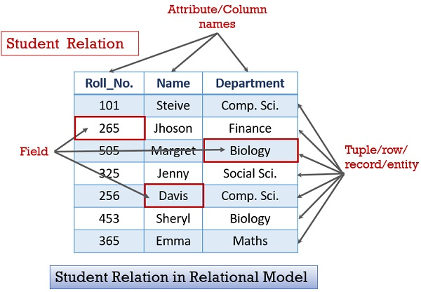
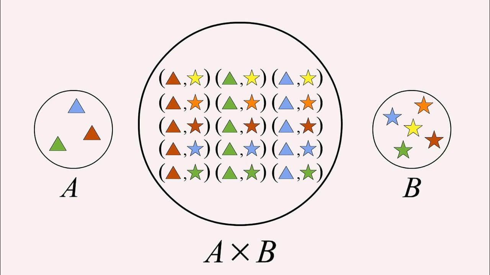

:data-transition-duration: 1000
:skip-help: true
:css: ./style.css
:substep: true
:slide-numbers: true

----

Database Course
==================
Ahmad Yoosofan

University of Kashan

----

Data or Quantitative data
===========================
Quantitative data are
-------------------------

* measures of values or counts and are expressed as numbers.
* data about numeric variables (e.g. how many; how much; or how often).
* measures of 'types' and may be represented by a name, symbol, or a number code.
* data about categorical variables (e.g. what type) [abs.gov.au]_ .

----

Quantitative Data Examples
=============================
*  I updated my phone *6 times* in a quarter.
*  My teenager grew by *3 inches* last year.
*  *83 people* downloaded the latest mobile application.
*  My aunt lost *18 pounds* last year.
*  *150 respondents* were of the opinion that the new product feature will not be successful.
*  There will be *30% increase* in revenue with the inclusion of a new product.
*  *500 people* attended the seminar.
*  *54% people* prefer shopping online instead of going to the mall.
*  She has *10 holidays* in this year.
*  Product X costs *$1000*.

----

Advantages of Quantitative Data
==================================
* Conduct in-depth research: Since quantitative data can be statistically analyzed, it is highly likely that the research will be detailed.
* Minimum bias: There are instances in research, where personal bias is involved which leads to incorrect results. Due to the numerical nature of quantitative data, the personal bias is reduced to a great extent.
* Accurate results: As the results obtained are objective in nature, they are extremely accurate.

----

Models and their Usage
==========================
* What is a model?
* Why do we need model?
* A little history of model in mathetamtics
* Real life situations and models

----

Old models for Storing Data
================================
* Why do we need secondary storage for preserving data?
* Direct Programming with Files (by Old languages like PL/I and Cobol)
* Hierarchical model
* Network model

,, :

  https://mariadb.com/kb/en/database-theory/

----

Relational Model
========================
* Table
* Field
* Record

----

Sales DataBase (1)
===================
..  csv-table::
  :header-rows: 1
  :class: smallerelementwithfullborder

  `product_id`_, product_name, stock, quantity, `customer_id`_, customer_name
  10, Sugar, 20, 2, 32,"Ali"
  11, Salt, 100, 5, 32,"Ali"
  11, Salt, 100, 6, 33,"Reza"
  10, Sugar, 20, 3, 34,"Karim"

----

Sales DataBase (2)
===================
..  csv-table::  Product Table
  :header-rows: 1
  :class: smallerelementwithfullborder

  `product_id`_, product_name, stock
  10, Sugar, 20
  11, Salt, 100

----

Sales DataBase (3)
======================
..  csv-table:: Customer Table
  :header-rows: 1
  :class: smallerelementwithfullborder

  `customer_id`_, customer_name
  32,"Ali"
  33,"Reza"
  34,"Karim"

----

Sales DataBase (4)
===================
..  csv-table:: Sales Table
  :header-rows: 1
  :class: smallerelementwithfullborder

  `product_id`_, `customer_id`_, quantity
  10, 32, 2
  11, 32, 5
  11, 33, 6
  10, 34, 3

----

Sales DataBase (5)
======================
* Product Table:  (`product_id`_, product_name, stock)
* Customer Table: (  `customer_id`_, customer_name )
* Sales Table: ( `product_id`_, `customer_id`_ , quantity)

----

Parts Suppliers Database
===================================
* P(pn_, pname, color, weight, city)
* S(sn_, sname, status, city)
* SP(sn_, pn_, qty)

----

Parts, Suppliers and Projects Database
===============================================
* S(sn_ ,sname,status,city)
* P(pn_ ,pname,color,weight,city)
* J(jn_ ,jname,budget,city)
* SPJ(sn_ , pn_ , jn_ ,qty)

----

جدول فروش یک فروشگاه
===============================

..  csv-table::
  :header: `شماره جنس`_,نام جنس,موجودی,`شماره فاکتور فروش`_,میزان فروش
  :class: smallerelementwithfullborder

  1,شکر,1000,1,12
  1,شکر,1000,4,14
  1,شکر,1000,5,5
  2,نمک,1500,2,10
  2,نمک,1500,4,20
  2,نمک,1500,5,30
  2,نمک,1500,3,40

.. ::

  .. math::

	\begin{matrix}
	1 & 2 & 3\\
	a & b & c
	\end{matrix}

----

:class: t2c

فروشگاه ۲
===============================
..  csv-table::
  :header: `شماره جنس`_,نام جنس,موجودی
  :class: smallerelementwithfullborder

  1,شکر,1000
  2,نمک,1500

..  csv-table::
  :header: `شماره جنس`_,`شماره فاکتور فروش`_,میزان فروش
  :class: smallerelementwithfullborder

  1,1,12
  1,4,14
  1,5,5
  2,2,10
  2,4,20
  2,5,30
  2,3,40

----

Types
===========
Not exact types
--------------------
* product_id: positive number
* product_name: string
* stock: positive number
* quantity: positive number
* customer_id: positive number
* customer_name: string

----

Relational Model Like Table
===============================

.. image:: img/relational_model/Relational_model_concepts.png
    :align: center

https://en.wikipedia.org/wiki/Relational_model

----

.. ::

  * Type or Domain Name
  * Label Name

https://binaryterms.com/relational-data-model.html

----

Cartesian Product(I)
======================
X × Y = { (x, y) ∣ x ∈ X ∧ y ∈ Y}

`https://smartinsight.ir/ضرب-دکارتی-دو-مجموعه/ <https://smartinsight.ir/ضرب-دکارتی-دو-مجموعه/>`_

.. :

  https://www.sciencedirect.com/topics/computer-science/cartesian-product#:~:text=In%20mathematics%2C%20the%20Cartesian%20Product,%2C%20(2%2C%205)%7D.
  https://en.wikipedia.org/wiki/Cartesian_product

----

Cartesian Product(I)
======================

.. :

    .. math::

      A \times B = \left\{ {\left( {a,b} \right) \mid a \in A \text{ and } b \in B} \right\}.

A × B = { (a, b) ∣ a ∈ A ∧ b ∈ B}

A={1, 2, 3} and B={x, y}

.. image:: img/relational_model/cartesianproduct1.svg
    :align: center
    :width: 300px
    :height: 200px

A × B = {(1, x), (1, y), (2, x), (2, y), (3, x), (3, y)}

B × A = {(x, 1), (x, 2), (x, 3), (y, 1), (y, 2), (y, 3)

A × B ≠ B × A

https://math24.net/cartesian-product-sets.html

.. :

  https://www.math-only-math.com/Cartesian-Product-of-Two-Sets.html
  https://www.britannica.com/science/set-theory/Equivalent-sets
  https://math.libretexts.org/Bookshelves/Combinatorics_and_Discrete_Mathematics/A_Spiral_Workbook_for_Discrete_Mathematics_(Kwong)/04%3A_Sets/4.04%3A_Cartesian_Products
  https://math.libretexts.org/Bookshelves/Mathematical_Logic_and_Proof/Book%3A_Mathematical_Reasoning__Writing_and_Proof_(Sundstrom)/5%3A_Set_Theory/5.4%3A_Cartesian_Products

----

Set of Tuples (1)
===================

.. code:: python

  {
    ( a11, a12, a13, ... , a1n ) , # Tuple 1
    ( a21, a22, a23, ... , a2n ) , # Tuple 2
           ....
    ( am1, am2, am3, ... , amn )   # Tuple m
  }

* Domain of ({a11, a21, `...` , am1}) = S1
* Domain of ({a12, a22, `...` , am2}) = S2
* `...`
* Domain of ({a1n, a2n, `...` , amn}) = Sn

R1 ⊆ S1 * S2 * `...` * Sn

* {a11, a21, `...` , am1} ⊆ S1
* {a12, a22, `...` , am2} ⊆ S2
* `...`  ⊆ Si
* {a1n, a2n, `...` , amn} ⊆ Sn

.. :

  https://www.toppr.com/guides/+maths/relations-and-functions/cartesian-product-sets/
  https://en.wikipedia.org/wiki/Cartesian_product

----

Set of Tuples (2)
===================

.. code:: python

  {
    { a11 : Label_1 , a12 : Label_2 , a13 : Label_3 , ... , a1n : Label_n } , # Tuple 1
    { a21 : Label_1 , a22 : Label_2 , a23 : Label_3 , ... , a2n : Label_n } , # Tuple 2
           ....
    { am1 : Label_1 , am2 : Label_2 , am3 : Label_3 , ... , amn : Label_n } , # Tuple m
  }

----

Set of Tuples (3)
===================
.. code:: python

  {
    { a21 : Label_1 , a22 : Label_2 , a23 : Label_3 , ... , a2n : Label_n } , # Tuple 2
    { a11 : Label_1 , a12 : Label_2 , a13 : Label_3 , ... , a1n : Label_n } , # Tuple 1
           ....
    { am1n : Label_1 , am2n : Label_2 , am3n : Label_3 , ... , amn : Label_n } , # Tuple m
  }

----

Set of Tuples (4)
===================
.. code:: python

  {
    { a21 : Label_1 , a22 : Label_2 , a23 : Label_3 , ... , a2n : Label_n } , # Tuple 2
    { a12 : Label_2 , a13 : Label_3 , a11 : Label_1 ,  ... , a1n : Label_n } , # Tuple 1
           ....
    { am1 : Label_1 , am2 : Label_2 , am3 : Label_3 , ... , amn : Label_n } , # Tuple m
  }

----

Relational Algebra
=========================
http://yoosofan.github.io/webrel/index.html

http://yoosofan.github.io/webrel/help/help.html

* Schema
* Table Schema
* Database Schema

----

.. code:: sql

  p;
  ------
  s minus s ;
  ------
  RELATION {
    TUPLE{
      PN PN("s4"), SNAME SNAME("Clark"),
      STATUS STATUS(20), CITY CITY("London")
    }
  };
  ------
  p
  minus
  RELATION {
    TUPLE{
      PN("p1"), PNAME("Nut"),
      COLOR("Red"), WEIGHT(12), CITY("London")
    }
  };
  ------
  p
  union
  RELATION {
    TUPLE{
      PN("p7"), PNAME("Bult2"),
      COLOR("White"), WEIGHT(15), CITY("Kashan")
    },
    TUPLE{
      PN("p8"), PNAME("Clark"),
      COLOR("Red"), WEIGHT(20), CITY("London")
    }
  };

----

.. code:: sql

  RELATION {
    TUPLE{
      SN SN("s7"), SNAME SNAME("Clark"),
      STATUS STATUS(20), CITY CITY("London")
    },

    TUPLE{
      SN SN ("s8"), SNAME SNAME("John"),
      STATUS STATUS(25), CITY CITY("Shiraz")
    }
  };
  ------
  RELATION {
    TUPLE{
      SN("s4"), SNAME("Clark"),
      STATUS(20), CITY("London")
    },
    TUPLE{
      SN("s4"), SNAME("Clark"),
      STATUS(20), CITY("London")
    }
  };
  ------
  RELATION {
    TUPLE{SN SN("s4"), SNAME SNAME("Clark"), STATUS STATUS(20), CITY CITY("London")},
    TUPLE{SN SN ("s5"), SNAME SNAME("Adam"), STATUS STATUS(40), CITY CITY("London")}
    }
  union
  RELATION {
      TUPLE{SN SN("s6"), SNAME SNAME("Clark"), STATUS STATUS(20), CITY CITY("London")},
      TUPLE{SN SN ("s7"), SNAME SNAME("Adam"), STATUS STATUS(40), CITY CITY("London")
      }
  };

----

Assignment
==============
.. code:: sql

  a := s
      union
        RELATION{
          TUPLE{SN("s16"), SNAME("Clark"), STATUS(20), CITY("London")},
          TUPLE{SN("s17"), SNAME("Adam"), STATUS(40), CITY("London")}
        };

.. csv-table: 
  :header-rows: 1
  :class: substep  smallerelementwithfullborder

  SN,SNAME,STATUS,CITY
  S1,Smith,20,London
  S2,Jones,10,Paris
  S3,Blake,30,Paris
  S4,Clark,20,London
  S5,Adams,30,Athens

.. csv-table:: 
  :header-rows: 1
  :class: substep  smallerelementwithfullborder

  SN,SNAME,STATUS,CITY
  S1,Smith,20,London
  S2,Jones,10,Paris
  S3,Blake,30,Paris
  S4,Clark,20,London
  S5,Adams,30,Athens
  s16,Clark,20,London
  s17,Adam,40,London

----

:class: t2c

Projection
================
.. code:: sql

  s{city};

.. code:: sql

  a minus s ;

.. csv-table::
  :header-rows: 1
  :class: smallerelementwithfullborder

  CITY
  London
  Paris
  Athens

.. csv-table::
  :header-rows: 1
  :class: smallerelementwithfullborder

  SN,SNAME,STATUS,CITY
  s16,Clark,20,London
  s17,Adam,40,London

.. code:: sql

  p{city} minus s{city};

.. code:: sql

  p{city, pname};

.. csv-table::
  :header-rows: 1
  :class: smallerelementwithfullborder

  CITY
  Oslo

.. csv-table::
  :header-rows: 1
  :class: smallerelementwithfullborder

  CITY,PNAME
  London,Nut
  Paris,Bolt
  Oslo,Screw
  london,Screw
  Paris,Cam
  London,Cog

----

:class: t2c

.. class:: rtl-h1

    شهرهایی را بیابید که هم عرضه کننده و هم قطعه در آنها هست.

.. container:: substep

    .. code:: sql
        :class: substep

        s{city} minus (s{city} minus p{city});

    .. code:: sql
        :class: substep

        p{city} minus (p{city} minus s{city});

    .. code:: sql
        :class: substep

        s{city} intersect p{city};

.. csv-table::
  :header-rows: 1
  :class: smallerelementwithfullborder substep

  CITY
  London
  Paris

----

.. class:: rtl-h1

    شهرهای عرضه کنندگانی را بیابید که در آن شهرها قطعه‌ای نیست.

.. code:: sql
    :class: substep

    s{city} minus p{city};

.. csv-table::
  :header-rows: 1
  :class: substep smallerelementwithfullborder

  CITY
  Athens

----

.. class:: rtl-h1

    شهرهایی را بیابید که یا عرضه کننده یا قطعه یا هر دو در آنهاست.

.. code:: sql
    :class: substep

    s{city} union p{city};

.. class:: rtl-h2 substep

شهرهایی را بیابید که یا عرضه کننده یا قطعه در آنها باشد ولی هر قطعه یا عرضه کننده دو در آن شهرها نباشد

.. code:: sql
    :class: substep

    (s{city} union p{city}) minus (s{city} intersect p{city});

.. code:: sql
    :class: substep

    (s{city} minus p{city}) union (p{city} minus s{city});

.. csv-table::
  :header-rows: 1
  :class: smallerelementwithfullborder substep

  CITY
  Athens
  Oslo

----

Condition
================
.. code:: sql

  p where city = "Paris";

.. csv-table::
  :header-rows: 1
  :class: smallerelementwithfullborder substep

  PN,PNAME,COLOR,WEIGHT,CITY
  P2,Bolt,Green,17,Paris
  P5,Cam,Blue,12,Paris

----

.. class:: rtl-h1

    نام عرضه کنندگان با وضعیت بیشتر از ۴۰ را بیابید.

.. code:: sql
    :class: substep

    s where status > 40;

.. code:: sql
    :class: substep

    (s where status > 40){sname};

----

.. class:: rtl-h1

    نام عرضه کنندگانی را بیابید که وضعیت آنها(status) بیشتر از ۲۵ است.

.. code:: sql
    :class: substep

    (s where status > 25){sname};

.. class:: substep

    Where

.. csv-table::
  :header-rows: 1
  :class: smallerelementwithfullborder substep

  SN,SNAME,STATUS,CITY
  S3,Blake,30,Paris
  S5,Adams,30,Athens

.. class:: substep

    Project

.. csv-table::
  :header-rows: 1
  :class: smallerelementwithfullborder substep

  SNAME
  Blake
  Adams

----

:data-rotate: 90

Get part names of P2
============================
.. class:: rtl-h1

    نام قطعهٔ P2 را بیابید.

.. code:: sql
    :class: substep

    (P where pn = "P2") {pname};

----

.. class:: rtl-h1

    نام شهرهایی را بیابید که یا قطعه‌ای با وزن بیشتر از 13 در آنها هست یا عرضه‌کننده‌ای با وضعیت بیشتر از ۳۴ در آنها هست.

.. code:: sql
    :class: substep

    (p where weight > 13){city} union (s where status > 34){city};

.. csv-table::
  :header-rows: 1
  :class: smallerelementwithfullborder substep

  CITY
  Paris
  Oslo
  london

----

.. class:: rtl-h1

    نام شهرهایی را بیابید که یا قطعه‌ای با وزن بیشتر از ۲۴ در آنها هست یا عرضه‌کننده‌ای با وضعیت بیشتر از ۲۱ در آنها هست.

.. code:: sql
    :class: substep

    (p where weight > 24){city} union (s where status > 21){city};

.. csv-table::
  :header-rows: 1
  :class: smallerelementwithfullborder substep

  CITY
  Paris
  Athens

----

:class: t2c

Times
===========
.. code:: sql

  p{city} times s{status};

  p{pname, weight} times s{sname} ;

  p{pn} times s{sn} ;

  p{city} times s{city} -- wrong

  p{pn, pname, color}
  times
  s{sn, sname, status};

.. csv-table::
  :header-rows: 1
  :class: smallerelementwithfullborder substep

    CITY,STATUS
    London,20
    London,10
    London,30
    Paris,20
    Paris,10
    Paris,30
    Oslo,20
    Oslo,10
    Oslo,30

----

.. container:: name1

    .. class:: rtl-h1

    چه عرضه‌کنندگانی چه قطعاتی را عرضه نکرده‌اند.
    
   .. class:: rtl-h2 substep
   
      زوج شمارهٔ عرضه‌کنندگان و قطعاتی را بیابید که آن عرضه کنندگان آن قطعات را عرضه نکرده باشند.

  .. list-table::
      :class: substep

      * - .. csv-table::
            :header-rows: 1
            :class: smallerelementwithfullborder

            PN,SN
            P1,S3
            P1,S4
            P1,S5
            P2,S5
            P3,S2
            P3,S3

        - ``.``

        - .. csv-table::
            :header-rows: 1
            :class: smallerelementwithfullborder

            PN,SN
            P3,S4
            P3,S5
            P4,S2
            P4,S3
            P4,S5
            P5,S2

        - ``.``

        - .. csv-table::
            :header-rows: 1
            :class: smallerelementwithfullborder

            PN,SN
            P5,S3
            P5,S5
            P6,S2
            P6,S3
            P6,S4
            P6,S5

        - ``.``

        - .. code:: sql
              :class: substep

              (p{pn} times s{sn})
              minus
              sp{sn,pn};

----

Rename
===========
.. class:: rtl-h1

  تغییر نام

.. code::
    :class: substep

    S rename SN as SN1;

.. csv-table::
  :header-rows: 1
  :class: substep  smallerelementwithfullborder

    SN1,SNAME,STATUS,CITY
    S1,Smith,20,London
    S2,Jones,10,Paris
    S3,Blake,30,Paris
    S4,Clark,20,London
    S5,Adams,30,Athens

----

:class: t2c

.. class:: rtl-h1

قطعه‌های عرضه شده را بیابید
============================================================
.. container:: code1

    .. code:: sql
        :class: substep

        p times sp;
        -- wrong

    .. code:: sql
        :class: substep

        p
        times
        (sp rename pn as sppn)
        -- need another step

    .. code:: sql
        :class: substep

        (
          p
          times
          (sp rename pn as sppn)

        ) where pn = sppn;

    .. code:: sql
        :class: substep

        (  
          (
            p
            times
            (sp rename pn as sppn)
          ) where pn = sppn 
        ) {pn, pname, weight, color};

.. csv-table::
  :header-rows: 1
  :class: substep  smallerelementwithfullborder

    WEIGHT,PN,PNAME,COLOR
    12,P1,Nut,Red
    17,P2,Bolt,Green
    17,P3,Screw,Blue
    14,P4,Screw,Red
    12,P5,Cam,Blue
    19,P6,Cog,Red

----

:class: t2c

.. class:: rtl-h1

نام قطعه‌های عرضه شده را بیابید

.. container::

    .. code:: sql
        :class: substep

         p
         times
         (sp rename pn as sppn)

    .. code:: sql
        :class: substep

        (
          p
          times
          (sp rename pn as sppn)
         ) where pn = sppn

    .. code:: sql
        :class: substep

        (
          (
            p
            times
            (sp rename pn as sppn)
          ) where pn = sppn
        ) {pname}

.. csv-table::
  :header-rows: 1
  :class: substep  smallerelementwithfullborder

    PNAME
    Nut
    Bolt
    Screw
    Cam
    Cog

----

:class: t2c

.. class:: rtl-h1

  زوج نام عرضه‌کنندگان و نام قطعاتی را بیابید که آن عرضه کننده آن قطعه را عرضه نکرده باشد (I)
  
.. code:: sql
  :class: substep

  (p{pn} times s{sn})
  minus
  sp{sn,pn};

.. code:: sql
  :class: substep

  ( (p{pn} times s{sn})  minus  sp{sn,pn} )
  times
  (s{sn, sname} rename sn as ssn)

  ;
    
.. code:: sql
  :class: substep

  ( (p{pn} times s{sn})  minus  sp{sn,pn} )
  times
  (s{sn, sname} rename sn as ssn)
  times
  (p{pn, pname} rename pn as ppn)
  ;

.. code:: sql
  :class: substep

  (
    (
      ( (p{pn} times s{sn})  minus  sp{sn,pn} )
      times
      (s{sn, sname} rename sn as ssn)
    ) where sn == ssn
  )
  times
  (p{pn, pname} rename pn as ppn)
  ;

----

:class: t2c

.. class:: rtl-h1

  زوج نام عرضه‌کنندگان و نام قطعاتی را بیابید که آن عرضه کننده آن قطعه را عرضه نکرده باشد (II)
  
.. code:: sql
  :class: substep

  (
    (
      (
        ( (p{pn} times s{sn})  minus  sp{sn,pn} )
        times
        (s{sn, sname} rename sn as ssn)
      ) where sn == ssn
    )
    times
      (p{pn, pname} rename pn as ppn)
  ) where pn == ppn
  ;

.. code:: sql
  :class: substep

  (
    ( 
      ( (p{pn} times s{sn})  minus  sp{sn,pn} )
      times
      (s{sn, sname} rename sn as ssn)
      times
      (p{pn, pname} rename pn as ppn)
    ) where pn == ppn and sn == ssn
  ) 
  {sname, pname}
  ;
    
----

.. class:: rtl-h1

  زوج نام عرضه‌کنندگان و نام قطعاتی را بیابید که آن عرضه کننده آن قطعه را عرضه نکرده باشد(III)

.. code:: sql
  :number-lines:
   
  (
    ( 
      ( (p{pn} times s{sn})  minus  sp{sn,pn} )
      times
      (s{sn, sname} rename sn as ssn)
      times
      (p{pn, pname} rename pn as ppn)
    ) where pn == ppn and sn == ssn
  ) 
  {sname, pname}
  ;
    

.. code:: sql
  :number-lines:

  A := p{pn, pname} times s{sn, sname}; 
  B := (sp{sn, pn} times (s{sn, sname} rename sn as ssn1) where sn = ssn1;
  C := (B times (p{pn, pname} rename pn as pn1) where pn = pn1;
  A minus (C{sn, sname, pn, pname})

----

:class: t2c

.. class:: rtl-h1

  زوج نام عرضه‌کنندگان و نام قطعاتی را بیابید که آن عرضه کننده آن قطعه را عرضه نکرده باشد (IV)
  

.. code:: sql
  :number-lines:

  A := p{pn, pname} times s{sn, sname}; 
  B := (
          sp{sn, pn} 
          times 
          (
            s{sn, sname} rename sn as ssn1
          ) where sn = ssn1
        )
      ;
  C := (
          B 
          times 
          (
            p{pn, pname} rename pn as pn1
          ) where pn = pn1
        );
  A minus (C{sn, sname, pn, pname})

  
----

.. class:: rtl-h1

  نام عرضه‌کنندگانی را بیابید که هیچ قطعه‌ای عرضه نکرده‌اند.
  
.. code:: sql
  :class: substep

  s{sn}  minus  sp{sn} ;
    
.. code:: sql
  :class: substep

  ( s{sn}  minus  sp{sn} ) times s ; -- wrong

.. code:: sql
  :class: substep

  ( s{sn}  minus  sp{sn} ) times (s rename sn as ssn) ;

.. code:: sql
  :class: substep

  ( ( s{sn}  minus  sp{sn} ) times (s rename sn as ssn) ) where sn = ssn;

.. code:: sql
  :class: substep

  ( ( ( s{sn}  minus  sp{sn} ) times (s rename sn as ssn) ) where sn = ssn) {sname};

.. code:: sql
  :class: substep

  (
    ( -- better format
      (s{sn}  minus  sp{sn}) 
      times 
      (s rename sn as ssn) 
    ) where sn = ssn
  ){sname}
  ;

----

:class: t2c

.. class:: rtl-h1

    زوج شهرهای عرضه‌کنندگان و شهرهای قطعات را بیابید.

.. container::

  .. code:: sql
      :class: substep

        s times  p;

  .. code:: sql
      :class: substep

        s{city} times  p{city};

  .. code:: sql
      :class: substep

        ( s rename city as scity ){scity}
        times
        p{city};

.. csv-table::
  :header-rows: 1
  :class: substep  smallerelementwithfullborder

    scity,CITY
    London,London
    London,Paris
    London,Oslo
    Paris,London
    Paris,Paris
    Paris,Oslo
    Athens,London
    Athens,Paris
    Athens,Oslo

----

:class: t2c

.. class:: rtl-h1

    زوج شهرهای عرضه‌کنندگان و شهرهای قطعات غیرهمشهری را بیابید.

.. container::

  .. code:: sql
      :class: substep

        ( s rename city as scity ){scity}
        times
        p{city};

  .. code:: sql
      :class: substep

        (
          ( s rename city as scity ){scity}
          times
          p{city}
        ) where scity <> pcity;

.. csv-table::
  :header-rows: 1
  :class: substep  smallerelementwithfullborder

    scity,CITY
    London,Paris
    London,Oslo
    Paris,London
    Paris,Oslo
    Athens,London
    Athens,Paris
    Athens,Oslo

----

:class: t2c

.. :

  Get supplier names who supply any part
  ====================================================

.. class:: rtl-h1

نام عرضه کنندگانی را بیابید که قطعه‌ای عرضه کرده باشند.

.. container::

  .. code:: sql
      :class: substep

      s times sp

  .. code:: sql
      :class: substep

      (s rename sn as sn1) times sp

  .. code:: sql
      :class: substep

      ((s rename sn as sn1) times sp) where sn1=sn;

  .. code:: sql
      :class: substep

      (((s rename sn as sn1) times sp) where sn1=sn){sname};

.. csv-table::
  :header-rows: 1
  :class: substep  smallerelementwithfullborder

    sname
    Smith
    Jones
    Blake
    Clark

.. :

    ----

    :class: t2c

    .. class:: rtl-h1

    زوج شهر عرضه‌کننده و شهر قطعه‌هایی را بیابید که  آن عرضه‌کنندگان آن قطعات را عرضه کرده باشند.

    .. code:: sql

      (
        (
          (s rename city as scity)
          times
          (sp  rename sn as  spsn)
        ) where  sn = spsn
      )

----

:class: t2c

.. class:: rtl-h1

  نام عرضه کنندگانی را بیابید که عرضه‌ای(qty) بیشتر از ۳۰۰ داشته باشند.

.. code:: sql
  :class: substep

  s
  times
  sp
  
.. code:: sql
  :class: substep

      (s rename sn as sn1)
      times
      sp

.. code:: sql
  :class: substep

  (s rename sn as sn1)
  times
  (sp where qty > 300)

.. code:: sql
  :class: substep

  (
    (s rename sn as sn1)
    times
    (sp where qty > 300)
  ) where sn1 = sn

.. code:: sql
  :class: substep

  (
    (
      (s rename sn as sn1)
      times
      (sp where qty > 300)
    ) where sn1 = sn
  ) {sname};

.. code:: sql
  :class: substep

  (
    (
      (s rename sn as sn1)
      times
      sp
    ) where sn1 = sn and qty > 300
  ) {sname};

----

:class: t2c

.. :

    Get supplier names for suppliers that supply part P4
    ==============================================================

.. class:: rtl-h1

  نام عرضه کنندگانی را بیابید که قطعهٔ P4 را عرضه کرده باشد

.. code:: sql
    :class: substep

    (
      (
        (S rename sn as sn1)
        times
        (sp where pn = "P4")
      ) where sn1=sn
    ){sname};

.. csv-table::
  :header-rows: 1
  :class: substep  smallerelementwithfullborder

    sname
    Smith
    Clark

----

:class: t2c

.. :

    Get supplier city for suppliers that supply Red parts(I)
    ==========================================================

.. class:: rtl-h1

  شهر عرضه کنندگانی را بیابید که قطعهٔ قرمزی را عرضه کرده باشند(I).

.. class:: rtl-h1 substep

  شهر عرضه‌کنندگانی را بیابید که دست کم یک عرضه‌کننده در آن شهر دست‌کم یک قطعهٔ قرمز را عرضه کرده باشد

.. code:: sql
  :class: substep

  (s rename sn as sn1)
  times
  sp

.. code:: sql
  :class: substep

  (
    (s rename sn as sn1)
    times
    sp
  ) where sn1 = sn

.. code:: sql
  :class: substep

  (
    (
      (s rename sn as sn1)
      times
      sp
    ) where sn1 = sn
  )
  times
  (p rename pn as pn1)

.. code:: sql
  :class: substep

  (
    (
      (s rename sn as sn1)
      times
      sp
    ) where sn1 = sn
  )
  times
  ( (p rename pn as pn1) where color = "Red")

----

:class: t2c

.. :

  Get supplier city for suppliers who supply Red parts(II)
  ==========================================================

.. class:: rtl-h1

شهر عرضه کنندگانی را بیابید که قطعهٔ قرمزی را عرضه کرده باشند(II).

.. code:: sql
  :class: substep

  (
    (
      (s rename sn as sn1)
      times
      sp
    ) where sn1 = sn
  )
  times
  (
    ( 
      (p rename pn as pn1) 
      where color = "Red"
    ){pn1}
  )

.. code:: sql
  :class: substep

  (
    (
      (
        (
          (s rename sn as sn1)
          times
          sp
        ) where sn1 = sn
      )
      times
      (
        ( 
          (p rename pn as pn1) 
          where color = "Red"
        ){pn1}
      ) where pn1 = pn
    )
  ){city}
  ;

----

:class: t2c

.. :

  Get supplier city for suppliers who supply Red parts(III)
  ==========================================================

.. class:: rtl-h1

  شهر عرضه کنندگانی را بیابید که قطعهٔ قرمزی را عرضه کرده باشند.

.. code:: sql
    :class: substep

    (
      (
        (
          (
            (
              (s rename sn as sn1)
              times
              sp
            ) where sn1=sn
          ){pn, city}
        )
        times
        (
          (
            (
              (p where color = "Red")
            ){pn}
          ) rename pn as pn1
        )
      ) where pn1=pn
    ){city};

.. csv-table::
  :header-rows: 1
  :class: substep  smallerelementwithfullborder

    CITY
    London
    Paris

----

:class: t2c

.. class:: rtl-h1

  شهر عرضه کنندگانی را بیابید که قطعهٔ قرمزی با وزن بیشتر از ۱۳ را عرضه کرده باشند.

.. code:: sql
  :class: substep

  (
    (
      (
        (
          (
            (s rename sn as sn1) 
            times 
            sp 
          ) where sn=sn1
        ){pn, city}
      )
      times
      (
        (
          (
            (p where color = "Red") 
            where weight > 13 
          ){pn}
        ) rename pn as pn1
      )
    ) where pn1=pn
  ){city};

.. code:: sql
  :class: substep

  (
    (
      (
        (
          (s rename sn as sn1)
          times
          (sp rename pn as pn1)
        ) where sn1=sn
      ){pn1, city}
      times
      (
        (
          (p where color = "Red") 
          where weight > 13
        ){pn}
      ) 
    ) where pn1=pn
  ){city};

----

.. class:: rtl-h1

    شهر عرضه کنندگانی را بیابید که در شهر آنها قطعه‌ای نیز وجود داشته باشد.

.. code:: sql
    :class: substep

    s{city} intersect p{city};

----

:class: t2c

.. class:: rtl-h1

    نام عرضه کنندگانی را بیابید که در شهر آنها قطعه‌ای وجود ندارد.

.. code:: sql
  :class: substep

  s{city} minus p{city};

.. code:: sql
  :class: substep

  (s{city} minus p{city})
  times
  (s rename city as scity)

.. code:: sql
  :class: substep

  (
    (s{city} minus p{city})
    times
    (s rename city as scity)
  ) where city = scity

.. code:: sql
  :class: substep

  (
   (
      (s{city} minus p{city})
      times
      (s rename city as scity)
    ) where city = scity
  ){sname};

.. csv-table::
  :header-rows: 1
  :class: substep  smallerelementwithfullborder

  SNAME
  Adams

----

:class: t2c

.. class:: rtl-h1

    نام قطعه‌های عرضه شده را بیابید.

.. code:: sql
    :class: substep

    ( 
      ( 
        p{pn, pname} 
        times 
        (sp rename pn as pn1)
      ) where pn1 = pn 
    ) {pname};

.. csv-table::
  :header-rows: 1
  :class: substep  smallerelementwithfullborder

    PNAME
    Nut
    Bolt
    Screw
    Cam
    Cog

----

:class: t2c

.. class:: rtl-h1

    شهر قطعه‌های عرضه شده با وزن بیشتر از ۱۵ را بیابید.

.. code:: sql
    :class: substep

    (
      (
        (p where weight > 15)
        times
        (sp rename pn as pn1)
      ) where pn1 = pn
    ){city};

.. csv-table::
  :header-rows: 1
  :class: substep  smallerelementwithfullborder

   CITY
   Paris
   Oslo
   London

----

:class: t2c

.. class:: rtl-h1

    نام عرضه کنندگانی را بیابید که قطعه‌ای در شهر پاریس عرضه کرده باشند.

.. code:: sql
    :class: substep

    (
      (
        (
          (
            (
              s{sn, sname}
              times
              (sp rename sn as sn1)
            ) where sn1 = sn
          )
          times
          (p rename pn as pn1)
        ) where pn1 = pn
      ) where city = "Paris"
    ){sname} ;

.. csv-table::
  :header-rows: 1
  :class: substep  smallerelementwithfullborder

   SNAME
   Smith
   Jones
   Blake
   Clark

----

:class: t2c

Join پیوند
====================
.. code:: sql

  ( p times (sp rename pn as sppn) ) where sppn = pn

.. code:: sql

  (
    p 
    times 
    (sp rename pn as sppn) 
  ) where sppn = pn

.. code:: sql
  :class: substep

  p join sp

.. class:: substep

* Join does not have order
* It will apply equals for each shared attributes
* It will apply times for two relations without shared attribute

----

:class: t2c

.. class:: rtl-h1

    نام قطعه‌های عرضه شده را بیابید.

.. code:: sql

    (
      (
        p 
        times 
        (sp rename pn as sppn) 
      ) where sppn = pn
    ){pname};

.. code:: sql

    (p join sp){pname}

----

:class: t2c

.. class:: rtl-h1

    نام قطعه‌های قرمز عرضه شده را بیابید.

.. code:: sql

    (
      (
        (p where color="Red")
        times 
        (sp rename pn as sppn) 
      ) where sppn = pn
    ){pname};

.. code:: sql

    ( 
      (p where color = "Red") 
      join 
      sp
    ){pname}

----

:class: t2c

.. class:: rtl-h1

    شهر قطعه‌های عرضه شده با وزن بیشتر از ۱۵ را بیابید.

.. code:: sql
    :class: substep

    (
      (p where weight > 15)
      join
      sp
    ){city};

.. csv-table::
  :header-rows: 1
  :class: substep  smallerelementwithfullborder

   CITY
   Paris
   Oslo
   London

----

:class: t2c

.. class:: rtl-h1

    نام عرضه کنندگانی را بیابید که در شهر آنها قطعه‌ای وجود ندارد.

.. code:: sql
  :class: substep

  s{city} minus p{city};

.. code:: sql
  :class: substep

  (s{city} minus p{city})
  join
  s

.. code:: sql
  :class: substep

  (
    (s{city} minus p{city})
    join
    s  
  ){sname};

.. code:: sql
  :class: substep
   
  s{sname} 
  minus 
  ((s join p){sname});

.. csv-table::
  :header-rows: 1
  :class: substep  smallerelementwithfullborder

  SNAME
  Adams

----

:class: t2c

.. class:: rtl-h1

    نام عرضه کنندگانی را بیابید که قطعه‌ای در شهر پاریس عرضه کرده باشند.

.. container::

  .. code:: sql
      :class: substep

      ( (s{sn, sname} join sp) join p) where city = "Paris"){sname} ;

  .. code:: sql
      :class: substep

      (
        (
          (s{sn, sname} join sp)
          join 
          p
        ) where city = "Paris"
      ){sname} ;

.. csv-table::
  :header-rows: 1
  :class: substep  smallerelementwithfullborder

    SNAME
    Smith
    Jones
    Blake
    Clark

.. code:: sql
    :class: substep

    (            --- راه حل نادرست
      (
       (s join sp)
       join p
      ) where city = "Paris"
    ){sname} ;

.. code:: sql
    :class: substep

      (    -- راه حل نادرست
       (s join sp){pn, sname}
       join p
      ) where city = "Paris"
    ){sname} ;

.. code:: sql
    :class: substep

      (    -- راه حل نادرست
       (p{city} where city='Paris') join s
    ){sname} ;

----

:class: t2c

.. class:: rtl-h1

    نام عرضه کنندگانی را بیابید که قطعه‌ای در شهر خودشان عرضه کرده باشند.

.. code:: sql
  :class: substep

  (
    (s join sp) join p
  ){sname} ;

.. csv-table::
  :header-rows: 1
  :class: substep  smallerelementwithfullborder

  SNAME
  Smith
  Jones
  Blake
  Clark

.. code:: sql
  :class: substep

  --      نادرست۱
  (
    (s join sp) 
    join 
    (p{city})
  ){sname} ;

.. code:: sql
  :class: substep

  --      نادرست۲
  (
    (s join sp) 
    join 
    p{city}
  ){sname} ;

.. code:: sql
  :class: substep

  --      نادرست۳
  (s join sp join p{city}){sname} ;

.. code:: sql
  :class: substep

  --      نادرست۴
  (s join sp join p{city}){sname} ;

.. code:: sql
  :class: substep

  --      نادرست۵

  ((s join sp{sn})join p){sname};

.. code:: sql
  :class: substep

  --      نادرست۶
  ((sp join s){sn, sname} join p){sname};

.. code:: sql
  :class: substep

  --      نادرست۷
  ((sp join s){sn, sname, city) join p){sname};

.. code:: sql
  :class: substep

  --      نادرست۸
  (((s join sp ){city}) join p){sname};

----

:class: t2c

.. class:: rtl-h1

    نام قطعاتی را بیابید که وزن‌شان بیشتر از ۱۰ است و عرضه‌کننده‌ای در شهر پاریس با وضعیت بیشتر از ۲۰ آنها را عرضه کرده باشد.

.. code:: sql
    :class: substep

    ( p where weight > 10 ){pn, pname}

.. code:: sql
    :class: substep

    (s where status > 20) where city = "Paris"

.. code:: sql
    :class: substep

    ( p where weight > 10 ){pn, pname}
    join
    sp

.. code:: sql
    :class: substep

    (
      (
        ( p where weight > 10 ){pn, pname}
        join
        sp
      )
      join
      (
        (s where status > 20) where city = "Paris"
      )
    ){pname} ;

.. code:: sql
    :class: substep

    (
      (
        ( p where weight > 10 ){pn, pname}
        join
        sp
      )
      join
      (
        (s where status > 20) where city = "Paris"
      )
    ){pname} ;

.. code:: sql
    :class: substep

    (
      (
        ( p where weight > 10 ){pn, pname}
        join
        sp
      )
      join
      (s where status > 20 and city = "Paris")
    ){pname} ;

.. csv-table::
  :header-rows: 1
  :class: substep  smallerelementwithfullborder

   PNAME
   Bolt

----

Keys
==============
Super Keys
ابر کلیدها

.. class:: substep

  * P(pn_, pname, color, weight, city)

    * {pn}, {pn, pname}, {pn, color}, {pn, pname, weight}
    * {pn, city, color} {pn, pname, color, weight, city}
    * نادرست‌ها
        * {city}
        * {city, weight}
        * {pname, city, weight}
        * {pname, color}
    * هیچ دو قطعه‌ای در یک شهر نام یکسانی ندارند.
        * {pn}, {pname, city}, {pn, city}
        * {pname, city, weight}
    * اگر در هر شهر فقط یک قطعه بتواند باشد.
        * {pn}, {city}, {pn, city} , {city, pname}
        * {city, pname, color}

----

Candidate Keys کلیدهای نامزد
================================================
.. class:: substep

  * S(sn_, sname, status, city)

    * {sn}
    * هیچ دو عرضه‌کننده‌ای در یک شهر نام یکسانی ندارند.
        * {sn}
        * {sname, city}
    * اگر در هر شهر فقط یک عرضه کننده بتواند باشد.
        * {sn}
        * {city}
  * SP(sn_, pn_, qty) 
      * {sn, pn}

----

Primary key کلید اصلی
========================================

.. class:: substep

  * SP(sn_, pn_, qty)
  * S(sn_, sname, status, city)

    * {sn}
    * هیچ دو عرضه‌کننده‌ای در یک شهر نام یکسانی ندارند.
        * {sn}
        * {sname, city}
        * فقط یکی از این دو بالایی کلید اصلی گذاشته شود.
    * اگر در هر شهر فقط یک عرضه کننده بتواند باشد.
        * {sn}
        * {city}
        * فقط یکی از این دو بالایی کلید اصلی گذاشته شود.

----

Foreign key
=================
* SP(sn_, pn_, qty)
* sn from s
* pn from p

----

Project/Deparment/Employee
================================
Design 1
-----------
* Employee(SSN_, name, salary, Dn)
* Department(DN_, DeptName, MgrSSN)
* Project(PN_, location, ProjName)
* HourLog(SSN_, PN_, hours)

Design 2
--------
* Employee(SSN_, name, salary, DeptName)
* Department(DeptName_, MgrSSN)
* Project(PN_, location, ProjName)
* HourLog(SSN_, PN_, hours)

Design 3
--------
* Employee(SSN_, name, salary, DeptName)
* Department(DeptName_, MgrSSN)
* Project(ProjName_, location)
* HourLog(SSN_, ProjName_, hours)

----

SPJ
=========
* S(sn_,sname,status,city) ,
* P(pn_,pname,color,weight,city) ,
* J(jn_,jname,budget,city)
* SPJ(sn_, pn_, jn_, qty)

Library
--------------

* book( bn_ , title, category, fpd, author )
* member( mn_ , name , category, bn)
* borrow( bn_ , mn_ , nd , rdt, ret)

----

University Database
=========================
* student(ID_, name, dept_name, tot_cred)
* instructor(ID_,	name, dept_name, salary)
* department (dept_name_, building, budget)
* course(course_id_, title, dept_name, credits)
* classroom (building_, room_number_, capacity)
* section(course_id_, sec_id_, semester_, year_, building, room_number, time_slot_id)
* teaches(ID_, course_id_, sec_id_, semester_, year_)
* takes(ID_, course_id_, sec_id_, semester_, year_, grade)
* advisor(s_ID_, i_ID)
* time_slot(time_slot_id_, day_, start_time_, end_time)
* prereq(course_id_, prereq_id_)

----

.. image:: img/relational_model/university_relations.png
  :width: 800px

----

Relational Calculus
=====================
Calculation on tuples instead of relations

.. class:: substep

    * { px ∈ P | px.city = 'kashan'}
    * ∀ forall
    * ∃ exists
    * ∀ a, b ∈ R | a+b = b + a
    * ∃ a ∈ R ,  ∀ b ∈ R | a * b  = b
    * a = 1
    * ∀x p(x) ≡ ~∃x ~p(x)

----

.. class:: substep

  * RANGEOVER sx RANGES over S;
  * RANGEOVER sy RANGES over S;
  * RANGEOVER px RANGES over P;
  * RANGEOVER py RANGES over P;
  * RANGEOVER spx RANGES over SP;
  * RANGEOVER spy RANGES over SP;

----

  * { ∃ px ∈ P | px.city = 'kashan'}
  * { ∃ sx ∈ S | sx.city = 'kashan'}
  * { ∀ sx ∈ S | sx.status > 1}

.. class:: substep
  
  * px where px.city = 'kashan'
  * sx where sx.city = 'kashan'
  * sx where sx.status > 1

----

#. sx.sname where sx.sn = 's2'
    * {sx.sname sx ∈ S | sx.sn = 's2'}
#. sx.sname, sx.staus where sx.status > 100
    * {(sx.sname, sx.status) sx ∈ S | sx.status > 100}
#. sx.sn, sx.sname
#. spx.sn, spx.pn 
#. spx.sn, spy.pn 

.. class:: rtl-h1

    نام قطعات را بیابید.

1. px.pname

.. class:: rtl

    نام عرضه‌کنندگان را بیابید

2. sx.sname

----

.. class:: rtl-h1

نام قطعاتی را بیابید که وزن‌شان بیشتر از ۲۰ باشد

.. class:: substep

  * px
  * px.pname
  * px.pname where
  * px.pname where px.weight > 20

----

.. class:: rtl-h1

نام قطعاتی را بیابید که وزن‌شان بیشتر از ۲۰ باشد و در شهر کاشان باشند.

.. class:: substep

  * px
  * px.pname
  * px.pname where
  * px.pname where px.weight > 20
  * px.pname where px.weight > 20 and
  * px.pname where px.weight > 20 and px.city = 'kashan'

----

.. class:: rtl-h1

    نام قطعات قرمز رنگ با وزن بیشتر از ۱۲ را بیابید

.. class:: substep

  #. px.pname
  #. px.pname where
  #. px.pname where px.weight > 12
  #. px.pname where px.weight > 12 and
  #. px.pname where px.weight > 12 and px.color = 'red’

----

.. class:: rtl-h1

    نام و شمارهٔ قطعاتی را بیابید که وزن بیشتر از ۲۰ داشته باشند.

.. class:: substep

    #. px.pname
    #. px.pname, px.pn
    #. px.pname, px.pn where px.weight > 20
    #. {px.pname, px.pn} where px.weight > 20

----

.. class:: rtl-h1

    نام عرضه‌کنندگانی را بیابید که وضعیت بیشتر از ۱۰ داشته باشند.

.. class:: substep

    #. sx.sname
    #. sx.sname where
    #. sx.sname where sx.status > 10

----

.. class:: rtl-h1

    زوج شمارهٔ عرضه‌کنندگانی را بیابید که در یک شهر باشند.

.. class:: substep

    #. sx.sn
    #. sx.sn, sy.sn
    #. {sx.sn, sy.sn}
    #. {sx.sn, sy.sn as sn1}
    #. {sx.sn, sy.sn as sn1} where
    #. {sx.sn, sy.sn as sn1} where sx.city = sy.city
    #. {sx.sn, sy.sn as sn1} where sx.city = sy.city and
    #. {sx.sn, sy.sn as sn1} where sx.city = sy.city and sx.sn < sy.sn

----

.. class:: rtl-h1

نام شهر قطعاتی را بیابید که عرضه شده باشند.

.. class:: substep

  * px
  * px.city
  * px.city where
  * px.city where exists spx
  * px.city where exists spx(px.pn = spx.pn)

----

.. class:: rtl-h1

    نام قطعات عرضه شده را بیابید

.. class:: substep

  #. px.pname
  #. px.pname where
  #. px.pname where exists spx
  #. px.pname where exists spx (spx.pn = px.pn)

----

.. class:: rtl-h1

  نام شهرهای عرضه‌کنندگانی را بیابید که قطعهٔ با شمارهٔ p2 را عرضه کرده باشند.

.. class:: substep

  * sx.city
  * sx.city where
  * sx.city where exists spx (
      * spx.sn = sx.sn
      * and
      * spx.pn = 'p2'
      * )

  * sx.city where exists spx(spx.sn = sx.sn and spx.pn = 'p2')

  * اشکال

  * .. code:: sql
    
        sx.city where exists spx (
          spx.sn = sx.sn
        ) and exists px (px.pn = 'P2')

  * .. code::

      sx.city where exists spx (
        spx.sn = sx.sn
      )  and exists spy (spy.pn = 'P2')

----

.. class:: rtl-h1

    زوج شمارهٔ عرضه‌کنندگانی را بیابید که در یک شهر باشند و قطعه یا قطعه‌هایی عرضه کرده باشند.

.. class:: substep

  1. {sx.sn, sy.sn as sn2}
  2. {sx.sn, sy.sn as sn2} where sx.city = sy.city
  3. {sx.sn, sy.sn as sn2} where sx.city = sy.city and sx.sn < sy.sn
  4. {sx.sn, sy.sn as sn2} where sx.city = sy.city and sx.sn < sy.sn and
  5. {sx.sn, sy.sn as sn2} where sx.city = sy.city and sx.sn < sy.sn and exists spx(sx.sn = spx.sn)
  6. {sx.sn, sy.sn as sn2} where sx.city = sy.city and sx.sn < sy.sn and exists spx(sx.sn = spx.sn) and
  7. {sx.sn, sy.sn as sn2} where sx.city = sy.city and sx.sn < sy.sn and exists spx(sx.sn = spx.sn) and exists spy
  8. {sx.sn, sy.sn as sn2} where sx.city = sy.city and sx.sn < sy.sn and exists spx(sx.sn = spx.sn) and exists spy(sy.sn = spy.sn)

.. class:: rtl substep

    پاسخ نادرست

.. class:: substep

  9. {sx.sn, sy.sn as sn2} where sx.city = sy.city and sx.sn < sy.sn and exists spx(sx.sn = spx.sn and sy.sn = spx.sn)

----

.. class:: rtl-h1

    نام عرضه‌کنندگانی را بیابید که دست کم یک قطعهٔ قرمز عرضه کرده باشند.

.. class:: substep

    #. sx.sname
    #. sx.sname where
    #. sx.sname where exists spx(sx.sn=spx.sn and
    #. sx.sname where exists spx(sx.sn=spx.sn and exists px
    #. sx.sname where exists spx(sx.sn=spx.sn and exists px(px.pn=spx.pn
    #. sx.sname where exists spx(sx.sn=spx.sn and exists px(px.pn=spx.pn and
    #. sx.sname where exists spx(sx.sn=spx.sn and exists px(px.pn=spx.pn and px.color = 'red’))

#. sx.sname where exists px(px.color = 'red’  and exists spx(px.pn=spx.pn and sx.sn=spx.sn))

.. class:: rtl substep

  پاسخ نادرست

.. class:: substep

  1. sx.sname where exists spx(sx.sn=spx.sn) and exists px(px.pn=spx.pn and px.color = 'red’)
  2. sx.sname where exists spx(sx.sn=spx.sn) and exists px(exists spx(px.pn=spx.pn and px.color = 'red’))
  3. sx.sname where exists spx(sx.sn=spx.sn and px.pn=spx.pn and px.color = 'red’)

----

:class: t2c

.. class:: rtl-h1

    زوج شمارهٔ عرضه‌کنندگانی را بیابید که در یک شهر باشند و دست کم یکی از آن دو عرضه کننده، قطعه یا قطعه‌هایی عرضه کرده باشند.

.. csv-table::
  :header-rows: 1
  :class: substep  smallerelementwithfullborder

  SN,SNAME,STATUS,CITY
  S1,Smith,20,Paris
  S2,Jones,10,Paris

.. csv-table::
  :header-rows: 1
  :class: substep  smallerelementwithfullborder

  SN,PN,qty
  S2,P1,20

.. code:: sql
  :class: substep

  {sx.sn, sy.sn as sn2} where sx.city = sy.city and 
    sx.sn <> sy.sn and (exists spx(sx.sn = spx.sn))

.. csv-table::
  :header-rows: 1
  :class: substep  smallerelementwithfullborder

  sn,sn2
  s2,s1

.. code:: sql
  :class: substep

  {sx.sn, sy.sn as sn2} where sx.city = sy.city and
    sx.sn < sy.sn and exists spx(sx.sn = spx.sn)

.. csv-table::
  :header-rows: 1
  :class: substep  smallerelementwithfullborder

  sn,sn2
  ,

.. code:: sql
  :class: substep

  {sx.sn, sy.sn as sn2} where sx.city = sy.city and
   sx.sn < sy.sn and (exists spx(sx.sn = spx.sn) or 
   exists spy(sy.sn = spy.sn))

.. csv-table::
  :header-rows: 1
  :class: substep  smallerelementwithfullborder

  sn,sn2
  s1,s2

----

:class: t2c

.. class:: rtl-h1

    زوج شمارهٔ عرضه‌کنندگانی را بیابید که در یک شهر باشند و دست کم یکی از آن دو عرضه کننده، قطعه یا قطعه‌هایی عرضه کرده باشند.

.. code:: sql
  :class: substep

  {sx.sn, sy.sn as sn2} where sx.city = sy.city and
   sx.sn < sy.sn and exists spx(sx.sn = spx.sn or sy.sn = spx.sn)

هر دو عرضه کرده باشند (راه حل اشتباه)

.. code:: sql
  :class: substep

  {sx.sn, sy.sn as sn2} where sx.city = sy.city and
   sx.sn < sy.sn and exists spx(sx.sn = spx.sn and sy.sn = spx.sn)

.. code:: sql
  :class: substep

  -- راه حل درست
  {sx.sn, sy.sn as sn2} where sx.city = sy.city and
   sx.sn < sy.sn and (exists spx(sx.sn = spx.sn) and
   exists spy(sy.sn = spy.sn))

----

:class: t2c

.. class:: rtl-h1

    نام عرضه‌کنندگانی را بیابید که همهٔ قطعه‌ها را عرضه کرده باشند(I).

.. code:: sql
  :class: substep
  
  -- نادرست
  sx.sname where forall spx(sx.sn=spx.sn)

.. code:: sql
  :class: substep
  
  -- نادرست
  sx.sname where forall spx(sx.sn != spx.sn)

.. code:: sql
  :class: substep

  sx.sname where forall px(

.. code:: sql
  :class: substep

  -- نادرست
  sx.sname where forall px(
    px.pn=spx.pn
  )  sx.sn=spx.sn

----

:class: t2c

.. class:: rtl-h1

    نام عرضه‌کنندگانی را بیابید که همهٔ قطعه‌ها را عرضه کرده باشند(II).

.. code:: sql
  :class: substep

  sx.sname where forall px(
    exists spx(

.. code:: sql
  :class: substep

  sx.sname where forall px(
    exists spx(
      spx.pn=px.pn and 

.. code:: sql
  :class: substep

  sx.sname where forall px(
    exists spx(
      spx.pn=px.pn and sx.sn=spx.sn
    )

.. code:: sql
  :class: substep

  sx.sname where not exists px(
    not exists spx(
      spx.pn=px.pn and sx.sn=spx.sn
    )
  )

.. code:: sql
  :class: substep

  sx.sname where forall px( -- ??
    not exists spx(
      spx.pn <> px.pn or sx.sn <> spx.sn
    )

.. code:: sql
  :class: substep

  -- نادرست
  sx.sname where forall px(
    sx.sn=spx.sn and 
    exists spx( spx.pn=px.pn) 
  )

----

:class: t2c

.. class:: rtl-h1

        شماره قطعاتی را بیابید که هیچ عرضه کننده‌ای آنها را عرضه نکرده باشد.

.. code:: sql
  :class: substep

  px.pn where not exists spx (spx.pn = px.pn)

.. code:: sql
  :class: substep

  px.pn where forall spx(spx.pn<>px.pn)

.. class:: rtl substep

    دستورهای اضافی

.. code:: sql
  :class: substep

  px.pn where not exists sx(
    exists spx(spx.sn=sx.sn and spx.pn=px.pn)
  )

.. code:: sql
  :class: substep

  --     نادرست
  px.pn where exists spx(spx.pn<>px.pn)

  spx.pn where not exists spx(spx.pn<>spx.pn)

  spx.pn where not exists spy(spx.pn<>spy.pn)

  px.pn where not exists sx(exists spx(sx.sn=spx.sn))

----

.. class:: rtl-h1

    نام قطعاتی را بیابید که همهٔ عرضه‌کنندگانی که قطعهٔ p3 را عرضه کرده‌اند آن قطعه را نیز عرضه کرده باشند.

.. code:: sql
    :class: substep

     px.pname where not exists spx( 
       spx.pn = 'p3' and not exists spy( 
         spy.sn = spx.sn and spy.pn = px.pn
       ) 
    )
    
    px.pname where forall spx( 
      spx.pn <> 'p3' or exists spy( 
        spy.sn = spx.sn and spy.pn = px.pn
      ) 
    )

.. class:: rtl-h2 substep

    نام قطعاتی که برای‌شان وجود نداشته باشد عرضه‌ای که آن عرضه برای قطعهٔ p3 باشد و وجود نداشته باشد عرضهٔ دیگری از همان عرضه کننده که قطعهٔ آن همین قطعهٔ مورد نظر ما نباشد.

----

.. class:: rtl-h1

    نام قطعاتی را بیابید که همهٔ عرضه‌کنندگانی که قطعهٔ p3 را عرضه کرده‌اند آن قطعه را نیز عرضه کرده باشند. پاسخ‌های نادرست(I)

.. code:: sql

    px.pname where exists spx(
      spx.pn = 'p3' and exists spy(
        spy.pn = px.pn and spy.sn = spx.sn
      )
    )

.. code:: sql
    
    px.pname where forall spx( 
      spx.pn='p3' and forall Spy(
        Spy.sn=Spx.sn and Spy.pn <> 'p3' and exists Px(
          px.pn=Spy.pn
        )
      )
    )

.. code:: sql
    
    px.pname where exists spx( 
      Spx.pn='p3' and exists spy(
        spy.sn=Spx.sn and Spy.pn<>'p3' and exists px(
          px.pn=spy.pn)
      )
    )
    

----

.. class:: rtl-h1

    نام قطعاتی را بیابید که همهٔ عرضه‌کنندگانی که قطعهٔ p3 را عرضه کرده‌اند آن قطعه را نیز عرضه کرده باشند. پاسخ‌های نادرست(II)

.. code:: sql

    px.pname where forall spx( 
      spx.pn = 'p3’ or exists spy( 
        spy.sn = spx.sn and spy.pn = px.pn
       ) 
    )

.. code:: sql

    px.pname where forall spx( 
      spx.pn = 'p3' and exists spy( 
        spy.pn = spx.pn and spy.pn = px.pn
      ) 
    )

.. code:: sql
    
    px.pname where forall spx( 
      spx.pn = 'p3' or exists spy( 
        spy.pn = spx.pn and spy.sn = spx.sn
      ) 
    )

----

* S(sn_,sname,status,city) ,
* P(pn_,pname,color,weight,city) ,
* J(jn_,jname,budget,city)
* SPJ(sn_, pn_, jn_, qty)

.. class:: rtl-h1

    نام قطعاتی را بیابید که در همهٔ پروژه‌ها به کار گرفته شده باشند.

.. class:: rtl-h1 substep

    نام قطعاتی را بیابید که برای همهٔ پروژه‌ها عرضه‌ای از آن قطعه وجود داشته باشد.
  
    نام قطعاتی را بیابید که پروژه‌ای وجود نداشته باشد که عرضه‌ای از آن قطعه برای آن پروژه وجود نداشته باشد.

.. code:: sql
    :class: substep

    px.pname where forall jx(
      exists spjx(
        spjx.jn = jx.jn and px.pn = spjx.pn
      ) 
    )

.. code:: sql
    :class: substep

    px.pname where not exists jx( 
      not exitst spjx(
        spjx.jn = jx.jn and px.pn = spjx.pn
      ) 
    )

----

.. class:: rtl-h1

    نام قطعاتی را بیابید که در همهٔ پروژه‌ها به کار گرفته شده باشند. پاسخ‌های نادرست

.. code:: sql
    :class: substep

    px.pname where forall spjx(spjx.pn = px.pn)

.. code:: sql
    :class: substep
    
    px.pname where forall SPJx(
      exists (
        SPJx.pn=px.pn and px.pn=SPJx.pn
      )
    )

.. code:: sql
    :class: substep
    
    px.pname where not exist spjx(
      spjx.pn=px.pn and not exist spjy(
        spjy.pn=spjx.pn and spjy.pn=px.pn
      )
    )

.. code:: sql
    :class: substep
    
    px.pname where forall px(
      exists spj(spj.pn = px.pn)
    )

----

:class: t2c

.. class:: rtl-h1

    نام نویسندگانی را بیابید که همهٔ کتاب‌های‌شان را در این کتابخانه به امانت گرفته باشند.

.. class:: h2

* book( bn_ , title, category, fpd, author )
* member( mn_ , name , category, bn)
* borrow( bn_ , mn_ , nd , rdt, ret)

.. class:: rtl substep

      پاسخ‌های نادرست

.. code:: sql
    :class: substep

    bookx.author where forall bookx(
      exists borrowx(bookx.bn = borrowx.bn)
    )
    

.. code:: sql
    :class: substep
    
    bookx.author where not exist memberx(
      memberx.bn=bookx.bn and 
      not exist borrowx(
        borrowx.bn=memberx.bn and 
        borrowx.bn=bookx.bn 
      )
    )

----

:class: t2c

.. class:: rtl-h1

    نام نویسندگانی را بیابید که همهٔ کتاب‌های‌شان را در این کتابخانه به امانت گرفته باشند.

.. class:: rtl substep

      پاسخ‌های نادرست

.. code:: sql
    :class: substep

    bookx.author where forall booky(
      bookx.author=booky.author and 
      exist borrowx(borrowx.bn=bookx.bn)
    )

.. class:: rtl substep

    پاسخ‌های درست

.. code:: sql
    :class: substep

    bookx.author where not exists booky(
      booky.author = bookx.author and 
      not exists borrowx(borrowx.bn = booky.bn) 
    )
    
.. code:: sql
    :class: substep
    
    bookx.author where forall booky(
      bookx.author <> booky.author or 
      exist borrowx(borrowx.bn=bookx.bn)
    )

----

References
==============
.. [abs.gov.au] https://www.abs.gov.au/websitedbs/a3121120.nsf/home/statistical+language+-+quantitative+and+qualitative+data
.. [questionpro] https://www.questionpro.com/blog/quantitative-data/

*  https://www.ntu.edu.sg/home/ehchua/programming/sql/Relational_Database_Design.html
*  https://dev.to/lmolivera/everything-you-need-to-know-about-relational-databases-3ejl
*  https://relational.fit.cvut.cz
*  https://dzone.com/refcardz/from-relational-to-graph-a-developers-guide?chapter=1
*  https://www.ibm.com/support/knowledgecenter/zh/SSWU4L/Data/imc_Data/Data_q_a_watson_assistant/Relational_Tables371.html
*  https://vincentarelbundock.github.io/Rdatasets/datasets.html
*  https://docs.oracle.com/cd/E15276_01/doc.20/e13677/dialogs_data_modeling.htm
*  http://www.acc.umu.se/~cthulhu/postgreSQL/tutorial/sql608.htm
*  https://fmhelp.filemaker.com/help/18/fmp/en/index.html#page/FMP_Help/planning-databases.html
*  https://en.wikipedia.org/wiki/Relational_database
*  https://web.csulb.edu/colleges/coe/cecs/dbdesign/dbdesign.php?page=manymany.php
*  `A video of C.J.Date <https://www.youtube.com/watch?v=qx0F7TfA8CI>`_

----

END
======

.. ::

    زوج شمارهٔ عرضه‌کنندگانی را بیابید که در یک شهر باشند و دست کم یکی از آن دو عرضه کننده، قطعه یا قطعه‌هایی عرضه کرده باشند.
    {sx.sn as sn1 , sy.sn as sn2} where sx.city = sy.city and sx.sn < sy.sn and ( exists spx( sx.sn = spx.sn ) or exists spy( sy.sn = spy.sn))

    شکل نادرست پاسخ
    {sx.sn as sn1 , sy.sn as sn2} where sx.city = sy.city and sx.sn < sy.sn and ( exists spx( spx.sn=sx.sn or spx.sn=sy.sn) )

    نام عرضه‌کنندگانی را بیابید که دست کم یک قطعهٔ قرمز عرضه کرده باشند.
    sx.sname where exists spx( sx.sn = spx.sn and exists px( px.pn = spx.pn and px.color = 'red’)

    زوج شمارهٔ عرضه‌کنندگانی را بیابید که در یک شهر باشند و قطعه یا قطعه‌هایی عرضه کرده باشند.
    {sx.sn as sn1 , sy.sn as sn2} where sx.city = sy.city and sx.sn < sy.sn and exists spx( sx.sn = spx.sn ) and exists spy( sy.sn = spy.sn)

    {sx.sn as sn1 , sy.sn as sn2} where sx.city = sy.city and sx.sn < sy.sn and exists spx( sx.sn = spx.sn and exists spy( sy.sn = spy.sn) )

    زوج شمارهٔ عرضه‌کنندگانی را بیابید که در یک شهر باشند.
    {sx.sn as sn1 , sy.sn as sn2} where sx.city = sy.city and sx.sn < sy.sn

    (p1, p2)
    (p2, p1)

    نام شهرهای عرضه‌کنندگانی را بیابید که قطعهٔ با شمارهٔ p2 را عرضه کرده باشند.

    sx.city where exists spx ( spx.sn = sx.sn and spx.pn = 'p2’)

    Relational Calculus
    حساب رابطه‌ای

    ranageover sx over s
    ranageover sy over s
    ranageover sz over s

    ranageover px over p
    ranageover py over p
    ranageover pz over p

    ranageover spx over sp
    ranageover spy over sp
    ranageover spz over sp

    sm

    sx.sname
    px.pname

    sx.sname where sx.status > 10
    px.pname, px.pn where p.weight > 20

    px.pname where px.weight > 12 and color = 'red’

    px.pname where exists spx ( spx.sn = px.pn )

    نام شهرهای عرضه‌کنندگانی را بیابید که قطعهٔ با شمارهٔ p2 را عرضه کرده باشند.

    sx.city where exists spx ( spx.sn = sx.sn and spx.pn = 'p2’

    { px ∈ P | px.city = 'kashan'}
    ∀ forall
    ∃ exists
    ∀ a, b ∈ R | a+b = b + a
    ∃ a ∈ R ,  ∀ b ∈ R | a * b  = b
    a = 1

    ∀x p(x) == ~∃x ~p(x)

..  _شماره جنس:  #

..  _شماره فاکتور فروش: #

..  _نام خریدار: #

.. _product_id:
.. _product_name:
.. _stock:
.. _quantity:
.. _customer_id:
.. _customer_name:
.. _sn:
.. _pn:
.. _jn:
.. _bn:
.. _mn:
.. _SSN:
.. _DN:
.. _DeptName:
.. _ProjName:

.. _ID:
.. _dept_name:
.. _course_id:
.. _building:
.. _room_number:
.. _sec_id:
.. _semester:
.. _year:
.. _s_ID:
.. _i_ID:
.. _time_slot_id:
.. _day:
.. _start_time:
.. _prereq_id:

.. comments:

    rst2html function.rst function.html --stylesheet=farsi.css,html4css1.css

    postgresql function example
    http://www.postgresqltutorial.com/postgresql-create-function/
    https://www.postgresql.org/docs/9.1/sql-createfunction.html
    https://www.tutorialspoint.com/postgresql/postgresql_functions.htm
    https://severalnines.com/database-blog/postgresql-triggers-and-stored-function-basics
    https://www.javatpoint.com/postgresql-functions
    https://www.javatpoint.com/postgresql-trigger
    https://joeconway.com/presentations/function_basics.pdf

    نام قطعاتی را بیابید که دست کم یک عرضه کننده از عرضه‌کنندگانی که قطعهٔ p3 را عرضه کرده‌اند آن قطعه را نیز عرضه کرده باشند.

    px.pname where exists spx (spx.pn = px.pn and exists spy( spy.pn = 'p3’ and spy.sn = spx.sn)

    نام عرضه‌کنندگانی را بیابید که قطعهٔ p2 را عرضه نکرده باشند.

    sx.sname where not exists spx ( spx.sn = sx.sn and spx.pn = 'p2’)

    sx.sname where not exists spx(sx.sn=spx.sn and exists px( Spx.pn=px.pn And px.pn="p2"))

    شماره قطعاتی را بیابید که هیچ عرضه کننده‌ای عرضه نکرده باشد.

    px.pn where not exists spx (spx.pn = px.pn)

    شمارهٔ قطعاتی را بیابید که همهٔ عرضه کنندگان آنها را عرضه کرده باشند.

    px.pn where forall sx ( exists spx(spx.sn = sx.sn and spx.pn = px.pn))

    px where not exists sx ( not exists spx(spx.sn = sx.sn and spx.pn = px.pn))
    جواب نادرست است
    px.pn where not exists spx(spx.pn = px.pn and not exists sx(sx.sn = spx.sn))

    عرضه‌کنندگانی را بیابید که همهٔ قطعه‌ها را عرضه کرده باشند.
    sx where forall px ( exists spx (spx.pn = px.pn and sx.sn = spx.sn) )

    sx where not exists px ( not exists spx (spx.pn = px.pn and sx.sn = spx.sn) )

    ∀x p(x) == ~∃x ~p(x)

    نام عرضه‌کنندگانی را بیابید که همهٔ قطعه‌ها را عرضه کرده باشند.
    sx.sname where forall px ( exists spx (spx.pn = px.pn and sx.sn = spx.sn)

    sx.sname where not exists px ( not exists spx (spx.pn = px.pn and sx.sn = spx.sn)

    زوج شمارهٔ عرضه‌کنندگانی را بیابید که در یک شهر باشند و دست کم یکی از آن دو عرضه کننده، قطعه یا قطعه‌هایی عرضه کرده باشند.
    {sx.sn as sn1 , sy.sn as sn2} where sx.city = sy.city and sx.sn < sy.sn and ( exists spx( sx.sn = spx.sn ) or exists spy( sy.sn = spy.sn))

    شکل نادرست پاسخ
    {sx.sn as sn1 , sy.sn as sn2} where sx.city = sy.city and sx.sn < sy.sn and ( exists spx( spx.sn=sx.sn or spx.sn=sy.sn) )

    نام عرضه‌کنندگانی را بیابید که دست کم یک قطعهٔ قرمز عرضه کرده باشند.
    sx.sname where exists spx( sx.sn = spx.sn and exists px( px.pn = spx.pn and px.color = 'red’)

    زوج شمارهٔ عرضه‌کنندگانی را بیابید که در یک شهر باشند و قطعه یا قطعه‌هایی عرضه کرده باشند.
    {sx.sn as sn1 , sy.sn as sn2} where sx.city = sy.city and sx.sn < sy.sn and exists spx( sx.sn = spx.sn ) and exists spy( sy.sn = spy.sn)

    {sx.sn as sn1 , sy.sn as sn2} where sx.city = sy.city and sx.sn < sy.sn and exists spx( sx.sn = spx.sn and exists spy( sy.sn = spy.sn) )

    زوج شمارهٔ عرضه‌کنندگانی را بیابید که در یک شهر باشند.
    {sx.sn as sn1 , sy.sn as sn2} where sx.city = sy.city and sx.sn < sy.sn

    (p1, p2)
    (p2, p1)

    نام شهرهای عرضه‌کنندگانی را بیابید که قطعهٔ با شمارهٔ p2 را عرضه کرده باشند.

    sx.city where exists spx ( spx.sn = sx.sn and spx.pn = 'p2’)

    sx.sname where sx.status > 10
    px.pname, px.pn where p.weight > 20

    px.pname where px.weight > 12 and color = 'red’

    px.pname where exists spx ( spx.sn = px.pn )

    نام شهرهای عرضه‌کنندگانی را بیابید که قطعهٔ با شمارهٔ p2 را عرضه کرده باشند.

    sx.city where exists spx ( spx.sn = sx.sn and spx.pn = 'p2’

    { px ∈ P | px.city = 'kashan'}
    ∀ forall
    ∃ exists
    ∀ a, b ∈ R | a+b = b + a
    ∃ a ∈ R ,  ∀ b ∈ R | a * b  = b
    a = 1

    ∀x p(x) == ~∃x ~p(x)

    create table student {
     “شماره دانشجویی"   varchar(20) primary key,
    “نام"   varchar(20),
    “نام خانوادگی"  varchar(20),
    “استان"  varchar(20),
    "شهر”  varchar(20),
    “خیابان" varchar(20),
    “کوچه"  varchar(20) not null,
    “پلاک"    varchar(20),
    “کدپستی" varchar(20) not null
    )

    null

    “null”
    0

    Data Sub Language (DSL) -- SQL , Relational Algebra,

    DSL:
    DDL (Data Definition Language)
    DML (Data Manipulation Language)
    DCL (Data Control Language)

    instructor where not (dept_name = "Physics" and salary > 1000)
    >=
    <=
    /=
    <>
    !=

    Instructor {id, name, salary}

    (s times { sp rename s# as sn}) where sn = s#
    s join sp

    (( s rename city as scity) times p) where city = city

    s join p
    city

    s join (p rename city as pcity}
    s times p

    S {s#}
    P {p#}
    Sp  {s#, p#}

      * P(pn_, pname, color, weight, city)
      * S(sn_, sname, status, city)
      * SP(sn_, pn_, qty)
    {sn}
    {pn}
    دانشجو
    شمارهٔ دانشجویی
    نام
    نام خانوادگی
    نام پدر
    نشانی
    شمارهٔ ملی

    ابرکلیدها
    {شماره دانشجویی} کلید نامزد - کلید اصلی - قید جامعیت، شرط یکپارچگی  Integrity Constraint در اینجا الزام به وجود مقدار برای کلید اصلی برای چندتایی‌های موجود
    {شماره دانشجویی، نام}
    {شماره دانشجویی، نام خانوادگی}
    ….
    {نام، نام خانوادگی، نام پدر، شماره ملی}
    {شمارهٔ ملی} کلید نامزد
    {شمارهٔ ملی، شماره دانشجویی} کلید نامزد نیست*

    درس
    {شمارهٔ درس} کلید اصلی
    نام درس

    درس-دانشجو
    {شمارهٔ دانشجویی، شمارهٔ درس} کلید اصلی
    نمره نهایی

    فیلد یا ویژگی اضافی گذاشتید که یکتا باشد و کلید اصلی قرار بدهید اشتباه بزرگی است.

    بیمارستان:
    پرسنل:
    نام - فامیل - کد ملی - ...
    نوع(دکتر - پرستار - تمیزکار - ...)
    درآمد

    اتاق:
    کد
    نوع(اتاق عمل - بستری - ...)
    در حال استفاده است یا خیر
    کد شخص که استفاده میکند دکتر یا بیمار

    بیماران:
    نام - فامیل - کد ملی - ...
     تعداد روز بستری
    وضعیت
    امضا بیمار یا همراهان

    امور مالی:
    نوع (واریز - پرداخت)
    کد گیرنده
    کد فرستنده
    کد پیگیری پرداخت
    موضوع
    توضیحات

    عملیات ها:
    نوع(بستری شدن-مرخص شدن - عمل شدن)
    کد بیمار
    کد دکتر مربوطه
    تاریخ و ساعت

    امیر حسین موسوی
    می توان یک جدول اطلاعات تکمیلی برای بیمار در نظر گرفت که هر کدام از ردیف های آن مربوط به یک بیمار باشد و چنین اطلاعاتی مانند اطلاعات تکمیلی را در آن ذخیره کرد

    Product Table: (product_id, product_name, stock,Product_ Price,Product_category)

       Customer Table: ( customer_id, customer_name,Customer_Age,Customer_Phone_Number,Customer_Date_of_Birth )

      Sales Table: ( product_id, customer_id , quantity,Total_price,List_Number)
    factors(Sells_factors,buy_factors)

    تامین_کننده(نام_شرکت،شماره_تماس، ادرس)
    محصولات_خریداری شده(نام تامین کننده، تعداد)

    book_id
    -----------
    book name
    book writer
    count
    category id

    member_id
    --------------
    member name
    member date joined
    member expire date

    category_id
    ----------
    category name

    Receipt_id
    --------------
    member id
    book id

    users(user_num,username,password);
    users_info(user_num,name,phone,Email,address);
    users_finance(user_num,account_num,bank,cash,debt);
    project_registered(project_num,buyer_num,field_num,cost,date);
    project_in_progress(project_num,freelancer_num,cost,finish_date);
    project_finished(project_num,date,cost);
    factor(project_num,user_num,date,amount);
    deposit(user_num,date,amount);

    محبی‌نیا
    محصول : ای دی - رنگ - جنس - اسم - موجودی -

    مشتری : ای دی - نام - ایمیل - آدرس

    فروش : ای دی - ای دی مشتری - تعداد - تاریخ فروش - پیشنهاد تخفیف ها

    فیلد های ابی در اصل باعث راحتی در جست و جو محصولات و مشتری ها می شوند و سر ستون ما هستند.

    رحمانی
     پایانه مسافربری

    جدول اتوبوس ( آیدی اتوبوس ، آیدی راننده ، مدل اتوبوس ، تعداد صندلی )

    جدول راننده ( آیدی راننده ، نام راننده ، شماره تلفن راننده )

    جدول مسافر ( آیدی مسافر ، نام مسافر ، شماره ملی مسافر ، شماره تلفن مسافر )

    جدول صندلی (آیدی صندلی ،  مدل صندلی(vip,تاشو،معمولی)  ، شماره صندلی )

    جدول بلیط ( آیدی اتوبوس ، آیدی مسافر ، مبدا ، مقصد ، زمان حرکت ، قیمت ، آیدی  صندلی ، آیدی مسئول )

    جدول مسئول فروش بلیط ( آیدی مسئول ، نام مسئول ، شماره تلفن مسئول )

    جدول ورود و خروج ( آیدی اتوبوس ، زمان خروج ، مقصد ، زمان ورود)

    انتشارات:اسم انشارات , ایدی انتشارات
    ژانر:ایدی ژانر , نام ژانر ,ژانر های مرتبط
    کتاب:ایدی کتاب, موضوع , تعداد صفحات , زمان انتشار ,ایدی انشارات ,درجه سنی ,ژانر ,نام نویسنده
    نویسنده: ایدی نویسنده,نام  ,نام خانوادگی
    نمونه پایگاه داده ارتباط میان نویسنده و کتاب با انتشارات ازین اطلاعات میتوان برای دسته بندی راحت تره نویسنده ها و کتاب ها برای انتشارات استفاده کرد.

    پایگاه داده مربوط به تاکسی تلفنی:
    صاحب خودرو:نام و نام خانوادگی ،ادرس،کد ملی،شماره موبایل
    خودرو:پلاک،صاحب خودرو،نوع خودرو،رنگ ،کد خودرو در اژانس
    سرویس دهی:کد خودرو ،کد مشتری،هزینه ،کد سرویس ،تاریخ
    مشتری:نام و نام خانوادگی،ادرس،کد مشتری،ساعت

    Schema
    Table Schema

    Database Schema

    s + b + c * d

    rst2html.py relational_algebra.rst relational_algebra.html --stylesheet=style.css,html4css1.css
