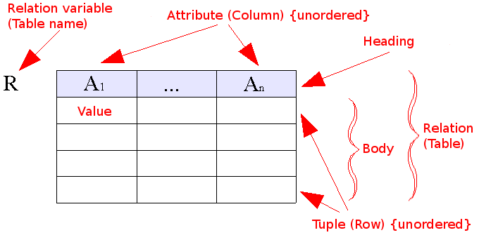
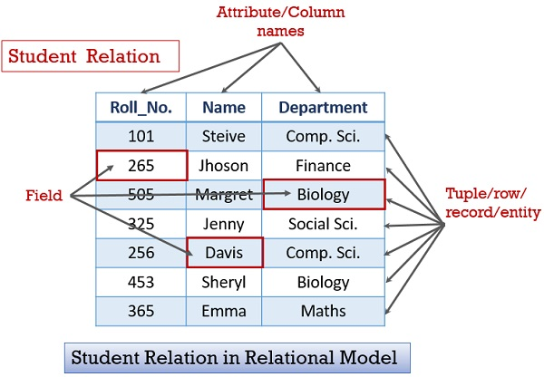
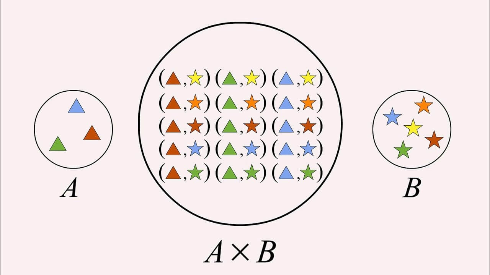
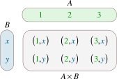

:data-transition-duration: 1000
:skip-help: true
:css: ./style.css
:substep: true
:slide-numbers: true
:data-width: 1024
:data-height: 768

.. title: Databse System, relations (By Ahmad Yoosofan)

:slide-numbers: true

.. role:: raw-html(raw)
   :format: html

.. |nbsp| unicode:: 0xA0

.. role:: rtl
    :class: rtl

----

Database Course
==================
Ahmad Yoosofan

University of Kashan

----

Data or Quantitative data
===========================
Quantitative data are
-------------------------

* measures of values or counts and are expressed as numbers.
* data about numeric variables (e.g. how many; how much; or how often).
* measures of 'types' and may be represented by a name, symbol, or a number code.
* data about categorical variables (e.g. what type) [abs.gov.au]_ .

----

Quantitative Data Examples
=============================
*  I updated my phone *6 times* in a quarter.
*  My teenager grew by *3 inches* last year.
*  *83 people* downloaded the latest mobile application.
*  My aunt lost *18 pounds* last year.
*  *150 respondents* were of the opinion that the new product feature will not be successful.
*  There will be *30% increase* in revenue with the inclusion of a new product.
*  *500 people* attended the seminar.
*  *54% people* prefer shopping online instead of going to the mall.
*  She has *10 holidays* in this year.
*  Product X costs *$1000*.

----

Advantages of Quantitative Data
==================================
* Conduct in-depth research: Since quantitative data can be statistically analyzed, it is highly likely that the research will be detailed.
* Minimum bias: There are instances in research, where personal bias is involved which leads to incorrect results. Due to the numerical nature of quantitative data, the personal bias is reduced to a great extent.
* Accurate results: As the results obtained are objective in nature, they are extremely accurate.

----

Models and their Usage
==========================
* What is a model?
* Why do we need model?
* A little history of model in mathetamtics
* Real life situations and models

----

Old models for Storing Data
================================
* Why do we need secondary storage for preserving data?
* Direct Programming with Files (by Old languages like PL/I and Cobol)
* Hierarchical model
* Network model

,, :

  https://mariadb.com/kb/en/database-theory/

----

Relational Model
========================
* Table
* Field
* Record

----

Sales DataBase (1)
===================
..  csv-table::
  :header-rows: 1
  :class: smallerelementwithfullborder

  `product_id`_, product_name, stock, quantity, `customer_id`_, customer_name
  10, Sugar, 20, 2, 32,"Ali"
  11, Salt, 100, 5, 32,"Ali"
  11, Salt, 100, 6, 33,"Reza"
  10, Sugar, 20, 3, 34,"Karim"

----

Sales DataBase (2)
===================
..  csv-table::  Product Table
  :header-rows: 1
  :class: smallerelementwithfullborder

  `product_id`_, product_name, stock
  10, Sugar, 20
  11, Salt, 100

----

Sales DataBase (3)
======================
..  csv-table:: Customer Table
  :header-rows: 1
  :class: smallerelementwithfullborder

  `customer_id`_, customer_name
  32,"Ali"
  33,"Reza"
  34,"Karim"

----

Sales DataBase (4)
===================
..  csv-table:: Sales Table
  :header-rows: 1
  :class: smallerelementwithfullborder

  `product_id`_, `customer_id`_, quantity
  10, 32, 2
  11, 32, 5
  11, 33, 6
  10, 34, 3

----

Sales DataBase (5)
======================
* Product Table:  (`product_id`_, product_name, stock)
* Customer Table: (  `customer_id`_, customer_name )
* Sales Table: ( `product_id`_, `customer_id`_ , quantity)

----

Parts Suppliers Database
===================================
* P(pn_, pname, color, weight, city)
* S(sn_, sname, status, city)
* SP(sn_, pn_, qty)

----

Parts, Suppliers and Projects Database
===============================================
* S(sn_ ,sname,status,city)
* P(pn_ ,pname,color,weight,city)
* J(jn_ ,jname,budget,city)
* SPJ(sn_ , pn_ , jn_ ,qty)

----

جدول فروش یک فروشگاه
===============================

..  csv-table::
  :header: `شماره جنس`_,نام جنس,موجودی,`شماره فاکتور فروش`_,میزان فروش
  :class: smallerelementwithfullborder

  1,شکر,1000,1,12
  1,شکر,1000,4,14
  1,شکر,1000,5,5
  2,نمک,1500,2,10
  2,نمک,1500,4,20
  2,نمک,1500,5,30
  2,نمک,1500,3,40

.. ::

  .. math::

  \begin{matrix}
  1 & 2 & 3\\
  a & b & c
  \end{matrix}

----

:class: t2c

فروشگاه ۲
===============================
..  csv-table::
  :header: `شماره جنس`_,نام جنس,موجودی
  :class: smallerelementwithfullborder

  1,شکر,1000
  2,نمک,1500

..  csv-table::
  :header: `شماره جنس`_,`شماره فاکتور فروش`_,میزان فروش
  :class: smallerelementwithfullborder

  1,1,12
  1,4,14
  1,5,5
  2,2,10
  2,4,20
  2,5,30
  2,3,40

----

Types
===========
Not exact types
--------------------
* product_id: positive number
* product_name: string
* stock: positive number
* quantity: positive number
* customer_id: positive number
* customer_name: string

----

Relational Model Like Table
===============================

https://en.wikipedia.org/wiki/Relational_model

----

.. ::

  * Type or Domain Name
  * Label Name

https://binaryterms.com/relational-data-model.html

----

Cartesian Product(I)
======================
X × Y = { (x, y) ∣ x ∈ X ∧ y ∈ Y}

`https://smartinsight.ir/ضرب-دکارتی-دو-مجموعه/ <https://smartinsight.ir/ضرب-دکارتی-دو-مجموعه/>`_

.. :

  https://www.sciencedirect.com/topics/computer-science/cartesian-product#:~:text=In%20mathematics%2C%20the%20Cartesian%20Product,%2C%20(2%2C%205)%7D.
  https://en.wikipedia.org/wiki/Cartesian_product

----

Cartesian Product(I)
======================

.. :

    .. math::

      A \times B = \left\{ {\left( {a,b} \right) \mid a \in A \text{ and } b \in B} \right\}.

A × B = { (a, b) ∣ a ∈ A ∧ b ∈ B}

A={1, 2, 3} and B={x, y}

A × B = {(1, x), (1, y), (2, x), (2, y), (3, x), (3, y)}

B × A = {(x, 1), (x, 2), (x, 3), (y, 1), (y, 2), (y, 3)

A × B ≠ B × A

https://math24.net/cartesian-product-sets.html

.. :

  https://www.math-only-math.com/Cartesian-Product-of-Two-Sets.html
  https://www.britannica.com/science/set-theory/Equivalent-sets
  https://math.libretexts.org/Bookshelves/Combinatorics_and_Discrete_Mathematics/A_Spiral_Workbook_for_Discrete_Mathematics_(Kwong)/04%3A_Sets/4.04%3A_Cartesian_Products
  https://math.libretexts.org/Bookshelves/Mathematical_Logic_and_Proof/Book%3A_Mathematical_Reasoning__Writing_and_Proof_(Sundstrom)/5%3A_Set_Theory/5.4%3A_Cartesian_Products

----

Set of Tuples (1)
===================

.. code:: python

  {
    ( a11, a12, a13, ... , a1n ) , # Tuple 1
    ( a21, a22, a23, ... , a2n ) , # Tuple 2
           ....
    ( am1, am2, am3, ... , amn )   # Tuple m
  }

* Domain of ({a11, a21, `...` , am1}) = S1
* Domain of ({a12, a22, `...` , am2}) = S2
* `...`
* Domain of ({a1n, a2n, `...` , amn}) = Sn

R1 ⊆ S1 * S2 * `...` * Sn

* {a11, a21, `...` , am1} ⊆ S1
* {a12, a22, `...` , am2} ⊆ S2
* `...`  ⊆ Si
* {a1n, a2n, `...` , amn} ⊆ Sn

.. :

  https://www.toppr.com/guides/+maths/relations-and-functions/cartesian-product-sets/
  https://en.wikipedia.org/wiki/Cartesian_product

----

Set of Tuples (2)
===================

.. code:: python

  {
    { a11 : Label_1 , a12 : Label_2 , a13 : Label_3 , ... , a1n : Label_n } , # Tuple 1
    { a21 : Label_1 , a22 : Label_2 , a23 : Label_3 , ... , a2n : Label_n } , # Tuple 2
           ....
    { am1 : Label_1 , am2 : Label_2 , am3 : Label_3 , ... , amn : Label_n } , # Tuple m
  }

----

Set of Tuples (3)
===================
.. code:: python

  {
    { a21 : Label_1 , a22 : Label_2 , a23 : Label_3 , ... , a2n : Label_n } , # Tuple 2
    { a11 : Label_1 , a12 : Label_2 , a13 : Label_3 , ... , a1n : Label_n } , # Tuple 1
           ....
    { am1n : Label_1 , am2n : Label_2 , am3n : Label_3 , ... , amn : Label_n } , # Tuple m
  }

----

Set of Tuples (4)
===================
.. code:: python

  {
    { a21 : Label_1 , a22 : Label_2 , a23 : Label_3 , ... , a2n : Label_n } , # Tuple 2
    { a12 : Label_2 , a13 : Label_3 , a11 : Label_1 ,  ... , a1n : Label_n } , # Tuple 1
           ....
    { am1 : Label_1 , am2 : Label_2 , am3 : Label_3 , ... , amn : Label_n } , # Tuple m
  }

----

Relational Algebra
=========================
http://yoosofan.github.io/webrel/index.html

http://yoosofan.github.io/webrel/help/help.html

* Schema
* Table Schema
* Database Schema

----

.. code:: sql

  p;
  ------

  s minus s ;

  ------

  RELATION {
    TUPLE{
      PN PN("s4"), SNAME SNAME("Clark"),
      STATUS STATUS(20), CITY CITY("London")
    }
  };

  ------

  p
  minus
  RELATION {
    TUPLE{
      PN("p1"), PNAME("Nut"),
      COLOR("Red"), WEIGHT(12), CITY("London")
    }
  };

----

.. code:: sql

  p
  union
  RELATION {
    TUPLE{
      PN("p7"), PNAME("Bult2"),
      COLOR("White"), WEIGHT(15), CITY("Kashan")
    },
    TUPLE{
      PN("p8"), PNAME("Clark"),
      COLOR("Red"), WEIGHT(20), CITY("London")
    }
  };

----

.. code:: sql

  RELATION {
    TUPLE{
      SN SN("s7"), SNAME SNAME("Clark"),
      STATUS STATUS(20), CITY CITY("London")
    },

    TUPLE{
      SN SN ("s8"), SNAME SNAME("John"),
      STATUS STATUS(25), CITY CITY("Shiraz")
    }
  };

  ------

  RELATION {
    TUPLE{
      SN("s4"), SNAME("Clark"),
      STATUS(20), CITY("London")
    },
    TUPLE{
      SN("s4"), SNAME("Clark"),
      STATUS(20), CITY("London")
    }
  };

----

.. code:: sql

  RELATION {
    TUPLE{SN SN("s4"), SNAME SNAME("Clark"), STATUS STATUS(20), CITY CITY("London")},
    TUPLE{SN SN ("s5"), SNAME SNAME("Adam"), STATUS STATUS(40), CITY CITY("London")}
    }
  union
  RELATION {
      TUPLE{SN SN("s6"), SNAME SNAME("Clark"), STATUS STATUS(20), CITY CITY("London")},
      TUPLE{SN SN ("s7"), SNAME SNAME("Adam"), STATUS STATUS(40), CITY CITY("London")
      }
  };

----

Assignment
==============
.. code:: sql

  a := s
      union
        RELATION{
          TUPLE{SN("s16"), SNAME("Clark"), STATUS(20), CITY("London")},
          TUPLE{SN("s17"), SNAME("Adam"), STATUS(40), CITY("London")}
        };

.. csv-table:
  :header-rows: 1
  :class: substep  smallerelementwithfullborder

  SN,SNAME,STATUS,CITY
  S1,Smith,20,London
  S2,Jones,10,Paris
  S3,Blake,30,Paris
  S4,Clark,20,London
  S5,Adams,30,Athens

.. csv-table::
  :header-rows: 1
  :class: substep  smallerelementwithfullborder

  SN,SNAME,STATUS,CITY
  S1,Smith,20,London
  S2,Jones,10,Paris
  S3,Blake,30,Paris
  S4,Clark,20,London
  S5,Adams,30,Athens
  s16,Clark,20,London
  s17,Adam,40,London

----

:class: t2c

Projection
================
.. code:: sql

  s{city};

.. code:: sql

  a minus s ;

.. csv-table::
  :header-rows: 1
  :class: smallerelementwithfullborder

  CITY
  London
  Paris
  Athens

.. csv-table::
  :header-rows: 1
  :class: smallerelementwithfullborder

  SN,SNAME,STATUS,CITY
  s16,Clark,20,London
  s17,Adam,40,London

.. code:: sql

  p{city} minus s{city};

.. code:: sql

  p{city, pname};

.. csv-table::
  :header-rows: 1
  :class: smallerelementwithfullborder

  CITY
  Oslo

.. csv-table::
  :header-rows: 1
  :class: smallerelementwithfullborder

  CITY,PNAME
  London,Nut
  Paris,Bolt
  Oslo,Screw
  london,Screw
  Paris,Cam
  London,Cog

----

:class: t2c

.. class:: rtl-h1

    شهرهایی را بیابید که هم عرضه کننده و هم قطعه در آنها هست.

.. container:: substep

    .. code:: sql
        :class: substep

        s{city} minus (s{city} minus p{city});

    .. code:: sql
        :class: substep

        p{city} minus (p{city} minus s{city});

    .. code:: sql
        :class: substep

        s{city} intersect p{city};

.. csv-table::
  :header-rows: 1
  :class: smallerelementwithfullborder substep

  CITY
  London
  Paris

----

.. class:: rtl-h1

    شهرهای عرضه کنندگانی را بیابید که در آن شهرها قطعه‌ای نیست.

.. code:: sql
    :class: substep

    s{city} minus p{city};

.. csv-table::
  :header-rows: 1
  :class: substep smallerelementwithfullborder

  CITY
  Athens

----

.. class:: rtl-h1

    شهرهایی را بیابید که یا عرضه کننده یا قطعه یا هر دو در آنهاست.

.. code:: sql
    :class: substep

    s{city} union p{city};

----

.. class:: rtl-h1

شهرهایی را بیابید که یا عرضه کننده یا قطعه در آنها باشد ولی هم قطعه و هم عرضه کننده در آن شهرها نباشد

.. code:: sql
    :class: substep

    (s{city} union p{city}) minus (s{city} intersect p{city});

.. code:: sql
    :class: substep

    (s{city} minus p{city}) union (p{city} minus s{city});

.. csv-table::
  :header-rows: 1
  :class: smallerelementwithfullborder substep

  CITY
  Athens
  Oslo

----

Condition
================
.. code:: sql

  p where city = "Paris";

.. csv-table::
  :header-rows: 1
  :class: smallerelementwithfullborder substep

  PN,PNAME,COLOR,WEIGHT,CITY
  P2,Bolt,Green,17,Paris
  P5,Cam,Blue,12,Paris

----

.. class:: rtl-h1

    نام عرضه کنندگان با وضعیت بیشتر از ۴۰ را بیابید.

.. code:: sql
    :class: substep

    s where status > 40;

.. code:: sql
    :class: substep

    (s where status > 40){sname};

----

.. class:: rtl-h1

    نام عرضه کنندگانی را بیابید که وضعیت آنها(status) بیشتر از ۲۵ است.

.. code:: sql
    :class: substep

    (s where status > 25){sname};

.. class:: substep

    Where

.. csv-table::
  :header-rows: 1
  :class: smallerelementwithfullborder substep

  SN,SNAME,STATUS,CITY
  S3,Blake,30,Paris
  S5,Adams,30,Athens

.. class:: substep

    Project

.. csv-table::
  :header-rows: 1
  :class: smallerelementwithfullborder substep

  SNAME
  Blake
  Adams

----

:data-rotate: 90

Get part names of P2
============================
.. class:: rtl-h1

    نام قطعهٔ با شمارهٔ P2 را بیابید.

.. code:: sql
    :class: substep

    (P where pn = "P2") {pname};

----

.. class:: rtl-h1

    نام شهرهایی را بیابید که یا قطعه‌ای با وزن بیشتر از 13 در آنها هست یا عرضه‌کننده‌ای با وضعیت بیشتر از ۳۴ در آنها هست.

.. class:: rtl-h2 substep

    1. نام شهرهایی را بیابید که قطعه‌ای با وزن بیشتر از 13 در آنها هست

    2. نام شهرهایی را بیابید که   عرضه‌کننده‌ای با وضعیت بیشتر از ۳۴ در آنها هست.

.. code:: sql
    :class: substep

    (p where weight > 13){city};

    (s where status > 34){city};

.. code:: sql
    :class: substep

    (p where weight > 13){city}
    union
    (s where status > 34){city};

.. csv-table::
  :header-rows: 1
  :class: smallerelementwithfullborder substep

  CITY
  Paris
  Oslo
  london

----

.. class:: rtl-h1

    نام شهرهایی را بیابید که یا قطعه‌ای با وزن بیشتر از ۲۴ در آنها هست یا عرضه‌کننده‌ای با وضعیت بیشتر از ۲۱ در آنها هست.

.. class:: rtl-h2 substep

    1. نام شهرهایی را بیابید که قطعه‌ای با وزن بیشتر از ۲۴ در آنها هست

    2. نام شهرهایی را بیابید که عرضه‌کننده‌ای با وضعیت بیشتر از ۲۱ در آنها هست.

.. code:: sql
    :class: substep

    (p where weight > 24){city}

    (s where status > 21){city};

.. code:: sql
    :class: substep

    (p where weight > 24){city}
    union
    (s where status > 21){city};

.. csv-table::
  :header-rows: 1
  :class: smallerelementwithfullborder substep

  CITY
  Paris
  Athens

----

.. class:: rtl-h1

زوج شمارهٔ عرضه‌کنندگان و شمارهٔ قطعاتی را بیابید که آن عرضه کنندگان آن قطعات را عرضه کرده باشند.

- .. code:: sql
      :class: substep

      sp{sn , pn};

----

:class: t2c

Times
===========
.. code:: sql

  p{city} times s{status};

  p{pname, weight} times s{sname} ;

  p{pn} times s{sn} ;

  p{city} times s{city} -- wrong

  p{pn, pname, color}
  times
  s{sn, sname, status};

.. csv-table::
  :header-rows: 1
  :class: smallerelementwithfullborder substep

    CITY,STATUS
    London,20
    London,10
    London,30
    Paris,20
    Paris,10
    Paris,30
    Oslo,20
    Oslo,10
    Oslo,30

----

.. class:: rtl-h1

زوج شمارهٔ عرضه‌کنندگان و قطعاتی را بیابید که آن عرضه کنندگان آن قطعات را عرضه نکرده باشند.

  .. list-table::
      :class: substep

      * - .. csv-table::
            :header-rows: 1
            :class: smallerelementwithfullborder

            PN,SN
            P1,S3
            P1,S4
            P1,S5
            P2,S5
            P3,S2
            P3,S3

        - ``.``

        - .. csv-table::
            :header-rows: 1
            :class: smallerelementwithfullborder

            PN,SN
            P3,S4
            P3,S5
            P4,S2
            P4,S3
            P4,S5
            P5,S2

        - ``.``

        - .. csv-table::
            :header-rows: 1
            :class: smallerelementwithfullborder

            PN,SN
            P5,S3
            P5,S5
            P6,S2
            P6,S3
            P6,S4
            P6,S5

        - ``.``

        - .. code:: sql
              :class: substep

              (p{pn} times s{sn})
              minus
              sp{sn,pn};

----

Rename
===========
.. class:: rtl-h1

  تغییر نام

.. code::
    :class: substep

    S rename SN as SN1;

.. csv-table::
  :header-rows: 1
  :class: substep  smallerelementwithfullborder

    SN1,SNAME,STATUS,CITY
    S1,Smith,20,London
    S2,Jones,10,Paris
    S3,Blake,30,Paris
    S4,Clark,20,London
    S5,Adams,30,Athens

----

:class: t2c

.. class:: rtl-h1

قطعه‌های عرضه شده را بیابید

.. container:: code1

    .. code:: sql
        :class: substep

        p times sp;
        -- wrong

    .. code:: sql
        :class: substep

        p
        times
        (sp rename pn as sppn)
        -- need another step

    .. code:: sql
        :class: substep

        (
          p
          times
          (sp rename pn as sppn)

        ) where pn = sppn;

    .. code:: sql
        :class: substep

        (
          (
            p
            times
            (sp rename pn as sppn)
          ) where pn = sppn
        ) {pn, pname, weight, color, city};

.. csv-table::
  :header-rows: 1
  :class: substep  smallerelementwithfullborder

  "COLOR","PNAME","PN","WEIGHT","CITY"
  "Red","Nut","P1",12,"London"
  "Green","Bolt","P2",17,"Paris"
  "Blue","Screw","P3",17,"Oslo"
  "Red","Screw","P4",14,"london"
  "Blue","Cam","P5",12,"Paris"
  "Red","Cog","P6",19,"London"

----

:class: t2c

.. class:: rtl-h1

نام قطعه‌های عرضه شده را بیابید

.. container::

    .. code:: sql
        :class: substep

         p
         times
         (sp rename pn as sppn);

    .. code:: sql
        :class: substep

        (
          p
          times
          (sp rename pn as sppn)
         ) where pn = sppn;

    .. code:: sql
        :class: substep

        (
          (
            p
            times
            (sp rename pn as sppn)
          ) where pn = sppn
        ) {pname};

.. csv-table::
  :header-rows: 1
  :class: substep  smallerelementwithfullborder

    PNAME
    Nut
    Bolt
    Screw
    Cam
    Cog

----

:class: t2c

.. class:: rtl-h1

    زوج شهرهای عرضه‌کنندگان و شهرهای قطعات را بیابید.

.. container::

  .. code:: sql
      :class: substep

        s times  p;

  .. code:: sql
      :class: substep

        s{city} times  p{city};

  .. code:: sql
      :class: substep

        ( s rename city as scity ){scity}
        times
        p{city};

.. csv-table::
  :header-rows: 1
  :class: substep  smallerelementwithfullborder

    scity,CITY
    London,London
    London,Paris
    London,Oslo
    Paris,London
    Paris,Paris
    Paris,Oslo
    Athens,London
    Athens,Paris
    Athens,Oslo

----

:class: t2c

.. class:: rtl-h1

    زوج شهرهای عرضه‌کنندگان و شهرهای قطعات غیرهمشهری را بیابید.

.. container::

  .. code:: sql
      :class: substep

        ( s rename city as scity ){scity}
        times
        p{city};

  .. code:: sql
      :class: substep

        (
          ( s rename city as scity ){scity}
          times
          p{city}
        ) where scity <> city;

.. csv-table::
  :header-rows: 1
  :class: substep  smallerelementwithfullborder

    scity, city
    London,Paris
    London,Oslo
    Paris,London
    Paris,Oslo
    Athens,London
    Athens,Paris
    Athens,Oslo

----

:class: t2c

.. class:: rtl-h1

  زوج نام عرضه‌کنندگان و نام قطعاتی را بیابید که آن عرضه کننده آن قطعه را عرضه نکرده باشد (I)

.. code:: sql
  :class: substep

  (p{pn} times s{sn})
  minus
  sp{sn,pn};

.. code:: sql
  :class: substep

  ( (p{pn} times s{sn})  minus  sp{sn,pn} )
  times
  (s{sn, sname} rename sn as ssn)

  ;

.. code:: sql
  :class: substep

  ( (p{pn} times s{sn})  minus  sp{sn,pn} )
  times
  (s{sn, sname} rename sn as ssn)
  times
  (p{pn, pname} rename pn as ppn)
  ;

.. code:: sql
  :class: substep

  (
    (
      ( (p{pn} times s{sn})  minus  sp{sn,pn} )
      times
      (s{sn, sname} rename sn as ssn)
    ) where sn = ssn
  )
  times
  (p{pn, pname} rename pn as ppn)
  ;

----

:class: t2c

.. class:: rtl-h1

  زوج نام عرضه‌کنندگان و نام قطعاتی را بیابید که آن عرضه کننده آن قطعه را عرضه نکرده باشد (II)

.. code:: sql
  :class: substep

  (
    (
      (
        ( (p{pn} times s{sn})  minus  sp{sn,pn} )
        times
        (s{sn, sname} rename sn as ssn)
      ) where sn = ssn
    )
    times
      (p{pn, pname} rename pn as ppn)
  ) where pn = ppn
  ;

.. code:: sql
  :class: substep

  (
    (
      ( (p{pn} times s{sn})  minus  sp{sn,pn} )
      times
      (s{sn, sname} rename sn as ssn)
      times
      (p{pn, pname} rename pn as ppn)
    ) where pn = ppn and sn = ssn
  )
  {sname, pname}
  ;

----

.. class:: rtl-h1

  زوج نام عرضه‌کنندگان و نام قطعاتی را بیابید که آن عرضه کننده آن قطعه را عرضه نکرده باشد(III)

.. code:: sql
  :number-lines:

  (
    (
      ( (p{pn} times s{sn})  minus  sp{sn,pn} )
      times
      (s{sn, sname} rename sn as ssn)
      times
      (p{pn, pname} rename pn as ppn)
    ) where pn = ppn and sn = ssn
  )
  {sname, pname}
  ;

.. code:: sql
  :number-lines:

  A := p{pn, pname} times s{sn, sname};
  B := (sp{sn, pn} times (s{sn, sname} rename sn as ssn1) where sn = ssn1;
  C := (B times (p{pn, pname} rename pn as pn1) where pn = pn1;
  A minus (C{sn, sname, pn, pname})

----

:class: t2c

.. class:: rtl-h1

  زوج نام عرضه‌کنندگان و نام قطعاتی را بیابید که آن عرضه کننده آن قطعه را عرضه نکرده باشد (IV)

.. code:: sql
  :number-lines:

  A := p{pn, pname} times s{sn, sname};
  B := (
          sp{sn, pn}
          times
          (
            s{sn, sname} rename sn as ssn1
          ) where sn = ssn1
        )
      ;
  C := (
          B
          times
          (
            p{pn, pname} rename pn as pn1
          ) where pn = pn1
        );
  A minus (C{sn, sname, pn, pname})

----

:class: t2c

.. :

  Get supplier names who supply any part
  ====================================================

.. class:: rtl-h1

نام عرضه کنندگانی را بیابید که قطعه‌ای عرضه کرده باشند.

.. container::

  .. code:: sql
      :class: substep

      s times sp

  .. code:: sql
      :class: substep

      (s rename sn as sn1) times sp

  .. code:: sql
      :class: substep

      ((s rename sn as sn1) times sp) where sn1=sn;

  .. code:: sql
      :class: substep

      (((s rename sn as sn1) times sp) where sn1=sn){sname};

.. csv-table::
  :header-rows: 1
  :class: substep  smallerelementwithfullborder

    sname
    Smith
    Jones
    Blake
    Clark

.. :

    ----

    :class: t2c

    .. class:: rtl-h1

    زوج شهر عرضه‌کننده و شهر قطعه‌هایی را بیابید که  آن عرضه‌کنندگان آن قطعات را عرضه کرده باشند.

    .. code:: sql

      (
        (
          (s rename city as scity)
          times
          (sp  rename sn as  spsn)
        ) where  sn = spsn
      )

----

:class: t2c

.. class:: rtl-h1

  نام عرضه کنندگانی را بیابید که عرضه‌ای(qty) بیشتر از ۳۰۰ داشته باشند.

.. code:: sql
  :class: substep

  s
  times
  sp

.. code:: sql
  :class: substep

      (s rename sn as sn1)
      times
      sp

.. code:: sql
  :class: substep

  (s rename sn as sn1)
  times
  (sp where qty > 300)

.. code:: sql
  :class: substep

  (
    (s rename sn as sn1)
    times
    (sp where qty > 300)
  ) where sn1 = sn

.. code:: sql
  :class: substep

  (
    (
      (s rename sn as sn1)
      times
      (sp where qty > 300)
    ) where sn1 = sn
  ) {sname};

.. code:: sql
  :class: substep

  (
    (
      (s rename sn as sn1)
      times
      sp
    ) where sn1 = sn and qty > 300
  ) {sname};

----

:class: t2c

.. :

    Get supplier names for suppliers that supply part P4
    ==============================================================

.. class:: rtl-h1

  نام عرضه کنندگانی را بیابید که قطعهٔ P4 را عرضه کرده باشد

.. code:: sql
    :class: substep

    (
      (
        (S rename sn as sn1)
        times
        (sp where pn = "P4")
      ) where sn1=sn
    ){sname};

.. csv-table::
  :header-rows: 1
  :class: substep  smallerelementwithfullborder

    sname
    Smith
    Clark

----

:class: t2c

.. :

    Get supplier city for suppliers that supply Red parts(I)
    ==========================================================

.. class:: rtl-h1

  شهر عرضه کنندگانی را بیابید که قطعهٔ قرمزی را عرضه کرده باشند(I).

.. class:: rtl-h1 substep

  شهر عرضه‌کنندگانی را بیابید که دست کم یک عرضه‌کننده در آن شهر دست‌کم یک قطعهٔ قرمز را عرضه کرده باشد

.. code:: sql
  :class: substep

  (s rename sn as sn1)
  times
  sp

.. code:: sql
  :class: substep

  (
    (s rename sn as sn1)
    times
    sp
  ) where sn1 = sn

.. code:: sql
  :class: substep

  (
    (
      (s rename sn as sn1)
      times
      sp
    ) where sn1 = sn
  )
  times
  (p rename pn as pn1)

.. code:: sql
  :class: substep

  (
    (
      (s rename sn as sn1)
      times
      sp
    ) where sn1 = sn
  )
  times
  ( (p rename pn as pn1) where color = "Red")

----

:class: t2c

.. :

  Get supplier city for suppliers who supply Red parts(II)
  ==========================================================

.. class:: rtl-h1

شهر عرضه کنندگانی را بیابید که قطعهٔ قرمزی را عرضه کرده باشند(II).

.. code:: sql
  :class: substep
  :number-lines:

  (
    (
      (s rename sn as sn1)
      times
      sp
    ) where sn1 = sn
  )
  times
  (
    (
      (p rename pn as pn1)
      where color = "Red"
    ){pn1}
  )

.. code:: sql
  :class: substep
  :number-lines:

  (
    (
      (
        (
          (s rename sn as sn1)
          times
          sp
        ) where sn1 = sn
      )
      times
      (
        (
          (p rename pn as pn1)
          where color = "Red"
        ){pn1}
      ) where pn1 = pn
    )
  ){city}
  ;

.. :

  ( ( s rename sn as sn1) rename city as city1)

----

:class: t2c

.. :

  Get supplier city for suppliers who supply Red parts(III)
  ==========================================================

.. class:: rtl-h1

    شهر عرضه کنندگانی را بیابید که قطعهٔ قرمزی را عرضه کرده باشند(III).

.. code:: sql
    :class: substep

    (
      (
        (
          (
            (
              (s rename sn as sn1)
              times
              sp
            ) where sn1=sn
          ){pn, city}
        )
        times
        (
          (
            (
              (p where color = "Red")
            ){pn}
        )
          ) rename pn as pn1
      ) where pn1=pn
    ){city};

.. csv-table::
  :header-rows: 1
  :class: substep  smallerelementwithfullborder

    CITY
    London
    Paris

----

:class: t2c

.. class:: rtl-h1 t2c-rtl-h1

شهر عرضه کنندگانی را بیابید که قطعهٔ قرمزی با وزن بیشتر از ۱۳ را عرضه کرده باشند.

.. code:: sql
  :class: substep
  :number-lines:

  (
    (
      (
        (
          (
            (s rename sn as sn1)
            times
            sp
          ) where sn=sn1
        ){pn, city}
      )
      times
      (
        (
          (
            (p where color = "Red")
            where weight > 13
          ){pn}
        ) rename pn as pn1
      )
    ) where pn1=pn
  ){city};

.. code:: sql
  :class: substep
  :number-lines:

  (
    (
      (
        (
          (s rename sn as sn1)
          times
          (sp rename pn as pn1)
        ) where sn1=sn
      ){pn1, city}
      times
      (
        (
          (p where color = "Red")
          where weight > 13
        ){pn}
      )
    ) where pn1=pn
  ){city};

----

.. class:: rtl-h1

    شهر عرضه کنندگانی را بیابید که در شهر آنها قطعه‌ای نیز وجود داشته باشد.

.. code:: sql
    :class: substep

    s{city} intersect p{city};

----

:class: t2c

.. class:: rtl-h1

    نام عرضه کنندگانی را بیابید که در شهر آنها قطعه‌ای وجود ندارد.

.. code:: sql
  :class: substep

  s{city} minus p{city};

.. code:: sql
  :class: substep

  (s{city} minus p{city})
  times
  (s rename city as scity)

.. code:: sql
  :class: substep

  (
    (s{city} minus p{city})
    times
    (s rename city as scity)
  ) where city = scity

.. code:: sql
  :class: substep
  :number-lines:

  (
   (
      (s{city} minus p{city})
      times
      (s rename city as scity)
    ) where city = scity
  ){sname};

.. csv-table::
  :header-rows: 1
  :class: substep  smallerelementwithfullborder

  SNAME
  Adams

----

:class: t2c

.. class:: rtl-h1

    نام قطعه‌های عرضه شده را بیابید.

.. code:: sql
    :class: substep
    :number-lines:

    (
      (
        p{pn, pname}
        times
        (sp rename pn as pn1)
      ) where pn1 = pn
    ) {pname};

.. csv-table::
  :header-rows: 1
  :class: substep  smallerelementwithfullborder

    PNAME
    Nut
    Bolt
    Screw
    Cam
    Cog

----

:class: t2c

.. class:: rtl-h1

شهر قطعه‌های عرضه شده با وزن بیشتر از ۱۵ را بیابید.

.. code:: sql
    :class: substep
    :number-lines:

    (
      (
        (p where weight > 15)
        times
        (sp rename pn as pn1)
      ) where pn1 = pn
    ){city};

.. csv-table::
  :header-rows: 1
  :class: substep  smallerelementwithfullborder

   CITY
   Paris
   Oslo
   London

----

:class: t2c

.. class:: rtl-h1

    نام عرضه کنندگانی را بیابید که قطعه‌ای از شهر پاریس عرضه کرده باشند.

.. code:: sql
    :class: substep

    (
      (
        (
          (
            (
              s{sn, sname}
              times
              (sp rename sn as sn1)
            ) where sn1 = sn
          )
          times
          (p rename pn as pn1)
        ) where pn1 = pn
      ) where city = "Paris"
    ){sname} ;

.. csv-table::
  :header-rows: 1
  :class: substep  smallerelementwithfullborder

   SNAME
   Smith
   Jones
   Blake
   Clark

----

:class: t2c

.. class:: rtl-h1

  نام عرضه‌کنندگانی را بیابید که هیچ قطعه‌ای عرضه نکرده‌اند.

.. code:: sql
  :class: substep

  s{sn}  minus  sp{sn} ;

.. code:: sql
  :class: substep

  ( s{sn}  minus  sp{sn} )
  times s ; -- wrong

.. code:: sql
  :class: substep

  ( s{sn}  minus  sp{sn} )
  times
  (s rename sn as ssn) ;

.. code:: sql
  :class: substep

  (
    ( s{sn}  minus  sp{sn} )
    times
    (s rename sn as ssn)
  ) where sn = ssn;

.. code:: sql
  :class: substep

  (
    (
      (s{sn}  minus  sp{sn})
      times
      (s rename sn as ssn)
    ) where sn = ssn
  ){sname}
  ;

.. code:: sql
  :class: substep

  s{sname} minus
  (
    (
      s times
      (sp rename sn as sn1)
    ) where sn = sn1
  ){sname}

----

:class: t2c

Join پیوند
====================
.. code:: sql

  ( p times (sp rename pn as sppn) ) where sppn = pn

.. code:: sql

  (
    p
    times
    (sp rename pn as sppn)
  ) where sppn = pn

.. code:: sql
  :class: substep

  p join sp

.. class:: substep

* Join does not have order
* It will apply equals for each shared attributes
* It will apply times for two relations without shared attribute

----

:class: t2c

.. class:: rtl-h1

نام قطعه‌های عرضه شده را بیابید.

.. code:: sql
    :class: substep

    (
      (
        p
        times
        (sp rename pn as sppn)
      ) where sppn = pn
    ){pname};

.. code:: sql

    (p join sp){pname}

----

:class: t2c

.. class:: rtl-h1

نام قطعه‌های قرمز عرضه شده را بیابید.

.. code:: sql
    :class: substep

    (
      (
        (p where color="Red")
        times
        (sp rename pn as sppn)
      ) where sppn = pn
    ){pname};

.. code:: sql
    :class: substep

    (
      (p where color = "Red")
      join
      sp
    ){pname}

----

:class: t2c

.. class:: rtl-h1

شهر قطعه‌های عرضه شده با وزن بیشتر از ۱۵ را بیابید.

.. code:: sql
    :class: substep

    (
      (p where weight > 15)
      join
      sp
    ){city};

.. csv-table::
  :header-rows: 1
  :class: substep  smallerelementwithfullborder

   CITY
   Paris
   Oslo
   London

----

:class: t2c

.. class:: rtl-h1

نام عرضه کنندگانی را بیابید که در شهر آنها قطعه‌ای وجود ندارد.

.. code:: sql
  :class: substep

  s{city} minus p{city};

.. code:: sql
  :class: substep

  (s{city} minus p{city})
  join
  s

.. code:: sql
  :class: substep

  (
    (s{city} minus p{city})
    join
    s
  ){sname};

.. code:: sql
  :class: substep

  s{sname}
  minus
  ((s join p){sname});

.. csv-table::
  :header-rows: 1
  :class: substep  smallerelementwithfullborder

  SNAME
  Adams

----

:class: t2c

.. class:: rtl-h1

نام عرضه کنندگانی را بیابید که قطعه‌ای را از شهر پاریس عرضه کرده باشند.

.. class:: rtl-h2

نام عرضه کنندگانی را بیابید که دست‌کم یکی از قطعه‌هایی که عرضه کرده‌اند در شهر پاریس باشد.

.. container::

  .. code:: sql
      :class: substep

      ( (s{sn, sname} join sp) join p) where city = "Paris"){sname} ;

  .. code:: sql
      :class: substep

      (
        (
          (s{sn, sname} join sp)
          join
          p
        ) where city = "Paris"
      ){sname} ;

.. csv-table::
  :header-rows: 1
  :class: substep  smallerelementwithfullborder

    SNAME
    Smith
    Jones
    Blake
    Clark

.. code:: sql
    :class: substep

    (            --- راه حل نادرست
      (
       (s join sp)
       join p
      ) where city = "Paris"
    ){sname} ;

.. code:: sql
    :class: substep

      (  -- راه حل درست
      ( (s join sp){pn, sname}
       join p
      ) where city = "Paris"
    ){sname} ;

.. code:: sql
    :class: substep

      (    -- راه حل نادرست
       (p{city} where city='Paris') join s
    ){sname} ;

----

:class: t2c

.. class:: rtl-h1

نام عرضه کنندگانی را بیابید که قطعه‌ای را در شهر خودشان عرضه کرده باشند.

.. code:: sql
  :class: substep

  (
    (s join sp) join p
  ){sname} ;

.. csv-table::
  :header-rows: 1
  :class: substep  smallerelementwithfullborder

  SNAME
  Smith
  Jones
  Blake
  Clark

.. code:: sql
  :class: substep

  --      نادرست۱
  (
    (s join sp)
    join
    (p{city})
  ){sname} ;

.. code:: sql
  :class: substep

  --      نادرست۲
  (
    (s join sp)
    join
    p{city}
  ){sname} ;

.. code:: sql
  :class: substep

  --      نادرست۳
  (s join sp join p{city}){sname} ;

.. code:: sql
  :class: substep

  --      نادرست۴

  ((s join sp{sn})join p){sname};

.. code:: sql
  :class: substep

  --      نادرست۵
  ((sp join s){sn, sname} join p){sname};

.. code:: sql
  :class: substep

  --      نادرست۶
  ((sp join s){sn, sname, city) join p){sname};

.. code:: sql
  :class: substep

  --      نادرست۷
  (((s join sp ){city}) join p){sname};

----

:class: t2c

.. class:: rtl-h1

نام قطعاتی را بیابید که وزن‌شان بیشتر از ۱۰ است و عرضه‌کننده‌ای در شهر پاریس با وضعیت بیشتر از ۲۰ آنها را عرضه کرده باشد.

.. code:: sql
    :class: substep

    ( p where weight > 10 ){pn, pname}

.. code:: sql
    :class: substep

    (s where status > 20) where city = "Paris"

.. code:: sql
    :class: substep

    ( p where weight > 10 ){pn, pname}
    join
    sp

.. code:: sql
    :class: substep

    (
      (
        ( p where weight > 10 ){pn, pname}
        join
        sp
      )
      join
      (
        (s where status > 20) where city = "Paris"
      )
    ){pname} ;

.. csv-table::
  :header-rows: 1
  :class: substep  smallerelementwithfullborder

   PNAME
   Bolt

----

Keys
=====
Super Keys
ابر کلیدها

.. class:: substep

  * P(pn_, pname, color, weight, city)

    * {pn}, {pn, pname}, {pn, color}, {pn, pname, weight}
    * {pn, city, color} {pn, pname, color, weight, city}
    * نادرست‌ها
        * {city}
        * {city, weight}
        * {pname, city, weight}
        * {pname, color}
    * هیچ دو قطعه‌ای در یک شهر نام یکسانی ندارند.
        * {pn}, {pname, city}, {pn, city}
        * {pname, city, weight}
    * اگر در هر شهر فقط یک قطعه بتواند باشد.
        * {pn}, {city}, {pn, city} , {city, pname}
        * {city, pname, color}

----

:class: t2c

Candidate Keys کلیدهای نامزد
================================================
.. class:: substep

  * S(sn_, sname, status, city)

    * {sn}
    * هیچ دو عرضه‌کننده‌ای در یک شهر نام یکسانی ندارند.
        * {sn}
        * {sname, city}
    * اگر در هر شهر فقط یک عرضه کننده بتواند باشد.
        * {sn}
        * {city}
  * SP(sn_, pn_, qty)
      * {sn, pn}

.. container:: substep

    **Rules for Identification**

    .. class:: substep

    1. Uniqueness Property
    2. Irreducibility (Minimality)
    3. Functional Dependency
    4. Existence

.. note:

    Gemini and Grok AI helped in Rules for Identification

    1. **Uniqueness Property**: At any given time, no two tuples in the relation can have the same value for the candidate key.
    2. **Irreducibility (Minimality)**: No proper subset of the candidate key attributes can satisfy the uniqueness property. If you can remove an attribute and the key remains unique, the original set was a *superkey*, not a *candidate key*.
    3. **Functional Dependency**: The candidate key must functionally determine all other attributes in the relation:
       K → R
    4. **Existence**: Every relation must have at least one candidate key (in the worst case, the set of all attributes combined).

----

:class: t2c

Primary key(PK)
===============
.. class:: substep

* SP(sn_, pn_, qty)
* S(sn_, sname, status, city)

* {sn}
* هیچ دو عرضه‌کننده‌ای در یک شهر نام یکسانی ندارند.
    * {sn}
    * {sname, city}
    * فقط یکی از این دو بالایی کلید اصلی گذاشته شود.
* اگر در هر شهر فقط یک عرضه کننده بتواند باشد.
    * {sn}
    * {city}
    * فقط یکی از این دو بالایی کلید اصلی گذاشته شود.

.. container:: substep

    **Guidelines for Optimal Selection**

    .. class:: substep

    #. Derived from Candidate Keys
    #. Attribute Stability
    #. Minimality
    #. High Frequency Usage
    #. Non-Nullability

.. note:

    * **Derived from Candidate Keys**: A primary key must be selected from the set of identified candidate keys.
    * **Attribute Stability**: Prioritize keys that are least likely to change over the lifetime of the record.
    * **Minimality**: Prefer a single-attribute key or a small composite key to improve indexing performance and simplify Foreign Key relationships.
    * **High Frequency Usage**: Select the candidate key most frequently used by applications and users to identify specific tuples.
    * **Non-Nullability**: By definition, a primary key must strictly prohibit null values.

    #. The best choice for primary ke is a candidate key that
        * Most important in real data usage
        * could be use many times to find record
        * used mostly by user
    #. Don't add arbitrary field for Primary key
    #. The primary key should be selected from one of the candidate keys
    #. is meaningfull
    #. If there
        * is no candidate key or
        * or cadidate keys consist large number of field
        * then it is possible to add extra field
        * Try to add meaningful field or field that can be used for some usage
        * In another word, just don't add field for the sake of having key
        * Adding a field of autoincrement should be the last resort

----

:class: t2c

Surrogate Keys vs. Natural Keys
===============================
.. class:: substep

#. Avoid Arbitrary Fields
#. Criteria for Surrogate Keys
    * No natural candidate keys exist.
    * Existing candidate keys are excessively "wide"
    * Table structure, business rules, or attribute values are expected to change frequently in the future.
#. Surrogate Limitations
#. Last Resort Principle

.. container:: substep

    **Common Mistakes to Avoid**

    .. class:: substep

    #. Using Volatile Data
    #. Using Large Strings
    #. External Identifiers
    #. Meaningful Key Updates

.. note:

    Table structure and its fields may change a lot in future
    because of external forces that changes the fields and table structure

    * **Avoid Arbitrary Fields**: Do not introduce surrogate keys (e.g., UUIDs, Auto-increments) if a stable, simple natural key exists.
    * **Criteria for Surrogate Keys**: Consider adding an artificial identifier only if:
        * No natural candidate keys exist.
        * Existing candidate keys are excessively "wide" (consist of too many fields or large strings).
    * **Surrogate Limitations**: If a surrogate key is used, ensure it does not replace the requirement for uniqueness constraints on the original natural data.
    * **Last Resort Principle**: Auto-incrementing integers are often a structural necessity in implementation, but in logical design, they should be utilized only when natural identifiers fail the stability or minimality tests.

    Common Mistakes to Avoid
    ------------------------
    .. class:: substep

    * **Using Volatile Data**: Never use fields that change, such as ``Email``, ``Phone_Number``, or ``Mailing_Address``.
    * **Using Large Strings**: Using long text fields as primary keys increases index size and degrades join performance.
    * **External Identifiers**: Relying on external keys (e.g., Social Security Numbers or National IDs) is risky due to privacy regulations (GDPR), potential format changes, or duplicate assignments by external agencies.
    * **Meaningful Key Updates**: If a primary key has "meaning," users may want to update it. Updating a primary key requires expensive cascading updates to all related foreign keys.

   Surrogate keys are excellent for **stability and decoupling** when business data evolves, but they must never replace proper enforcement of natural uniqueness rules.

    **Rationale for the New Criterion (Table Structure May Change)**
    The addition you made is **excellent** and academically sound.
    Frequent schema or business-rule changes are a very common real-world reason to choose surrogate keys. Natural keys often embed business meaning that can become obsolete or require updates (e.g., email formats, product codes, regulatory IDs). A surrogate key remains unchanged even if the rest of the table evolves.

    **Suggested Improvements (already incorporated above)**
    * Made the new bullet parallel and concise.
    * Changed “may change a lot” → “are expected to change frequently” (more precise academic tone).
    * Kept the original numbering style you preferred while improving clarity and flow.
    * Added a short “Limitations” reminder — this is critical so students do not think surrogate keys let them ignore natural uniqueness.
    * Added a boxed “Key Principle” for slide emphasis.

----

:class: t2c

Foreign Key(FK)
===============
.. container::

    **SP Database**

    * P(pn_, pname, color, weight, city)
    * S(sn_, sname, status, city)
    * SP(sn_, pn_, qty)

.. yographviz::
   :class: db-schema-graph

   digraph PartsSuppliers {
       // Layout direction
       rankdir=LR;

       // Global node and edge settings
       node [shape=none, fontname="Helvetica", fontsize=12];
       edge [color="#555555", arrowtail=none, arrowhead=normal];

       // Table: SP (Shipments)
       // Placed first in the script so it acts as the origin for the left-to-right layout
       sp [label=<
           <table border="0" cellborder="1" cellspacing="0" cellpadding="5">
               <tr><td bgcolor="#fff9c4"><b>SP</b></td></tr>
               <tr><td port="sn" bgcolor="#ffffff"><b>sn</b></td></tr>
               <tr><td port="pn" bgcolor="#ffffff"><b>pn</b></td></tr>
               <tr><td port="qty" bgcolor="#ffffff">qty</td></tr>
           </table>
       >];

       // Table: S (Suppliers)
       s [label=<
           <table border="0" cellborder="1" cellspacing="0" cellpadding="5">
               <tr><td bgcolor="#e0f7fa"><b>S</b></td></tr>
               <tr><td port="sn" bgcolor="#ffffff"><b>sn</b></td></tr>
               <tr><td port="sname" bgcolor="#ffffff">sname</td></tr>
               <tr><td port="status" bgcolor="#ffffff">status</td></tr>
               <tr><td port="city" bgcolor="#ffffff">city</td></tr>
           </table>
       >];

       // Table: P (Parts)
       p [label=<
           <table border="0" cellborder="1" cellspacing="0" cellpadding="5">
               <tr><td bgcolor="#e8f5e9"><b>P</b></td></tr>
               <tr><td port="pn" bgcolor="#ffffff"><b>pn</b></td></tr>
               <tr><td port="pname" bgcolor="#ffffff">pname</td></tr>
               <tr><td port="color" bgcolor="#ffffff">color</td></tr>
               <tr><td port="weight" bgcolor="#ffffff">weight</td></tr>
               <tr><td port="city" bgcolor="#ffffff">city</td></tr>
           </table>
       >];

       // Foreign Key Relationships

       // SP references S (Exits East side of SP, enters West side of S)
       sp:sn:e -> s:sn:w;

       // SP references P (Exits East side of SP, enters West side of P)
       sp:pn:e -> p:pn:w;
   }

----

:class: t2c

SPJ
===
* S(sn_,sname,status,city) ,
* P(pn_,pname,color,weight,city) ,
* J(jn_,jname,budget,city)
* SPJ(sn_, pn_, jn_, qty)

.. yographviz::

    digraph SPJ_Database { // Thanks to Grok AI from x.com (aka Twitter)
        graph [
            rankdir=LR,
            splines=curved,
            nodesep=0.45,
            ranksep=0.85,
            bgcolor="transparent",
            label="SPJ Database",
            labelloc="t",
            fontsize=12,
            fontname="Arial Bold"
        ];

        node [
            shape=plain,
            fontsize=11,
            fontname="Arial"
        ];

        edge [
            arrowsize=0.9,
            penwidth=2.2,
            color="#1F618D"
        ];

        /* Left column: S (top) and J (bottom) */
        S [label=<
            <TABLE BORDER="1" CELLBORDER="1" CELLSPACING="0" CELLPADDING="4">
            <TR><TD BGCOLOR="#AED6F1" COLSPAN="1"><B>S</B></TD></TR>
            <TR><TD PORT="sn" ALIGN="LEFT"><B><U>sn</U></B></TD></TR>
            <TR><TD ALIGN="LEFT">sname</TD></TR>
            <TR><TD ALIGN="LEFT">status</TD></TR>
            <TR><TD ALIGN="LEFT">city</TD></TR>
            </TABLE>
        >];

        J [label=<
            <TABLE BORDER="1" CELLBORDER="1" CELLSPACING="0" CELLPADDING="4">
            <TR><TD BGCOLOR="#D7BDE2" COLSPAN="1"><B>J</B></TD></TR>
            <TR><TD PORT="jn" ALIGN="LEFT"><B><U>jn</U></B></TD></TR>
            <TR><TD ALIGN="LEFT">jname</TD></TR>
            <TR><TD ALIGN="LEFT">budget</TD></TR>
            <TR><TD ALIGN="LEFT">city</TD></TR>
            </TABLE>
        >];

        /* Center: SPJ */
        SPJ [label=<
            <TABLE BORDER="1" CELLBORDER="1" CELLSPACING="0" CELLPADDING="4">
            <TR><TD BGCOLOR="#FAD7A0" COLSPAN="1"><B>SPJ</B></TD></TR>
            <TR><TD PORT="sn" ALIGN="LEFT"><B><U>sn</U></B></TD></TR>
            <TR><TD PORT="pn" ALIGN="LEFT"><B><U>pn</U></B></TD></TR>
            <TR><TD PORT="jn" ALIGN="LEFT"><B><U>jn</U></B></TD></TR>
            <TR><TD ALIGN="LEFT">qty</TD></TR>
            </TABLE>
        >];

        /* Right: P */
        P [label=<
            <TABLE BORDER="1" CELLBORDER="1" CELLSPACING="0" CELLPADDING="4">
            <TR><TD BGCOLOR="#A9DFBF" COLSPAN="1"><B>P</B></TD></TR>
            <TR><TD PORT="pn" ALIGN="LEFT"><B><U>pn</U></B></TD></TR>
            <TR><TD ALIGN="LEFT">pname</TD></TR>
            <TR><TD ALIGN="LEFT">color</TD></TR>
            <TR><TD ALIGN="LEFT">weight</TD></TR>
            <TR><TD ALIGN="LEFT">city</TD></TR>
            </TABLE>
        >];

        /* Keep S above J on the left */
        S -> J [style=invis];

        /* Directed foreign-key arrows from SPJ fields to target PK fields */
        SPJ:sn -> S:sn;
        SPJ:pn -> P:pn;
        SPJ:jn -> J:jn;
    }

.. :

    digraph SPJ_Database { // Thanks to Grok AI from x.com (aka Twitter)
        graph [
            rankdir=LR,
            splines=curved,
            nodesep=0.35,
            ranksep=0.65,
            bgcolor="transparent",
            // label="SPJ Database",
            // labelloc="t",
            fontsize=12,
            fontname="Arial Bold"
        ];

        node [
            shape=plain,
            fontsize=11,
            fontname="Arial"
        ];

        edge [
            arrowsize=0.9,
            penwidth=2.2,
            color="#1F618D"
        ];

        /* S (top-left) */
        S [label=<
            <TABLE BORDER="1" CELLBORDER="1" CELLSPACING="0" CELLPADDING="4">
            <TR><TD BGCOLOR="#AED6F1" COLSPAN="1"><B>S</B></TD></TR>
            <TR><TD PORT="sn" ALIGN="LEFT"><B><U>sn</U></B></TD></TR>
            <TR><TD ALIGN="LEFT">sname</TD></TR>
            <TR><TD ALIGN="LEFT">status</TD></TR>
            <TR><TD ALIGN="LEFT">city</TD></TR>
            </TABLE>
        >];

        /* J (bottom-left) */
        J [label=<
            <TABLE BORDER="1" CELLBORDER="1" CELLSPACING="0" CELLPADDING="4">
            <TR><TD BGCOLOR="#D7BDE2" COLSPAN="1"><B>J</B></TD></TR>
            <TR><TD PORT="jn" ALIGN="LEFT"><B><U>jn</U></B></TD></TR>
            <TR><TD ALIGN="LEFT">jname</TD></TR>
            <TR><TD ALIGN="LEFT">budget</TD></TR>
            <TR><TD ALIGN="LEFT">city</TD></TR>
            </TABLE>
        >];

        /* SPJ (center) */
        SPJ [label=<
            <TABLE BORDER="1" CELLBORDER="1" CELLSPACING="0" CELLPADDING="4">
            <TR><TD BGCOLOR="#FAD7A0" COLSPAN="1"><B>SPJ</B></TD></TR>
            <TR><TD PORT="sn" ALIGN="LEFT"><B><U>sn</U></B></TD></TR>
            <TR><TD PORT="pn" ALIGN="LEFT"><B><U>pn</U></B></TD></TR>
            <TR><TD PORT="jn" ALIGN="LEFT"><B><U>jn</U></B></TD></TR>
            <TR><TD ALIGN="LEFT">qty</TD></TR>
            </TABLE>
        >];

        /* P (right) */
        P [label=<
            <TABLE BORDER="1" CELLBORDER="1" CELLSPACING="0" CELLPADDING="4">
            <TR><TD BGCOLOR="#A9DFBF" COLSPAN="1"><B>P</B></TD></TR>
            <TR><TD PORT="pn" ALIGN="LEFT"><B><U>pn</U></B></TD></TR>
            <TR><TD ALIGN="LEFT">pname</TD></TR>
            <TR><TD ALIGN="LEFT">color</TD></TR>
            <TR><TD ALIGN="LEFT">weight</TD></TR>
            <TR><TD ALIGN="LEFT">city</TD></TR>
            </TABLE>
        >];

        /* Force S above J on the left */
        { rank=same; S; J; }   /* invisible connection keeps them vertically aligned */
        S -> J [style=invis];

        /* Directed foreign-key edges from SPJ fields to target PK fields */
        SPJ:sn -> S:sn;
        SPJ:pn -> P:pn;
        SPJ:jn -> J:jn;
    }

----

:class: t2c

Library
=========
.. container:: substep

    * book(bn_, title, author, ofpd)
    * member(mn_, name, bn, fines)
    * borrow(bn_, mn_, ddt_, dtr)

    #. "ofpd" overdue fine per day
    #. "fines" Outstanding Balance or debt of a member
    #. "ddt" due date
    #. "dtr" date returned

.. yographviz::
   :class: substep db-schema-graph

   digraph EnhancedLibrary {
       // Layout direction
       rankdir=LR;

       // Global node and edge settings
       node [shape=none, fontname="Helvetica", fontsize=12];
       edge [color="#555555", arrowtail=none, arrowhead=normal];

       // Table: member
       member [label=<
           <table border="0" cellborder="1" cellspacing="0" cellpadding="5">
               <tr><td bgcolor="#f3e5f5"><b>member</b></td></tr>
               <tr><td port="mn" bgcolor="#ffffff"><b>mn</b></td></tr>
               <tr><td port="name" bgcolor="#ffffff">name</td></tr>
               <tr><td port="bn" bgcolor="#ffffff">bn</td></tr>
               <tr><td port="fines" bgcolor="#ffffff">fines</td></tr>
           </table>
       >];

       // Table: borrow
       borrow [label=<
           <table border="0" cellborder="1" cellspacing="0" cellpadding="5">
               <tr><td bgcolor="#fff9c4"><b>borrow</b></td></tr>
               <tr><td port="bn" bgcolor="#ffffff"><b>bn</b></td></tr>
               <tr><td port="mn" bgcolor="#ffffff"><b>mn</b></td></tr>
               <tr><td port="ddt" bgcolor="#ffffff"><b>ddt</b></td></tr>
               <tr><td port="dtr" bgcolor="#ffffff">dtr</td></tr>
           </table>
       >];

       // Table: book
       book [label=<
           <table border="0" cellborder="1" cellspacing="0" cellpadding="5">
               <tr><td bgcolor="#e0f7fa"><b>book</b></td></tr>
               <tr><td port="bn" bgcolor="#ffffff"><b>bn</b></td></tr>
               <tr><td port="title" bgcolor="#ffffff">title</td></tr>
               <tr><td port="author" bgcolor="#ffffff">author</td></tr>
               <tr><td port="ofpd" bgcolor="#ffffff">ofpd</td></tr>
           </table>
       >];

       // Foreign Key Relationships

       // Member references their favorite book
       member:bn:e -> book:bn:w;

       // Borrow references both the book and the member
       borrow:bn:e -> book:bn:w;
       borrow:mn:e -> member:mn:w;
   }

.. yographviz:

   :class: db-schema-graph

   digraph NormalizedLibrary {
       // Layout direction
       rankdir=LR;

       // Global node and edge settings
       node [shape=none, fontname="Helvetica", fontsize=12];
       edge [color="#555555", arrowtail=none, arrowhead=normal];

       // Table: member
       member [label=<
           <table border="0" cellborder="1" cellspacing="0" cellpadding="5">
               <tr><td bgcolor="#f3e5f5"><b>member</b></td></tr>
               <tr><td port="mn" bgcolor="#ffffff"><b>mn</b></td></tr>
               <tr><td port="name" bgcolor="#ffffff">name</td></tr>
               <tr><td port="bn" bgcolor="#ffffff">bn</td></tr>
           </table>
       >];

       // Table: borrow
       borrow [label=<
           <table border="0" cellborder="1" cellspacing="0" cellpadding="5">
               <tr><td bgcolor="#fff9c4"><b>borrow</b></td></tr>
               <tr><td port="bn" bgcolor="#ffffff"><b>bn</b></td></tr>
               <tr><td port="mn" bgcolor="#ffffff"><b>mn</b></td></tr>
               <tr><td port="rdt" bgcolor="#ffffff">rdt</td></tr>
               <tr><td port="ret" bgcolor="#ffffff">ret</td></tr>
           </table>
       >];

       // Table: book
       book [label=<
           <table border="0" cellborder="1" cellspacing="0" cellpadding="5">
               <tr><td bgcolor="#e0f7fa"><b>book</b></td></tr>
               <tr><td port="bn" bgcolor="#ffffff"><b>bn</b></td></tr>
               <tr><td port="title" bgcolor="#ffffff">title</td></tr>
               <tr><td port="author" bgcolor="#ffffff">author</td></tr>
           </table>
       >];

       // Foreign Key Relationships

       // Member references their favorite book
       // (Exits East side of member, enters West side of book)
       member:bn:e -> book:bn:w;

       // Borrow references both the book and the member
       borrow:bn:e -> book:bn:w;
       borrow:mn:e -> member:mn:w;
   }

    * book(bn_, title, author, ofpd)
    * member(mn_, name, bn, fines)
    * borrow(bn_, mn_, ddt_, dtr)

    .. class:: rtl

    #. member.bn شمارهٔ کتابی که عضو بیشتر از همه به آن کتاب علاقه‌مند است
    #. rdt تاریخ برگشت کتاب در آخرین امانت

    Thanks, I want to add some new fields to the library database.

    * book(bn_, title, author, ofpd)
    * member(mn_, name, bn, fines)
    * borrow(bn_, mn_, ddt_, dtr)

    "ofpd" overdue fine per day
    "fines" Outstanding Balance or debt of a member
    "ddt" due date
    "dtr" date returned

    #. اگر از هر کتابی فقط یک نسخهٔ آن در کتابخانه باشد، آن‌گاه bn می‌تواند همان isbn باشد.
    #. book.category موضوع کتاب با این فرض که هر کتاب فقط یک موضوع دارد
    #. book. fpd جریمه دیر آوردن کتاب به ازای روز
    #. member.category موضوعی که عضو بیشتر از همه به آن علاقه‌مند است
    #. member.bn شمارهٔ کتابی که عضو بیشتر از همه به آن کتاب علاقه‌مند است
    #. ret کتاب برای آخرین امانت برگردانده شده یا خیر

----

:class: t2c

Company Database Schema
=======================
.. class:: substep

* Employee, Project, HourLog
* Employee(SSN_, name, salary, MgrSSN)
* Project(ProjName_, location )
* HourLog(SSN_, ProjName_, hours)
* MgrSSN is foreign Key to SSN of its own table
* If the ProjName can be repeated?

.. yographviz::
   :class: substep db-schema-graph

   digraph Company {
       // Layout direction
       rankdir=LR;

       // Global node and edge settings
       node [shape=none, fontname="Helvetica", fontsize=12];
       edge [color="#555555", arrowtail=none, arrowhead=normal];

       // Table: Employee
       employee [label=<
           <table border="0" cellborder="1" cellspacing="0" cellpadding="5">
               <tr><td bgcolor="#e0f7fa"><b>Employee</b></td></tr>
               <tr><td port="ssn" bgcolor="#ffffff"><b>SSN</b></td></tr>
               <tr><td port="name" bgcolor="#ffffff">name</td></tr>
               <tr><td port="salary" bgcolor="#ffffff">salary</td></tr>
               <tr><td port="mgrssn" bgcolor="#ffffff">MgrSSN</td></tr>
           </table>
       >];

       // Table: HourLog
       hourlog [label=<
           <table border="0" cellborder="1" cellspacing="0" cellpadding="5">
               <tr><td bgcolor="#fff9c4"><b>HourLog</b></td></tr>
               <tr><td port="ssn" bgcolor="#ffffff"><b>SSN</b></td></tr>
               <tr><td port="projname" bgcolor="#ffffff"><b>ProjName</b></td></tr>
               <tr><td port="hours" bgcolor="#ffffff">hours</td></tr>
           </table>
       >];

       // Table: Project
       project [label=<
           <table border="0" cellborder="1" cellspacing="0" cellpadding="5">
               <tr><td bgcolor="#e8f5e9"><b>Project</b></td></tr>
               <tr><td port="projname" bgcolor="#ffffff"><b>ProjName</b></td></tr>
               <tr><td port="location" bgcolor="#ffffff">location</td></tr>
           </table>
       >];

       // Foreign Key Relationships
       // Using compass points (:e for East) loops the arrow cleanly outside the right edge
       employee:mgrssn:e -> employee:ssn:e;

       // Foreign keys from HourLog to Employee and Project
       hourlog:ssn -> employee:ssn;
       hourlog:projname -> project:projname;
   }

----

:class: t2c

Company, Project Name duplication
=================================
* Employee(SSN_, name, salary, MgrSSN)
* Project(ProjName_, location )
* HourLog(SSN_, ProjName_, hours)

.. class:: substep

* Employee(SSN_, name, salary, MgrSSN)
* Project(PN_, ProjName, location )
* HourLog(SSN_, PN_, hours)
* If the company gets larger and needs departments?

----

:class: t2c

Company with Departments
==========================
.. class:: substep

#. Employee(SSN_, name, salary, DeptName)
#. Department(DeptName_, MgrSSN)
#. Project(PN_, location, ProjName)
#. HourLog(SSN_, PN_, hours)

.. yographviz::
   :class: substep db-schema-graph

   digraph UpdatedCompany {// Thanks to Gemeni AI from Google
       // Layout direction
       rankdir=LR;

       // Global node and edge settings
       node [shape=none, fontname="Helvetica", fontsize=12];
       edge [color="#555555", arrowtail=none, arrowhead=normal];

       // Table: Employee
       employee [label=<
           <table border="0" cellborder="1" cellspacing="0" cellpadding="5">
               <tr><td bgcolor="#e0f7fa"><b>Employee</b></td></tr>
               <tr><td port="ssn" bgcolor="#ffffff"><b>SSN</b></td></tr>
               <tr><td port="name" bgcolor="#ffffff">name</td></tr>
               <tr><td port="salary" bgcolor="#ffffff">salary</td></tr>
               <tr><td port="deptname" bgcolor="#ffffff">DeptName</td></tr>
           </table>
       >];

       // Table: Department
       department [label=<
           <table border="0" cellborder="1" cellspacing="0" cellpadding="5">
               <tr><td bgcolor="#f3e5f5"><b>Department</b></td></tr>
               <tr><td port="deptname" bgcolor="#ffffff"><b>DeptName</b></td></tr>
               <tr><td port="mgrssn" bgcolor="#ffffff">MgrSSN</td></tr>
           </table>
       >];

       // Table: HourLog
       hourlog [label=<
           <table border="0" cellborder="1" cellspacing="0" cellpadding="5">
               <tr><td bgcolor="#fff9c4"><b>HourLog</b></td></tr>
               <tr><td port="ssn" bgcolor="#ffffff"><b>SSN</b></td></tr>
               <tr><td port="pn" bgcolor="#ffffff"><b>PN</b></td></tr>
               <tr><td port="hours" bgcolor="#ffffff">hours</td></tr>
           </table>
       >];

       // Table: Project
       project [label=<
           <table border="0" cellborder="1" cellspacing="0" cellpadding="5">
               <tr><td bgcolor="#e8f5e9"><b>Project</b></td></tr>
               <tr><td port="pn" bgcolor="#ffffff"><b>PN</b></td></tr>
               <tr><td port="location" bgcolor="#ffffff">location</td></tr>
               <tr><td port="projname" bgcolor="#ffffff">ProjName</td></tr>
           </table>
       >];

       // Foreign Key Relationships

       // Employee belongs to a Department (Exits right side of Employee, enters left side of Dept)
       employee:deptname:e -> department:deptname:w;

       // Department is managed by an Employee (Exits left side of Dept, enters right side of Employee)
       department:mgrssn:w -> employee:ssn:e;

       // Foreign keys from HourLog to Employee and Project
       hourlog:ssn -> employee:ssn;
       hourlog:pn -> project:pn;
   }

----

References
==============
* .. [abs.gov.au] https://www.abs.gov.au/websitedbs/a3121120.nsf/home/statistical+language+-+quantitative+and+qualitative+data
* .. [questionpro] https://www.questionpro.com/blog/quantitative-data/

*  https://www.ntu.edu.sg/home/ehchua/programming/sql/Relational_Database_Design.html
*  https://dev.to/lmolivera/everything-you-need-to-know-about-relational-databases-3ejl
*  https://relational.fit.cvut.cz
*  https://dzone.com/refcardz/from-relational-to-graph-a-developers-guide?chapter=1
*  https://www.ibm.com/support/knowledgecenter/zh/SSWU4L/Data/imc_Data/Data_q_a_watson_assistant/Relational_Tables371.html
*  https://vincentarelbundock.github.io/Rdatasets/datasets.html
*  https://docs.oracle.com/cd/E15276_01/doc.20/e13677/dialogs_data_modeling.htm
*  http://www.acc.umu.se/~cthulhu/postgreSQL/tutorial/sql608.htm
*  https://fmhelp.filemaker.com/help/18/fmp/en/index.html#page/FMP_Help/planning-databases.html
*  https://en.wikipedia.org/wiki/Relational_database
*  https://web.csulb.edu/colleges/coe/cecs/dbdesign/dbdesign.php?page=manymany.php
*  `A video of C.J.Date <https://www.youtube.com/watch?v=qx0F7TfA8CI>`_

----

END
======

..  _شماره جنس:  #

..  _شماره فاکتور فروش: #

..  _نام خریدار: #

.. _product_id:
.. _product_name:
.. _stock:
.. _quantity:
.. _customer_id:
.. _customer_name:
.. _sn:
.. _pn:
.. _jn:
.. _bn:
.. _mn:
.. _ddt:
.. _isbn:
.. _SSN:
.. _DN:
.. _DeptName:
.. _ProjName:
.. _en:

.. _ID:
.. _dept_name:
.. _course_id:
.. _building:
.. _room_number:
.. _sec_id:
.. _semester:
.. _year:
.. _s_ID:
.. _i_ID:
.. _time_slot_id:
.. _day:
.. _start_time:
.. _prereq_id:

