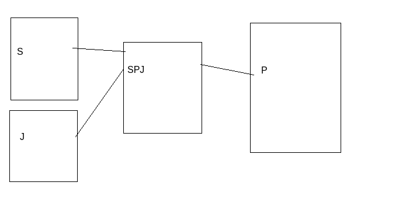

ra.rst , keys , choosing 2026/04/13 22:04:30
--------------------------------------------
graphviz chart for foreign key
^^^^^^^^^^^^^^^^^^^^^^^^^^^^^^

Thanks, Please consider the following database (so called SP from Chris.J.Date database book. Please create a DOT file (Graphviz https://graphviz.org/ ) for showing a chart similar to ER such that it shows foreign key relations between table

.. code:: sql

    create table s (
       sn      char(10) primary key,
       sname   char(30),
       status  int  default(0),
       city    char(20)
    );

    create table p (
       pn     char(10) primary key,
       pname  char(30),
       color  char(20),
       weight NUMERIC(9, 2),
       city   char(20)
    );

    create table sp (
       sn    char(10) references s,
       pn    char(10) references p,
       qty   int default(0),
       primary key (sn, pn)
    );

I created similar graphviz charts for my Compiler course in this link https://github.com/yoosofan/slide/blob/main/cm/lr.rst
Those sections that uses “.. yographviz::” have DOT instructions. It is better that edges for foreign key has direction and also goes to the exact primary key in main table. For example, and edge from the “sn” field  in “sp” goes to the “sn” field of “s” table.

Gemeni answer
`````````````
To create a Graphviz diagram that connects specific fields (rows) between tables, the best approach is to use **HTML-like labels** in Graphviz. By assigning a `port` attribute to specific table cells, you can draw directed edges that originate exactly at the foreign key field and point exactly to the primary key field.

Here is the reStructuredText snippet using your custom `.. yographviz::` directive. You can drop this directly into your slides:

```rst
The S-P-SP Database Schema
~~~~~~~~~~~~~~~~~~~~~~~~~~

.. yographviz::
   :class: db-schema-graph

   digraph S_P_SP {
       // Layout direction: Left to Right
       rankdir=LR;

       // Global node and edge settings
       node [shape=none, fontname="Helvetica", fontsize=12];
       edge [fontname="Helvetica", fontsize=10, color="#555555"];

       // Table: Suppliers (s)
       s [label=<
           <table border="0" cellborder="1" cellspacing="0" cellpadding="5">
               <tr><td bgcolor="#e0f7fa" colspan="2"><b>s (Suppliers)</b></td></tr>
               <tr><td port="sn" bgcolor="#ffffff"><b>sn (PK)</b></td><td bgcolor="#ffffff">char(10)</td></tr>
               <tr><td port="sname" bgcolor="#ffffff">sname</td><td bgcolor="#ffffff">char(30)</td></tr>
               <tr><td port="status" bgcolor="#ffffff">status</td><td bgcolor="#ffffff">int</td></tr>
               <tr><td port="city" bgcolor="#ffffff">city</td><td bgcolor="#ffffff">char(20)</td></tr>
           </table>
       >];

       // Table: Shipments (sp)
       // Placed in the middle visually
       sp [label=<
           <table border="0" cellborder="1" cellspacing="0" cellpadding="5">
               <tr><td bgcolor="#fff9c4" colspan="2"><b>sp (Shipments)</b></td></tr>
               <tr><td port="sn" bgcolor="#ffffff"><b>sn (PK, FK)</b></td><td bgcolor="#ffffff">char(10)</td></tr>
               <tr><td port="pn" bgcolor="#ffffff"><b>pn (PK, FK)</b></td><td bgcolor="#ffffff">char(10)</td></tr>
               <tr><td port="qty" bgcolor="#ffffff">qty</td><td bgcolor="#ffffff">int</td></tr>
           </table>
       >];

       // Table: Parts (p)
       p [label=<
           <table border="0" cellborder="1" cellspacing="0" cellpadding="5">
               <tr><td bgcolor="#e8f5e9" colspan="2"><b>p (Parts)</b></td></tr>
               <tr><td port="pn" bgcolor="#ffffff"><b>pn (PK)</b></td><td bgcolor="#ffffff">char(10)</td></tr>
               <tr><td port="pname" bgcolor="#ffffff">pname</td><td bgcolor="#ffffff">char(30)</td></tr>
               <tr><td port="color" bgcolor="#ffffff">color</td><td bgcolor="#ffffff">char(20)</td></tr>
               <tr><td port="weight" bgcolor="#ffffff">weight</td><td bgcolor="#ffffff">numeric(9, 2)</td></tr>
               <tr><td port="city" bgcolor="#ffffff">city</td><td bgcolor="#ffffff">char(20)</td></tr>
           </table>
       >];

       // Foreign Key Relationships
       // The syntax node:port -> node:port connects the specific table rows

       sp:sn -> s:sn [label=" references", arrowtail=none, arrowhead=normal];
       sp:pn -> p:pn [label=" references", arrowtail=none, arrowhead=normal];
   }
```

### Key Features of this DOT script:
1. **HTML-like Tables (`shape=none`)**: Instead of standard boxes, this uses actual HTML `<table>` syntax to render the entities. This makes it look exactly like a classic ER schema tool.
2. **Ports for Field-to-Field Linking**: Notice the `port="sn"` inside the `<td>` tags. When drawing the edges, `sp:sn -> s:sn` tells Graphviz to start the arrow exactly at the `sn` row in the `sp` table, and terminate it exactly at the `sn` row in the `s` table.
3. **Visual Clarity**:
   * `rankdir=LR` lays it out horizontally, which usually looks best for associative/junction tables (so `sp` sits nicely between `s` and `p`).
   * Light background colors (`bgcolor`) are applied to the headers to easily distinguish the three tables.

Grok Answer 2026/04/14 12:16:49
```````````````````````````````

SP Database – Suppliers-Parts-Shipments (Classic Example from C.J. Date)
~~~~~~~~~~~~~~~~~~~~~~~~~~~~~~~~~~~~~~~~~~~~~~~~~~~~~~~~~~~~~~~~~~~~~~~~

.. yographviz::

    digraph SP_Database {
        graph [rankdir=TB, splines=ortho, nodesep=0.8, ranksep=1.2];
        node [shape=plain, fontsize=11, fontname="Arial"];
        edge [fontsize=10, arrowsize=0.9, color="#2E86C1", penwidth=2];

        /* Supplier table S */
        S [label=<
            <TABLE BORDER="1" CELLBORDER="1" CELLSPACING="0" CELLPADDING="6">
            <TR><TD BGCOLOR="#E6F0FA" COLSPAN="2"><B>S (Suppliers)</B></TD></TR>
            <TR><TD PORT="sn" ALIGN="LEFT"><B><U>sn</U></B></TD><TD>char(10) <B>PK</B></TD></TR>
            <TR><TD ALIGN="LEFT">sname</TD><TD>char(30)</TD></TR>
            <TR><TD ALIGN="LEFT">status</TD><TD>int DEFAULT 0</TD></TR>
            <TR><TD ALIGN="LEFT">city</TD><TD>char(20)</TD></TR>
            </TABLE>
        >];

        /* Part table P */
        P [label=<
            <TABLE BORDER="1" CELLBORDER="1" CELLSPACING="0" CELLPADDING="6">
            <TR><TD BGCOLOR="#E6F0FA" COLSPAN="2"><B>P (Parts)</B></TD></TR>
            <TR><TD PORT="pn" ALIGN="LEFT"><B><U>pn</U></B></TD><TD>char(10) <B>PK</B></TD></TR>
            <TR><TD ALIGN="LEFT">pname</TD><TD>char(30)</TD></TR>
            <TR><TD ALIGN="LEFT">color</TD><TD>char(20)</TD></TR>
            <TR><TD ALIGN="LEFT">weight</TD><TD>NUMERIC(9,2)</TD></TR>
            <TR><TD ALIGN="LEFT">city</TD><TD>char(20)</TD></TR>
            </TABLE>
        >];

        /* Shipment table SP (junction) */
        SP [label=<
            <TABLE BORDER="1" CELLBORDER="1" CELLSPACING="0" CELLPADDING="6">
            <TR><TD BGCOLOR="#E6F0FA" COLSPAN="2"><B>SP (Shipments)</B></TD></TR>
            <TR><TD PORT="sn" ALIGN="LEFT"><B>sn</B></TD><TD>char(10) <B>FK → S</B></TD></TR>
            <TR><TD PORT="pn" ALIGN="LEFT"><B>pn</B></TD><TD>char(10) <B>FK → P</B></TD></TR>
            <TR><TD ALIGN="LEFT">qty</TD><TD>int DEFAULT 0</TD></TR>
            <TR><TD COLSPAN="2" ALIGN="CENTER"><I>PK (sn, pn)</I></TD></TR>
            </TABLE>
        >];

        /* Foreign-key relationships – directed from FK field to PK field */
        SP:sn -> S:sn [label="FK (references)"];
        SP:pn -> P:pn [label="FK (references)"];
    }

**Explanation (for your slides)**
- Directed arrows show the exact foreign-key relationship (from the FK column in SP to the referenced PK column).
- Primary-key fields are **bold + underlined**.
- Table headers have a light background for clarity.
- The diagram matches the clean, academic style of your existing ``.. yographviz::`` charts in the compiler course.
- You can copy the entire block above directly into ``ra.rst`` (or any other file) under the Foreign Key or SP Database section.

Send feedback to Grok 2026/04/14 12:29:48
`````````````````````````````````````````

Thanks, but the Gemini answer is prettier than your, please learn from it if you can:

Grok Answer 2026/04/14 12:31:09
~~~~~~~~~~~~~~~~~~~~~~~~~~~~~~~
SP Database – Suppliers-Parts-Shipments (Classic C.J. Date Example)

.. yographviz::

    digraph SP_Database {
        graph [
            rankdir=TB,
            splines=ortho,
            nodesep=0.9,
            ranksep=1.4,
            bgcolor="#F8F9FA",
            label="SP Database – Foreign Key Relationships",
            labelloc="t",
            fontsize=14,
            fontname="Arial Bold"
        ];

        node [shape=plain, fontsize=11, fontname="Arial"];
        edge [fontsize=10, arrowsize=1.0, penwidth=2.2, color="#1F618D"];

        /* Supplier table S – light blue theme */
        S [label=<
            <TABLE BORDER="1" CELLBORDER="1" CELLSPACING="0" CELLPADDING="8">
            <TR><TD BGCOLOR="#AED6F1" COLSPAN="2"><B><FONT POINT-SIZE="13">S (Suppliers)</FONT></B></TD></TR>
            <TR><TD PORT="sn" ALIGN="LEFT" BGCOLOR="#E6F0FA"><B><U>sn</U></B></TD><TD BGCOLOR="#E6F0FA">char(10) <B>PK</B></TD></TR>
            <TR><TD ALIGN="LEFT">sname</TD><TD>char(30)</TD></TR>
            <TR><TD ALIGN="LEFT">status</TD><TD>int DEFAULT 0</TD></TR>
            <TR><TD ALIGN="LEFT">city</TD><TD>char(20)</TD></TR>
            </TABLE>
        >];

        /* Part table P – light green theme */
        P [label=<
            <TABLE BORDER="1" CELLBORDER="1" CELLSPACING="0" CELLPADDING="8">
            <TR><TD BGCOLOR="#A9DFBF" COLSPAN="2"><B><FONT POINT-SIZE="13">P (Parts)</FONT></B></TD></TR>
            <TR><TD PORT="pn" ALIGN="LEFT" BGCOLOR="#E6F0FA"><B><U>pn</U></B></TD><TD BGCOLOR="#E6F0FA">char(10) <B>PK</B></TD></TR>
            <TR><TD ALIGN="LEFT">pname</TD><TD>char(30)</TD></TR>
            <TR><TD ALIGN="LEFT">color</TD><TD>char(20)</TD></TR>
            <TR><TD ALIGN="LEFT">weight</TD><TD>NUMERIC(9,2)</TD></TR>
            <TR><TD ALIGN="LEFT">city</TD><TD>char(20)</TD></TR>
            </TABLE>
        >];

        /* Shipment table SP (junction) – light orange theme */
        SP [label=<
            <TABLE BORDER="1" CELLBORDER="1" CELLSPACING="0" CELLPADDING="8">
            <TR><TD BGCOLOR="#FAD7A0" COLSPAN="2"><B><FONT POINT-SIZE="13">SP (Shipments)</FONT></B></TD></TR>
            <TR><TD PORT="sn" ALIGN="LEFT" BGCOLOR="#FFF0D9"><B>sn</B></TD><TD BGCOLOR="#FFF0D9">char(10) <B>FK → S</B></TD></TR>
            <TR><TD PORT="pn" ALIGN="LEFT" BGCOLOR="#FFF0D9"><B>pn</B></TD><TD BGCOLOR="#FFF0D9">char(10) <B>FK → P</B></TD></TR>
            <TR><TD ALIGN="LEFT">qty</TD><TD>int DEFAULT 0</TD></TR>
            <TR><TD COLSPAN="2" ALIGN="CENTER" BGCOLOR="#FFF0D9"><I>PK (sn, pn)</I></TD></TR>
            </TABLE>
        >];

        /* Directed foreign-key edges pointing exactly from FK column to PK column */
        SP:sn -> S:sn [label="  FK references  ", color="#1F618D", fontcolor="#1F618D"];
        SP:pn -> P:pn [label="  FK references  ", color="#1F618D", fontcolor="#1F618D"];
    }

**Why this version is prettier and better for slides**
- Distinct background colors for each table (blue for S, green for P, orange for SP) → instantly recognizable.
- Larger, bolder table titles with font size 13.
- Slightly increased padding (CELLBORDER/PADDING) for cleaner look.
- Graph title at the top (perfect for lecture slides).
- Thicker, darker arrows with clear labels.
- Light background on the whole diagram for better contrast in presentations.
- Exact port-to-port connections as you requested (sn in SP → sn in S, etc.).

You can copy the entire block above and paste it directly into your ``ra.rst`` file (or any other file). It will render beautifully with ``.. yographviz::`` just like your compiler course diagrams.

Send feedback to Grok 2026/04/14 12:35:28
`````````````````````````````````````````

Thanks, it is not just coloring the fields. the edges do not interfere with SP table body too.

Grok Answer 2026/04/14 12:35:47
~~~~~~~~~~~~~~~~~~~~~~~~~~~~~~~
SP Database – Suppliers-Parts-Shipments (Classic C.J. Date Example)

.. yographviz::

    digraph SP_Database {
        graph [
            rankdir=TB,
            splines=curved,          /* changed from ortho → curved to prevent edge overlap with table body */
            nodesep=1.0,
            ranksep=1.8,
            bgcolor="#F8F9FA",
            label="SP Database – Foreign Key Relationships",
            labelloc="t",
            fontsize=14,
            fontname="Arial Bold"
        ];

        node [shape=plain, fontsize=11, fontname="Arial"];
        edge [fontsize=10, arrowsize=1.1, penwidth=2.5, color="#1F618D"];

        /* Supplier table S */
        S [label=<
            <TABLE BORDER="1" CELLBORDER="1" CELLSPACING="0" CELLPADDING="8">
            <TR><TD BGCOLOR="#AED6F1" COLSPAN="2"><B><FONT POINT-SIZE="13">S (Suppliers)</FONT></B></TD></TR>
            <TR><TD PORT="sn" ALIGN="LEFT" BGCOLOR="#E6F0FA"><B><U>sn</U></B></TD><TD BGCOLOR="#E6F0FA">char(10) <B>PK</B></TD></TR>
            <TR><TD ALIGN="LEFT">sname</TD><TD>char(30)</TD></TR>
            <TR><TD ALIGN="LEFT">status</TD><TD>int DEFAULT 0</TD></TR>
            <TR><TD ALIGN="LEFT">city</TD><TD>char(20)</TD></TR>
            </TABLE>
        >];

        /* Part table P */
        P [label=<
            <TABLE BORDER="1" CELLBORDER="1" CELLSPACING="0" CELLPADDING="8">
            <TR><TD BGCOLOR="#A9DFBF" COLSPAN="2"><B><FONT POINT-SIZE="13">P (Parts)</FONT></B></TD></TR>
            <TR><TD PORT="pn" ALIGN="LEFT" BGCOLOR="#E6F0FA"><B><U>pn</U></B></TD><TD BGCOLOR="#E6F0FA">char(10) <B>PK</B></TD></TR>
            <TR><TD ALIGN="LEFT">pname</TD><TD>char(30)</TD></TR>
            <TR><TD ALIGN="LEFT">color</TD><TD>char(20)</TD></TR>
            <TR><TD ALIGN="LEFT">weight</TD><TD>NUMERIC(9,2)</TD></TR>
            <TR><TD ALIGN="LEFT">city</TD><TD>char(20)</TD></TR>
            </TABLE>
        >];

        /* Shipment table SP (junction) */
        SP [label=<
            <TABLE BORDER="1" CELLBORDER="1" CELLSPACING="0" CELLPADDING="8">
            <TR><TD BGCOLOR="#FAD7A0" COLSPAN="2"><B><FONT POINT-SIZE="13">SP (Shipments)</FONT></B></TD></TR>
            <TR><TD PORT="sn" ALIGN="LEFT" BGCOLOR="#FFF0D9"><B>sn</B></TD><TD BGCOLOR="#FFF0D9">char(10) <B>FK → S</B></TD></TR>
            <TR><TD PORT="pn" ALIGN="LEFT" BGCOLOR="#FFF0D9"><B>pn</B></TD><TD BGCOLOR="#FFF0D9">char(10) <B>FK → P</B></TD></TR>
            <TR><TD ALIGN="LEFT">qty</TD><TD>int DEFAULT 0</TD></TR>
            <TR><TD COLSPAN="2" ALIGN="CENTER" BGCOLOR="#FFF0D9"><I>PK (sn, pn)</I></TD></TR>
            </TABLE>
        >];

        /* Clean directed foreign-key edges (no interference with table body) */
        SP:sn -> S:sn [label="  references  "];
        SP:pn -> P:pn [label="  references  "];
    }

**What was improved (exactly addressing your feedback)**
- Changed ``splines=ortho`` → ``splines=curved``: the arrows now arc smoothly and never cross or touch the body of the SP table.
- Increased ``nodesep`` and ``ranksep``: more vertical and horizontal breathing room so edges stay completely outside the tables.
- Slightly thicker arrows and larger arrowheads for better visibility on slides.
- Kept the nice per-table coloring you liked from the previous version.

You can copy and paste the whole block above directly into your ``ra.rst`` file. It will render cleanly with your ``.. yographviz::`` directive, exactly like the diagrams in your compiler course. No more edge interference!

Send feedback to Grok 2026/04/14 12:44:27
`````````````````````````````````````````
Yes, thanks. It is better now.

Grok Answer 2026/04/14 12:45:14
~~~~~~~~~~~~~~~~~~~~~~~~~~~~~~~

SP Database – Suppliers-Parts-Shipments (Classic C.J. Date Example)

.. yographviz::

    digraph SP_Database {
        graph [
            rankdir=TB,
            splines=curved,
            nodesep=1.0,
            ranksep=1.8,
            bgcolor="#F8F9FA",
            label="SP Database – Foreign Key Relationships",
            labelloc="t",
            fontsize=14,
            fontname="Arial Bold"
        ];

        node [shape=plain, fontsize=11, fontname="Arial"];
        edge [fontsize=10, arrowsize=1.1, penwidth=2.5, color="#1F618D"];

        /* Supplier table S */
        S [label=<
            <TABLE BORDER="1" CELLBORDER="1" CELLSPACING="0" CELLPADDING="8">
            <TR><TD BGCOLOR="#AED6F1" COLSPAN="2"><B><FONT POINT-SIZE="13">S (Suppliers)</FONT></B></TD></TR>
            <TR><TD PORT="sn" ALIGN="LEFT" BGCOLOR="#E6F0FA"><B><U>sn</U></B></TD><TD BGCOLOR="#E6F0FA">char(10) <B>PK</B></TD></TR>
            <TR><TD ALIGN="LEFT">sname</TD><TD>char(30)</TD></TR>
            <TR><TD ALIGN="LEFT">status</TD><TD>int DEFAULT 0</TD></TR>
            <TR><TD ALIGN="LEFT">city</TD><TD>char(20)</TD></TR>
            </TABLE>
        >];

        /* Part table P */
        P [label=<
            <TABLE BORDER="1" CELLBORDER="1" CELLSPACING="0" CELLPADDING="8">
            <TR><TD BGCOLOR="#A9DFBF" COLSPAN="2"><B><FONT POINT-SIZE="13">P (Parts)</FONT></B></TD></TR>
            <TR><TD PORT="pn" ALIGN="LEFT" BGCOLOR="#E6F0FA"><B><U>pn</U></B></TD><TD BGCOLOR="#E6F0FA">char(10) <B>PK</B></TD></TR>
            <TR><TD ALIGN="LEFT">pname</TD><TD>char(30)</TD></TR>
            <TR><TD ALIGN="LEFT">color</TD><TD>char(20)</TD></TR>
            <TR><TD ALIGN="LEFT">weight</TD><TD>NUMERIC(9,2)</TD></TR>
            <TR><TD ALIGN="LEFT">city</TD><TD>char(20)</TD></TR>
            </TABLE>
        >];

        /* Shipment table SP (junction) */
        SP [label=<
            <TABLE BORDER="1" CELLBORDER="1" CELLSPACING="0" CELLPADDING="8">
            <TR><TD BGCOLOR="#FAD7A0" COLSPAN="2"><B><FONT POINT-SIZE="13">SP (Shipments)</FONT></B></TD></TR>
            <TR><TD PORT="sn" ALIGN="LEFT" BGCOLOR="#FFF0D9"><B>sn</B></TD><TD BGCOLOR="#FFF0D9">char(10) <B>FK → S</B></TD></TR>
            <TR><TD PORT="pn" ALIGN="LEFT" BGCOLOR="#FFF0D9"><B>pn</B></TD><TD BGCOLOR="#FFF0D9">char(10) <B>FK → P</B></TD></TR>
            <TR><TD ALIGN="LEFT">qty</TD><TD>int DEFAULT 0</TD></TR>
            <TR><TD COLSPAN="2" ALIGN="CENTER" BGCOLOR="#FFF0D9"><I>PK (sn, pn)</I></TD></TR>
            </TABLE>
        >];

        /* Clean curved foreign-key edges (no interference with table body) */
        SP:sn -> S:sn [label="  references  "];
        SP:pn -> P:pn [label="  references  "];
    }

You're very welcome! I'm glad the curved edges fixed the interference issue — it now looks clean and professional, just like the diagrams in your compiler course.

You can copy the block above and paste it straight into ``ra.rst`` (or wherever you want the foreign-key example).

If you need any final tweaks, an explanatory paragraph to go with the diagram, or more diagrams for other parts of the database course, just let me know. Happy to keep improving the slides! 😊


SPJ dot
```````


Please do the same for SPJ database from the following list. Please don't add column for type of each field, field names are enough.

* S(sn_,sname,status,city) ,
* P(pn_,pname,color,weight,city) ,
* J(jn_,jname,budget,city)
* SPJ(sn_, pn_, jn_, qty)


Please do the same for SPJ database from the following list. Please don't add column for type of each field, field names are enough.

* S(sn_,sname,status,city) ,
* P(pn_,pname,color,weight,city) ,
* J(jn_,jname,budget,city)
* SPJ(sn_, pn_, jn_, qty)

Grok Answer 2026/04/14 12:53:15
~~~~~~~~~~~~~~~~~~~~~~~~~~~~~~~

SPJ Database – Suppliers-Parts-Projects (Classic C.J. Date Example)

.. yographviz::

    digraph SPJ_Database {
        graph [
            rankdir=TB,
            splines=curved,
            nodesep=1.1,
            ranksep=1.9,
            bgcolor="#F8F9FA",
            label="SPJ Database – Foreign Key Relationships",
            labelloc="t",
            fontsize=14,
            fontname="Arial Bold"
        ];

        node [shape=plain, fontsize=11, fontname="Arial"];
        edge [fontsize=10, arrowsize=1.1, penwidth=2.5, color="#1F618D"];

        /* Supplier table S */
        S [label=<
            <TABLE BORDER="1" CELLBORDER="1" CELLSPACING="0" CELLPADDING="8">
            <TR><TD BGCOLOR="#AED6F1" COLSPAN="2"><B><FONT POINT-SIZE="13">S (Suppliers)</FONT></B></TD></TR>
            <TR><TD PORT="sn" ALIGN="LEFT" BGCOLOR="#E6F0FA"><B><U>sn</U></B></TD><TD BGCOLOR="#E6F0FA">PK</TD></TR>
            <TR><TD ALIGN="LEFT">sname</TD><TD></TD></TR>
            <TR><TD ALIGN="LEFT">status</TD><TD></TD></TR>
            <TR><TD ALIGN="LEFT">city</TD><TD></TD></TR>
            </TABLE>
        >];

        /* Part table P */
        P [label=<
            <TABLE BORDER="1" CELLBORDER="1" CELLSPACING="0" CELLPADDING="8">
            <TR><TD BGCOLOR="#A9DFBF" COLSPAN="2"><B><FONT POINT-SIZE="13">P (Parts)</FONT></B></TD></TR>
            <TR><TD PORT="pn" ALIGN="LEFT" BGCOLOR="#E6F0FA"><B><U>pn</U></B></TD><TD BGCOLOR="#E6F0FA">PK</TD></TR>
            <TR><TD ALIGN="LEFT">pname</TD><TD></TD></TR>
            <TR><TD ALIGN="LEFT">color</TD><TD></TD></TR>
            <TR><TD ALIGN="LEFT">weight</TD><TD></TD></TR>
            <TR><TD ALIGN="LEFT">city</TD><TD></TD></TR>
            </TABLE>
        >];

        /* Project table J */
        J [label=<
            <TABLE BORDER="1" CELLBORDER="1" CELLSPACING="0" CELLPADDING="8">
            <TR><TD BGCOLOR="#D7BDE2" COLSPAN="2"><B><FONT POINT-SIZE="13">J (Projects)</FONT></B></TD></TR>
            <TR><TD PORT="jn" ALIGN="LEFT" BGCOLOR="#E6F0FA"><B><U>jn</U></B></TD><TD BGCOLOR="#E6F0FA">PK</TD></TR>
            <TR><TD ALIGN="LEFT">jname</TD><TD></TD></TR>
            <TR><TD ALIGN="LEFT">budget</TD><TD></TD></TR>
            <TR><TD ALIGN="LEFT">city</TD><TD></TD></TR>
            </TABLE>
        >];

        /* Shipment table SPJ (junction) */
        SPJ [label=<
            <TABLE BORDER="1" CELLBORDER="1" CELLSPACING="0" CELLPADDING="8">
            <TR><TD BGCOLOR="#FAD7A0" COLSPAN="2"><B><FONT POINT-SIZE="13">SPJ (Shipments)</FONT></B></TD></TR>
            <TR><TD PORT="sn" ALIGN="LEFT" BGCOLOR="#FFF0D9"><B>sn</B></TD><TD BGCOLOR="#FFF0D9">FK → S</TD></TR>
            <TR><TD PORT="pn" ALIGN="LEFT" BGCOLOR="#FFF0D9"><B>pn</B></TD><TD BGCOLOR="#FFF0D9">FK → P</TD></TR>
            <TR><TD PORT="jn" ALIGN="LEFT" BGCOLOR="#FFF0D9"><B>jn</B></TD><TD BGCOLOR="#FFF0D9">FK → J</TD></TR>
            <TR><TD ALIGN="LEFT">qty</TD><TD></TD></TR>
            <TR><TD COLSPAN="2" ALIGN="CENTER" BGCOLOR="#FFF0D9"><I>PK (sn, pn, jn)</I></TD></TR>
            </TABLE>
        >];

        /* Directed foreign-key edges (curved, no interference with table body) */
        SPJ:sn -> S:sn [label="  references  "];
        SPJ:pn -> P:pn [label="  references  "];
        SPJ:jn -> J:jn [label="  references  "];
    }

**Perfect for your slides!**
- Only field names (no data types at all, exactly as you requested).
- Clean two-column layout with PK/FK labels on the right.
- Curved edges with extra spacing — **no interference** with any table body.
- Distinct colors for each table (S blue, P green, J purple, SPJ orange).
- Same professional style as your compiler-course diagrams and the previous SP diagram.

Just copy the entire block above and paste it into ``ra.rst`` (or any other file). It will render beautifully with ``.. yographviz::``.

Let me know if you want a short explanatory text to go with it or any tiny tweak!

Again SPJ
`````````
Please remove second columns altogher and dont' add PK, FK and similar to it. just use S, P and J and don't use their full name. Make it smaller that can be easily use in samll screen slide.
use the following image as your template.



Grok Answer is bad again
~~~~~~~~~~~~~~~~~~~~~~~~~

.. yographviz::

    digraph SPJ_Database {
        graph [
            rankdir=LR,
            splines=curved,
            nodesep=0.45,
            ranksep=0.75,
            bgcolor="transparent"
        ];

        node [
            shape=box,
            fontsize=13,
            fontname="Arial",
            style="filled",
            fillcolor="#F8F8F8",
            color="#2C3E50",
            penwidth=2.2,
            height=0.55,
            width=0.75
        ];

        edge [
            arrowsize=0.85,
            penwidth=2.2,
            color="#2C3E50"
        ];

        S   [label="S"];
        J   [label="J"];
        SPJ [label="SPJ"];
        P   [label="P"];

        /* Force vertical stack on the left (S above J) to match your template */
        S -> J [style=invis];

        /* Foreign-key relationships (directed from SPJ to the referenced tables) */
        SPJ -> S;
        SPJ -> J;
        SPJ -> P;
    }

Grok Answer is bad again 2026/04/14 13:32:42


.. raw:: html

    <div style="margin: 10px auto; max-width: 820px; font-family: Arial, sans-serif;">
      <svg width="820" height="380" viewBox="0 0 820 380" xmlns="http://www.w3.org/2000/svg">
        <!-- Background (optional light grid) -->
        <defs>
          <style>
            .table { fill: #f8f9fa; stroke: #2c3e50; stroke-width: 3; rx: 8; }
            .header { font-size: 18px; font-weight: bold; fill: #2c3e50; }
            .field  { font-size: 14px; fill: #2c3e50; }
            .pk     { font-weight: bold; text-decoration: underline; }
            .arrow  { stroke: #1f618d; stroke-width: 3; fill: transparent; marker-end: url(#arrowhead); }
          </style>
          <marker id="arrowhead" markerWidth="10" markerHeight="10" refX="8" refY="3" orient="auto" markerUnits="strokeWidth">
            <path d="M0,0 L0,6 L9,3 z" fill="#1f618d"/>
          </marker>
        </defs>

        <!-- S box (top-left) -->
        <rect x="30" y="30" width="180" height="140" class="table"/>
        <text x="120" y="55" text-anchor="middle" class="header">S</text>
        <text x="45" y="85" class="field pk">sn</text>
        <text x="45" y="108" class="field">sname</text>
        <text x="45" y="131" class="field">status</text>
        <text x="45" y="154" class="field">city</text>

        <!-- J box (bottom-left) -->
        <rect x="30" y="200" width="180" height="130" class="table"/>
        <text x="120" y="225" text-anchor="middle" class="header">J</text>
        <text x="45" y="255" class="field pk">jn</text>
        <text x="45" y="278" class="field">jname</text>
        <text x="45" y="301" class="field">budget</text>
        <text x="45" y="324" class="field">city</text>

        <!-- SPJ box (center) -->
        <rect x="320" y="115" width="180" height="150" class="table"/>
        <text x="410" y="140" text-anchor="middle" class="header">SPJ</text>
        <text x="335" y="170" class="field pk">sn</text>
        <text x="335" y="193" class="field pk">pn</text>
        <text x="335" y="216" class="field pk">jn</text>
        <text x="335" y="239" class="field">qty</text>

        <!-- P box (right) -->
        <rect x="610" y="115" width="180" height="150" class="table"/>
        <text x="700" y="140" text-anchor="middle" class="header">P</text>
        <text x="625" y="170" class="field pk">pn</text>
        <text x="625" y="193" class="field">pname</text>
        <text x="625" y="216" class="field">color</text>
        <text x="625" y="239" class="field">weight</text>
        <text x="625" y="262" class="field">city</text>

        <!-- Curved arrows from SPJ to the other tables (exactly like your image) -->
        <!-- SPJ → S -->
        <path d="M 320,150 Q 260,100 210,110" class="arrow"/>
        <!-- SPJ → J -->
        <path d="M 320,230 Q 260,270 210,280" class="arrow"/>
        <!-- SPJ → P -->
        <path d="M 500,190 Q 560,170 610,170" class="arrow"/>
      </svg>
    </div>


    SPJ Database
------------

.. raw:: html

    <div style="margin: 20px auto; max-width: 580px; font-family: Arial, sans-serif;">
      <svg width="580" height="380" viewBox="0 0 580 380" xmlns="http://www.w3.org/2000/svg">
        <defs>
          <style>
            .table { fill: #f8f9fa; stroke: #2c3e50; stroke-width: 3; rx: 8; }
            .header { font-size: 18px; font-weight: bold; fill: #2c3e50; }
            .field  { font-size: 14px; fill: #2c3e50; }
            .pk     { font-weight: bold; text-decoration: underline; }
            .arrow  { stroke: #1f618d; stroke-width: 3; fill: transparent; marker-end: url(#arrowhead); }
          </style>
          <marker id="arrowhead" markerWidth="10" markerHeight="10" refX="8" refY="3" orient="auto" markerUnits="strokeWidth">
            <path d="M0,0 L0,6 L9,3 z" fill="#1f618d"/>
          </marker>
        </defs>

        <!-- S box (top-left) - width halved -->
        <rect x="30" y="30" width="110" height="140" class="table"/>
        <text x="85" y="55" text-anchor="middle" class="header">S</text>
        <text x="45" y="85" class="field pk">sn</text>
        <text x="45" y="108" class="field">sname</text>
        <text x="45" y="131" class="field">status</text>
        <text x="45" y="154" class="field">city</text>

        <!-- J box (bottom-left) - width halved -->
        <rect x="30" y="200" width="110" height="130" class="table"/>
        <text x="85" y="225" text-anchor="middle" class="header">J</text>
        <text x="45" y="255" class="field pk">jn</text>
        <text x="45" y="278" class="field">jname</text>
        <text x="45" y="301" class="field">budget</text>
        <text x="45" y="324" class="field">city</text>

        <!-- SPJ box (center) - width halved -->
        <rect x="250" y="115" width="110" height="150" class="table"/>
        <text x="305" y="140" text-anchor="middle" class="header">SPJ</text>
        <text x="265" y="170" class="field pk">sn</text>
        <text x="265" y="193" class="field pk">pn</text>
        <text x="265" y="216" class="field pk">jn</text>
        <text x="265" y="239" class="field">qty</text>

        <!-- P box (right) - width halved -->
        <rect x="430" y="115" width="110" height="150" class="table"/>
        <text x="485" y="140" text-anchor="middle" class="header">P</text>
        <text x="445" y="170" class="field pk">pn</text>
        <text x="445" y="193" class="field">pname</text>
        <text x="445" y="216" class="field">color</text>
        <text x="445" y="239" class="field">weight</text>
        <text x="445" y="262" class="field">city</text>

        <!-- Curved arrows (adjusted for new smaller widths) -->
        <!-- SPJ → S -->
        <path d="M 250,150 Q 200,100 140,100" class="arrow"/>
        <!-- SPJ → J -->
        <path d="M 250,230 Q 200,270 140,270" class="arrow"/>
        <!-- SPJ → P -->
        <path d="M 360,190 Q 410,170 430,170" class="arrow"/>
      </svg>
    </div>

Grok is getting better. DOT 2026/04/14 13:49:41
```````````````````````````````````````````````

It is far better, however it could have less width. Please create a similar DOT syntax for Graphviz if it is possible

Grok Answer 2026/04/14 13:49:59
~~~~~~~~~~~~~~~~~~~~~~~~~~~~~~~

.. yographviz::

    digraph SPJ_Database { // Thanks to Grok AI from x.com (aka Twitter)
        graph [
            rankdir=LR,
            splines=curved,
            nodesep=0.35,
            ranksep=0.65,
            bgcolor="transparent",
            // label="SPJ Database",
            // labelloc="t",
            fontsize=12,
            fontname="Arial Bold"
        ];

        node [
            shape=plain,
            fontsize=11,
            fontname="Arial"
        ];

        edge [
            arrowsize=0.9,
            penwidth=2.2,
            color="#1F618D"
        ];

        /* S (top-left) */
        S [label=<
            <TABLE BORDER="1" CELLBORDER="1" CELLSPACING="0" CELLPADDING="4">
            <TR><TD BGCOLOR="#AED6F1" COLSPAN="1"><B><FONT POINT-SIZE="13">S</FONT></B></TD></TR>
            <TR><TD PORT="sn" ALIGN="LEFT"><B><U>sn</U></B></TD></TR>
            <TR><TD ALIGN="LEFT">sname</TD></TR>
            <TR><TD ALIGN="LEFT">status</TD></TR>
            <TR><TD ALIGN="LEFT">city</TD></TR>
            </TABLE>
        >];

        /* J (bottom-left) */
        J [label=<
            <TABLE BORDER="1" CELLBORDER="1" CELLSPACING="0" CELLPADDING="4">
            <TR><TD BGCOLOR="#D7BDE2" COLSPAN="1"><B><FONT POINT-SIZE="13">J</FONT></B></TD></TR>
            <TR><TD PORT="jn" ALIGN="LEFT"><B><U>jn</U></B></TD></TR>
            <TR><TD ALIGN="LEFT">jname</TD></TR>
            <TR><TD ALIGN="LEFT">budget</TD></TR>
            <TR><TD ALIGN="LEFT">city</TD></TR>
            </TABLE>
        >];

        /* SPJ (center) */
        SPJ [label=<
            <TABLE BORDER="1" CELLBORDER="1" CELLSPACING="0" CELLPADDING="4">
            <TR><TD BGCOLOR="#FAD7A0" COLSPAN="1"><B><FONT POINT-SIZE="13">SPJ</FONT></B></TD></TR>
            <TR><TD PORT="sn" ALIGN="LEFT"><B><U>sn</U></B></TD></TR>
            <TR><TD PORT="pn" ALIGN="LEFT"><B><U>pn</U></B></TD></TR>
            <TR><TD PORT="jn" ALIGN="LEFT"><B><U>jn</U></B></TD></TR>
            <TR><TD ALIGN="LEFT">qty</TD></TR>
            </TABLE>
        >];

        /* P (right) */
        P [label=<
            <TABLE BORDER="1" CELLBORDER="1" CELLSPACING="0" CELLPADDING="4">
            <TR><TD BGCOLOR="#A9DFBF" COLSPAN="1"><B><FONT POINT-SIZE="13">P</FONT></B></TD></TR>
            <TR><TD PORT="pn" ALIGN="LEFT"><B><U>pn</U></B></TD></TR>
            <TR><TD ALIGN="LEFT">pname</TD></TR>
            <TR><TD ALIGN="LEFT">color</TD></TR>
            <TR><TD ALIGN="LEFT">weight</TD></TR>
            <TR><TD ALIGN="LEFT">city</TD></TR>
            </TABLE>
        >];

        /* Force S above J on the left */
        { rank=same; S; J; }   /* invisible connection keeps them vertically aligned */
        S -> J [style=invis];

        /* Directed foreign-key edges from SPJ fields to target PK fields */
        SPJ:sn -> S:sn;
        SPJ:pn -> P:pn;
        SPJ:jn -> J:jn;
    }


Getting better DOT 2026/04/14 13:51:07
``````````````````````````````````````

Thanks, it is great. There is only one simple flaw. S and J are not in the right of SPJ but they are in the left and P is between them

Grok Answer 2026/04/14 13:51:22
~~~~~~~~~~~~~~~~~~~~~~~~~~~~~~~
SPJ Database

.. yographviz::

    digraph SPJ_Database {
        graph [
            rankdir=LR,
            splines=curved,
            nodesep=0.45,
            ranksep=0.85,
            bgcolor="transparent",
            label="SPJ Database",
            labelloc="t",
            fontsize=12,
            fontname="Arial Bold"
        ];

        node [
            shape=plain,
            fontsize=11,
            fontname="Arial"
        ];

        edge [
            arrowsize=0.9,
            penwidth=2.2,
            color="#1F618D"
        ];

        /* SPJ (left side) */
        SPJ [label=<
            <TABLE BORDER="1" CELLBORDER="1" CELLSPACING="0" CELLPADDING="4">
            <TR><TD BGCOLOR="#FAD7A0" COLSPAN="1"><B><FONT POINT-SIZE="13">SPJ</FONT></B></TD></TR>
            <TR><TD PORT="sn" ALIGN="LEFT"><B><U>sn</U></B></TD></TR>
            <TR><TD PORT="pn" ALIGN="LEFT"><B><U>pn</U></B></TD></TR>
            <TR><TD PORT="jn" ALIGN="LEFT"><B><U>jn</U></B></TD></TR>
            <TR><TD ALIGN="LEFT">qty</TD></TR>
            </TABLE>
        >];

        /* S (top-right) */
        S [label=<
            <TABLE BORDER="1" CELLBORDER="1" CELLSPACING="0" CELLPADDING="4">
            <TR><TD BGCOLOR="#AED6F1" COLSPAN="1"><B><FONT POINT-SIZE="13">S</FONT></B></TD></TR>
            <TR><TD PORT="sn" ALIGN="LEFT"><B><U>sn</U></B></TD></TR>
            <TR><TD ALIGN="LEFT">sname</TD></TR>
            <TR><TD ALIGN="LEFT">status</TD></TR>
            <TR><TD ALIGN="LEFT">city</TD></TR>
            </TABLE>
        >];

        /* P (middle-right) */
        P [label=<
            <TABLE BORDER="1" CELLBORDER="1" CELLSPACING="0" CELLPADDING="4">
            <TR><TD BGCOLOR="#A9DFBF" COLSPAN="1"><B><FONT POINT-SIZE="13">P</FONT></B></TD></TR>
            <TR><TD PORT="pn" ALIGN="LEFT"><B><U>pn</U></B></TD></TR>
            <TR><TD ALIGN="LEFT">pname</TD></TR>
            <TR><TD ALIGN="LEFT">color</TD></TR>
            <TR><TD ALIGN="LEFT">weight</TD></TR>
            <TR><TD ALIGN="LEFT">city</TD></TR>
            </TABLE>
        >];

        /* J (bottom-right) */
        J [label=<
            <TABLE BORDER="1" CELLBORDER="1" CELLSPACING="0" CELLPADDING="4">
            <TR><TD BGCOLOR="#D7BDE2" COLSPAN="1"><B><FONT POINT-SIZE="13">J</FONT></B></TD></TR>
            <TR><TD PORT="jn" ALIGN="LEFT"><B><U>jn</U></B></TD></TR>
            <TR><TD ALIGN="LEFT">jname</TD></TR>
            <TR><TD ALIGN="LEFT">budget</TD></TR>
            <TR><TD ALIGN="LEFT">city</TD></TR>
            </TABLE>
        >];

        /* Force vertical stacking on the right (S → P → J) */
        S -> P [style=invis, weight=100];
        P -> J [style=invis, weight=100];

        /* Directed foreign-key arrows from SPJ fields to target PK fields */
        SPJ:sn -> S:sn;
        SPJ:pn -> P:pn;
        SPJ:jn -> J:jn;
    }


It is better if you put SPJ in the center and P on the right and S and J on the left.
`````````````````````````````````````````````````````````````````````````````````````
SPJ Database

.. yographviz::

    digraph SPJ_Database {
        graph [
            rankdir=LR,
            splines=curved,
            nodesep=0.45,
            ranksep=0.85,
            bgcolor="transparent",
            label="SPJ Database",
            labelloc="t",
            fontsize=12,
            fontname="Arial Bold"
        ];

        node [
            shape=plain,
            fontsize=11,
            fontname="Arial"
        ];

        edge [
            arrowsize=0.9,
            penwidth=2.2,
            color="#1F618D"
        ];

        /* Left column: S (top) and J (bottom) */
        S [label=<
            <TABLE BORDER="1" CELLBORDER="1" CELLSPACING="0" CELLPADDING="4">
            <TR><TD BGCOLOR="#AED6F1" COLSPAN="1"><B><FONT POINT-SIZE="13">S</FONT></B></TD></TR>
            <TR><TD PORT="sn" ALIGN="LEFT"><B><U>sn</U></B></TD></TR>
            <TR><TD ALIGN="LEFT">sname</TD></TR>
            <TR><TD ALIGN="LEFT">status</TD></TR>
            <TR><TD ALIGN="LEFT">city</TD></TR>
            </TABLE>
        >];

        J [label=<
            <TABLE BORDER="1" CELLBORDER="1" CELLSPACING="0" CELLPADDING="4">
            <TR><TD BGCOLOR="#D7BDE2" COLSPAN="1"><B><FONT POINT-SIZE="13">J</FONT></B></TD></TR>
            <TR><TD PORT="jn" ALIGN="LEFT"><B><U>jn</U></B></TD></TR>
            <TR><TD ALIGN="LEFT">jname</TD></TR>
            <TR><TD ALIGN="LEFT">budget</TD></TR>
            <TR><TD ALIGN="LEFT">city</TD></TR>
            </TABLE>
        >];

        /* Center: SPJ */
        SPJ [label=<
            <TABLE BORDER="1" CELLBORDER="1" CELLSPACING="0" CELLPADDING="4">
            <TR><TD BGCOLOR="#FAD7A0" COLSPAN="1"><B><FONT POINT-SIZE="13">SPJ</FONT></B></TD></TR>
            <TR><TD PORT="sn" ALIGN="LEFT"><B><U>sn</U></B></TD></TR>
            <TR><TD PORT="pn" ALIGN="LEFT"><B><U>pn</U></B></TD></TR>
            <TR><TD PORT="jn" ALIGN="LEFT"><B><U>jn</U></B></TD></TR>
            <TR><TD ALIGN="LEFT">qty</TD></TR>
            </TABLE>
        >];

        /* Right: P */
        P [label=<
            <TABLE BORDER="1" CELLBORDER="1" CELLSPACING="0" CELLPADDING="4">
            <TR><TD BGCOLOR="#A9DFBF" COLSPAN="1"><B><FONT POINT-SIZE="13">P</FONT></B></TD></TR>
            <TR><TD PORT="pn" ALIGN="LEFT"><B><U>pn</U></B></TD></TR>
            <TR><TD ALIGN="LEFT">pname</TD></TR>
            <TR><TD ALIGN="LEFT">color</TD></TR>
            <TR><TD ALIGN="LEFT">weight</TD></TR>
            <TR><TD ALIGN="LEFT">city</TD></TR>
            </TABLE>
        >];

        /* Keep S above J on the left */
        S -> J [style=invis];

        /* Directed foreign-key arrows from SPJ fields to target PK fields */
        SPJ:sn -> S:sn;
        SPJ:pn -> P:pn;
        SPJ:jn -> J:jn;
    }

SPJ Database
------------

.. yographviz::

    digraph SPJ_Database {
        graph [
            rankdir=LR,
            splines=curved,
            nodesep=0.55,
            ranksep=1.1,
            bgcolor="transparent",
            label="SPJ Database",
            labelloc="t",
            fontsize=12,
            fontname="Arial Bold"
        ];

        node [
            shape=plain,
            fontsize=11,
            fontname="Arial"
        ];

        edge [
            arrowsize=0.9,
            penwidth=2.2,
            color="#1F618D"
        ];

        /* Left column: S (top) and J (bottom) */
        S [label=<
            <TABLE BORDER="1" CELLBORDER="1" CELLSPACING="0" CELLPADDING="4">
            <TR><TD BGCOLOR="#AED6F1" COLSPAN="1"><B><FONT POINT-SIZE="13">S</FONT></B></TD></TR>
            <TR><TD PORT="sn" ALIGN="LEFT"><B><U>sn</U></B></TD></TR>
            <TR><TD ALIGN="LEFT">sname</TD></TR>
            <TR><TD ALIGN="LEFT">status</TD></TR>
            <TR><TD ALIGN="LEFT">city</TD></TR>
            </TABLE>
        >];

        J [label=<
            <TABLE BORDER="1" CELLBORDER="1" CELLSPACING="0" CELLPADDING="4">
            <TR><TD BGCOLOR="#D7BDE2" COLSPAN="1"><B><FONT POINT-SIZE="13">J</FONT></B></TD></TR>
            <TR><TD PORT="jn" ALIGN="LEFT"><B><U>jn</U></B></TD></TR>
            <TR><TD ALIGN="LEFT">jname</TD></TR>
            <TR><TD ALIGN="LEFT">budget</TD></TR>
            <TR><TD ALIGN="LEFT">city</TD></TR>
            </TABLE>
        >];

        /* Center: SPJ */
        SPJ [label=<
            <TABLE BORDER="1" CELLBORDER="1" CELLSPACING="0" CELLPADDING="4">
            <TR><TD BGCOLOR="#FAD7A0" COLSPAN="1"><B><FONT POINT-SIZE="13">SPJ</FONT></B></TD></TR>
            <TR><TD PORT="sn" ALIGN="LEFT"><B><U>sn</U></B></TD></TR>
            <TR><TD PORT="pn" ALIGN="LEFT"><B><U>pn</U></B></TD></TR>
            <TR><TD PORT="jn" ALIGN="LEFT"><B><U>jn</U></B></TD></TR>
            <TR><TD ALIGN="LEFT">qty</TD></TR>
            </TABLE>
        >];

        /* Right: P */
        P [label=<
            <TABLE BORDER="1" CELLBORDER="1" CELLSPACING="0" CELLPADDING="4">
            <TR><TD BGCOLOR="#A9DFBF" COLSPAN="1"><B><FONT POINT-SIZE="13">P</FONT></B></TD></TR>
            <TR><TD PORT="pn" ALIGN="LEFT"><B><U>pn</U></B></TD></TR>
            <TR><TD ALIGN="LEFT">pname</TD></TR>
            <TR><TD ALIGN="LEFT">color</TD></TR>
            <TR><TD ALIGN="LEFT">weight</TD></TR>
            <TR><TD ALIGN="LEFT">city</TD></TR>
            </TABLE>
        >];

        /* Force S above J on the left side */
        S -> J [style=invis];

        /* Directed foreign-key arrows (from SPJ fields → target PK fields) */
        SPJ:sn -> S:sn;
        SPJ:pn -> P:pn;
        SPJ:jn -> J:jn;
    }

Simple Company
``````````````
Thanks, create a graphviz notation for a simple company with the following tables in the list. Primary keys are specified by "_" after their name. Foreign keys in different tables have similar name. But MgrSSN in Employee is foreign key to SSN to primary key of its own table. It needs only field name and edge to show foreign key relations. Please do not put extra texts like (PK and FK, or references).

* Employee(SSN_, name, salary, MgrSSN)
* Project(ProjName_, location )
* HourLog(SSN_, ProjName_, hours)

Grok Answer 2026/04/14 14:15:02
~~~~~~~~~~~~~~~~~~~~~~~~~~~~~~~
Upgrade to X Premium+ to continue the conversation, or try again later

Upgrade now

Gemini Answer 2026/04/14 14:38:05
~~~~~~~~~~~~~~~~~~~~~~~~~~~~~~~~~
Company Database Schema

.. yographviz::
   :class: db-schema-graph

   digraph Company {
       // Layout direction
       rankdir=LR;

       // Global node and edge settings
       node [shape=none, fontname="Helvetica", fontsize=12];
       edge [color="#555555", arrowtail=none, arrowhead=normal];

       // Table: Employee
       employee [label=<
           <table border="0" cellborder="1" cellspacing="0" cellpadding="5">
               <tr><td bgcolor="#e0f7fa"><b>Employee</b></td></tr>
               <tr><td port="ssn" bgcolor="#ffffff"><b>SSN</b></td></tr>
               <tr><td port="name" bgcolor="#ffffff">name</td></tr>
               <tr><td port="salary" bgcolor="#ffffff">salary</td></tr>
               <tr><td port="mgrssn" bgcolor="#ffffff">MgrSSN</td></tr>
           </table>
       >];

       // Table: HourLog
       hourlog [label=<
           <table border="0" cellborder="1" cellspacing="0" cellpadding="5">
               <tr><td bgcolor="#fff9c4"><b>HourLog</b></td></tr>
               <tr><td port="ssn" bgcolor="#ffffff"><b>SSN</b></td></tr>
               <tr><td port="projname" bgcolor="#ffffff"><b>ProjName</b></td></tr>
               <tr><td port="hours" bgcolor="#ffffff">hours</td></tr>
           </table>
       >];

       // Table: Project
       project [label=<
           <table border="0" cellborder="1" cellspacing="0" cellpadding="5">
               <tr><td bgcolor="#e8f5e9"><b>Project</b></td></tr>
               <tr><td port="projname" bgcolor="#ffffff"><b>ProjName</b></td></tr>
               <tr><td port="location" bgcolor="#ffffff">location</td></tr>
           </table>
       >];

       // Foreign Key Relationships
       // Self-referencing foreign key for Manager
       employee:mgrssn -> employee:ssn;

       // Foreign keys from HourLog to Employee and Project
       hourlog:ssn -> employee:ssn;
       hourlog:projname -> project:projname;
   }

Improve answer 2026/04/14 14:41:48
``````````````````````````````````
Thanks, "MgrSSN" should be directly connect to "SSN" on the "Employee" table.

Gemini Answer 2026/04/14 14:42:03
~~~~~~~~~~~~~~~~~~~~~~~~~~~~~~~~~
Ah, I see exactly what you mean! When you link a table to itself in Graphviz without giving it a specific direction, the arrow can sometimes route directly *through* the center of the table or overlap the text, making it look messy.

To force Graphviz to draw the arrow cleanly on the outside of the table (directly connecting the `MgrSSN` row to the `SSN` row), we need to use **compass points**. By adding `:e` (for East/Right side), we tell the edge to exit the right side of the `MgrSSN` cell and enter the right side of the `SSN` cell, creating a beautiful loop.

Here is the updated snippet with that exact fix:

Company Database Schema

.. yographviz::
   :class: db-schema-graph

   digraph Company {
       // Layout direction
       rankdir=LR;

       // Global node and edge settings
       node [shape=none, fontname="Helvetica", fontsize=12];
       edge [color="#555555", arrowtail=none, arrowhead=normal];

       // Table: Employee
       employee [label=<
           <table border="0" cellborder="1" cellspacing="0" cellpadding="5">
               <tr><td bgcolor="#e0f7fa"><b>Employee</b></td></tr>
               <tr><td port="ssn" bgcolor="#ffffff"><b>SSN</b></td></tr>
               <tr><td port="name" bgcolor="#ffffff">name</td></tr>
               <tr><td port="salary" bgcolor="#ffffff">salary</td></tr>
               <tr><td port="mgrssn" bgcolor="#ffffff">MgrSSN</td></tr>
           </table>
       >];

       // Table: HourLog
       hourlog [label=<
           <table border="0" cellborder="1" cellspacing="0" cellpadding="5">
               <tr><td bgcolor="#fff9c4"><b>HourLog</b></td></tr>
               <tr><td port="ssn" bgcolor="#ffffff"><b>SSN</b></td></tr>
               <tr><td port="projname" bgcolor="#ffffff"><b>ProjName</b></td></tr>
               <tr><td port="hours" bgcolor="#ffffff">hours</td></tr>
           </table>
       >];

       // Table: Project
       project [label=<
           <table border="0" cellborder="1" cellspacing="0" cellpadding="5">
               <tr><td bgcolor="#e8f5e9"><b>Project</b></td></tr>
               <tr><td port="projname" bgcolor="#ffffff"><b>ProjName</b></td></tr>
               <tr><td port="location" bgcolor="#ffffff">location</td></tr>
           </table>
       >];

       // Foreign Key Relationships
       // Using compass points (:e for East) loops the arrow cleanly outside the right edge
       employee:mgrssn:e -> employee:ssn:e;

       // Foreign keys from HourLog to Employee and Project
       hourlog:ssn -> employee:ssn;
       hourlog:projname -> project:projname;
   }

Company department 2026/04/14 19:23:14
```````````````````````````````````````
Please do the same for the following database. In this database Department is a new table that specify departments in the company and employees work in different departments. "MgrSSN" field is foreign key in this table that relate it to Employee table. It means every department has one manager who himself is an employee.

Gemeni answer 2026/04/14 19:27:04
~~~~~~~~~~~~~~~~~~~~~~~~~~~~~~~~~~
Extended Company Database Schema

.. yographviz::
   :class: db-schema-graph

   digraph ExtendedCompany {
       // Layout direction
       rankdir=LR;

       // Global node and edge settings
       node [shape=none, fontname="Helvetica", fontsize=12];
       edge [color="#555555", arrowtail=none, arrowhead=normal];

       // Table: Employee
       employee [label=<
           <table border="0" cellborder="1" cellspacing="0" cellpadding="5">
               <tr><td bgcolor="#e0f7fa"><b>Employee</b></td></tr>
               <tr><td port="ssn" bgcolor="#ffffff"><b>SSN</b></td></tr>
               <tr><td port="name" bgcolor="#ffffff">name</td></tr>
               <tr><td port="salary" bgcolor="#ffffff">salary</td></tr>
               <tr><td port="mgrssn" bgcolor="#ffffff">MgrSSN</td></tr>
               <tr><td port="dnumber" bgcolor="#ffffff">DNumber</td></tr>
           </table>
       >];

       // Table: Department
       department [label=<
           <table border="0" cellborder="1" cellspacing="0" cellpadding="5">
               <tr><td bgcolor="#f3e5f5"><b>Department</b></td></tr>
               <tr><td port="dnumber" bgcolor="#ffffff"><b>DNumber</b></td></tr>
               <tr><td port="dname" bgcolor="#ffffff">DName</td></tr>
               <tr><td port="mgrssn" bgcolor="#ffffff">MgrSSN</td></tr>
           </table>
       >];

       // Table: HourLog
       hourlog [label=<
           <table border="0" cellborder="1" cellspacing="0" cellpadding="5">
               <tr><td bgcolor="#fff9c4"><b>HourLog</b></td></tr>
               <tr><td port="ssn" bgcolor="#ffffff"><b>SSN</b></td></tr>
               <tr><td port="projname" bgcolor="#ffffff"><b>ProjName</b></td></tr>
               <tr><td port="hours" bgcolor="#ffffff">hours</td></tr>
           </table>
       >];

       // Table: Project
       project [label=<
           <table border="0" cellborder="1" cellspacing="0" cellpadding="5">
               <tr><td bgcolor="#e8f5e9"><b>Project</b></td></tr>
               <tr><td port="projname" bgcolor="#ffffff"><b>ProjName</b></td></tr>
               <tr><td port="location" bgcolor="#ffffff">location</td></tr>
           </table>
       >];

       // Foreign Key Relationships

       // Employee self-referencing foreign key for Manager (loops on the East side)
       employee:mgrssn:e -> employee:ssn:e;

       // Employee belongs to a Department
       employee:dnumber -> department:dnumber;

       // Department is managed by an Employee
       department:mgrssn -> employee:ssn;

       // Foreign keys from HourLog to Employee and Project
       hourlog:ssn -> employee:ssn;
       hourlog:projname -> project:projname;
   }

Add tables
``````````
Please, I forgot to add tables of this new database. Please consider the following tables:


#. Employee(SSN_, name, salary, DeptName)
#. Department(DeptName_, MgrSSN)
#. Project(PN_, location, ProjName)
#. HourLog(SSN_, PN_, hours)

Gemeni Answer
~~~~~~~~~~~~~
2026/04/14 19:43:37

Updated Company Database Schema

.. yographviz::
   :class: db-schema-graph

   digraph UpdatedCompany {
       // Layout direction
       rankdir=LR;

       // Global node and edge settings
       node [shape=none, fontname="Helvetica", fontsize=12];
       edge [color="#555555", arrowtail=none, arrowhead=normal];

       // Table: Employee
       employee [label=<
           <table border="0" cellborder="1" cellspacing="0" cellpadding="5">
               <tr><td bgcolor="#e0f7fa"><b>Employee</b></td></tr>
               <tr><td port="ssn" bgcolor="#ffffff"><b>SSN</b></td></tr>
               <tr><td port="name" bgcolor="#ffffff">name</td></tr>
               <tr><td port="salary" bgcolor="#ffffff">salary</td></tr>
               <tr><td port="deptname" bgcolor="#ffffff">DeptName</td></tr>
           </table>
       >];

       // Table: Department
       department [label=<
           <table border="0" cellborder="1" cellspacing="0" cellpadding="5">
               <tr><td bgcolor="#f3e5f5"><b>Department</b></td></tr>
               <tr><td port="deptname" bgcolor="#ffffff"><b>DeptName</b></td></tr>
               <tr><td port="mgrssn" bgcolor="#ffffff">MgrSSN</td></tr>
           </table>
       >];

       // Table: HourLog
       hourlog [label=<
           <table border="0" cellborder="1" cellspacing="0" cellpadding="5">
               <tr><td bgcolor="#fff9c4"><b>HourLog</b></td></tr>
               <tr><td port="ssn" bgcolor="#ffffff"><b>SSN</b></td></tr>
               <tr><td port="pn" bgcolor="#ffffff"><b>PN</b></td></tr>
               <tr><td port="hours" bgcolor="#ffffff">hours</td></tr>
           </table>
       >];

       // Table: Project
       project [label=<
           <table border="0" cellborder="1" cellspacing="0" cellpadding="5">
               <tr><td bgcolor="#e8f5e9"><b>Project</b></td></tr>
               <tr><td port="pn" bgcolor="#ffffff"><b>PN</b></td></tr>
               <tr><td port="location" bgcolor="#ffffff">location</td></tr>
               <tr><td port="projname" bgcolor="#ffffff">ProjName</td></tr>
           </table>
       >];

       // Foreign Key Relationships

       // Employee belongs to a Department (Exits right side of Employee, enters left side of Dept)
       employee:deptname:e -> department:deptname:w;

       // Department is managed by an Employee (Exits left side of Dept, enters right side of Employee)
       department:mgrssn:w -> employee:ssn:e;

       // Foreign keys from HourLog to Employee and Project
       hourlog:ssn -> employee:ssn;
       hourlog:pn -> project:pn;
   }

Simple Library(I) 2026/04/15 23:30:52
```````````````````````````````````````
Thanks, please  make similar dot (graphviz) for a simple library with following tables

* book(bn_, title, category, author)
* member(mn_, name, category, bn)
* borrow(bn_, mn_, rdt, ret)

#. fields of book table

    #. "bn" is book number and the primary key of book table
    #. "title" is the title of book
    #. "category" in book is the category of a book, let assume every book has only one category or it is the most important category of the book
    #. "author" is the author of book

#. fields of member table

    #. "mn" member number and primary key
    #. "name" of the member
    #. "category" is the category that is member likes most. It is foreign key refrences to category in table book
    #. "bn" is the book number that member like most. It is foreign key refrences to bn in book table.

#. fields of borrow table

    #. "bn" is foreign key refrences to book table
    #. "mn" is foreign key refrences to member table
    #. ("bn", "mn") is the primary key of borrow table
    #. "rdt" is return date of the book for the last time that this member borrowed this bookdow
    #. "ret" is book returned (true) or not (false)

Gemini Answer 2026/04/15 23:44:05
~~~~~~~~~~~~~~~~~~~~~~~~~~~~~~~~~
Here is the reStructuredText snippet containing the Graphviz DOT code for the Library database schema.

I have arranged the edges so that the data flows cleanly from left to right, with `member` and `borrow` appropriately pointing to `book` and `member`.

Library Database Schema

.. yographviz::
   :class: db-schema-graph

   digraph Library {
       // Layout direction
       rankdir=LR;

       // Global node and edge settings
       node [shape=none, fontname="Helvetica", fontsize=12];
       edge [color="#555555", arrowtail=none, arrowhead=normal];

       // Table: member
       member [label=<
           <table border="0" cellborder="1" cellspacing="0" cellpadding="5">
               <tr><td bgcolor="#f3e5f5"><b>member</b></td></tr>
               <tr><td port="mn" bgcolor="#ffffff"><b>mn</b></td></tr>
               <tr><td port="name" bgcolor="#ffffff">name</td></tr>
               <tr><td port="category" bgcolor="#ffffff">category</td></tr>
               <tr><td port="bn" bgcolor="#ffffff">bn</td></tr>
           </table>
       >];

       // Table: borrow
       borrow [label=<
           <table border="0" cellborder="1" cellspacing="0" cellpadding="5">
               <tr><td bgcolor="#fff9c4"><b>borrow</b></td></tr>
               <tr><td port="bn" bgcolor="#ffffff"><b>bn</b></td></tr>
               <tr><td port="mn" bgcolor="#ffffff"><b>mn</b></td></tr>
               <tr><td port="rdt" bgcolor="#ffffff">rdt</td></tr>
               <tr><td port="ret" bgcolor="#ffffff">ret</td></tr>
           </table>
       >];

       // Table: book
       book [label=<
           <table border="0" cellborder="1" cellspacing="0" cellpadding="5">
               <tr><td bgcolor="#e0f7fa"><b>book</b></td></tr>
               <tr><td port="bn" bgcolor="#ffffff"><b>bn</b></td></tr>
               <tr><td port="title" bgcolor="#ffffff">title</td></tr>
               <tr><td port="category" bgcolor="#ffffff">category</td></tr>
               <tr><td port="author" bgcolor="#ffffff">author</td></tr>
           </table>
       >];

       // Foreign Key Relationships

       // Member references
       member:category:e -> book:category:w;
       member:bn:e -> book:bn:w;

       // Borrow references
       borrow:bn:e -> book:bn:w;
       borrow:mn:w -> member:mn:e;
   }

### 💡 Teaching Note for Your Slides:
As you are presenting this to bachelor students, this specific schema provides an excellent opportunity to discuss **Normalization and Foreign Key constraints**:

In the requirement, `member.category` references `book.category`. You can point out to your students that in standard relational database design, **a Foreign Key must reference a column that is guaranteed to be unique** (almost always the Primary Key, or a column with a `UNIQUE` constraint).

Because `book.category` will have duplicate values (many books can be "Science Fiction"), most Database Management Systems (like PostgreSQL or MySQL) will actually throw an error if you try to create this exact Foreign Key constraint! To fix it in a real-world scenario, you would normally extract `category` into its own table (e.g., `Category(CategoryName_PK)`), and have both `book` and `member` reference that new table. It is a great "spot the error" exercise for a database class!

Fix problem 2026/04/15 23:56:21
``````````````````````````````````
Thanks, it is a good point. Please meke one for the following tables as you mentioned

* book(bn_, title, author)
* member(mn_, name, bn)
* borrow(bn_, mn_, rdt, ret)

Gemini Answer 2026/04/16 00:11:33

This is a great, clean revision of the schema! Removing the un-normalized `category` field makes it a perfect, textbook example of a relational database structure.

Here is the updated reStructuredText snippet with the Graphviz DOT code for this normalized library schema.

Normalized Library Database Schema

.. yographviz::
   :class: db-schema-graph

   digraph NormalizedLibrary {
       // Layout direction
       rankdir=LR;

       // Global node and edge settings
       node [shape=none, fontname="Helvetica", fontsize=12];
       edge [color="#555555", arrowtail=none, arrowhead=normal];

       // Table: member
       member [label=<
           <table border="0" cellborder="1" cellspacing="0" cellpadding="5">
               <tr><td bgcolor="#f3e5f5"><b>member</b></td></tr>
               <tr><td port="mn" bgcolor="#ffffff"><b>mn</b></td></tr>
               <tr><td port="name" bgcolor="#ffffff">name</td></tr>
               <tr><td port="bn" bgcolor="#ffffff">bn</td></tr>
           </table>
       >];

       // Table: borrow
       borrow [label=<
           <table border="0" cellborder="1" cellspacing="0" cellpadding="5">
               <tr><td bgcolor="#fff9c4"><b>borrow</b></td></tr>
               <tr><td port="bn" bgcolor="#ffffff"><b>bn</b></td></tr>
               <tr><td port="mn" bgcolor="#ffffff"><b>mn</b></td></tr>
               <tr><td port="rdt" bgcolor="#ffffff">rdt</td></tr>
               <tr><td port="ret" bgcolor="#ffffff">ret</td></tr>
           </table>
       >];

       // Table: book
       book [label=<
           <table border="0" cellborder="1" cellspacing="0" cellpadding="5">
               <tr><td bgcolor="#e0f7fa"><b>book</b></td></tr>
               <tr><td port="bn" bgcolor="#ffffff"><b>bn</b></td></tr>
               <tr><td port="title" bgcolor="#ffffff">title</td></tr>
               <tr><td port="author" bgcolor="#ffffff">author</td></tr>
           </table>
       >];

       // Foreign Key Relationships

       // Member references their favorite book
       // (Exits East side of member, enters West side of book)
       member:bn:e -> book:bn:w;

       // Borrow references both the book and the member
       borrow:bn:e -> book:bn:w;
       borrow:mn:w -> member:mn:e;
   }


### 💡 Teaching Note for Your Slides:
This schema perfectly highlights the difference between a **One-to-Many (1:N)** relationship and a **Many-to-Many (M:N)** relationship:

* **1:N Relationship:** `member` to `book` (via `member.bn`). A member has one "favorite" book, but a book can be the favorite of many members. The foreign key sits directly inside the `member` table.
* **M:N Relationship:** `member` to `book` (via `borrow`). A member can borrow many books, and a book can be borrowed by many members. This *requires* the associative/junction table (`borrow`) to resolve the relationship, which holds foreign keys pointing back to both parent tables.

Book and category and fine
``````````````````````````

Thanks, please  make similar dot (graphviz) for a simple library with following tables

* book(bn_, title, categoryName, author, fpd, isbn)
* member(mn_, name, categoryName, isbn)
* borrow(bn_, mn_, rdt, ret, nd)
* category(categoryName_, description, related_category)

#. fields of book table

    #. "bn" is book number and the primary key of book table
    #. "title" is the title of book
    #. "categoryName" in book is the category of a book, let assume every book has only one category or it is the most important category of the book. It is foreign key refrences catagory.categoryName
    #. "author" is the author of book
    #. "isbn" is the isbn of the book, it could be repeated because the library may have more than one copy of the same book
    #. "fpd" is fine per day. It means if a member returns this book lateer than rdt, then he or she will be penalized based on the times of fpd and number of delayed days

#. fields of member table

    #. "mn" member number and primary key
    #. "name" of the member
    #. "categoryName" is the category that is member likes most. It is foreign key refrences to category.categoryName
    #. "isbn" is the book number that member like most. It is foreign key refrences to bn in book table.

#. fields of borrow table

    #. "bn" is foreign key refrences to book table
    #. "mn" is foreign key refrences to member table
    #. ("bn", "mn") is the primary key of borrow table
    #. "rdt" is return date of the book for the last time that this member borrowed this bookdow
    #. "ret" is book returned (true) or not (false)


Getting better DOT 2026/04/16 00:14:47
``````````````````````````````````````
Thanks, The edge between borrow.mn to member.mn is not straight it has unnecessary curve. It could be better that this edge is more look like the edge between borrow.bn and book.bn.


foreign key
^^^^^^^^^^^^^^^^
Thanks, please suggest similar notes and rules about foreign key in database course.

Gemini answer
`````````````

This is a great logical next step for your database course slides! Just as with Primary Keys, understanding Foreign Keys is crucial for maintaining data integrity, and students often stumble on the nuances of referential actions (like cascading deletes).

Here is a concise, academically formatted set of notes and rules regarding Foreign Keys, written in reStructuredText to seamlessly drop into your `ra.rst` file.

```rst

Core Principles of Referential Integrity
~~~~~~~~~~~~~~~~~~~~~~~~~~~~~~~~~~~~~~~~

* **Definition**: A Foreign Key (FK) is an attribute (or set of attributes) in one relation that refers to a candidate key (typically the Primary Key) in another, or the same, relation.
* **Subset Dependency**: Every non-null value in the foreign key must explicitly exist in the referenced key of the parent relation.
* **Domain Matching**: The foreign key attributes must possess the exact same data type, length, and domain as the referenced primary key.
* **Self-Referencing Keys**: A foreign key can reference the primary key of its *own* relation (e.g., an ``Employee_ID`` primary key referenced by a ``Manager_ID`` foreign key in the same table) to represent hierarchical data.
* **Nullability**: Unlike Primary Keys, Foreign Keys *can* accept ``NULL`` values unless explicitly constrained. A ``NULL`` indicates the absence of a relationship for that specific tuple.

Referential Actions (Update and Delete Rules)
~~~~~~~~~~~~~~~~~~~~~~~~~~~~~~~~~~~~~~~~~~~~~

When a referenced Primary Key is updated or deleted, the Database Management System (DBMS) enforces referential integrity using specific policies:

* **RESTRICT (or NO ACTION)**: The DBMS rejects the update or deletion of the parent tuple if any matching foreign key records exist in the child relation. This is the safest default.
* **CASCADE**:
    * *On Delete*: Deleting a parent tuple automatically deletes all associated child tuples.
    * *On Update*: Changing a parent's primary key value automatically updates the foreign key value in all associated child tuples.
* **SET NULL**: Deleting or updating the parent tuple leaves the child tuples intact but sets their foreign key attributes to ``NULL`` (requires the FK to be nullable).
* **SET DEFAULT**: Deleting or updating the parent tuple sets the child's foreign key attributes to their predefined default values.

Common Mistakes and Anti-Patterns
~~~~~~~~~~~~~~~~~~~~~~~~~~~~~~~~~

* **Application-Level Enforcement**: Defining relationships only in application code while omitting actual Foreign Key constraints in the database schema. This inevitably leads to orphaned records and data anomalies.
* **Overusing CASCADE DELETE**: Applying ``CASCADE`` indiscriminately can result in catastrophic, unintended mass data deletion if a core entity is removed. Use ``RESTRICT`` unless cascading is a strict business requirement.
* **Mismatched Data Types**: Defining an ``INT`` primary key but a ``BIGINT`` foreign key. Even if the DBMS allows it, this disables efficient index usage and severely degrades ``JOIN`` performance.
* **Referencing Non-Unique Columns**: Attempting to point a foreign key to a column that is not guaranteed to be unique (i.e., not a Primary Key or explicitly marked with a ``UNIQUE`` constraint).
* **Cyclic Dependencies**: Designing schemas where Table A requires a foreign key from Table B, and Table B requires a foreign key from Table A. This creates deadlocks during row insertion and deletion.
```

### Teaching Note for the Slides:
When presenting the **"Referential Actions"** slide to your Bachelor students, it is highly effective to emphasize that `RESTRICT` should be their default mindset as junior engineers. They should only reach for `CASCADE DELETE` when the child record absolutely cannot exist logically without the parent (e.g., deleting an `Invoice` should cascade to `Invoice_Line_Items`, but deleting a `Customer` should usually *not* cascade to their `Invoices`).

Let me know if you need to tackle Normalization (1NF, 2NF, 3NF, BCNF) or ER-to-Relational Mapping next

Grok Answer 2026/04/14 11:37:08
```````````````````````````````
A **foreign key** is an attribute (or set of attributes) in one relation (child table) that references the **primary key** (or a candidate key) of another relation (parent table).
It enforces **referential integrity** — ensuring that every value in the foreign key exists in the referenced primary key.

.. admonition:: Core Purpose
   :class: note

   Foreign keys prevent “orphan” records and maintain consistent relationships between tables.

Guidelines for Optimal Definition
~~~~~~~~~~~~~~~~~~~~~~~~~~~~~~~~~

* **Must Reference a Candidate Key**: A foreign key must always reference a primary key or a candidate key that has a ``UNIQUE`` constraint in the parent table.
* **Data-Type Compatibility**: The foreign-key column(s) must have exactly the same data type, length, and collation as the referenced primary-key column(s).
* **Allow NULL (by default)**: Foreign keys may contain ``NULL`` values unless explicitly declared ``NOT NULL`` (optional relationship).
* **Minimality**: Prefer single-attribute foreign keys when possible; composite foreign keys should only be used when the business rule genuinely requires multiple columns.
* **Naming Convention**: Use clear, consistent names (e.g., ``fk_student_course_student_id`` or ``student_id``) to improve readability and maintenance.
* **Index Recommendation**: Always create an index on foreign-key columns to speed up joins, lookups, and referential checks.

Referential Actions (ON DELETE / ON UPDATE)
~~~~~~~~~~~~~~~~~~~~~~~~~~~~~~~~~~~~~~~~~~~

When a primary-key value in the parent table is deleted or updated, the database must decide what happens to matching foreign-key values. Common options:

* ``RESTRICT`` (or ``NO ACTION``) — Prevent the delete/update if any child rows exist (default in most DBMS).
* ``CASCADE`` — Automatically delete or update the child rows.
* ``SET NULL`` — Set the foreign-key value to ``NULL`` in child rows.
* ``SET DEFAULT`` — Set the foreign-key value to the column’s default value.

.. code-block:: sql

   FOREIGN KEY (student_id)
       REFERENCES Student(student_id)
       ON DELETE RESTRICT      -- safest for most academic examples
       ON UPDATE CASCADE

Common Mistakes to Avoid
~~~~~~~~~~~~~~~~~~~~~~~~

* Forgetting to create an index on the foreign-key column → slow joins and poor performance.
* Using a foreign key that references a non-unique column → violates referential integrity rules.
* Circular foreign-key references (Table A → Table B → Table A) without careful design → can cause deadlock or insertion problems.
* Mismatched data types between foreign key and primary key → prevents creation of the constraint.
* Overusing ``CASCADE`` without understanding consequences → accidental mass deletion of data.
* Ignoring business rules when choosing actions → e.g., using ``SET NULL`` on a required relationship.
* Creating foreign keys to surrogate keys only and forgetting ``UNIQUE`` constraints on natural keys → loses business integrity.

Best Practices for Bachelor-Level Design
~~~~~~~~~~~~~~~~~~~~~~~~~~~~~~~~~~~~~~~~

* Prefer **natural or meaningful** foreign keys when they are stable (e.g., ``CourseCode`` instead of only a surrogate ID).
* When using surrogate primary keys, still keep the foreign key referencing the surrogate for performance.
* Document every foreign key with a comment explaining the business relationship.
* Test referential actions thoroughly during schema design (use small test data).

.. list-table::
   :header-rows: 1
   :widths: 30 35 35

   * - Situation
     - Recommended Foreign-Key Approach
     - Reason
   * - One-to-many relationship (e.g., Student → Course)
     - Single-column FK + ``RESTRICT``
     - Simple and safe
   * - Weak entity (e.g., OrderLine)
     - Composite FK (OrderID + LineNo)
     - Reflects full identifying relationship
   * - Optional relationship
     - FK declared ``NULL`` allowed
     - Allows “no parent” records
   * - High-performance joins needed
     - Add index on FK column
     - Essential for query speed

Summary Rule (for slides)
~~~~~~~~~~~~~~~~~~~~~~~~~

**“A foreign key is only as good as the integrity it enforces and the performance it delivers.”**
Always define it with the correct reference, appropriate action, and supporting index.

Grok example 2026/04/14 11:28:55
^^^^^^^^^^^^^^^^^^^^^^^^^^^^^^^^
Explain surrogate keys examples

Grok answer
```````````

Surrogate Key Examples
~~~~~~~~~~~~~~~~~~~~~~

A **surrogate key** is an artificial, system-generated identifier that has **no business meaning**.
It is added purely for technical purposes (uniqueness, performance, stability) and is usually an auto-incrementing integer, UUID, or sequence number.

.. admonition:: Definition
   :class: note

   Surrogate keys are **not derived from real-world data**.
   They replace or supplement natural candidate keys when the natural keys are unstable, wide, or impractical.

Natural Key vs. Surrogate Key (Side-by-Side)
~~~~~~~~~~~~~~~~~~~~~~~~~~~~~~~~~~~~~~~~~~~~~

.. list-table::
   :header-rows: 1
   :widths: 40 30 30

   * - Table
     - **Natural Key** (business meaning)
     - **Surrogate Key** (artificial)
   * - **Student**
     - ``NationalID`` or ``StudentNumber``
     - ``StudentID`` (``INT AUTO_INCREMENT``)
   * - **Product**
     - ``ISBN`` or ``SKU``
     - ``ProductID`` (``BIGINT AUTO_INCREMENT``)
   * - **Order**
     - ``OrderNumber`` (if stable)
     - ``OrderID`` (``SERIAL`` / ``IDENTITY``)
   * - **Employee**
     - ``SSN`` or ``NationalID``
     - ``EmployeeID`` (auto-increment integer)
   * - **User Account**
     - ``Username`` or ``Email``
     - ``UserID`` (UUID or auto-increment)

Why Choose a Surrogate Key? (Real-World Scenarios)
~~~~~~~~~~~~~~~~~~~~~~~~~~~~~~~~~~~~~~~~~~~~~~~~~~~

1. **No Suitable Natural Key Exists**
   Example: A ``Person`` table where names are not unique and national IDs are restricted by privacy laws (GDPR).

2. **Natural Key is Volatile**
   Example: Using ``Email`` as primary key → when a student changes their email, every foreign key reference must be updated (cascading updates are expensive).

3. **Natural Key is Too Wide / Slow**
   Example: A composite natural key of three ``VARCHAR(100)`` columns → index becomes huge and joins become slow.
   Solution: Add a small ``INT`` surrogate key.

4. **External Identifiers Change**
   Example: A government issues new national ID formats → all tables using the old format break.
   A surrogate key remains unaffected.

5. **Performance & Indexing**
   Example: UUIDs (128-bit) are useful for distributed systems but cause index fragmentation.
   Auto-increment integers (4-byte or 8-byte) are compact and sequential, giving the best insert and lookup performance.

Best-Practice Rule
------------------

Even when you use a **surrogate primary key**, always add a ``UNIQUE`` constraint on the natural candidate key(s):

.. code-block:: sql

   CREATE TABLE Student (
       StudentID     BIGINT PRIMARY KEY AUTO_INCREMENT,   -- surrogate PK
       NationalID    VARCHAR(20) UNIQUE NOT NULL,         -- natural key enforced
       Email         VARCHAR(100) UNIQUE NOT NULL,
       FirstName     VARCHAR(50),
       LastName      VARCHAR(50)
   );

This way the database still guarantees business-level uniqueness while the surrogate key handles all internal references efficiently.

Summary Table: When to Use Each
~~~~~~~~~~~~~~~~~~~~~~~~~~~~~~~

.. list-table::
   :header-rows: 1
   :widths: 30 35 35

   * - Situation
     - Prefer **Natural Key**
     - Prefer **Surrogate Key**
   * - Stable, short, unique business identifier
     - Yes (e.g., ISBN)
     - No need
   * - Data may change (email, address)
     - No
     - Yes
   * - Privacy or legal restrictions
     - No
     - Yes
   * - Composite key with many columns
     - No
     - Yes
   * - Distributed / microservices environment
     - Sometimes (UUID natural)
     - Often (UUID surrogate)
   * - Maximum query/join performance
     - Only if very compact
     - Yes (small integer)

Another question to Grok 2026/04/13 23:30:55
^^^^^^^^^^^^^^^^^^^^^^^^^^^^^^^^^^^^^^^^^^^^^^
Thanks, I added the following criteria for "Criteria for Surrogate Keys":
Table structure and its fields may change a lot in future

Therefore, the whole section of “Surrogate Keys vs. Natural Keys” changes to this:

  #. Avoid Arbitrary Fields
#. Criteria for Surrogate Keys
    * No natural candidate keys exist.
    * Existing candidate keys are excessively "wide"
    * Table structure and its fields may change a lot in future
#. Surrogate Limitations
#. Last Resort Principle


Do you think it is a good change? Do you have suggestions to improve it?


Grok Answer 2026/04/13 23:31:55
```````````````````````````````
Surrogate Keys vs. Natural Keys
~~~~~~~~~~~~~~~~~~~~~~~~~~~~~~~
* **Avoid Arbitrary Fields**: Do not introduce meaningless or purely technical fields solely to create a primary key.

* **Criteria for Surrogate Keys**: Add a surrogate (extra) field **only** when one or more of the following conditions apply:
  * No natural candidate keys exist.
  * Existing candidate keys are excessively wide (too many attributes or large data types).
  * Table structure, business rules, or attribute values are expected to change frequently in the future.

* **Surrogate Limitations**: A surrogate primary key does **not** remove the need for uniqueness constraints on natural candidate keys. Always enforce business-level uniqueness with ``UNIQUE`` constraints.

* **Last Resort Principle**: An auto-incrementing integer (or similar purely technical identifier) should be used only as the final option. Prefer a meaningful natural key or a semi-meaningful surrogate whenever possible.

.. admonition:: Key Principle
   :class: important

   Surrogate keys are excellent for **stability and decoupling** when business data evolves, but they must never replace proper enforcement of natural uniqueness rules.

**Rationale for the New Criterion (Table Structure May Change)**
The addition you made is **excellent** and academically sound.
Frequent schema or business-rule changes are a very common real-world reason to choose surrogate keys. Natural keys often embed business meaning that can become obsolete or require updates (e.g., email formats, product codes, regulatory IDs). A surrogate key remains unchanged even if the rest of the table evolves.

**Suggested Improvements (already incorporated above)**
* Made the new bullet parallel and concise.
* Changed “may change a lot” → “are expected to change frequently” (more precise academic tone).
* Kept the original numbering style you preferred while improving clarity and flow.
* Added a short “Limitations” reminder — this is critical so students do not think surrogate keys let them ignore natural uniqueness.
* Added a boxed “Key Principle” for slide emphasis.

You can copy the entire block above directly into the **Surrogate Keys vs. Natural Keys** subsection of ``ra.rst``. It now fully reflects your updated criteria while remaining concise, academic, and suitable for bachelor-level slides.

I give Gemini answer to Grok
^^^^^^^^^^^^^^^^^^^^^^^^^^^^
It is great to see you are still evolving **prezentprogramo**! Building a custom tool to maintain upward compatibility with `docutils` is a smart architectural move, especially for technical slides where you want full control over the rendering pipeline.

Regarding your database notes: your original points lean toward a "Natural Key" philosophy. While valid, modern database theory emphasizes **stability** and **immutability** over "meaningfulness." A primary key that carries meaning often becomes a liability if that meaning changes (e.g., a user changing their email or an SKU format being updated).

I have refined your notes to reflect a more robust academic standard, added common pitfalls, and separated the rules for identifying candidate keys.

---

### Primary Key Selection Guidelines

Paste this into your `ra.rst` file under the Primary Key section:

```rst

Primary Key Selection
`````````````````````

Guidelines for Optimal Selection
~~~~~~~~~~~~~~~~~~~~~~~~~~~~~~~~

* **Derived from Candidate Keys**: A primary key must be selected from the set of identified candidate keys.
* **Attribute Stability**: Prioritize keys that are least likely to change over the lifetime of the record.
* **Minimality**: Prefer a single-attribute key or a small composite key to improve indexing performance and simplify Foreign Key relationships.
* **High Frequency Usage**: Select the candidate key most frequently used by applications and users to identify specific tuples.
* **Non-Nullability**: By definition, a primary key must strictly prohibit null values.

Surrogate Keys vs. Natural Keys
~~~~~~~~~~~~~~~~~~~~~~~~~~~~~~~

* **Avoid Arbitrary Fields**: Do not introduce surrogate keys (e.g., UUIDs, Auto-increments) if a stable, simple natural key exists.
* **Criteria for Surrogate Keys**: Consider adding an artificial identifier only if:
    * No natural candidate keys exist.
    * Existing candidate keys are excessively "wide" (consist of too many fields or large strings).
* **Surrogate Limitations**: If a surrogate key is used, ensure it does not replace the requirement for uniqueness constraints on the original natural data.
* **Last Resort Principle**: Auto-incrementing integers are often a structural necessity in implementation, but in logical design, they should be utilized only when natural identifiers fail the stability or minimality tests.

Common Mistakes to Avoid
~~~~~~~~~~~~~~~~~~~~~~~~

* **Using Volatile Data**: Never use fields that change, such as ``Email``, ``Phone_Number``, or ``Mailing_Address``.
* **Using Large Strings**: Using long text fields as primary keys increases index size and degrades join performance.
* **External Identifiers**: Relying on external keys (e.g., Social Security Numbers or National IDs) is risky due to privacy regulations (GDPR), potential format changes, or duplicate assignments by external agencies.
* **Meaningful Key Updates**: If a primary key has "meaning," users may want to update it. Updating a primary key requires expensive cascading updates to all related foreign keys.

Identifying Candidate Keys
``````````````````````````

Rules for Identification
~~~~~~~~~~~~~~~~~~~~~~~~

1. **Uniqueness Property**: At any given time, no two tuples in the relation can have the same value for the candidate key.
2. **Irreducibility (Minimality)**: No proper subset of the candidate key attributes can satisfy the uniqueness property. If you can remove an attribute and the key remains unique, the original set was a *superkey*, not a *candidate key*.
3. **Functional Dependency**: The candidate key must functionally determine all other attributes in the relation:
   $K \rightarrow R$
4. **Existence**: Every relation must have at least one candidate key (in the worst case, the set of all attributes combined).
```

---

### Key Improvements Explained:

* **Stability over Meaning**: I changed the focus from "meaningful" to "stable." In database design, if a value has "meaning" (like a product category code), it is prone to change. If the PK changes, every Foreign Key in every related table must also be updated.
* **The SSN Trap**: Many students think Social Security Numbers are perfect primary keys. I added a note about "External Identifiers" to explain why this is a mistake (privacy and lack of control).
* **Irreducibility**: This is the formal term for your point about not having a large number of fields. A candidate key must be the *minimal* set of attributes needed for uniqueness.
* **LaTeX Usage**: I used $K \rightarrow R$ to denote that the Key $K$ determines the Relation $R$, as this is standard in Bachelor-level Database Engineering courses.

Is there a specific section of Relational Algebra (like Joins or Division) you'll be working on next for these slides?

Gemini gets my question first
^^^^^^^^^^^^^^^^^^^^^^^^^^^^^
I wrote the following text to Gemini

 Hello, I use prezentprogramo (https://github.com/yoosofan/prezentprogramo , my tool based on Hovercraft) to make slides (https://github.com/yoosofan/slide ) by writing restructuredtext (RST). You can help me to update some of my slides in https://github.com/yoosofan/slide/tree/main/db . I want to update slides of the database course for bachelor of computer engineering, therefore focus on the database course.The following list are some notes about choosing the correct primary key for a table.  Can you check them grammarly and rewrite them in concise academic writing for academic slides for course. Also, Please revise them if they need to change based on knowledge of computer databases and the mistakes for choosing the write primary key. Also, add more notes for choosing the correct primary key and common mistakes for choosing primary key.  If there are some other rules for finding candidate keys, please write them in a separate list. Please use the RSTformat for your answers. Your answers will be added to https://github.com/yoosofan/slide/blob/main/db/ra.rst in primary key slide (section):

#. The best choice for primary ke is a candidate key that
    * Most important in real data usage
    * could be use many times to find record
    * used mostly by user
#. Don't add arbitrary field for Primary key
#. The primary key should be selected from one of the candidate keys
#. is meaningfull
#. If there
    * is no candidate key or
    * or cadidate keys consist large number of field
    * then it is possible to add extra field
    * Try to add meaningful field or field that can be used for some usage
    * In another word, just don't add field for the sake of having key
    * Adding a field of autoincrement should be the last resort

Gemini answer

--------

It is great to see you are still evolving **prezentprogramo**! Building a custom tool to maintain upward compatibility with `docutils` is a smart architectural move, especially for technical slides where you want full control over the rendering pipeline.

Regarding your database notes: your original points lean toward a "Natural Key" philosophy. While valid, modern database theory emphasizes **stability** and **immutability** over "meaningfulness." A primary key that carries meaning often becomes a liability if that meaning changes (e.g., a user changing their email or an SKU format being updated).

I have refined your notes to reflect a more robust academic standard, added common pitfalls, and separated the rules for identifying candidate keys.

---

### Primary Key Selection Guidelines

Paste this into your `ra.rst` file under the Primary Key section:

```rst

Primary Key Selection
`````````````````````

Guidelines for Optimal Selection
~~~~~~~~~~~~~~~~~~~~~~~~~~~~~~~~

* **Derived from Candidate Keys**: A primary key must be selected from the set of identified candidate keys.
* **Attribute Stability**: Prioritize keys that are least likely to change over the lifetime of the record.
* **Minimality**: Prefer a single-attribute key or a small composite key to improve indexing performance and simplify Foreign Key relationships.
* **High Frequency Usage**: Select the candidate key most frequently used by applications and users to identify specific tuples.
* **Non-Nullability**: By definition, a primary key must strictly prohibit null values.

Surrogate Keys vs. Natural Keys
~~~~~~~~~~~~~~~~~~~~~~~~~~~~~~~

* **Avoid Arbitrary Fields**: Do not introduce surrogate keys (e.g., UUIDs, Auto-increments) if a stable, simple natural key exists.
* **Criteria for Surrogate Keys**: Consider adding an artificial identifier only if:
    * No natural candidate keys exist.
    * Existing candidate keys are excessively "wide" (consist of too many fields or large strings).
* **Surrogate Limitations**: If a surrogate key is used, ensure it does not replace the requirement for uniqueness constraints on the original natural data.
* **Last Resort Principle**: Auto-incrementing integers are often a structural necessity in implementation, but in logical design, they should be utilized only when natural identifiers fail the stability or minimality tests.

Common Mistakes to Avoid
~~~~~~~~~~~~~~~~~~~~~~~~

* **Using Volatile Data**: Never use fields that change, such as ``Email``, ``Phone_Number``, or ``Mailing_Address``.
* **Using Large Strings**: Using long text fields as primary keys increases index size and degrades join performance.
* **External Identifiers**: Relying on external keys (e.g., Social Security Numbers or National IDs) is risky due to privacy regulations (GDPR), potential format changes, or duplicate assignments by external agencies.
* **Meaningful Key Updates**: If a primary key has "meaning," users may want to update it. Updating a primary key requires expensive cascading updates to all related foreign keys.

Identifying Candidate Keys
``````````````````````````

Rules for Identification
~~~~~~~~~~~~~~~~~~~~~~~~

1. **Uniqueness Property**: At any given time, no two tuples in the relation can have the same value for the candidate key.
2. **Irreducibility (Minimality)**: No proper subset of the candidate key attributes can satisfy the uniqueness property. If you can remove an attribute and the key remains unique, the original set was a *superkey*, not a *candidate key*.
3. **Functional Dependency**: The candidate key must functionally determine all other attributes in the relation:
   $K \rightarrow R$
4. **Existence**: Every relation must have at least one candidate key (in the worst case, the set of all attributes combined).
```

---

### Key Improvements Explained:

* **Stability over Meaning**: I changed the focus from "meaningful" to "stable." In database design, if a value has "meaning" (like a product category code), it is prone to change. If the PK changes, every Foreign Key in every related table must also be updated.
* **The SSN Trap**: Many students think Social Security Numbers are perfect primary keys. I added a note about "External Identifiers" to explain why this is a mistake (privacy and lack of control).
* **Irreducibility**: This is the formal term for your point about not having a large number of fields. A candidate key must be the *minimal* set of attributes needed for uniqueness.
* **LaTeX Usage**: I used $K \rightarrow R$ to denote that the Key $K$ determines the Relation $R$, as this is standard in Bachelor-level Database Engineering courses.

Is there a specific section of Relational Algebra (like Joins or Division) you'll be working on next for these slides?