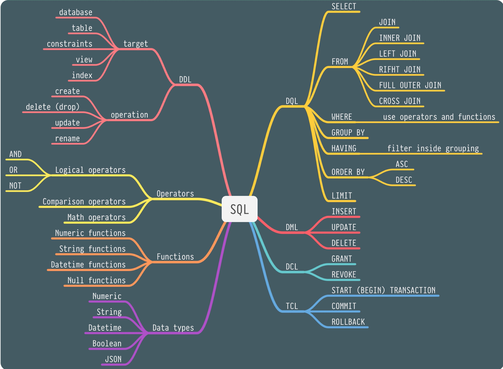
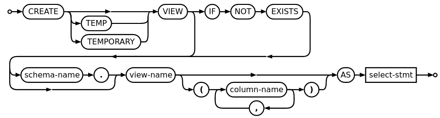

:data-transition-duration: 1000
:skip-help: true
:css: ./style.css ./sql.css
:substep: true
:slide-numbers: true

.. role:: ltr
    :class: ltr

.. role:: rtl
    :class: rtl

----

Database Course
================
Ahmad Yoosofan

SQL

University of Kashan

----

DSL (Data Sub Language)
=======================

What is a DSL?

A DSL is a language or part of a language concerned only with

database query and update and/or database definition.

----

SQL (Structured Query Language)
===============================

SQL is a NOT a programming language, it's a DSL.

Why?

Because there's no standard way to write a full standalone app using just SQL.

reference: `Bill Karwin <https://stackoverflow.com/a/42518549/20435458/>`_

----

SQL's structure and components
==============================

----

SQL Components
==============

* DDL: Data Definition Language
* DML: Data Query Language
* DML: Data Manipluation Language
* DCL: Data Control Language
* TCL: Transaction Control Language

----

Create Table
============
DDL: create table
-----------------

.. code:: sql

  create table s (
    sn      char(10) primary key,
    sname   char(30),
    status  int  default 0,
    city    char(20)
  );

----

Tools
========
Online
-----------

#. https://sql.js.org/examples/GUI/
#. https://sql.js.org/#/
#. https://www.sqlitetutorial.net/
#. https://sqliteonline.com/
#. https://extendsclass.com/sqlite-browser.html
#. https://inloop.github.io/sqlite-viewer/
#. https://github.com/inloop/sqlite-viewer
#. https://github.com/sql-js/sql.js
#. https://sql.js.org/#/
#. http://sqlfiddle.com/
#. https://github.com/coleifer/sqlite-web
#. https://sqlitestudio.pl/
#. https://www.onworks.net/programs/sqlite-online?amp=0
#. https://www.heidisql.com/#featurelist
#. https://sqlzoo.net/

Install
--------
* https://sqlitebrowser.org/

----

.. code:: sql

  create table s (
    sn      char(10) primary key,
    sname   char(30),
    status  int  default 0,
    city    char(20)
  );

  create table p (
    pn     char(10) primary key,
    pname  char(30),
    color  char(20),
    weight NUMERIC(9, 2),
    city   char(20)
  );

  create table sp (
    sn    char(10) references s,
    pn    char(10) references p,
    qty   int default 0,
    primary key (sn, pn)
  );

----

Database
===========
SP database includes the following

* s
* p
* sp

Database Schema
-----------------
.. code:: sql

  create database sp;

.. :

  create table classroom
    (building   varchar(15),
     room_number    varchar(7),
     capacity   numeric(4,0),
     primary key (building, room_number)
    );

  create table department
    (dept_name    varchar(20),
     building   varchar(15),
     budget           numeric(12,2) check (budget > 0),
     primary key (dept_name)
    );

  create table course
    (course_id    varchar(8),
     title      varchar(50),
     dept_name    varchar(20),
     credits    numeric(2,0) check (credits > 0),
     primary key (course_id),
     foreign key (dept_name) references department (dept_name)
      on delete set null
    );

  create table instructor
    (ID     varchar(5),
     name     varchar(20) not null,
     dept_name    varchar(20),
     salary     numeric(8,2) check (salary > 29000),
     primary key (ID),
     foreign key (dept_name) references department (dept_name)
      on delete set null
    );

  create table section
    (course_id    varchar(8),
           sec_id     varchar(8),
     semester   varchar(6)
      check (semester in ('Fall', 'Winter', 'Spring', 'Summer')),
     year     numeric(4,0) check (year > 1701 and year < 2100),
     building   varchar(15),
     room_number    varchar(7),
     time_slot_id   varchar(4),
     primary key (course_id, sec_id, semester, year),
     foreign key (course_id) references course (course_id)
      on delete cascade,
     foreign key (building, room_number) references classroom (building, room_number)
      on delete set null
    );

  create table teaches
    (ID     varchar(5),
     course_id    varchar(8),
     sec_id     varchar(8),
     semester   varchar(6),
     year     numeric(4,0),
     primary key (ID, course_id, sec_id, semester, year),
     foreign key (course_id, sec_id, semester, year) references section (course_id, sec_id, semester, year)
      on delete cascade,
     foreign key (ID) references instructor (ID)
      on delete cascade
    );

  create table student
    (ID     varchar(5),
     name     varchar(20) not null,
     dept_name    varchar(20),
     tot_cred   numeric(3,0) check (tot_cred >= 0),
     primary key (ID),
     foreign key (dept_name) references department (dept_name)
      on delete set null
    );

  create table takes
    (ID     varchar(5),

     course_id    varchar(8),
     sec_id     varchar(8),
     semester   varchar(6),
     year     numeric(4,0),
     grade            varchar(2),
     primary key (ID, course_id, sec_id, semester, year),
     foreign key (course_id, sec_id, semester, year) references section (course_id, sec_id, semester, year)
      on delete cascade,
     foreign key (ID) references student (ID)
      on delete cascade
    );

  create table advisor
    (s_ID     varchar(5),
     i_ID     varchar(5),
     primary key (s_ID),
     foreign key (i_ID) references instructor (ID)
      on delete set null,
     foreign key (s_ID) references student (ID)
      on delete cascade
    );

  create table time_slot
    (time_slot_id   varchar(4),
     day      varchar(1),
     start_hr   numeric(2) check (start_hr >= 0 and start_hr < 24),
     start_min    numeric(2) check (start_min >= 0 and start_min < 60),
     end_hr     numeric(2) check (end_hr >= 0 and end_hr < 24),
     end_min    numeric(2) check (end_min >= 0 and end_min < 60),
     primary key (time_slot_id, day, start_hr, start_min)
    );

  create table prereq
    (course_id    varchar(8),
     prereq_id    varchar(8),
     primary key (course_id, prereq_id),
     foreign key (course_id) references course (course_id)
      on delete cascade,
     foreign key (prereq_id) references course (course_id)
    );

  delete from prereq;
  delete from time_slot;
  delete from advisor;
  delete from takes;
  delete from student;
  delete from teaches;
  delete from section;
  delete from instructor;
  delete from course;
  delete from department;
  delete from classroom;
  insert into classroom values ('Packard', '101', '500');
  insert into classroom values ('Painter', '514', '10');
  insert into classroom values ('Taylor', '3128', '70');
  insert into classroom values ('Watson', '100', '30');
  insert into classroom values ('Watson', '120', '50');
  insert into department values ('Biology', 'Watson', '90000');
  insert into department values ('Comp. Sci.', 'Taylor', '100000');
  insert into department values ('Elec. Eng.', 'Taylor', '85000');
  insert into department values ('Finance', 'Painter', '120000');
  insert into department values ('History', 'Painter', '50000');
  insert into department values ('Music', 'Packard', '80000');
  insert into department values ('Physics', 'Watson', '70000');
  insert into course values ('BIO-101', 'Intro. to Biology', 'Biology', '4');
  insert into course values ('BIO-301', 'Genetics', 'Biology', '4');
  insert into course values ('BIO-399', 'Computational Biology', 'Biology', '3');
  insert into course values ('CS-101', 'Intro. to Computer Science', 'Comp. Sci.', '4');
  insert into course values ('CS-190', 'Game Design', 'Comp. Sci.', '4');
  insert into course values ('CS-315', 'Robotics', 'Comp. Sci.', '3');
  insert into course values ('CS-319', 'Image Processing', 'Comp. Sci.', '3');
  insert into course values ('CS-347', 'Database System Concepts', 'Comp. Sci.', '3');
  insert into course values ('EE-181', 'Intro. to Digital Systems', 'Elec. Eng.', '3');
  insert into course values ('FIN-201', 'Investment Banking', 'Finance', '3');
  insert into course values ('HIS-351', 'World History', 'History', '3');
  insert into course values ('MU-199', 'Music Video Production', 'Music', '3');
  insert into course values ('PHY-101', 'Physical Principles', 'Physics', '4');
  insert into instructor values ('10101', 'Srinivasan', 'Comp. Sci.', '65000');
  insert into instructor values ('12121', 'Wu', 'Finance', '90000');
  insert into instructor values ('15151', 'Mozart', 'Music', '40000');
  insert into instructor values ('22222', 'Einstein', 'Physics', '95000');
  insert into instructor values ('32343', 'El Said', 'History', '60000');
  insert into instructor values ('33456', 'Gold', 'Physics', '87000');
  insert into instructor values ('45565', 'Katz', 'Comp. Sci.', '75000');
  insert into instructor values ('58583', 'Califieri', 'History', '62000');
  insert into instructor values ('76543', 'Singh', 'Finance', '80000');
  insert into instructor values ('76766', 'Crick', 'Biology', '72000');
  insert into instructor values ('83821', 'Brandt', 'Comp. Sci.', '92000');
  insert into instructor values ('98345', 'Kim', 'Elec. Eng.', '80000');
  insert into section values ('BIO-101', '1', 'Summer', '2017', 'Painter', '514', 'B');
  insert into section values ('BIO-301', '1', 'Summer', '2018', 'Painter', '514', 'A');
  insert into section values ('CS-101', '1', 'Fall', '2017', 'Packard', '101', 'H');
  insert into section values ('CS-101', '1', 'Spring', '2018', 'Packard', '101', 'F');
  insert into section values ('CS-190', '1', 'Spring', '2017', 'Taylor', '3128', 'E');
  insert into section values ('CS-190', '2', 'Spring', '2017', 'Taylor', '3128', 'A');
  insert into section values ('CS-315', '1', 'Spring', '2018', 'Watson', '120', 'D');
  insert into section values ('CS-319', '1', 'Spring', '2018', 'Watson', '100', 'B');
  insert into section values ('CS-319', '2', 'Spring', '2018', 'Taylor', '3128', 'C');
  insert into section values ('CS-347', '1', 'Fall', '2017', 'Taylor', '3128', 'A');
  insert into section values ('EE-181', '1', 'Spring', '2017', 'Taylor', '3128', 'C');
  insert into section values ('FIN-201', '1', 'Spring', '2018', 'Packard', '101', 'B');
  insert into section values ('HIS-351', '1', 'Spring', '2018', 'Painter', '514', 'C');
  insert into section values ('MU-199', '1', 'Spring', '2018', 'Packard', '101', 'D');
  insert into section values ('PHY-101', '1', 'Fall', '2017', 'Watson', '100', 'A');
  insert into teaches values ('10101', 'CS-101', '1', 'Fall', '2017');
  insert into teaches values ('10101', 'CS-315', '1', 'Spring', '2018');
  insert into teaches values ('10101', 'CS-347', '1', 'Fall', '2017');
  insert into teaches values ('12121', 'FIN-201', '1', 'Spring', '2018');
  insert into teaches values ('15151', 'MU-199', '1', 'Spring', '2018');
  insert into teaches values ('22222', 'PHY-101', '1', 'Fall', '2017');
  insert into teaches values ('32343', 'HIS-351', '1', 'Spring', '2018');
  insert into teaches values ('45565', 'CS-101', '1', 'Spring', '2018');
  insert into teaches values ('45565', 'CS-319', '1', 'Spring', '2018');
  insert into teaches values ('76766', 'BIO-101', '1', 'Summer', '2017');
  insert into teaches values ('76766', 'BIO-301', '1', 'Summer', '2018');
  insert into teaches values ('83821', 'CS-190', '1', 'Spring', '2017');
  insert into teaches values ('83821', 'CS-190', '2', 'Spring', '2017');
  insert into teaches values ('83821', 'CS-319', '2', 'Spring', '2018');
  insert into teaches values ('98345', 'EE-181', '1', 'Spring', '2017');
  insert into student values ('00128', 'Zhang', 'Comp. Sci.', '102');
  insert into student values ('12345', 'Shankar', 'Comp. Sci.', '32');
  insert into student values ('19991', 'Brandt', 'History', '80');
  insert into student values ('23121', 'Chavez', 'Finance', '110');
  insert into student values ('44553', 'Peltier', 'Physics', '56');
  insert into student values ('45678', 'Levy', 'Physics', '46');
  insert into student values ('54321', 'Williams', 'Comp. Sci.', '54');
  insert into student values ('55739', 'Sanchez', 'Music', '38');
  insert into student values ('70557', 'Snow', 'Physics', '0');
  insert into student values ('76543', 'Brown', 'Comp. Sci.', '58');
  insert into student values ('76653', 'Aoi', 'Elec. Eng.', '60');
  insert into student values ('98765', 'Bourikas', 'Elec. Eng.', '98');
  insert into student values ('98988', 'Tanaka', 'Biology', '120');
  insert into takes values ('00128', 'CS-101', '1', 'Fall', '2017', 'A');
  insert into takes values ('00128', 'CS-347', '1', 'Fall', '2017', 'A-');
  insert into takes values ('12345', 'CS-101', '1', 'Fall', '2017', 'C');
  insert into takes values ('12345', 'CS-190', '2', 'Spring', '2017', 'A');
  insert into takes values ('12345', 'CS-315', '1', 'Spring', '2018', 'A');
  insert into takes values ('12345', 'CS-347', '1', 'Fall', '2017', 'A');
  insert into takes values ('19991', 'HIS-351', '1', 'Spring', '2018', 'B');
  insert into takes values ('23121', 'FIN-201', '1', 'Spring', '2018', 'C+');
  insert into takes values ('44553', 'PHY-101', '1', 'Fall', '2017', 'B-');
  insert into takes values ('45678', 'CS-101', '1', 'Fall', '2017', 'F');
  insert into takes values ('45678', 'CS-101', '1', 'Spring', '2018', 'B+');
  insert into takes values ('45678', 'CS-319', '1', 'Spring', '2018', 'B');
  insert into takes values ('54321', 'CS-101', '1', 'Fall', '2017', 'A-');
  insert into takes values ('54321', 'CS-190', '2', 'Spring', '2017', 'B+');
  insert into takes values ('55739', 'MU-199', '1', 'Spring', '2018', 'A-');
  insert into takes values ('76543', 'CS-101', '1', 'Fall', '2017', 'A');
  insert into takes values ('76543', 'CS-319', '2', 'Spring', '2018', 'A');
  insert into takes values ('76653', 'EE-181', '1', 'Spring', '2017', 'C');
  insert into takes values ('98765', 'CS-101', '1', 'Fall', '2017', 'C-');
  insert into takes values ('98765', 'CS-315', '1', 'Spring', '2018', 'B');
  insert into takes values ('98988', 'BIO-101', '1', 'Summer', '2017', 'A');
  insert into takes values ('98988', 'BIO-301', '1', 'Summer', '2018', null);
  insert into advisor values ('00128', '45565');
  insert into advisor values ('12345', '10101');
  insert into advisor values ('23121', '76543');
  insert into advisor values ('44553', '22222');
  insert into advisor values ('45678', '22222');
  insert into advisor values ('76543', '45565');
  insert into advisor values ('76653', '98345');
  insert into advisor values ('98765', '98345');
  insert into advisor values ('98988', '76766');
  insert into time_slot values ('A', 'M', '8', '0', '8', '50');
  insert into time_slot values ('A', 'W', '8', '0', '8', '50');
  insert into time_slot values ('A', 'F', '8', '0', '8', '50');
  insert into time_slot values ('B', 'M', '9', '0', '9', '50');
  insert into time_slot values ('B', 'W', '9', '0', '9', '50');
  insert into time_slot values ('B', 'F', '9', '0', '9', '50');
  insert into time_slot values ('C', 'M', '11', '0', '11', '50');
  insert into time_slot values ('C', 'W', '11', '0', '11', '50');
  insert into time_slot values ('C', 'F', '11', '0', '11', '50');
  insert into time_slot values ('D', 'M', '13', '0', '13', '50');
  insert into time_slot values ('D', 'W', '13', '0', '13', '50');
  insert into time_slot values ('D', 'F', '13', '0', '13', '50');
  insert into time_slot values ('E', 'T', '10', '30', '11', '45 ');
  insert into time_slot values ('E', 'R', '10', '30', '11', '45 ');
  insert into time_slot values ('F', 'T', '14', '30', '15', '45 ');
  insert into time_slot values ('F', 'R', '14', '30', '15', '45 ');
  insert into time_slot values ('G', 'M', '16', '0', '16', '50');
  insert into time_slot values ('G', 'W', '16', '0', '16', '50');
  insert into time_slot values ('G', 'F', '16', '0', '16', '50');
  insert into time_slot values ('H', 'W', '10', '0', '12', '30');
  insert into prereq values ('BIO-301', 'BIO-101');
  insert into prereq values ('BIO-399', 'BIO-101');
  insert into prereq values ('CS-190', 'CS-101');
  insert into prereq values ('CS-315', 'CS-101');
  insert into prereq values ('CS-319', 'CS-101');
  insert into prereq values ('CS-347', 'CS-101');
  insert into prereq values ('EE-181', 'PHY-101');

----

Insert
=========
DML: insert
-----------

.. code:: sql

  insert into s(sn, sname,  status, city)
    values('s1', 'Smith', 20, 'London')
  ;
  insert into s(sn, sname,  status, city)
    values('s2', 'Jones', 10, 'Paris' )
  ;
  insert into s(sn, sname,  status, city)
    values('s3', 'Blake', 30, 'Paris' )
  ;
  insert into s(sn, sname,  "status", city)
    values('s4', 'Clark', 20, 'London')
  ;
  insert into s(sname, status, city, sn)
    values('Adams', 30, 'Athens', 's5')
  ;
  insert into s
    values('s6', 'Ali', 40, 'کاشان')
  ;

----

P
====
.. code:: sql

  insert into p(pn, pname, color, weight, city)
    values('p1','Nut'  ,'Red'  ,12.0,'London')
  ;
  insert into p(pn, pname, color, weight, city)
    values
      ('p2', 'Bolt' , 'Green', 17.0, 'Paris' ),
      ('p3', 'Screw', 'Blue' , 17.0, 'Oslo'  ),
      ('p4', 'Screw', 'Red'  , 14.0, 'London'),
      ('p5', 'Cam'  , 'Blue' , 12.0, 'Paris' ),
      ('p6', 'Cog'  , 'Red'  , 19.0, 'London')
  ;

  insert into p(pn, pname, color, city)
    values('p7', 'Nut', 'Red', 'London')
  ;
  insert into p(pn, pname, color, city)
    values('p8', 'Bolt', 'Green', 'Paris')
  ;

----

SP
====
.. code:: sql

  insert into sp(sn, pn, qty)
    values
    ('s1', 'p1', 300),
    ('s1', 'p2', 200),
    ('s1', 'p3', 400),
    ('s1', 'p4', 200),
    ('s1', 'p5', 100),
    ('s1', 'p6', 100),
    ('s2', 'p1', 300),
    ('s2', 'p2', 400),
    ('s3', 'p2', 200),
    ('s4', 'p2', 200),
    ('s4', 'p4', 300),
    ('s4', 'p5', 400),
    ('s6', 'p2', 350)
  ;

.. :

  insert into p(pn,pname,color,city)
    values('P7', 'Nut', 'Red', 'London')
  ;
  insert into p(pn, pname, color, city)
    values('P8', 'Bolt', 'Green', 'Paris')
  ;

----

:class: t2c

.. class:: rtl-h1

  نام قطعه‌ها را بیابید.

.. container::

  .. code:: sql

    select pname
    from p
    ;

  .. code:: sql

    p{pname};

..  csv-table::
  :header-rows: 1
  :class: smallerelementwithfullborder

  pname
  Nut
  Bolt
  Screw
  Screw
  Cam
  Cog
  Nut
  Bolt

----

:class: t2c

.. class:: rtl-h1

  نام قطعه‌ها و وزن آنها را بیابید.

.. container::

  .. code:: sql

    select pname, weight
    from p
    ;

  .. code:: sql

    p{pname, weight} ;

..  csv-table::
  :header-rows: 1
  :class: smallerelementwithfullborder

  pname,  weight
  Nut,    12
  Bolt,   17
  Screw,  17
  Screw,  14
  Cam,    12
  Cog,    19
  Nut,    
  Bolt,   

.. :

  Nut,  **NULL**
  Bolt, **NULL**

----

.. class:: rtl-h1

  نام قعطه‌ها و وزن آنها را به گرم بیابید.

.. code:: sql

  select pname, weight * 1000
  from p
  ;

..  csv-table::
  :header-rows: 1
  :class: smallerelementwithfullborder

  pname,  weight * 1000
  Nut,    12000
  Bolt,   17000
  Screw,  17000
  Screw,  14000
  Cam,    12000
  Cog,    19000
  Nut,    
  Bolt,   

----

as (rename)
==============
.. code:: sql

  select pname, weight * 1000 as gweight
  from p
  ;

..  csv-table::
  :header-rows: 1
  :class: smallerelementwithfullborder

  pname,  gweight
  Nut,    12000
  Bolt,   17000
  Screw,  17000
  Screw,  14000
  Cam,    12000
  Cog,    19000
  Nut,    
  Bolt,   

----

:class: t2c

.. class:: rtl-h1

  نام عرضه‌کنندگان شهر کاشان را بیابید.

.. container::

  .. code:: sql

    select sname
    from s
    where city = 'کاشان'
    ;

  .. code:: sql
    :class: substep

    -- (s where city = 'کاشان') {pname}

  .. code:: sql
    :class: substep

    select sname
    from s
    where city = 'Paris'
    ;

..  csv-table::
  :header-rows: 1
  :class: smallerelementwithfullborder substep

  sname
  Jones
  Blake

----

:class: t2c

.. class:: rtl-h1

  شمارهٔ قطعه‌های عرضه شده را بیابید.

.. code:: sql
  :class: substep

  select pn
  from sp
  ;

..  csv-table::
  :header-rows: 1
  :class: smallerelementwithfullborder substep

  pn
  P1
  P2
  P3
  P4
  P5
  P6
  P1
  P2
  P2
  P2
  P4
  P5
  P2

----

:class: t2c

.. class:: rtl-h1

  نام قطعه‌های عرضه شده را بیابید.

.. container::

  .. code:: sql
    :class: substep

    select pname
    from p, sp
    where p.pn = sp.pn
    ;

  .. code:: sql
    :class: substep

    (
      (
        (
          p rename pn as ppn
        )
        times sp
      ) where ppn = pn
    ) {pname}

..  csv-table::
  :header-rows: 1
  :class: smallerelementwithfullborder substep

  pname
  Nut
  Bolt
  Screw
  Screw
  Cam
  Cog
  Nut
  Bolt
  Bolt
  Bolt
  Screw
  Cam
  Bolt

----

:class: t2c

join
=========
.. class:: rtl-h1

  نام قطعه‌های عرضه شده را بیابید.

.. code:: sql

  select pname
  from p natural join sp
  ;

.. code:: sql
  :class: substep

  (p join sp) {pname}

.. code:: sql
  :class: substep

  select pname
  from p join sp using(pn)
  ;

.. code:: sql
  :class: substep

  select pname
  from p join sp on p.pn=sp.pn
  ;

----

:class: t2c

.. class:: rtl-h1

  نام قطعه‌هایی را بیابید که در شهر آن قطعه‌ها عرضه کننده‌ای وجود داشته باشد

.. container::

  .. code:: sql

    select pname
    from p join s using(city)
    ;

  .. code:: sql

    select pname
    from p natural join s
    ;

..  csv-table::
  :header-rows: 1
  :class: smallerelementwithfullborder substep

  pname
  Nut
  Nut
  Bolt
  Bolt
  Screw
  Screw
  Cam
  Cam
  Cog
  Cog
  Nut
  Nut
  Bolt
  Bolt

----

:class: t2c

.. class:: rtl-h1

  اطلاعات عرضه‌کنندگان را بیابید

.. code:: sql

  select *
  from s
  ;

..  csv-table::
  :header-rows: 1
  :class: smallerelementwithfullborder substep

  sn,  sname,  status,  city
  s1,  Smith,  20,      London
  s2,  Jones,  10,      Paris
  s3,  Blake,  30,      Paris
  s4,  Clark,  20,      London
  s5,  Adams,  30,      Athens
  s6,  Ali,    40,      کاشان

----

:class: t2c

.. class:: rtl-h1

  اطلاعات عرضه‌کنندگان و قطعه‌هایی را که عرضه کرده‌اند، بیابید.

.. code:: sql
  :class: substep

  select *
  from (p join sp using(pn))
    join s using(sn)
  ;

..  csv-table::
  :header-rows: 1
  :class: smallerelementwithfullborder substep

  pn,  pname,  color,  weight,  city,   sn,  qty,  sname,  status,  city
  P1,  Nut,    Red,    12,      London, s1,  300,  Smith,  20,      London
  P2,  Bolt,   Green,  17,      Paris,  s1,  200,  Smith,  20,      London
  P3,  Screw,  Blue,   17,      Oslo,   s1,  400,  Smith,  20,      London
  P4,  Screw,  Red,    14,      London, s1,  200,  Smith,  20,      London
  P5,  Cam,    Blue,   12,      Paris,  s1,  100,  Smith,  20,      London
  P6,  Cog,    Red,    19,      London, s1,  100,  Smith,  20,      London
  P1,  Nut,    Red,    12,      London, s2,  300,  Jones,  10,      Paris
  P2,  Bolt,   Green,  17,      Paris,  s2,  400,  Jones,  10,      Paris
  P2,  Bolt,   Green,  17,      Paris,  s3,  200,  Blake,  30,      Paris
  P2,  Bolt,   Green,  17,      Paris,  s4,  200,  Clark,  20,      London
  P4,  Screw,  Red,    14,      London, s4,  300,  Clark,  20,      London
  P5,  Cam,    Blue,   12,      Paris,  s4,  400,  Clark,  20,      London
  P2,  Bolt,   Green,  17,      Paris,  s6,  350,  Ali,    40,      کاشان

----

:class: t2c

.. class:: rtl-h1

  نام قطعاتی را بیابید که عرضه‌کننده‌ای از شهر کاشان آنها را عرضه کرده باشد.

.. container::

  .. code:: sql
    :class: substep

    select pname
    from (p natural join sp)
      join s on s.sn=sp.sn
    where s.city = 'کاشان'
    ;

  .. code:: sql
    :class: substep

    select pname
    from (p natural join sp)
      join s using(sn)
    where s.city = 'کاشان'
    ;

..  csv-table::
  :header-rows: 1
  :class: smallerelementwithfullborder substep

  pname
  Bolt

----

:class: t2c

..  class:: rtl-h1

  نام قطعات را بیابید و نام ستون آن را name بگذارید

.. code:: sql
  :class: substep

  select pname as name
  from p
  ;

..  csv-table::
  :header-rows: 1
  :class: smallerelementwithfullborder substep

  name
  Nut
  Bolt
  Screw
  Screw
  Cam
  Cog
  Nut
  Bolt

----

:class: t2c

.. class:: rtl-h1

  شماره قطعه‌های عرضه شده را بدون شمارهٔ تکراری بیابید

.. code:: sql

  select distinct pn
  from sp
  ;

..  csv-table::
  :header-rows: 1
  :class: smallerelementwithfullborder substep

  pn
  P1
  P2
  P3
  P4
  P5
  P6

----

:class: t2c

.. class:: rtl-h1

  نام قطعاتی را بیابید که وزن آنها بیشتر از ۲۰ است

.. code:: sql
  :class: substep

  select pname
  from p
  where weight > 20
  ;

..  csv-table::
  :header-rows: 1
  :class: smallerelementwithfullborder substep

  pname
  ""

----

:class: t2c

.. class:: rtl-h1

  نام شهرهای عرضه‌کنندگان را بدون تکرار بیابید

.. code:: sql
  :class: substep

  select distinct city
  from s
  ;

..  csv-table::
  :header-rows: 1
  :class: smallerelementwithfullborder substep

  city
  London
  Paris
  Athens
  کاشان

----

:class: t2c

Use Another name for a Table in Query
=========================================
.. container::

  .. code:: sql

    create table t (
      a int primary key,
      name char(20)
    );

    insert into t values (1, 'a'),(2, 'b');

  .. code:: sql

    select *
    from t, t as M;

..  csv-table::
  :header-rows: 1
  :class: smallerelementwithfullborder substep

  a,  name, a,  name
  1,  a,  1,  a
  1,  a,  2,  b
  2,  b,  1,  a
  2,  b,  2,  b

.. code:: sql
  :class: substep

  select *
  from t, t as M
  where t.a < M.a;

..  csv-table::
  :header-rows: 1
  :class: smallerelementwithfullborder substep

  a,  name, a,  name
  1,  a,  2,  b

.. code:: sql
  :class: substep

  select *
  from t join t as M
    on t.a < M.a;

..  csv-table::
  :header-rows: 1
  :class: smallerelementwithfullborder substep

  a,  name, a,  name
  1,  a,  2,  b

----

:class: t2c

Use Another name for a Table in Query
=========================================
.. class:: substep rtl-h2

    نام قطعاتی را بیابید که وزن آنها دست کم از وزن یک قطعهٔ دیگر بیشتر باشد

    نام همهٔ قطعات را بیابید به جز قطعه‌ یا قطعه‌هایی که کمترین وزن را دارند

.. container::

  .. code:: sql

    select T.pname
    from p as T
    ;

  .. code:: sql
    :class: substep

    select T.pname
    from p as T, p
    where p.weight < T.weight
    ;

  .. code:: sql
    :class: substep

    select T.pname
    from p as T join p on
      p.weight < T.weight
    ;

..  csv-table::
  :header-rows: 1
  :class: smallerelementwithfullborder substep

  pname
  Bolt
  Bolt
  Bolt
  Screw
  Screw
  Screw
  Screw
  Screw
  Cog
  Cog
  Cog
  Cog
  Cog

----

:class: t2c

.. class:: rtl-h1

  مانند مسألهٔ پیش با این تفاوت که نام‌های تکراری در  پاسخ نباشد

.. code:: sql
  :class: substep

  select distinct T.pname
  from p as T, p
  where p.weight < T.weight
  ;

.. class:: substep rtl-h2

    راه حل دیگر

.. code:: sql
  :class: substep

  select distinct T.pname
  from p as T join p on
    p.weight < T.weight
  ;

..  csv-table::
  :header-rows: 1
  :class: smallerelementwithfullborder substep

  pname
  Bolt
  Screw
  Cog

----

:class: t2c

.. class:: rtl-h1

  نام قطعاتی را بیابید که وزن آنها دست کم از وزن یک قطعهٔ دیگر کمتر باشد

.. code:: sql
  :class: substep

  select distinct T.pname
  from p as T join p on
    p.weight > T.weight
  ;

..  csv-table::
  :header-rows: 1
  :class: smallerelementwithfullborder substep

  pname
  Nut
  Bolt
  Screw
  Cam

----

:class: t2c

.. class:: rtl-h1

  نام قطعه‌های عرضه شده را همراه با نام عرضه‌کنندگان‌شان بیابید

.. container::

  .. code:: sql
    :class: substep

    select pname, sname
    from s, sp, p
    where s.sn = sp.sn and
      p.pn = sp.pn
    ;

  .. code:: sql
    :class: substep

    select pname, sname
    from s natural join sp
      join p using(pn)
    ;

..  csv-table::
  :header-rows: 1
  :class: smallerelementwithfullborder substep

  pname,  sname
  Nut,  Smith
  Bolt, Smith
  Screw,  Smith
  Screw,  Smith
  Cam,  Smith
  Cog,  Smith
  Nut,  Jones
  Bolt, Jones
  Bolt, Blake
  Bolt, Clark
  Screw,  Clark
  Cam,  Clark
  Bolt, Ali

----

:class: t2c

.. class:: rtl-h1

  نام قطعاتی را بیابید که وزن‌شان دست کم از وزن یک قطعهٔ با رنگ قرمز کمتر باشد

.. container::

  .. code:: sql
    :class: substep

    select distinct T.pname
    from p as T, p
    where p.weight > T.weight
      and p.color='Red'
    ;

  .. code:: sql
    :class: substep

    select distinct T.pname
    from p as T join p on
      p.weight > T.weight
    where p.color='Red'
    ;

..  csv-table::
  :header-rows: 1
  :class: smallerelementwithfullborder substep

  pname
  Nut
  Bolt
  Screw
  Cam

.. container::

  .. class:: rtl-h3 substep

      راه حل نادرست

  .. code:: sql
      :class: substep

      select distinct p.pname
      from p as p1 join p on
        p1.weight > p.weight and
        p1.color = 'Red'
      ;

..  csv-table::
  :header-rows: 1
  :class: smallerelementwithfullborder substep

  pname
  Cog
  Screw

----

:class: t2c

.. class:: rtl-h1

    نام قطعاتی را بیابید که نام شهر آنها با L آغاز شده باشد

.. code:: sql

  select pname
  from p
  where city like 'L%'
  ;

..  csv-table::
  :header-rows: 1
  :class: smallerelementwithfullborder substep

  pname
  Nut
  Screw
  Cog
  Nut

.. code:: sql

  select *
  from p
  ;

..  csv-table::
  :header-rows: 1
  :class: smallerelementwithfullborder substep

  pn, pname,  color,  weight, city
  P1, Nut,  Red,  12, London
  P2, Bolt, Green,  17, Paris
  P3, Screw,  Blue, 17, Oslo
  P4, Screw,  Red,  14, London
  P5, Cam,  Blue, 12, Paris
  P6, Cog,  Red,  19, London
  P7, Nut,  Red,  ,  London
  P8, Bolt, Green, ,   Paris

----

:class: t2c

.. class:: rtl-h1

    نام شهرهای قطعاتی را بیابید که با P آغاز شده باشد

.. code:: sql
  :class: substep

  select pname, city
  from p
  where city like 'P%'
  ;

..  csv-table::
  :header-rows: 1
  :class: smallerelementwithfullborder substep

  pname, city
  Bolt, Paris
  Cam, Paris
  Bolt, Paris

----

.. class:: rtl-h1

    نام قطعاتی را بیابید که نام شهر آنها چهارحرفی باشد  با S آغاز شده باشد

.. code:: sql

  select pname
  from p
  where city like 'S___'
  ;

..  csv-table::
  :header-rows: 1
  :class: smallerelementwithfullborder substep

  pname
  Screw

----

.. class:: rtl-h1

    نام شهر قطعاتی را بیابید که درون نام شهر آنها رشتهٔ is وجود داشته باشد

.. code:: sql
  :class: substep

  select city
  from p
  where city like '%is%'
  ;

..  csv-table::
  :header-rows: 1
  :class: smallerelementwithfullborder substep

  city
  Paris

----

.. class:: rtl-h1

  نام قطعاتی را بیابید که دست کم سه‌حرفی باشند و با رشتهٔ زیر آغاز شده باشند

`bn_`

.. code:: sql
  :class: substep

  select pname, city
  from p
  where city like "bn\_%"
  ;

----

escape
========
.. code:: sql
  :class: substep

  select pname
  from p
  where city like 'P\_%' escape '\'
  ;

.. code:: sql
  :class: substep

  select pname
  from p
  where city like 'P!_%' escape '!'
  ;

.. code:: sql
  :class: substep

  select pname
  from p
  where city like 'P#_%' escape '#'
  ;

  select pname
  from p
  where city like "an\_%" escape "\"
  ; -- "

----

:class: t2c

.. class:: rtl-h1

نام قطعاتی را بیابید که نام شهر آنها با an پایان نیافته باشد

.. code:: sql

  select pname
  from p
  where city not like "%an"
  ;

..  csv-table::
  :header-rows: 1
  :class: smallerelementwithfullborder substep

    pname
    Nut
    Bolt
    Screw
    Screw
    Cam
    Cog
    Nut
    Bolt

----

.. class:: rtl-h1

نام قطعاتی را بیابید که در شهر پاریس باشند و پاسخ بر پایهٔ نام قطعه از کوچک به بزرگ مرتب شده باشد.

.. code:: sql
  :class: substep

  select pname
  from p
  where city='Paris'
  order by pname
  ;

.. class:: rtl-h2 substep

نام و وزن قطعاتی را بیابید که در شهر پاریس هستند و پاسخ بر پایهٔ وزن قطعه از کوچک به بزرگ مرتب شده باشد

.. code:: sql
  :class: substep

  select pname, weight
  from p
  where city='Paris'
  order by weight
  ;

.. code:: sql
  :class: substep

  select pname, weight
  from p
  where city='Paris'
  order by weight asc
  ;

----

:class: t2c

.. class:: rtl-h1

  نام و وزن قطعاتی را بیابید که در شهر پاریس هستند و پاسخ بر پایهٔ وزن قطعه از بزرگ به کوچک مرتب شده باشد

.. code:: sql
  :class: substep

  select pname, weight
  from p
  where city='Paris'
  order by weight desc
  ;

..  csv-table::
  :header-rows: 1
  :class: smallerelementwithfullborder substep

    pname,  weight
    Bolt,   17
    Cam,    12
    Bolt,   

----

:class: t2c

.. class:: rtl-h1

  نام و وزن قطعاتی را بیابید که وزن‌شان بین ۱۲ و ۱۴ باشد

.. container::

    .. code:: sql
      :class: substep

      select pname, weight
      from p
      where weight >= 12 and weight <= 14
      ;

    .. code:: sql
      :class: substep

      select pname, weight
      from p
      where weight between 12 and 14;

.. csv-table::
  :header-rows: 1
  :class: smallerelementwithfullborder, substep

  pname, weight
  Nut,12
  Screw,14
  Cam,12

----

:class: t2c

.. class:: rtl-h1

  نام و وزن قطعاتی را بیابید که وزن‌شان بین ۱۲ و ۱۴ نباشد

.. container::

    .. code:: sql
      :class: substep

      select pname, weight
      from p
      where not (weight>=12 and weight<=14)
      ;

    .. code:: sql
      :class: substep

      select pname, weight
      from p
      where weight not between 12 and 14
      ;

.. csv-table::
  :header-rows: 1
  :class: smallerelementwithfullborder, substep

  pname, weight
  Bolt,17
  Screw,17
  Cog,19

----

:class: t2c

Record Comparison
==================================
.. class:: rtl-h1

  نام قطعاتی را بیاید که عرضه کننده‌ای در شهر آن قطعه‌ها آنها را عرضه کرده باشد

.. container::

    .. code:: sql
      :class: substep

      select pname
      from p, s, sp
      where (p.city, p.pn) = (s.city, sp.pn)
        and s.sn = sp.sn
      ;

    .. code:: sql
      :class: substep

      select pname
      from p, s, sp
      where p.city = s.city and
        p.pn = sp.pn and
        s.sn = sp.sn
      ;

    .. code:: sql
      :class: substep

      select pname
      from p join s on
        p.city = s.city
        join sp on
        (p.pn, s.sn) = (sp.pn, sp.sn)
      ;

    .. code:: sql
      :class: substep

      select pname
      from p  natural join sp  natural join s
      ;

.. csv-table::
  :header-rows: 1
  :class: smallerelementwithfullborder, substep

    pname
    Nut
    Screw
    Cog
    Bolt
    Bolt
    Screw

----

:class: t2c

Union
========
.. container::

  .. code:: sql
    :class: substep

      select pname
      from p
      where city='Paris'
    union
      select pname
      from p
      where weight>12
    ;

  .. code:: sql
    :class: substep

    select distinct pname
    from p
    where city = 'Paris' or
      weight > 12
    ;

  .. code:: sql
    :class: substep

      select pname
      from p
      where city = 'kashan'
    union all
      select pname
      from p
      where weight>10
      ;

.. container::

  .. csv-table::
    :header-rows: 1
    :class: smallerelementwithfullborder, substep

    pname
    Bolt
    Cam
    Cog
    Screw

  |

  .. csv-table::
    :header-rows: 1
    :class: smallerelementwithfullborder, substep

    pname
    Nut
    Bolt
    Screw
    Screw
    Cam
    Cog

----

:class: t2c

Style of Writing
=============================
.. code:: sql
  :class: substep

    select pname
    from p
    where city='Paris'
  union
    select pname
    from p
    where weight>12
  ;

.. code:: sql
  :class: substep

  select pname
  from p
  where city='kashan'
  union
  select pname
  from p
  where weight>10
  ;

.. code:: sql
  :class: substep

  select pname
  from p
  where city='kashan'

  union

  select pname
  from p
  where weight>10
  ;

----

:class: t2c

Intersect
===============
.. container::

  .. code:: sql
    :class: substep

      select pname
      from p
      where city='Paris'
    intersect
      select pname
      from p
      where weight>10
    ;

  .. code:: sql
    :class: substep

    select distinct pname
    from p
    where city='Paris' and
      weight>10
    ;

  .. code:: sql
    :class: substep

      select pname
      from p
      where city = 'Paris'
    intersect all
      select pname
      from p
      where weight > 10
    ;

  .. code:: sql
    :class: substep

    select pname
    from p
    where city='Paris' and
      weight>10
    ;

.. container::

  .. csv-table::
    :header-rows: 1
    :class: smallerelementwithfullborder, substep

    pname
    Bolt
    Cam

  .

  .. csv-table::
    :header-rows: 1
    :class: smallerelementwithfullborder, substep

    pname
    Bolt
    Cam

----

:class: t2c

Except
==========
.. container::

  .. code:: sql
    :class: substep

      select pname
      from p
      where city = 'Paris'
    except
      select pname
      from p
      where weight > 14
    ;

  .. code:: sql
    :class: substep

    select distinct pname
    from p
    where city='Paris' and
      weight<=14
    ;

  .. code:: sql
    :class: substep

    select pname
      from p
      where city='Paris'
    except all
      select pname
      from p
      where weight>10
    ;

  .. code:: sql
    :class: substep

    select pname
    from p
    where city='Paris' and
      weight<=14
    ;

.. container::

  .. csv-table::
    :header-rows: 1
    :class: smallerelementwithfullborder, substep

    pname
    Cam

  .

  .. csv-table::
    :header-rows: 1
    :class: smallerelementwithfullborder, substep

    pname
    Cam

----

:class: t2c

.. class:: rtl-h1

  نام شهرهای قطعاتی را بیابید که در آنها عرضه‌کننده‌ای وجود ندارد

.. code:: sql
  :class: substep

  select city
  from p
  except
  select city
  from s
  ;

.. csv-table::
  :header-rows: 1
  :class: smallerelementwithfullborder, substep

  city
  Oslo

----

:class: t2c

.. class:: rtl-h1

  شمارهٔ قطعات و شمارهٔ عرضه‌کنندگانی را بیابید که قطعات یاد شده را آن عرضه کنندگان عرضه نکرده باشند

.. code:: sql
  :class: substep

  select pn, sn
  from p, s
  except
  select pn, sn
  from sp
  ;

.. list-table::

    * - .. csv-table::
          :header-rows: 1
          :class: smallerelementwithfullborder

          pn, sn
          P1, s3
          P1, s4
          P1, s5
          P1, s6
          P2, s5
          P3, s2
          P3, s3
          P3, s4
          P3, s5
          P3, s6
          P4, s2

      - ``.``

      - .. csv-table::
          :header-rows: 1
          :class: smallerelementwithfullborder

          pn, sn
          P4, s3
          P4, s5
          P4, s6
          P5, s2
          P5, s3
          P5, s5
          P5, s6
          P6, s2
          P6, s3
          P6, s4
          P6, s5
          P6, s6
          P7, s1

      - ``.``

      - .. csv-table::
          :header-rows: 1
          :class: smallerelementwithfullborder

          pn, sn
          P7, s2
          P7, s3
          P7, s4
          P7, s5
          P7, s6
          P8, s1
          P8, s2
          P8, s3
          P8, s4
          P8, s5
          P8, s6

----

:class: t2c

.. class:: rtl-h1

  نام قطعات و نام عرضه‌کنندگانی را بیابید که قطعات یاد شده را آن عرضه کنندگان عرضه نکرده باشند

.. container::

  .. code:: sql
    :class: substep

    select pname, sname  -- نادرست
    from p, s
    except
    select pname, sname
    from p natural join sp
      natural join s;

  .. code:: sql
    :class: substep

    select pname, sname from p, s
    except
    select pname, sname
    from s natural join sp
      join p using(pn);

  .. code:: sql
    :class: substep

    select sname , pname
    from (
      select pn, sn from p, s
      except
      select pn, sn from sp
      ) join p using (pn)
      join s using (sn);

.. list-table::

  * - .. csv-table::
        :header-rows: 1
        :class: smallerelementwithfullborder

        pname,  sname
        Bolt, Adams
        Cam,  Adams
        Cam,  Ali
        Cam,  Blake
        Cam,  Jones
        Cog,  Adams
        Cog,  Ali
        Cog,  Blake

    - ``.``

    - .. csv-table::
        :header-rows: 1
        :class: smallerelementwithfullborder

        pname,  sname
        Cog,  Clark
        Cog,  Jones
        Nut,  Adams
        Nut,  Ali
        Nut,  Blake
        Nut,  Clark
        Screw,  Adams
        Screw,  Ali
        Screw,  Blake
        Screw,  Jones

----

:class: t2c

.. class:: rtl-h1

  زوج نام عرضه‌کنندگانی را بیابید که در یک شهر باشند

.. code:: sql
  :class: substep

  -- (1) نادرست
  select s.sname, T.sname
  from s, s as T
  where s.city = T.city
  ;

.. code:: sql
  :class: substep

  -- (2) نادرست
  select s.sname, T.sname
  from s, s as T
  where s.city = T.city and
    s.sn != T.sn
  ;

.. code:: sql
  :class: substep

  -- (3)
  select s.sname, T.sname
  from s, s as T
  where s.city = T.city and
    s.sn < T.sn
  ;

.. code:: sql
  :class: substep

  -- (4)
  select s.sname, T.sname
  from s as T join s using(city)
  where s.sn < T.sn
  ;

.. code:: sql
  :class: substep

  -- (5)
  select s.sname, T.sname
  from s as T join s on
    T.city = s.city and
    s.sn < T.sn
  ;

.. csv-table::
  :header-rows: 1
  :class: smallerelementwithfullborder

  sname,  sname
  Smith,  Clark
  Jones,  Blake

----

Exists
===========
.. class:: rtl-h1

  نام عرضه‌کنندگانی را بیابید که قطعه‌ای در شهر آنها باشد

.. code:: sql
  :class: substep

  select sname
  from s
  where exists (
      select *
      from p
      where p.city = s.city
    )
  ;

.. csv-table::
  :header-rows: 1
  :class: smallerelementwithfullborder

  sname
  Smith
  Jones
  Blake
  Clark

----

:class: t2c

.. class:: rtl-h1

  نام قطعاتی را بیابید که وزن آنها از دست کم یک قطعهٔ دیگر بیشتر باشد

.. code:: sql

  select pname
  from p as T
  where exists (
      select *
      from p
      where T.weight > p.weight
    )
  ;

.. csv-table::
  :header-rows: 1
  :class: smallerelementwithfullborder

  pname
  Bolt
  Screw
  Screw
  Cog

----

:class: t2c

.. class:: rtl-h1

  نام قطعاتی را بیابید که وزن آنها دست کم از یک قطعهٔ دیگر در شهر پاریس بیشتر باشد

.. code:: sql
  :class: substep

  select pname
  from p as T
  where exists (
      select *
      from p
      where city = 'Paris' and
        T.weight > p.weight
    )
  ;

.. csv-table::
  :header-rows: 1
  :class: smallerelementwithfullborder

  pname
  Bolt
  Screw
  Screw
  Cog

----

:class: t2c

.. class:: rtl-h1

  نام قطعاتی را بیابید که وزن آنها از همهٔ قطعات دیگر کمتر باشد

.. class:: rtl-h1 substep

    نام قطعاتی را بیابید که وزن آنها از هیچ قطعهٔ دیگری بیشتر نباشد

.. code:: sql
  :class: substep

  select pname
  from p as T
  where not exists (
      select *
      from p
      where T.weight > p.weight
    )
  ;

.. csv-table::
  :header-rows: 1
  :class: smallerelementwithfullborder

  pname
  Nut
  Cam
  Nut
  Bolt

.. csv-table::
  :header-rows: 1
  :class: smallerelementwithfullborder substep

  pname,  weight
  Nut,    12
  Cam,    12
  Nut,
  Bolt,

----

:class: t2c

.. class:: rtl-h1

  نام شهرهای عرضه کنندگانی را بیابید که در آن شهرها هیچ قطعه‌ای وجود ندارد

.. container::

    .. code:: sql
      :class: substep

      select city
      from   s
      where not exists(
          select *
          from p
          where p.city = s.city
        )
      ;

    .. code:: sql
      :class: substep

      select city
      from s
      except all
      select city
      from p
      ;

.. csv-table::
  :header-rows: 1
  :class: smallerelementwithfullborder

    city
    Athens
    کاشان

----

:class: t2c

.. class:: rtl-h1

    نام قطعه‌هایی را بیابید که فقط عرضه کنندگان درون آن شهرها آنها را عرضه کرده باشند یا اصلاً عرضه نشده باشند.

.. class:: rtl-h1 substep

    نام قطعه‌هایی را بیابید که عرضه‌کننده‌ای خارج از شهر آن قطعه‌ها، آنها را عرضه نکرده باشند

.. code:: sql
  :class: substep

  select pname
  from   p
  where not exists(
      select *
      from s natural join sp
      where sp.pn = p.pn and
        p.city <> s.city
    )
  ;
  -- or
  select pname
  from   p
  where not exists(
      select *
      from s
      where s.city <> p.city and
        exists(
          select *
          from sp
          where  sp.pn = p.pn and
            sp.sn = s.sn
        )
    )
  ;

.. csv-table::
  :header-rows: 1
  :class: smallerelementwithfullborder

    pname
    Screw
    Cog
    Nut
    Bolt

----

:class: t2c

.. class:: rtl-h1

    نام قطعه‌های عرضه شده‌ای را بیابید که فقط عرضه کنندگان درون آن شهرها آنها را عرضه کرده باشند.

.. code:: sql
  :class: substep

  select pname
  from   p natural join sp as T
  where not exists(
      select *
      from s natural join sp
      where sp.pn = p.pn and
        p.city <> s.city
    )
  ;
  -- or
  select pname
  from   p natural join sp
  where not exists(
      select *
      from s
      where s.city <> p.city and
        exists(
          select *
          from sp
          where  sp.pn = p.pn and
            sp.sn = s.sn
        )
    )
  ;

.. csv-table::
  :header-rows: 1
  :class: smallerelementwithfullborder

    pname
    Screw
    Cog
    Screw

----

:class: t2c

.. class:: rtl-h1

      نام قطعه‌های عرضه شدهٔ متفاوتی را بیابید که فقط عرضه کنندگان درون آن شهرها آنها را عرضه کرده باشند

.. code:: sql
  :class: substep

  select distinct pname
  from p natural join sp
  where not exists(
      select *
      from sp,s
      where sp.sn = s.sn and
        sp.pn = p.pn and
        p.city <> s.city
    )
  ;

.. code:: sql
    :class: substep

    select distinct pname
    from p
    where exists(
        select *
        from sp natural join s
        where sp.pn = p.pn and
          p.city = s.city
      ) and not exists(
        select *
        from sp natural join s
        where sp.pn = p.pn and
          p.city <> s.city
      )
    ;

.. csv-table::
  :header-rows: 1
  :class: smallerelementwithfullborder

    pname
    Screw
    Cog

----

:class: t2c

.. class:: rtl-h1

  نام قطعاتی را بیابید که همهٔ عرضه کنندگان آنها را عرضه کرده باشند

.. class:: substep rtl-h1

    نام قطعاتی را بیابید که عرضه‌کننده‌ای وجود نداشته باشد که این قطعات را عرضه نکرده باشد.

    نام قطعاتی را می‌خواهیم که وجود نداشته باشد عرضه‌کننده‌ای که برایش وجود نداشته باشد عرضه‌ای که آن عرضه از آن عرضه کننده و آن قطعه باشد.

.. code:: sql
  :class: substep

  select pname
  from p
  where not exists(
      select *
      from s
      where not exists(
          select *
          from sp
          where s.sn = sp.sn
            and p.pn = sp.pn
        )
    )
  ;

.. csv-table::
  :header-rows: 1
  :class: smallerelementwithfullborder

    pname
    " "

----

:class: t2c

.. class:: rtl-h1

  نام قطعات متفاوتی را بیابید که همهٔ عرضه کنندگان با وضعیت بالای ۱۰۰ آنها را عرضه کرده باشند

.. code:: sql
  :class: substep

  select distinct pname
  from p
  where not exists(
      select *
      from s
      where status > 100 and
        not exists(
          select *
          from sp
          where s.sn = sp.sn and
            p.pn = sp.pn
        )
    )
  ;

.. csv-table::
  :header-rows: 1
  :class: smallerelementwithfullborder

    pname
    Nut
    Bolt
    Screw
    Cam
    Cog

----

:class: t2c

DELETE / DROP TABLE
=================================
.. container::

    DELETE

    DML

    .. code:: sql

      delete from s
      where sn = 's5'
      ;

      delete from p;

.. container::

    DROP TABLE

    DDL

    .. code:: sql

      drop table sp;
      drop table s;
      drop table p;

----

Alter Table
============
DDL
----
.. code:: sql

  alter table sp add "comment" varchar(50);

  alter table sp drop "comment";

  alter table sp add "comment" varchar(50) default '';

.. image:: img/sql/alter_table_sqlite.png

----

:class: t2c

NULL
=====
.. code:: sql
    :class: substep

    insert into p(pn, pname, color, city)
    values('p7', 'Nut', 'Red', 'London')
    ;

.

.. class:: substep

    #. Do not know the value
    #. Not applicable
        * Address: city, street, alley, number

.. code:: sql
    :class: substep

    select pname
    from p
    where weight is null;

.. code:: sql
    :class: substep

    select pname
    from p
    where weight is not null;

.. code:: sql
    :class: substep

    create table s (
      sn      char(10) primary key,
      sname   char(30) not null,
      status  int  default 0,
      city    char(20)
    );

.. ::

    https://www.ibm.com/support/knowledgecenter/en/SSEPEK_11.0.0/intro/src/tpc/db2z_joindatafromtables.html
    https://www.ibm.com/support/knowledgecenter/SSEPEK_11.0.0/intro/src/art/bkntjoin.gif

----

:id: aggregation-functions-sum-id

Aggregation Functions
=======================
Sum
-------
.. class:: rtl-h2

جمع وزن قطعات را بیابید.

.. code:: sql

  select sum(weight) as asw
  from p
  ;

..  csv-table::
  :header-rows: 1
  :class: smallerelementwithfullborder

  asw
  91

.. class:: rtl-h2

  جمع همهٔ عرضه‌ها(qty) را بیابید.

.. code:: sql

  select sum(qty) as sqt
  from   sp
  ;

..  csv-table::
  :header-rows: 1
  :class: smallerelementwithfullborder

  sqt
  3100

.. class:: rtl-h2

  جمع عرضه‌های عرضه کنندهٔ s2 را بیابید.

.. code:: sql

  select sum(qty) as sqt
  from   sp
  where sp.sn = 'S2'
  ;

..  csv-table::
  :header-rows: 1
  :class: smallerelementwithfullborder

  sqt
  700

..  csv-table::
  :header-rows: 1
  :class: smallerelementwithfullborder

  sn,  pn,  qty
  S1,  P1,  300
  S1,  P2,  200
  S1,  P3,  400
  S1,  P4,  200
  S1,  P5,  100
  S1,  P6,  100
  S2,  P1,  300
  S2,  P2,  400
  S3,  P2,  200
  S4,  P2,  200
  S4,  P4,  300
  S4,  P5,  400

----

:class: t2c

.. class:: rtl-h1

  جمع وزن نوع قطعاتی را بیابید که عرضه‌کننده‌ای در شهر پاریس آنها را عرضه کرده باشد(۱).

.. code:: sql
  :class: substep

  select sum(weight) as swg
  from p
  where exists (
      select *
      from sp natural join s
      where p.pn = sp.pn and s.city = 'Paris'
    )
  ;

..  csv-table::
  :header-rows: 1
  :class: substep smallerelementwithfullborder

  swg
  29

.. code:: sql
  :class: substep

  select sum(weight) as swg
  from (p natural join sp)
    join s using(sn)
  where s.city = 'Paris'
  ;

..  csv-table::
  :header-rows: 1
  :class: substep smallerelementwithfullborder

  swg
  46

.. code:: sql
  :class: substep

  select sum(weight) as swg
  from p
  where exists(
    select *
    from s
    where s.city = 'Paris' and exists(
      select *
      from sp
      where sp.sn = s.sn and sp.pn = p.pn
    )
  );

..  csv-table::
  :header-rows: 1
  :class: substep smallerelementwithfullborder

  swg
  29

----

:class: t2c

.. class:: rtl-h1

  جمع وزن نوع قطعاتی را بیابید که عرضه‌کننده‌ای در شهر پاریس آنها را عرضه کرده باشد(۲).

.. code:: sql
  :class: substep

  select sum(weight) as swg
  from p
  where exists (
      select *
      from sp natural join s
      where p.pn = sp.pn and s.city = 'Paris'
    )
  ;

..  csv-table::
  :header-rows: 1
  :class: substep smallerelementwithfullborder

  swg
  29

.. code:: sql
  :class: substep

  select sum(weight) as swg
  from (p natural join sp)
    join s using(sn)
  where s.city = 'Paris'
  ;

..  csv-table::
  :header-rows: 1
  :class: substep smallerelementwithfullborder

  swg
  46

.. code:: sql
  :class: substep

  select pn, weight, sn, s.city
  from (p natural join sp)
    join s using(sn)
  where s.city = 'Paris'
  ;

..  csv-table::
  :header-rows: 1
  :class: substep smallerelementwithfullborder

  pn, weight, sn, city
  P1, 12,     S2, Paris
  P2, 17,     S2, Paris
  P2, 17,     S3, Paris

----

:id: sum-sample-weight-paris-id
:class: t2c

.. class:: rtl-h1

  جمع وزن نوع قطعاتی را بیابید که عرضه‌کننده‌ای در شهر پاریس آنها را عرضه کرده باشد(۳).

.. code:: sql
  :class: substep

  select sum(weight) as swg
  from p
  where exists (
      select *
      from sp natural join s
      where p.pn = sp.pn and s.city = 'Paris'
    )
  ;

..  csv-table::
  :header-rows: 1
  :class: substep smallerelementwithfullborder

  swg
  29

.. code:: sql
  :class: substep

  select sum(distinct weight) as swg
  from (p natural join sp)
    join s using(sn)
  where s.city = 'Paris'
  ;

..  csv-table::
  :header-rows: 1
  :class: substep smallerelementwithfullborder

  swg
  29

.. class:: substep rtl

  آیا این راه حل آخری با distinct درست است؟

.. class:: substep

  `راه حل دیگر <#/query-inside-from-id>`_

----

:class: t2c

.. class:: rtl-h1

  جمع وزن نوع قطعاتی را بیابید که عرضه‌کننده‌ای در شهر پاریس آنها را عرضه کرده باشد(۴).

.. code:: sql
  :class: substep

  select sum(weight) as swg
  from p
  where exists (
      select *
      from sp natural join s
      where p.pn = sp.pn and s.city = 'Paris'
    )
  ;

..  csv-table::
  :header-rows: 1
  :class: substep smallerelementwithfullborder

  swg
  29

.. code:: sql
  :class: substep

  select swg
  from (
    select distinct pn, sum(weight) as swg
    from (p natural join sp)
      join s using(sn)
    where s.city = 'Paris'
  )
  ;

..  csv-table::
  :header-rows: 1
  :class: substep smallerelementwithfullborder

  swg
  46

.. code:: sql
  :class: substep

  select sum(weight) as swg
  from (
    select distinct pn, weight
    from (p natural join sp)
        join s using(sn)
    where s.city = 'Paris'
  )
  ;

..  csv-table::
  :header-rows: 1
  :class: substep smallerelementwithfullborder

  swg
  29

----

:class: t2c

.. class:: rtl-h1

  جمع وزنی قطعات عرضه‌شده به تعداد qty را بیابید که عرضه‌کننده‌ای در شهر پاریس آنها را عرضه کرده باشد.

.. code:: sql
  :class: substep

  select sum(qty * weight) as swg
  from (p natural join sp)
    join s using(sn)
  where s.city = 'Paris'
  ;

..  csv-table::
  :header-rows: 1
  :class: substep smallerelementwithfullborder

  swg
  13800

.. code:: sql
  :class: substep

  select pn, qty, weight
  from (p natural join sp)
    join s using(sn)
  where s.city = 'Paris'
  ;

..  csv-table::
  :header-rows: 1
  :class: substep smallerelementwithfullborder

  pn, qty,  weight
  P1, 300,  12
  P2, 400,  17
  P2, 200,  17

----

Average
================
.. class:: rtl-h2

میانگین وزن قطعه‌ها را بیابید

.. code:: sql

  select avg(weight) as awg
  from p
  ;

.. class:: rtl-h2

میانگین مقدار عرضه‌ها(qty) را بیابید

.. code:: sql
  :class: substep

  select avg(qt) as sqt
  from  sp
  ;

----

:class: t2c

.. class:: rtl-h1

  میانگین وزن قطعات را در شهر پاریس بیابید

.. code:: sql
  :class: substep

  select avg(weight) as awg
  from p
  where city='Paris'
  ;

.. csv-table::
  :header-rows: 1
  :class: substep smallerelementwithfullborder

    awg
    14.5

----

.. class:: rtl-h1

  میانگین مقدار عرضه‌های (qty) عرضه‌کنندگان شهر پاریس را بیابید

.. code:: sql

  select avg(qty) as paqt
  from s natural join sp
  where s.city = 'Paris'
  ;

----

Count
=======
.. class:: rtl-h2

تعداد قطعات را بیابید

.. code:: sql

  select count(pn) as awg
  from p
  ;

..  csv-table::
  :header-rows: 1
  :class: smallerelementwithfullborder

  awg
  8

.. code:: sql

  select count(weight) as awg
  from p
  ;

..  csv-table::
  :header-rows: 1
  :class: smallerelementwithfullborder

  awg
  6

----

Count(*)
==========
.. class:: rtl-h2

تعداد قطعات را بیابید

.. code:: sql

  select count(*) as awg
  from p
  ;

..  csv-table::
  :header-rows: 1
  :class: smallerelementwithfullborder

  awg
  8

.. code:: sql

  select count(city) as ccy
  from p
  ;

..  csv-table::
  :header-rows: 1
  :class: smallerelementwithfullborder

  ccy
  8

.. code:: sql

  select count(*) as sqt
  from   sp;

    -- همهٔ رکوردها را می‌شمارد به فیلد خاصی مربوط نیست.

..  csv-table::
  :header-rows: 1
  :class: smallerelementwithfullborder

  sqt
  12

----

:class: t2c

count(distinct)
==================
.. class:: rtl-h1

تعداد شهرهای قطعات را بیابید

.. code:: sql

  select count(distinct city) as ccy
  from p
  ;

..  csv-table::
  :header-rows: 1
  :class: substep smallerelementwithfullborder

  ccy
  3

.. code:: sql
  :class: substep

  select city
  from p
  ;

..  csv-table::
  :header-rows: 1
  :class: substep smallerelementwithfullborder

  city
  Oslo
  London
  Paris
  London
  London
  Paris

----

:class: t2c

.. class:: rtl-h1

تعداد عرضه‌کنندگانی را بیابید که قطعه‌ای عرضه کرده باشند

.. code:: sql
  :class: substep

  select count(distinct sn) as sqt
  from sp;
  -- شماره‌های تکراری را نمی‌شمارد

..  csv-table::
  :header-rows: 1
  :class: substep smallerelementwithfullborder

  sqt
  4

.. code:: sql
  :class: substep

  select distinct sn
  from sp;

..  csv-table::
  :header-rows: 1
  :class: substep smallerelementwithfullborder

  sn
  S1
  S2
  S3
  S4

----

:class: t2c

.. class:: rtl-h1

تعداد عرضه‌کنندگانی را بیابید که قطعهٔ قرمزی را به تعداد عرضه(qty) بیشتر از ۵ عرضه کرده باشند.

.. code:: sql
  :class: substep

  select count(distinct sn) as scc
  from sp natural join p
  where qty > 5 and
    p.color = 'Red'
  ;

..  csv-table::
  :header-rows: 1
  :class: substep smallerelementwithfullborder

  scc
  3

----

:class: t2c

.. class:: rtl-h1

تعداد عرضه‌کنندگانی را بیابید که دست کم مقدار یکی از عرضه‌های آنها بیشتر از ۵ باشد و عرضه‌ای از قطعه‌ای به رنگ قرمز نیز داشته باشند.

.. code:: sql
  :class: substep

  select count(*) as csn
  from (
      select sn
      from sp
      where qty > 5
    intersect
      select sn
      from sp join p using (pn)
      where p.color = 'Red'
  );

.. code:: sql
  :class: substep

  select count(*) as csn -- May have error
  from (
        select sname
        from s natural join sp
        where qty > 5
      intersect
        select sname
        from s natural join sp
          join p using (pn)
        where p.color = 'Red'
    )
  ;

.. code:: sql
  :class: substep

  select count(distinct sn) as csn
  from s
  where exists(
      select *
      from sp
      where sp.sn = s.sn
            and sp.qty > 5
    ) and exists(
      select *
      from sp natural join p
      where s.sn = sp.sn and
        p.color = 'Red'
    )
  ;

..  csv-table::
  :header-rows: 1
  :class: substep smallerelementwithfullborder

  csn
  3

----

Min
=====
.. class:: rtl-h2

کمترین وزن قطعه را بیابید

.. code:: sql

  select min(weight) as wgt
  from   p
  ;
  --- کمترین

----

max
============
.. class:: rtl-h2

بیشترین وزن قطعه را بیابید

.. code:: sql

  select max(weight) as wgt
  from   p
  ;
  --- بیشترین
  --- به اینها تابع تجمعی گفته می‌شود. aggregation function

----

:class: t2c

group by
=============
.. class:: rtl-h1

  شماره و مجموع عرضه‌های عرضه‌کنندگانی را بیابید که قطعه‌ای عرضه کرده‌اند.

.. container::

  .. code:: sql

    select sn, sum(qty) as sqt
    from   sp
    group by sn
    ;

  .. class:: substep rtl-h2

  * بر پایهٔ شمارهٔ عرضه کننده دسته‌بندی می‌کند
  * سپس برای هر دسته
  * شمارهٔ آن عرضه کننده (که با آن گروه‌بندی انجام شده است)

..  csv-table::
  :header-rows: 1
  :class: smallerelementwithfullborder

  sn, sqt
  s1, 1300
  s2, 700
  s3, 200
  s4, 900
  s6, 350

----

:class: t2c

.. class:: rtl-h1

  شماره و مجموع عرضه‌های قطعاتی را بیابید که عرضه شده باشند.

.. code:: sql
  :class: substep
  :number-lines:

  select pn, sum(qty) as sqt
  from   sp
  group by pn
  ;

.. csv-table::
    :header-rows: 1
    :class: substep smallerelementwithfullborder

    pn,sqt
    P1,600
    P2,1350
    P3,400
    P4,500
    P5,500
    P6,100

----

:class: t2c

.. class:: rtl-h1

  شمارهٔ قطعات با وزن بیشتر از ۱۲ را همراه با جمع عرضه‌های هر کدام بیابید

.. container::

  .. code:: sql
    :class: substep

    select pn, sum(qty) as sqt
    from sp join p using(pn)
    where weight > 12
    group by pn
    ;

  .. class:: substep rtl-h2

  نخست شرط where اعمال می‌شود سپس بر روی رکوردهای باقیمانده دسته‌بندی انجام می‌شود.

..  csv-table::
  :header-rows: 1
  :class: substep smallerelementwithfullborder

    pn, sqt
    P2, 1350
    P3, 400
    P4, 500
    P6, 100

----

:class: t2c

.. class:: rtl-h1

شمارهٔ قطعات با وزن بیشتر از ۱۲ را همراه با جمع عرضه‌های هر کدام بیابید به شرطی که بیشتر از دو عرضه کننده آنها را عرضه کرده باشند

.. code:: sql
  :number-lines:

  select pn, sum(qty) as sqt
  from sp join p using(pn)
  where weight>12
  group by pn
  having count(sn)>2
  ;

.. class:: substep rtl-h2

مانند پیشین با این تفاوت که گروه‌هایی برگردانده می‌شوند که شرط having را نیز داشته باشند.

..  csv-table::
  :header-rows: 1
  :class: substep smallerelementwithfullborder

    pn, sqt
    P2, 1350

.. :

    .. code:: sql
      :number-lines:

      select pname
      from sp join p using(pn)
      where exists(
        select *
        from sp as T
        where T.sn <> sp.sn and
          T.pn = sp.pn and exists(
            select *
            from sp as T2
            where T.sn <> sp.sn and
              T2.sn <> sp.sn and
              T2.pn = sp.pn
          )
      )

----

:class: t2c

.. class:: rtl-h1

  گام به گام

.. code:: sql

  select pn, qty as sqt
  from sp join p using(pn)
  where weight>12
  ;

..  csv-table::
  :header-rows: 1
  :class: substep smallerelementwithfullborder

  pn, sn, qty
  P1, s1, 300
  P1, s2, 300

..  csv-table::
  :header-rows: 1
  :class: substep smallerelementwithfullborder

  pn, sn, qty
  P2, s1, 200
  P2, s2, 400
  P2, s3, 200
  P2, s4, 200
  P2, s6, 350

.. container::

  ..  csv-table::
    :header-rows: 1
    :class: substep smallerelementwithfullborder

    pn, sn, qty
    P3, s1, 400

  .

  ..  csv-table::
    :header-rows: 1
    :class: substep smallerelementwithfullborder

    pn, sn, qty
    P6, s1, 100

..  csv-table::
  :header-rows: 1
  :class: substep smallerelementwithfullborder

  pn, sn, qty
  P4, s1, 200
  P4, s4, 300

..  csv-table::
  :header-rows: 1
  :class: substep smallerelementwithfullborder

  pn, sn, qty
  P5, s1, 100
  P5, s4, 400

----

:class: t2c

.. class:: rtl-h1

  نام قطعاتی را بیابید که بیشتر از دو عرضه کننده آنها را عرضه کرده باشند

.. code:: sql
  :number-lines:

  select distinct pname
  from sp join p using(pn)
  where exists(
    select *
    from sp as T
    where T.sn <> sp.sn and
      T.pn = sp.pn and exists(
        select *
        from sp as T2
        where T.sn <> sp.sn and
          T2.sn <> sp.sn and
          T2.sn <> T.sn and
          T2.pn = sp.pn
      )
  )

.. code:: sql
  :number-lines:

  select distinct pname
  from p natural join (
    select pn
    from sp join p using(pn)
    group by pn
    having count(distinct sn) > 2
  );

  -- Second solution
  select distinct pname
  from p join sp using(pn) join
    sp as T1 using(pn) join
    sp as T2 using(pn)
  where T1.sn <> sp.sn and
    T2.sn <> sp.sn and
    T2.sn <> T1.sn;

----

:class: t2c

.. class:: rtl-h1

  نام شهرهای قطعاتی را بیابید که عرضه‌کننده‌ای با وضعیت بیشتر از ۱۰ نیز آنها را عرضه کرده باشد و جمع عرضه‌های هر کدام از آن شهرهای قطعه‌ها بیشتر از ۲۰ باشد

.. code:: sql
  :class: substep
  :number-lines:

  select city
  from p
  ;

.. code:: sql
  :class: substep
  :number-lines:

  select p.city as pcity
  from p join sp using(pn)
    join s using(sn)
  where status > 10
  ;

.. code:: sql
  :class: substep
  :number-lines:

  select p.city as pcity --wrong
  from p join sp using(pn)
    join s using(sn)
  where status > 10
  group by p.city
  having sum(qty) > 20
  ;

.. code:: sql
  :class: substep
  :number-lines:

  select p.city as pcity
  from p
  where exists(
    select *
    from sp join s using(sn)
    where p.pn = sp.pn and
      status > 10
  )
  ;

.. :

    .. code:: sql
      :class: substep
      :number-lines:

      select p.city as pcity
      from p
      where exists(
        select *
        from sp join s using(sn)
        where p.pn = sp.pn and
          status > 10
      ) and exists(
        select p.city
        from sp
        where sp.pn = p.pn
        group by p.city
        having sum(qty) > 20
      )
      ;

.. code:: sql
  :class: substep
  :number-lines:

  select p.city as pcity
  from p natural join sp
  where exists(
    select *
    from s
    where s.sn = sp.sn and
      status > 10
  )
  group by p.city
  having sum(qty) > 20
  ;

----

:class: t2c

.. class:: rtl-h1

  نام شهرهای قطعاتی را بیابید که عرضه‌کننده‌ای با وضعیت بیشتر از ۱۰ نیز آنها را عرضه کرده باشد و جمع عرضه‌های هر کدام از آن شهرهای قطعه‌ها بیشتر از ۲۰ باشد
.. code:: sql
  :class: substep
  :number-lines:

  select p.city
  from p join sp using(pn)
  where exists (
      select *
      from s
      where s.sn = sp.sn and status > 10
    )
  group by p.city
  having sum(qty) > 20
  ;

..  csv-table::
  :header-rows: 1
  :class: substep smallerelementwithfullborder

    city
    London
    Oslo
    Paris

.. code:: sql
  :class: substep
  :number-lines:

  select p.city  --- نادرست
  from s natural join sp
    join p using(pn)
  where status > 10
  group by p.city
  having sum(qty) > 20
  ;

  select city -- نادرست
  from sp natural join p
  group by pn
  having status >10 and sum(qty) > 20
  ;

.. code:: sql
  :class: substep
  :number-lines:

  select p.city
  from p join sp using(pn)
  where exists (
      select *
      from (s natural join sp) as T
      where T.pn = p.pn and status > 10
    )
  group by p.city
  having sum(qty) > 20
  ;

----

:class: t2c

.. class:: rtl-h1

  نام شهرهای قطعاتی را بیابید که فقط عرضه‌کنندگان با وضعیت بیشتر از ۱۰  آنها را عرضه کرده باشند و جمع عرضه‌های هر کدام از آن شهرهای قطعه‌ها بیشتر از ۲۰ باشد

.. code:: sql
  :class: substep
  :number-lines:

  select p.city
  from s natural join sp
    join p using(pn)
  where status > 10
  group by p.city
  having sum(qty) > 20
  ;

..  csv-table::
  :header-rows: 1
  :class: substep smallerelementwithfullborder

    city
    London
    Oslo
    Paris

.. code:: sql
  :class: substep
  :number-lines:

  select p.city
  from sp join p using(pn) natural join
    (
      select sn
      from s
      where status > 10
    )
  group by p.city
  having sum(qty) > 20
  ;

----

:class: t2c

.. class:: rtl-h1

  نام پروژه‌هایی را بیابید که عرضه‌کننده‌ای با وضعیت بیشتر از ۲۰ نیز آنها را عرضه کرده باشند و جمع وزنی عرضه‌های هر کدام از آن پروژه‌ها بیشتر از ۱۰۰ باشد

.. code:: sql
  :class: substep
  :number-lines:

  select jname
  from spj join j using(jn)
    join p using(pn)
  where exists (
      select *
      from s
      where s.sn = spj.sn and
        s.status > 20
    )
  group by jn
  having(sum(weight*qty)>100)
  ;

----

:class: t2c

.. class:: rtl-h1

  شمارهٔ قطعات با وزن بیشتر از ۱۲ را همراه با جمع عرضه‌های هر کدام بیابید که بیشتر از دو عرضه کننده آنها را عرضه کرده باشند

.. code:: sql
  :class: substep
  :number-lines:

  select pn, sum(qty)
  from sp natural join p
  where p.weight > 12
  group by pn
  having count(sn)>2
  ;

.. code:: sql
  :class: substep
  :number-lines:

  select pn, sum(qty) -- same result
  from sp natural join p
  where p.weight > 12
  group by pn
  having count(distinct sn)>2
  ;

.. code:: sql
  :class: substep
  :number-lines:

  select pn, sum(qty) -- wrong
  from spj natural join p
  where p.weight > 12
  group by pn
  having count(sn)>2
  ;

.. code:: sql
  :class: substep
  :number-lines:

  select pn, sum(qty)
  from spj natural join p
  where p.weight > 12
  group by pn
  having count(distinct sn)>2
  ;

----

:class: t2c

.. class:: .rtl-h1

نام شهرهای قطعاتی را بیابید که عرضه‌کننده‌ای با وضعیت بیشتر از ده ، دست کم یکی از قطعات درون آن شهرها را عرضه کرده باشد و مجموع عرضه‌های قطعه‌های آن شهرها بیشتر از ۲۰ باشد به شرطی که تعداد قطعات در آن شهر قطعه بیشتر از دو باشد.

.. container::

  .. code:: sql
    :class: substep
    :number-lines:

    select p.city -- wrong answer
    from p join spj using(pn)
      join s using(sn)
    where s.status > 10
    group by p.city
    having sum(qty) > 20 and
      count(distinct pn) > 2
    ;

  .. code:: sql
    :class: substep
    :number-lines:

    SELECT p.city  -- wrong answer
    FROM p NATURAL JOIN sp
    WHERE EXISTS(
      SELECT * FROM s NATURAL JOIN sp
      WHERE s.sn=sp.sn AND p.city=s.city
        AND s.status > 10
      )
    GROUP by pn
    HAVING count(pn)>2 and sum(qty)>20
    ;

.. code:: sql
  :class: substep
  :number-lines:

  select p.city
  from p join sp using(pn)
  where exists(
      select *
      from s -- Mohammad Javad Akbari
      where status > 10 and
        s.sn = sp.sn
    )
  group p.city
  having sum(qty) > 20 and
    count(pn) > 2
  ;

.. :

    ----

    نام شهرهای قطعاتی را بیابید که عرضه‌کننده‌ای با وضعیت بیشتر از ده یکی از قطعات درون آن شهرها را عرضه کرده باشد و مجموع عرضه‌های قطعه‌های آن شهرها بیشتر از ۲۰ باشد به شرطی که تعداد قطعات در آن شهر قطعه بیشتر از دو باشد.
    =============================================================================================================================================================================================================================================================================================
    نادرست

    .. code:: sql
      :number-lines:

      select p.city  -- wrong answer
      from p join spj using(pn) join s using(sn)
      where s.status > 10
      group by p.city
      having sum(qty) > 20 and count(distinct pn) > 2
      ;

    .. code:: sql
      :class: substep
      :number-lines:

      select p.city
      from p join sp using(pn)
      where exists(
          select *
          from s natural join (sp as T)
          where status > 10 and
            s.sn = T.sn
        )
      group p.city
      having sum(qty) > 20 and
        count(distinct pn) > 2
      ;

----

:class: t2c

.. class:: rtl-h1

  نام پروژه‌هایی را بیابید که عرضه‌کننده‌ای با وضعیت بیشتر از ۲۰ برای آن پروژه‌ها عرضه کرده باشد و مجموع وزن قطعات عرضه شده برای آن نام پروژه (یا پروژه‌ها) بیشتر از ۱۰۰ باشد

.. class:: substep rtl-h2

دقت کنید مجموع وزن قطعات باید تعداد  در وزن ضرب شود

.. code:: sql
  :class: substep
  :number-lines:

  select jname
  from spj join j on
    spj.jn = j.jn join
    p using(pn)
  where exists(
      select *
      from s
      where s.sn = spj.sn
        and s.status > 20
    )
  group by jname
  having(sum(weight*qty)>100)
  ;

----

:class: t2c

.. class:: rtl-h1

  نام پروژه‌هایی را بیابید که عرضه‌کننده‌ای با وضعیت بیشتر از ۲۰ برای آن پروژه‌ها عرضه کرده باشد و مجموع وزن قطعات عرضه شده برای آن پروژه (و نه همراه با هم‌نام‌هایش) بیشتر از ۱۰۰ باشد

.. code:: sql
  :class: substep
  :number-lines:

  select jname
  from spj join j on
    spj.jn = j.jn join
    p using(pn)
  where exists(
      select *
      from s
      where s.sn = spj.sn
        and s.status > 20
    )
  group by jn
  having(sum(weight*qty)>100)
  ;

.. code:: sql
  :class: substep
  :number-lines:

  select jname
  from j natural join (
    select jn
      from spj join j on
        spj.jn = j.jn join
        p using(pn)
      where exists(
          select *
          from s
          where s.sn = spj.sn
            and s.status > 20
        )
      group by jn
      having(sum(weight*qty)>100)
    )
  ;

----

:class: t2c

.. class:: rtl-h1

  دسته‌بندی در یک گروه

.. code:: sql
  :number-lines:

  -- Totally wrong
  select pn, count(distinct pn)
  from p natural join sp
  group by pname
  -- having count(distinct pn) > 1
  ;

.. code:: sql
  :number-lines:

  select pname, count(sn)
  from p natural join sp
  group by pn
  -- having count(distinct pn) > 1
  ;

----

:id: query-inside-from-id
:class: t2c

.. class:: rtl-h1

جمع وزن قطعه‌هایی را بیابید که دستِ‌کم عرضه کننده‌ای از پاریس نیز آنها را عرضه کرده باشد.

.. code:: sql
  :class: substep
  :number-lines:

  select sum(weight) as swg
  from (p natural join sp)
    join s using(sn)
  where s.city = 'Paris'
  ;

..  csv-table::
  :header-rows: 1
  :class: substep smallerelementwithfullborder

  swg
  46

.. code:: sql
  :class: substep
  :number-lines:

  select pn, weight, sn, s.city
  from (p natural join sp)
    join s using(sn)
  where s.city = 'Paris'
  ;

..  csv-table::
  :header-rows: 1
  :class: substep smallerelementwithfullborder

  pn, weight, sn, city
  P1, 12,     S2, Paris
  P2, 17,     S2, Paris
  P2, 17,     S3, Paris

.. code:: sql
  :class: substep
  :number-lines:

  select sum(weight) as swg
  from (
      select distinct pn, weight
      from (p natural join sp)
        join s using(sn)
      where s.city = 'Paris'
    )
  ;

.. container::

    ..  csv-table::
      :header-rows: 1
      :class: substep smallerelementwithfullborder

      swg
      29

.. :

    distinct does not help

----

:class: t2c

.. class:: rtl-h1

جمع وزن قطعه‌هایی را بیابید که دستِ‌کم عرضه کننده‌ای از پاریس نیز آنها را عرضه کرده باشد.

.. code:: sql
  :class: substep
  :number-lines:

  select sum(weight) as swg
  from p natural join sp
  where exists(
      select *
      from s
      where s.sn = sp.sn and
        s.city = 'Paris'
    )
  ;

..  csv-table::
  :header-rows: 1
  :class: substep smallerelementwithfullborder

  swg
  46

.. code:: sql
  :class: substep
  :number-lines:

  select sum(weight) as swg
  from (
      select distinct pn, weight
      from (p natural join sp)
        join s using(sn)
      where s.city = 'Paris'
    )
  ;

..  csv-table::
  :header-rows: 1
  :class: substep smallerelementwithfullborder

  swg
  29

.. class:: substep

  `بحث اصلی <#/sum-sample-weight-paris-id>`_

.. :

    distinct does not help

----

:class: t2c

LIMIT
=========
.. code:: sql

  select distinct city
  from p
  order by weight, city
  ;

..  csv-table::
  :header-rows: 1
  :class: smallerelementwithfullborder

  city
  London
  Oslo
  Paris

.. code:: sql

  select distinct city
  from p
  order by weight, city
  limit 2
  ;

..  csv-table::
  :header-rows: 1
  :class: smallerelementwithfullborder

  city
  London
  Oslo

----

:class: t2c

Scalar value(I)
=================
.. class:: rtl-h1

شماره و وزن قطعاتی را بیابید که وزن آنها از میانگین وزن همهٔ قطعات بیشتر است.

.. code:: sql
  :class: substep

  select pn, weight
  from p
  where weight > (
      select avg(weight)
      from p
    )
  ;

.. csv-table::
  :header-rows: 1
  :class: substep smallerelementwithfullborder

  pn, weight
  P2, 17
  P3, 17
  P6, 19

----

:class: t2c

Scalar value(II)
======================
.. class:: rtl-h1

شماره و وزن قطعاتی را بیابید که کمترین وزن را داشته باشند.

.. code:: sql
  :class: substep

  select pn, weight
  from p
  where weight = (
      select min(weight)
      from p
  );

.. csv-table::
  :header-rows: 1
  :class: substep smallerelementwithfullborder

  pn, weight
  P1, 12
  P5, 12

----

:class: t2c

Scalar value(V)
=================
.. code:: sql
  :class: substep
  :number-lines:

  select pn, 1 as qt
  from p
  where city = 'Paris'
  ;

.. csv-table::
  :header-rows: 1
  :class: substep smallerelementwithfullborder

  pn, qt
  P2, 1
  P5, 1
  P8, 1

----

:class: t2c

.. class:: rtl-h1

شمارهٔ همهٔ قطعات را همراه با جمع تعداد عرضه‌های (qty) آن قطعات بیابید(۱).

.. code:: sql
  :class: substep

  select pn, sum(qty) as sqty
  from sp
  group by pn;

  -- wrong

.. csv-table::
  :header-rows: 1
  :class: substep smallerelementwithfullborder

  pn, sqty
  P1, 600
  P2, 1350
  P3, 400
  P4, 500
  P5, 500
  P6, 100

----

:class: t2c

.. class:: rtl-h1

شمارهٔ همهٔ قطعات را همراه با جمع تعداد عرضه‌های (qty) آن قطعات بیابید(۲).

.. code:: sql
  :class: substep

  select pn, (
      select sum(qty)
      from sp
      where p.pn = sp.pn
    ) as sqty
  from p

.. csv-table::
  :header-rows: 1
  :class: substep smallerelementwithfullborder

  pn, sqty
  P1, 600
  P2, 1350
  P3, 400
  P4, 500
  P5, 500
  P6, 100
  P7, NULL
  P8, NULL

----

:class: t2c

.. class:: rtl-h1

شمارهٔ قطعات را همراه با جمع وضعیت عرضه‌کنندگان درون شهر آن قطعات به همراه شهر قطعه بیابید که به ترتیب نزولی وزن قطعه نشان داده شده باشند.

.. code:: sql
    :class: substep

    select pn,
      (select sum(status)
        from s
        where s.city = p.city
      ) as sum_status,
      city
    from p
    order by weight desc
    ;

.. csv-table::
  :header-rows: 1
  :class: substep smallerelementwithfullborder

    pn, sum_status, city
    P6, 40,         London
    P2, 40,         Paris
    P3, NULL,       Oslo
    P4, 40,         London
    P1, 40,         London
    P5, 40,         Paris
    P7, 40,         London
    P8, 40,         Paris

----

:class: t2c

.. class:: rtl-h1

شمارهٔ همهٔ قطعات را همراه جمع تعداد عرضه‌های آنها بیابید.

.. code:: sql
    :class: substep

    select pn, sum(qty) as sqty
    from p natural join sp
    group by pn; -- wrong

.. csv-table::
  :header-rows: 1
  :class: substep smallerelementwithfullborder

    pn, sqty
    P1, 600
    P2, 1000
    P3, 400
    P4, 500
    P5, 500
    P6, 100

.. code:: sql
    :class: substep

    select pn, (
        select sum(qty)
        from sp
        where sp.pn = p.pn
      ) as sqty
    from p;

.. csv-table::
  :header-rows: 1
  :class: substep smallerelementwithfullborder

    pn, sqty
    P1, 600
    P2, 1000
    P3, 400
    P4, 500
    P5, 500
    P6, 100
    P7, NULL
    P8, NULL

----

:class: t2c

Left Outer Join(I)
======================
.. container::

  .. code:: sql
      :class: substep

      select pn, sum(qty) as sqty
      from p natural left outer join sp
      group by pn;

  .. code:: sql
      :class: substep

      select pn, sum(qty) as sqty
      from p left outer join sp using(pn)
      group by pn;

.. csv-table::
  :header-rows: 1
  :class: substep smallerelementwithfullborder

  pn, sqty
  P1, 600
  P2, 1350
  P3, 400
  P4, 500
  P5, 500
  P6, 100
  P7, NULL
  P8, NULL

----

:class: t2c

Left Outer Join(II)
=======================
.. code:: sql
    :class: substep

    select p.pn, sum(qty) as sqty
    from p left outer join sp on p.pn = sp.pn
    group by p.pn;

.. code:: sql
    :class: substep

    select pn, (
        select sum(qty)
        from sp
        where sp.pn = p.pn
      ) as sqty
    from p;

----

:class: t2c

Full Outer Join(I)
====================
.. code:: sql
    :class: substep

    select pn, sum(qty) as sqty
    from p natural full outer join sp
    group by pn;

.. code:: sql
    :class: substep

    select pn, sum(qty) as sqty
    from p full outer join sp using(pn)
    group by pn;

.. code:: sql
    :class: substep

    select p.pn, sum(qty) as sqty
    from p full outer join sp on p.pn = sp.pn
    group by p.pn;

.. code:: sql
    :class: substep

    select distinct p.city, s.city
    from p natural left outer join s;

----

:class: t2c

Full Outer Join(II)
====================
.. code:: sql
    :class: substep

    select distinct p.city, s.city
    from p natural full outer join s;

----

:class: t2c

.. class:: rtl-h1

  نام همهٔ شهرهای عرضه کنندگان را در کنار نام شهر قطعاتی که همشهری آنها هستند بنویسید و اگر قطعه‌ای همشهری آن عرضه کننده نبود نام شهر عرضه کننده همراه با null بیاید

.. code:: sql
    :class: substep

    select s.city, p.city
    from s left outer join p using(city);

.. code:: sql
    :class: substep

    select  p.city, s.city --wrong
    from p full outer join s on p.city = s.city;

.. code:: sql
    :class: substep

    select  p.city, s.city --wrong
    from p full outer join s using(city);

.. code:: sql
    :class: substep

    select  p.city, s.city --wrong
    from p natural full outer join s;

.. code:: sql
    :class: substep

    select  p.city, s.city
    from p natural right outer join s;

.. code:: sql
    :class: substep

    select  p.city, s.city --wrong
    from p natural left outer join s;

----

:class: t2c

.. class:: rtl-h1

  نام همهٔ شهرهای عرضه کنندگان را در کنار نام شهر قطعاتی که همشهری آنها هستند بنویسید و اگر قطعه‌ای همشهری آن عرضه کننده نبود نام شهر عرضه کننده همراه با null بیاید

.. code:: sql
  :class: substep

  select s.city as scity, p.city as pcity
  from s left outer join p using(city);

.. csv-table::
  :header-rows: 1
  :class: substep smallerelementwithfullborder

  scity,  pcity
  London, London
  London, London
  London, London
  London, London
  Paris, Paris
  Paris, Paris
  Paris, Paris
  Paris, Paris
  Paris, Paris
  Paris, Paris
  London, London
  London, London
  London, London
  London, London
  Athens, NULL
  کاشان , NULL

----

:class: t2c

is null / is not null
==========================
.. code:: sql

    select pname
    from p
    where weight is null;

.. code:: sql

    select sname
    from s
    where status is not null;

----

:class: t2c

Scalar value(III)
======================
.. class:: rtl-h1

شماره و وزن قطعاتی را بیابید که کمترین وزن را داشته باشند.

.. code:: sql
  :class: substep
  :number-lines:

  select pn, weight -- wrong
  from p
  order by weight asc
  limit 1
  ;

.. csv-table::
  :header-rows: 1
  :class: substep smallerelementwithfullborder

  pn, weight
  P8, NULL

.. code:: sql
  :class: substep
  :number-lines:

  select pn, weight -- wrong
  from p
  where weight is not null
  order by weight asc
  limit 1
  ;

.. csv-table::
  :header-rows: 1
  :class: substep smallerelementwithfullborder

  pn, weight
  P1, 12

----

:class: t2c

Scalar value(IV)
====================
.. class:: rtl-h1

شماره و وزن قطعاتی را بیابید که کمترین وزن را داشته باشند.

.. code:: sql
  :number-lines:

  select pn, weight -- wrong
  from p
  where weight is not null
  order by weight asc
  limit 1
  ;

.. csv-table::
  :header-rows: 1
  :class: smallerelementwithfullborder

  pn, weight
  P1, 12

.. code:: sql
  :class: substep
  :number-lines:

  select pn, weight
  from p
  where weight = (
      select weight
      from p
      where weight is not null
      order by weight asc
      limit 1
    )
  ;

.. csv-table::
  :header-rows: 1
  :class: substep smallerelementwithfullborder

  pn, weight
  P1, 12
  P5, 12

----

:class: t2c

.. class:: rtl-h1

    نام قطعات و شمارهٔ عرضه‌کنندگان همشهری را بیابید.

.. container::

  .. code:: sql
      :class: substep

      select pname, sn
      from p natural join (select city, sn from s);

  .. code:: sql
      :class: substep

      select pname, sn
      from p natural join s;

.. csv-table::
  :header-rows: 1
  :class: substep smallerelementwithfullborder

  pname, sn
  Nut,   s1
  Nut,   s4
  Bolt,  s2
  Bolt,  s3
  Screw, s1
  Screw, s4
  Cam,   s2
  Cam,   s3
  Cog,   s1
  Cog,   s4
  Nut,   s1
  Nut,   s4
  Bolt,  s2
  Bolt,  s3

----

:class: t2c

.. class:: rtl-h1

    نام پروژه‌هایی را بیابید که عرضه‌کننده‌ای با وضعیت بیشتر از ۲۰ برای آن پروژه‌ها عرضه کرده باشد و مجموع وزن قطعات عرضه شده برای آن پروژه بیشتر از ۱۰۰ باشد. دقت کنید مجموع وزن قطعات باید qty در weight ضرب شود.

.. code:: sql
  :class: substep

  select jname
  from spj join j using(jn) join s
    using(sn) join p using(pn)
  where s.status > 20
  group by jn
  having(sum(weight * qty) > 100)

.. class:: rtl substep

    پاسخ نادرست

.. code:: sql
  :class: substep

  select jname
  from j join spj using(jn) join s
    using(sn) join P using(pn)
  where status > 20
  group by pn
  having sum(qty * weight) > 100;

.. class:: rtl substep

    پاسخ نادرست

.. code:: sql
  :class: substep

  select jname
  from p join spj using(pn) join
    j using(jn)
  where exits(
    select *
    from s natural join (spj as T)
    where T.jn=j.jn and status > 20
  )
  group by qty
  having (weight*qty)>100

.. class:: rtl substep

    پاسخ درست

----

:class: t2c

.. class:: rtl-h1

    نام شهرهای قطعاتی را بیابید که عرضه‌کننده‌ای با وضعیت بیشتر از ده یکی از قطعات درون آن شهرها را عرضه کرده باشد و مجموع عرضه‌های قطعه‌های آن شهرها بیشتر از ۲۰ باشد به شرطی که تعداد قطعات در آن شهر قطعه بیشتر از دو باشد.

.. code:: sql
    :class: substep

    select p.city
    from p join sp using(pn) join s using(sn)
    where s.status > 10
    group by p.city
    having sum(qty) > 20 and count(distinct pn) > 2;

.. class:: rtl substep

    پاسخ نادرست

.. code:: sql
    :class: substep

    select p.city
    from p join sp using(pn)
    where exists(
      select *
      from s
      where s.status > 10 and s.sn = sp.sn
    )
    group by p.city
    having sum(qty) > 20 and count(distinct pn) > 2;

.. class:: rtl substep

    پاسخ درست

----

.. class:: rtl-h1

  شمارهٔ قطعات با وزن بیشتر از ۱۲ را همراه با جمع عرضه‌های هر کدام بیابید که بیشتر از دو عرضه کننده آنها را عرضه کرده باشند.

.. code:: sql
    :class: substep

    select pn, sum(qty)
    from sp natural join p
    where p.weight > 12
    group by pn
    having count(sn)>2

----

.. class:: rtl-h1

  شمارهٔ قطعات با وزن بیشتر از ۱۲ را همراه با جمع عرضه‌های هر کدام بیابید.

.. code:: sql

  select pn, sum(qty)
  from sp natural join p
  where p.weight > 12
  group by pn

----

:class: t2c

Update(I)
===========
.. code:: sql

    update P
    set weight = null
    where pn='P6';

.. code:: sql

    update s
    set status = status * 2
    where city = 'London';

.. code:: sql

    update employees
    set email = LOWER(
        firstname || "." || lastname || "@chinookcorp.com"
    );

.. code:: sql

    update employees
    set lastname = 'Smith'
    where employeeid = 3;

----

:class: t2c

Update(II)
===========
.. code:: sql

  update tableA
  set B = 'abcd',
    C = case
      when C = 'abc' then 'abcd'
      else C
    end
  where column = 1;

  -- https://stackoverflow.com/a/17081004/886607
  update s
  set
    status = case
      when city = 'london' then status * 2
      else status
    end

.. code:: sql
  :class: substep

  update s
  set
    status = case
    when city = 'London' then status * 2
    when city = 'Paris'  then status * 3
    else status
  end

.. code:: sql
  :class: substep

  update s
  set
    status = case
      when city = 'London' then status / 4
      when city = 'Paris'  then status / 3
      else status
    end

----

Condition on delete
======================
.. code:: sql
  :class: substep

    delete from sp
    where qty < (
        select avg(qty)
        from sp
      )
    ;

----

.. code:: sql

  update student S
  set tot_cred = (
    select sum(credits)
    from takes, course
    where takes.course_id = course.course_id
      and S.ID= takes.ID and
      takes.grade <> 'F' and
      takes.grade is not null
  );

.. code:: sql

  case
    when sum(credits) is not null then sum(credits)
    else 0
  end

.. :

  https://www.db-book.com/slides-dir/PDF-dir/ch3.pdf

----

:class: t2c

with
=====
.. code:: sql

  with temp (averagev) as(
    select avg(wight)
    from p
  )
  select pn, pname
  from p
  where p.weight > averagev
  ;

.. code:: sql

  with temp1(averagev) as(
      select avg(weight)
      from p
    ),
    temp2(pn, total) as(
      select pn, sum(qty)
      from sp
      group by pn
    )
  select pn
  from temp1, temp2
  where temp2.total > temp1.averagev
  ;

.. code:: sql

  with dept _total (dept_name, value) as(
      select dept_name, sum(salary)
      from instructor
      group by dept_name
    ),
    dept_total_avg(value) as(
      select avg(value)
      from dept_total
    )
  select dept_name
  from dept_total, dept_total_avg
  where dept_total.value > dept_total_avg.value

----

:class: t2c

Unknown
=========
* 3 = 2 => FALSE
* 3 = 3 => TRUE
* NULL = 3 => UNKNOWN
* 3 = NULL => UNKNOWN
* NULL = NULL => UNKNOWN
* NULL <> 1 => UNKNOWN
* NULL > 1 => UNKNOWN

.. code:: sql

  select * -- always empty
  from p
  where weight = null
  ;

  select *
  from p
  where weight is null
  ;

  select *
  from p
  where weight > 13 or city = 'Paris'
  ;

.. container::

  .. code:: sql

    select n, d
    from t
    where n / nullif(d, 0) > 1
    ;

  .. code:: sql

    expression IS TRUE
    expression IS NOT TRUE
    expression IS FALSE
    expression IS NOT FALSE
    expression IS UNKNOWN
    expression IS NOT UNKNOWN

.. :

  https://modern-sql.com/concept/three-valued-logic
  https://www.postgresqltutorial.com/postgresql-nullif/

----

Three-valued logic
=======================
* Boolean logic
* Kleene and Priest logics

(F: false; U: unknown; T: true)

.. container:: yoo-grid-auto-flow-column

  .. table::
    :class: smallerelementwithfullborder

    +-----+-----+
    |  A  | ~A  |
    +=====+=====+
    |  F  |  T  |
    +-----+-----+
    |  T  |  F  |
    +-----+-----+
    |  U  |  U  |
    +-----+-----+

  .. table::
    :class: smallerelementwithfullborder

    +-----------+-----------------+
    |           |          B      |
    | A and B   +-----+-----+-----+
    |           |  T  |  F  |  U  |
    +=====+=====+=====+=====+=====+
    |     |  T  |  T  |  F  |  U  |
    |     +-----+-----+-----+-----+
    |  A  |  F  |  F  |  F  |  F  |
    |     +-----+-----+-----+-----+
    |     |  U  |  U  |  F  |  U  |
    +-----+-----+-----+-----+-----+

  .. table::
    :class: smallerelementwithfullborder

    +-----------+-----------------+
    |           |          B      |
    |  A or B   +-----+-----+-----+
    |           |  T  |  F  |  U  |
    +=====+=====+=====+=====+=====+
    |     |  T  |  T  |  T  |  T  |
    |     +-----+-----+-----+-----+
    |  A  |  F  |  T  |  F  |  U  |
    |     +-----+-----+-----+-----+
    |     |  U  |  T  |  U  |  U  |
    +-----+-----+-----+-----+-----+

.. :

  https://www.w3schools.com/sql/sql_isnull.asp
  https://en.wikipedia.org/wiki/Three-valued_logic
  https://modern-sql.com/concept/three-valued-logic

----

Check
=======
.. code:: sql

  CREATE TABLE t (
    a NUMERIC CHECK (a >= 0),
    b NUMERIC CHECK (b >= 0),
    CHECK ( a + b <= 10 )
  );

.. :

  https://modern-sql.com/concept/three-valued-logic

----

.. code:: sql

  create database sp2;

  create table s (
    sn      char(10) primary key,
    sname   char(30) not null,
    status  int default 10  check(status >= 10),
    city    char(20) default 'Shiraz'
  );

  create table p (
    pn     char(10) primary key,
    pname  char(30) not null,
    color  char(20),
    weight numeric(9, 2) check(weight > 2 and weight < 90000),
    city   char(20)
  );

  create table sp (
    sn    char(10) references s on update cascade on delete cascade,
    pn    char(10) references p on update cascade on delete cascade,
    qty   int default 1 check(qty > 0),
    primary key (sn, pn)
  );

----

:class: t2c

.. code:: sql

  create database company;

  create table "Department"(
    "DN" integer default 0 primary key,
    "DeptName" varchar(30) default '',
    "MgrSSN" varchar(20)
  );

  create table "Employee"(
    "SSN" varchar(20) primary key,
    "name" varchar(40) not null,
    "salary" numeric(15,2) default 0,
    "Dn" integer default 0
  );

.. code:: sql

  insert into "Department"("DN", "DeptName", "MgrSSN")
    values(1, 'computer', '');
  insert into "Department"("DN", "DeptName", "MgrSSN")
    values(2, 'Chemistry', '');

  insert into "Employee"("SSN", "name", "salary", "Dn")
    values('e2', 'kamran', 1200, 1);

  insert into "Employee"("SSN", "name", "salary", "Dn")
    values('e10', 'ali', 1200, 2);

  update "Department" set "MgrSSN"='e2' where "DN"=1;
  update "Department" set "MgrSSN"='e10' where "DN"=2;

  alter table "Department" add constraint "departmentManager" foreign key("MgrSSN")
    references "Employee"("SSN") on update cascade on delete no action;

  update "Employee" set "Dn"=1 where "SSN"='e2';
  update "Employee" set "Dn"=2 where "SSN"='e10';

  alter table "Employee" add constraint "employeeDepartment" foreign key("Dn")
    references "Department"("DN") on update cascade on delete no action;
  -- set default
  -- set null

.. :

  -- ~ insert into "Employee"("SSN", "name", "salary", "Dn")
    -- ~ values('e21', 'arman', 1300, 5);
  -- ~ ERROR:  insert or update on table "Employee" violates foreign key constraint "employeeDepartment"
  -- ~ DETAIL:  Key (Dn)=(5) is not present in table "Department".

----

.. code:: sql

  create table tte1(
    myid integer default 0 primary key,
    salary numeric(14,2) check(salary >= 100),
    name1 varchar(20) not null,
    dept2 integer references "Department"("DN"),
    fee   numeric(14, 2) default 10, --check(salary - fee > 80)
    check(salary - fee > 80)
  );

  insert into tte1(myid, salary, name1, dept2, fee)
    values(31, 1200, 'هوشنگ', 1, 200);

  -- ~ insert into tte1(myid, salary, name1, dept2, fee)
    -- ~ values(33, 1200, 'حامد', 1, 1190);
  -- ~ ERROR:  new row for relation "tte1" violates check constraint "tte1_check"
  -- ~ DETAIL:  Failing row contains (33, 1200.00, حامد, 1, 1190.00).

  alter table "Department" add constraint "departmentManager" foreign key("MgrSSN")
    references "Employee"("SSN") on update cascade on delete cascade;

----

vacuum
===========
* vacuum
* vacuum full
* vacuum

----

:class: t2c

All
=====
.. class:: substep rtl-h1

نام قطعاتی را بیابید که وزن آن قطعه‌ها از وزن همهٔ قطعه‌های درون شهر پاریس بیشتر باشد

.. code:: sql
  :class: substep

  select T.pname
  from p as T
  where not exists(
      select *
      from p
      where city = 'Paris' and
        p.weight <= T.weight
  );

.. code:: sql
  :class: substep

  select pname
  from p
  where weight > all(
      select weight
      from p
      where city='Paris'
    )
  ;

----

:class: t2c

.. class:: rtl-h1

  نام قطعاتی را بیابید که وزن آن قطعه‌ها از دست کم وزن یک قطعه درون شهر پاریس بیشتر باشد

.. code:: sql
  :class: substep

  select T.pname
  from p as T
  where exists(
      select *
      from p
      where city = 'Paris' and
        T.weight > p.weight
    )
  ;

.. code:: sql
  :class: substep

  select pname
  from p
  where weight > some (
      select weight
      from p
      where city = 'Paris'
    )
  ;

----

IN
===
.. class:: substep rtl-h2

نام قطعاتی را بیابید که عرضه‌کننده‌ای همشهری آن قطعه‌ها باشد

.. code:: sql
  :class: substep

  select pname
  from p
  where city in (
      select city
      from s
    )
  ;

.. class:: substep rtl-h2

کوشش کنید با exists این پرس‌وجو را حل کنید.

.. code:: sql
  :class: substep

  select pname
  from p
  where exists (
      select *
      from s
      where p.city = s.city
    )
  ;

----

:class: t2c

.. class:: rtl-h1

  نام قطعاتی را بیابید که هیچ عرضه‌کننده‌ای در شهر آن قطعات نباشد

.. code:: sql
  :class: substep

  select pname
  from p
  where city not in (
      select city
      from s
    )
  ;

.. class:: substep rtl-h2

کوشش کنید با exists این پرس‌وجو را حل کنید.

.. code:: sql
  :class: substep

  select pname
  from p
  where not exists (
      select *
      from s
      where p.city = s.city
    )
  ;

----

.. class:: rtl-h1

نام قطعاتی را بیابید که هیچ عرضه کنندهٔ همشهری‌شان آنها را عرضه نکرده باشد.

.. code:: sql
  :class: substep

  select pname
  from p
  where city, pn not in (
      select city, pn
      from s natural join sp
    )
  ;

.. class:: substep rtl-h2

کوشش کنید با exists این پرس‌وجو را حل کنید.

.. code:: sql
  :class: substep

  select pname
  from p
  where not exists(
      select *
      from s natural join sp
      where s.city = p.city
        and sp.pn = p.pn
    )
  ;

----

.. class:: rtl-h1

نام قطعاتی را بیابید که هیچ عرضه کنندهٔ همشهری‌شان هیچ قطعه‌ای را عرضه نکرده باشد.

.. class:: rtl-h2 substep

نام قطعاتی را بیابید که عرضه کننده‌ای در شهرشان نباشد که قطعه‌ای عرضه کرده باشد.

.. code:: sql
  :class: substep

  select pname
  from p
  where city not in (
      select city
      from s natural join sp
    )
  ;

.. class:: substep rtl-h2

کوشش کنید با exists این پرس‌وجو را حل کنید.

.. code:: sql
  :class: substep

  select pname
  from p
  where not exist(
      select *
      from s natural join sp
      where s.city = p.city
    )
  ;

----

.. class:: rtl-h2

نام قطعاتی را بیابید که وزن آنها از قطعه‌ای در شهر کاشان بزرگ‌تر باشد.

.. code:: sql
  :class: substep

  select pname
  from p
  where weight > some (
      select weight
      from p
      where city = 'Kashan'
    )
  ;

.. class:: substep rtl-h2

کوشش کنید با exists این پرس‌وجو را حل کنید.

.. code:: sql
  :class: substep

  select pname
  from p as T
  where exist(
      select *
      from p
      where p.city = 'Kashan'
        and T.weight > p.weight
    )
  ;

----

:id: in-some-error-field-query-id

.. class:: rtl-h2

شمارهٔ قطعاتی را بیابید که در شهر آنها عرضه کننده‌ای با وضعیت بزرگ‌تر از ۶ وجود داشته باشد.

.. code:: sql
  :class: substep

  select pn
  from p
  where city in (
      select city
      from s
      where status > 6
    )
  ;

.. code:: sql
  :class: substep

  select pn
  from p
  where city = some(
      select city
      from s
      where status > 6
    )
  ;

.. code:: sql
  :class: substep

  select pn
  from p
  where city = (  -- error
      select city
      from s
      where status > 6
    )
  ;

.. code:: sql
  :class: substep

  select city
  from s
  where status > 6
  ;
  -- result has more
  -- than a row

----

:class: t2c

order by
===========
.. class:: substep rtl-h1

نام و وضعیت عرضه کنندگان را به صورت صعودی بر پایهٔ وضعیت آنها بیابید.

.. code:: sql
  :class: substep

  select sname, status
  from s
  order by status
  ;

.. code:: sql
  :class: substep

  select sname, status
  from s
  order by status asc
  ;

..  csv-table::
  :header-rows: 1
  :class: smallerelementwithfullborder, substep

  sname,  status
  Jones, 10
  Smith, 20
  Clark, 20
  Blake, 30
  Adams, 30
  Ali,   40

----

order by ..... desc
========================
.. class:: substep rtl-h2

نام و وضعیت عرضه کنندگان را به صورت نزولی بر پایهٔ وضعیت آنها بیابید.

.. code:: sql
  :class: substep

  select sname, status
  from s
  order by status desc
  ;

..  csv-table::
  :header-rows: 1
  :class: smallerelementwithfullborder, substep

  sname,  status
  Ali,    40
  Blake,  30
  Adams,  30
  Smith,  20
  Clark,  20
  Jones,  10

----

.. code:: sql

    create table mytemp(
      name varchar(20) not null,
      ssn  bigint primary key
      );

    insert into mytemp(ssn) values(20);
    --- Help: not null constraint failed: mytemp.name

.. code:: sql

    alter table mytemp add last_name varchar(20);

    insert into mytemp(ssn, name) values(20, "ali");

.. code:: sql

    select *
    from mytemp;

----

.. class:: rtl-h1

شمارهٔ عرضه‌کنندگانی را بیابید که جمع وزن قطعه‌هایی که عرضه می‌کنند بیشتر از ۱۱ هزار باشد

.. code:: sql

    select sn
    from spj join p using(pn)
    group by sn
    having sum(weight * qty) > 11000;

.. code:: sql

    select sn
    from s
    where 11000 < ( select sum(weight * qty)
                  from p natural join spj
                  where spj.sn = s.sn
                );

.. ::

  -- https://www.sqlitetutorial.net/sqlite-union/
  -- https://www.sqlitetutorial.net

  -- https://www.sqlitetutorial.net/sqlite-subquery/

  .. code:: sql

    select  trackid,
            name,
            albumid
    from tracks
    where albumid = (
        select albumid
        from albums
        where title = 'Let There Be Rock'
    );

      alter table p drop factory_name;

-----

.. class:: rtl-h1

شماره و نام عرضه کنندگان را بیابید. اگر وضعیت عرضه‌کننده بزرگتر از ۲۰ بود کنار مشخصات عرضه کننده کلمه ۱ و در غیر این صورت کلمهٔ ۲ بگذارید.

* ۱. "big"
* ۲. "small"

.. code:: sql

    select sn, sname, case
        when status > 20 then 'big'
        else 'small'
        end size_of_supplier
    from s
    ;

-----

.. code:: sql

    select pn
    from p
    where city = (
        select city
        from s
        where status>6
    );

.. code:: sql

    select pn
    from p
    where city in (
        select city
        from s
        where status>6
    );

----

.. code:: sql

  select pn,
    (select sum(status)
      from s
      where s.city=p.city
    ),
    city
  from p
  order by weight desc

.. code:: sql

    select pn,
      (select sum(status)
        from s
        where s.city=p.city
      ) as sum_status,
      city
    from p
    order by weight desc
    ;

----

.. code:: sql

    unique

    not unique

    delete from p where weight < (select avg(weight) from p);

    select distinct city
    from   s
    where exists(
      select * from s as T
      where T.city=s.city and T.status>1000
    )

    select distinct city
    from   s
    where s.status>1000

    select city    from   s
    except
    select city    from   s
    where s.status<=1000

    delete from p where city="kashan"

----

.. class:: rtl-h1

  نام شهرهایی را به دست آورید که عرضه کننده‌ای با وضعیت بیشتر از ۱۰۰۰ داشته باشند

.. code:: sql
    :class: substep

    select distinct city
    from   s
    where exists
         ( select * from s as T
            where T.city=s.city and T.status>1000
          )

..  code:: sql
    :class: substep

    select distinct city
    from   s
    where s.status>1000

----

.. class:: rtl-h1

  نام شهرهایی را به دست آورید که همهٔ عرضه کنندگان آن شهرها وضعیت بیشتر از ۱۰۰۰ داشته باشند

.. code:: sql
    :class: substep

    select distinct city
    from   s
    where not exists
         ( select * from s as T
            where T.city=s.city and T.status<1000
          )

.. code:: sql
    :class: substep

    select city
    from   s
    except
    select city
    from   s
    where s.status<=1000

----

ENUM TYPE
=============
.. code:: sql

    create type Type_of_Menu as enum ('soft_menu', 'vertical_menu', 'horizontal_menu',
        'reports', 'report_with_submenu', 'report_in_submenu'
    );

    create table menu_access(
      menu_type Type_of_Menu,
      name char(256),
      visible boolean,
      primary key (menu_type, name)
    )

----

Check constraint
===================
.. code:: sql

  create type valid_colors as enum ('red', 'green', 'blue');

  create table t (
      color VALID_COLORS
  );

The following does not work

.. code:: sql

  select from t where color like 'bl%';

.. code:: sql

  create table t (
      colors text check (colors in ('red', 'green', 'blue'))
  );

All native string or numeric operators work.

https://stackoverflow.com/a/10984951

----

lateral
=============
.. code:: sql

    select *
    from P, LATERAL (select sn from s where s.city = p.city) as t;

----

.. code:: sql

    with psk as (select city from p natural join s)
    sp-# select * from psk;

    with psk as (select city, weight, pn, sn from p natural join s),
      jsk as (select city, sn, jn, status from s NATURAL join j)
      select * from psk
      where weight < (select avg(weight) from p)
    ;

    -- a = b * c 8 (k-5)
    -- h = a * (h - 7)

    with psk as (select city, weight, pn, sn from p natural join s)
      select * from psk
      where weight < (select avg(weight) from p)
    ;

    with psk as (select city, weight, pn, sn from p natural join s),
      jsk as (select city, sn, jn, status from s NATURAL join j)
      select psk.city, psk.weight, psk.sn, psk.pn, jsk.jn from psk, jsk
      where weight < (select avg(weight) from p) and
        jsk.city = psk.city
    ;

----

.. code:: sql

    -- Error
    select psk.city, psk.weight, psk.sn, psk.pn, jsk.jn
    from (select city, weight, pn, sn from p natural join s) as psk,
          (select city, sn, jn, status from s NATURAL join j) as jsk
          where weight < (select avg(weight) from psk) and
          jsk.city = psk.city
    ;

----

Constraint(I)
==============
* Primary key
* not null (No field part of primary key can be null)
* foreign keys
* unique

pragma foreign_keys
-------------------------
.. code:: sql

    create table SPJ (
      sn    char(10) references S,
      pn    char(10) references P,
      jn    char(10) references J,
      qty   int default 0,
      primary key (sn, pn ,jn)
    );

    drop table spj;

    create table SPJ (
      sn    char(10),
      pn    char(10),
      jn    char(10),
      qty   int default 0,
      primary key (sn, pn ,jn)
      foreign key("sn") references "S"("sn"),
      foreign key("pn") references "P"("pn"),
      foreign key("jn") references "J"("jn")
    );

----

.. code:: sql

    insert into SPJ(sn, pn, jn, qty) values('S1', 'P1','J1', 300);
    insert into SPJ(sn, pn, jn, qty) values('S1', 'P2', 'J1', 200);
    insert into SPJ(sn, pn, jn, qty) values('S1', 'P3', 'J1', 400);
    insert into SPJ(sn, pn, jn, qty) values('S1', 'P4', 'J2', 200);
    insert into SPJ(sn, pn, jn, qty) values('S1', 'P5', 'J2', 100);
    insert into SPJ(sn, pn, jn, qty) values('S1', 'P6', 'J2', 100);
    insert into SPJ(sn, pn, jn, qty) values('S2', 'P1', 'J3', 300);
    insert into SPJ(sn, pn, jn, qty) values('S2', 'P2', 'J3', 400);
    insert into SPJ(sn, pn, jn, qty) values('S3', 'P2', 'J3', 200);
    insert into SPJ(sn, pn, jn, qty) values('S4', 'P2', 'J3', 200);
    insert into SPJ(sn, pn, jn, qty) values('S4', 'P4', 'J3', 300);
    insert into SPJ(sn, pn, jn, qty) values('S4', 'P5', 'J3', 400);

    delete from "P" where "pn" = 'P6';
    Help: foreign key constraint failed

    update "SPJ"
    set "jn" = 'J8'
    where "pn" = 'P6';
    Help: foreign key constraint failed

----

.. code:: sql

    create table SPJ (
      sn    char(10),
      pn    char(10),
      jn    char(10),
      qty   int default 0,
      primary key (sn, pn ,jn)
      foreign key("sn") references "S"("sn") on delete cascade,
      foreign key("pn") references "P"("pn") On delete cascade,
      foreign key("jn") references "J"("jn") on Delete cascade
    );

    insert into SPJ(sn, pn, jn, qty) values('S1', 'P1','J1', 300);
    insert into SPJ(sn, pn, jn, qty) values('S1', 'P2', 'J1', 200);
    insert into SPJ(sn, pn, jn, qty) values('S1', 'P3', 'J1', 400);
    insert into SPJ(sn, pn, jn, qty) values('S1', 'P4', 'J2', 200);
    insert into SPJ(sn, pn, jn, qty) values('S1', 'P5', 'J2', 100);
    insert into SPJ(sn, pn, jn, qty) values('S1', 'P6', 'J2', 100);
    insert into SPJ(sn, pn, jn, qty) values('S2', 'P1', 'J3', 300);
    insert into SPJ(sn, pn, jn, qty) values('S2', 'P2', 'J3', 400);
    insert into SPJ(sn, pn, jn, qty) values('S3', 'P2', 'J3', 200);
    insert into SPJ(sn, pn, jn, qty) values('S4', 'P2', 'J3', 200);
    insert into SPJ(sn, pn, jn, qty) values('S4', 'P4', 'J3', 300);
    insert into SPJ(sn, pn, jn, qty) values('S4', 'P5', 'J3', 400);

----

.. code:: sql

    create table SPJ (
      sn    char(10),
      pn    char(10),
      jn    char(10),
      qty   int default 0,
      primary key (sn, pn ,jn)
      foreign key("sn") references "S"("sn") on delete cascade on update cascade,
      foreign key("pn") references "P"("pn") On delete cascade on update cascade,
      foreign key("jn") references "J"("jn") on delete cascade on update cascade,
    );

    delete from "P" where "pn" = 'P6';

    drop table spj;

----

.. code:: sql

    create table SPJ (
      sn    char(10),
      pn    char(10),
      jn    char(10),
      qty   int default 0,
      primary key (sn, pn ,jn)
      foreign key("sn") references "S"("sn") on delete cascade on update cascade,
      foreign key("pn") references "P"("pn") On delete cascade on update cascade,
      foreign key("jn") references "J"("jn") on Delete cascade on update cascade
    );

    insert into SPJ(sn, pn, jn, qty) values('S1', 'P1','J1', 300);
    insert into SPJ(sn, pn, jn, qty) values('S1', 'P2', 'J1', 200);
    insert into SPJ(sn, pn, jn, qty) values('S1', 'P3', 'J1', 400);
    insert into SPJ(sn, pn, jn, qty) values('S1', 'P4', 'J2', 200);
    insert into SPJ(sn, pn, jn, qty) values('S1', 'P5', 'J2', 100);
    insert into SPJ(sn, pn, jn, qty) values('S1', 'P6', 'J2', 100);
    insert into SPJ(sn, pn, jn, qty) values('S2', 'P1', 'J3', 300);
    insert into SPJ(sn, pn, jn, qty) values('S2', 'P2', 'J3', 400);
    insert into SPJ(sn, pn, jn, qty) values('S3', 'P2', 'J3', 200);
    insert into SPJ(sn, pn, jn, qty) values('S4', 'P2', 'J3', 200);
    insert into SPJ(sn, pn, jn, qty) values('S4', 'P4', 'J3', 300);
    insert into SPJ(sn, pn, jn, qty) values('S4', 'P5', 'J3', 400);

---

.. code:: sql

    update P
    set "pn" = 'P8'
    where "pn" = 'P6';

    select distinct pn from p;

    select distinct pn from p;

    select distinct pn from spj;

---

.. code:: sql

    update table P
    set "pn" = 'P6'
    where "pn" = 'P8';

    drop table if exists spj;

    create table SPJ (
      sn    char(10),
      pn    char(10),
      jn    char(10),
      qty   int default 0,
      primary key (sn, pn ,jn)
      foreign key("sn") references "S"("sn") on delete set null on update cascade,
      foreign key("pn") references "P"("pn") On delete set null on update cascade,
      foreign key("jn") references "J"("jn") on Delete set null on update cascade
    );

----

.. code:: sql

    insert into SPJ(sn, pn, jn, qty) values('S1', 'P1','J1', 300);
    insert into SPJ(sn, pn, jn, qty) values('S1', 'P2', 'J1', 200);
    insert into SPJ(sn, pn, jn, qty) values('S1', 'P3', 'J1', 400);
    insert into SPJ(sn, pn, jn, qty) values('S1', 'P4', 'J2', 200);
    insert into SPJ(sn, pn, jn, qty) values('S1', 'P5', 'J2', 100);
    insert into SPJ(sn, pn, jn, qty) values('S1', 'P6', 'J2', 100);
    insert into SPJ(sn, pn, jn, qty) values('S2', 'P1', 'J3', 300);
    insert into SPJ(sn, pn, jn, qty) values('S2', 'P2', 'J3', 400);
    insert into SPJ(sn, pn, jn, qty) values('S3', 'P2', 'J3', 200);
    insert into SPJ(sn, pn, jn, qty) values('S4', 'P2', 'J3', 200);
    insert into SPJ(sn, pn, jn, qty) values('S4', 'P4', 'J3', 300);
    insert into SPJ(sn, pn, jn, qty) values('S4', 'P5', 'J3', 400);

----

.. code:: sql

    pragma foreign_keys=off;

    pragma foreign_keys=on;

    pragma foreign_keys=off;
    insert into "spj"("sn", "pn", "jn", "qty") values('S7', 'P1', 'J1', 123);
    delete from "SPJ" where "sn" = 'S7';
    pragma foreign_keys=on;
    insert into "spj"("sn", "pn", "jn", "qty") values('S7', 'P1', 'J1', 123);
    Error:
      Help: foreign key constraint failed

.. :

  https://www.sqlitetutorial.net/sqlite-primary-key/
  https://www.sqlbook.com/sql/drop-table-if-exists/
  https://www.tutorialspoint.com/sql/sql-foreign-key.htm

----

SQLite uses the following terminology
==========================================
* The parent table is the table that a foreign key constraint refers to. The parent table in the example in this section is the artist table. Some books and articles refer to this as the referenced table, which is arguably more correct, but tends to lead to confusion.
* The child table is the table that a foreign key constraint is applied to and the table that contains the references clause. The example in this section uses the track table as the child table. Other books and articles refer to this as the referencing table.
* The parent key is the column or set of columns in the parent table that the foreign key constraint refers to. This is normally, but not always, the primary key of the parent table. The parent key must be a named column or columns in the parent table, not the rowid.
* The child key is the column or set of columns in the child table that are constrained by the foreign key constraint and which hold the references clause.

.. :

  https://sqlite.org/foreignkeys.html

----

no action, restrict, set null, set default or cascade
=====================================================================
* no action: Configuring "no action" means just that: when a parent key is modified or deleted from the database, no special action is taken.
* restrict: The "restrict" action means that the application is prohibited from deleting (for on delete restrict) or modifying (for on update restrict) a parent key when there exists one or more child keys mapped to it. The difference between the effect of a restrict action and normal foreign key constraint enforcement is that the restrict action processing happens as soon as the field is updated - not at the end of the current statement as it would with an immediate constraint, or at the end of the current transaction as it would with a deferred constraint. Even if the foreign key constraint it is attached to is deferred, configuring a restrict action causes SQLite to return an error immediately if a parent key with dependent child keys is deleted or modified.
* set null: If the configured action is "set null", then when a parent key is deleted (for on delete set null) or modified (for on update set null), the child key columns of all rows in the child table that mapped to the parent key are set to contain SQL null values.
* set default: The "set default" actions are similar to "set null", except that each of the child key columns is set to contain the columns default value instead of null. Refer to the create table documentation for details on how default values are assigned to table columns.
* cascade: A "cascade" action propagates the delete or update operation on the parent key to each dependent child key. For an "on delete cascade" action, this means that each row in the child table that was associated with the deleted parent row is also deleted. For an "on update cascade" action, it means that the values stored in each dependent child key are modified to match the new parent key values.

.. :

  https://sqlite.org/foreignkeys.html
  https://www.sqlitetutorial.net/sqlite-foreign-key/

----

Alter table Foreign key
================================
MySQL / SQL Server / Oracle / MS Access
-----------------------------------------------
.. code:: sql

    alter table Orders
    add constraint FK_PersonOrder
    foreign key (PersonID) references Persons(PersonID);

----

Constraint(II): Unique
=======================
.. code:: sql

    create table "student"(
      "SSN" varchar(20) unique not null,
      "name" varchar(40) not null,
      "student_number" bigint Primary key
      );

    insert into "student"("SSN", "name", "student_number") values("38947389", "کامران خداپرستی", 973433),
                                                                 ("38472389", "کوروش پارسایی", 9632847),
                                                                 ("38947389", ")احمد یوسفان", 93802932
      );

    create table contacts(
        contact_id integer primary key,
        first_name text,
        last_name text,
        email text not null UNIQUE
    );

----

.. code:: sql

    create table shapes(
        shape_id integer primary key,
        background_color text,
        foreground_color text,
        UNIQUE(background_color,foreground_color)
    );

.. :

  https://www.sqlitetutorial.net/sqlite-unique-constraint/

----

Constraint(III): Unique
=======================
.. code:: sql

    create table contacts (
        contact_id integer primary key,
        first_name text    not null,
        last_name  text    not null,
        email      text,
        phone      text    not null
                        check (length(phone) >= 10)
    );

.. code:: sql
    :class: substep

    create table products (
        product_id   integer         primary key,
        product_name text            not null,
        list_price   DECIMAL (10, 2) not null,
        discount     DECIMAL (10, 2) not null
                                    default 0,
        check (list_price >= discount and
            discount >= 0 and
            list_price >= 0)
    );

.. :

  https://www.sqlitetutorial.net/sqlite-unique-constraint/
  https://www.w3schools.com/sql/sql_check.asp

----

Constraint(II): Unique
=======================

----

SQLite vacuum
==================
.. code:: sql

    vacuum;

auto_vaccum
---------------
.. code:: sql

    pragma auto_vacuum = full;
    pragma auto_vacuum = incremental;
    pragma auto_vacuum = none;

vacuum with an into clause
-------------------------------
.. code::sql

    vacuum schema-name into filename;

    vacuum main into '/home/ahmad/course/db/sqlite/spj_backup.db';

.. :

  https://www.sqlitetutorial.net/sqlite-vacuum/

----

View
======
.. code:: sql

  create view kashan_p as(
    select *
    from p
    where city = 'Kashan'
  );

----

.. code:: sql

  ALTER VIEW kashan_p RENAME TO kashan_parts;
  DROP VIEW [ IF EXISTS ] kashan_parts;

----

MATERIALIZED VIEW
=====================
.. code:: sql

  CREATE MATERIALIZED VIEW table_name
      [ (column_name [, ...] ) ]
      [ WITH ( storage_parameter [= value] [, ... ] ) ]
      [ TABLESPACE tablespace_name ]
      AS query
      [ WITH [ NO ] DATA ]

.. code:: sql

  ALTER MATERIALIZED VIEW [ IF EXISTS ] name
      action [, ... ]
  ALTER MATERIALIZED VIEW [ IF EXISTS ] name
      RENAME [ COLUMN ] column_name TO new_column_name
  ALTER MATERIALIZED VIEW [ IF EXISTS ] name
      RENAME TO new_name
  ALTER MATERIALIZED VIEW [ IF EXISTS ] name
      SET SCHEMA new_schema

  where action is one of:

      ALTER [ COLUMN ] column_name SET STATISTICS integer
      ALTER [ COLUMN ] column_name SET ( attribute_option = value [, ... ] )
      ALTER [ COLUMN ] column_name RESET ( attribute_option [, ... ] )
      ALTER [ COLUMN ] column_name SET STORAGE { PLAIN | EXTERNAL | EXTENDED | MAIN }
      CLUSTER ON index_name
      SET WITHOUT CLUSTER
      SET ( storage_parameter = value [, ... ] )
      RESET ( storage_parameter [, ... ] )
      OWNER TO new_owner
      SET TABLESPACE new_tablespace

----

.. code:: sql

    create materialized view "pscity" ("sn", "pn", "city") AS
        select "sn", "pn", "p"."city"
        from "s" join "p" on "s"."city" = "p"."city";

    drop materialized view "pscity";

.. code:: sql

  REFRESH MATERIALIZED VIEW name
      [ WITH [ NO ] DATA ]

  REFRESH MATERIALIZED VIEW order_summary;

  REFRESH MATERIALIZED VIEW annual_statistics_basis WITH NO DATA;

----

Recursive query
=====================
.. code:: sql

    with recursive rec_prereq(course_id, prereq_id) as (
          select course_id, prereq_id
          from prereq
        union
          select rec_prereq.course_id, prereq.prereq_id,
          from rec_rereq, prereq
          where rec_prereq.prereq_id = prereq.course_id
        )
      select ∗
      from rec_prereq;

----

Problems
======================================================
..  class:: rtl

   *  نام عرضه کنندگانی را به دست آورید که همه‌ی قطعه‌های همشهری خود را عرضه می‌کنند.
   *  نام عرضه کنندگانی را به دست آورید که فقط قطعه‌های همشهری خود را عرضه می‌کنند.
   *  نام عرضه کنندگانی را به دست آورید که فقط قطعه‌های با وزن کمتر از ۱۰۰ زا عرضه می‌کنند.
   *  مجموع وزن قطعه‌هایی را به دست آورید که عرضه شده‌اند.
   *  نام شهرها و مجموع وزن قطعه‌های آن شهرهایی را به دست آورید که همه‌ی عرضه کنندگان درون آن شهرها آن قطعه‌ها را عرضه کرده باشند.
   *  نام زوج شهرهای عرضه کنندگان و قطعه‌هایی را به دست آورید که آن عرضه کننده آن قطعه را عرضه کرده است.
   *  نام زوج شهرهای عرضه کنندگان و قطعه‌هایی را به دست آورید که آن عرضه کننده آن قطعه را عرضه کرده است. زوج‌های تکراری در این راه حل نباید وجود داشته باشد. دقت کنید که دو زوج (الف ، ب) و (ب ، الف) متفاوت هستند.

----

.. contents::  فهرست

.. comment:

  rst2s5.py rsts5.txt rsts5.html -d -t --section-numbering --stylesheet=farsi.css,html4css1.css
  rst2html  sql.samples.sql   sql.samples.html --stylesheet=myfarsi.css,html4css1.css

  https://intellipaat.com/blog/tutorial/sql-tutorial/like-and-between-operators-in-sql/#_sql_like
  https://beginner-sql-tutorial.com/sql-like-in-operators.htm
  sql between like
  https://lornajane.net/posts/2011/inner-vs-outer-joins-on-a-many-to-many-relationship
  https://www.w3schools.com/sql/default.asp

  insert into S(sn,sname,status,city) values('S1','Smith',20,'London');
  insert into S(sn,sname,status,city) values('S2','Jones',10,'Paris' );
  insert into S(sn,sname,status,city) values('S3','Blake',30,'Paris' )

----

speed up
===============
sql speed up select * instead of fields

* https://www.freelancer.com/articles/web-development/how-to-make-your-sql-queries-faster
* https://stackoverflow.com/questions/17354219/how-to-speed-up-sql-queries-indexes/17354616
* https://www.infoworld.com/article/3209665/sql-unleashed-17-ways-to-speed-your-sql-queries.html
* https://stackoverflow.com/questions/65512/which-is-faster-best-select-or-select-column1-colum2-column3-etc
* https://www.jdoodle.com/execute-sql-online/
* https://intellipaat.com/blog/tutorial/sql-tutorial/like-and-between-operators-in-sql/#_sql_like
* https://beginner-sql-tutorial.com/sql-like-in-operators.htm
* sql between like
* https://lornajane.net/posts/2011/inner-vs-outer-joins-on-a-many-to-many-relationship
* https://www.w3schools.com/sql/default.asp