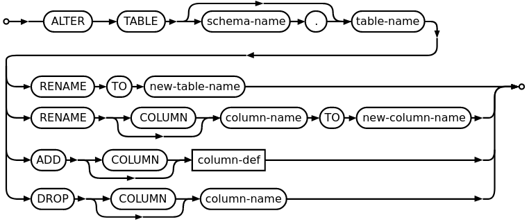

:data-transition-duration: 1000
:skip-help: true
:css: ./style.css
:substep: true
:slide-numbers: true
:data-width: 1024
:data-height: 768

.. role:: ltr
    :class: ltr

.. role:: rtl
    :class: rtl

.. |nbsp| unicode:: 0xA0
   :trim:

----

Database Course
==================
Ahmad Yoosofan

SQL 1

University of Kashan

https://yoosofan.github.io

https://yoosofan.github.io/slide/db/sql1/

----

:class: t2c

Database Schema of SP
=====================
.. code:: sql
    :number-lines:

    create table s (
        sn      char(10) primary key,
        sname   char(30),
        status  int  default(0),
        city    char(20)
    );

    create table p (
        pn     char(10) primary key,
        pname  char(30),
        color  char(20),
        weight NUMERIC(9, 2),
        city   char(20)
    );

    create table sp (
        sn    char(10) references s,
        pn    char(10) references p,
        qty   int default(0),
        primary key (sn, pn)
    );

.. yographviz::

   digraph S_P_SP { // Thanks to Gemini from Google
       // Layout direction: Left to Right
       rankdir=LR;

       // Global node and edge settings
       node [shape=none, fontname="Helvetica", fontsize=12];
       edge [fontname="Helvetica", fontsize=10, color="#555555"];

       // Table: Suppliers (s)
       s [label=<
           <table border="0" cellborder="1" cellspacing="0" cellpadding="5">
               <tr><td bgcolor="#e0f7fa" colspan="2"><b>s (Suppliers)</b></td></tr>
               <tr><td port="sn" bgcolor="#ffffff"><b>sn (PK)</b></td><td bgcolor="#ffffff">char(10)</td></tr>
               <tr><td port="sname" bgcolor="#ffffff">sname</td><td bgcolor="#ffffff">char(30)</td></tr>
               <tr><td port="status" bgcolor="#ffffff">status</td><td bgcolor="#ffffff">int</td></tr>
               <tr><td port="city" bgcolor="#ffffff">city</td><td bgcolor="#ffffff">char(20)</td></tr>
           </table>
       >];

       // Table: Shipments (sp)
       // Placed in the middle visually
       sp [label=<
           <table border="0" cellborder="1" cellspacing="0" cellpadding="5">
               <tr><td bgcolor="#fff9c4" colspan="2"><b>sp (Shipments)</b></td></tr>
               <tr><td port="sn" bgcolor="#ffffff"><b>sn (PK, FK)</b></td><td bgcolor="#ffffff">char(10)</td></tr>
               <tr><td port="pn" bgcolor="#ffffff"><b>pn (PK, FK)</b></td><td bgcolor="#ffffff">char(10)</td></tr>
               <tr><td port="qty" bgcolor="#ffffff">qty</td><td bgcolor="#ffffff">int</td></tr>
           </table>
       >];

       // Table: Parts (p)
       p [label=<
           <table border="0" cellborder="1" cellspacing="0" cellpadding="5">
               <tr><td bgcolor="#e8f5e9" colspan="2"><b>p (Parts)</b></td></tr>
               <tr><td port="pn" bgcolor="#ffffff"><b>pn (PK)</b></td><td bgcolor="#ffffff">char(10)</td></tr>
               <tr><td port="pname" bgcolor="#ffffff">pname</td><td bgcolor="#ffffff">char(30)</td></tr>
               <tr><td port="color" bgcolor="#ffffff">color</td><td bgcolor="#ffffff">char(20)</td></tr>
               <tr><td port="weight" bgcolor="#ffffff">weight</td><td bgcolor="#ffffff">numeric(9, 2)</td></tr>
               <tr><td port="city" bgcolor="#ffffff">city</td><td bgcolor="#ffffff">char(20)</td></tr>
           </table>
       >];

       // Foreign Key Relationships
       // The syntax node:port -> node:port connects the specific table rows

       sp:sn -> s:sn [label=" references", arrowtail=none, arrowhead=normal];
       sp:pn -> p:pn [label=" references", arrowtail=none, arrowhead=normal];
   }

----

:class: t2c

DSL(Data Sub Language)
======================
.. code:: sql
    :number-lines:

    insert into s(sn, sname,  status, city)
    values('s1', 'Smith', 20, 'London')
    ;

    insert into p(pn, pname, color, weight, city)
    values('p1','Nut'  ,'Red'  ,12.0,'London')
    ;

    insert into p(pn, pname, color, weight, city)
    values
      ('p2', 'Bolt' , 'Green', 17.0, 'Paris' ),
      ('p5', 'Cam'  , 'Blue' , 12.0, 'Paris' ),
      ('p6', 'Cog'  , 'Red'  , 19.0, 'London')
    ;

.. container::

    .. class:: substep

        .. code:: sql

            delete sp;

        .. code:: sql

            drop table sp;

        * DDL: Data Definition Language
        * DML: Data Manipluation Language
        * DCL: Data Control Language

        #. DDL: create, drop
        #. DML: insert, delete

.. code:: sql
    :number-lines:

    insert into s(sn, sname,  "status", city)
    values('s4', 'Clark', 20, 'London')
    ;
    insert into s(sname, status, city, sn)
    values('Adams', 30, 'Athens', 's5')
    ;
    insert into s
    values('s6', 'Ali', 40, 'کاشان')
    ;

----

:class: t2c

DBMS(Database Management System)
================================
.. container:: substep

    .. class:: substep

    * An application
    * RDBMS (Relational Datababase Management System)
    * SQL (Structured Query Language)
    * DB2, Oracle, PostgreSQL, MySQL, SqlServer, MariaDB
    * SQLite (Lack of DCL commands, each db on a file)

.. container:: substep

    *SQLite*

    .. class:: substep

    #. `SQLite <https://www.sqlite.org/download.html>`_
    #. `SQLite browser <https://sqlitebrowser.org/>`_
    #. `SQLite studio <https://sqlitestudio.pl/>`_
    #. `SQLite-web <https://github.com/coleifer/sqlite-web>`_
    #. `Database Viewer <https://github.com/Dyaland/DatabaseViewer>`_

.. container:: substep

    *Online*

    .. class:: substep

    #. `sql.js <https://sql.js.org/examples/GUI/>`_
    #. `sqlite online <https://sqliteonline.com/>`_
    #. `sqlite-browser <https://extendsclass.com/sqlite-browser.html#>`_
    #. `sqlite-viewer <https://inloop.github.io/sqlite-viewer/>`_
    #. `sqlfiddle <https://sqlfiddle.com/sqlite/online-compiler>`_

.. :

    #. https://sqlzoo.net/
    #. `tutorial <https://www.sqlitetutorial.net/>`_

----

:class: t2c

.. class:: rtl-h1

  نام قطعه‌ها را بیابید.

.. container::

  .. code:: sql

    select pname
    from p
    ;

  .. code:: sql

    p{pname};

..  csv-table::
  :header-rows: 1
  :class: smallerelementwithfullborder

  pname
  Nut
  Bolt
  Screw
  Screw
  Cam
  Cog
  Nut
  Bolt

----

:class: n2c

.. container::

    .. code:: sql
        :number-lines:

        select sname, status
        from s
        ;

    .. code:: sql
        :number-lines:

        s{sname, status};

        -- Relational Algebra

.. raw:: html

    <pre>
        ╭───────┬────────╮
        │ sname │ status │
        ╞═══════╪════════╡
        │ Smith │     20 │
        │ Jones │     10 │
        │ Blake │     30 │
        │ Clark │     20 │
        │ Adams │     30 │
        │ Ali   │     40 │
        ╰───────┴────────╯
    </pre>

.. code:: sql
    :number-lines:
    :class: substep

    select *
    from s;
    ;

.. container:: substep

    .. raw:: html

        <pre>
            ╭────┬───────┬────────┬────────╮
            │ sn │ sname │ status │  city  │
            ╞════╪═══════╪════════╪════════╡
            │ s1 │ Smith │     20 │ London │
            │ s2 │ Jones │     10 │ Paris  │
            │ s3 │ Blake │     30 │ Paris  │
            │ s4 │ Clark │     20 │ London │
            │ s5 │ Adams │     30 │ Athens │
            │ s6 │ Ali   │     40 │ کاشان  │
            ╰────┴───────┴────────┴────────╯
        </pre>

----

:class: t2c

as (rename)
==============
.. code:: sql
    :number-lines:

    select sname, status + 4
    from s;
    ;

.. raw:: html

    <pre>
        ╭───────┬────────────╮
        │ sname │ status + 4 │
        ╞═══════╪════════════╡
        │ Smith │         24 │
        │ Jones │         14 │
        │ Blake │         34 │
        │ Clark │         24 │
        │ Adams │         34 │
        │ Ali   │         44 │
        ╰───────┴────────────╯
    </pre>

.. code:: sql
    :number-lines:

    select sname, status + 4 as st4
    from s;
    ;

.. raw:: html

    <pre>
        ╭───────┬─────╮
        │ sname │ st4 │
        ╞═══════╪═════╡
        │ Smith │  24 │
        │ Jones │  14 │
        │ Blake │  34 │
        │ Clark │  24 │
        │ Adams │  34 │
        │ Ali   │  44 │
        ╰───────┴─────╯
    </pre>

----

:class: t2c

.. class:: rtl-h1

  نام قطعه‌ها و وزن آنها را بیابید.

.. container:: substep

  .. code:: sql

    select pname, weight
    from p
    ;

  .. code:: sql

    p{pname, weight} ;

..  csv-table::
  :header-rows: 1
  :class: smallerelementwithfullborder substep

  pname, weight
  Nut,  12
  Bolt, 17
  Screw,  17
  Screw,  14
  Cam,  12
  Cog,  19
  Nut,
  Bolt,

.. :

  Nut,  **NULL**
  Bolt, **NULL**

----

:class: t2c

NULL
=====
.. container::

    .. code:: sql
        :number-lines:

        insert into p(pn, pname, color, city)
        values('p7', 'Nut', 'Red', 'London')
        ;

    .. code:: sql
        :number-lines:
        :class: substep

        insert into p(pn, pname, color, weight, city)
        values('p8', 'Bolt', 'Green', null, 'Paris')
        ;

.. code:: sql
    :class: substep
    :number-lines:

    create table s (
     sn      char(10) primary key,
     sname   char(30) not null,
     status  int  default 0,
     city    char(20)
    );

.. class:: substep

    #. null
    #. not 'null'
    #. not 0
    #. not '0'
    #. not ''

.. class:: substep

    #. Do not know the value
    #. Not applicable
        * Address: city, street, alley, number

.. :

    https://www.ibm.com/support/knowledgecenter/en/SSEPEK_11.0.0/intro/src/tpc/db2z_joindatafromtables.html
    https://www.ibm.com/support/knowledgecenter/SSEPEK_11.0.0/intro/src/art/bkntjoin.gif

    برای حالتی که فیلدی در جدول مقدارهای null نیز داشته باشد و نتیجه‌های unknown بدهد در این صورت باید منطق سه گزاره‌ای را به کار ببریم تا نتیجهٔ نهایی را متوجه بشویم.

    نام قطعاتی را به دست آورید که نام شهر آنها کاشان باشد یا وزن آنها بیشتر از ۲۰ باشد.

    select pname
    from p
    where city='kashan' or wight>20;

    اگر دستور زیر را بنویسیم می‌تواند پاسخ دیگری را بدهد.

    select pname
    from p
    where (city in not null and city='kashan') or weight>20;

----

:class: t2c

.. class:: rtl-h1

نام قطعه‌ها و وزن آن‌ها را به گرم بیابید.

.. container:: substep

    .. code:: sql
        :number-lines:

        select pname, weight * 1000 as gweight
        from p
        ;

    NULL * 1000 → NULL

..  csv-table::
  :header-rows: 1
  :class: smallerelementwithfullborder substep

  pname, gweight
  Nut,  12000
  Bolt, 17000
  Screw,  17000
  Screw,  14000
  Cam,  12000
  Cog,  19000
  Nut,
  Bolt,

----

:class: t2c

Where
=====

.. container::

  .. code:: sql
    :number-lines:

    --   نام عرضه‌کنندگان شهر کاشان را بیابید.

    select sname
    from s
    where city = 'کاشان'
    ;

  .. code:: sql
    :class: substep

    -- (s where city = 'کاشان') {pname}

  .. code:: sql
    :class: substep

    select sname
    from s
    where city = 'Paris'
    ;

.. container:: substep

    ..  csv-table::
        :header-rows: 1
        :class: smallerelementwithfullborder

        sname
        Jones
        Blake

    * Arithmetic Operators
        * **`+ - * / %`**
    * Comparison Operators
        * **`= < > >= <= <>`**

----

:class: t2c

.. class:: rtl-h1

  شمارهٔ قطعه‌های عرضه شده را بیابید.

.. code:: sql
  :class: substep

  select pn
  from sp
  ;

..  csv-table::
  :header-rows: 1
  :class: smallerelementwithfullborder substep

  pn
  p1
  p2
  p3
  p4
  p5
  p6
  p1
  p2
  p2
  p2
  p4
  p5
  p2

----

:class: t2c

.. class:: rtl-h1

  نام قطعه‌های عرضه شده را بیابید.

.. container::

  .. code:: sql
    :class: substep

    select pname
    from p, sp
    where p.pn = sp.pn
    ;

  .. code:: sql
    :class: substep

    (
      (
         (
           p rename pn as ppn
         )
         times sp
      ) where ppn = pn
    ) {pname}

..  csv-table::
  :header-rows: 1
  :class: smallerelementwithfullborder substep

  pname
  Nut
  Bolt
  Screw
  Screw
  Cam
  Cog
  Nut
  Bolt
  Bolt
  Bolt
  Screw
  Cam
  Bolt

----

:class: t2c

join
=====
.. class:: rtl-h1

  نام قطعه‌های عرضه شده را بیابید.

.. code:: sql

  select pname
  from p natural join sp
  ;

.. code:: sql
  :class: substep

  (p join sp) {pname}

.. code:: sql
  :class: substep

  select pname
  from p join sp using(pn)
  ;

.. code:: sql
  :class: substep

  select pname
  from p join sp on p.pn=sp.pn
  ;

----

:class: t2c

.. class:: rtl-h1

  نام قطعه‌هایی را بیابید که در شهر آن قطعه‌ها عرضه کننده‌ای وجود داشته باشد

.. container:: substep

  .. code:: sql

    select pname
    from p join s using(city)
    ;

  .. code:: sql
    :class: substep

    select pname
    from p natural join s
    ;

  .. code:: sql
    :class: substep

    select distinct pname
    from p natural join s
    ;

.. raw:: html

    <pre>

        ╭───────╮
        │ pname │
        ╞═══════╡
        │ Nut   │
        │ Nut   │
        │ Bolt  │
        │ Bolt  │
        │ Screw │
        │ Screw │
        │ Cam   │
        │ Cam   │
        │ Cog   │
        │ Cog   │
        │ Nut   │
        │ Nut   │
        │ Bolt  │
        │ Bolt  │
        ╰───────╯
    </pre>

.. container:: substep

    .. raw:: html

        <pre>
            ╭───────╮
            │ pname │
            ╞═══════╡
            │ Nut   │
            │ Bolt  │
            │ Screw │
            │ Cam   │
            │ Cog   │
            ╰───────╯
        </pre>

..  csv-table:
  :header-rows: 1
  :class: smallerelementwithfullborder substep

  pname
  Nut
  Nut
  Bolt
  Bolt
  Screw
  Screw
  Cam
  Cam
  Cog
  Cog
  Nut
  Nut
  Bolt
  Bolt

    ----

    :class: t2c

    .. class:: rtl-h1

      اطلاعات عرضه‌کنندگان و قطعه‌هایی را که عرضه کرده‌اند، بیابید.

    .. code:: sql
      :class: substep

      select *
      from (p join sp using(pn))
        join s using(sn)
      ;

    ..  csv-table::
      :header-rows: 1
      :class: smallerelementwithfullborder substep

      pn, pname,  color,  weight, city, sn, qty,  sname,  status, city
      p1, Nut,  Red,  12, London, s1, 300,  Smith,  20, London
      p2, Bolt, Green,  17, Paris,  s1, 200,  Smith,  20, London
      p3, Screw,  Blue, 17, Oslo, s1, 400,  Smith,  20, London
      p4, Screw,  Red,  14, London, s1, 200,  Smith,  20, London
      p5, Cam,  Blue, 12, Paris,  s1, 100,  Smith,  20, London
      p6, Cog,  Red,  19, London, s1, 100,  Smith,  20, London
      p1, Nut,  Red,  12, London, s2, 300,  Jones,  10, Paris
      p2, Bolt, Green,  17, Paris,  s2, 400,  Jones,  10, Paris
      p2, Bolt, Green,  17, Paris,  s3, 200,  Blake,  30, Paris
      p2, Bolt, Green,  17, Paris,  s4, 200, Clark, 20, London
      p4, Screw,  Red,  14, London, s4, 300,  Clark,  20, London
      p5, Cam,  Blue, 12, Paris,  s4, 400,  Clark,  20, London
      p2, Bolt, Green,  17, Paris,  s6, 350,  Ali,  40, کاشان

----

:class: t2c

.. class:: rtl-h1

  نام قطعاتی را بیابید که عرضه‌کننده‌ای از شهر کاشان آنها را عرضه کرده باشد.

.. container::

  .. code:: sql
    :class: substep

    select pname
    from (p natural join sp)
      join s on s.sn=sp.sn
    where s.city = 'کاشان'
    ;

  .. code:: sql
    :class: substep

    select pname
    from (p natural join sp)
      join s using(sn)
    where s.city = 'کاشان'
    ;

..  csv-table::
  :header-rows: 1
  :class: smallerelementwithfullborder substep

  pname
  Bolt

.. :

    ----

    :class: t2c

    .. class:: rtl-h1

      نام قطعاتی را بیابید که وزن آنها بیشتر از ۲۰ است

    .. code:: sql
      :class: substep

      select pname
      from p
      where weight > 20
      ;

    ..  csv-table::
      :header-rows: 1
      :class: smallerelementwithfullborder substep

      pname
      ""

----

:class: t2c

SQLite (I)
==========
.. class:: substep

#. sqlite3
#. sqlite3 sp.sqlite
#. .exit or .quit
#. .help
#. .read sp.sql
#. .output sp2.sql
#. .dump
#. .output

.. class:: substep

#. .open sp.sqlite
#. .databases
#. .backup  FILE
#. .restore FILE
#. .system CMD
#. .system clear
#. .tables
#. .schema s

.. :

    .mode box
    .mode csv
    .mode column
    .mode markdown

    .. csv-table::
        :header-rows: 1
        :class: smallerelementwithfullborder substep

        Command,Description
        sqlite3,Open SQLite3 in interactive mode
        sqlite3 database.db,Open (or create) a database file
        .exit or .quit,Exit SQLite3
        .help,List all available SQLite3 dot commands
        .read file.sql, read and execute file.sql
        .dump ?TABLE?,Export database (or table) as SQL script

    .. csv-table::
        :header-rows: 1
        :class: smallerelementwithfullborder substep

        Command,Description
        .open database.db,Open (or create) a database file
        .databases,List attached databases
        .backup ?DB? FILE,Backup database to a file
        .restore ?DB? FILE,Restore database from a file
        .system CMD, run CMD command from operating system

    https://database.guide/an-overview-of-dot-commands-in-sqlite/
    https://stephentech.bearblog.dev/sqlite3-commands-cheat-sheet/
    https://www.sqlitetutorial.net

----

:class: t2c

Use Another name for a Table in Query
=========================================
.. container::

  .. code:: sql

    create table t (
      a int primary key,
      name char(20)
    );

    insert into t values (1, 'a'),(2, 'b');

  .. code:: sql

    select *
    from t, t as M;

..  csv-table::
  :header-rows: 1
  :class: smallerelementwithfullborder substep

  a,  name, a,  name
  1,  a,  1,  a
  1,  a,  2,  b
  2,  b,  1,  a
  2,  b,  2,  b

.. code:: sql
  :class: substep

  select t.name
  from t, t as M
  where t.a < M.a;

..  csv-table::
  :header-rows: 1
  :class: smallerelementwithfullborder substep

  name
  a

.. code:: sql
  :class: substep

  select *
  from t join t as M
    on t.a < M.a;

..  csv-table::
  :header-rows: 1
  :class: smallerelementwithfullborder substep

  a,  name, a,  name
  1,  a,  2,  b

----

:class: t2c

.. class:: rtl-h1

نام قطعاتی را بیابید که وزن آنها دست کم از وزن یک قطعهٔ دیگر بیشتر باشد نام تکراری در پاسخ نیاید.

.. class:: substep rtl-h2

    نام همهٔ قطعات را بیابید به جز قطعه‌ یا قطعه‌هایی که کمترین وزن را دارند

.. code:: sql
    :class: substep
    :number-lines:

    select T.pname
    from p as T
    ;

.. container::

    .. code:: sql
        :class: substep
        :number-lines:

        select T.pname
        from p as T, p
        where p.weight < T.weight
        ;

    .. code:: sql
        :class: substep
        :number-lines:

        select distinct T.pname
        from p as T, p
        where p.weight < T.weight
        ;

    .. code:: sql
        :class: substep
        :number-lines:

        select distinct T.pname
        from p as T join p on
          p.weight < T.weight
        ;

.. raw:: html

    <pre>
    ╭───────╮
    │ pname │
    ╞═══════╡
    │ Bolt  │
    │ Screw │
    │ Cog   │
    ╰───────╯
    </pre>

..  csv-table:
  :header-rows: 1
  :class: smallerelementwithfullborder substep

  pname
  Bolt
  Bolt
  Bolt
  Screw
  Screw
  Screw
  Screw
  Screw
  Cog
  Cog
  Cog
  Cog
  Cog

----

:class: t2c

.. class:: rtl-h1

نام قطعه‌های عرضه شده را همراه با نام عرضه‌کنندگان‌شان بیابید زوج نام تکراری در پاسخ نیاید.

.. container::

  .. code:: sql
    :class: substep

    select pname, sname
    from s, sp, p
    where s.sn = sp.sn and
      p.pn = sp.pn
    ;

  .. code:: sql
    :class: substep

    select distinct pname, sname
    from s natural join sp
      join p using(pn)
    ;

.. raw:: html

    <pre>
        ╭───────┬───────╮
        │ pname │ sname │
        ╞═══════╪═══════╡
        │ Nut   │ Smith │
        │ Bolt  │ Smith │
        │ Screw │ Smith │
        │ Cam   │ Smith │
        │ Cog   │ Smith │
        │ Nut   │ Jones │
        │ Bolt  │ Jones │
        │ Bolt  │ Blake │
        │ Bolt  │ Clark │
        │ Screw │ Clark │
        │ Cam   │ Clark │
        │ Bolt  │ Ali   │
        ╰───────┴───────╯
    </pre>

..  csv-table:
  :header-rows: 1
  :class: smallerelementwithfullborder substep

  pname,  sname
  Nut,  Smith
  Bolt, Smith
  Screw,  Smith
  Screw,  Smith
  Cam,  Smith
  Cog,  Smith
  Nut,  Jones
  Bolt, Jones
  Bolt, Blake
  Bolt, Clark
  Screw,  Clark
  Cam,  Clark
  Bolt, Ali

----

:class: t2c

.. class:: rtl-h1

  نام قطعاتی را بیابید که وزن‌شان دست کم از وزن یک قطعهٔ با رنگ قرمز کمتر باشد

.. container::

  .. code:: sql
    :class: substep

    select distinct T.pname
    from p as T, p
    where p.weight > T.weight
      and p.color='Red'
    ;

  .. code:: sql
    :class: substep

    select distinct T.pname
    from p as T join p on
      p.weight > T.weight
    where p.color='Red'
    ;

..  csv-table::
  :header-rows: 1
  :class: smallerelementwithfullborder substep

  pname
  Nut
  Bolt
  Screw
  Cam

.. code:: sql
  :class: substep

  select distinct p.pname
  from p as p1 join p on
    p1.weight > p.weight and
    p1.color = 'Red'
  ;

.. :

    ..  csv-table::
      :header-rows: 1
      :class: smallerelementwithfullborder substep

      pname
      Cog
      Screw

----

:class: t2c

LIKE
====
.. class:: rtl-h2

نام شهرهای قطعاتی را بیابید که با P آغاز شده باشد

.. code:: sql
  :class: substep

  select city
  from p
  where city like 'P%'
  ;

.. class:: rtl-h2 substep

نام قطعاتی را بیابید که کاراکتر دوم نام‌شان o باشد.

.. code:: sql
  :class: substep

  select pname
  from p
  where city like '_o%'
  ;

.. class:: rtl-h2 substep

نام شهر قطعاتی را بیابید که درون نام شهر آنها رشتهٔ is وجود داشته باشد

.. code:: sql
  :class: substep

  select city
  from p
  where city like '%is%'
  ;

.. class:: rtl-h2 substep

  نام قطعات و شهرهای آنها را بیابید که شهر آنها دست کم سه‌حرفی باشند و با رشتهٔ `_bn` آغاز شود.

.. code:: sql
  :class: substep

  select pname, city
  from p
  where city like 'bn\_%'
  ;

----

:class: t2c

escape
========
.. code:: sql

  select pname
  from p
  where city like 'P\_%' escape '\'
  ;

.. code:: sql
  :class: substep

  select pname
  from p
  where city like 'P!_%' escape '!'
  ;

.. code:: sql
  :class: substep

  select pname
  from p
  where city like 'P#_%' escape '#'
  ;

.. code:: sql
    :class: substep

    select pname
    from p
    where city like "an\_%" escape "\"
    ; -- "

----

:class: t2c

ORDER BY
========
.. class:: rtl-h2

نام قطعاتی را بیابید که در شهر پاریس باشند و پاسخ بر پایهٔ نام قطعه از کوچک به بزرگ مرتب شده باشد.

.. code:: sql

  select pname
  from p
  where city='Paris'
  order by pname
  ;

.. class:: rtl-h2 substep

نام و وزن قطعاتی را بیابید که در شهر پاریس هستند و پاسخ بر پایهٔ وزن قطعه از کوچک به بزرگ مرتب شده باشد

.. code:: sql
  :class: substep

  select pname, weight
  from p
  where city='Paris'
  order by weight
  ;

.. code:: sql
  :class: substep

  select pname, weight
  from p
  where city='Paris'
  order by weight asc
  ;

.. container:: substep

    .. raw:: html

        <pre>
            ╭───────┬────────╮
            │ pname │ weight │
            ╞═══════╪════════╡
            │ Bolt  │ NULL   │
            │ Cam   │     12 │
            │ Bolt  │     17 │
            ╰───────┴────────╯
        </pre>

----

:class: t2c

.. class:: rtl-h1

  نام و وزن قطعاتی را بیابید که در شهر پاریس هستند و پاسخ بر پایهٔ وزن قطعه از بزرگ به کوچک مرتب شده باشد

.. code:: sql
  :class: substep

  select pname, weight
  from p
  where city='Paris'
  order by weight desc
  ;

..  csv-table::
  :header-rows: 1
  :class: smallerelementwithfullborder substep

    pname,  weight
    Bolt, 17
    Cam,  12
    Bolt,

.. code:: sql
  :class: substep

  select pname, weight
  from p
  where city='Paris' and weight is not null
  order by weight desc
  ;

..  csv-table::
  :header-rows: 1
  :class: smallerelementwithfullborder substep

    pname,  weight
    Bolt, 17
    Cam,  12

----

:class: t2c

BETWEEN
=======
.. container::

    .. class:: rtl-h2

      نام و وزن قطعاتی را بیابید که وزن‌شان بین ۱۲ و ۱۴ باشد

    .. csv-table::
      :header-rows: 1
      :class: smallerelementwithfullborder, substep

      pname, weight
      Nut,12
      Screw,14
      Cam,12

.. container::

    .. code:: sql
      :class: substep

      select pname, weight
      from p
      where weight >= 12 and weight <= 14
      ;

    .. code:: sql
      :class: substep

      select pname, weight
      from p
      where weight between 12 and 14;

.. container::

    .. class:: rtl-h2 substep

      نام و وزن قطعاتی را بیابید که وزن‌شان بین ۱۲ و ۱۴ نباشد

    .. csv-table::
      :header-rows: 1
      :class: smallerelementwithfullborder, substep

      pname, weight
      Bolt,17
      Screw,17
      Cog,19

.. container::

    .. code:: sql
      :class: substep

      select pname, weight
      from p
      where not (weight >= 12 and weight <= 14)
      ;

    .. code:: sql
      :class: substep

      select pname, weight
      from p
      where weight not between 12 and 14
      ;

.. code:: sql
  :class: substep

  select pname, weight
  from p
  where weight < 12 or weight > 14
  ;

----

:class: t2c

.. :

.. class:: rtl-h1

  نام قطعاتی را بیاید که عرضه کننده‌ای در شهر آن قطعه‌ها آنها را عرضه کرده باشد

Record Comparison
------------------
.. code:: sql
  :class: substep

  select pname
  from p, s, sp
  where p.city = s.city and
    p.pn = sp.pn and
    s.sn = sp.sn
  ;

.. code:: sql
  :class: substep

  select pname
  from p, s, sp
  where (p.city, p.pn) = (s.city, sp.pn)
    and s.sn = sp.sn
  ;

.. code:: sql
  :class: substep

  select pname
  from p join s on
    p.city = s.city
    join sp on
    (p.pn, s.sn) = (sp.pn, sp.sn)
  ;

.. code:: sql
  :class: substep

  select pname
  from p natural join sp natural join s
  ;

.. csv-table:
  :header-rows: 1
  :class: smallerelementwithfullborder, substep

    pname
    Nut
    Screw
    Cog
    Bolt
    Bolt
    Screw

----

:class: t2c

Union
========
.. class:: rtl-h2

نام قطعاتی از شهر پاریس را بیابید که وزن آن‌ها بیشتر از ۱۲ است.

.. code:: sql
    :class: substep

    select distinct pname
    from p
    where city = 'Paris' or
      weight > 12;

.. code:: sql
    :class: substep

      select pname
      from p
      where city='Paris'
    union
      select pname
      from p
      where weight>12;

.. csv-table::
    :header-rows: 1
    :class: smallerelementwithfullborder, substep

    pname
    Bolt
    Cam
    Cog
    Screw

.. container::

  .. code:: sql
    :class: substep

      select pname
      from p
      where city = 'kashan'
    union all
      select pname
      from p
      where weight>10
     ;

.. csv-table::
    :header-rows: 1
    :class: smallerelementwithfullborder, substep

    pname
    Nut
    Bolt
    Screw
    Screw
    Cam
    Cog

----

:class: t2c

Style of Writing
=============================
.. code:: sql
  :class: substep

    select pname
    from p
    where city='Paris'
  union
    select pname
    from p
    where weight>12
  ;

.. code:: sql
  :class: substep

  select pname
  from p
  where city='kashan'
  union
  select pname
  from p
  where weight>10
  ;

.. code:: sql
  :class: substep

  select pname
  from p
  where city='kashan'

  union

  select pname
  from p
  where weight>10
  ;

----

:class: t3c

Intersect
===============
.. code:: sql
    :class: substep

      select pname
      from p
      where city='Paris'
    intersect
      select pname
      from p
      where weight>10
    ;

.. code:: sql
    :class: substep

    select distinct pname
    from p
    where city='Paris' and
      weight>10
    ;

.. csv-table::
    :header-rows: 1
    :class: smallerelementwithfullborder, substep

    pname
    Bolt
    Cam

.. code:: sql
    :class: substep

      select pname
      from p
      where city = 'Paris'
    intersect all -- sqlite error
      select pname
      from p
      where weight > 10
    ;

.. code:: sql
    :class: substep

    select pname
    from p
    where city='Paris' and
      weight>10
    ;

.. csv-table::
    :header-rows: 1
    :class: smallerelementwithfullborder, substep

    pname
    Bolt
    Cam

----

:class: t3c

Except
==========
.. code:: sql
    :class: substep

      select pname
      from p
      where city = 'Paris'
    except
      select pname
      from p
      where weight > 14
    ;

.. code:: sql
    :class: substep

    select distinct pname
    from p
    where city='Paris' and
      weight<=14
    ;

.. csv-table::
    :header-rows: 1
    :class: smallerelementwithfullborder, substep

    pname
    Cam

.. code:: sql
    :class: substep

    select pname
      from p
      where city='Paris'
    except all -- sqlite error
      select pname
      from p
      where weight>10
    ;

.. code:: sql
    :class: substep

    select pname
    from p
    where city='Paris' and
      weight<=14
    ;

.. csv-table::
    :header-rows: 1
    :class: smallerelementwithfullborder, substep

    pname
    Cam

----

:class: t2c

.. class:: rtl-h1

  نام شهرهای قطعاتی را بیابید که در آنها عرضه‌کننده‌ای وجود ندارد

.. code:: sql
  :class: substep

  select city
  from p
  except
  select city
  from s
  ;

.. csv-table::
  :header-rows: 1
  :class: smallerelementwithfullborder, substep

  city
  Oslo

----

:class: t2c

.. class:: rtl-h1

  شمارهٔ قطعات و شمارهٔ عرضه‌کنندگانی را بیابید که قطعات یاد شده را آن عرضه کنندگان عرضه نکرده باشند

.. code:: sql
    :class: substep
    :number-lines:

    select pn, sn
    from p, s
    except
    select pn, sn
    from sp;

.. code:: sql
    :class: substep
    :number-lines:

    select distinct p.pn, s.sn
    from p, s, sp         -- incorrect
    where (s.sn, p.pn) <> (sp.sn, sp.pn)
    ; -- s1, p2

.. code:: sql
    :class: substep
    :number-lines:

    select * from (
        select pn, sn
        from p, s
      except
        select pn, sn
        from sp
    ) order by pn,sn;

.. code:: sql
    :class: substep
    :number-lines:

    select distinct p.pn, s.sn
    from p, s, sp -- incorrect
    where (s.sn, p.pn) <> (sp.sn, sp.pn)
    order by sp.pn,sp.sn
    ; -- s1, p2

.. code:: sql
    :class: substep
    :number-lines:

    select pn,sn
    from sp order by pn,sn
    ; -- s1, p2

.. :

    src/output.of.queries.comparison.txt

    .. code:: sql
        :class: substep

          select p.pn, s.sn -- sp
          from p, s, sp
          where (s.sn, p.pn) <> (sp.sn, sp.pn)
        except
          select pn, sn
          from (
            select pn, sn from p, s
            except
            select pn, sn from sp
          );

----

:class: t2c

.. class:: rtl-h1

  نام قطعات و نام عرضه‌کنندگانی را بیابید که قطعات یاد شده را آن عرضه کنندگان عرضه نکرده باشند

.. container::

  .. code:: sql
    :class: substep

    select pname, sname  -- نادرست
    from p, s
    except
    select pname, sname
    from p natural join sp
      natural join s;

  .. code:: sql
    :class: substep

    select pname, sname from p, s
    except
    select pname, sname
    from s natural join sp
      join p using(pn);

  .. code:: sql
    :class: substep

    select sname , pname
    from (
      select pn, sn from p, s
      except
      select pn, sn from sp
      ) join p using (pn)
      join s using (sn);

.. list-table::

  * - .. csv-table::
        :header-rows: 1
        :class: smallerelementwithfullborder

        pname,  sname
        Bolt, Adams
        Cam,  Adams
        Cam,  Ali
        Cam,  Blake
        Cam,  Jones
        Cog,  Adams
        Cog,  Ali
        Cog,  Blake

    - |nbsp| |nbsp| |nbsp|

    - .. csv-table::
        :header-rows: 1
        :class: smallerelementwithfullborder

        pname,  sname
        Cog,  Clark
        Cog,  Jones
        Nut,  Adams
        Nut,  Ali
        Nut,  Blake
        Nut,  Clark
        Screw,  Adams
        Screw,  Ali
        Screw,  Blake
        Screw,  Jones

----

:class: t2c

.. class:: rtl-h1

  زوج نام عرضه‌کنندگانی را بیابید که در یک شهر باشند و پاسخ تکراری نداشته باشید

.. code:: sql
  :class: substep

  -- (1) نادرست
  select s.sname, T.sname
  from s, s as T
  where s.city = T.city
  ;

.. code:: sql
  :class: substep

  -- (2) نادرست
  select s.sname, T.sname
  from s, s as T
  where s.city = T.city and
    s.sn != T.sn
  ;

.. code:: sql
  :class: substep

  -- (3)
  select s.sname, T.sname
  from s, s as T
  where s.city = T.city and
    s.sn < T.sn
  ;

.. code:: sql
  :class: substep

  -- (4)
  select s.sname, T.sname
  from s as T join s using(city)
  where s.sn < T.sn
  ;

.. code:: sql
  :class: substep

  -- (5)
  select s.sname, T.sname
  from s as T join s on
    T.city = s.city and
    s.sn < T.sn
  ;

.. csv-table::
  :header-rows: 1
  :class: smallerelementwithfullborder

  sname,  sname
  Smith,  Clark
  Jones,  Blake

----

:class: t2c

LIMIT
=========
.. code:: sql

  select distinct city
  from p
  order by weight, city
  ;

..  csv-table::
  :header-rows: 1
  :class: smallerelementwithfullborder

  city
  London
  Oslo
  Paris

.. code:: sql

  select distinct city
  from p
  order by weight, city
  limit 2
  ;

..  csv-table::
  :header-rows: 1
  :class: smallerelementwithfullborder

  city
  London
  Oslo

----

:class: t2c

Scalar value(I)
======================
.. class:: rtl-h2

شماره و وزن قطعاتی را بیابید که کمترین وزن را داشته باشند.

.

.. code:: sql
  :number-lines:
  :class: substep

  select pn, weight -- wrong
  from p
  order by weight asc
  limit 1
  ;

.. csv-table::
  :header-rows: 1
  :class: smallerelementwithfullborder substep

  pn, weight
  NULL, NULL

.. code:: sql
  :number-lines:
  :class: substep

  select pn, weight -- wrong
  from p
  where weight is not null
  order by weight asc
  limit 1
  ;

.. csv-table::
  :header-rows: 1
  :class: smallerelementwithfullborder substep

  pn, weight
  p1, 12

----

:class: t2c

.. class:: rtl-h1

شماره و وزن قطعاتی را بیابید که کمترین وزن را داشته باشند.

.. code:: sql
  :class: substep

  select pn, weight
  from p  -- Wrong
  where weight = (
      select weight
      from p
      order by weight asc
      limit 1
  );

.. code:: sql
  :class: substep

  select pn, weight
  from p
  where weight = (
      select weight
      from p
      where weight is not null
      order by weight asc
      limit 1
  );

.. code:: sql
  :class: substep
  :number-lines:

  select pn, 1 as qt
  from p
  where city = 'Paris'
  ;

.. csv-table::
  :header-rows: 1
  :class: substep smallerelementwithfullborder

  pn, qt
  P2, 1
  P5, 1
  P8, 1

----

:class: t2c

Update(I)
===========
.. code:: sql

    update P
    set weight = null
    where pn='P6';

.. code:: sql

    update s
    set status = status * 2
    where city = 'London';

.. code:: sql

    update employees
    set email = LOWER(
        firstname || "." || lastname || "@chinookcorp.com"
    );

.. code:: sql

    update employees
    set lastname = 'Smith'
    where employeeid = 3;

----

:class: t2c

Update(II)
===========
.. code:: sql

  update tableA
  set B = 'abcd',
    C = case
      when C = 'abc' then 'abcd'
      else C
    end
  where column = 1;

  -- https://stackoverflow.com/a/17081004/886607
  update s
  set
    status = case
      when city = 'london' then status * 2
      else status
    end

.. code:: sql
  :class: substep

  update s
  set
    status = case
    when city = 'London' then status * 2
    when city = 'Paris'  then status * 3
    else status
  end

.. code:: sql
  :class: substep

  update s
  set
    status = case
      when city = 'London' then status / 4
      when city = 'Paris'  then status / 3
      else status
    end

----

Alter Table
============
DDL
-----
.. code:: sql

  alter table sp add "comment" varchar(50);

  alter table sp drop "comment";

  alter table sp add "comment" varchar(50) default '';

----

END
