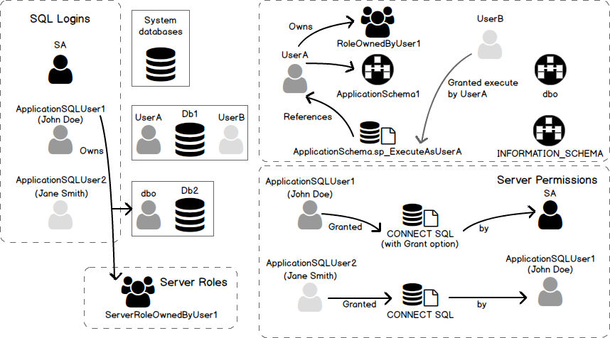
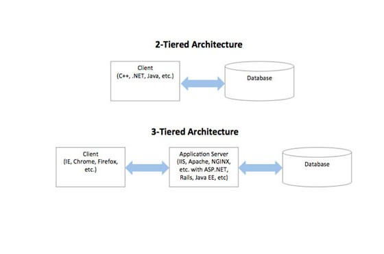
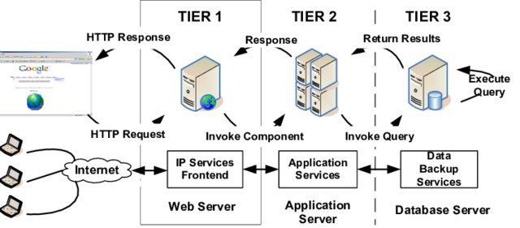

:data-transition-duration: 1000
:skip-help: true
:css: style.css
:substep: true
:slide-numbers: true
:data-width: 1024
:data-height: 768

----

Database users
===================================================
User Authentication
---------------------
Ahmad Yoosofan

Database course

University of Kashan, Spring 2021

----

.. reference:

    https://www.sqlshack.com/drop-sql-server-login-dependencies/

----

Users in general
======================
Application users

----

2 tier architecture
=======================
.. image:: img/users/aplication_user.gif

.. reference:

    https://docs.oracle.com/cd/B28196_01/idmanage.1014/b15994/concepts.htm

----

3 tier architecture
=======================

.. image:: img/users/3-tier-architecture_W640.jpg

.. reference:

    https://www.researchgate.net/publication/277187696_Building_a_Software_Service_for_Mobile_Devices_to_Enhance_Awareness_in_Web_Collaboration/figures?lo=1

----

2 vs 3 tier architecture
=========================

.. reference:

    https://medium.com/@gacheruevans0/2-tier-vs-3-tier-architecture-26db56fe7e9c

----

3 tier architecture
=======================

.. reference:

    https://www.researchgate.net/publication/221147997_FlashCache_A_NAND_flash_memory_file_cache_for_low_power_web_servers/figures?lo=1

----

N-tier_architecture
========================

.. image:: img/users/N-tier_architecture.png

.. reference:

    https://www.semanticscholar.org/paper/CEMARA%3A-a-Web-Dynamic-Application-Within-a-N-tier-Messiaen-Mignot/bf759757727c17a03376614d69ac81dc73c4bba9/figure/0

----

Type of Users(I)
=================
.. class:: substep

* Application Programmers
* Sophisticated Users
* Stand-alone Users
* Native Users

----

Type of Users(II)
=================
.. class:: substep

* *application programmer*: user who implements specific application programs to access the stored data
* *application user*: accesses an existing application program to perform daily tasks.
* *database administrator (DBA)*: responsible for authorizing access to the database, monitoring its use and managing all the resources to support the use of the entire database system
* *end user*: people whose jobs require access to a database for querying, updating and generating reports
* *sophisticated user*: those who use other methods, other than the application program, to access the database

.. reference:

    https://opentextbc.ca/dbdesign01/chapter/chapter-14-database-users/

----

Database Administrators
===========================
.. class:: substep

* Installing and upgrading the DBMS Servers
* Design and implementation:
* Performance tuning:
* Migrate database servers
* Backup and Recovery:
* Security
* Documentation

.. reference:

    https://www.tutorialcup.com/dbms/database-users-administrators.htm

----

PostgreSQl
==============
* https://www.postgresql.org
* https://postgresapp.com
* https://www.postgresql.org/docs/current/

.. :

    * https://gist.github.com/oschannel/1b4eb34f18cc7e573ce57a8c1ed5dc22
    * https://www.samgalope.dev/2024/09/09/how-to-set-up-postgresql-on-android-using-termux/
    * android termux pkg install postgresql

Ubuntu
-----------
.. code:: sh

  sudo apt install -y postgresql postgresql-contrib libpq-dev
  apt-cache search postgres
  sudo apt install pgadmin3
  sudo apt install libecpg-dev # Embedded PostgreSQL for C
  # sudo apt install ecpg-xc # old

.. :

    # https://command-not-found.com/ecpg

Change Password
-----------------
.. code:: sh

  sudo -u postgres psql postgres

  =#\password postgres
  =#\q

----

Connect to database
======================

.. code:: sql

  psql -d postgres -U postgres -h 127.0.0.1
  psql -d postgres -U postgres -h 127.0.0.1 -W
  psql --user=postgres --host='127.0.0.1' --password
  psql --db=psql --user=postgres --host='127.0.0.1' --password

Or run

pgadmin3

File --> Add Server

* name: whatever you want. for example "myDB"
* Host: 127.0.0.1
* Password:  (You already assign a password for connecting to this database.)

----

Create users in PostgreSQL

.. code:: sql

  CREATE USER ali; -- ساخت کاربر علی
  DROP USER ali; -- حذف کاربر علی
  CREATE USER ali WITH PASSWORD '1234';
  -- ساخت کاربر علی با رمز 1234
  DROP USER ali;
  CREATE USER ali PASSWORD '1234';
  -- ساخت کاربر با رمز
  DROP USER ali;
  CREATE USER ali WITH SUPERUSER  PASSWORD '1234';
  --در اینجا SUPERUSER یعنی کاربر در سطح مدیر سامانه‌ی پایگاه داده است.

----

.. code:: sql

  CREATE USER ali WITH NOSUPERUSER  PASSWORD '1234';
  -- در اینجا NO یعنی کاربر غیر مدیر
  CREATE USER ali WITH SUPERUSER CREATEDB PASSWORD '1234';
  -- امکان ساخت پایگاه داده برای این کاربر وجود دارد CREATEDB
  CREATE USER ali WITH NOSUPERUSER NOCREATEDB PASSWORD '1234';
  -- امکان ساخت پایگاه داده برای این کاربر وجود ندارد NOCREATEDB

  ---------------- DCL (Data Control Language)   ----------------

  GRANT ALL PRIVILEGES ON DATABASE "test_database" to tester;
  -- همه‌ی مجوزها به کاربر tester بر روی پایگاه داده‌ی test_database داده می‌شود.

----

.. code:: sql
  :class: substep

  GRANT ALL PRIVILEGES ON DATABASE spd to ali;

.. code:: sql
  :class: substep

  REVOKE ALL PRIVILEGES ON spd FROM ali;

.. code:: sql
  :class: substep

  GRANT INSERT, UPDATE, DELETE ON TABLE s TO ali;

.. code:: sql
  :class: substep

  REVOKE INSERT, DELETE ON TABLE s FROM ali;

.. code:: sql
  :class: substep

  REVOKE INSERT, DELETE ON TABLE s FROM ali CASCADE ;

----

ساختار دستور grant
=============================

.. code:: sql

  GRANT { { SELECT | INSERT | UPDATE | DELETE | RULE |
            REFERENCES | TRIGGER
          }
      [,...] | ALL [ PRIVILEGES ] }
      ON [ TABLE ] tablename [, ...]
      TO { username | GROUP groupname | PUBLIC }
      [, ...] [ WITH GRANT OPTION ]

.. reference:

    `<http://www.davidpashley.com/articles/postgresql-user-administration/>`_

----

ساختار دستور revoke
==============================
.. code:: sql

    REVOKE [ GRANT OPTION FOR ]
    { { SELECT | INSERT | UPDATE | DELETE | RULE | REFERENCES | TRIGGER }
    [,...] | ALL [ PRIVILEGES ] }
    ON [ TABLE ] tablename [, ...]
    FROM { username | GROUP groupname | PUBLIC } [, ...]
    [ CASCADE | RESTRICT ]

.. references:

    list of users
    http://www.postgresqltutorial.com/postgresql-list-users/

----

Console postgres

.. code:: sh

    `\du`
    `\du+`

.. code:: sh

    psql -c "\du"

----

behind scene
==================
.. code:: sql

    SELECT u.usename AS "Role name",
      CASE WHEN u.usesuper AND u.usecreatedb THEN CAST('superuser, create
    database' AS pg_catalog.text)
           WHEN u.usesuper THEN CAST('superuser' AS pg_catalog.text)
           WHEN u.usecreatedb THEN CAST('create database' AS
    pg_catalog.text)
           ELSE CAST('' AS pg_catalog.text)
      END AS "Attributes"
    FROM pg_catalog.pg_user u
    ORDER BY 1;

----

Some Commands
========================
run sql command in terminal

.. code:: console

  psql -U username -d mydatabase -c 'SELECT * FROM mytable'

  psql -U username -d mydatabase -c 'select pg_terminate_backend(pid)
                                     from pg_stat_activity where datname=dc';

.. code:: sql

  select * from pg_stat_activity where datname='dc'

  psql -h $database_host -U $database_user  -f boot_database_set.sql

  ALTER ROLE username  WITH PASSWORD 'password';

----

Create Index
===============
.. code:: sql

  CREATE INDEX time_index ON mytable(time1);

.. code:: sql

  DROP INDEX time_index;

.. code:: sql

  CREATE INDEX time_index2 ON mytable(time1, time2);

----

Backup
===========
Dump
--------------
.. code:: sh

  pg_dump --host='127.0.0.1' --username=postgres --password pc > backup.tar

  pg_dumpall

  pg_dumpall -U postgres > all.sql

  pg_dumpall --schema-only > definitiononly.sql

  pg_dumpall --tablespaces-only > allroles.sql

Restore
--------------
.. code:: sh

  psql dbname < backup.sql
  psql pc < backup.sql

----

Transaction(I)
==================
حساب بانکی را در نظر بگیرید می‌خواهیم پولی را به حساب فرد دیگری بفرستیم. در ساده‌ترین حالت باید دو دستور به روز رسانی انحام شود.

الف. از حساب من مقداری کم بشه

ب. به حساب گیرنده واریز بشه

پس دست کم دو دستور update

.. code:: sql

  member( ssn_ , sname, balance)

----

Transaction(II)
====================
.. code:: sql

  BEGIN TRANSACTION;

  update ..
  update ...

  COMMIT;  ----  ROLLBACK

----

:claas: t2c

Transaction(III)
====================
.. code:: sql

  CREATE TABLE accounts (
    account_no INTEGER NOT NULL,
    balance DECIMAL NOT NULL DEFAULT 0,
    PRIMARY KEY(account_no),
               CHECK(balance >= 0)
  );

  CREATE TABLE account_changes (
    change_no INT NOT NULL PRIMARY KEY,
    account_no INTEGER NOT NULL,
    flag TEXT NOT NULL,
    amount DECIMAL NOT NULL,
    changed_at TEXT NOT NULL,
    foreign key (account_no) references accounts(account_no)
  );

.. code:: sql

  INSERT INTO accounts (account_no,balance)
  VALUES (100,20100);

  INSERT INTO accounts (account_no,balance)
  VALUES (200,10100);
  SELECT * FROM accounts;

----

Transaction(III)
====================
.. code:: sql

  BEGIN TRANSACTION;

  UPDATE accounts
     SET balance = balance - 1000
  WHERE account_no = 100;

  UPDATE accounts
     SET balance = balance + 1000
  WHERE account_no = 200;

  INSERT INTO account_changes(change_no, account_no,flag,amount,changed_at)
  VALUES(10, 100,'-',1000,datetime('now'));

  INSERT INTO account_changes(change_no, account_no,flag,amount,changed_at)
  VALUES(11, 200,'+',1000,datetime('now'));

  COMMIT;

  SELECT * FROM accounts;

----

:claas: t2c

Transaction(IV)
====================
.. code:: sql

  START TRANSACTION;
  BEGIN TRANSACTION;
  BEGIN WORK;
  BEGIN;
  START;

.. code:: sql

  BEGIN;
    INSERT INTO table1 VALUES (1);
    SAVEPOINT my_savepoint;
    INSERT INTO table1 VALUES (2);
    ROLLBACK TO SAVEPOINT my_savepoint;
    INSERT INTO table1 VALUES (3);
  COMMIT;

.. code:: sql

  BEGIN;
      INSERT INTO table1 VALUES (3);
      SAVEPOINT my_savepoint;
      INSERT INTO table1 VALUES (4);
      RELEASE SAVEPOINT my_savepoint;
  COMMIT;

.. :

  https://www.postgresql.org/docs/current/sql-begin.html
  https://www.postgresql.org/docs/current/sql-savepoint.html

----

Commit(PostgreSQL)
======================
.. code:: sh

  \set AUTOCOMMIT off
  \echo :AUTOCOMMIT
  \set AUTOCOMMIT off

.. :

  https://dzone.com/articles/autocommit-in-postgresqls-psql
  https://www.postgresql.org/docs/current/ecpg-sql-set-autocommit.html

----

ACID
======
.. class:: substep

* *Atomic*:
* *Consistent*:
* *Isolation*:
* *Durable*:

DBMS = DataBase Management System (mySql, postgreSQL, SQL server, mariadb, Oracle, DB2)

.. :

  a transaction should be atomic. It means that a change cannot be broken down into smaller ones. When you commit a transaction, either the entire transaction is applied or not.
  a transaction must ensure to change the database from one valid state to another. When a transaction starts and executes a statement to modify data, the database becomes inconsistent. However, when the transaction is committed or rolled back, it is important that the transaction must keep the database consistent.
  a pending transaction performed by a session must be isolated from other sessions. When a session starts a transaction and executes the INSERT or UPDATE statement to change the data, these changes are only visible to the current session, not others. On the other hand, the changes committed by other sessions after the transaction started should not be visible to the current session.
  a pending transaction performed by a session must be isolated from other sessions. When a session starts a transaction and executes the INSERT or UPDATE statement to change the data, these changes are only visible to the current session, not others. On the other hand, the changes committed by other sessions after the transaction started should not be visible to the current session.

----

View
=====
view

----

حساب بانکی را در نظر بگیرید می‌خواهیم پولی را به حساب فرد دیگری بفرستیم. در ساده‌ترین حالت باید دو دستور به روز رسانی انحام شود.
الف. از حساب من مقداری کم بشه
ب. به حساب گیرنده واریز بشه
پس دست کم دو دستور update

الف و ب دو دستور یا مجموعه دستورهای مجزای SQL  خواهند شد.

insert into S(sn,sname,status,city) values('S1','Smith',20,'London');

تراکنش دستور یا مجموعه دستورهایی هست که می‌خواهیم یا همه انجام شود یا هیچ کدام انجام نشود. transaction

Atomic: a transaction should be atomic. It means that a change cannot be broken down into smaller ones. When you commit a transaction, either the entire transaction is applied or not.
Consistent: a transaction must ensure to change the database from one valid state to another. When a transaction starts and executes a statement to modify data, the database becomes inconsistent. However, when the transaction is committed or rolled back, it is important that the transaction must keep the database consistent.
Isolation: a pending transaction performed by a session must be isolated from other sessions. When a session starts a transaction and executes the insert or update statement to change the data, these changes are only visible to the current session, not others. On the other hand, the changes committed by other sessions after the transaction started should not be visible to the current session.
Durable: if a transaction is successfully committed, the changes must be permanent in the database regardless of the condition such as power failure or program crash. On the contrary, if the program crashes before the transaction is committed, the change should not persist.
DBMS = DataBase Management System (mySql, postgreSQL, SQL server, mariadb, Oracle, DB2)

https://www.sqlitetutorial.net/sqlite-transaction/

----

.. code:: sql

    create table accounts (
      account_no integer not null,
      balance DECIMAL not null default 0,
      primary key(account_no),
                 check(balance >= 0)
    );

    create table account_changes (
      change_no int not null primary key,
      account_no integer not null,
      flag text not null,
      amount DECIMAL not null,
      changed_at text not null
    );

----

.. code:: sql

    insert into accounts (account_no,balance)
    values (100,20100);

    insert into accounts (account_no,balance)
    values (200,10100);
    select * from accounts;

    begin transaction;

    update accounts
       set balance = balance - 1000
     where account_no = 100;

    update accounts
       set balance = balance + 1000
     where account_no = 200;
    insert into account_changes(change_no, account_no,flag,amount,changed_at)
    values(10, 100,'-',1000,datetime('now'));

.. code:: sql

    insert into account_changes(change_no, account_no,flag,amount,changed_at)
    values(11, 200,'+',1000,datetime('now'));

    COMMIT;

    select * from accounts;

    begin transaction;

    update accounts
       set balance = balance - 20000
     where account_no = 100;

----

.. code:: sql

    insert into account_changes(account_no,flag,amount,changed_at)
    values(100,'-',20000,datetime('now'));

.. :

  13990919

----

References
=============
*  `<http://www.postgresql.org/docs/current/static/sql-grant.html>`_
*  `<http://www.postgresql.org/docs/current/static/sql-revoke.html>`_
*  `<http://www.postgresql.org/docs/current/static/sql-createuser.html>`_
*  `<http://www.postgresql.org/docs/current/static/sql-createrole.html>`_
*  https://docs.oracle.com/cd/E11882_01/server.112/e10897/users_secure.htm#ADMQS0741
*  https://docs.oracle.com/cd/F49540_01/DOC/server.815/a67772/dba.htm
*  https://opentextbc.ca/dbdesign01/chapter/chapter-14-database-users/
*  https://en.wikipedia.org/wiki/Database_administrator
*  https://en.wikipedia.org/wiki/Database_administration
*  https://www.oracletutorial.com/oracle-administration/
*  https://chartio.com/resources/tutorials/oracle-user-privileges--how-to-show-all-privileges-for-a-user/
*  https://docs.oracle.com/cd/E25178_01/oid.1111/e10029/oracle_and_oid.htm
*  https://help.sap.com/doc/fiori_bs2013/1.0%202016-01/en-US/46/e42438f63966c6e10000000a1553f7/frameset.htm
*  https://intellipaat.com/blog/tutorial/oracle-dba-tutorial/database-backup-restore-and-recovery/
*  https://www.sqlshack.com/drop-sql-server-login-dependencies/

.. _ssn: #

.. comments:

   rst2html user.grant.revoke.rst user.grant.revoke.html --stylesheet=../../../other/setting/office/restructuredtext/farsi.css,html4css1.css
