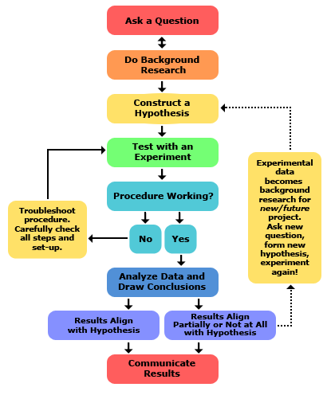

:data-transition-duration: 1000
:data-width: 1024
:data-height: 768
:skip-help: true
:css: ./style.css ./mp.css
:substep: true
:slide-numbers: true

----

Methodology and presentation
========================================
Ahmad Yoosofan

University of Kashan

----

What is a research paper
============================
It is a paper that
----------------------------
* Present an Original approach to some academic topic
* Organized around a central thesis
* Using insights based on research
* citing sources in scholarly fashion

----

Academic paper
================

----

Original Approach
====================
Own idea
-------------

----

Primary and Secondary Sources
===================================
As you do your background reading, look for research sources that help to answer your research question and either
-----------------------------------------------------------------------------------------------------------------------
• strengthen
• challenge
• modify
• illustrate

----

* Primary sources are “raw materials” that directly reflect the topic you are writing about. They are usually created by participants or others who lived at the time of the events you are writing about.

* Secondary sources are reports of the research done by other people into your topic. They are usually written after the events you are writing about by people who didn’t participate in or witness those events

----

Your First Source: The Library
=================================
• Books
• Periodicals
• Other printed materials
• Non-printed materials
• Computer access to Internet sources

----

The World of Reference Materials
======================================
Here are nine main categories of reference materials
-----------------------------------------------------------
• Encyclopedias (general and specialized)
• Biographical dictionaries
• Periodical indexes
• Dictionaries of quotations and concordances
• Atlases and gazetteers
• Chronologies
• Dictionaries (general and specialized)
• Handbooks and sourcebooks
• Bibliographies

----

Scholars
============
Building new knowledge
---------------------------
* Universitiy
* research centers
* journalists

Practice of reading and writing

----

Why learning how to write a research paper
==============================================
* draw information from several sources
* Practical life reasons

  * economics
  * any kind of decisions
  * Understanding how to analyze, evaluate, criticize, combine, and draw conclusions
  * Who is telling truth
  * Even buying a house can be research

----

The Definition of a Research Paper
=======================================
A research paper is a paper that
---------------------------------------
• presents an original approach to some academic topic,
• organized around a central thesis,
• using insights based on research, and
• citing sources in a scholarly fashion.

----

The Hierarchy of a Research Paper
====================================
.. image:: img/TheHierarchyofaResearchPaper.png

----

Subject
===========
1. Look at the Table of Contents in the textbook for the course you’re studying. Which chapter, part, or section names cover people, things, places, events, or ideas that you have found especially interesting? Your subject could be one of these general areas.
2. Take a stroll through the library or bookstore, paying careful attention to books, periodicals, and other media that are related to the course you’re studying. Your subject could be one of the general areas covered by these materials.
3. Ask your teachers or professors for some guidance: In their experience, what sorts of sub-jects have their most successful students covered in their research papers? What sorts ofsubjects have they rarely seen a research paper cover but would find most interesting

----

Topic(I)
==========
1. Think about an important turning point in the events within your subject. Your topic could relate to the causes or effects of this turning point.
2. Think about some fact you discovered that surprised you about your subject, something that thwarted your expectations. What made it surprising? Why did you expect something else? Your topic could relate to why your expectations were wrong.
3. Think about an oversimplification that is commonly made regarding your subject. Your topic could relate to the complexitities that undermine this oversimplification.
4. Think about a trend or “story” that connects several different events within your subject. Your topic could relate to connecting these events together, tracing the trend or “story” along the way.

----

Topic(II)
===============
5. Think about two or more situations or personalities within your subject that have qualities that are either similar or different. What caused them to have these qualities? What effects did these qualities have? Your topic could relate to comparing and/or contrasting these situations or personalities
6. Take a stroll through the library or bookstore, paying careful attention to books, periodicals, and other media that are related to the course you’re studying. When you find an interesting topic that is only addressed in about a dozen or so materials, consider addressing a similar or related topic in your research paper.
7. Ask your teachers or professors for some guidance: In their experience, what sorts of topics have their most successful students covered in their research papers? What sorts of topics have they rarely seen a research paper cover but would find most interesting?

----

Topic(III)
===========
* Your topic shouldn’t be so broad that literally hundreds of books or articles have been written about it (in which case it would be too broad, and thus large enough to be considered a subject).
* Your topic shouldn’t be so narrow that only a handful of books or articles have been written about it (in which case it would be too narrow, and thus you would not be able to locate sufficient research sources)

----

A good topic
====================
• is not merely a narrative
• is not too broad
• is not too narrow
• has research sources
• has not been overdone
• interests you

----

Question
============
Your research question is just the question or “puzzle” about the topic that your research paper will attempt to answer or solve
------------------------------------------------------------------------------------------------------------------------------------

----

Thesis
=========
A working thesis is a hypothetical answer to your research question — one that will guide you during your research. It probably won’t be the exact thesis you’ll discuss in your final research paper, but it might be.

A good working thesis
------------------------
• can be stated in a single clear sentence,
• is a positive, non-obvious statement, and
• can be tested through research.

----

Bibliographical data to record for any sources that might potentially be helpful
=====================================================================================
• Call number
• Name of the author/editor
• Title and subtitle
• Edition/volume/issue numbers
• Place of publication
• Name of the publisher
• Copyright date
• Chapter/section/column/page numbers
• Features of the book that seem promising (especially bibliographies)

----

The Preliminary Bibliography
=====================================
Your preliminary bibliography should include

* A few current and complete background books.
* The most important primary sources — described if not named.
* A few key secondary sources

----

Search Engines and Meta Search Engines
=======================================
* `Google <google.com>`_
* `presearch.org <https://presearch.org>`_
* `duckduckgo.com <https://duckduckgo.com/>`_
* `privado <https://www.privado.com/>`_
* `Yahoo <search.yahoo.com>`_
* `Bing <bing.com>`_
* `Ask.com <ask.com>`_
* `AltaVista <altavista.com>`_
* `Gigablast <gigablast.com>`_
* `Dogpile <dogpile.com>`_
* `MetaCrawler <metacrawler.com>`_

.. :

  * LookSmart ® [looksmart.com]
  * `Alexa <alexa.com>
  https://ahrefs.com/blog/google-advanced-search-operators/
  https://trends.google.com/trends/?geo=IR
  https://dmoz-odp.org/
  https://en.wikipedia.org/wiki/List_of_web_directories

----

* filetype: pdf
* copyright:
* "Strict phrase"
* `-` does not occure
* regular expression
* ( ) + or and 
* refine results based on date and other options
* site: yoosofan.github.io
* 

----

:class: t2c

Scientific Online Library
==============================
* https://scholar.google.com/
* https://www.ipl.org/
* https://www.answers.com/
* https://www.dictionary.com/
* https://www.thesaurus.com/
* https://www.wikipedia.org/
* https://news.google.com/
* https://doaj.org/
* https://refdesk.com/
* https://loc.gov/
* https://www.infoplease.com/

.. container::

  * http://lii.org/
  * http://digital-librarian.com/
  * https://archive.org/
  * http://archive.is/
  * https://www.researchgate.net
  * https://www.academia.edu/
  * https://archive-it.org/
  * https://news.ycombinator.com/
  * https://books.google.com
  * https://citeseerx.ist.psu.edu/
  * https://www.sciencedirect.com/

.. :

  https://en.wikipedia.org/wiki/List_of_web_directories
  https://en.wikipedia.org/wiki/List_of_Yahoo!-owned_sites_and_services#Defunct_Yahoo!_services
  https://trends.google.com/trends/?geo=IR
  https://dmoz-odp.org/Computers/Internet/Searching/Search_Engines/

  https://arxiv.org/pdf/1808.06226.pdf
  https://github.com/google/sentencepiece
  https://aclanthology.org/K18-2017/?ref=https://githubhelp.com
  https://arxiv.org/abs/1903.11508
  https://www.sciencedirect.com/science/article/pii/S1053811921002755
  https://d1wqtxts1xzle7.cloudfront.net/64052117/12%2010183-with-cover-page-v2.pdf?Expires=1645973416&Signature=TbSeTcaBdDC6Xjs1GL-QZGG5zRG6P4T8iWguNJSBRGpflkoqg8pjznwEaXVQISS1fzKyGVybUp5eDuqfSH~B5hUARrEO7j6JWuHBfWivmpVb60LKYERhs-lSD9KM5NO0pwTAo0hxNtR47dh4iPmAS5DfiFP0-xyXLD-3m7jFem57N-IMbeSVxNNuKi~9dQyzGA0VNVwgShddmRq34Ri03LEyjBIUCDa2uIJYn2rUcU~0Y9dHVjFuljyEfA4KQts8Ysxw99~5rTdaB8o26IgRkODlT092D6Mu5cz5KPCQ7TjrvCoqRRAUCarwiAyPkVoAxwOgCGCznb~EG4fHLKE~ow__&Key-Pair-Id=APKAJLOHF5GGSLRBV4ZA
  https://www.isca-speech.org/archive_v0/Interspeech_2019/pdfs/1418.pdf
  
----

Article Samples
====================
My articles

----

Article Formats
=====================

----

Persian Scientific Online Library
====================================
* https://www.sid.ir/
* https://ricest.ac.ir/
* https://en.civilica.com
* https://irandoc.ac.ir/

----

Bibliographic Tools
==========================
* Organise citation
    #. Zotero (https://www.zotero.org/)
    #. Mendely (https://www.mendeley.com/)
    #. https://endnote.com/
* Other Tools
    #. https://www.mybib.com/
    #. https://zbib.org/
    #. https://www.bibme.org
    #. https://www.citationmachine.net
    #. https://www.citefast.com
    #. https://docear.org/
    #. https://www.bibliography.com/

----

Forms of Scientific Publications
====================================
* Book
* Thesis
* Article

----

Book
========================
.. class:: substep

* A form of publication
* Most people are familiar with
* Does not contain new results
* Does not provide evidence for the correctness of the information they present.
* Collect information and present it in
    * an accessible
    * readable form

* Textbooks are generally better written than papers.
* Established scientific knowledge

----

TextBook
===============
* Mostly for undergraduate students
* However, there are excellent books for graduate students

----

Thesis
===========
* Mostly University thesis
* deep or definitive exploration of a single problem
* More inclusive than papers may include
    * Uninteresting failures,
    * Invalid hypotheses,
    * Misconceptions, and
    * Experimental mistakes
* objective addition to scientific knowledge
* not a description of the path that was taken to the result
* Style is not just about how to write, but is also about what to say

----

:class: t2c

Journal Paper
=================
.. class:: substep

* End product of the research process
* A careful presentation of new ideas
* That has been revised according to suggestions or criticisms of
    * referees
    * colleagues
* Consists of
    * Arguments,
    * evidence,
    * experiments,
    * proofs, or
    * Background required to support and explain a central hypothesis
* content of a paper must be
    * defended and
    * justified

.. container:: substep

  .. class:: substep
  
  * The process of research that leads to a paper can include
      * Uninteresting failures,
      * Invalid hypotheses,
      * Misconceptions, and
      * Experimental mistakes
      * With few exceptions these do not belong in a paper.
  * objective addition to scientific knowledge
  * not a description of the path that was taken to the result
  * Style is not just about how to write, but is also about what to say

----

A paper in conference proceedings
=====================================
.. class:: substep

* End-product
* To report work in progress.
* Limited opportunities for
    * iteration
    * revision
* Maybe constrained by strict length limits

.. container:: substep

  .. class:: substep

    extended abstract
    
    * Omitting detail of the work
    * review the results of a research program
    * may not include enough detail to make a solid argument for the claims.

----

purpose of reviewing
=======================
.. class:: substep

* attempt to ensure that papers published in a reputable journal or conference are
    * trustworthy and
    * high-quality work
* Witing is not the end of the research process, but instead shapes it

----

skepticism (scepticism)
============================
.. container:: yoo-grid-auto-flow-column

  .. image:: img/skeptic-community.jpg
    :width: 200px

  .. class:: substep

  * A questioning attitude or doubt towards one or more putative instances of knowledge which are asserted to be mere belief or dogma
  * A unifying principle for the scientific culture that determines the value of research
  * A skeptic seeks the most accurate description or solution that fits the known facts
  * without concern for issues such as the need to seek favour with authorities
  * Most scientists test the reliability of certain kinds of claims by subjecting them to a systematic investigation using some type of the scientific method
  * *pseudoscience*: Improperly apply or ignore the fundamental aspects of the scientific method
  * Absolute skepticism is unsustainable
  * *credulity* is pointless
  * Impossible for knowledge to progress without some degree of questioning

.. :

  https://en.wikipedia.org/wiki/Skepticism
  zobel

----

Steps of the Scientific Method(I)
===================================

----

:class: t2c

Steps of the Scientific Method(II)
===================================
.. class:: substep 

1. Ask a Question 
    * Your Question
    * Laboratory Notebook
2. Do Background Research
    * Background Research Plan
    * Finding Information
    * Bibliography
    * Research Paper
3. Construct a Hypothesis
    * Variables
    * Variables for Beginners
    * Hypothesis

.. class:: substep 

.. raw:: html

  <ol start="4" class="substep">
    <li class="substep">Test Your Hypothesis by Doing an Experiment
      <ul class="substep">
        <li class="substep">Experimental Procedure</li>
        <li class="substep">Materials List</li>
        <li class="substep">Conducting an Experimen</li>
      </ul>
    </li>
    <li class="substep">Analyze Your Data and Draw a Conclusion
      <ul class="substep">
        <li class="substep">Data Analysis & Graphs</li>
        <li class="substep">Conclusions</li>
      </ul>
    </li>
    <li class="substep">Communicate Your Results
      <ul class="substep">
        <li class="substep">Final Report</li>
        <li class="substep">Abstract</li>
        <li class="substep">Display Board</li>
        <li class="substep">Science Fair Judging</li>
      </ul>
    </li>
  </ol>

.. :

  https://www.sciencebuddies.org/science-fair-projects/science-fair/steps-of-the-scientific-method
 
----

Steps of the Scientific Method(III)
===================================
.. class:: substep

#. Formation of a precise question, the answer to which will satisfy the aim of the research
#. Development of a detailed understanding, through reading and critical analysis of scientific literature and other resources
#. Gathering of evidence that relates to the question, through experiment, analysis,or theory. These are intended to support—or disprove—the hypothesis underlying the question
#. Linking of the question and evidence with an argument, that is, a chain of reasoning
#. Description of the work in a publication.

----

End

.. :

  خانه‌ای
  نیم‌فاصله
  shift+space , ctrl+shift+2 , alt+157

  گیومهٔ فارسی
  shift+k
  shift+l

  page break
  تورفتگی هر پاراگراف درون متن بجز نخستین پاراگ

  https://www.slideserve.com/emmet/cmsc-601-writing-3  
  Presentation Transcript

    CMSC 601:Writing 3 Adapted from slides by Prof. Marie desJardins March 2011

    Sources • Justin Zobel, Writing for Computer Science: The Art of Effective Communication. Singapore: Springer-Verlag, 1997. (Chapters 4-6) • Leslie Lamport, LaTeX: A Document Preparation System (2/e), Addison-Wesley, 1994

    Outline • LaTeX resources and formats • Publishing in Word, Google Docs, HTML, ebook formats • Punctuation (chapter 4) • Mathematics (chapter 5) • Graphs and figures (chapter 6)

    Aside Why are we talking so much about the mechanics of formatting documents? We are craftsmen and craftswomen Our main products are software (or maybe hardware) and papers What about ideas? -- made manifest in papers You need to become competent in mastering the tools of your craft While ideas > writing > layout, all are important

    LaTeX Websites • The Simplified LaTeX beginner’s guide and tutorialhttp://www.ctan.org/tex-archive/info/simplified-latex/ • The LaTeX Wikibookhttp://en.wikibooks.org/wiki/LaTeX • LaTeX Project home page: http://www.latex-project.org/ • The UK TeX FAQ: http://www.tex.ac.uk/cgi-bin/texfaq2html/ • CTAN: the Comprehensive TeX Archive Network: http://www.ctan.org/ • Peter Flynn's Beginner's LaTeX:http://158.110.32.35/LATEX/beginlatex.pdf • The AMS Short Math Guide for LaTeX: ftp://ftp.ams.org/pub/tex/doc/amsmath/short-math-guide.pdf • Keith Reckdahl, Using Imported Graphics in LaTeX2eftp://ctan.tug.org/tex-archive/info/epslatex.pdf

    Conference/Journal Formats Most of the more established journals and conferences provide latex style/class and bibliography files for authors to use, e.g. • JAIR format (jair.sty, theapa.bst) • Journal of Web Semantics (Elsevier) • AAAI format (aaai.sty, aaai.bst) • SIGGRAPH format (acmsiggraph.sty, acmsiggraph.bst) • ISWC format (Springer’s LNCS style)

    Using Microsoft Word Confession: I’ve been using Word for ~15 years and I still feel like a novice RTFM? TL;DR I have read Lamport’s book and lots of other LaTeX documentation Why is that? I don’t know Maybe: Word is designed for the typical computer user; LaTeX is designed for scientists and publishers

    IMHO on Word • We’re stuck with it. Lean to use it effectively • It’s really great in many, many ways • Track changes, comments, collaboration • WYSIWYG has its advantages • It’s wonderful for some types of documents • letter, flyer, brochure, extended abstract, etc. • It’s often the lowest common denominator for a collaboration group

    Word Advice • Learn how to create, use and modify a Word Template • E.g., don’t add blank lines between paragraphs or headings but built it into the template • This ensures consistency in your document and helps the layout algorithm do the right thing • Learn to add a table of contents • Learn to add cross-references • Invest in a reference management package like EndNote

    Word Advice: Figures • Keeping figures where you want them is always tricky, even in LaTeX • Here’s what I’ve learned for Word • Always add a text box • Put the figure in the text box • Add a caption after the figure • Adjust the properties of the text box, figure and caption as appropriate • It’s often best to fix the text box to be at the top or bottom of the page and to not move with the text

    What about Google Docs? • This is still developing • Must be online • Not appropriate for traditional papers • poor control over layout, templates, pagination, typesetting, etc. • Great for collaboration, especially simultan-eous, parallel editing

    What about HTML? • The W3C publishes its documents (e.g., recom-mendations, working group notes) in HTML • They also do all slides in HTML • See slidy for slides in hrml and xhtml • Also not good for traditional papers • poor control over layout, templates, pagination, typesetting, etc. • Great for Web publishing and avoids proprietary formats (word, pdf, ps)

    Punctuation

    Serial Commas • Commas on both sides of a parenthetical remark •  The equation, which was formatted badly, was confusing. •  The equation that was formatted badly was confusing. • The equation which was formatted badly, was confusing. •  The equation, that was formatted badly, was confusing. • Use final commas in lists • Commas, colons and semicolons must be used properly. •  Commas, colons, and semicolons must be used properly. • But the serial comma is a bit controversial • This is ambiguous: To my mother, Ayn Rand, and God • Standard in Chicago Manual of Style, not in AP style manual • Just be consistent

    Commas: Example •  “Sentences should usually be short but commas and other marks give text variety” (Zobel p. 60). •  “Sentences should usually be short, but commas and other marks give text variety” (Zobel p. 60). •   “Sentences should usually be short, but commas and other marks add variety to text” (Zobel p. 60).

    Commas, Colons, and Semicolons • Colons connect related statements and introduce lists • I know one use of a colon, it joins related statements. •  I know one use of a colon; it joins related statements. •  I know one use of a colon: it joins related statements. •  A colon is usually used for two things, to connect related statements and introducing lists. •  A colon is usually used for two things: to connect related statements and to introduce lists.

    Commas vs. Semicolons: Example •  “Reading of mathematics is difficult at the best of times, unpleasant work if the mathematics is badly presented, and pointless if the mathematics does not make sense.” •  “Reading of mathematics is difficult at the best of times: unpleasant work if the mathematics is badly presented, and pointless if the mathematics does not make sense.” •  “Reading of mathematics is difficult at the best of times; it is unpleasant work if the mathematics is badly presented; and it is pointless if the mathematics does not make sense.”

    Hyphenation • Hyphenate word combinations that serve as adjec-tives, especially when needed to avoid ambiguity •  Squad helps dog bite victim. (Does the dog really need any help?) •  Squad helps dog-bite victim. (That was nice of them.) • Don’t hyphenate word combinations that include adverbs •  ...there are well-established conventions...” (Zobel p. 69) • ...there are well established conventions...” (Zobel p. 69) • Don’t hyphenate word combinations serving as nouns •  High-speed memory is needed for real-time performance. •  The memory runs at high-speed.

    that vs which • Use that for restrictive relative clauses • “A computer that was in the lobby was stolen” • The relative clause identifies which computer • Use which for non-restrictive relative clauses • “A computer, which was in the lobby, was stolen” • The relative clause provides additional information about the computer • Both can be used together • “A computer that was in the lobby, which we purchsed last month, was stolen”

    Don’t Use Exclamation Points! •  Especially not two of them!! •  Or even more!!!!

    Pluralization •  Machine learning became popular in the 1990’s. •  Machine learning became popular in the 1990s.

    Capitalization • Be consistent •  Either Use All Caps in Your Headings •  Or use initial caps •  But please Don’t mix initial caps and All Caps • Names of techniques are rarely capitalized •  We introduce the Texture Mapping rendering method. •  We introduce the texture mapping rendering method. •  We introduce the texture mapping rendering method. •  We introduce the texture mapping method of rendering.

    Punctuation and Quotation Marks • I disagree with Zobel •  He “place[s] a punctuation mark inside the quotation mark only when it was used in the original text”. •  He “place[s] a punctuation mark inside the quotation mark only when it was used in the original text.”

    Mathematics

    Theorems • Number all theorems • Theorems should stand alone (i.e., not be part of the surround text) • Indent or otherwise mark them clearly • Give a summary of the theorem and proof approach before launching into lemmas and detailed proof • Omit unimportant details • Leave out arithmetic manipulations

    Equations • Center or indent equations to stand out from the text • Avoid long sequences of mathematical formulae in the text • Number equations only if they are needed for later reference • Some people suggest numbering all equations for reviewing purposes • Treat displayed equations as part of the sentence in which they are embedded • Explain your math • Avoid unnecessary notation and acronyms

    Notation • Be consistent, standard, and simple! • Notation often requires several revisions before you get it right • Explicitly introduce your notation • Don’t just start using it • Try to avoid recursive subscripts or combined subscripts and superscripts • Avoid “obscure” Greek letters • Don’t reuse symbols for different meanings

    Numbers • Spell out numbers less than 10 (or 20?) • ...except when used mathematically • ...except for percentages • Make sure the semantics of percentages and units are clear and unambiguous •  There was a 5% increase in performance. •  Performance increased by 5%, from 65 to 68 correct answers. •  The performance accuracy increased by 5%, from 65% to 70%.

    Graphs and Figures

    Figures and Graphs • Figures are great, but should convey meaning • System architecture diagrams often add no information • Figures make a paper more interesting to read, engaging both sides of the brain • Graphs are generally better than tables • Be selective in which data to include • Use clear legends, axis labels, and line types • Colored lines, different types of dashes, and different tick marks on lines generally won’t reproduce well in B&W • Different line thicknesses are generally good, if there are only two or three types • Inspect the graphs in their actual size and context • I recommend captions of one or several sentences

    Algorithms • Use commented pseudocode • I find Zobel’s pseudocode too close to real code • I find his “prosecode” far too wordy • Don’t include unnecessary detail • Using a comment column is sometimes helpful • use “tabular” environment in LaTeX • Use math mode, not \verbatim • Try using the algorithm2e package in LaTeX!

    Generating Figures and Graphs • Figures: • xfig • dia • latex • PowerPoint • Word plus screenshot • Graphs: • Matlab • Gnuplot • Excel

    LaTeX Figures • \usepackage{graphicx} • \begin{figure} \centering \includegraphics{figfile} \caption{Put Caption Here} \label{fig:key}\end{figure} • Graphics formats: (at least) JPG, PNG, PDF… • (If you’re using pdflatex. With latex and dvips, only embedded PostScript (eps) figures are supported. This can be confusing…)
