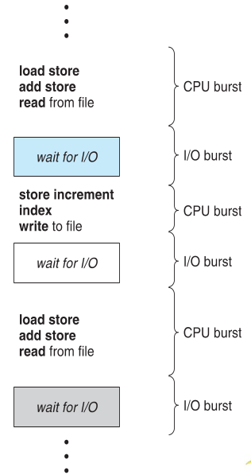

:data-transition-duration: 1000
:skip-help: true
:css: ./style.css ./cpu.css
:substep: true
:slide-numbers: true
:skip-help: true
:data-width: 1024
:data-height: 768

.. title: CPU Scheduling

.. role:: raw-html(raw)
   :format: html

.. |nbsp| unicode:: 0xA0 

.. :

   :trim:

----

CPU Scheduling
===============================================
Ahmad Yoosofan
-----------------------------
https://yoosofan.github.io

University of Kashan

https://github.com/yoosofan/slide/blob/main/os/cpu.rst

----

:class: t2c

CPU Burst / Service Time
==============================
* cpu utilization by multiprogramming
* cpu - I/O cycle of a process
* cpu : burst time, service time
* I/O : or other blocking events like memory request

----

CPU Schedular
================
Short Term Schedular
----------------------

* ready queue
* Dispatcher

.. image:: img/in/process_state_chart.png

----

Time Unit Concept
==================
* Millisecond
* Nanosecond
* ?

Scheduling type
----------------
* nonpreemptive
* preemptive

----

:class: t2c

Processes Table
==========================
.. csv-table::
  :header: process, service(Burst) time
  :class: center

  :math:`P_0`, 3
  :math:`P_1`, 2
  :math:`P_2`, 1
  :math:`P_3`, 2

.. csv-table::
  :header: process, service time, arrival time
  :class: substep center

  :math:`P_0`, 3, 0
  :math:`P_1`, 2, 0
  :math:`P_2`, 1, 3
  :math:`P_3`, 2, 5

.. csv-table::
  :header: prs, st
  :class: substep center

  :math:`P_0`, 3
  :math:`P_1`, 2
  :math:`P_2`, 1
  :math:`P_3`, 2

.. csv-table::
  :header: pcs, st, at
  :class: substep center

  :math:`P_0`, 3, 0
  :math:`P_1`, 2, 0
  :math:`P_2`, 1, 3
  :math:`P_3`, 2, 5

----

:class: t2c

First-Come, First-Served (FCFS)
==================================
.. csv-table::
  :header: process, service time, arrival time
  :class: center
  
  :math:`P_0`, 2, 0
  :math:`P_1`, 1 ,0
  :math:`P_2`, 2, 3
  :math:`P_3`, 1, 4

.. csv-table::
    :class: yoo-gantt-chart-set-width-based-on-data

    |nbsp| P0 |nbsp| |nbsp|, , |nbsp| P1 |nbsp| , , |nbsp| P2 |nbsp| |nbsp|, , |nbsp| P3 |nbsp|
    0, ,                              2, ,                 3, ,                        5, ,     6 

*  Gantt Chart
*  t = 0: ready queue(q) = [:math:`P_0`, :math:`P_1`]
*  t = 2: q = [:math:`P_1`]
*  t = 3: q = [:math:`P_2`]
*  t = 5: q = [:math:`P_3`]

.. :

    .. container:: yoo-gantt-chart

        .. class:: withborder 

        * 
        * :math:`P_0`
        * 
        * :math:`P_1`
        * 
        * :math:`P_2`
        * 
        * :math:`P_3`
        * 

        .. class:: yoo-x-numbers

        * 0
        * 
        * 2
        * 
        * 3
        * 
        * 5
        * 
        * 6

    ----

    :class: t2c

    .. csv-table::
      :class: yoo-gantt-chart-set-width-based-on-data

      :raw-html:`&nbsp;&nbsp;` :math:`P_0` :raw-html:`&nbsp;&nbsp;`, ,:raw-html:`&nbsp;` :math:`P_1` :raw-html:`&nbsp;`, ,:raw-html:`&nbsp;&nbsp;` :math:`P_2` :raw-html:`&nbsp;&nbsp;`, , :raw-html:`&nbsp;` :math:`P_3` :raw-html:`&nbsp;`,
      0, , 2, , 3, , 5, , 6 

    .. csv-table::
      :class: yoo-gantt-chart-set-width-based-on-data

      |nbsp| |nbsp| :math:`P_0` |nbsp| |nbsp|, ,|nbsp| :math:`P_1` |nbsp|, ,|nbsp| |nbsp| :math:`P_2` |nbsp| |nbsp|, , |nbsp| :math:`P_3` |nbsp|,
      0, , 2, , 3, , 5, , 6 

    .. csv-table::
      :class: yoo-gantt-chart-set-width-based-on-data44

      :math:`P_0` , ,:math:`P_1` , , :math:`P_2` , , :math:`P_3` ,
      0, , 2, , 3, , 5, , 6 

----

:class: t2c

Average Waiting Time
==================================
.. csv-table::
  :header: process, service time, arrival time
  :class: center
  
  :math:`P_0`, 2, 0
  :math:`P_1`, 1 ,0
  :math:`P_2`, 2, 3
  :math:`P_3`, 1, 4

.. csv-table::
    :class: yoo-gantt-chart-set-width-based-on-data

    |nbsp| P0 |nbsp| |nbsp|, , |nbsp| P1 |nbsp| , , |nbsp| P2 |nbsp| |nbsp|, , |nbsp| P3 |nbsp|
    0, ,                              2, ,                 3, ,                        5, ,     6 

.

.. class:: substep

*  :math:`P_0` waiting time: 0
*  :math:`P_1` waiting time: 2
*  :math:`P_2` waiting time: (3-3) = 0
*  :math:`P_3` waiting time: (5-4) = 1
*  *Average Waiting Time*: :math:`\frac{0 + 2 + 0 + 1}{4} = \frac{3}{4} = 0.75`
 
----

:id: FCFS-Convoy-effect-id

.. :

  short process behind long process

FCFS - Convoy effect
=========================
.. csv-table::
  :header: process, service time, arrival time
  :class: center

  :math:`P_0`, 4, 0
  :math:`P_1`, 6 ,0
  :math:`P_2`, 1, 3
  :math:`P_3`, 3, 4

.. container:: yoo-gantt-chart 

    .. class:: withborder 

    * 
    * :math:`P_0`
    * 
    * :math:`P_1`
    * 
    * :math:`P_2`
    * 
    * :math:`P_3`
    * 

    .. class:: yoo-x-numbers

    * 0
    * 
    * 4
    * 
    * 10
    * 
    * 11
    * 
    * 14

    .. class:: substep

        *Average Waiting Time 1*: :math:`\frac{0 + (4-0) + (10-3) + (11-4)}{4} = \frac{18}{4} = 4\frac{2}{4} = 4.5`

        *Rearange*

    .. class:: withborder substep

    * 
    * :math:`P_0`
    * 
    * :math:`P_2`
    * 
    * :math:`P_3`
    * 
    * :math:`P_1`
    * 

    .. class:: yoo-x-numbers

    * 0
    * 
    * 4
    * 
    * 5
    * 
    * 8
    * 
    * 14

    .. class:: substep

    *Average Waiting Time 2*: :math:`\frac{0 + (4-3) + (5-4) + 8}{4} = \frac{10}{4} = 2\frac{2}{4} = 2.5`

.. class:: substep

* *Average Waiting Time* 1: 4.5
* *Average Waiting Time* 2: 2.5
* 1: FCFS
* 2: Shortest Job First(SJF) or Shortest Process Next(SPN)

----

:id: sjf-spn-id

:class: t2c

Shortest Job First or Shortest Process Next (SJF/SPN) :math:`\frac{1}{s}`
-------------------------------------------------------------------------
.. csv-table::
  :header: process, service time, arrival time
  :class: center
  
  :math:`p_0`, 6, 0
  :math:`p_1`, 4, 0
  :math:`p_2`, 1, 3
  :math:`p_3`, 3, 4

.. container:: 

    Shortest Job First / Shortest Process Next

    .. container:: yoo-gantt-chart 

        .. class:: withborder substep

        * 
        * :math:`P_1`
        * 
        * :math:`P_2`
        * 
        * :math:`P_3`
        * 
        * :math:`P_0`
        * 

        .. class:: yoo-x-numbers

        * 0
        * 
        * 4
        * 
        * 5
        * 
        * 8
        * 
        * 14

        .. class:: substep

        *Average Waiting Time*: :math:`\frac{0 + (4-3) + (5-4) + 8}{4} = \frac{10}{4} = 2\frac{2}{4} = 2.5`

.. class:: substep

* Starvation
* Nonpreemptive
* formula : 1 / (service time)

----

:id: srt-id

Shortest Remaining Time(SRT), preemptive SJF
================================================
.. csv-table::
  :header: process, service time, arrival time
  :class: center
  
  :math:`p_0`, 4, 0
  :math:`p_1`, 6 ,0
  :math:`p_2`, 1, 1
  :math:`p_3`, 3, 2

.. container:: yoo-gantt-chart 

    .. class:: withborder 

    * 
    * :math:`P_0`
    * 
    * :math:`P_1`
    * 
    * :math:`P_2`
    * 
    * :math:`P_3`
    * 

    .. class:: yoo-x-numbers

    * 0
    * 
    * 4
    * 
    * 10
    * 
    * 11
    * 
    * 14

    .. class:: substep

        *Average Waiting Time 1*: :math:`\frac{0 + (4-0) + (10-1) + (11-2)}{4} = \frac{22}{4} = 5\frac{2}{4} = 5.5`

        *Rearange*

    .. class:: withborder substep

    * 
    * :math:`P_0`
    * 
    * :math:`P_2`
    * 
    * :math:`P_0`
    * 
    * :math:`P_3`
    * 
    * :math:`P_1`
    * 

    .. class:: substep yoo-x-numbers

    * 0
    * 
    * 1
    * 
    * 2 
    * 
    * 5
    * 
    * 8
    * 
    * 14

    .. class:: substep

    *Average Waiting Time 2*: :math:`\frac{(0+(2-1)) + (8-0) + (1-1) + (5-2)}{4} = \frac{12}{4} = 3`

.. class:: substep

* *Average Waiting Time* 1: 5.5
* *Average Waiting Time* 2: 3
* 1: FCFS
* 2: Shortest Job First(SJF) or Shortest Process Next(SPN)

----

:class: t2c

Hieghest Response Ratio Rate Next (HRRN) :math:`\frac{w + s}{s}`
=================================================================
.. csv-table::
  :header: process, service time, arrival time
  :class: center
  
  :math:`p_0`, 5, 0
  :math:`p_1`, 3, 1
  :math:`p_2`, 4, 2
  :math:`p_3`, 2, 6

.. container::

    .. list-table::
        :class: borderless 
    
        * - t = 0 |nbsp| 
          - .. csv-table::
              :class: yoo-gantt-chart-set-width-based-on-data

              |nbsp| |nbsp| :math:`P_0`  |nbsp| |nbsp|
              0, , 5 

          - |nbsp| queue : P1, P2, P3

        * - t = 5 |nbsp|

          - .. csv-table::
              :class: yoo-gantt-chart-set-width-based-on-data

              |nbsp| |nbsp| :math:`P_0`  |nbsp| |nbsp|, , |nbsp| :math:`P_1`  |nbsp|
              0, , 5, , 8
            
          - queue : P2 P3
            
.. container::

    #. P2: :math:`\frac{( 8 - 2 ) + 4}{4} = \frac{6+4}{4} = \frac{10}{4}`
    #. P3: :math:`\frac{( 8 - 6 ) + 2}{2} = \frac{2+2}{2} = \frac{4}{2} = \frac{8}{4}`

    .. list-table::
        :class: borderless 
    
        * - t = 8 |nbsp| 

          - .. csv-table::
              :class: yoo-gantt-chart-set-width-based-on-data

              |nbsp| |nbsp| :math:`P_0`  |nbsp| |nbsp|, , |nbsp| :math:`P_1`  |nbsp| , , |nbsp|  |nbsp| :math:`P_2` |nbsp|
              0, , 5, , 8, ,12
      
          - queue : P3
      
.. container::

     .. list-table::
        :class: borderless 
    
        * - HRRN |nbsp| 

          - .. csv-table::
              :class: yoo-gantt-chart-set-width-based-on-data

              |nbsp| |nbsp| :math:`P_0`  |nbsp| |nbsp| , , |nbsp| :math:`P_1`  |nbsp| , , |nbsp|  |nbsp| :math:`P_2` |nbsp| , , :math:`P_3` |nbsp|
              0, , 5, , 8, ,12, , 14
      
        * - SJF |nbsp| 

          - .. csv-table::
              :class: yoo-gantt-chart-set-width-based-on-data

              |nbsp| |nbsp| :math:`P_0`  |nbsp| |nbsp| , , |nbsp| :math:`P_1`  |nbsp| , , |nbsp| :math:`P_3` |nbsp| , , |nbsp| :math:`P_2` |nbsp|
              0, , 5, , 8, ,10, , 14
      
Average Waiting Time

HRRN: :math:`\frac{0+(5-1)+(8-2)+(12-6)}{4}=\frac{16}{4}=4`

SJF: :math:`\frac{0+(5-1)+(8-6)+(10-2)}{4}=\frac{14}{4}=\frac{7}{2}=3.5`
  
----

Estimating Service Time(I)
=============================
.. class:: substep
 
#. .. math:: 
        :class: ltr

          \tau_n =  \frac{t_0 + t_1 + t_2 + ... + t_{n - 1}}{n}

#. .. math:: 
      :class: ltr

       n * \tau_n = t_0 + t_1 + t_2 + ... + t_{n - 1}

#. .. math::
      :class: ltr 
      
        \tau_{n+1} = \frac{t_0 + t_1 + t_2 + ... + t_{n - 1} + t_n}{n+1}

#. .. math::
      :class: ltr 
      
        = \frac{t_0 + t_1 + t_2 + ... + t_{n - 1} }{n+1} + \frac{t_n}{n+1}

#. .. math::
      :class: ltr 
      
      \tau_{n+1} = \frac{n * \tau_n}{n + 1} + \frac{t_n}{n+1}

#. .. math::
      :class: ltr 
      
      \tau_{n+1} = \frac{n}{n + 1} * \tau_n + \frac{1}{n+1} * t_n

----

Estimating Service Time(II)
=============================
.. class:: substep
 
#. .. math::
      :class: ltr 
      
      \tau_{n+1} = \frac{n}{n + 1} * \tau_n + \frac{1}{n+1} * t_n

#. .. math::
      :class: ltr 
      
      \tau_{n+1} = \frac{n + 1 - 1}{n + 1} * \tau_n + \frac{1}{n+1} * t_n

#. .. math::
      :class: ltr 
      
      \tau_{n+1} =  ( \frac{n + 1}{n + 1} - \frac{1}{n + 1} ) * \tau_n + \frac{1}{n+1} * t_n

#. .. math::
      :class: ltr 
      
      \tau_{n+1} =  ( 1 - \frac{1}{n + 1} ) * \tau_n + \frac{1}{n+1} * t_n

#. .. math::
      :class: ltr 
      
      \alpha = \frac{1}{n+1}

      \tau_{n+1} =  ( 1 - \alpha ) * \tau_n + \alpha * t_n

----

Estimating Service Time(III)
=============================
.. class:: substep
 
#. .. math::
    :class: ltr 
    
    \alpha = \frac{1}{n+1}\ , \  \tau_{n+1} =  ( 1 - \alpha ) * \tau_n + \alpha * t_n

#. .. math::
    :class: ltr 
    
    t_n = actual\ length\ of\ n^{th}\ service\ time

#. .. math::
    :class: ltr 
    
    \tau_{n+1} = predicted\ value\ for\ the\ next\ service\ time
 
#. .. math::
    :class: ltr 
    
    0 ≼ \alpha ≼ 1 \ , \ \tau_{n+1} =  ( 1 - \alpha ) * \tau_n + \alpha * t_n

#. .. math::
    :class: ltr 
   
    \alpha → 0 

----

:class: t2c

Round Robin (RR , quantum) I
============================
.. csv-table::
  :header: process, service time, arrival time
  :class: center
  
  :math:`p_0`, 5, 0
  :math:`p_1`, 3, 1
  :math:`p_2`, 4, 2
  :math:`p_3`, 2, 6

.. list-table::
    :class: borderless 

    * - time quantum or q = 2 , 
      - Queue (Q): Empty 

    * - t = 0 , Q: P0 |nbsp|
      - .. csv-table::
          :class: yoo-gantt-chart-set-width-based-on-data

          :math:`P_0` |nbsp| 
          0, , 2

    * - t=2, Q: P1(3), P2(4), P0(3)

      - .. csv-table::
          :class: yoo-gantt-chart-set-width-based-on-data

          :math:`P_0` |nbsp| , , :math:`P_1` |nbsp|
          0, , 2, , 4 

    * - t=4, Q:P2(4), P0(3), P1(1)

      - .. csv-table::
          :class: yoo-gantt-chart-set-width-based-on-data

          :math:`P_0` |nbsp| , , :math:`P_1` |nbsp| , , :math:`P_2` |nbsp|
          0, , 2, , 4 , ,6

.. container::

        t=6, Q: P0(3), P1(1), P3(2), P2(2)

        .. csv-table::
          :class: yoo-gantt-chart-set-width-based-on-data

          :math:`P_0` |nbsp| , , :math:`P_1` |nbsp| , , :math:`P_2` |nbsp| , , :math:`P_0` |nbsp|
          0, , 2, , 4 , ,6 , , 8

        t=8, Q: P1(1), P3(2), P2(2), P0(1)

        .. csv-table::
          :class: yoo-gantt-chart-set-width-based-on-data

          :math:`P_0` |nbsp| , , :math:`P_1` |nbsp| , , :math:`P_2` |nbsp| , , :math:`P_0` |nbsp|  , , :math:`P_1` 
          0, , 2, , 4 , ,6 , , 8, , 9

.. container::

    t=9, Q: P3(2), P2(2), P0(1)

    .. csv-table::
      :class: yoo-gantt-chart-set-width-based-on-data

      :math:`P_0` |nbsp| , , :math:`P_1` |nbsp| , , :math:`P_2` |nbsp| , , :math:`P_0` |nbsp|  , , :math:`P_1`, ,  :math:`P_3` |nbsp| 
      0, , 2, , 4 , ,6 , , 8, , 9, ,11

    t=11, Q: P2(2), P0(1)

    .. csv-table::
      :class: yoo-gantt-chart-set-width-based-on-data

      :math:`P_0` |nbsp| , , :math:`P_1` |nbsp| , , :math:`P_2` |nbsp| , , :math:`P_0` |nbsp|  , , :math:`P_1`, ,  :math:`p_3` |nbsp| , ,  :math:`p_2` |nbsp| 
      0, , 2, , 4 , ,6 , , 8, , 9, ,11, , 13

.. container::

    t=13, Q: P0(1)

    .. csv-table::
      :class: yoo-gantt-chart-set-width-based-on-data

      :math:`P_0` |nbsp| , , :math:`P_1` |nbsp| , , :math:`P_2` |nbsp| , , :math:`P_0` |nbsp|  , , :math:`P_1`, ,  :math:`p_3` |nbsp| , ,  :math:`p_2` |nbsp|  , ,  :math:`p_0` 
      0, , 2, , 4 , ,6 , , 8, , 9, ,11, , 13, , 14

----

:class: t2c

Round Robin (RR) II
===================
.. csv-table::
  :header: process, service time, arrival time
  :class: center
  
  :math:`p_0`, 5, 0
  :math:`p_1`, 3, 1
  :math:`p_2`, 4, 2
  :math:`p_3`, 2, 6

.. container::

    t=11, Q: P2(2), P0(1)

    - .. csv-table::
        :class: yoo-gantt-chart-set-width-based-on-data

        :math:`P_0` |nbsp| , , :math:`P_1` |nbsp| , , :math:`P_2` |nbsp| , , :math:`P_0` |nbsp|  , , :math:`P_1`, ,  :math:`p_3` |nbsp| , ,  :math:`p_2` |nbsp| 
        0, , 2, , 4 , ,6 , , 8, , 9, ,11, , 13

    t=13, Q: P0(1)

    - .. csv-table::
        :class: yoo-gantt-chart-set-width-based-on-data

        :math:`P_0` |nbsp| , , :math:`P_1` |nbsp| , , :math:`P_2` |nbsp| , , :math:`P_0` |nbsp|  , , :math:`P_1`, ,  :math:`p_3` |nbsp| , ,  :math:`p_2` |nbsp|  , ,  :math:`p_0` 
        0, , 2, , 4 , ,6 , , 8, , 9, ,11, , 13, , 14

Average Waiting Time

.. container::

    :math:`\frac{[0+(6-2)+(13-8)]+[(2-1)+(8-4)]+[(4-2)+(11-6)]+[9-6]}{4}`
    
    = :math:`\frac{9+5+7+3}{4} = \frac{24}{4} = 6`
    
    

----

:class: t2c

Priority
========
#. Internal
#. External

* smallest integer ≡ highest priority
* largest integer  ≡ highest priority

#. preemptive (absolute)
#. non-preemptive (relative)

* Starvation
    * Aging

nice [-20 , 19]

.. code:: sh

    root@computer-name:~# nice --5 geany
    root@computer-name:~# ps -l 
    root@computer-name:~# top 
    user@computer-name:~# nice -n 8 geany

renice

.. code:: sh

  user@computer-name:~# renice 10 -p 19862    
  user@computer-name:~# renice -n 15 -p 19862    
  
.. :

    https://www.scaler.com/topics/linux-nice/
    
----

:class: t2c

Relative Priority
=================
.. csv-table::
  :header: process, service time, arrival time, Priority
  :class: center
  
  P0, 2, 0, 4
  P1, 3, 1, 3
  P2, 1, 2, 3
  P3, 2, 5, 1

.. list-table::
    :class: borderless
    
    * - t=0, Q: P0(2,4)
      - .. csv-table::
          :class: yoo-gantt-chart-set-width-based-on-data
    
          P0 |nbsp| , ,
          0, , 2
    *  - t=2, Q: P1(3,3), P2(1,3) 
       - .. csv-table::
          :class: yoo-gantt-chart-set-width-based-on-data
    
          P0 |nbsp| , ,  |nbsp| P1  |nbsp|
          0, , 2, , 5

.. container::

    t=5, Q: P2(1,3), P3(2,1)

    .. csv-table::
      :class: yoo-gantt-chart-set-width-based-on-data

      P0 |nbsp| , ,  |nbsp| P1  |nbsp| , , P3
      0, , 2, , 5, , 7 

.. container::

    t=6, Q: P2(1,3)

    .. csv-table::
      :class: yoo-gantt-chart-set-width-based-on-data

      P0 |nbsp| , ,  |nbsp| P1  |nbsp| , , P3, , P2 |nbsp|
      0, , 2, , 5, , 7, , 8

.. :

    Average Waiting Time

    .. container::

        :math:`\frac{(0+(6-2)+(13-8))+((2-1)+(8-4))+((4-2)+(11-6))+(9-6)}{4}`
        
        = :math:`\frac{9+5+7+3}{4} = \frac{24}{4} = 6`
 
----

:class: t2c

Absolute Priority
=================
.. csv-table::
  :header: process, service time, arrival time, Priority
  :class: center
  
  P0, 2, 0, 4
  P1, 3, 1, 3
  P2, 1, 2, 3
  P3, 2, 5, 1

.. list-table::
    :class: borderless
    
    * - t=0, Q: P0(2,4)
      - .. csv-table::
          :class: yoo-gantt-chart-set-width-based-on-data
    
          P0
          0, , 2
    *  - t=1, Q: P1(3,3), P0(1,4) 
       - .. csv-table::
          :class: yoo-gantt-chart-set-width-based-on-data
    
          P0  , , |nbsp| P1  |nbsp|
          0, , 1, , 4
    *  - t=4, Q: P0(1,4), P2(1,3)
       - .. csv-table::
          :class: yoo-gantt-chart-set-width-based-on-data
    
          P0 , ,  |nbsp| P1  |nbsp|, , P2
          0, , 1, , 4, , 5

.. list-table::
    :class: borderless
    
    *  - t=5, Q: P0(1,4), P3(2,1)
       - .. csv-table::
          :class: yoo-gantt-chart-set-width-based-on-data
    
          P0 , ,  |nbsp| P1  |nbsp|, , P2, , P3 |nbsp|
          0, , 1, , 4, , 5, , 7
    *  - t=7, Q: P0(1,4)
       - .. csv-table::
          :class: yoo-gantt-chart-set-width-based-on-data
    
          P0 , ,  |nbsp| P1  |nbsp|, , P2, , P3 |nbsp|, , P0
          0, , 1, , 4, , 5, , 7, , 8

----

:class: t2c

Priority Round Robin
====================
.. csv-table::
  :header: process, service time, arrival time, Priority
  :class: center
  
  P0, 2, 0, 4
  P1, 3, 1, 3
  P2, 1, 2, 2
  P3, 2, 5, 1

.. list-table::
    :class: borderless

    * - t=0, Q: P0(2)

      - .. csv-table::
          :class: yoo-gantt-chart-set-width-based-on-data

          P0 , ,
          0, , 1 

    * - t=1, Q: P0(1,4), P1(3,3) 

      - .. csv-table::
          :class: yoo-gantt-chart-set-width-based-on-data

          P0 , , P1
          0, , 1, , 2

    * - t=2, Q: P0(1,4), P1(2,3), P2(1,2) 

      - .. csv-table::
          :class: yoo-gantt-chart-set-width-based-on-data

          P0 , , P1  , , P2
          0, , 1, , 2, , 3

.. list-table::
    :class: borderless

    * - t=3, Q: P0(1,4), P1(2,3) 

      - .. csv-table::
          :class: yoo-gantt-chart-set-width-based-on-data

          P0 , , P1 , , P2 , , P2
          0, , 1, , 2, , 3, , 5

    * - t=5, Q: P0(1,4), P3(2,1) 

      - .. csv-table::
          :class: yoo-gantt-chart-set-width-based-on-data

          P0 , , P1 , , P2 , , P2 , , P3 |nbsp|
          0, , 1, , 2, , 3, , 5, , 7

.. list-table::
    :class: borderless

    * - t=7, Q: P0(1,4) 

      - .. csv-table::
          :class: yoo-gantt-chart-set-width-based-on-data

          P0 , , P1 , , P2 , , P2 , , P3 |nbsp|, , P0
          0, , 1, , 2, , 3, , 5, , 7, , 8
 
----

:class: t2c

Multilevel Queue
=================
.. csv-table::
  :header: process, service time, arrival time
  :class: center
  
  :math:`p_0`, 5, 0
  :math:`p_1`, 3, 1
  :math:`p_2`, 4, 2
  :math:`p_3`, 2, 6

.. container::

    t=11, Q: P2(2), P0(1)

    - .. csv-table::
        :class: yoo-gantt-chart-set-width-based-on-data

        :math:`P_0` |nbsp| , , :math:`P_1` |nbsp| , , :math:`P_2` |nbsp| , , :math:`P_0` |nbsp|  , , :math:`P_1`, ,  :math:`p_3` |nbsp| , ,  :math:`p_2` |nbsp| 
        0, , 2, , 4 , ,6 , , 8, , 9, ,11, , 13

    t=13, Q: P0(1)

    - .. csv-table::
        :class: yoo-gantt-chart-set-width-based-on-data

        :math:`P_0` |nbsp| , , :math:`P_1` |nbsp| , , :math:`P_2` |nbsp| , , :math:`P_0` |nbsp|  , , :math:`P_1`, ,  :math:`p_3` |nbsp| , ,  :math:`p_2` |nbsp|  , ,  :math:`p_0` 
        0, , 2, , 4 , ,6 , , 8, , 9, ,11, , 13, , 14

Average Waiting Time

.. container::

    :math:`\frac{(0+(6-2)+(13-8))+((2-1)+(8-4))+((4-2)+(11-6))+(9-6)}{4}`
    
    = :math:`\frac{9+5+7+3}{4} = \frac{24}{4} = 6`
 
----

:class: t2c

Multilevel Queue Feedback (MLQF)
=================================
.. csv-table::
  :header: process, service time, arrival time
  :class: center
  
  :math:`P_0`, 5, 0
  :math:`P_1`, 3, 1
  :math:`P_2`, 4, 2
  :math:`P_3`, 2, 6

.. container::

    t=11, Q: P2(2), P0(1)

    - .. csv-table::
        :class: yoo-gantt-chart-set-width-based-on-data

        :math:`P_0` |nbsp| , , :math:`P_1` |nbsp| , , :math:`P_2` |nbsp| , , :math:`P_0` |nbsp|  , , :math:`P_1`, ,  :math:`p_3` |nbsp| , ,  :math:`p_2` |nbsp| 
        0, , 2, , 4 , ,6 , , 8, , 9, ,11, , 13

    t=13, Q: P0(1)

    - .. csv-table::
        :class: yoo-gantt-chart-set-width-based-on-data

        :math:`P_0` |nbsp| , , :math:`P_1` |nbsp| , , :math:`P_2` |nbsp| , , :math:`P_0` |nbsp|  , , :math:`P_1`, ,  :math:`p_3` |nbsp| , ,  :math:`p_2` |nbsp|  , ,  :math:`p_0` 
        0, , 2, , 4 , ,6 , , 8, , 9, ,11, , 13, , 14

Average Waiting Time

.. container::

    :math:`\frac{(0+(6-2)+(13-8))+((2-1)+(8-4))+((4-2)+(11-6))+(9-6)}{4}`
    
    = :math:`\frac{9+5+7+3}{4} = \frac{24}{4} = 6`
             
.. :
        #. P2: :math:`\frac{( 8 - 2 ) + 4}{4} = \frac{6+4}{4} = \frac{10}{4}`
        #. P3: :math:`\frac{( 8 - 6 ) + 2}{2} = \frac{2+2}{2} = \frac{4}{2} = \frac{8}{4}`

        .. list-table::
            :class: borderless 
        
            * - t = 8 |nbsp| 

              - .. csv-table::
                  :class: yoo-gantt-chart-set-width-based-on-data

                  |nbsp| |nbsp| :math:`P_0`  |nbsp| |nbsp|, , |nbsp| :math:`P_1`  |nbsp| , , |nbsp|  |nbsp| :math:`P_2` |nbsp|
                  0, , 5, , 8, ,12
          
              - queue : P3
          
    .. container::

         .. list-table::
            :class: borderless 
        
            * - HRRN |nbsp| 

              - .. csv-table::
                  :class: yoo-gantt-chart-set-width-based-on-data

                  |nbsp| |nbsp| :math:`P_0`  |nbsp| |nbsp| , , |nbsp| :math:`P_1`  |nbsp| , , |nbsp|  |nbsp| :math:`P_2` |nbsp| , , :math:`P_3` |nbsp|
                  0, , 5, , 8, ,12, , 14
          
            * - SJF |nbsp| 

              - .. csv-table::
                  :class: yoo-gantt-chart-set-width-based-on-data

                  |nbsp| |nbsp| :math:`P_0`  |nbsp| |nbsp| , , |nbsp| :math:`P_1`  |nbsp| , , |nbsp| :math:`P_3` |nbsp| , , |nbsp| :math:`P_2` |nbsp|
                  0, , 5, , 8, ,10, , 14
          
    Average Waiting Time

    HRRN: :math:`\frac{0+(5-1)+(8-2)+(12-6)}{4}=\frac{16}{4}=4`

    SJF: :math:`\frac{0+(5-1)+(8-6)+(10-2)}{4}=\frac{14}{4}=\frac{7}{2}=3.5`
      
----

#. *Scheduling Criteria*
    #. *CPU utilization* : keep the CPU as busy as possible
    #. *Throughput* : number of processes that complete their execution per time unit
    #. *Turnaround time* : amount of time to execute a particular process
    #. *Waiting time* : amount of time a process has been waiting in the ready queue
    #. *Response time* : amount of time it takes from when a request was submitted until the first response is produced, not output (for time-sharing environment)
#. *Optimization Criteria*
    #. Max CPU utilization
    #. Max throughput
    #. Min turnaround time
    #. Min waiting time
    #. Min response time

.. :

  * p0 :raw-html:`&nbsp&nbsp&nbsp` p1  p2
  * 0 :raw-html:`&nbsp&nbsp&nbsp&nbsp` 1 :raw-html:`&nbsp&nbsp` 2

----

END

