:data-transition-duration: 1000
:skip-help: true
:css: style.css
:substep: true

.. title: Operating System - Disk Management (By Ahmad Yoosofan)

:slide-numbers: true

.. role:: rtl
    :class: rtl

----

Operating System
==================
Disk management
------------------
Ahmad Yoosofan

Spring 2023

----

Disk
==================
Disk structure
------------------
.. image:: img/disk/disk_Moving_head_disk_mechanism.png
   :align: center

----

.. image:: img/disk/one_layer_disk.png
   :align: center

.. :

    https://www.javatpoint.com/coa-auxiliary-memory

----

SStorrage Areaa Network(SAN)
===================================
.. image:: img/disk/disk_Storage_area_network.png
   :align: center

----

File Management System
=============================
.

----

File Access Methods 
====================
* Sequential Access

* Random Access

----

Simple Access Disk
========================
.. image:: img/disk/disk_Example_of_index_and_relative_files.png

----

Simple Disk Organization
===========================
.. image:: img/disk/disk_A_typical_file_system_organization.png

----

One Level Structure of Folders
=================================
.. image:: img/disk/disk_Single_level_directory.png

----

Two Level Structure of Folders
=================================
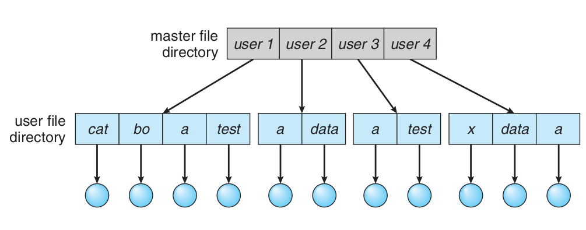

----

Acyclic Graph based Folder Structure
=======================================
.. image:: img/disk/disk_Acyclic_graph_directory_structure.png

----

General Graph based Folder Structure
======================================
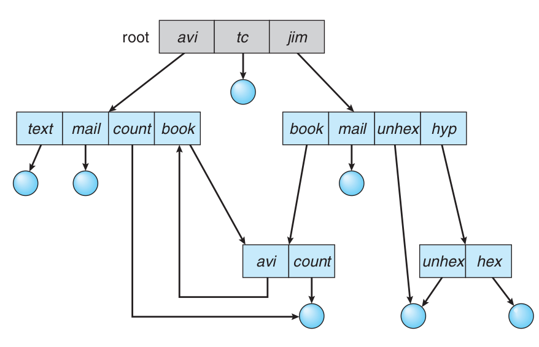

----

Multi Level File Structure
==================================
.. image:: img/disk/disk_Layered_file_system.png

----

Simple Control Block of a File
=====================================
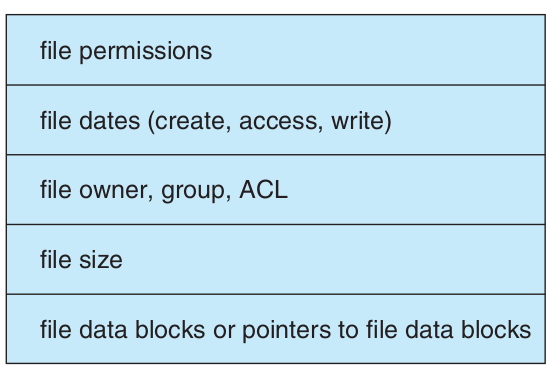

----

File struture in Main Memory
================================
.. image:: img/disk/disk_In_memory_file_system_structures_a_File_open_b_File_read.png

* (a) open file
* (b) close file

----

Schematic View of Virtual File System
===========================================
.. image:: img/disk/disk_Schematic_view_of_a_virtual_file_system.png

----

Allocation Files Methods
===========================
.

----

Contiguous Block Allocation
=============================
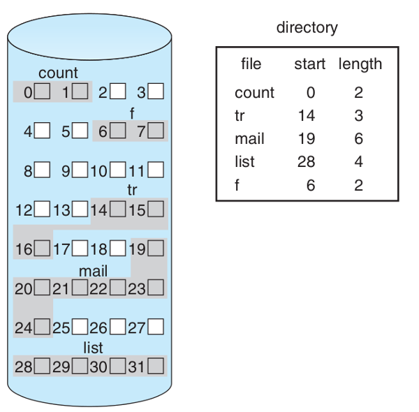

* External Fragmentation
* Adding Block to File
* Speed

----

List Block Allocation 
=============================
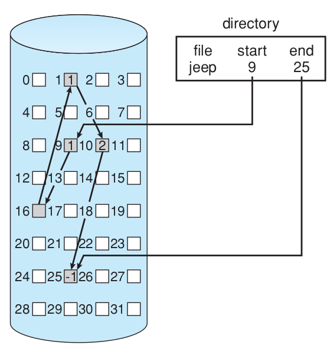

----

FAT Structure
========================
.. image:: img/disk/disk_File_allocation_table.png

----

Index Based Block Allocation
==============================
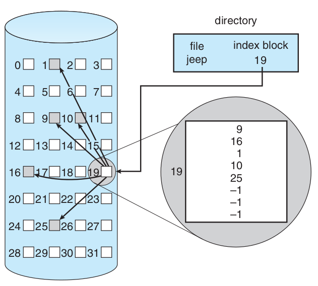

----

Contiguous Index Based Block Allocation
========================================
.. image:: img/disk/disk_Indexed_Allocation_with_Variable_Length_Portions.png

----

File Structure in Unix
=========================
.. image:: img/disk/disk_The_UNIX_inode.png

----

RAM in DISK
===========
.. image:: img/disk/compuram-ssd-performancetest-en.jpg

.. :

    https://www.compuram.de/blog/en/ram-upgrade-andor-ssd-drive-whats-the-benefit/
    https://en.wikipedia.org/wiki/Solid-state_drive

----

.. image:: img/disk/0fdaa514-25ae-494d-b4a6-4e1ca52633f1.jpg

.. :
    
    internal ssd disk ram hierarchy
    https://www.utmel.com/blog/categories/memory%20chip/solid-state-drive-ssd-classification-and-architecture
    https://www.diskmfr.com/know-how-internal-structure-details-of-solid-state-drives/

----
File Allocation Methods Comparison
---------------------------------------
.. note:

    .. image:: img/disk/disk_File_Allocation_Methods.png

.. class:: smallerelementwithfullborder

+----------------------------------+--------------+--------------+--------------+-----------+
| Method                           | Contiguous   | Chained      | Indexed                  |
+==================================+==============+==============+==========================+
| Preallocation?                   | Necessary    | Possible     | Possible                 |
+----------------------------------+--------------+--------------+--------------+-----------+
| Fixed or Variable Size Portions? | Variable     | Fixed blocks | Fixed blocks | Variable  |
+----------------------------------+--------------+--------------+--------------+-----------+
| Portion Size                     | Large        | Small        | Small        | Medium    |
+----------------------------------+--------------+--------------+--------------+-----------+
| Allocation Frequency             | Once         | Low To High  | High         | Low       |
+----------------------------------+--------------+--------------+--------------+-----------+
| Time to Allocate                 | Medium       | Long         | Short        | Medium    |
+----------------------------------+--------------+--------------+--------------+-----------+
| File Allocation Table Size       | One Entry    | One Entry    | Large        | Meduim    |
+----------------------------------+--------------+--------------+--------------+-----------+

----

Free Space Management
=======================
* How do we keep track free blocks on a disk?
* A free-list is maintained.  When a new block is requested, we search this list to find one.
* The following are commonly used techniques:
    * Bit Vector
    * Linked List
    * Linked List + Grouping
    * Linked List+Address+Count

----

List Based
=============
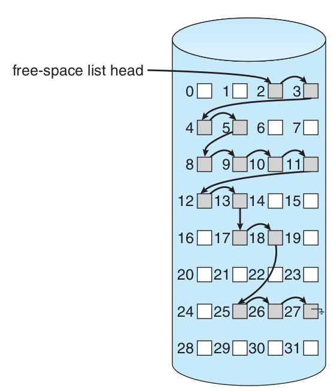

----

Bit Vector
===============
* Each block is represented by a bit in a table. Thus, if there are " n " disk blocks, the table has " n " bits.
* If a block is free, its corresponding bit is 1.
* When a block is needed, the table is searched.  If a 1 bit is found in position " k ", block " k " is free.
* If the disk capacity is small, the whole bit vector can be stored in memory. For a large disk, this bit vector will consume too much memory.
* We could group a few blocks into a clusterand allocate " clusters ". This saves space and may cause internal fragmentation.
* Another possibility is the use of a " summary table ".

----

Input Output Structure
========================
.
.. :

  https://en.wikipedia.org/wiki/I/O_scheduling
  https://computationstructures.org/lectures/interrupts/interrupts.html

----

Computer Bus
=================
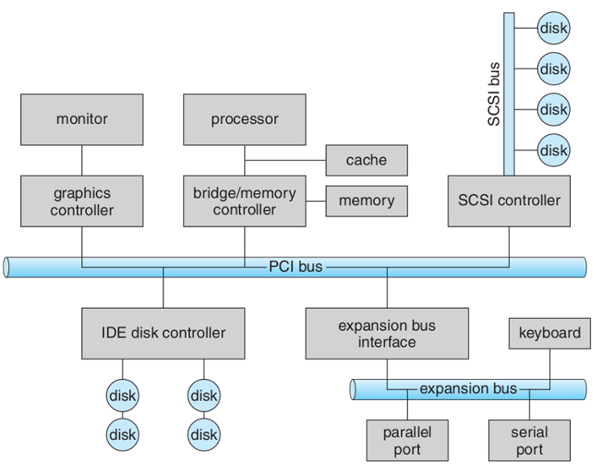

----

Hardware Ports
====================
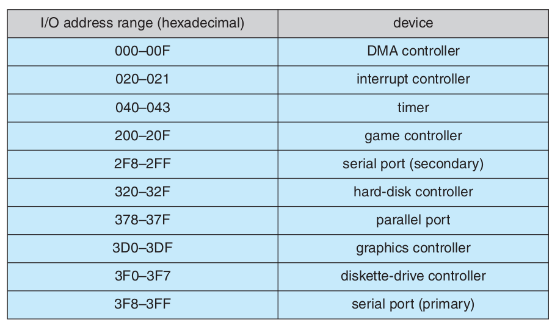

----

Status of Disk Requests
===========================
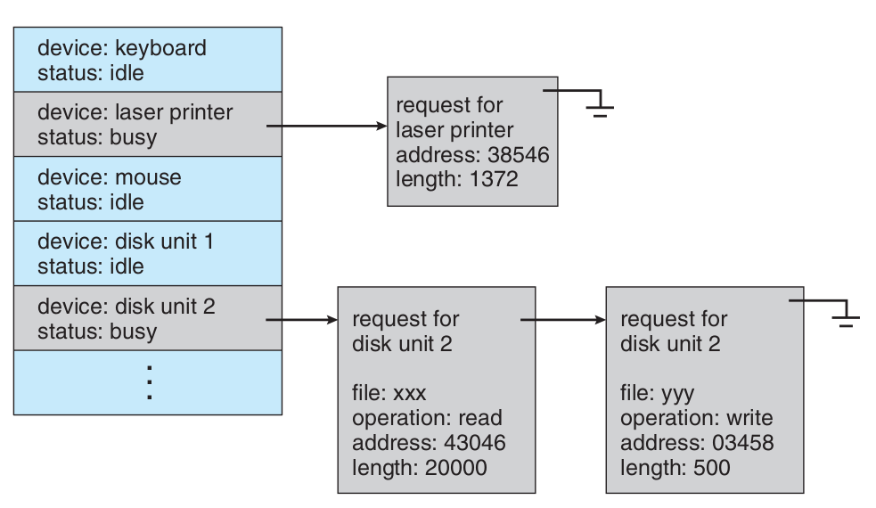

----

Linux Block I/O Stack
===========================
.. image:: img/disk/Linux_block_IO_stack.jpg
   :width: 600px

`informit <https://www.informit.com/articles/article.aspx?p=2995360>`_

----

Disk I/O OS Terminology
===========================
.. image:: img/disk/disk_io_operating_system_terminology.jpg
   :width: 900px
   :height: 600px

`informit <https://www.informit.com/articles/article.aspx?p=2995360>`_

----

Disk Arm Scheduling Algorithms
====================================
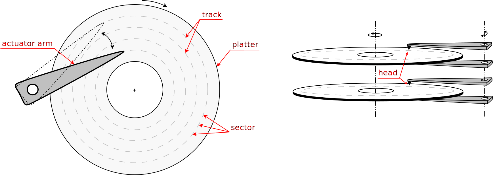

http://gudok.xyz/sspar/

----

Operations performed during random access
=================================================
.. image:: img/disk/hdd_random_operations.svg
   :width: 550px
   :height: 550px

http://gudok.xyz/sspar/

.. : related websites

  https://www.geeksforgeeks.org/difference-between-seek-time-and-rotational-latency-in-disk-scheduling/
  https://www.geeksforgeeks.org/hard-disk-drive-hdd-secondary-memory/
  https://www.programmersought.com/article/73491676920/

----

Important Disk Parameters
===========================
.. image:: img/disk/disk_important_parameters.png

* Seek Time
* Rotational Latency
* Transfer Time
* Disk Access Time
* Disk Response Time

----

:id: imporatnce-of-track-or-cylinder-id

Imporatnce of Track or Cylinder
=====================================
زمان پیگیرد یا زمان جستجو

Seek time

.. class:: rtl

  * درخواست‌های فرآیندها به بخش‌های مختلف دیسک اشاره می‌کند که مهم‌ترین پارامتر رفتن به سیلندر مورد نظر است.

  * پس سیستم عامل در پایین‌ترین سطح کار خود با دیسک  دنباله‌ای از درخواست‌های به سیلندرهای گوناگون را  زمان‌بندی می‌کند.

98, 183, 37, 122, 14, 124, 65, 67

----

FCFS
==========
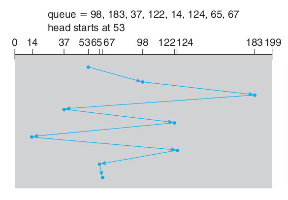

.. :

  .. image:: img/disk/disk_FCFS_disk_1.png

----

SSTF
======
.. image:: img/disk/disk_SSTF_disk_scheduling.png

----

SCAN
======
.. image:: img/disk/disk_SCAN_disk_scheduling.png

----

C-SCAN
========
.. image:: img/disk/disk_C_SCAN_disk_scheduling.png

.. : Further Reading

  https://arxiv.org/pdf/1403.0334.pdf

----

LOOK
=====
.. image:: img/disk/LOOKllLOOK.png

----

C-LOOK
=======
.. image:: img/disk/c_look.png

.. :

  https://www.gatevidyalay.com/look-algorithm-disk-scheduling-algorithms/

----

F-SCAN
========
.

----

N-Step Scan
==============
.

----

چند الگوریتم زمان‌بندی دیسک
============================================
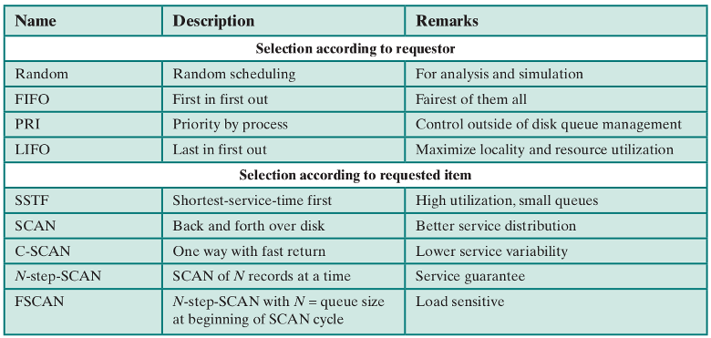

----

نمونه‌ای از مقایسهٔ چند الگوریتم
==============================================
.. image:: img/disk/disk_Comparison_of_Disk_Scheduling_Algorithms2.png

----

انجام ورودی/خروجی‌ها
=======================================================================================================
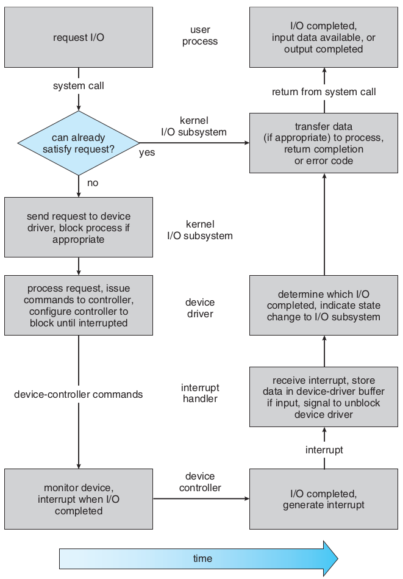

----

RAID
=======================================================================================================
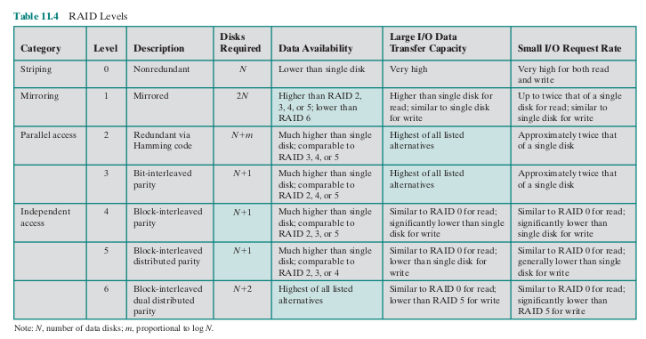

----

.. comments:

    hovercraft disk.slide.rst
    hovercraft disk.slide.rst disk.slide/
    rst2html.py disk.slide.rst disk.slide.html --stylesheet=../../tools/farsi.css,html4css1.css
    https://www.geeksforgeeks.org/disk-scheduling-algorithms/
    http://www.csl.mtu.edu/cs4411.choi/www/Resource/chap11.pdf

    https://www.slideshare.net/J.T.A.JONES/disk-scheduling
    img/disk/disk-scheduling-general-view.png
    
    
    https://www.geeksforgeeks.org/transforming-of-i-o-requests-to-hardware-operations/
    https://medium.com/@bundetcom/understanding-disk-scheduling-947f67f2b160
    pyq.ravindrababuravula.com/topic/?tp=Disk-Scheduling
    https://www.gatevidyalay.com/look-algorithm-disk-scheduling-algorithms/
    https://www.gatevidyalay.com/disk-scheduling-disk-scheduling-algorithms/
    https://www.gatevidyalay.com/sstf-algorithm-disk-scheduling-algorithms/
    https://www.gatevidyalay.com/scan-algorithm-disk-scheduling-algorithms/
    https://www.gatevidyalay.com/c-scan-disk-scheduling-disk-scheduling/
    https://www.gatevidyalay.com/disk-scheduling-disk-scheduling-algorithms/
    https://www.javatpoint.com/os-look-and-c-look-scheduling
    https://www.geeksforgeeks.org/look-disk-scheduling-algorithm/
    nixchun.pixnet.net/blog/post/7989498
    https://www.gatevidyalay.com/look-algorithm-disk-scheduling-algorithms/
    https://www.geeksforgeeks.org/disk-scheduling-algorithms/
    https://prepinsta.com/operating-systems/disk-scheduling-algorithms/
    http://www.cs.iit.edu/~cs561/cs450/disksched/disksched.html
