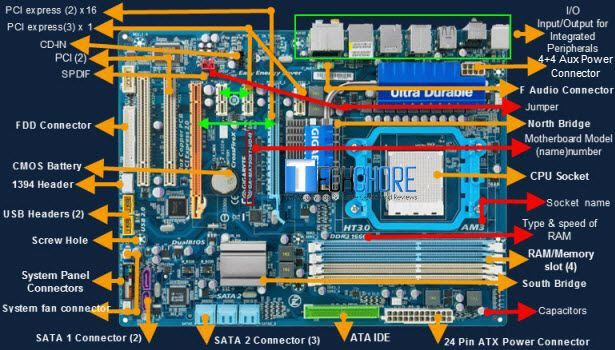
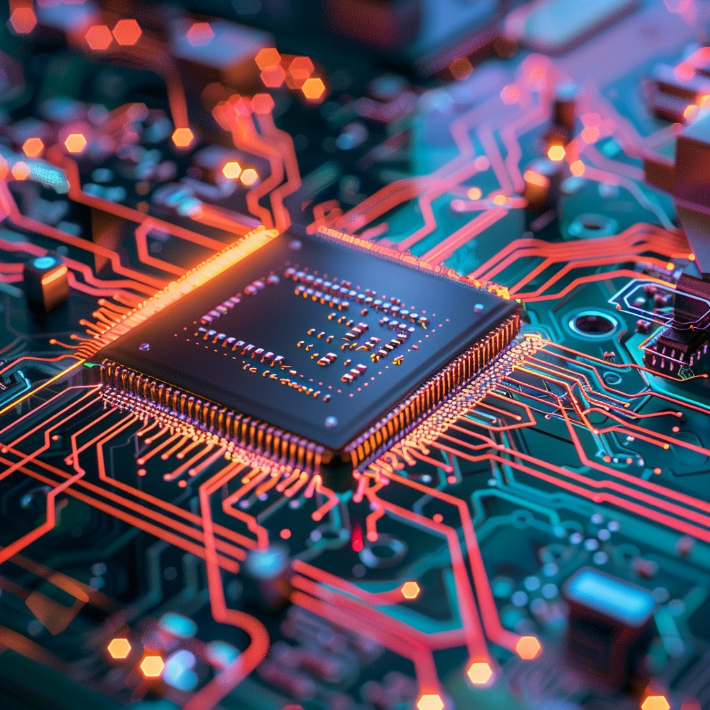

:data-transition-duration: 1000
:data-width: 1024
:data-height: 768
:skip-help: true
:css: ./style.css
:substep: true

.. title: Operating System (By Ahmad Yoosofan)

:slide-numbers: true

.. role:: raw-html(raw)
   :format: html

.. |nbsp| unicode:: 0xA0

.. role:: rtl
    :class: rtl

.. note::

    The assembly code examples in this section were developed with assistance
    from DeepSeek AI to demonstrate Morris Mano computer architecture concepts.

----

Operating Systems
======================
Ahmad Yoosofan

University of Kashan

https://yoosofan.github.io/en/

Introduction
-------------

-----

:class: t2c

Course Review
=============
* Introduction
* Process
    * Multiprogramming
    * multithread
    * Synchronization
    * Deadlock
    * Eavluation
* Secondary Storage
    * Disks
    * file organization

.. container::

    * Main Memory
        * Absolute Address
        * Relative Address
        * paging
        * Virtual Memory
        * segmentation
        * segmentation and paging combinations
        * Invert table

-----

Making an imaginary computer step by step
=========================================
Finding more about how hardware and software works
---------------------------------------------------
#. It needs to go back to principles
#. It provides clear path for what we already have
#. Understanding that why computers works this way nowadays

-----

The Abacus and Counting Board
==============================
* https://en.wikipedia.org/wiki/Abacus

.. image:: img/in/Schoty_abacus.jpg

-----

Mechanical Calculator
=====================
Pascaline
----------
* A Pascaline signed by Pascal in 1652
* https://en.wikipedia.org/wiki/Pascaline

.. image:: img/in/Pascaline-CnAM_823-1-IMG_1506-black.jpg

-----

Jacquard Machines
==================
* Joseph Marie Jacquard in 1804
* based on
    * the Frenchmen Basile Bouchon (1725)
    * Jean Baptiste Falcon (1728)
    * Jacques Vaucanson (1740).[8]
* https://en.wikipedia.org/wiki/Jacquard_machine

.. image:: img/in/A_Jacquard_loom_showing_information_punchcards,_National_Museum_of_Scotland.jpg

-----

Mechanical Computer
=======================
* https://en.wikipedia.org/wiki/Mechanical_computer
* `Charles Babbage <https://en.wikipedia.org/wiki/Charles_Babbage>`_
* `Ada Lovelace <https://en.wikipedia.org/wiki/Ada_Lovelace>`_

.. image:: img/in/Babbage_Difference_Engine.jpg

-----

Analog Computer
================
* https://en.wikipedia.org/wiki/Analog_computer
* Polish analog computer AKAT-1 (1959)

.. image:: img/in/513px-AKAT-1.jpg

-----

Analog vs Digital
==================
* https://en.wikipedia.org/wiki/Capacitance
* https://www.geeksforgeeks.org/difference-between-analog-computer-and-digital-computer/

.. math::

    i(t) = C \frac{dv(t)}{dt}

-----

Electro Mechanical
===================
* `Konrad Zuse <https://en.wikipedia.org/wiki/Konrad_Zuse>`_
    * `Z1(1936) <https://en.wikipedia.org/wiki/Z1_(computer)>`_
          * Programmable
          * binary
          * electrically motor-driven mechanical computer
    * `Z2(1940) <https://en.wikipedia.org/wiki/Z2_(computer)>`_
* `Harvard Mark I(1944) <https://en.wikipedia.org/wiki/Harvard_Mark_I>`_

.. image:: img/in/Z1__640px-German_Museum_of_Technology,_Berlin_2017_024.jpg

-----

Digital Computer
================
* `Vacuum-tube computer <https://en.wikipedia.org/wiki/Vacuum-tube_computer>`_
* `Atanasoff–Berry computer <https://en.wikipedia.org/wiki/Atanasoff%E2%80%93Berry_computer>`_
    * neither programmable, nor Turing-complete
* `Colossus computer <https://en.wikipedia.org/wiki/Colossus_computer>`_
    * British code breakers
    * programmable
    * electronic
    * digital computer
    * programmed by switches and plugs
    * not by a stored program

.. image:: img/in/640px-Colossus_Mark2codebreaking1943.jpg

----

Stored Program
===============
* `Manchester Mark I <https://www.britannica.com/technology/digital-computer>`_
* `The 1946 ENIAC computer used more than 17,000 vacuum tubes <https://en.wikipedia.org/wiki/Vacuum-tube_computer>`_
* `bootstrap_computer_history <https://cs.nyu.edu/courses/summer17/CSCI-UA.0004-002/bootstrap_computer_history_new/index.html>`_
* `oldest-original-working-digital-computer <https://www.tnmoc.org/news-releases/2012/11/30/the-worlds-oldest-original-working-digital-computer>`_

.. image:: img/in/527px-ENIAC_Penn2.jpg

.. :

    analog hardware design for deep learning model

-----

Analog Chipsets for AI Applications
====================================
* `Developers Turn To Analog For Neural Nets <https://semiengineering.com/developers-turn-to-analog-for-neural-nets/>`_
* `Texas Instuments <https://www.ti.com/tool/TIDA-010955>`_
* `IIC <https://indianexpress.com/article/cities/bangalore/iisc-develops-design-framework-to-build-next-generation-analog-chipsets-for-ai-applications/>`_
* `Analog Neural Circuit and Hardware Design of Deep Learning Model <https://www.sciencedirect.com/science/article/pii/S1877050915022644>`_
* `The Promise of Analog Deep Learning: Recent Advances, Challenges and Opportunities <https://arxiv.org/html/2406.12911v1>`_
* `Harnessing Analog Hardware for Machine Learning <https://openreview.net/pdf?id=PkduOOJOZA>`_
* `Developers Turn To Analog For Neural Nets <https://semiengineering.com/developers-turn-to-analog-for-neural-nets/>`_

.. image:: img/in/TID-010955-Texax-Instruments.jpg

----

:class: t2c

General Types of Computers
===========================
* Analog Computer
    * pros
    * cons
* Digital Computer
    * pros
    * cons
* Quantum Computer
    * pros
    * cons
* Biocomputing
    * pros
    * cons

.. image:: img/in/ibm-quantum-system-one-ces-2020_50252942522_o_jpg.webp
   :height: 400px

.. :

    https://newsroom.clevelandclinic.org/2023/03/20/cleveland-clinic-and-ibm-unveil-first-quantum-computer-dedicated-to-healthcare-research
    https://en.wikipedia.org/wiki/Quantum_computing

    https://en.wikipedia.org/wiki/Wafer_(electronics)
    https://f450c.org/infographic/

    In electronics, a wafer (also called a slice or substrate)[1] is a thin slice of semiconductor, such as a crystalline silicon (c-Si, silicium), used for the fabrication of integrated circuits and, in photovoltaics, to manufacture solar cells.

    The wafer serves as the substrate for microelectronic devices built in and upon the wafer. It undergoes many microfabrication processes, such as doping, ion implantation, etching, thin-film deposition of various materials, and photolithographic patterning. Finally, the individual microcircuits are separated by wafer dicing and packaged as an integrated circuit.

-----

Imaginary Computer (YIC-10)
=============================
Different memory for code and data
----------------------------------
.. image::  img/in/seperate_code_data.png

----

.. image::  img/in/hex_keyboard.png

----

.. image::  img/in/Keypad-with-ATmega32.jpg

----

.. image::  img/in/breadboard.png

----

Real Motherboard
==================

.. :

    https://www.techchore.com/parts-motherboard-functions/

----

Motherboard Circut
===================

.. :

    https://stockcake.com/i/advanced-circuit-board_401034_571186

----

.. image::  img/in/cpu_e2prom.png

----

The Second Computer (YIC-10)
============================
Uniform memory (John von Neumann)
----------------------------------
.. list-table::

    * - .. image::  img/in/simple_execution_cycle.png

      - .. image:: img/in/John_von_Neumann.jpg

.. :

        https://commons.wikimedia.org/wiki/File:John_von_Neumann.jpg

----

.. image::  img/in/simple_cpu02.png

----

:class: t2c

Assembly Code and Machine Code
==============================
.. code:: asm

    ADD A,B

    A = A + B

    ; 0101011  00010101 0101010

    OPcode    DATA_1    DATA_2
    ADD          A               B

.. code:: asm

    R1 = R2 + R3
    ADD R1, R2, R3

    ; 010101001 0001 0010 0011

    OP Code     R1    R2    R3

    010101001000100100011

----

.. image::  img/in/simple_cpu_hex_keypad02.png

----

Main Type of Processors
==========================
* RISC (Reduced instruction set computer)
    * https://en.wikipedia.org/wiki/Reduced_instruction_set_computer
* CISC (Complex Instruction Set Computer)
    * https://en.wikipedia.org/wiki/Complex_instruction_set_computer

----

Hardware vs Software
==========================
* pros
    * Less code
    * More speed
    * Less errors of writing code
* cons
    * Cost
    * Less Flexible

----

:class: t2c

The common segment displays
==============================
* `Seven-segment_display <https://en.wikipedia.org/wiki/Seven-segment_display>`_
* `9 Segments Display <https://en.wikipedia.org/wiki/Nine-segment_display>`_
* `Fourteen-segment display <https://en.wikipedia.org/wiki/Fourteen-segment_display>`_
* `Sixteen-segment display <https://en.wikipedia.org/wiki/Sixteen-segment_display>`_

.. container::

    .. image:: img/in/9_segment_abcdefghi.svg

    .. image:: img/in/16-segmente_display.png

.. :

    * https://en.wikipedia.org/wiki/Nine-segment_display
    * https://en.wikipedia.org/wiki/Fourteen-segment_display
    * https://en.wikipedia.org/wiki/Sixteen-segment_display

----

Epson WideCarriage Line Printer
=======================================
.. image:: img/in/Epson_Wide_Carriage_9pin_printer_with_legal_paper_8.5x14.jpg
  :height: 400px

https://en.wikipedia.org/wiki/Dot_matrix_printing

----

Dot matrix example text
============================
.. image:: img/in/Epson_line_printer_Dot_matrix_example_text.png

https://en.wikipedia.org/wiki/Dot_matrix_printing

----

Dot-matrix display
======================
.. image:: img/in/16x2_Character_LCD_Display.jpg
  :height: 400px

* 128×16 (Two-lined)
* 128×32 (Four-lined)
* 128×64 (Eight-lined)
* 92×31 (Four or three-lined)
* https://en.wikipedia.org/wiki/Dot-matrix_display
* https://en.wikipedia.org/wiki/History_of_display_technology

----

1969 Braille display
=======================
.. image:: img/in/1969_Braille_display.jpg
  :height: 400px

* https://en.wikipedia.org/wiki/History_of_display_technology

----

split flap display(I)
======================
.. image:: img/in/split_flap_displayI.jpg
  :width: 600px

http://arduinomania.com/tag/split%20flap%20display

----

Split-flap display(II)
=======================
.. image:: img/in/Split-flap_display_2016-01-17.gif
  :height: 400px

* https://en.wikipedia.org/wiki/Split-flap_display
* https://www.dreamstime.com/illustration/airport-flip-sign.html

----

Enlarged inner workings of a split-flap clock
===================================================
.. image:: img/in/1024px-Split-flap_display.jpg
  :height: 400px

* https://en.wikipedia.org/wiki/Split-flap_display

----

Airport Board with Split-Flip Display
=======================================
.. image:: img/in/airport_board_with_flip-flop_display.jpg
  :height: 400px

* https://en.wikipedia.org/wiki/Split-flap_display

----

Flip-Dot-Display
======================
.. image:: img/in/Flip-dots_display.jpg
  :width: 800px

* https://en.wikipedia.org/wiki/History_of_display_technology
* https://en.wikipedia.org/wiki/Flip-disc_display

----

5x7 LED module
==================
.. image:: img/in/5x7led.jpg
  :height: 400px

* https://www.nutsvolts.com/magazine/article/create-an-led-sign-controller

----

Tape
==========
.. image:: img/in/computer.room.tape.png
  :height: 500px

----

Xerox Roman PS Daisywheel
========================================
.. image:: img/in/Xerox_Roman_PS_Daisywheel_mono.jpg
  :height: 450px

.. :

  https://upload.wikimedia.org/wikipedia/commons/0/0e/Xerox_Roman_PS_Daisywheel_-_mono.jpg

----

Royal Typewriter Company since 1906
===========================================
.. image:: img/in/Loyal_royal_typewriter.jpg

https://en.wikipedia.org/wiki/Royal_Typewriter_Company

----

IBM Selectric Typewriter 1961(I)
=================================
.. image:: img/in/IBM_Selectric_Typewriter_1961.jpg
  :height: 400px

* https://en.wikipedia.org/wiki/IBM_Selectric_typewriter

----

IBM Selectric Typewriter 1961 (II)
=========================================
.. image:: img/in/IBM_Selectric_Typewriter_1961_typeball.jpg
  :height: 400px

* https://en.wikipedia.org/wiki/List_of_IBM_products#Typewriters

----

Simple computer simulator
==============================
* https://github.com/jeaniehandler/OS
* https://github.com/Naheel-Azawy/Simple-Computer-Simulator
* https://web.njit.edu/~carpinel/Applets.html
* http://www.science.smith.edu/dftwiki/index.php/IBooks
* http://www.science.smith.edu/dftwiki/index.php/

Simple Computer Simulator Instruction Set
------------------------------------------------
* http://euler.vcsu.edu/curt.hill/Computer.html

----

YIC120 - Adding Keyboard & Disk
==================================
* terminal (command prompt)
* batch system
* interactive system

----

.. image:: img/in/kernel1process.png
   :align: center

----

When a controller rapidly turns on LEDs in one row at a time
===============================================================
.. image:: img/in/5x7led_B_refresh.jpg
  :width: 750px

https://www.nutsvolts.com/magazine/article/create-an-led-sign-controller

.. :

  8x8 dot matrix display
  https://www.circuitstoday.com/interfacing-dot-matrix-led-display-to-8051
  https://pic-microcontroller.com/interfacing-dot-matrix-led-display-pic-microcontroller/
  https://www.best-microcontroller-projects.com/led-dot-matrix-display.html
  5x7 dot matrix LED display character patterns
  http://www.farnell.com/datasheets/37926.pdf
  http://elektro.fs.cvut.cz/dokument/LCD/LCD_Manual_ShortVersion.pdf
  https://www.deviceplus.com/arduino/display-characters-with-leds-how-to-use-a-matrix-led/
  https://www.jameco.com/Jameco/workshop/learning-center/electronic-fundamentals-working-with-led-dot-matrix-displays.html
  https://handsontec.com/index.php/modular-dot-matrix-display/
  dot matrix display character set

----

GET THE DOTS, FORM A LETTER using ROM
==================================================
.. image:: img/in/5x7_LED_GET_THE_DOTS_FORM_A_LETTER_using_ROM.jpg
  :width: 600px

https://www.nutsvolts.com/magazine/article/create-an-led-sign-controller

.. :

  So far, so good, but where do the bits come from to create alphanumeric characters and symbols? (For clarity, I’ll refer to all of these as “characters.”) Years ago, displays used a read-only memory (ROM) preloaded with the 1s and 0s that form characters. A character-generator ROM held patterns for the 96 “printable” ASCII characters and 32 extra characters such as arrows, checkmarks, and other symbols, for a total of 128 characters (see Resources).

  Each of those characters needed eight bytes to store its pattern of 1s and 0s, so the ROM required 1024 bytes (128 x 8). That meant the ROM needed 10 address lines (1024 = 210). Although the ROM used only seven bytes per character, it’s easier to step through binary row addresses eight at a time.

  The 10 address lines, A9-A0, separate into a “high” address, A9-A3, and into a “low” address, A2-A0. The high address identifies a specific character; for example, A, f, $, and so on. The low address identifies one of the character’s eight rows (Figure 10).

----

Showing Character D
========================
.. image:: img/in/showing_character_d.jpeg

https://www.deviceplus.com/arduino/display-characters-with-leds-how-to-use-a-matrix-led/

----

Showing Character D (real refresh)
========================================
.. image:: img/in/showing_character_d_refresh.gif

https://www.deviceplus.com/arduino/display-characters-with-leds-how-to-use-a-matrix-led/

----

Card reader instead of Hex pad input
========================================
.. image:: img/in/card_reader_instead_of_hex_pad.png

----

Display
============
* https://en.wikipedia.org/wiki/IBM_3270

IBM 3270 Display Terminal
--------------------------------
* https://en.wikipedia.org/wiki/File:IBM_3277_Model_2_terminal.jpg
* http://www.columbia.edu/cu/computinghistory/fisk.pdf

----

* `IEEE Std 1275 1994 Standard for boot initialization <https://archive.org/details/ieee_std_1275_1994_standard_for_boot_initialization_configur/page/n7/mode/2up>`_
* https://openfirmware.info/Welcome_to_OpenBIOS
* https://github.com/openbios
* https://github.com/openbios/openbios

----

Hollerith and IBM keypunches, 1890
==========================================
.. image:: img/in/ctr_census_machine.jpg
  :width: 600px

* https://en.wikipedia.org/wiki/Keypunch

----

IBM 011 Electric Key Punch(1923)
=================================
.. image:: img/in/ekpunch.jpg
  :width: 800px

* `columbia.edu <http://www.columbia.edu/cu/computinghistory/oldpunch.html>`-

----

IBM Type 032 Printing Punch(1935)
=====================================
.. image:: img/in/ibm032b.jpg
  :width: 600px

* `columbia.edu <http://www.columbia.edu/cu/computinghistory/oldpunch.html>`-

----

A Key Punch Room in the 1960s
==========================================
.. image:: img/in/752px-IBM_Keypunch_Machines_in_use.jpg
  :width: 600px

* https://en.wikipedia.org/wiki/Keypunch

----

Card Mark sense format
=========================
.. image:: img/in/HP_Educational_Basic_optical_mark-reader_card._Godfrey_Manning..jpg

----

Cartons of Punch cards(1959)
===================================
In a United States National Archives Records Service facility in 1959. Each carton could hold 2,000 cards
----------------------------------------------------------------------------------------------------------------
.. image:: img/in/IBM_card_storage.NARA.jpg

* https://en.wikipedia.org/wiki/Punched_card

----

Punched Card Printing Plate
=============================
.. image:: img/in/PunchedCardPrintingPlate.agr.jpg
  :height: 400px

Example of a Punch Card
=================================
.. image:: img/in/punch_card.png
  :width: 500px

----

IBM1130 Binary Punched Card
===========================================
.. image:: img/in/IBM1130CopyCard.agr.jpg
  :width: 800px

* https://en.wikipedia.org/wiki/Punched_card

----

A 5081 Card from a non-IBM Manufacturer
=================================================
.. image:: img/in/Punch-card-5081.jpg
  :width: 800px

* https://en.wikipedia.org/wiki/Punched_card

----

FORTRAN Port-A-Punch card. Compiler directive "SQUEEZE"
==========================================================
.. image:: img/in/FORTRAN_Port-A-Punch_card._Compiler_directive__SQUEEZE__removed_the_alternating_blank_columns_from_the_input._Godfrey_Manning..jpg

* https://en.wikipedia.org/wiki/Punched_card

----

Punched card from a Fortran program
====================================
Z(1) = Y + W(1), plus sorting information in the last 8 columns
------------------------------------------------------------------
.. image:: img/in/FortranCardPROJ039.agr.jpg
  :width: 700px

* https://en.wikipedia.org/wiki/Punched_card

img/in/The_IBM_2501_Card_Reader2501.jpg
https://www.columbia.edu/cu/computinghistory/2501.html

----

END

.. :

  .. image:: img/in/windows_system_idle_process.jpg
      :align: center

.. :

    https://www.drivereasy.com/knowledge/system-idle-process-high-cpu-solved/

----

.. comments:

    hovercraft in.rst
    hovercraft disk.slide.rst disk.slide/
    rst2html.py disk.rst disk.html --stylesheet=../../tools/farsi.css,html4css1.css
    https://www.geeksforgeeks.org/disk-scheduling-algorithms/
    http://www.csl.mtu.edu/cs4411.choi/www/Resource/chap11.pdf

