:data-transition-duration: 1000
:data-width: 1024
:data-height: 768
:skip-help: true
:css: ./style.css
:substep: true

.. title: Operating System (By Ahmad Yoosofan)

:slide-numbers: true

.. role:: rtl
    :class: rtl

----

Operating Systems
======================
Ahmad Yoosofan

University of Kashan

Introduction 
-----------------

-----

Course Review
=============
* Introduction
* Process
    * Multiprogramming
    * multithread
    * Synchronization
        * software
        * hardware
    * Deadlock
    * Eavluation
* Memory
    * Main Memory
        * Absolute Address
        * Relative Address
        * paging
        * Virtual Memory
        * segmentation
        * segmentation and paging combinations
        * Invert table
    * Secondary Storage
        * Disks
            * disk allocation
            * free space management
        * file organization

-----

Making an imaginary computer step by step
=========================================
Finding more about how hardware and software works
---------------------------------------------------
#. It needs to go back to principles
#. It provides clear path for what we already have
#. Understanding that why computers works this way nowadays

-----

The Abacus and Counting Board
==============================
* https://en.wikipedia.org/wiki/Abacus
  
.. image:: img/in/Schoty_abacus.jpg

-----

Mechanical Calculator
=====================
Pascaline
----------
* A Pascaline signed by Pascal in 1652
* https://en.wikipedia.org/wiki/Pascaline

.. image:: img/in/Pascaline-CnAM_823-1-IMG_1506-black.jpg

-----

Jacquard Machines
==================
* Joseph Marie Jacquard in 1804
* based on 
    * the Frenchmen Basile Bouchon (1725)
    * Jean Baptiste Falcon (1728)
    * Jacques Vaucanson (1740).[8] 
* https://en.wikipedia.org/wiki/Jacquard_machine

.. image:: img/in/A_Jacquard_loom_showing_information_punchcards,_National_Museum_of_Scotland.jpg

-----

Mechanical Computer
=======================
* https://en.wikipedia.org/wiki/Mechanical_computer
* `Charles Babbage <https://en.wikipedia.org/wiki/Charles_Babbage>`_
* `Ada Lovelace <https://en.wikipedia.org/wiki/Ada_Lovelace>`_

.. image:: img/in/Babbage_Difference_Engine.jpg

-----

Analog Computer
================
* https://en.wikipedia.org/wiki/Analog_computer
* Polish analog computer AKAT-1 (1959)

.. image:: img/in/513px-AKAT-1.jpg

-----

Analog vs Digital
==================
* https://en.wikipedia.org/wiki/Capacitance
* https://www.geeksforgeeks.org/difference-between-analog-computer-and-digital-computer/

.. math::

    i(t) = C \frac{dv(t)}{dt}

-----

Electro Mechanical
===================
* `Konrad Zuse <https://en.wikipedia.org/wiki/Konrad_Zuse>`_
    * `Z1(1936) <https://en.wikipedia.org/wiki/Z1_(computer)>`_
        	* Programmable
        	* binary
        	* electrically motor-driven mechanical computer
    * `Z2(1940) <https://en.wikipedia.org/wiki/Z2_(computer)>`_
* `Harvard Mark I(1944) <https://en.wikipedia.org/wiki/Harvard_Mark_I>`_

.. image:: img/in/Z1__640px-German_Museum_of_Technology,_Berlin_2017_024.jpg

-----

Digital Computer
================
* `Vacuum-tube computer <https://en.wikipedia.org/wiki/Vacuum-tube_computer>`_
* `Atanasoff–Berry computer <https://en.wikipedia.org/wiki/Atanasoff%E2%80%93Berry_computer>`_
    * neither programmable, nor Turing-complete
* `Colossus computer <https://en.wikipedia.org/wiki/Colossus_computer>`_
    * British code breakers 
    * programmable
    * electronic
    * digital computer
    * programmed by switches and plugs 
    * not by a stored program

.. image:: img/in/640px-Colossus_Mark2codebreaking1943.jpg

----

Stored Program
===============
* `Manchester Mark I <https://www.britannica.com/technology/digital-computer>`_
* `The 1946 ENIAC computer used more than 17,000 vacuum tubes <https://en.wikipedia.org/wiki/Vacuum-tube_computer>`_
* `bootstrap_computer_history <https://cs.nyu.edu/courses/summer17/CSCI-UA.0004-002/bootstrap_computer_history_new/index.html>`_
* `oldest-original-working-digital-computer <https://www.tnmoc.org/news-releases/2012/11/30/the-worlds-oldest-original-working-digital-computer>`_

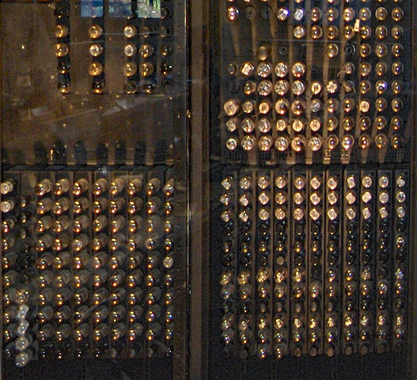

.. :

    analog hardware design for deep learning model
    
-----

Analog Chipsets for AI Applications
====================================
* `Developers Turn To Analog For Neural Nets <https://semiengineering.com/developers-turn-to-analog-for-neural-nets/>`_
* `Texas Instuments <https://www.ti.com/tool/TIDA-010955>`_
* `IIC <https://indianexpress.com/article/cities/bangalore/iisc-develops-design-framework-to-build-next-generation-analog-chipsets-for-ai-applications/>`_
* `Analog Neural Circuit and Hardware Design of Deep Learning Model <https://www.sciencedirect.com/science/article/pii/S1877050915022644>`_
* `The Promise of Analog Deep Learning: Recent Advances, Challenges and Opportunities <https://arxiv.org/html/2406.12911v1>`_
* `Harnessing Analog Hardware for Machine Learning <https://openreview.net/pdf?id=PkduOOJOZA>`_

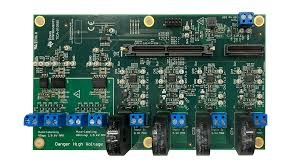

----

:class: t2c

General Types of Computers
===========================
* Analog Computer
    * pros
    * cons
* Digital Computer
    * pros
    * cons
* Quantum Computer
    * pros
    * cons

.. image:: img/in/ibm-quantum-system-one-ces-2020_50252942522_o_jpg.webp
   :height: 400px

.. :

    https://newsroom.clevelandclinic.org/2023/03/20/cleveland-clinic-and-ibm-unveil-first-quantum-computer-dedicated-to-healthcare-research
    https://en.wikipedia.org/wiki/Quantum_computing
    
    
    https://en.wikipedia.org/wiki/Wafer_(electronics)
    https://f450c.org/infographic/
    
    
    In electronics, a wafer (also called a slice or substrate)[1] is a thin slice of semiconductor, such as a crystalline silicon (c-Si, silicium), used for the fabrication of integrated circuits and, in photovoltaics, to manufacture solar cells.

    The wafer serves as the substrate for microelectronic devices built in and upon the wafer. It undergoes many microfabrication processes, such as doping, ion implantation, etching, thin-film deposition of various materials, and photolithographic patterning. Finally, the individual microcircuits are separated by wafer dicing and packaged as an integrated circuit.

    
-----

Imaginary Computer (YIC-220)
=============================
Different memory for code and data
----------------------------------
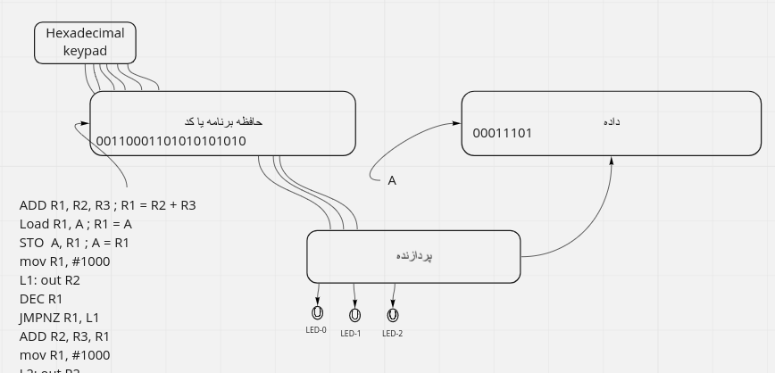

----

.. image::  img/in/hex_keyboard.png

----

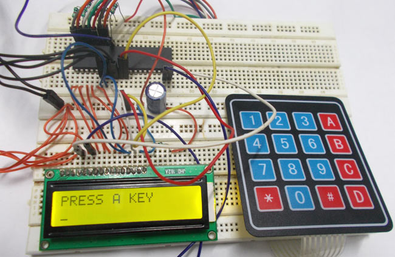

----

.. image::  img/in/breadboard.png

----

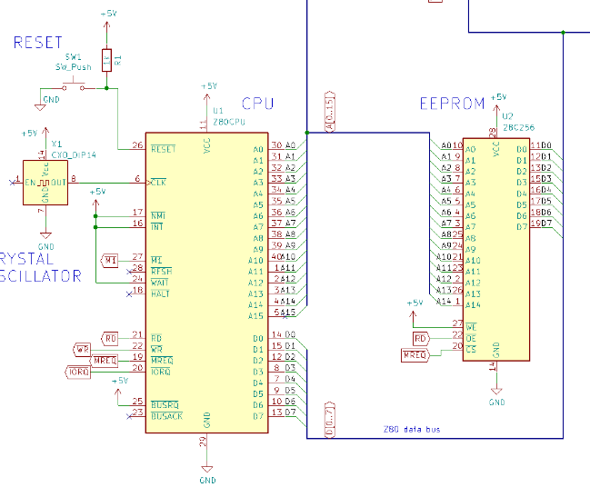

----

The Second Imaginary Computer
=============================
Uniform memory (John von Neumann)
----------------------------------
.. list-table::

    * - .. image::  img/in/simple_execution_cycle.png

      - .. image:: img/in/John_von_Neumann.jpg

.. :

        https://commons.wikimedia.org/wiki/File:John_von_Neumann.jpg

----

.. image::  img/in/simple_cpu02.png

----

.. code:: asm

    ADD A,B

    A = A + B

    ; 0101011  00010101 0101010

    OPcode    DATA_1    DATA_2
    ADD          A               B

    R1 = R2 + R3
    ADD R1, R2, R3

    ; 010101001 0001 0010 0011

    OP Code     R1    R2    R3

    010101001000100100011

----

.. image::  img/in/simple_cpu_hex_keypad02.png

----

Instruction Set(I)
==================
.. code:: asm

    AND: Logical AND memory with AC
    ADD: Arithmetic ADD memory with AC
    LDA: Load from memory to AC
    STA: Store AC to memory
    BUN: Branch unconditional
    ISZ: Increment and skip if zero
    CLA: Clear AC
    CLE: Clear E
    CMA: Complement AC
    CME: Complement E
    CIR: Circulate right (AC and E) [00100 CIR 1] ==> [00010]
    CIL: Circulate left (AC and E) [00100 CIL 1] ==> [00100]

----

Instruction Set(II)
======================
.. code:: asm

    INC:    Increment AC
    SPA:    Skip if positive AC
    SNA:    Skip if negative AC
    SZA:    Skip if zero AC
    SZE:    Skip if zero E
    HLT:    Halt
    OUT:    Output a character from AC
    SKO:    Skip if output flag
    NOP:    No operation

.. code:: asm
    :class: substep
    
    ..........
    ..........
    
    LB1:    out
            sko
            bun LB1

    ...........
    ...........
    

----

Instruction Set Bianary(I)
================================
.. code:: asm

    AND:    00001
    ADD:    00010
    LDA:    00011
    STA:    00100
    BUN:    00101
    ISZ:    00110
    CLA:    00111
    CLE:    01000
    CMA:    01001
    CME:    01010
    CIR:    01011
    CIL:    01100

----

Instruction Set Binary(II)
===========================
.. code:: asm

    INC:    01101
    SPA:    01110
    SNA:    01111
    SZA:    10000
    SZE:    10001
    HLT:    10010
    OUT:    10011
    SKO:    10100
    NOP:    10101

----

hex pad connect to microcontroller
==============================================
https://www.circuitstoday.com/interfacing-hex-keypad-to-8051

https://circuitdigest.com/microcontroller-projects/keypad-interfacing-with-avr-atmega32

----

Hardware vs Software
==========================
.. class:: substep

* pros
    * Less code
    * More speed
    * Less errors of writing code
* cons
    * Cost
    * Less Flexible

----

Example
============
* https://github.com/yoosofan/mano-computer-simulator-js
* https://yoosofan.github.io/mano-computer-simulator-js/
* https://github.com/Naheel-Azawy/Simple-Computer-Simulator/blob/master/test/test-symbolic
* https://github.com/Naheel-Azawy/Simple-Computer-Simulator/blob/master/test/test
* https://github.com/Naheel-Azawy/Simple-Computer-Simulator/tree/master/test

----

Other assembly
==================
* http://imrannazar.com/arm-opcode-map
* https://iitd-plos.github.io/col718/ref/arm-instructionset.pdf
* https://wiki.osdev.org/X86-64_Instruction_Encoding
* https://cs.brown.edu/courses/cs033/docs/guides/x64_cheatsheet.pdf
* https://sites.google.com/site/nttrungmtwiki/home/rce/assembly-language/x64-opcode-and-instruction-reference-home
* http://ref.x86asm.net/coder64.html
* arm 32 opcodes

* http://z80-heaven.wikidot.com/instructions-set:ld
* http://z80-heaven.wikidot.com/opcode-reference-chart
* https://smallcomputercentral.files.wordpress.com/2017/12/asm80-com-tutorial-e1-0-01.pdf
* https://stackoverflow.com/questions/22838444/convert-an-8bit-number-to-hex-in-z80-assembler
* https://www.vcfed.org/forum/forum/technical-support/vintage-computer-programming/76419-z80-hello-world-example-in-hex
* https://www.cemetech.net/forum/viewtopic.php?t=15710&start=0
* z80 assembly codes

----

.. code:: asm

  00101 00000   1010
  00110 00000  1100
  00111 00000  1110
  01000

  00000

.. class:: rtl

اگر حداکثر ۳۲ دستور داشته باشیم پس پنج بیت برای دستورها نیاز داریم
برای سادگی فرض می‌کنیم که طول همهٔ دستورها یکسان است
یعنی هم دو بایت را می‌گیرند
فرض کنید  دستورها پنج بیت نیاز دارند پس ۱۱ بیت برای  
آدرس

حداکثر حافظهٔ این کامپیوتر چقدر می‌تواند باشد.
اگر بخواهیم بایتی آدرس دهی کنیم

۲^۱۱ = ۲kB

B = Byte

اگر آدرس‌دهی را دو بایتی در نظر بگیریم

۴kB (word = 2 byte)

----

Main Type of Processors
==========================
* RISC (Reduced instruction set computer)
    * https://en.wikipedia.org/wiki/Reduced_instruction_set_computer
* CISC (Complex Instruction Set Computer)
    * https://en.wikipedia.org/wiki/Complex_instruction_set_computer

----

Processor Series
======================
* AMD (https://developer.amd.com/resources/developer-guides-manuals/)
* Intel (https://www.intel.com/content/dam/www/public/us/en/documents/manuals/64-ia-32-architectures-software-developer-instruction-set-reference-manual-325383.pdf)

----

Output
==============
LED
-----

seven segment
-----------------
* https://www.rapidtables.com/convert/number/hex-to-binary.html
* convert hex to binary
* https://clrhome.org/asm/

----

.. code:: asm

  lda a
  add b
  sta c
  out
  hlt
  a, 5
  b, 2
  c, 0

.. code:: asm

  00101   1010
  00110   1100
  00111   1110
  01000
  00000

.. code:: asm

  lda a
  add b
  sta c
  out
  hlt
  a, 5
  b, 2
  c, 0

----

BSA
===========

----

Function call
==================
.. image::  img/in/call_stack_layout.png

----

Stack From end
===============
* Call
* Ret

.. image::  img/in/simple_cpu02.png

* `Assembly Slides <https://www.cs.princeton.edu/courses/archive/spr11/cos217/lectures/15AssemblyFunctions.pdf>`_

----

.. image::  img/in/thermal_printer_interfacing_with_PIC16F877A.jpg

----

Device Drivers
===================

.. :

  https://www.google.com/search?q=character+pixel+font+design+old+computer+dos&oq=character+pixel+font+design+old+computer+dos&aqs=chrome..69i57.13056j0j7&sourceid=chrome&ie=UTF-8
  https://www.instructables.com/Simplest-AVR-Parallel-port-programmer/
  use call return assembly
  https://docs.oracle.com/cd/E19455-01/806-3773/6jct9o0ar/index.html
  https://www.ibm.com/docs/en/cics-ts/5.3?topic=instructions-call-return
  https://zhu45.org/posts/2017/Jul/30/understanding-how-function-call-works/
  old type machine
  https://www.istockphoto.com/photo/very-old-typing-machine-gm1147464007-309525631
  https://www.google.com/imgres?imgurl=https%3A%2F%2Fupload.wikimedia.org%2Fwikipedia%2Fcommons%2Fe%2Fe3%2FOld_type_machine_%2528small_store_at_M%25C3%25A9rida%2529.JPG&imgrefurl=https%3A%2F%2Fcommons.wikimedia.org%2Fwiki%2FFile%3AOld_type_machine_(small_store_at_M%25C3%25A9rida).JPG&tbnid=mrMcugIgUoHXqM&vet=12ahUKEwie26bdgI72AhUS4oUKHQpQCnYQMyg9egQIARBU..i&docid=AFF2jNcwkI8wYM&w=1944&h=2592&q=old%20type%20machine&ved=2ahUKEwie26bdgI72AhUS4oUKHQpQCnYQMyg9egQIARBU
  https://en.wikipedia.org/wiki/Parallel_port
  https://deepbluembedded.com/stm32-keypad-interfacing-library/
  https://www.google.com/url?sa=i&url=https%3A%2F%2Fforum.arduino.cc%2Ft%2Fread-data-from-parallel-port%2F105648&psig=AOvVaw2V2VoyYLu1-O-wNiBUtRXc&ust=1645436236611000&source=images&cd=vfe&ved=2ahUKEwjSv6vk_Y32AhVE3IUKHXn6DWcQ3YkBegQIABAL
  https://deepbluembedded.com/stm32-max7219-dot-matrix-display-interfacing-library/
  https://circuitdigest.com/sites/default/files/projectimage_mic/Thermal-Printer-interfacing-with-PIC16F877A.jpg
  https://www.digikey.in/en/product-highlight/a/analog-devices/adsw4000-eagleeye-people-count-algorithm-and-trial-kit?dclid=CKq0343-jfYCFUkfBgAdqmcKvw
  https://circuitdigest.com/microcontroller-projects/thermal-printer-interfacing-with-pic16f877a
  https://www.researchgate.net/figure/Circuit-Diagram-for-Serial-Port-to-Printer-Parallel-Port-Interface-using-AT89C2051_fig4_230799951
  old microcontroller connect to parallel port
  https://en.wikipedia.org/wiki/Call_stack
  
  function call stack
  https://youshaohua.com/post/simply-and-easily-understanding-function-call-stack-by-a-vision
  https://www.researchgate.net/figure/HWTI-Function-Call-Stack-Example_fig3_220844363
  https://www.google.com/url?sa=i&url=https%3A%2F%2Fmansfield-devine.com%2Fspeculatrix%2F2017%2F01%2Fgoodbye-old-friend-the-death-of-a-dot-matrix-printer%2F&psig=AOvVaw2IpOs10JxRbuobJUjjgYyE&ust=1645436117621000&source=images&cd=vfe&ved=2ahUKEwiK98yr_Y32AhUEwuAKHcgqCjgQ3YkBegQIABAL
  https://www.google.com/url?sa=i&url=https%3A%2F%2Fwww.electronics-lab.com%2Ftop-10-popular-microcontrollers-among-makers%2F&psig=AOvVaw2EXDnrr7QYg4MMA4wzxdcW&ust=1645436126602000&source=images&cd=vfe&ved=2ahUKEwiei_Gv_Y32AhXFQcAKHclhAKQQ3YkBegQIABAL
  http://www.google.com/url?sa=i&url=https%3A%2F%2Fwww.electronics-lab.com%2Ftop-10-popular-microcontrollers-among-makers%2F&psig=AOvVaw2EXDnrr7QYg4MMA4wzxdcW&ust=1645436126602000&source=images&cd=vfe&ved=2ahUKEwiei_Gv_Y32AhXFQcAKHclhAKQQ3YkBegQIABAL
  https://www.google.com/url?sa=i&url=https%3A%2F%2Fdeepbluembedded.com%2Fstm32-lcd-16x2-tutorial-library-alphanumeric-lcd-16x2-interfacing%2F&psig=AOvVaw0WO3faTRa5sedGIgDKGhNt&ust=1645436135855000&source=images&cd=vfe&ved=2ahUKEwip7aW0_Y32AhVjm1wKHfMUB4oQ3YkBegQIABAL
  
----

Simple computer simulator
==============================
* https://github.com/jeaniehandler/OS
* https://github.com/Naheel-Azawy/Simple-Computer-Simulator
* https://web.njit.edu/~carpinel/Applets.html
* http://www.science.smith.edu/dftwiki/index.php/IBooks
* http://www.science.smith.edu/dftwiki/index.php/

Simple Computer Simulator Instruction Set
------------------------------------------------
* http://euler.vcsu.edu/curt.hill/Computer.html

----

:class: t2c

Simple LED
==========================
.. image::  img/in/led_circut.png
  :height: 300px

.. image::  img/in/arduino7segment.png
  :height: 300px

`circuitbasics <https://www.circuitbasics.com/arduino-7-segment-display-tutorial/>`_

----

Connecting Seven segment display
===================================
.. image::  img/in/arduino7segment02.png
  :height: 300px

`circuitbasics <https://www.circuitbasics.com/arduino-7-segment-display-tutorial/>`_

----

:class: t2c

Seven segment display
==========================

.. image::  img/in/7segment01.png
  :height: 300px

.. image::  img/in/7segment02.png
  :height: 300px

`circuitbasics <https://www.circuitbasics.com/arduino-7-segment-display-tutorial/>`_
`askingthelot <https://askingthelot.com/how-do-i-connect-7-segment-display/>`_

`youtu.be <https://youtu.be/XCJqoae4hgY>`_
`element14 <https://community.element14.com/challenges-projects/element14-presents/thelearningcircuit/w/documents/4523/the-learning-circuit-53---how-to-drive-a-7-segment-display?CMP=SOM-YOUTUBE-PRG-E14PRESENTS-LCIRCUIT-53-COMM-7-SEGMENT-DISPLAY>`_

----

:class: t2c

Arduino Print 4 to 7-segment
===============================
.. code:: cpp

  #include "SevSeg.h"
  SevSeg sevseg; 

  void setup(){
    byte numDigits = 1;
    byte digitPins[] = {};
    byte segmentPins[] = 
      {6, 5, 2, 3, 4, 7, 8, 9};
    bool resistorsOnSegments = true;

    byte hardwareConfig = COMMON_CATHODE; 
    sevseg.begin(hardwareConfig, 
      numDigits, digitPins, segmentPins, 
      resistorsOnSegments
    );
    sevseg.setBrightness(90);
  }

  void loop(){
    sevseg.setNumber(4);
    sevseg.refreshDisplay();
  }

..  csv-table::
  :header-rows: 1
  :class: smallerelementwithfullborder

  Segment Pin, Arduino Pin
  A, 6
  B, 5
  C, 2
  D, 3
  E, 4
  F, 7
  G, 8
  DP, 9

`circuitbasics <https://www.circuitbasics.com/arduino-7-segment-display-tutorial/>`_

----

:class: t2c

4 Digit 7-Segment Displays
===========================
.. image::  img/in/4digits7segment01.png
  :height: 250px

.. image::  img/in/4digits7segment02.png
  :height: 250px

`circuitbasics <https://www.circuitbasics.com/arduino-7-segment-display-tutorial/>`_

----

Connecting 4 Digit 7-Segment Displays
============================================
.. image::  img/in/4digits7segment2arduino.png
  :height: 400px

----

Hardware insead of Software
===============================
.. image:: img/in/BCDto7segment.png
  :width: 800px

.. :

  جزوهٔ درس معماری کامپیوتر دکتر مختار معصومی 
  https://www.electronics-tutorials.ws/blog/7-segment-display-tutorial.html
  https://www.geeksforgeeks.org/bcd-to-7-segment-decoder/

----

Hollerith and IBM keypunches, 1890 
==========================================
.. image:: img/in/ctr_census_machine.jpg
  :width: 600px

* https://en.wikipedia.org/wiki/Keypunch

----

IBM 011 Electric Key Punch(1923)
=================================
.. image:: img/in/ekpunch.jpg
  :width: 800px

* `columbia.edu <http://www.columbia.edu/cu/computinghistory/oldpunch.html>`-

----

IBM Type 032 Printing Punch(1935)
=====================================
.. image:: img/in/ibm032b.jpg
  :width: 600px

* `columbia.edu <http://www.columbia.edu/cu/computinghistory/oldpunch.html>`-

----

A Key Punch Room in the 1960s
==========================================
.. image:: img/in/752px-IBM_Keypunch_Machines_in_use.jpg
  :width: 600px

* https://en.wikipedia.org/wiki/Keypunch

----

Card Mark sense format
=========================
.. image:: img/in/HP_Educational_Basic_optical_mark-reader_card._Godfrey_Manning..jpg

----

Cartons of Punch cards(1959)
===================================
In a United States National Archives Records Service facility in 1959. Each carton could hold 2,000 cards
----------------------------------------------------------------------------------------------------------------
.. image:: img/in/IBM_card_storage.NARA.jpg

* https://en.wikipedia.org/wiki/Punched_card

----

Pile of Punch cards
===========================
.. image:: img/in/pile_of_punch_cards_next2woman.png
  :height: 500px

----

Punched Card Printing Plate
=============================
.. image:: img/in/PunchedCardPrintingPlate.agr.jpg
  :height: 400px

----

Example of a Punch Card
=================================
.. image:: img/in/punch_card.png
  :width: 500px

----

IBM1130 Binary Punched Card
===========================================
.. image:: img/in/IBM1130CopyCard.agr.jpg
  :width: 800px

* https://en.wikipedia.org/wiki/Punched_card

----

A 5081 Card from a non-IBM Manufacturer
=================================================
.. image:: img/in/Punch-card-5081.jpg
  :width: 800px

* https://en.wikipedia.org/wiki/Punched_card

----

FORTRAN Port-A-Punch card. Compiler directive "SQUEEZE"
==========================================================
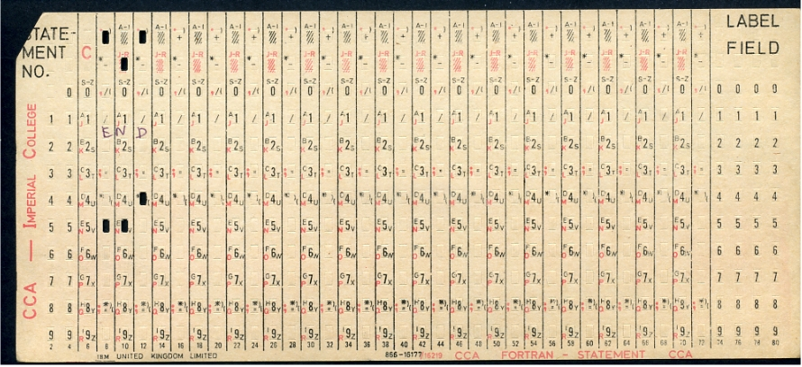

* https://en.wikipedia.org/wiki/Punched_card

----

Punched card from a Fortran program
====================================
Z(1) = Y + W(1), plus sorting information in the last 8 columns
------------------------------------------------------------------
.. image:: img/in/FortranCardPROJ039.agr.jpg
  :width: 700px

* https://en.wikipedia.org/wiki/Punched_card

----

Punch Card Machine
=======================
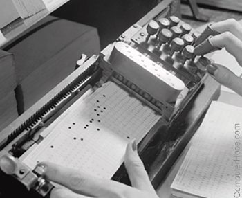

.. image:: img/in/315px-Punched_card_program_deck.agr.jpg

----

Other Links for Punch Card Machines
====================================
* https://en.wikipedia.org/wiki/Computer_programming_in_the_punched_card_era
* old computer operator changing cards
* https://www.computerhope.com/jargon/p/punccard.htm
* https://en.wikipedia.org/wiki/IBM_System/3
* https://en.wikipedia.org/wiki/Tabulating_machine
    *  1890 U.S. Census

----

Card reader
===============
https://www.pinterest.com/pin/326299935478491352/

old ibm card punch reader

----

Tape
==========
.. image:: img/in/computer.room.tape.png
  :height: 500px

----

Xerox Roman PS Daisywheel
========================================
.. image:: img/in/Xerox_Roman_PS_Daisywheel_mono.jpg
  :height: 450px

.. :

  https://upload.wikimedia.org/wikipedia/commons/0/0e/Xerox_Roman_PS_Daisywheel_-_mono.jpg

----

Royal Typewriter Company since 1906
===========================================
.. image:: img/in/Loyal_royal_typewriter.jpg

https://en.wikipedia.org/wiki/Royal_Typewriter_Company

----

IBM Selectric Typewriter 1961(I)
=================================
.. image:: img/in/IBM_Selectric_Typewriter_1961.jpg
  :height: 400px

* https://en.wikipedia.org/wiki/IBM_Selectric_typewriter

----

IBM Selectric Typewriter 1961 (II)
=========================================
.. image:: img/in/IBM_Selectric_Typewriter_1961_typeball.jpg
  :height: 400px

* https://en.wikipedia.org/wiki/List_of_IBM_products#Typewriters

----

Epson WideCarriage Line Printer
=======================================
.. image:: img/in/Epson_Wide_Carriage_9pin_printer_with_legal_paper_8.5x14.jpg
  :height: 400px

https://en.wikipedia.org/wiki/Dot_matrix_printing

----

The common segment displays
==============================
* `Seven-segment_display <https://en.wikipedia.org/wiki/Seven-segment_display>`_
* `9 Segments Display <https://en.wikipedia.org/wiki/Nine-segment_display>`_
* `Fourteen-segment display <https://en.wikipedia.org/wiki/Fourteen-segment_display>`_
* `Sixteen-segment display <https://en.wikipedia.org/wiki/Sixteen-segment_display>`_

----

9 Segments Display
=====================
.. image:: img/in/9_segment_abcdefghi.svg

* https://en.wikipedia.org/wiki/Nine-segment_display

----

Fourteen-segment display
=============================
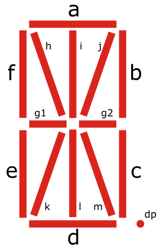

* https://en.wikipedia.org/wiki/Fourteen-segment_display

----

Sixteen-segment display
==========================
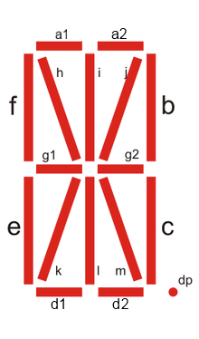

* https://en.wikipedia.org/wiki/Sixteen-segment_display

----

split flap display(I)
======================
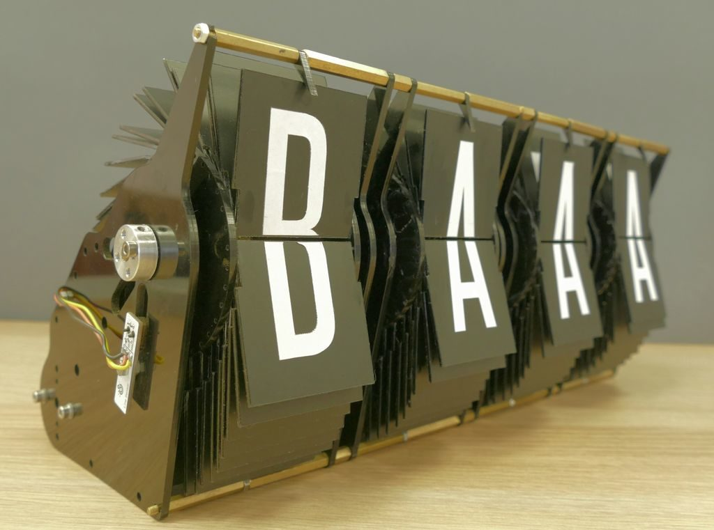

http://arduinomania.com/tag/split%20flap%20display

----

Split-flap display(II)
=======================
.. image:: img/in/Split-flap_display_2016-01-17.gif
  :height: 400px

* https://en.wikipedia.org/wiki/Split-flap_display
* https://www.dreamstime.com/illustration/airport-flip-sign.html

----

Enlarged inner workings of a split-flap clock
===================================================
.. image:: img/in/1024px-Split-flap_display.jpg
  :height: 400px

* https://en.wikipedia.org/wiki/Split-flap_display

----

Airport Board with Split-Flip Display
=======================================
.. image:: img/in/airport_board_with_flip-flop_display.jpg
  :height: 400px
  
* https://en.wikipedia.org/wiki/Split-flap_display

----

Flip-Dot-Display
======================
.. image:: img/in/Flip-dots_display.jpg
  :width: 800px

* https://en.wikipedia.org/wiki/History_of_display_technology
* https://en.wikipedia.org/wiki/Flip-disc_display

----

5x7 LED module
==================
.. image:: img/in/5x7led.jpg
  :height: 400px

* https://www.nutsvolts.com/magazine/article/create-an-led-sign-controller

----

When a controller rapidly turns on LEDs in one row at a time
===============================================================
.. image:: img/in/5x7led_B_refresh.jpg
  :width: 750px

https://www.nutsvolts.com/magazine/article/create-an-led-sign-controller

.. :

  8x8 dot matrix display
  https://www.circuitstoday.com/interfacing-dot-matrix-led-display-to-8051
  https://pic-microcontroller.com/interfacing-dot-matrix-led-display-pic-microcontroller/
  https://www.best-microcontroller-projects.com/led-dot-matrix-display.html
  5x7 dot matrix LED display character patterns
  http://www.farnell.com/datasheets/37926.pdf
  http://elektro.fs.cvut.cz/dokument/LCD/LCD_Manual_ShortVersion.pdf
  https://www.deviceplus.com/arduino/display-characters-with-leds-how-to-use-a-matrix-led/
  https://www.jameco.com/Jameco/workshop/learning-center/electronic-fundamentals-working-with-led-dot-matrix-displays.html
  https://handsontec.com/index.php/modular-dot-matrix-display/
  dot matrix display character set

----

GET THE DOTS, FORM A LETTER using ROM
==================================================
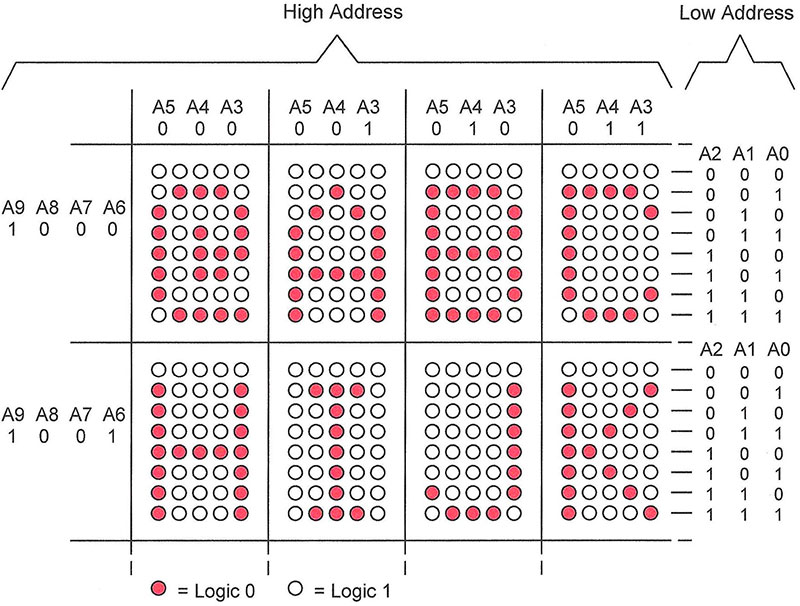

https://www.nutsvolts.com/magazine/article/create-an-led-sign-controller

.. :

  So far, so good, but where do the bits come from to create alphanumeric characters and symbols? (For clarity, I’ll refer to all of these as “characters.”) Years ago, displays used a read-only memory (ROM) preloaded with the 1s and 0s that form characters. A character-generator ROM held patterns for the 96 “printable” ASCII characters and 32 extra characters such as arrows, checkmarks, and other symbols, for a total of 128 characters (see Resources).

  Each of those characters needed eight bytes to store its pattern of 1s and 0s, so the ROM required 1024 bytes (128 x 8). That meant the ROM needed 10 address lines (1024 = 210). Although the ROM used only seven bytes per character, it’s easier to step through binary row addresses eight at a time.

  The 10 address lines, A9-A0, separate into a “high” address, A9-A3, and into a “low” address, A2-A0. The high address identifies a specific character; for example, A, f, $, and so on. The low address identifies one of the character’s eight rows (Figure 10).

----

Showing Character D
========================
.. image:: img/in/showing_character_d.jpeg

https://www.deviceplus.com/arduino/display-characters-with-leds-how-to-use-a-matrix-led/

----

Showing Character D (real refresh)
========================================
.. image:: img/in/showing_character_d_refresh.gif

https://www.deviceplus.com/arduino/display-characters-with-leds-how-to-use-a-matrix-led/

----

Dot matrix example text
============================
.. image:: img/in/Epson_line_printer_Dot_matrix_example_text.png

https://en.wikipedia.org/wiki/Dot_matrix_printing

----

Dot-matrix display
======================
.. image:: img/in/16x2_Character_LCD_Display.jpg
  :height: 400px

* 128×16 (Two-lined)
* 128×32 (Four-lined)
* 128×64 (Eight-lined)
* 92×31 (Four or three-lined)
* https://en.wikipedia.org/wiki/Dot-matrix_display
* https://en.wikipedia.org/wiki/History_of_display_technology

----

1969 Braille display
=======================
.. image:: img/in/1969_Braille_display.jpg
  :height: 400px

* https://en.wikipedia.org/wiki/History_of_display_technology

----

Printer Function
========================================
.. image:: img/in/printer_function.png

----

Process along Printer Function
========================================
.. image:: img/in/process_along_printer_function.png

----

Call Printer Function
========================================
.. image:: img/in/call_printer_function.png

----

Return from Printer Function
========================================
.. image:: img/in/return_from_printer_funtion_with_stack.png

----

Old Display Function and  Printer Function
===================================================
.. image:: img/in/printer_old_display_function.png

----

Card reader instead of Hex pad input
========================================
.. image:: img/in/card_reader_instead_of_hex_pad.png

----

Display
============
* https://en.wikipedia.org/wiki/IBM_3270

IBM 3270 Display Terminal
--------------------------------
* https://en.wikipedia.org/wiki/File:IBM_3277_Model_2_terminal.jpg
* http://www.columbia.edu/cu/computinghistory/fisk.pdf

----

BIOS
==========
.. image:: img/in/Award_BIOS_setup_utility.png
   :align: center

----

.. image:: img/in/bios.gif
   :align: center

----

Boot sequence
==================
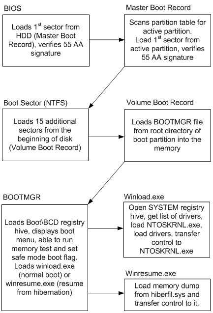

----

.. image:: img/in/GRUB_with_ubuntu_and_windows_vista.png
   :align: center

----

* `IEEE Std 1275 1994 Standard for boot initialization <https://archive.org/details/ieee_std_1275_1994_standard_for_boot_initialization_configur/page/n7/mode/2up>`_
* https://openfirmware.info/Welcome_to_OpenBIOS
* https://github.com/openbios
* https://github.com/openbios/openbios

Context Switch
=================

----

END

.. :

  .. image:: img/in/windows_system_idle_process.jpg
      :align: center

.. :

    https://www.drivereasy.com/knowledge/system-idle-process-high-cpu-solved/

----

.. comments:

    hovercraft in.rst
    hovercraft disk.slide.rst disk.slide/
    rst2html.py disk.rst disk.html --stylesheet=../../tools/farsi.css,html4css1.css
    https://www.geeksforgeeks.org/disk-scheduling-algorithms/
    http://www.csl.mtu.edu/cs4411.choi/www/Resource/chap11.pdf

