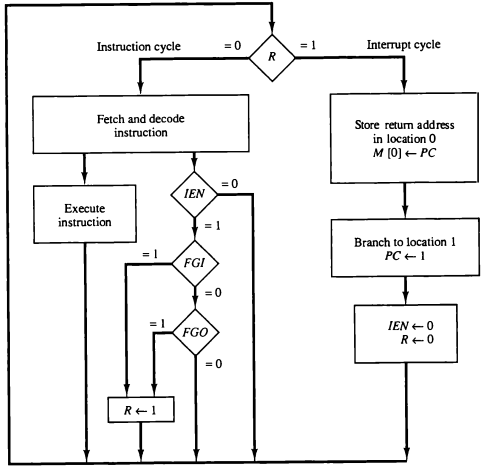
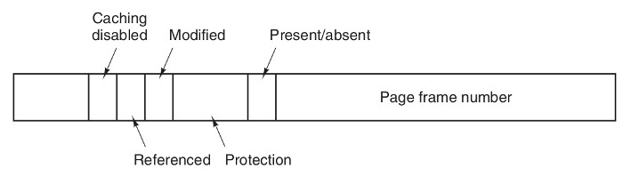
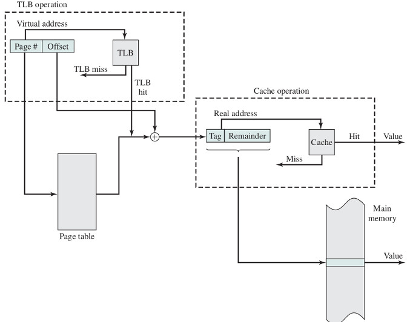
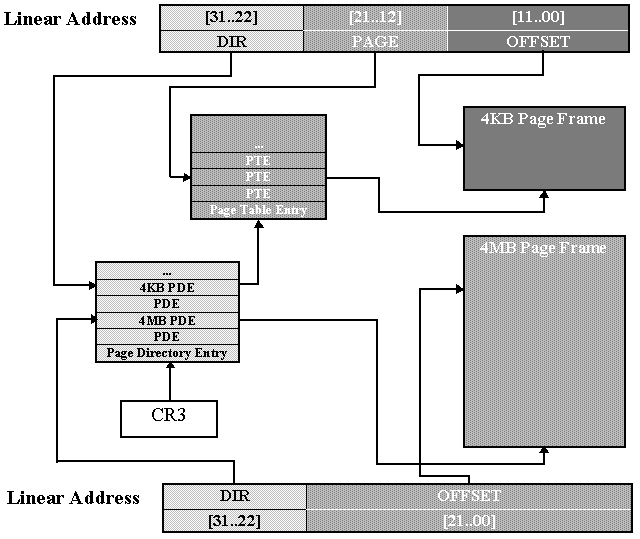

:data-transition-duration: 1000
:skip-help: true
:css: ./style.css ./memory.css
:substep: true

.. title: Operating Systems - Memory  (By Ahmad Yoosofan)

:slide-numbers: true

.. role:: ltr
    :class: ltr

.. role:: rtl
    :class: rtl

Operating Systems
==============================
Memory Management
---------------------------
Ahmad Yoosofan

University of Kashan

.. :

  ----

  .. class:: rtl-h1

      تخصیص حافظهٔ پیوسته به فرآیندها

  .. class:: rtl-h2

      به فرآیندها حافظهٔ پیوسته‌ای داده شود.

----

.. class:: rtl-h1

    بخش‌بندی ثابت حافظه

.. image:: img/memory/memory_fixed_partitioning.png
   :align: center
   :height: 470px

----

.. class:: rtl-h1

    تخصیص حافظه به فرآیندها در حالت بخش‌بندی ثابت حافظه

.. image:: img/memory/memory_fixed_allocation.png
   :align: center

----

.. class:: rtl-h1

    مشکلات بخش‌بندی ثابت

.. class:: substep rtl-h3

    #. انعطاف بسیار پایین
    #. محدودیت زیاد برای اندازهٔ فرایند در حالی که فضای حافظه خالی است.
    #. تکه تکه شدن یا پراکندی داخلی internal fragmentation
    #. هدر رفت حافظه
        * بخشی از حافظه که به فرایند داده شده است فقط برای آن فرایند است.
        * یعنی اگر بخشی از آن را فرایند به کار نبرد هدر رفته است.

----

.. class:: rtl-h1

    تکه تکه شدن (پراکندگی) داخلی حافظه

Internal Memory Fragmentation

.. image:: img/memory/memory_fixed_partitioning_internal_fragmentation.png
   :align: center

https://www.geeksforgeeks.org/difference-between-internal-and-external-fragmentation/

.. :

  operating system internal memory fragmentation fixed size partitioning
  Multi Programming

----

.. class:: rtl-h1

    بخش‌بندی پویای حافظه

.. image:: img/memory/memory_management_pc.png
   :align: center
   :height: 470px

----

.. class:: rtl-h1

    ارتباط میان آدرس فیزیکی و آدرس منطقی در آدرس دهی نسبی به کمکِ واحد مدیریت حافظه (MMU)

.. image:: img/memory/relocation_register_mmu.png
   :align: center

----

.. class:: rtl-h1

    حافظهٔ فرآیندها در سیستم عامل CTSS

.. image:: img/memory/memory_of_CTSS.png
   :align: center

----

.. class:: rtl-h1

    اثر به کارگیری حافظهٔ پویا

.. image:: img/memory/memory_effect_of_dynamic_partitioning.png
   :align: center
   :height: 500px

----

.. image:: img/in/process_state_chart.png
   :align: center

----

Process Control Block (PCB)
=================================
.. image:: img/in/pcb01.png
   :align: center

----

.. image:: img/in/kernel1process.png
   :align: center

----

.. image:: img/in/simple_multiple_process.png
   :align: center
   :height: 500px

----

address binding, absolute and relocate loader

.. image:: img/memory/memory_absolute_relocate_loader.png
   :align: center
   :scale: 90%

----

.. class:: rtl-h1

    چگونگی کارکرد پیوند زدن تابع‌ها از پرونده‌های گوناگون

.. image:: img/memory/memory_linking_function.png
   :align: center

----

.. image:: img/in/system_call02.png
   :align: center

----

Queue
=========
.. image:: img/in/queues01.png
   :align: center

----

.. class:: rtl-h1

    برگزیدن فضای آزاد برای فرآیند تازه وارد

.. class:: substep rtl-h2

    *  اولین برازش(First Fit)
    *  بهترین برازش(Best Fit)
    *  بدترین برازش(Worst Fit)
    *  درپی برازش (برازش بعدی Next Fit)

----

.. image:: img/memory/memory_select_part_for_allocation.png
   :align: center
   :height: 500px

----

.. class:: rtl-h1

    تکه تکه شدن (پراکندگی یا پارگی) خارجی

External Fragmentation
------------------------

----

Compaction
============
.. image:: img/memory/compaction.svg
   :align: center

.. ::

    https://web.fe.up.pt/~arestivo/presentation/os-memory/#15

    Memory-Compaction-in-contiguous-memory-allocation-1.jpg
    https://binaryterms.com/contiguous-memory-allocation-in-operating-system.html

    compaction.png
    https://github.com/mor1/ia-operating-systems/wiki/06-Virtual-Addressing
    https://github.com/mor1/ia-operating-systems

    https://www.faceprep.in/operating-systems/operating-systems-fragmentation-and-compaction/

    https://slideplayer.com/slide/7084682/

----

.. class:: rtl-h1

    حافظهٔ پویای رفاقتی Buddy system

.. image:: img/memory/memory_buddy_system1.png
   :align: center
   :height: 500px

----

.. image:: img/memory/memory_buddy_system2.png
   :align: center
   :scale: 90%

----

.. class:: rtl-h1

    الگوریتم اجرا

.. image:: img/memory/memory_buddy_system3.png
   :align: center

----

.. class:: rtl-h1

    جابجا کردن فرآیند میان حافظهٔ‌اصلی و حافظهٔ جانبی (دیسک)، شکل ساده‌ای از حافظهٔ مجازی

.. image:: img/memory/swapping_processes.png
   :align: center

----

.. image:: img/memory/suspend_state.png
   :align: center
   :width: 500px
   :height: 500px

----

overlay
=============
.. image:: img/memory/memory_ovelay_turbo_c.jpg
   :align: center
   :width: 500px
   :height: 650px

----

.. image:: img/in/simple_poweron_computer.png
   :align: center

----

BIOS
==========
.. image:: img/in/Award_BIOS_setup_utility.png
   :align: center

----

.. image:: img/in/bios.gif
   :align: center

----

Boot sequence
==================
.. image:: img/in/boot_sequence.png
   :align: center
   :height: 450px

----

.. image:: img/in/GRUB_with_ubuntu_and_windows_vista.png
   :align: center

----

.. class:: rtl-h1

    سلسله مراتب حافظه

.. image:: img/memory/memory_hierarchy_1_4_StorageDeviceHierarchy.jpg
   :align: center

.. :

    `cs.uic.edu <https://www.cs.uic.edu/~jbell/CourseNotes/OperatingSystems/images/Chapter1/1_4_StorageDeviceHierarchy.jpg>`_

----

.. class:: rtl-h1

    سلسله مراتب حافظه جزئی‌تر

.. image:: img/memory/memory_hierarchy_hei.png
   :align: center

.. :

  https://www.cs.uic.edu/~jbell/CourseNotes/OperatingSystems/images/Chapter1/1_4_StorageDeviceHierarchy.jpg
  http://images.bit-tech.net/content_images/2007/11/the_secrets_of_pc_memory_part_1/hei.png

----

.. class:: rtl-h1

    حافظهٔ نهان

.. image:: img/memory/memory_cache_Cache_hierarchy-example.svg
   :align: center

.. :

    `wikipedia.org Cache,hierarchy <https://en.wikipedia.org/wiki/File:Cache,hierarchy-example.svg>`_
    `wikipedia.org CPU_cache <https://en.wikipedia.org/wiki/CPU_cache>`_

----

.. class:: rtl-h1

    حافظهٔ نهان دو سطحی در یک پردازندهٔ واقعی

.. image:: img/memory/memory_cache_image025.jpg
   :align: center

.. :

    `link <https://www.byclb.com/TR/Tutorials/dsp_advanced/ch1_1_dosyalar/image025.jpg>`_

----

.. class:: rtl-h1

    الگوریتم خواندن و نوشتن از حافظهٔ نهان

.. image:: img/memory/memory_cache_read_write_algorithm_Write-back_with_write-allocation.svg
   :align: center
   :width: 500px
   :height: 650px

----

Effective Access Time (EAT)
================================
.. class:: substep

    * :math:`t_m` : :rtl:`زمان دسترسی به حافظه‌ی اصلی`
    * :math:`t_c` : :rtl:`زمان دسترسی به حافظه‌ی نهان`
    * :math:`h_c` : :rtl:`ضریب اصابت به حافظه‌ی نهان`

    .. math::

      EAT = h_c * t_c + ( 1 - h_c ) * ( t_m + t_c )

----

.. class:: rtl-h2

    اگر ضریب اصابت (یا نسبت اصابت) برای پردازنده‌ای 0.95 باشد و سرعت دسترسی به حافظهٔ اصلی 100 میکرو ثانیه باشد و سرعت دسترسی حافظهٔ نهان 1 میکرو ثانیه باشد در این صورت زمان دسترسی مؤثر برابر خواهد بود با

.. class:: substep

    * EAT = 0.95 * 1 + (1 − 0.95) * (100 + 1)
    * EAT = 0.95 + 0.05 * 101
    * EAT = 0.95 + 5.05
    * EAT = 5.1 μs

----

.. image:: img/memory/memory_effect_of_cache.png
   :align: center

----

.. raw:: html

    <table border="1px" ><tr >
    <td>ms</td><td>μs</td><td>ns</td><td>action</td><tr >
    <td></td><td></td><td>0.5</td><td>CPU L1 dCACHE reference</td></tr><tr >
    <td></td><td></td><td>1</td><td>speed-of-light (a photon) travel a 1 ft (30.5cm) distance</td></tr><tr >
    <td></td><td></td><td>5</td><td>CPU L1 iCACHE Branch mispredict</td></tr><tr >
    <td></td><td></td><td>7</td><td>CPU L2  CACHE reference</td></tr><tr >
    <td></td><td></td><td>71</td><td>CPU cross-QPI/NUMA best  case on XEON E5-46</td><tr >
    <td></td><td></td><td>100</td><td>MUTEX lock/unlock</td><tr >
    <td></td><td></td><td>100</td><td>own DDR MEMORY reference</td><tr >
    <td></td><td>20</td><td>000</td><td>Send 2K bytes over 1 Gbps NETWORK</td><tr >
    <td></td><td>250</td><td>000</td><td>Read 1 MB sequentially from MEMORY</td><tr >
    <td>10</td><td>000</td><td>000</td><td>DISK seek</td><tr >
    <td>10</td><td>000</td><td>000</td><td>Read 1 MB sequentially from NETWORK</td><tr >
    <td>30</td><td>000</td><td>000</td><td>Read 1 MB sequentially from DISK</td><tr >
    <td>150</td><td>000</td><td>000</td><td>Send a NETWORK packet CA -> Netherlands</td><tr >
    </tr></table>
    <a href="https://stackoverflow.com/questions/4087280/approximate-cost-to-access-various-caches-and-main-memory#4087315">[link]</a>

----

.. class:: rtl-h1

    به کارگیری حافظهٔ نسبی برای نگهداری مکان چندین فرآیند در حافظه

.. image:: img/memory/base_limit_register.png
   :align: center

----

.. class:: rtl-h1

    حفاظت از حافظه به کمک ثبات‌های پایه و حد

.. image:: img/memory/hardware_address_protection.png
   :align: center

.. class:: substep

#. System Call ?
#. Change registers by the running process

----

.. image:: img/in/process_parts.png
   :align: center

----

.. class:: rtl-h1

    بخش‌های درونی یک فرآیند در حالت کلی

.. image:: img/memory/memory_precess_addressing_parts.png
   :align: center

----

.. class:: rtl-h1

    مشخص شدن آدرس‌های حافظهٔ فرآیند

.. image:: img/memory/memory_program_address_binding.png
   :align: center

----

.. image:: img/memory/memory_linking_loading_scenario.png
   :align: center
   :scale: 90%

----

address binding, loader

.. image:: img/memory/memory_address_binding_loader.png
   :align: center
   :scale: 90%

----

address binding, linker

.. image:: img/memory/memory_address_binding_linker.png
   :align: center
   :scale: 90%

----

.. image:: img/memory/hardware_address_protection.png
   :align: center

Software Interrupt
======================
.. code:: asm

    mov ah, 0x0e    ; function number = 0Eh : Display Character
    mov al, '!'     ; AL = code of character to display
    int 0x10        ; call INT 10h, BIOS video service

----

.. image:: img/in/interrupt_types.png
   :align: center
   :height: 400px
   :width: 500px

----

.. :

  .. image:: img/in/interrupt_chart.jpg

----

System Call
=====================
.. image:: img/in/system_call.png
   :align: center
   :height: 350px
   :width: 800px

----

C System Call
=====================
.. image:: img/in/system_call_c.png
   :align: center

----

Simple Parameters
=========================
.. image:: img/in/systemcallpaprameter.png
   :align: center
   :height: 350px
   :width: 800px

----

Stack
===========
#. Process stack
#. System stack

----

.. class:: substep

    * kernel mode
    * user mode

.. class:: substep

    Pentium 4 (ESCR)

.. image:: img/in/control_register.png
   :align: center
   :class: substep

----

.. image:: img/in/protection_ring.png
   :align: center

----

CPU protection
====================
Timer interrupt
-------------------
Cpu Scheduler

.. image:: img/memory/timer_interrupt.jpg
    :align: center
    :width: 700px
    :height: 500px

----

.. image:: img/in/system_overview01.png
   :align: center

----

Micro Kernel
===============
.. image:: img/in/micro_kernel01.png
   :align: center
   :width: 850px

----

Multi Layer
===============
.. image:: img/in/multilayer_os01.png
   :align: center

----

DMA
=====
.. image:: img/memory/system-configuration-with-dmac.png

----

.. image:: img/memory/GigabyteZ77-HD4-Top.jpg
    :align: center
    :width: 500px
    :height: 750px

----

.. class:: rtl-h1

    حافظهٔ صفحه‌بندی شده

Paging
----------

----

.. class:: rtl-h1

    شکل سادهٔ صفحه‌بندی

.. image:: img/memory/paging_model.png
   :align: center

----

.. :

    ----

    .. image:: img/memory/memory_paging_model_address.png
       :align: center

    ----

    .. image:: img/memory/memory_paging_from_disk.png
       :align: center
       :scale: 70%

    ----

    سخت‌افزار صفحه‌بندی

.. image:: img/memory/paging_hardware.png
   :align: center
   :height: 300px

.. class:: substep

  #. Number of bits of Addrress  related to Maximum supported memory by this computer(cpu and motherboard)
  #. Number of bits of Addrress  =  log2(Maximum supported memory)
  #. If max supported memory = 32 words then number of bits needed for addrress ?
  #. 32 = 2 ^ 5, :math:`n = log_2(m)` , m is number of bytes or words
  #. 5 = log2(32)
  #. if p = 2, d = 3 then the size of each frame or page is ?
  #. 2 ^ 3 = 8
  #. Maximum number of Frames?
  #. 2 ^ 2  = 4

----

.. class:: rtl-h1

    بخش‌بندی ثبات آدرس در حافظهٔ صفحه‌بندی شده

.. image:: img/memory/page_number_offset.png
   :align: center

* Frame 4k then number_bits(d) == 12
* Frame 1k then number_bits(d) == 10
* Frame 16k then number_bits(d) == 14

Maximux memory supported by cpu
------------------------------------
* 1 MB ==> number_of_bit(Address register) == 20
    * Frame 4k ==> d == 12 and p == 8
    * Frame 1k ==> d == 10 and p == 10 // wrong?

----

:class: t2c

.. :

  .. class:: rtl-h1

      یک کامپیوتر با ۳۲ بایت حافظه و صفحه‌های چهار بایتی

Consider a computer with maximum 16 words
==========================================
.. class:: substep

#. Draw Memory Bytes
#. d = 2
#. Draw Memory Frames
#. some First Frames for os
#. Put a process into Memory (not continuous or in order)
#. Fill page table
#. Convert a Logical Addfress to Physical Address
#. Put another process into Memory

.. container::

  ..  csv-table::
    :header-rows: 1
    :class: smallerelementwithfullborder

    "0000","0001 ","0010 ","0011 ","0100 ","0101 ","0110","0111","1000","1001","1010 ","1011","1100","1101","1110 ","1111"
    0,1,2,3,4,5,6,7,8,9,10,11,12,13,14,15

  .

  ..  csv-table::
    :header-rows: 1
    :class: smallerelementwithfullborder

    "00 ","01 ","10 ","11 "
    0,1,2,3

  .

  ..  csv-table::
    :header-rows: 1
    :class: smallerelementwithfullborder

    "00 ","01 ","10 ","11 "
    4,5,6,7

  .

  ..  csv-table::
    :header-rows: 1
    :class: smallerelementwithfullborder

    "00 ","01 ","10 ","11 "
    8,9,10,11

  .

  ..  csv-table::
    :header-rows: 1
    :class: smallerelementwithfullborder

    "00 ","01 ","10 ","11 "
    12,13,14,15

----

.. class:: rtl-h1

    یک کامپیوتر با حافظهٔ ۳۲ بایت و اندازه‌های قاب  ۸ بایتی و یک فرآیند

d = 3, p = 2

p0 11 bytes

---

.. class:: rtl-h1

    یک کامپیوتر با حافظهٔ ۱۲۸ بایتی و صفحه‌های ۸ بایتی

---

----

.. class:: rtl-h1

    یک حافظهٔ ۳۲ بایتی با صفحه‌های ۴ بایتی

.. image:: img/memory/paging_example_32_bytes_memory.png
   :align: center

----

.. class:: rtl-h1

    تغییرات فضاهای آزاد پیش و پس از تخصیص حافظه به یک فرآیند

.. image:: img/memory/paging_free_frames_before_after.png
   :align: center

----

.. class:: rtl-h1

    تغییرات حافظه برای چند فرآیند

.. image:: img/memory/memory_paging_process.png
   :align: center

----

.. image:: img/memory/memory_paging_process_page_tables.png
   :align: center

----

.. class:: rtl-h1

    تبدیل آدرس منطقی به آدرس فیزیکی در حافظهٔ صفحه‌بندی شده

.. image:: img/memory/memory_paging_logical_address_to_physical_address.png
   :align: center

----

.. image:: img/memory/memory_paging_logical_address_to_physical_address_detail.png
   :align: center

----

Address Translation
========================
.. image:: img/memory/memory_paging_address_translation.png
   :align: center

----

:class: t2c

Process and Page Table
============================
.. image:: img/memory/page_table_in_a_frame.png

.. image:: img/memory/page_table_in_a_frame2.png

----

PTBR
=======
.. image:: img/memory/paging_hardware_with_TLB_ptbr.png
   :align: center
   :height: 550px

----

.. class:: rtl-h1

    حفاظت از حافظهٔ صفحه‌بندی شده

.. image:: img/memory/paging_valid_invalid.png
   :align: center

----

.. class:: rtl-h1

    اشتراک گذاری در حافظهٔ صفحه‌بندی شده

.. image:: img/memory/memory_paging_share_pages.png
   :align: center
   :height: 500px

----

.. image:: img/memory/paging_sharing_code.png
   :align: center

----

Paging Memory Access
=====================

----

TLB
======
.. image:: img/memory/paging_hardware_with_TLB.png
   :align: center

----

Flowchart of TLB miss
=========================
.. image:: img/memory/paging_hardware_TLB_miss.png
   :align: center
   :height: 550px

----

.. class:: rtl-h1

    سلسه مراتب حافظه

.. image:: img/memory/memory_hierarchy.png
   :align: center

----

Memory Access
================
.. image:: img/memory/memory_effect_of_cache.png
   :align: center

----

Effective Access Time
=========================
.. class:: substep

    * :math:`t_t` (access Time of TLB) : :rtl:`زمان دسترسی به حافظه‌ی نهان جدول صفحه`
    * :math:`t_c` (access Time of Cache): :rtl:`زمان دسترسی به حافظه‌ی نهان`
    * :math:`t_m` (access Time of Memory): :rtl:`زمان دسترسی به حافظه‌ی اصلی`
    * :math:`h_t` (Hit ratio of TLB): :rtl:`ضریب اصابت به حافظه‌ی نهان جدول صفحه`
    * :math:`h_c` (Hit ratio of Cache): :rtl:`ضریب اصابت به حافظه‌ی نهان`

    .. math::

      EAT = table +  memory

      table =  h_t * t_t + ( 1 - h_t ) * ( t_t + t_m )

      memory = h_c * t_c + ( 1 - h_c ) * ( t_c + t_m )

      EAT =  h_t * t_t + ( 1 - h_t ) * ( t_t + t_m ) + h_c * t_c + ( 1 - h_c ) * ( t_c + t_m )

----

.. class:: rtl-h2

    زمان دسترسی مؤثر را برای پردازنده‌ای با حافظهٔ صفحه‌بندی شده حساب کنید اگر زمان دسترسی به حافظهٔ نهان جدول صفحه برابر ۱ نانو ثانیه باشد و زمان دسترسی به حافظهٔ نهان ۵ نانوثانیه باشد و زمان دسترسی به حافظه برابر ۱۰۰ نانوثانیه باشد و ضریب اصابت حافظهٔ نهان جدول صفحه برابر با ۹۵ درصد و ضریب اصابت به حافظهٔ نهان ۹۰ درصد باشد.

.. class:: substep

    * :math:`t_t` = 1,  :math:`t_c` = 5, :math:`t_m` = 100, :math:`h_t` = 0.95, :math:`h_c` = 0.90

    .. math::

        EAT = table +  memory

        table =  h_t * t_t + ( 1 - h_t ) * ( t_t + t_m )

        table = 0.95 * 1 + 0.05 * (1 + 100) = 0.95 + 5.05 = 6

        memory = h_c * t_c + ( 1 - h_c ) * ( t_m + t_c )

        memory = 0.90 * 5 + 0.1 * (5 + 100) = 4.5 + 10.5 = 15

        EAT = 6 + 15 = 21ns

----

.. class:: rtl-h1

زمان دسترسی مؤثر = `زمان دسترسی به جدول صفحه + زمان دسترسی به حافظه`

.. class:: rtl-h2

    با فرض برابر بودن نسبت‌های اصابت و زمان‌های یکسان برای دسترسی به حافظهٔ نهان  و حافظهٔ TLB خواهیم داشت

.. math::
  :class: ltr

  EAT = 2 * (h * t_c + ( 1 - h ) * ( t_c + t_m ))

.. class:: substep

    .. math::

       EAT = 2 * ( h_c * t_c + (1-h_c) * (t_m + t_c) )

       EAT = 2 * ( h_c * t_c + t_m + t_c - h_c * t_m - h_c * t_c )

       EAT = 2 * ( t_c + (1 - h_c) * t_m )

----

Frame Size(I)
=============
.. class:: rtl-h2

    کوچک یا بزرگ بودن اندازهٔ صفحه‌ها (همان قاب‌های حافظه) بر روی موضوع‌های گوناگونی اثر دارد

.. class:: substep

    1

    * Max memory supported : 64 byte = 2 ^ 6
    * frame size = page table 2 byte
    * 2 ^ 6 / 2 ^1 = 2 ^ 5 = 32
    * ?

.. class:: substep

    2

    * Max memory supported : 64 byte = 2 ^ 6
    * frame size = page table 4 byte
    * 2^6 / 2^2 = 2^4 = 16
    * ?

.. class:: substep

    3

    * Max memory supported : 64 byte = 2 ^ 6
    * frame size = page table 8 byte
    * 2^6 / 2^3 = 2^3 = 8
    * ? , Maximum Number of Processes

----

Frame Size(II)
==============
.. class:: substep

    1

    * 32 bit address
    * 1024 size of frame?
    * 32 - 10 = 22
    * 2^22 Frame
    * 2^22 page table entry
    * Problem ?

.. class:: substep

    2

    * 32 bit address
    * 2^20 size of frame?
    * 32 - 20 = 12
    * 2^12 = 4096 Frame
    * ? , Maximum Number of Processes

----

.. class:: rtl-h1

    صفحه‌بندی دو سطحی

.. image:: img/memory/paging_two_level.png
   :align: center

.. :

    access time
    

----

.. class:: rtl-h1

    آدرس‌دهی در صفحه‌بندی دو سطحی

.. image:: img/memory/paging_address_translation_32bit.png
   :align: center

.. image:: img/memory/paging_two_level_32bit_address.png
   :align: center

----

.. image:: img/memory/memory_paging_Address_Translation_in_a_Two_Level_Paging_System.png
   :align: center
   :scale: 90%

----

.. image:: img/memory/memory_paging_Two_Level_Hierarchical_Page_Table.png
   :align: center

----

Page Translation for 4MB and 4KB Page Sizes
========================================================================

----

.. class:: rtl-h1

    صفحه‌بندی دو سطحی ۶۴ بیتی

.. image:: img/memory/paging_two_level_64bit.png
   :align: center

----

.. class:: rtl-h1

    صفحه‌بندی سه سطحی ۶۴ بیتی

.. image:: img/memory/paging_three_level_64bit_address.png
   :align: center

----

Linux Memory Mangement
==========================
.. image:: img/memory/Linux_64bit_processors_page_table.png

----

.. class:: rtl-h1

    صفحه‌بندی با جدول صفحهٔ معکوس

.. image:: img/memory/inverted_page_table.png
   :align: center

----

.. class:: rtl-h1

    صفحه‌بندی با جدول صفحهٔ معکوس با تابع درهم‌سازی

.. image:: img/memory/memory_paging_Inverted_Page_Table_Structure.png
   :align: center

----

Windows 10 Inverted Page Table on Intel Itanium 64 bit platform
====================================================================================
.. image:: img/memory/Physical_and_Virtual_Memory_in_Windows_10_64bit_processors_inverted_page_table.png
    :width: 780px

----

Virtual Memory
===============
.. image:: img/memory/memory_virtual_memory_general.png
   :align: center
   :height: 500px

----

.. image:: img/memory/virtual_memory_concept.png
   :align: center
   :height: 500px

----

Virtual Memory Addressing
=============================
.. image:: img/memory/virtual_memory_addressing.png
   :align: center

----

.. image:: img/memory/memory_virtual_with_TLB.png
   :align: center
   :height: 550px

----

.. image:: img/memory/memory_virtual_valid_invalid.png
   :align: center
   :height: 550px

----

.. image:: img/memory/memory_virtual_handling_page_fault.png
   :align: center
   :height: 550px

----

.. image:: img/memory/memory_virtual_Operation_of_Paging_and_Translation_Lookaside_Buffer.png
   :align: center
   :height: 550px

----

Effective Access Time of Virtual Memory
===========================================
.. class:: substep

    * effective access time = (1 − p) × ma + p × page fault time.
    * effective access time = (1 − p) × (200) + p (8 milliseconds) = (1 − p) × 200 + p × 8,000,000 = 200 + 7,999,800 × p
    * 220 > 200 + 7,999,800 × p,
    * 20 > 7,999,800 × p,
    * p < 0.0000025

----

Allocation of frames
======================

.. class:: substep

    * On demand
    * prepaging

----

.. class:: rtl-h1

    روش‌های تخصیص تعداد قاب به هر فرآیند

.. class:: substep rtl-h3

    * مجموعهٔ مقیم برای هر فرآیند.

        *  تعداد ثابت fixed-allocation
        *  تعداد متغیر  variable-allocation

    * بخش کردن قاب‌ها میان فرآیندها

        *  تعداد برابر
        *  تعداد به نسبت اندازهٔ فرآیند

    * چگونگی برگزیدن یک قاب برای تخصیص به یک فرآیند

        *  تخصیص محلی
        *  تخصیص سراسری

----

.. class:: rtl-h1

    سیاست‌های پاک کردن

.. class:: substep rtl-h3

    *  پاک کردن درخواستی demand cleaning
    *  پیش پاک کردن precleaning

----

Copy-on-Write
===============
.. image:: img/memory/memory_virtual_copy_on_write_before.png
   :align: center
   :width: 750px

----

.. image:: img/memory/memory_virtual_copy_on_write_after.png
   :align: center
   :width: 750px

----

Page Replacement
==================
.. image:: img/memory/memory_virtual_need4replacement.png
   :align: center
   :height: 540px

----

.. image:: img/memory/memory_virtual_page_replacement.png
   :align: center
   :width: 700px

----

Frame Allocation
=====================
.. class:: substep

* frame-allocation algorithm and a page-replacement algorithm.
* reference string.
* 0100, 0432, 0101, 0612, 0102, 0103, 0104, 0101, 0611, 0102, 0103, 0104, 0101, 0610, 0102, 0103, 0104, 0101, 0609, 0102, 0105
* At 100 bytes per page, this sequence is reduced to the following reference
* string:
* 1, 4, 1, 6, 1, 6, 1, 6, 1, 6, 1

.. class:: substep rtl-h3

*  تعداد خطای نبود صفحه بسته به تعداد قاب‌های تخصیص داده شده

----

.. image:: img/memory/memory_virtual_page_fault_per_frame_allocated.png
    :align: center
    :width: 750px

----

FIFO
======
.. image:: img/memory/memory_virtual_page_replacement_FIFO.png
   :align: center
   :width: 700px

----

Belady’s anomaly
====================
.. image:: img/memory/memory_virtual_page_replacement_FIFO_Blady_anomaly.png
   :align: center
   :width: 700px

----

Optimal
==========
.. image:: img/memory/memory_virtual_page_replacement_Optimal.png
   :align: center
   :width: 700px

----

Not Recently Used Page(NRU)
============================
.. image:: img/memory/memory_virtual_page_replacement_LRU.png
   :align: center
   :width: 700px

NRU vs LRU
---------------

----

Least Recently Used(LRU)
=============================
How to Impolement LRU
---------------------------
* counters
* stacks

LFU
-----
Least Frequently Used

MFU
----
Most Frequently Used

page-replacement algorithm is based on the argument that the page with the smallest count was probably just brought in and has yet to be used

----

Use of a stack to record the most recent page references
=========================================================
.. image:: img/memory/memory_virtual_page_replacement_LRU_stack.png
   :align: center
   :width: 700px

----

Second chance (clock)
=====================
Simplest implementation of NRU and LRU by using one bit
-----------------------------------------------------------
* access bit,
* reference bit, or
* use bit

Some called this NRU
-------------------------
* as an approximation to LRU, select one of the pages that has not been used recently (as opposed to identifying exactly which one has not been used for the longest amount of time)
* keep one bit called the "used bit" or "reference bit", where 1 => used recently and 0 => not used recently
* variants of this scheme are used in many operating systems, including UNIX and MacIntosh
* most variations use a scan pointer and go through the page frames one by one, in some order, looking for a page that has not been used recently.

----

.. image:: img/memory/memory_virtual_page_replacement_second_chance.png
   :align: center
   :height: 550px

----

Modefied Clock
=================
Enhanced Second Chance
--------------------------
By the usage of

* modify bit or
* dirty bit

(modify bit, use bit)

.. class:: substep

    * Form 1
        #. Search for (0, 0)
        #. Search for (1, 0) and access bit = 0
        #. goto 1
    * Form 2
        #. Search for (0, 0)
        #. Search for (1, 0) and access bit = 0
        #. Search for (0, 0)
        #. Search for (1, 0)

----

PAGE BUFFERING
==================

----

.. image:: img/memory/page_buffer.png
  :width: 800px

----

Thrashing
==========
.. image:: img/memory/memory_virtual_thrashing.png
   :align: center

.. code:: asm

  mov A, B

----

Principle of Locality(Locality of Reference)
==============================================
.. image:: img/memory/memory_virtual_locality_principle.png
  :align: center
  :height: 500px

----

Two kinds of locality
==========================
* *Temporal locality*: recently referenced items are likely to be referenced in near future
* *Spatial locality*: Items with nearby addresses tend to be referenced close together in time.

Locality example
------------------
* Program data
    * Temporal: the variable sum
    * Spatial: variable a[i+1] accessed soon after a[i]
* Instructions
    • Temporal: cycle through the for-loop repeatedly
    • Spatial: reference instructions in sequence

----

Locality Makes Caching Effective
===================================
* Cache
    * Smaller, faster storage device that acts as a staging area
    * … for a subset of the data in a larger, slower device
* Caching and the memory hierarchy
    * Storage device at level k is a cache for level k+1
    * Registers as cache of L1/L2 cache and main memory
    * Main memory as a cache for the disk
    * Disk as a cache of files from remote storage
* Locality of access is the key
    * Most accesses satisfied by first few (faster) levels
    * Very few accesses go to the last few (slower) levels

----

Working Set Model
===================================================
.. image:: img/memory/memory_virtual_thrashing_working_set_model.png
   :align: center
   :width: 800px

----

.. image:: img/memory/memory_virtual_thrashing_working_set_model_example.png
   :align: center
   :width: 800px

----

.. image:: img/memory/memory_virtual_thrashing_working_set_model_graph.png
   :align: center
   :width: 800px

----

.. class:: rtl-h1

    روش شناسایی کوبیدگی به کمک فراوانی خطای نبود صفحه

page-fault frequency ( PFF )

.. image:: img/memory/memory_virtual_thrashing_page_fault_frequency.png
   :align: center
   :width: 800px

----

.. class:: rtl-h1

    روش‌های رویارویی با کوبیدگی پس از شناسایی آن

.. class:: substep rtl

   *  معلق کردن تعدادی فرآیند برگزیده شده
   * نپذیرفتن فرآیند جدید

----

.. class:: rtl-h1

    پرونده‌های نگاشت شده به حافظه (Memory-Mapped Files)

.. image:: img/memory/memory_virtual_memory_mapped_files.png
   :align: center
   :width: 650px

----

.. class:: rtl-h1

  ورودی و خروجی‌های نگاشت شده به حافظه

(I/O-Mapped Files)

.. class:: substep

#. Graphic card
#. Network

----

.. class:: rtl-h1

  قفل کردن برخی صفحه‌ها

Lock pages

----

.. class:: rtl-h1

  اثر نوع برنامه‌نویسی و کامپایلر بر حافظهٔ مجازی

.. include:: src/memory_virtual_effect_of_array_programming_row.cpp
  :code: cpp
  :number-lines:
  :class: ltr

.. include:: src/memory_virtual_effect_of_array_programming_column.cpp
  :code: cpp
  :number-lines:
  :class: ltr

----

.. class:: rtl-h1

  قطعه‌بندی (segmentation)

.. image:: img/memory/memory_segmentation_logical_address.png
   :align: center
   :height: 500px

----

.. image:: img/memory/memory_segmentation_example.png
   :align: center
   :width: 600px

----

.. image:: img/memory/memory_segmentation_hardware.png
   :align: center
   :width: 650px

----

.. image:: img/memory/memory_segmentation_logical2physical_address.png
   :align: center
   :height: 420px

----

.. class:: rtl-h1

  اشتراک گذاری در قطعه‌بندی

Sharing segments

----

.. class:: rtl-h1

  ترکیب قطعه‌بندی و صفحه‌بندی

.. class:: rtl-h2

مانند صفحه‌بندی دو سطحی با این تفاوت که در سطح یکم قطعه‌بندی انجام می‌شود و در سطح دوم صفحه‌بندی انجام می‌شود.

.. image:: img/memory/segmentation_paging.png
  :width: 500px

----

.. image:: img/memory/segmentation_paging_details.png
  :width: 580px

.. :

  https://www.javatpoint.com/os-segmented-paging

----

.. image:: img/memory/memory_management_techniques.png
   :align: center
   :width: 500px

----

.. class:: rtl-h1

  ساختار حافظهٔ قطعه‌بندی شده در پردازنده‌های اینتل ۳۲ بیتی (IA32)

.. image:: img/memory/memory_real_hardware_example_IA-32_segmentation_logical2physical.png
   :align: center
   :width: 700px

.. :

  https://en.wikipedia.org/wiki/Intel_8086

----

.. image:: img/memory/memory_real_hardware_example_IA-32_segmentation.png
   :align: center

----

IA32 intel
=====================
.. class:: rtl
    :class: substep

    *  بیشترین حافظه‌ای که می‌تواند پشتیبانی کند: 4GB
    *  بیشترین تعداد قطعه در یک فرآیند: 16KB
    *  بیشترین تعداد قطعهٔ اختصاصی برای یک فرآیند: 8KB برای دسترسی این بخش local descriptor table ( LDT ) به کار برده می‌شود.
    *  بیشترین تعداد قطعهٔ اشتراکی برای یک فرآیند با دیگر فرآیندها: 8KB برای دسترسی به این بخش global descriptor table ( GDT ) به کار برده می‌شود.

.. class:: substep

  .. csv-table:: بخش انتخاب کنندهٔ واحد قطعه‌بندی
     :header: `شمارهٔ قطعه`, `اختصاصی یا اشتراکی`, `حفاظت`
     :class: ltr substep

      13, 1, 2

----

.. class:: rtl-h1

  ساختار حافظهٔ صفحه‌بندی شده در پردازنده‌های اینتل ۳۲ بیتی (IA32)

.. csv-table:: صفحه‌بندی ۴ کیلوبایتی
   :header:    `جدولِ صفحهٔ یکم`, `جدولِ صفحهٔ دوم`, `جابجایی`
   :class: ltr

    ۱۰, ۱۰, ۱۲

.. csv-table:: صفحه‌بندی ۴ مگابایتی
   :header:  `جدولِ صفحه`, `جابجایی`
   :class: ltr

    ۱۰, ۲۲

----

.. image:: img/memory/memory_real_hardware_example_IA-32_paging_4KB.png
   :align: center
   :width: 560px

----

.. image:: img/memory/memory_real_hardware_example_IA-32_paging_4KB_page_address_extension.png
   :align: center
   :width: 750px

----

.. image:: img/memory/memory_real_hardware_example_x86_64_4KB_page_size_32_bit_pae_paging.png
   :align: center
   :width: 700px

----

.. class:: rtl-h1

  ساختار حافظه در پردازنده‌های «اِ اِم دی» ۶۴ بیتی (AMD64 یا `x86_64` )

.. image:: img/memory/memory_real_hardware_example_x86_64_4KB_page_size.png
   :align: center
   :width: 650px

----

.. class:: rtl-h1

  ساختار حافظه در پردازنده‌های «آرم» ۳۲ بیتی (ARM32)

.. image:: img/memory/memory_real_hardware_example_ARM32.png
   :align: center
   :width: 700px

----

References(I)
==================================================
* `<https://stackoverflow.com/questions/18550370/calculate-the-effective-access-time>`_
* `<http://os-book.com/>`_
* https://en.wikipedia.org/wiki/Paging
* Sean K. Barker (https://tildesites.bowdoin.edu/~sbarker/)
    * https://tildesites.bowdoin.edu/~sbarker/teaching/courses/os/14spring/slides/lec12.pdf
    * https://tildesites.bowdoin.edu/~sbarker/teaching/courses/os/14spring/lectures.html
* `<https://en.wikipedia.org/wiki/Page_(computer_memory)>`_
* http://blog.cs.miami.edu/burt/2012/10/31/virtual-memory-pages-and-page-frames/
* `<https://www.tldp.org/LDP/tlk/mm/memory.html>`_
* https://www.geeksforgeeks.org/operating-system-paging/
* https://samypesse.gitbooks.io/how-to-create-an-operating-system/Chapter-8/
* https://www.cse.iitb.ac.in/~mythili/teaching/cs347_autumn2016/notes/07-memory.pdf
* https://www.kernel.org/doc/html/latest/admin-guide/mm/index.html
* https://www.javatpoint.com/os-segmented-paging
* https://www.geeksforgeeks.org/difference-between-internal-and-external-fragmentation/
* https://web.fe.up.pt/~arestivo/presentation/os-memory/#15
* https://binaryterms.com/contiguous-memory-allocation-in-operating-system.html
* https://github.com/mor1/ia-operating-systems/wiki/06-Virtual-Addressing
* https://github.com/mor1/ia-operating-systems
* https://www.faceprep.in/operating-systems/operating-systems-fragmentation-and-compaction/
* https://slideplayer.com/slide/7084682/

----

References(II)
==================================================
* https://www.cs.uic.edu/~jbell/CourseNotes/OperatingSystems/images/Chapter1/1_4_StorageDeviceHierarchy.jpg
* http://images.bit-tech.net/content_images/2007/11/the_secrets_of_pc_memory_part_1/hei.png
* https://answers.microsoft.com/en-us/windows/forum/windows_10-performance/physical-and-virtual-memory-in-windows-10/e36fb5bc-9ac8-49af-951c-e7d39b979938
* https://upload.wikimedia.org/wikipedia/commons/c/c2/Write-back_with_write-allocation.svg
* https://en.wikipedia.org/wiki/Cache_(computing)
* https://www.byclb.com/TR/Tutorials/dsp_advanced/ch1_1_dosyalar/image025.jpg
* https://en.wikipedia.org/wiki/File:Cache,hierarchy-example.svg
* https://en.wikipedia.org/wiki/CPU_cache
* https://tutorialspoint.dev/computer-science/operating-systems/operating-systems-segmentation
* https://tutorialspoint.dev/image/segmentation.png
* https://tutorialspoint.dev/image/Translation.png
* https://www.cs.princeton.edu/courses/archive/spr11/cos217/lectures/18MemoryMgmt.pdf
* http://harmanani.github.io/classes/csc320/Notes/ch05.pdf
* https://www.cs.princeton.edu/courses/archive/spr11/cos217/lectures/18MemoryMgmt.pdf
* http://harmanani.github.io/classes/csc320/Notes/ch05.pdf
* https://www.mvorganizing.org/what-is-principle-of-locality-in-operating-system/
* https://en.wikipedia.org/wiki/Locality_of_reference
* http://www2.cs.uregina.ca/~hamilton/courses/330/notes/memory/page_replacement.html
* https://prepinsta.com/operating-systems/page-replacement-algorithms/least-recently-used-lru-algorithm/

----

References(III)
==================================================
* https://examradar.com/nru-not-recently-used-page-replacement-algorithm-questions-answers/
* https://www.cpp.edu/~gsyoung/CS4310/Notes/Part2MemoryManagement.pdf
* https://japp.io/algorithms/page-replacement/lfu-page-replacement-algorithm-program-in-c-c/
* https://answers.microsoft.com/en-us/windows/forum/all/physical-and-virtual-memory-in-windows-10/e36fb5bc-9ac8-49af-951c-e7d39b979938
* https://answers.microsoft.com/en-us/windows/forum/windows_10-performance/physical-and-virtual-memory-in-windows-10/e36fb5bc-9ac8-49af-951c-e7d39b979938
* https://www.geeksforgeeks.org/inverted-page-table-in-operating-system/
* https://www.kernel.org/doc/gorman/html/understand/understand006.html
* https://www.kernel.org/doc/gorman/html/understand/understand-html006.png
* https://www.kernel.org/doc/
* https://www.kernel.org/doc/html/latest/admin-guide/mm/pagemap.html
* https://www.kernel.org/doc/html/latest/vm/hmm.html
* https://connormcgarr.github.io/paging/
* https://www.amd.com/system/files/TechDocs/24593.pdf
* http://www.rcollins.org/ddj/May96/
* https://www.gatevidyalay.com/wp-content/uploads/2018/11/Translating-Logical-Address-into-Physical-Address-Diagram-Paging-using-TLB-1.png
* https://www.gatevidyalay.com/translation-lookaside-buffer-tlb-paging/
* https://www.gatevidyalay.com/wp-content/uploads/2018/11/Translating-Logical-Address-into-Physical-Address-Diagram-Paging-using-TLB-1.png

----

References(IV)
==================================================
* https://www.gatevidyalay.com/translation-lookaside-buffer-tlb-paging/
* https://www.amazon.com/ASUS-DDR3-Intel-Motherboard-H61M/dp/B00BN36V4W
* https://www.asus.com/Motherboards-Components/Motherboards/Workstation/P10S-WS/
* https://commons.wikimedia.org/wiki/File:Intel_D945GCCR_Socket_775.png
* https://witscad.com/course/computer-architecture/chapter/dma-controller-and-io-processor
* http://www.embeddedlinux.org.cn/rtconforembsys/5107final/images/1103_0.jpg
* http://www.embeddedlinux.org.cn/rtconforembsys/5107final/LiB0069.html
* https://www.uou.ac.in/lecturenotes/computer-science/BCA-17/Computer%20Organization%20Part%202.pdf
* https://www.pvpsiddhartha.ac.in/dep_it/lecturenotes/CSA/unit-5.pdf
* https://toshiba.semicon-storage.com/us/semiconductor/knowledge/e-learning/micro-intro/chapter4/interrupt-processing-types-interrupts.html
* https://stackoverflow.com/questions/4087280/approximate-cost-to-access-various-caches-and-main-memory#4087315
* https://codex.cs.yale.edu/avi/os-book/

.. comments:

  * operating systems paging kernel

    Physical and Virtual Memory in Windows 10
    ===============================================
    https://answers.microsoft.com/en-us/windows/forum/windows_10-performance/physical-and-virtual-memory-in-windows-10/e36fb5bc-9ac8-49af-951c-e7d39b979938

    Android and IOS virtual memory
    https://discussions.apple.com/thread/2732434
    https://www.androidauthority.com/virtual-memory-explained-3143201/

.. comments:

   hovercraft memory.slide.rst
   rst2html.py memory.slide.rst memory.slide.html
   rst2html.py memory.rst memory.html --stylesheet=../../tools/farsi.css,html4css1.css

