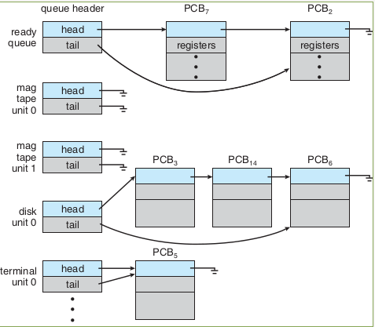
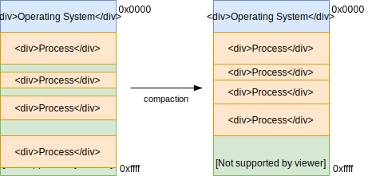

:data-transition-duration: 1000
:skip-help: true
:css: ./style.css
:substep: true
:data-width: 1024
:data-height: 768

.. title: Operating Systems - Memory  (By Ahmad Yoosofan)

:slide-numbers: true

.. role:: ltr
    :class: ltr

.. role:: rtl
    :class: rtl

Operating Systems
==============================
Memory Management
---------------------------
Ahmad Yoosofan

University of Kashan

.. :

  ----

  .. class:: rtl-h1

      تخصیص حافظهٔ پیوسته به فرآیندها

  .. class:: rtl-h2

      به فرآیندها حافظهٔ پیوسته‌ای داده شود.

----

.. image:: img/memory/memory_fixed_partitioning.png
   :align: center
   :height: 600px

.. note:

    Fixed Partitioining

----

.. class:: rtl-h1

    تخصیص حافظه به فرآیندها در حالت بخش‌بندی ثابت حافظه

.. image:: img/memory/memory_fixed_allocation.png
   :align: center

----

.. class:: rtl-h1

    مشکلات بخش‌بندی ثابت

.. class:: rtl

    #. انعطاف بسیار پایین
    #. محدودیت زیاد برای اندازهٔ فرایند در حالی که فضای حافظه خالی است.
    #. تکه تکه شدن یا پراکندی داخلی internal fragmentation
    #. هدر رفت حافظه
        * بخشی از حافظه که به فرایند داده شده است فقط برای آن فرایند است.
        * یعنی اگر بخشی از آن را فرایند به کار نبرد هدر رفته است.

----

.. class:: rtl-h1

    تکه تکه شدن (پراکندگی) داخلی حافظه

Internal Memory Fragmentation

.. image:: img/memory/memory_fixed_partitioning_internal_fragmentation.png
   :align: center

https://www.geeksforgeeks.org/difference-between-internal-and-external-fragmentation/

.. :

  operating system internal memory fragmentation fixed size partitioning
  Multi Programming

----

.. class:: rtl-h1

    بخش‌بندی پویای حافظه

.. image:: img/memory/memory_management_pc.png
   :align: center
   :height: 470px

----

.. class:: rtl-h1

    حافظهٔ فرآیندها در سیستم عامل CTSS

.. image:: img/memory/memory_of_CTSS.png
   :align: center

----

.. class:: rtl-h1

    اثر به کارگیری حافظهٔ پویا

.. image:: img/memory/memory_effect_of_dynamic_partitioning.png
   :align: center
   :height: 500px

----

.. image:: img/in/process_state_chart.png
   :align: center

----

Process Control Block (PCB)
=================================
.. image:: img/in/pcb01.png
   :align: center

----

.. image:: img/in/simple_multiple_process.png
   :align: center
   :height: 500px

----

.. class:: rtl-h1

    چگونگی کارکرد پیوند زدن تابع‌ها از پرونده‌های گوناگون

.. image:: img/memory/memory_linking_function.png
   :align: center

----

.. image:: img/in/system_call02.png
   :align: center

----

Queue
=========

----

.. class:: rtl-h1

    برگزیدن فضای آزاد برای فرآیند تازه وارد

.. class:: substep rtl

    *  اولین برازش(First Fit)
    *  بهترین برازش(Best Fit)
    *  بدترین برازش(Worst Fit)
    *  درپی برازش (برازش بعدی Next Fit)

----

.. image:: img/memory/memory_select_part_for_allocation.png
   :align: center
   :height: 500px

----

.. class:: rtl-h1

    تکه تکه شدن (پراکندگی یا پارگی) خارجی

External Fragmentation
------------------------

----

Compaction
============

.. ::

    https://web.fe.up.pt/~arestivo/presentation/os-memory/#15

    Memory-Compaction-in-contiguous-memory-allocation-1.jpg
    https://binaryterms.com/contiguous-memory-allocation-in-operating-system.html

    compaction.png
    https://github.com/mor1/ia-operating-systems/wiki/06-Virtual-Addressing
    https://github.com/mor1/ia-operating-systems

    https://www.faceprep.in/operating-systems/operating-systems-fragmentation-and-compaction/

    https://slideplayer.com/slide/7084682/

----

.. class:: rtl-h1

    حافظهٔ پویای رفاقتی Buddy system

.. image:: img/memory/memory_buddy_system1.png
   :align: center
   :height: 500px

----

.. image:: img/memory/memory_buddy_system2.png
   :align: center
   :scale: 90%

----

.. class:: rtl-h1

    الگوریتم اجرا

.. image:: img/memory/memory_buddy_system3.png
   :align: center

----

Process Suspension
==================
.. image:: img/memory/swapping_processes.png
   :align: center

----

.. image:: img/memory/suspend_state.png
   :align: center
   :width: 500px
   :height: 500px

----

overlay
=============
.. image:: img/memory/memory_ovelay_turbo_c.jpg
   :align: center
   :width: 500px
   :height: 600px

----

.. class:: rtl-h1

    سلسله مراتب حافظه

.. image:: img/memory/memory_hierarchy_1_4_StorageDeviceHierarchy.jpg
   :align: center

.. :

    `cs.uic.edu <https://www.cs.uic.edu/~jbell/CourseNotes/OperatingSystems/images/Chapter1/1_4_StorageDeviceHierarchy.jpg>`_

----

.. class:: rtl-h1

    سلسله مراتب حافظه جزئی‌تر

.. image:: img/memory/memory_hierarchy_hei.png
   :align: center

.. :

  https://www.cs.uic.edu/~jbell/CourseNotes/OperatingSystems/images/Chapter1/1_4_StorageDeviceHierarchy.jpg
  http://images.bit-tech.net/content_images/2007/11/the_secrets_of_pc_memory_part_1/hei.png

----

.. class:: rtl-h1

    حافظهٔ نهان

.. image:: img/memory/memory_cache_Cache_hierarchy-example.svg
   :align: center

.. :

    `wikipedia.org Cache,hierarchy <https://en.wikipedia.org/wiki/File:Cache,hierarchy-example.svg>`_
    `wikipedia.org CPU_cache <https://en.wikipedia.org/wiki/CPU_cache>`_

----

.. class:: rtl-h1

    حافظهٔ نهان دو سطحی در یک پردازندهٔ واقعی

.. image:: img/memory/memory_cache_image025.jpg
   :align: center

.. :

    `link <https://www.byclb.com/TR/Tutorials/dsp_advanced/ch1_1_dosyalar/image025.jpg>`_

----

.. class:: rtl-h1

    الگوریتم خواندن و نوشتن از حافظهٔ نهان

.. image:: img/memory/memory_cache_read_write_algorithm_Write-back_with_write-allocation.svg
   :align: center
   :width: 500px
   :height: 650px

----

Effective Access Time (EAT)
================================
.. class:: substep

    * :math:`t_m` : :rtl:`زمان دسترسی به حافظه‌ی اصلی`
    * :math:`t_c` : :rtl:`زمان دسترسی به حافظه‌ی نهان`
    * :math:`h_c` : :rtl:`ضریب اصابت به حافظه‌ی نهان`

    .. math::

      EAT = h_c * t_c + ( 1 - h_c ) * ( t_m + t_c )

----

.. class:: rtl-h1

    اگر ضریب اصابت (یا نسبت اصابت) برای پردازنده‌ای 0.95 باشد و سرعت دسترسی به حافظهٔ اصلی 100 میکرو ثانیه باشد و سرعت دسترسی حافظهٔ نهان 1 میکرو ثانیه باشد در این صورت زمان دسترسی مؤثر برابر خواهد بود با

.. class:: substep

    * EAT = 0.95 * 1 + (1 − 0.95) * (100 + 1)
    * EAT = 0.95 + 0.05 * 101
    * EAT = 0.95 + 5.05
    * EAT = 6 μs

----

.. image:: img/memory/memory_effect_of_cache.png
   :align: center

----

.. raw:: html

    <table border="1px" class="center"><tr >
    <td>ms</td><td>μs</td><td>ns</td><td>action</td><tr >
    <td></td><td></td><td>0.5</td><td>CPU L1 dCACHE reference</td></tr><tr >
    <td></td><td></td><td>1</td><td>speed-of-light (a photon) travel a 1 ft (30.5cm) distance</td></tr><tr >
    <td></td><td></td><td>5</td><td>CPU L1 iCACHE Branch mispredict</td></tr><tr >
    <td></td><td></td><td>7</td><td>CPU L2  CACHE reference</td></tr><tr >
    <td></td><td></td><td>71</td><td>CPU cross-QPI/NUMA best  case on XEON E5-46</td><tr >
    <td></td><td></td><td>100</td><td>MUTEX lock/unlock</td><tr >
    <td></td><td></td><td>100</td><td>own DDR MEMORY reference</td><tr >
    <td></td><td>20</td><td>000</td><td>Send 2K bytes over 1 Gbps NETWORK</td><tr >
    <td></td><td>250</td><td>000</td><td>Read 1 MB sequentially from MEMORY</td><tr >
    <td>10</td><td>000</td><td>000</td><td>DISK seek</td><tr >
    <td>10</td><td>000</td><td>000</td><td>Read 1 MB sequentially from NETWORK</td><tr >
    <td>30</td><td>000</td><td>000</td><td>Read 1 MB sequentially from DISK</td><tr >
    <td>150</td><td>000</td><td>000</td><td>Send a NETWORK packet CA -> Netherlands</td><tr >
    </tr></table>
    <a href="https://stackoverflow.com/questions/4087280/approximate-cost-to-access-various-caches-and-main-memory#4087315">[link]</a>

----

.. image:: img/memory/base_limit_register.png
   :align: center

----

.. image:: img/in/process_parts.png
   :align: center

----

.. class:: rtl-h1

    بخش‌های درونی یک فرآیند در حالت کلی

.. image:: img/memory/memory_precess_addressing_parts.png
   :align: center

----

.. class:: rtl-h1

    مشخص شدن آدرس‌های حافظهٔ فرآیند

.. image:: img/memory/memory_program_address_binding.png
   :align: center

----

.. image:: img/memory/memory_linking_loading_scenario.png
   :align: center
   :scale: 90%

----

address binding, loader

.. image:: img/memory/memory_address_binding_loader.png
   :align: center
   :scale: 90%

----

address binding, linker

.. image:: img/memory/memory_address_binding_linker.png
   :align: center
   :scale: 90%

----

Stack
===========
#. Process stack
#. System stack

----

.. image:: img/in/system_overview01.png
   :align: center

----

Micro Kernel
===============
.. image:: img/in/micro_kernel01.png
   :align: center
   :width: 850px

----

Multi Layer
===============
.. image:: img/in/multilayer_os01.png
   :align: center

----

DMA
=====
.. image:: img/memory/system-configuration-with-dmac.png

----

.. image:: img/memory/GigabyteZ77-HD4-Top.jpg
    :align: center
    :width: 500px
    :height: 750px

----

END

----

References(I)
==================================================
* `<https://stackoverflow.com/questions/18550370/calculate-the-effective-access-time>`_
* `<http://os-book.com/>`_
* https://en.wikipedia.org/wiki/Paging
* Sean K. Barker (https://tildesites.bowdoin.edu/~sbarker/)
    * https://tildesites.bowdoin.edu/~sbarker/teaching/courses/os/14spring/slides/lec12.pdf
    * https://tildesites.bowdoin.edu/~sbarker/teaching/courses/os/14spring/lectures.html
* `<https://en.wikipedia.org/wiki/Page_(computer_memory)>`_
* http://blog.cs.miami.edu/burt/2012/10/31/virtual-memory-pages-and-page-frames/
* `<https://www.tldp.org/LDP/tlk/mm/memory.html>`_
* https://www.cse.iitb.ac.in/~mythili/teaching/cs347_autumn2016/notes/07-memory.pdf

----

References(II)
==================================================
* https://www.kernel.org/doc/html/latest/admin-guide/mm/index.html
* https://www.geeksforgeeks.org/operating-system-paging/
* https://samypesse.gitbooks.io/how-to-create-an-operating-system/Chapter-8/
* https://www.javatpoint.com/os-segmented-paging
* https://www.geeksforgeeks.org/difference-between-internal-and-external-fragmentation/
* https://web.fe.up.pt/~arestivo/presentation/os-memory/#15
* https://binaryterms.com/contiguous-memory-allocation-in-operating-system.html
* https://github.com/mor1/ia-operating-systems/wiki/06-Virtual-Addressing

----

References(III)
==================================================
* https://github.com/mor1/ia-operating-systems
* https://www.faceprep.in/operating-systems/operating-systems-fragmentation-and-compaction/
* https://slideplayer.com/slide/7084682/
* https://www.cs.uic.edu/~jbell/CourseNotes/OperatingSystems/images/Chapter1/1_4_StorageDeviceHierarchy.jpg
* http://images.bit-tech.net/content_images/2007/11/the_secrets_of_pc_memory_part_1/hei.png
* https://en.wikipedia.org/wiki/Cache_(computing)
* https://www.byclb.com/TR/Tutorials/dsp_advanced/ch1_1_dosyalar/image025.jpg
* https://en.wikipedia.org/wiki/File:Cache,hierarchy-example.svg
* https://en.wikipedia.org/wiki/CPU_cache
* https://tutorialspoint.dev/image/Translation.png

----

References(IV)
==================================================
* https://www.cs.princeton.edu/courses/archive/spr11/cos217/lectures/18MemoryMgmt.pdf
* http://harmanani.github.io/classes/csc320/Notes/ch05.pdf
* https://www.cs.princeton.edu/courses/archive/spr11/cos217/lectures/18MemoryMgmt.pdf
* http://harmanani.github.io/classes/csc320/Notes/ch05.pdf
* https://www.gatevidyalay.com/translation-lookaside-buffer-tlb-paging/
* https://www.amazon.com/ASUS-DDR3-Intel-Motherboard-H61M/dp/B00BN36V4W
* https://www.asus.com/Motherboards-Components/Motherboards/Workstation/P10S-WS/
* https://commons.wikimedia.org/wiki/File:Intel_D945GCCR_Socket_775.png

----

References(V)
==================================================
* https://witscad.com/course/computer-architecture/chapter/dma-controller-and-io-processor
* https://www.uou.ac.in/lecturenotes/computer-science/BCA-17/Computer%20Organization%20Part%202.pdf
* https://www.pvpsiddhartha.ac.in/dep_it/lecturenotes/CSA/unit-5.pdf
* https://toshiba.semicon-storage.com/us/semiconductor/knowledge/e-learning/micro-intro/chapter4/interrupt-processing-types-interrupts.html
* https://stackoverflow.com/questions/4087280/approximate-cost-to-access-various-caches-and-main-memory#4087315
* https://codex.cs.yale.edu/avi/os-book/
