:data-transition-duration: 1000
:skip-help: true
:css: ./style.css
:substep: true
:data-width: 1024
:data-height: 768

.. title: Operating Systems - Memory  (By Ahmad Yoosofan)

:slide-numbers: true

.. role:: ltr
    :class: ltr

.. role:: rtl
    :class: rtl

Operating Systems
==============================
Memory Management
---------------------------
Ahmad Yoosofan

https://yoosofan.github.io/slide/os/mem/

https://yoosofan.github.io/course/os.html

----

:class: t2c

Fixed Partitioining or Static Partitioning
==========================================
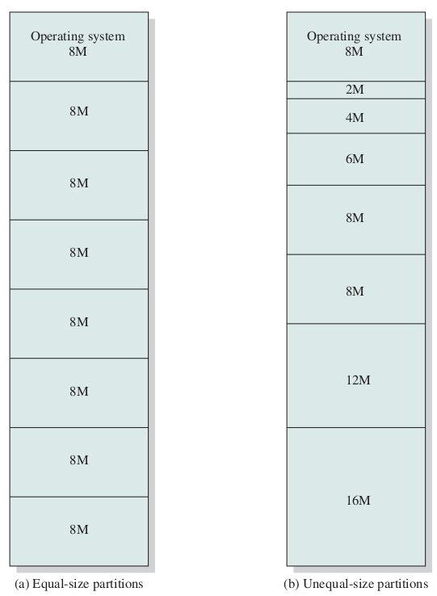

.. class:: substep

* Equal-Size Partitions
* Unequal-Size Partitions
* Pros:
    * Minimal Hardware Complexity
    * Simple OS Logic
    * Low Overhead
* Cons:
    * Internal Fragmentation
    * Fixed Process Limit
    * Maximum Size Limit
* .. image:: img/memory/memory_fixed_partitioning_internal_fragmentation.png
    :align: center
    :width: 300px

.. :

    operating system internal memory fragmentation fixed size partitioning
    Multi Programming

    https://www.geeksforgeeks.org/difference-between-internal-and-external-fragmentation/

        مشکلات بخش‌بندی ثابت

    .. class:: rtl

        #. انعطاف بسیار پایین
        #. محدودیت زیاد برای اندازهٔ فرایند در حالی که فضای حافظه خالی است.
        #. تکه تکه شدن یا پراکندی داخلی internal fragmentation
        #. هدر رفت حافظه
            * بخشی از حافظه که به فرایند داده شده است فقط برای آن فرایند است.
            * یعنی اگر بخشی از آن را فرایند به کار نبرد هدر رفته است.

    ----

    .. class:: rtl-h1

        تخصیص حافظه به فرآیندها در حالت بخش‌بندی ثابت حافظه

    .. image:: img/memory/memory_fixed_allocation.png
       :align: center

    ----

    .. class:: rtl-h1

        بخش‌بندی پویای حافظه

    .. image:: img/memory/memory_management_pc.png
       :align: center
       :height: 470px

----

:class: t2c

Dynamic Partitioning
====================
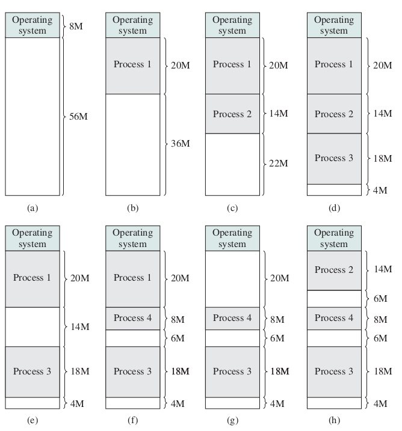

.. class:: substep

* Hole Tracking or free space tracking
    * Bitmaps
    * Linked Lists
* External fragmentation
*  .. csv-table::
        :class: substep

        Feature,Fixed,Dynamic
        Partition Size,Static ,Dynamic
        Fragmentation,Internal,External
        Efficiency,Low ,High
* Coalescing (The "Neighborly" Cleanup)
    * Merge free space
* compaction

.. csv-table:
    :class: substep

    Feature,Fixed Partitioning,Dynamic Partitioning
    Partition Size,Static (set at boot),Dynamic (set at load-time)
    Fragmentation,Internal (Space wasted inside),External (Space wasted between)
    Compaction,Not needed,Essential
    Efficiency,Low (Wasteful of RAM),High (Better RAM utilization)

.. :

    Thanks Gemini AI for the above table

----

:class: t2c

Placement algorithms
====================
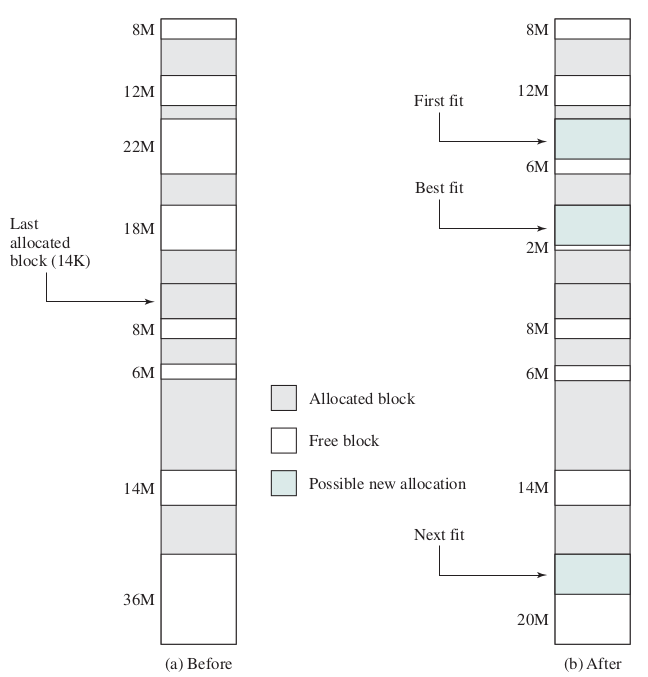

.. class:: substep

* First Fit
    * pros: fast
    * cons: clog
* Best Fit
    * pros:
    * cons: Slow, Small holes
* Worst Fit
    * pros: large leftover
    * cons: slow, use largest
* Next Fit
    * pros: Prevents clogging
    * cons:
* Quick Fit or Segregated Fit (different lists)
    * pros: instant allocation
    * cons: overhead of OS

.. :

    Algorithm,Search Effort,Leftover Fragment,Primary Weakness
    First Fit,Low (Partial Scan),Variable,Fragments the start of RAM
    Next Fit,Low (Partial Scan),Variable,Fragments the end of RAM
    Best Fit,High (Full Scan),Smallest,"Creates tiny, useless ""slivers"""
    Worst Fit,High (Full Scan),Largest,Eliminates large contiguous blocks

    5. Quick Fit (or Segregated Fit)

    Commonly used in real-world modern kernels and memory allocators (like malloc).

        The Strategy: The OS maintains separate linked lists for common requested sizes (e.g., a list for 4KB holes, a list for 16KB holes, etc.).

        Pros: Near-instant allocation for standard sizes.

        Cons: High overhead for the OS to maintain and "bin" these holes.----

----

:class: t2c

Compaction or Defragmentation
=============================
.. yographviz::

    digraph Compaction {
        rankdir=LR;
        node [shape=none, fontname="Courier New"];

        // Before Compaction
        Before [label=<
            <table border="0" cellborder="1" cellspacing="0" cellpadding="10">
                <tr><td bgcolor="#D1D1D1">Process A (10KB)</td></tr>
                <tr><td bgcolor="#FFFFFF"><b>Hole 1 (5KB)</b></td></tr>
                <tr><td bgcolor="#D1D1D1">Process B (15KB)</td></tr>
                <tr><td bgcolor="#FFFFFF"><b>Hole 2 (10KB)</b></td></tr>
                <tr><td bgcolor="#D1D1D1">Process C (10KB)</td></tr>
                <tr><td bgcolor="#FFFFFF"><b>Hole 3 (20KB)</b></td></tr>
            </table>
        >];

        // After Compaction
        After [label=<
            <table border="0" cellborder="1" cellspacing="0" cellpadding="10">
                <tr><td bgcolor="#D1D1D1">Process A (10KB)</td></tr>
                <tr><td bgcolor="#D1D1D1">Process B (15KB)</td></tr>
                <tr><td bgcolor="#D1D1D1">Process C (10KB)</td></tr>
                <tr><td bgcolor="#FFFFFF" height="80"><b>Total Free Space (35KB)</b></td></tr>
            </table>
        >];

        // Arrow indicating the process
        Before -> After [label=" COMPACTION ", fontcolor="red", fontsize=12];

        label = "Memory Compaction: Merging External Fragments";
        labelloc = "t";
    }

.. class:: substep

* cost
    * CPU Cycles
    * Bus Saturation
    * System Freeze
* Strategies
    * Move to One End
    * Minimal Movement
* Trigger
    * Allocation Failure
    * Idle Time
    * Threshold
* Pros
    * Maximizes RAM Utilization
    * Enables Large Processes
    * Simplifies Placement
* Cons
    * Extreme Overhead
    * Requires Special Hardware
    * Interrupts Execution

.. :

    .. image:: img/memory/compaction.svg
       :align: center

    Pros,Cons
    Maximizes RAM Utilization: Prevents jobs from waiting when there is theoretically enough space.,Extreme Overhead: Copying megabytes or gigabytes of RAM is slow.
    Enables Large Processes: Allows the system to accommodate programs that otherwise couldn't fit.,Requires Special HW: Needs an MMU/Base-Limit registers to work.
    "Simplifies Placement: After compaction, ""First Fit"" becomes trivial because there is only one hole.","Interrupts Execution: Can cause ""stuttering"" in real-time or interactive systems."

    https://web.fe.up.pt/~arestivo/presentation/os-memory/#15

    Memory-Compaction-in-contiguous-memory-allocation-1.jpg
    https://binaryterms.com/contiguous-memory-allocation-in-operating-system.html

    compaction.png
    https://github.com/mor1/ia-operating-systems/wiki/06-Virtual-Addressing
    https://github.com/mor1/ia-operating-systems

    https://www.faceprep.in/operating-systems/operating-systems-fragmentation-and-compaction/

    https://slideplayer.com/slide/7084682/

----

Buddy System Memory Management(I)
=================================
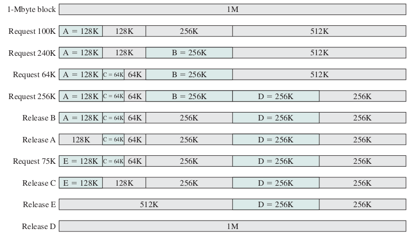

----

:class: t4c

Buddy System Memory Management(II)
==================================
.. yographviz::
    :width: 220

    digraph Buddy1 {
        label="A 100";
        labelloc = "t";
        rankdir=TB;
        node [shape=rectangle];
        0 [label="1 M"];
        1 [label="512 K"];
        2 [label="512 K"];

        0 -> 1;
        0 -> 2;

        3 [label="256 K"];
        4 [label="256 K"];

        1 -> 3;
        1 -> 4;

        5 [label="A(100)"];
        6 [label="128 K"];

        3 -> 5;
        3 -> 6;

    }

.. yographviz::
    :width: 200
    :class: substep

    digraph Buddy2 {
        label="B 240";
        labelloc = "t";

        rankdir=TB;
        node [shape=rectangle];
        0 [label="1 M"];
        1 [label="512"];
        2 [label="512"];

        0 -> 1;
        0 -> 2;

        3 [label="256"];
        4 [label="B"];

        1 -> 3;
        1 -> 4;

        5 [label="A"];
        6 [label="128"];

        3 -> 5;
        3 -> 6;

    }

.. yographviz::
    :width: 200
    :class: substep

    digraph Buddy3 {
        label="C 64";
        labelloc = "t";

        rankdir=TB;
        node [shape=rectangle];
        0 [label="1 M"];
        1 [label="512"];
        2 [label="512"];

        0 -> 1;
        0 -> 2;

        3 [label="256"];
        4 [label="B"];

        1 -> 3;
        1 -> 4;

        5 [label="A"];
        6 [label="128"];

        3 -> 5;
        3 -> 6;

        7 [label="C(64)"];
        8 [label="64"];

        6 -> 7;
        6 -> 8;

    }

.. yographviz::
    :width: 300
    :class: substep

    digraph Buddy4 {
        label="D 256";
        labelloc = "t";

        rankdir=TB;
        node [shape=rectangle];
        0 [label="1 M"];
        1 [label="512"];
        2 [label="512"];

        0 -> 1;
        0 -> 2;

        3 [label="256"];
        4 [label="B"];

        1 -> 3;
        1 -> 4;

        5 [label="A"];
        6 [label="128"];

        3 -> 5;
        3 -> 6;

        7 [label="C(64)"];
        8 [label="64"];

        6 -> 7;
        6 -> 8;

        21 [label="D"];
        22 [label="256"];

        2 -> 21;
        2 -> 22;

    }

.. yographviz::
    :width: 300
    :class: substep

    digraph Buddy5 {
        label="Release A and B";
        labelloc = "t";

        rankdir=TB;
        node [shape=rectangle];
        0 [label="1 M"];
        1 [label="512"];
        2 [label="512"];

        0 -> 1;
        0 -> 2;

        3 [label="256"];
        4 [label="256"];

        1 -> 3;
        1 -> 4;

        5 [label="128"];
        6 [label="128"];

        3 -> 5;
        3 -> 6;

        7 [label="C(64)"];
        8 [label="64"];

        6 -> 7;
        6 -> 8;

        21 [label="D"];
        22 [label="256"];

        2 -> 21;
        2 -> 22;

    }

.. yographviz::
    :width: 300
    :class: substep

    digraph Buddy6 {
        label="E 74";
        labelloc = "t";

        rankdir=TB;
        node [shape=rectangle];
        0 [label="1 M"];
        1 [label="512"];
        2 [label="512"];

        0 -> 1;
        0 -> 2;

        3 [label="256"];
        4 [label="256"];

        1 -> 3;
        1 -> 4;

        5 [label="E"];
        6 [label="128"];

        3 -> 5;
        3 -> 6;

        7 [label="C(64)"];
        8 [label="64"];

        6 -> 7;
        6 -> 8;

        21 [label="D"];
        22 [label="256"];

        2 -> 21;
        2 -> 22;

    }

.. yographviz::
    :width: 300
    :class: substep

    digraph Buddy7 {
        label="Release C";
        labelloc = "t";

        rankdir=TB;
        node [shape=rectangle];
        0 [label="1 M"];
        1 [label="512"];
        2 [label="512"];

        0 -> 1;
        0 -> 2;

        3 [label="256"];
        4 [label="256"];

        1 -> 3;
        1 -> 4;

        5 [label="E"];
        6 [label="128"];

        3 -> 5;
        3 -> 6;

        21 [label="D"];
        22 [label="256"];

        2 -> 21;
        2 -> 22;

    }

.. yographviz::
    :width: 160
    :class: substep

    digraph Buddy8 {
        label="Release E";
        labelloc = "t";

        rankdir=TB;
        node [shape=rectangle];
        0 [label="1 M"];
        1 [label="512"];
        2 [label="512"];

        0 -> 1;
        0 -> 2;

        21 [label="D"];
        22 [label="256"];

        2 -> 21;
        2 -> 22;
    }

----

Buddy System Memory Management(III)
===================================
.. class:: substep

#. **A hybrid memory allocator** balances fixed and dynamic partitioning
    * dividing memory into partitions of base-2 sizes (powers of 2).
#. **The Allocation Process (Splitting)**
    * Memory blocks are sized as :math:`2^k` (e.g., 4KB, 8KB, 16KB).
    * If a process requests a size that is not a power of 2, the OS rounds up to the next highest power.
    * If only a larger block (e.g., 64KB) is available, the OS recursively splits it in half until the target size is reached:
        * 64KB splits into two 32KB buddies.
        * One 32KB splits into two 16KB buddies (one is allocated, one remains free).
#. **The Deallocation Process (Coalescing)**
    * When a block is freed, the OS checks the status of its specific "buddy".
    * If the buddy is also free, they immediately merge back into their parent size.
    * This process cascades upward automatically to form the largest possible free blocks.
#. **The Mathematical Advantage (Speed)**
    * The system is incredibly fast because finding a buddy requires no list searching.
    * The buddy of a block of size :math:`S` at address :math:`A` is located at exactly :math:`A \oplus S` (Bitwise XOR).
    * The OS calculates this directly in hardware.
#. **Pros:**
    * Extremely fast allocation
    * Coalescing
    * highly predictable performance.
#. **Cons:**
    * **Internal Fragmentation**
    * **External Fragmentation**
#. Usage
    #. The Linux Kernel
    #. Early UNIX Systems
    #. Modern Memory Allocators (`jemalloc`)
        * Used by FreeBSD and Facebook

.. note::
    Thanks to Gemini AI for helping to create this slide

    * Lecture tip: Draw a tree on the board starting with a 1024KB block and split it down the left side to show how the "buddies" wait for their partner to return.
    * Real-world connection: Mention that the Linux kernel still relies on a variation of the Buddy System for managing its physical memory pages today because the bitwise XOR speed is unbeatable.
    * The main takeaway for students is the engineering trade-off: We are purposely wasting memory (Internal Fragmentation) to gain CPU speed (O(1) coalescing).

    A hybrid memory allocator that balances fixed and dynamic partitioning by dividing memory into partitions of base-2 sizes (powers of 2).

    Yes, absolutely! The Buddy System is not just a theoretical academic concept; it is one of the most famous and widely implemented memory management algorithms in computing history.

    Here is where it has been used in the real world:

    **1. The Linux Kernel**
    This is the most prominent and important modern example. The Linux operating system relies on a binary buddy allocator as its primary **physical memory manager** (specifically, the "page allocator").

    * When the kernel needs a block of contiguous memory pages to give to a process or use for itself, it queries the buddy system.
    * To solve the problem of internal fragmentation for very small memory requests, Linux layers a second system called a **Slab Allocator** on top of the buddy system. The buddy system handles the big chunks, and the slab allocator carves those chunks into exact sizes for the kernel to use.

    **2. Early UNIX Systems**
    Various forms of the buddy system were used in early UNIX distributions and other historical operating systems to manage dynamic memory efficiently before modern paging hardware became universally standard.

    **3. Modern Memory Allocators (`jemalloc`)**
    While user-space programming functions (like calling `malloc()` in a C program) don't typically use a pure buddy system today, modern high-performance allocators like `jemalloc` (used by FreeBSD and Facebook) use concepts directly derived from it. They group memory into distinct "size classes" and split large blocks into smaller runs, mimicking the buddy system's efficiency.

    **Why it survived in the real world:**
    It survived the jump from textbooks to production kernels precisely because of the bitwise XOR math trick. When an operating system kernel is managing raw hardware memory, it has to be lightning fast. The ability to find, split, and merge free memory in $O(1)$ time—meaning it takes the exact same amount of time regardless of how much memory is installed—makes the wasted space (internal fragmentation) a completely acceptable trade-off.

    #. **Summary of Trade-offs**
        * **Pros:**
            * Extremely fast allocation
            * Coalescing
            * highly predictable performance.
        * **Cons:**
            * **Internal Fragmentation**
            * **External Fragmentation**

.. :

    * **Concept**
        * Memory split in powers of 2.
        * Requested size rounded up.
        * Recursive splitting of blocks.
    * **The Buddy Logic**
        * Block :math:`2^k` split into two buddies.
        * Freeing: Check if buddy is free.
        * Coalesce buddies into parent.
    * **Pros**
        * Fast allocation/deallocation.
        * Efficient coalescing.
    * **Cons**
        * Internal fragmentation.
        * Limited by power-of-2 sizing.

.. note::
    - The Buddy System bridges the gap between fixed and dynamic partitioning.
    - An address X of size 2^k has a unique buddy at X XOR 2^k.
    - XOR-based buddy addressing allows O(1) identification of the neighbor.
    - Trade-off: We sacrifice up to 50% of block space (Internal Fragmentation)
      to gain high-speed allocation/coalescing.

    * **Core Idea**:
      * Memory is allocated in sizes of **powers of 2** (e.g., 2, 4, 8, 16... KB).
      * If a request doesn't match a power of 2, the next larger size is used.
    * **The "Buddy" Logic**:
      * If a block of size :math:`2^k` is needed and only a :math:`2^{k+1}` block is available, the OS **splits** it into two equal "buddies".
      * When a block is freed, the OS checks if its buddy is also free.
      * If both are free, they **coalesce** back into the larger parent block.
    * **Pros & Cons**:
      * **Pros**: Very fast coalescing (merging) compared to standard dynamic partitioning.
      * **Cons**: Suffers from **Internal Fragmentation** (up to 50% per block).

.. note:
  The buddy system is an elegant way to avoid the heavy overhead of
  full memory compaction while still maintaining flexibility.

    A compromise between fixed and dynamic partitioning.

.. :

    5. The Buddy System (The Hybrid Approach)This is a sophisticated middle ground that many students find fascinating.Instead of arbitrary sizes, memory is split into powers of 2 ($2^n$).If a process needs 10KB, you split a 32KB block into two 16KB "buddies."It reduces external fragmentation and makes coalescing extremely fast because you only ever merge a block with its specific "buddy."

    .. image:: img/memory/memory_buddy_system1.png
       :align: center
       :height: 500px

.. :

    ----

    .. class:: rtl-h1

        الگوریتم اجرا

    .. image:: img/memory/memory_buddy_system3.png
       :align: center

----

:class: t2c

Process
=======
.. container::

    .. class:: substep

    * Program
        * Place: Cards in card reader, file in disk, flash, etc.
        * passive
    * Process
        * Place: Main Memory (RAM)
        * Active

    .. class:: substep

    **Process Status**

    .. image:: img/in/process_state_chart.png
       :align: center
       :class: substep

.. container:: substep

    **Process Control Block (PCB)**

    .. image:: img/in/pcb01.png
       :align: center

----

:class: n2c

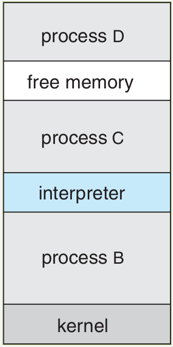

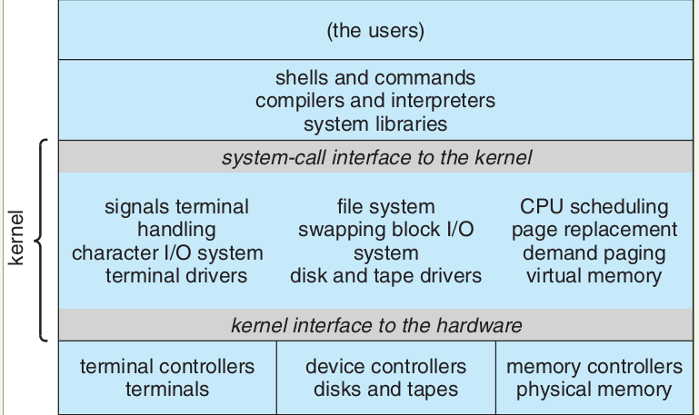

----

:class: n3c

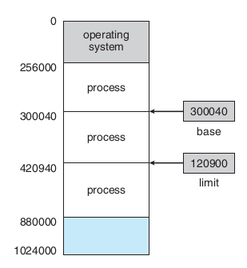

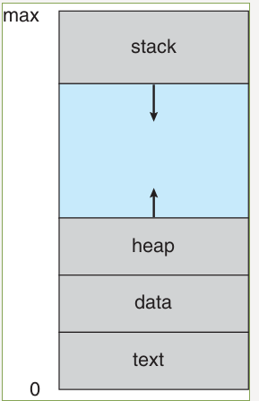

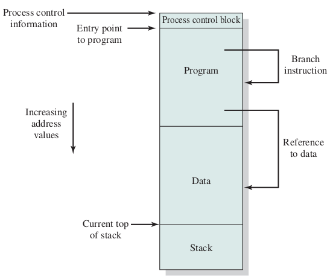

----

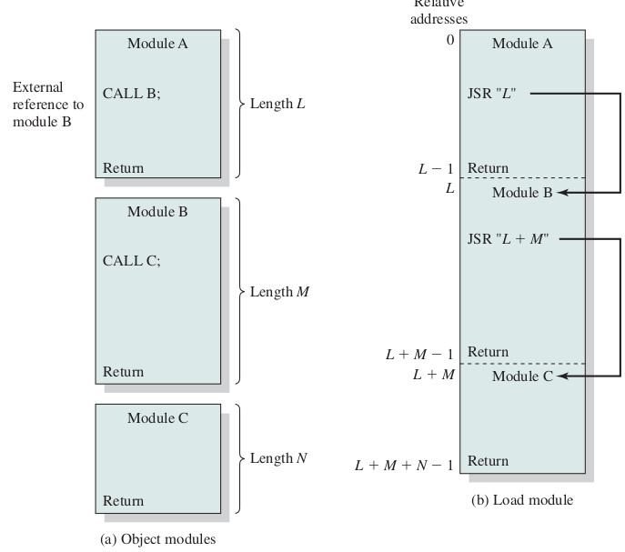

----

:class: n2c

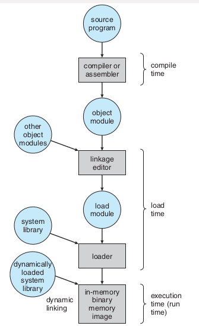

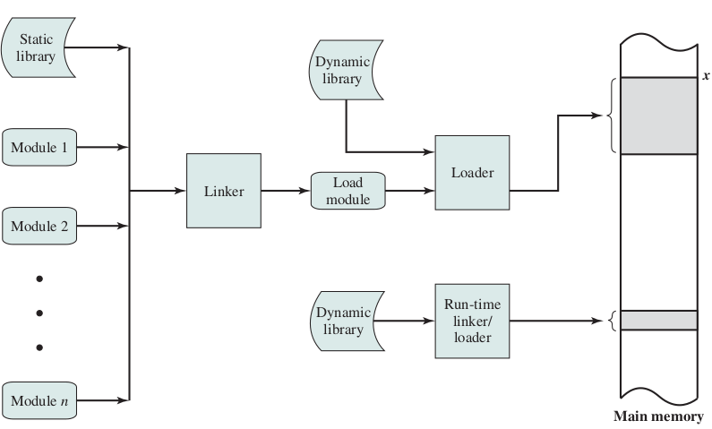

----

address binding, loader

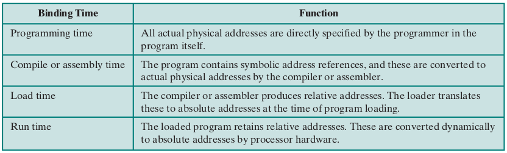

address binding, linker

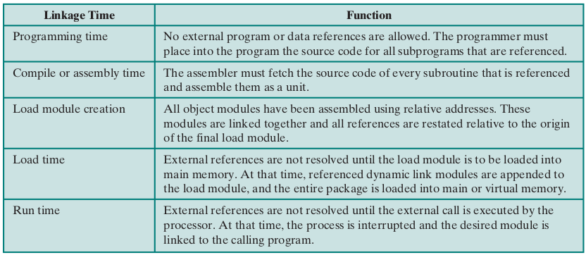

----

:class: t2c

Blocked or Waiting
==================
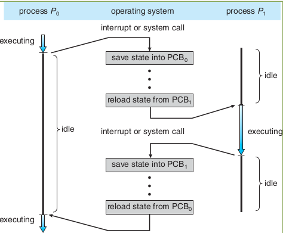

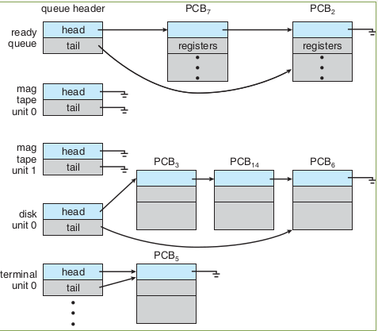

----

:class: t2c

Process Suspension
==================
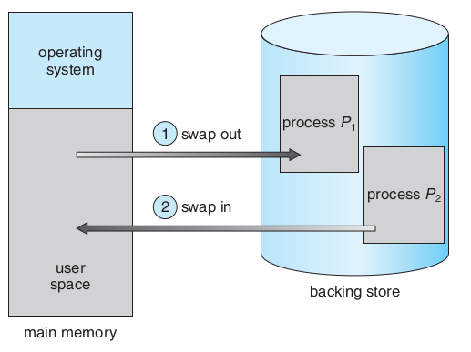

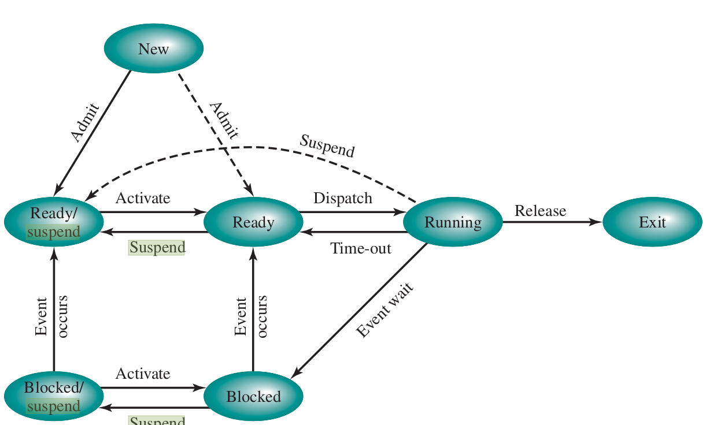

----

:class: t2c

Process Suspension (Swapping)
=============================
.. class:: substep

#. **The 7-State Model Transitions**
    * **Blocked → Blocked/Suspend**
    * **Ready → Ready/Suspend**
    * **Blocked/Suspend → Ready/Suspend**
#. **Reasons for Suspension**
    * **Swapping**
    * **User Request**
    * **Parent Request**
    * **Timing**
#. **Pros**
    * Increases the degree of multiprogramming.
    * Frees space for higher-priority or "Ready" processes.
#. **Cons**
    * **High Latency**
    * **Thrashing**

.. yographviz::
    :width: 600

    digraph Suspension {
        rankdir=TB;
        node [shape=ellipse, fontname="Courier New", style=filled, fillcolor="#e1f5fe"];

        "New" -> "Ready" [label="accept"];
        "Ready" -> "Running" [label="dispatch"];
        "Running" -> "Ready" [label="timeout"];
        "Running" -> "Exit" [label="Release"];
        "Running" -> "Blocked" [label="I/O wait"];
        "Blocked" -> "Ready" [label="I/O occurs"];

        subgraph cluster_disk {
            label = "Disk (Backing Store)";
            color = blue;
            node [fillcolor="#fff3e0"];
            "Blocked/Suspend";
            "Ready/Suspend";
        }

        "Blocked" -> "Blocked/Suspend" [label="Swap Out"];
        "Ready" -> "Ready/Suspend" [label="Swap Out"];
        "Blocked/Suspend" -> "Ready/Suspend" [label="I/O occurs"];
        "Ready/Suspend" -> "Ready" [label="Swap In"];
    }

.. :

    **Summary**
    Process suspension is the OS strategy of moving a process from main memory (RAM) to a secondary storage (backing store/disk). This transition creates the "7-state process model," allowing the OS to manage memory over-commitment and prioritize active processes.

    #. **The 7-State Model Transitions**
        * **Blocked → Blocked/Suspend**: A process waiting for an I/O event is moved to disk to free RAM.
        * **Ready → Ready/Suspend**: A ready process is moved to disk (usually low priority).
        * **Blocked/Suspend → Ready/Suspend**: An event occurs for a swapped-out process; it remains on disk but is now ready for execution.
    #. **Reasons for Suspension**
        * **Swapping**: To free up RAM when memory pressure is high (main reason).
        * **User Request**: Manually pausing a program (e.g., using `Ctrl+Z` in a terminal).
        * **Parent Request**: A parent process suspending a child for synchronization.
        * **Timing**: A periodic process that runs only at specific intervals.
    #. **Trade-offs**
        * **Pros**:
            * Increases the degree of multiprogramming.
            * Allows the system to handle processes larger than total physical RAM.
            * Frees space for higher-priority or "Ready" processes.
        * **Cons**:
            * **High Latency**: Disk I/O is thousands of times slower than RAM access.
            * **Thrashing**: If used excessively, the system spends more time swapping than executing.

    Thanks to Gemini AI for this slide

    **Visualization of State Transitions**

.. note::
    * Suspension is the bridge between Memory Management and Process Management.
    * Emphasize the difference between "Blocked" (waiting in RAM) and "Blocked/Suspend" (waiting on disk).
    * Compaction often requires suspension: all processes are "frozen" and moved, which is why it feels like the computer has "locked up."
    * Thrashing: Explain that if the OS swaps too aggressively, the disk light stays on constantly and CPU utilization drops to near zero.

----

:class: t2c

Memory Overlays
===============
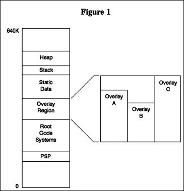

.. class:: substep

#. **Architectural Components**
#. **The Execution Process**
#. **Pros**:
    * **zero hardware or MMU support**
    * Work on small memory
#. **Cons**:
    * **Massive Programmer Burden**
    * Difficult to debug
    * Hard to modularize
    * Hard to upgrade.
#. The Mainframe Era (1960s – 1970s)
    * 16KB to 64KB
    * IBM was the undisputed king
    * 1964, 16KB, Transients
    * UNIVAC & Sperry Rand
    * NASA & The Aerospace
    * Virtual Memory by Paging
#. The Microcomputer/PC Era, 1980s, early 1990s
    * Intel 8086/8088
    * MS-DOS / PC DOS/ Dr Dos
    * Borland, Turbo Pascal/Turbo C
    * Lotus 1-2-3
#. The Extinction of Overlays
    * Virtual Memory by Paging
    * Intel Protected Mode
    * Windows 95 and Linux
    * OS tracking memory entirely

.. :

    **1. Architectural Components**
    * **Root (Driver)**: The core section of the program (containing the main loop, essential variables, and the overlay manager) that remains permanently resident in RAM.
    * **Overlay Area (Buffer)**: A dedicated, fixed section of physical memory allocated by the system to host temporary modules.
    * **Overlay Modules**: Self-contained subprograms or execution phases that are mutually exclusive (they never need to run at the same exact time).

    **2. The Execution Process**
    * The program starts with only the Root loaded into memory.
    * When a specific functionality is needed, the Root manually loads **Module A** into the Overlay Area from disk.
    * Once Module A completes its task, the Root loads **Module B** into the *exact same physical memory address space*, completely overwriting Module A.

    **3. Trade-offs**
    * **Pros**:
        * Requires **zero hardware or MMU support**; can run on the most primitive microprocessors.
        * Enables massive, multi-phase applications to function on heavily memory-constrained systems.
    * **Cons**:
        * **Massive Programmer Burden**: The developer must explicitly design, map, and track the overlay structures and memory footprints.
        * Software becomes incredibly brittle, difficult to debug, and hard to modularize or upgrade.

    Thanks to Gemini AI for this slide

    **Visualization of Overlay Architecture**

    The overlay method is a software-driven memory management technique that allows a program to execute even if its total size exceeds the physical memory available. Instead of relying on automatic operating system or hardware mapping, the programmer manually splits the program into mutually exclusive components that take turns occupying a shared block of RAM.

    ----

    .. yographviz::

        digraph Overlays {
            rankdir=LR;
            node [shape=none, fontname="Courier New"];

            Memory [label=<
                <table border="0" cellborder="1" cellspacing="0" cellpadding="10">
                    <tr><td bgcolor="#e1f5fe" height="40"><b>ROOT DRIVER</b> (Permanently in RAM)</td></tr>
                    <tr><td bgcolor="#fff3e0" port="buffer" height="60"><b>OVERLAY BUFFER</b> (Shared Address Space)</td></tr>
                </table>
            >];

            Modules [label=<
                <table border="0" cellborder="1" cellspacing="0" cellpadding="10">
                    <tr><td bgcolor="#f5f5f5" port="m1"><b>Module Phase 1</b> (e.g., File Parser)</td></tr>
                    <tr><td bgcolor="#d1d1d1" port="m2"><b>Module Phase 2</b> (e.g., Report Generator)</td></tr>
                </table>
            >];

            Modules:m1 -> Memory:buffer [label=" Time T1 ", color=blue, style=dashed];
            Modules:m2 -> Memory:buffer [label=" Time T2 (Overwrite) ", color=red];

            label = "Overlay Memory Mapping Concept";
            labelloc = "t";
        }

.. note::
    * Historical Context: Overlays were widely used in the DOS era (dealing with the infamous 640KB RAM barrier) and early mainframes before Virtual Memory (Paging) became universal.
    * The Key Distinction for Exams: Unlike Swapping or Virtual Memory—which are 100% transparent to the programmer and handled by the OS/Hardware—Overlays are entirely driven by the *user-space software design*.
    * Classic Example: A two-pass compiler. Pass 1 handles lexical analysis and syntax trees. Pass 2 handles optimization and code generation. They never need to coexist in RAM simultaneously, making them perfect candidates for overlays.

    To give your students a rich historical perspective, you can explain that **Overlays** emerged in the **late 1950s and 1960s**, an era when hardware memory was built using primitive "magnetic cores" (literally tiny metal donuts strung on wires). Because core memory was incredibly expensive—costing upwards of $1 to $2 per *byte*—computers had microscopic amounts of RAM compared to their massive physical size.

    The method was championed by the most dominant tech titans of the 20th century across two distinct eras: the **Mainframe Era** and the **Personal Computer (PC) Era**.

    ---

    ### 1. The Mainframe Era (1960s – 1970s)

    In this era, computers filled entire rooms, cost millions of dollars, yet frequently had only **16KB to 64KB** of main memory.

    * **IBM (International Business Machines):** IBM was the undisputed king of computing at the time. When they released the landmark **System/360** mainframes in 1964, the low-end models had a tiny 16KB memory limit. To make their operating system (**DOS/360**) fit, IBM’s own engineers designed the OS kernel using overlays, which they called **Transients**. Essential hardware error routines ($A$-Transients) and file services ($B$-Transients) were manually swapped in and out of a tiny 556-byte buffer in RAM as needed.
    * **UNIVAC & Sperry Rand:** One of IBM's primary competitors, UNIVAC, utilized sophisticated overlay systems in their **EXEC I** and **EXEC II** operating systems for the UNIVAC 1107/1108 mainframes.
    * **NASA & The Aerospace Industry:**

    NASA's early flight computers had strict weight and power limits, meaning very little memory. The **Space Shuttle Primary Avionics System Software (PASS)** famously relied heavily on meticulously programmed overlays to manage navigation, liftoff, and landing sequences within strict hardware constraints.

    ---

    ### 2. The Microcomputer/PC Era (1980s – early 1990s)

    History repeated itself two decades later when personal computers emerged. Although microprocessor memory was cheaper, early PC architectures introduced a new artificial bottleneck: **The 640KB Barrier**.

    * **Microsoft and IBM (MS-DOS / PC DOS):**

    When the IBM PC was released in 1981 running Microsoft's MS-DOS, it used the Intel 8086/8088 processor. Because of how the system architecture was designed, standard user applications were strictly limited to **640KB of "Conventional Memory"**. As software grew more complex, companies hit a brick wall.

    * **Lotus Development Corporation (Lotus 1-2-3):**

    The killer app of the 1980s was *Lotus 1-2-3*, a massive spreadsheet program that businesses ran on IBM PCs. To allow users to build large spreadsheets without running out of the 640KB RAM, Lotus developers manually chopped their software into overlays. The core math engine stayed in memory, while graph drawing modules, printing tools, and file import functions were kept on floppy disks and loaded dynamically into an overlay buffer.

    * **Borland (Turbo Pascal / Turbo C):**

    Borland was famous for its programming tools. Because compilers require multiple distinct steps (Lexical Analysis $\rightarrow$ Parsing $\rightarrow$ Optimization $\rightarrow$ Code Generation), Borland integrated **Overlay Managers** directly into their compilers. A programmer writing a massive program in Turbo Pascal could simply check a box, and the Borland compiler would automatically generate the overlay tree structure for them.

    ---

    ### The Extinction of Overlays

    The decline of overlays is directly tied to an engineering debate at IBM in the late 1960s. An IBM researcher named **David Sayre** argued that automated **Virtual Memory (Paging)** handled by hardware and the OS could perform just as well as, or better than, a human programmer designing complex overlay structures.

    By the mid-1970s for mainframes, and the mid-1990s for PCs (with the release of Windows 95 and Linux running in Intel "Protected Mode"), **Virtual Memory** became standard. The OS took over memory tracking entirely, relieving programmers of the massive burden of designing overlays.

    > **An Anecdote for Class:** > You can tell your students that in the 1980s, being an "Overlay Architect" was a highly praised, highly paid specialty skill. A single mistake in tracking your code dependencies could cause a program to overwrite its own active loop, resulting in spectacular system crashes!

----

.. class:: rtl-h1

    سلسله مراتب حافظه

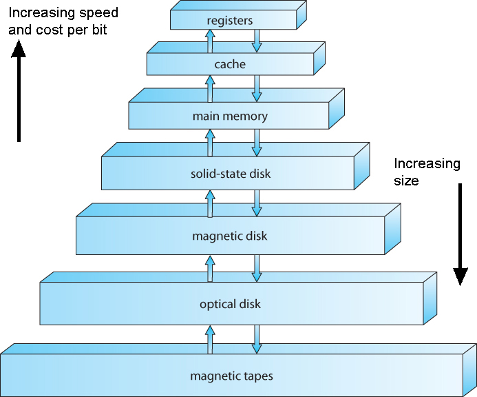

.. :

    `cs.uic.edu <https://www.cs.uic.edu/~jbell/CourseNotes/OperatingSystems/images/Chapter1/1_4_StorageDeviceHierarchy.jpg>`_

----

.. class:: rtl-h1

    سلسله مراتب حافظه جزئی‌تر

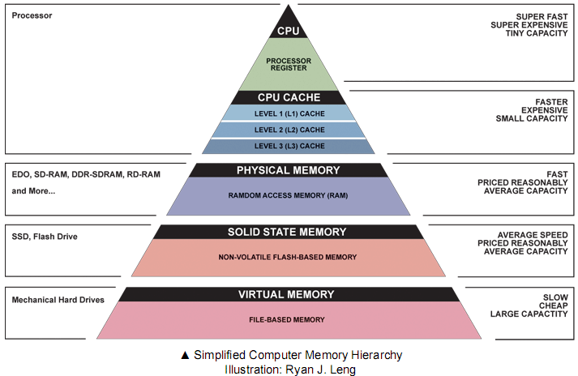

.. :

  https://www.cs.uic.edu/~jbell/CourseNotes/OperatingSystems/images/Chapter1/1_4_StorageDeviceHierarchy.jpg
  http://images.bit-tech.net/content_images/2007/11/the_secrets_of_pc_memory_part_1/hei.png

----

.. class:: rtl-h1

    حافظهٔ نهان

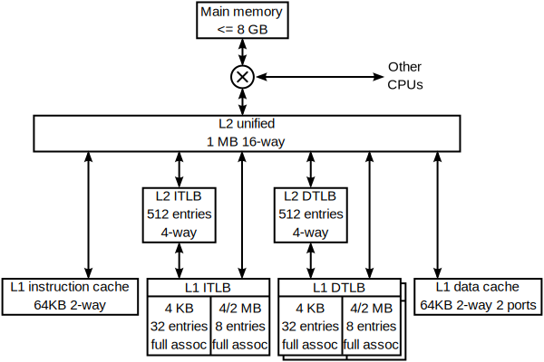

.. :

    `wikipedia.org Cache,hierarchy <https://en.wikipedia.org/wiki/File:Cache,hierarchy-example.svg>`_
    `wikipedia.org CPU_cache <https://en.wikipedia.org/wiki/CPU_cache>`_

----

.. class:: rtl-h1

    حافظهٔ نهان دو سطحی در یک پردازندهٔ واقعی

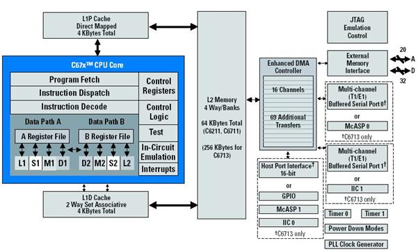

.. :

    `link <https://www.byclb.com/TR/Tutorials/dsp_advanced/ch1_1_dosyalar/image025.jpg>`_

----

.. class:: rtl-h1

    الگوریتم خواندن و نوشتن از حافظهٔ نهان

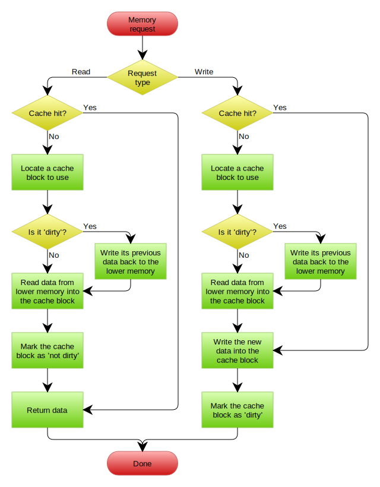

----

Effective Access Time (EAT)
================================
.. class:: substep

    * :math:`t_m` : :rtl:`زمان دسترسی به حافظه‌ی اصلی`
    * :math:`t_c` : :rtl:`زمان دسترسی به حافظه‌ی نهان`
    * :math:`h_c` : :rtl:`ضریب اصابت به حافظه‌ی نهان`

    .. math::

      EAT = h_c * t_c + ( 1 - h_c ) * ( t_m + t_c )

----

.. class:: rtl-h1

    اگر ضریب اصابت (یا نسبت اصابت) برای پردازنده‌ای 0.95 باشد و سرعت دسترسی به حافظهٔ اصلی 100 میکرو ثانیه باشد و سرعت دسترسی حافظهٔ نهان 1 میکرو ثانیه باشد در این صورت زمان دسترسی مؤثر برابر خواهد بود با

.. class:: substep

    * EAT = 0.95 * 1 + (1 − 0.95) * (100 + 1)
    * EAT = 0.95 + 0.05 * 101
    * EAT = 0.95 + 5.05
    * EAT = 6 μs

----

:class: n2c

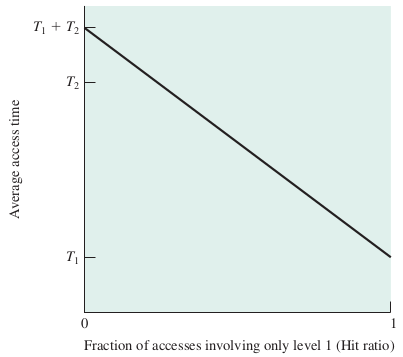

.. raw:: html

    

    <table border="1px" class="center"><tr >
    <td>ms</td><td>μs</td><td>ns</td><td>action</td><tr >
    <td></td><td></td><td>0.5</td><td>CPU L1 dCACHE reference</td></tr><tr >
    <td></td><td></td><td>1</td><td>speed-of-light (a photon) travel a 1 ft (30.5cm) distance</td></tr><tr >
    <td></td><td></td><td>5</td><td>CPU L1 iCACHE Branch mispredict</td></tr><tr >
    <td></td><td></td><td>7</td><td>CPU L2  CACHE reference</td></tr><tr >
    <td></td><td></td><td>71</td><td>CPU cross-QPI/NUMA best  case on XEON E5-46</td><tr >
    <td></td><td></td><td>100</td><td>MUTEX lock/unlock</td><tr >
    <td></td><td></td><td>100</td><td>own DDR MEMORY reference</td><tr >
    <td></td><td>20</td><td>000</td><td>Send 2K bytes over 1 Gbps NETWORK</td><tr >
    <td></td><td>250</td><td>000</td><td>Read 1 MB sequentially from MEMORY</td><tr >
    <td>10</td><td>000</td><td>000</td><td>DISK seek</td><tr >
    <td>10</td><td>000</td><td>000</td><td>Read 1 MB sequentially from NETWORK</td><tr >
    <td>30</td><td>000</td><td>000</td><td>Read 1 MB sequentially from DISK</td><tr >
    <td>150</td><td>000</td><td>000</td><td>Send a NETWORK packet CA -> Netherlands</td><tr >
    </tr></table>
    <a href="https://stackoverflow.com/questions/4087280/approximate-cost-to-access-various-caches-and-main-memory#4087315">[link]</a>
    

----

:class: t2c

Microkernel Architecture
========================
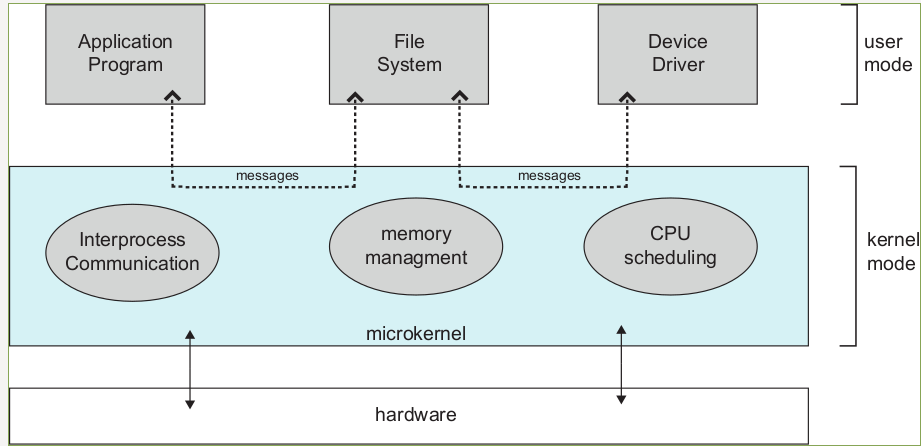

.. class:: substep

#. Core Responsibilities (Inside Kernel Space)
    * **Low-Level Memory Management**
    * **Thread Scheduling**
    * **Inter-Process Communication (IPC)**
#. **Architecture Mechanics**
    * Services run as isolated user processes
    * Application cannot make a direct system call
    * Send an IPC message *through* the microkernel
    * Forwards it to the File Server
#. **Pros**:
    * **High Reliability & Isolation**
    * **Security**
    * **Portability & Extensibility**
#. **Cons**:
    * **Performance Overhead**
#. History
    * The Mach kernel
    * core macOS/iOS XNU hybrid
    * QNX
    * seL4
    * The Tanenbaum-Torvalds Debate
        * MINIX
    * safety and stability.

.. :

    ----

    Microkernel Architecture
    ========================

    **Summary**
    A microkernel strips the operating system down to its absolute bare essentials. Instead of running all OS services inside the highly privileged kernel space (like a traditional Monolithic kernel), a microkernel pushes non-essential components—such as file systems, device drivers, and networking protocols—into the less privileged user space as independent servers.

    **1. Core Responsibilities (Inside Kernel Space)**
    * **Low-Level Memory Management**: Mapping virtual addresses to physical memory.
    * **Thread Scheduling**: Managing CPU execution timelines.
    * **Inter-Process Communication (IPC)**: Acting as the vital mailbox or router that allows user-space servers to safely talk to one another.

    **2. Architecture Mechanics**
    * Services run as isolated user processes (e.g., a "File Server" process, a "Network Server" process).
    * If an application wants to read a file, it cannot make a direct system call. It must send an IPC message *through* the microkernel, which forwards it to the File Server.

    **3. Trade-offs**
    * **Pros**:
        * **High Reliability & Isolation**: If the File Server crashes or has a bug, it simply restarts like a normal app. The entire OS does not panic or crash.
        * **Security**: Minimizes the "attack surface" running with root hardware privileges.
        * **Portability & Extensibility**: Adding a new feature just means starting a new user-space server; the kernel code remains untouched.
    * **Cons**:
        * **Performance Overhead**: Moving data between user space and kernel space requires frequent "context switches" and message-passing overhead, which slows down execution compared to monolithic systems.

    **Visualization of Microkernel vs. Monolithic**

    .. code-block:: dot

        digraph MicrokernelLayout {
            rankdir=TB;
            node [shape=box, fontname="Courier New", style=filled];

            subgraph cluster_monolithic {
                label = "Monolithic Design (All in Kernel)";
                color = red;
                mono_app [label="Application", fillcolor="#fff3e0"];

                subgraph cluster_mono_kernel {
                    label = "Kernel Space (Privileged)";
                    fillcolor = "#f5f5f5";
                    style = filled;
                    mono_fs [label="File System", fillcolor="#e1f5fe"];
                    mono_drv [label="Drivers", fillcolor="#e1f5fe"];
                    mono_ipc [label="IPC / IPC Core", fillcolor="#e1f5fe"];
                }
                mono_app -> mono_fs [label="Syscall"];
            }

            subgraph cluster_micro {
                label = "Microkernel Design (Isolated)";
                color = green;
                micro_app [label="Application", fillcolor="#fff3e0"];
                micro_fs [label="File Server\n(User Space)", fillcolor="#fff3e0"];
                micro_drv [label="Driver Server\n(User Space)", fillcolor="#fff3e0"];

                subgraph cluster_micro_kernel {
                    label = "Microkernel Space (Privileged)";
                    fillcolor = "#e8f5e9";
                    style = filled;
                    micro_core [label="IPC & Scheduling Core", fillcolor="#c8e6c9"];
                }
                micro_app -> micro_core [label="1. IPC Request", color=blue];
                micro_core -> micro_fs [label="2. Forward Request", color=blue];
            }
        }

.. note::
    * Real-World Examples: The Mach kernel (which forms the core of Apple's macOS/iOS XNU hybrid), QNX (used heavily in critical automotive and medical systems due to high reliability), and seL4 (mathematically proven secure microkernel).
    * The Tanenbaum-Torvalds Debate: In 1992, Andrew Tanenbaum (creator of MINIX) and Linus Torvalds had a famous debate. Tanenbaum argued Linux was obsolete because it was monolithic; Torvalds argued microkernels were impractical due to performance costs.
    * Teaching Concept: Highlight that a microkernel trades sheer CPU velocity (performance) for bulletproof architectural safety and stability.

----

Multi Layer
===============
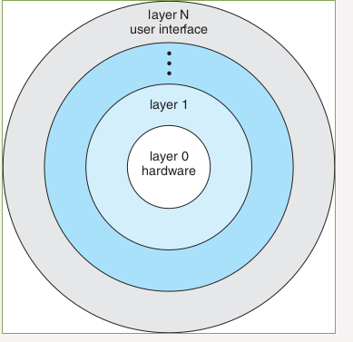

----

Effects on current situations

.. :

    The connection between microkernel philosophy and modern deployment tools (Kubernetes, Virtual Machines, Snap, Flatpak, Electron) is one of the most exciting shifts in computer science.

    While the consumer desktop market is still dominated by *Monolithic* kernels (Linux, Windows, macOS), the **entire cloud and application delivery ecosystem has fundamentally copied the Microkernel philosophy** at the software layer.

    We call this **"Microkernelization through Virtualization and Sandboxing."**

    Here is how a microkernel's DNA directly shapes these modern technologies, broken down for your course curriculum:

    ---

    ### 1. Virtual Machines (Micro-VMs) & Unikernels

    Traditional VMs (like VMware or VirtualBox) run a massive, heavy monolithic guest OS on top of a host OS. The modern cloud has moved toward **Micro-VMs** (like AWS Firecracker) and **Unikernels**.

    * **The Microkernel Link:** A Unikernel strips away everything from the guest operating system except the exact device drivers and kernel logic needed to run *one specific application*.
    * **The Result:** Instead of booting a 500MB monolithic Linux kernel to run a simple Python script inside a VM, a Unikernel acts like a microkernel—providing only memory allocation and a thin scheduling layer, bootable in milliseconds with a footprint of just a few megabytes.

    ### 2. Kubernetes & Microservices

    In a monolithic OS, if the file system crashes, the whole system panics. In a microkernel, the "File Server" is just an isolated process; if it dies, the kernel restarts it.

    * **The Microkernel Link:** **Kubernetes does exactly this, but at the cluster level.** * Instead of deploying a single, massive "Monolithic Application," developers build **Microservices** (isolated containers).
    * **Pod Isolation:** Each pod runs in its own isolated user-space namespace. If the "Payment Microservice" container crashes due to a memory leak, Kubernetes detects it and restarts it immediately. The rest of the "cluster operating system" keeps running flawlessly, mirroring a microkernel's structural fault isolation.

    ### 3. Desktop Application Sandboxing (Snap, Flatpak/Flathub)

    On traditional Linux, desktop applications share a common, massive pool of monolithic libraries (`/usr/lib`). If a rogue app runs `sudo`, it can corrupt the entire system. Tools like Ubuntu's **Snap** and Flathub's **Flatpak** fundamentally rewrite this interaction.

    * **The Microkernel Link:** They force applications to live in strict, unprivileged user-space **sandboxes** (using kernel features like AppArmor and Seccomp filters).
    * **The "Server" Concept:** If a Flatpak app wants to access your webcam or open a file on your hard drive, it cannot make a direct monolithic system call. It must send a message to a **"Portal"** (a background user-space desktop daemon). The Portal asks the user for permission via a pop-up and hands the file back to the app. This is conceptually identical to a microkernel application sending an **IPC message** to a File Server rather than accessing the disk directly.

    ### 4. Electron Apps (VS Code, Discord, Slack)

    Electron apps bundle a full Chromium browser instance with a Node.js runtime to execute web code as a desktop application.

    * **The Microkernel Link:** Chromium’s architecture is modeled explicitly on microkernel process separation.
    * **Process Split:** Electron splits software into a highly privileged **Main Process** (the browser kernel) and heavily restricted **Renderer Processes** (the tabs/windows).
    * **Safety:** The Renderer process has absolutely zero hardware or file-system permissions. If it wants to save a file, it must pass an IPC message to the Main Process. If a malicious website exploits a rendering vulnerability in a Discord chat window, the sandbox traps it in user space, protecting the host operating system from exploitation.

    ---

    ### Conceptual Alignment Table for Your Students

    To tie this all together in a lecture, you can show them that whether we are talking about OS design or modern DevOps, the architectural battle remains exactly the same:

    | Microkernel Concept | Modern Software Equivalent | The Shared Engineering Goal |
    | --- | --- | --- |
    | **User-Space Server** | A Docker Container / Microservice | Isolation of responsibilities. |
    | **Inter-Process Communication (IPC)** | REST APIs / gRPC / Kubernetes Service Mesh | Safe communication between isolated components. |
    | **Fault Isolation** | Kubernetes Pod Restart / Electron Tab Crash | A failure in one module cannot crash the entire system. |
    | **The Performance Cost** | Network latency / Context-switching overhead | We willingly sacrifice raw speed to achieve security, stability, and scale. |

    By presenting it this way, students realize that learning about microkernels isn't just historical theory—it is a foundational blueprint for how modern cloud architecture, containerization, and sandboxed apps are built today.

----

Monolithic
==========

----

:class: t2c

Motherboard
==============
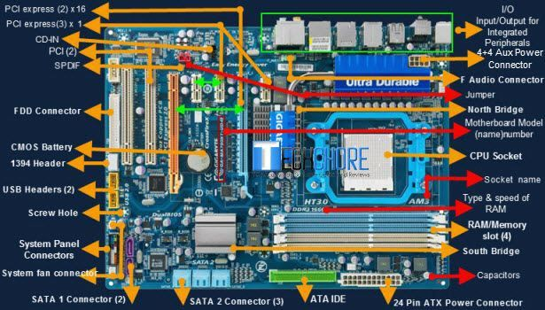

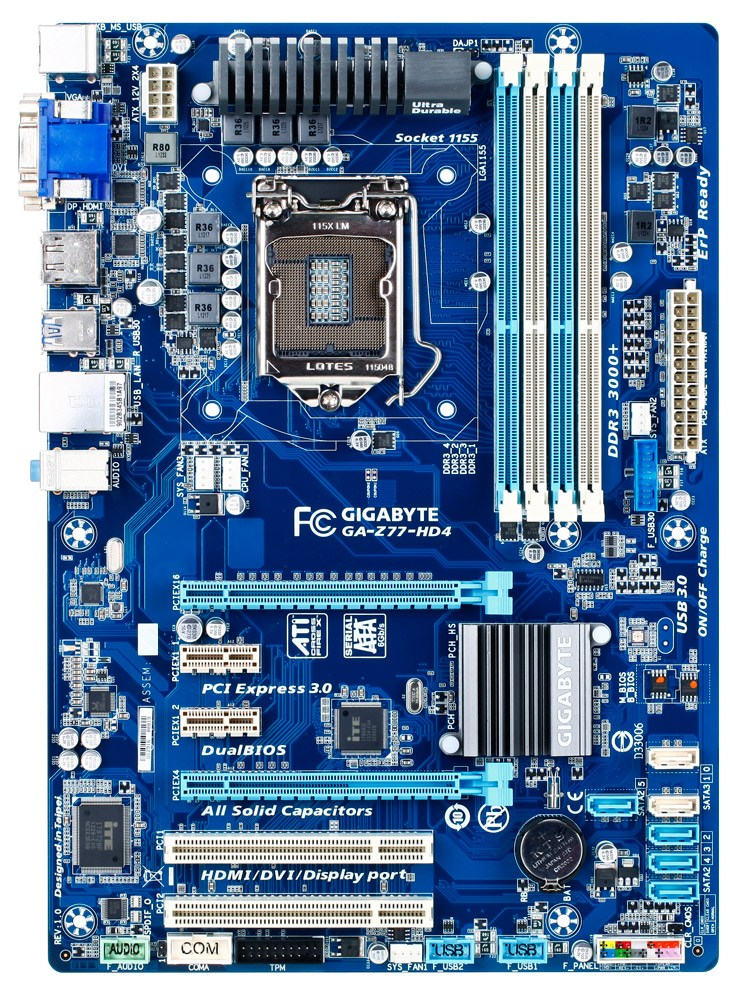

----

Direct Memory Access(DMA)
=========================
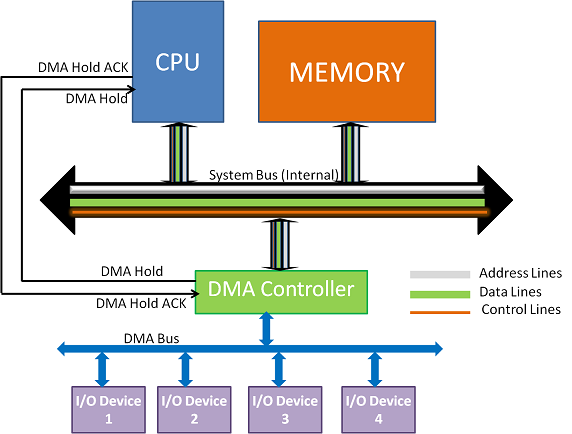

----

:class: t2c

BIOS
==========
.. image:: img/in/simple_poweron_computer.png
   :align: center

.. image:: img/in/Award_BIOS_setup_utility.png
   :align: center
   :class: substep

.. :

    .. image:: img/in/bios.gif
       :align: center

----

:class: t2c

Boot sequence
==================
.. image:: img/in/GRUB_with_ubuntu_and_windows_vista.png
    :align: center
    :width: 600px

.. image:: img/in/boot_sequence.png
    :align: center
    :class: substep

----

END

----

References(I)
==================================================
* `<https://stackoverflow.com/questions/18550370/calculate-the-effective-access-time>`_
* `<http://os-book.com/>`_
* https://en.wikipedia.org/wiki/Paging
* Sean K. Barker (https://tildesites.bowdoin.edu/~sbarker/)
    * https://tildesites.bowdoin.edu/~sbarker/teaching/courses/os/14spring/slides/lec12.pdf
    * https://tildesites.bowdoin.edu/~sbarker/teaching/courses/os/14spring/lectures.html
* `<https://en.wikipedia.org/wiki/Page_(computer_memory)>`_
* http://blog.cs.miami.edu/burt/2012/10/31/virtual-memory-pages-and-page-frames/
* `<https://www.tldp.org/LDP/tlk/mm/memory.html>`_
* https://www.cse.iitb.ac.in/~mythili/teaching/cs347_autumn2016/notes/07-memory.pdf

----

References(II)
==================================================
* https://www.kernel.org/doc/html/latest/admin-guide/mm/index.html
* https://www.geeksforgeeks.org/operating-system-paging/
* https://samypesse.gitbooks.io/how-to-create-an-operating-system/Chapter-8/
* https://www.javatpoint.com/os-segmented-paging
* https://www.geeksforgeeks.org/difference-between-internal-and-external-fragmentation/
* https://web.fe.up.pt/~arestivo/presentation/os-memory/#15
* https://binaryterms.com/contiguous-memory-allocation-in-operating-system.html
* https://github.com/mor1/ia-operating-systems/wiki/06-Virtual-Addressing

----

References(III)
==================================================
* https://github.com/mor1/ia-operating-systems
* https://www.faceprep.in/operating-systems/operating-systems-fragmentation-and-compaction/
* https://slideplayer.com/slide/7084682/
* https://www.cs.uic.edu/~jbell/CourseNotes/OperatingSystems/images/Chapter1/1_4_StorageDeviceHierarchy.jpg
* http://images.bit-tech.net/content_images/2007/11/the_secrets_of_pc_memory_part_1/hei.png
* https://en.wikipedia.org/wiki/Cache_(computing)
* https://www.byclb.com/TR/Tutorials/dsp_advanced/ch1_1_dosyalar/image025.jpg
* https://en.wikipedia.org/wiki/File:Cache,hierarchy-example.svg
* https://en.wikipedia.org/wiki/CPU_cache
* https://tutorialspoint.dev/image/Translation.png

----

References(IV)
==================================================
* https://www.cs.princeton.edu/courses/archive/spr11/cos217/lectures/18MemoryMgmt.pdf
* http://harmanani.github.io/classes/csc320/Notes/ch05.pdf
* https://www.cs.princeton.edu/courses/archive/spr11/cos217/lectures/18MemoryMgmt.pdf
* http://harmanani.github.io/classes/csc320/Notes/ch05.pdf
* https://www.gatevidyalay.com/translation-lookaside-buffer-tlb-paging/
* https://www.amazon.com/ASUS-DDR3-Intel-Motherboard-H61M/dp/B00BN36V4W
* https://www.asus.com/Motherboards-Components/Motherboards/Workstation/P10S-WS/
* https://commons.wikimedia.org/wiki/File:Intel_D945GCCR_Socket_775.png

----

References(V)
==================================================
* https://witscad.com/course/computer-architecture/chapter/dma-controller-and-io-processor
* https://www.uou.ac.in/lecturenotes/computer-science/BCA-17/Computer%20Organization%20Part%202.pdf
* https://www.pvpsiddhartha.ac.in/dep_it/lecturenotes/CSA/unit-5.pdf
* https://toshiba.semicon-storage.com/us/semiconductor/knowledge/e-learning/micro-intro/chapter4/interrupt-processing-types-interrupts.html
* https://stackoverflow.com/questions/4087280/approximate-cost-to-access-various-caches-and-main-memory#4087315
* https://codex.cs.yale.edu/avi/os-book/
