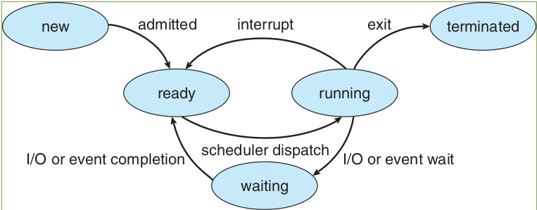
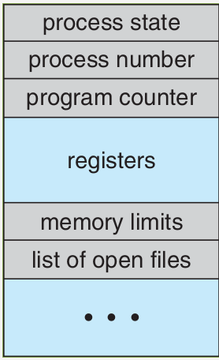

:data-transition-duration: 1000
:skip-help: true
:css: ./style.css
:substep: true
:data-width: 1024
:data-height: 768

.. title: Operating Systems - Memory  (By Ahmad Yoosofan)

:slide-numbers: true

.. role:: ltr
    :class: ltr

.. role:: rtl
    :class: rtl

Operating Systems
==============================
Memory Management
---------------------------
Ahmad Yoosofan

University of Kashan

.. :

  ----

  .. class:: rtl-h1

      تخصیص حافظهٔ پیوسته به فرآیندها

  .. class:: rtl-h2

      به فرآیندها حافظهٔ پیوسته‌ای داده شود.

----

:class: t2c

Fixed Partitioining or Static Partitioning
==========================================
.. image:: img/memory/memory_fixed_partitioning.png
   :align: center
   :height: 600px

.. class:: substep

* Equal-Size Partitions
* Unequal-Size Partitions
* Pros:
    * Minimal Hardware Complexity
    * Simple OS Logic
    * Low Overhead
* Cons:
    * Internal Fragmentation
    * Fixed Process Limit
    * Maximum Size Limit
* .. image:: img/memory/memory_fixed_partitioning_internal_fragmentation.png
    :align: center
    :width: 300px

.. :

    operating system internal memory fragmentation fixed size partitioning
    Multi Programming

    https://www.geeksforgeeks.org/difference-between-internal-and-external-fragmentation/

        مشکلات بخش‌بندی ثابت

    .. class:: rtl

        #. انعطاف بسیار پایین
        #. محدودیت زیاد برای اندازهٔ فرایند در حالی که فضای حافظه خالی است.
        #. تکه تکه شدن یا پراکندی داخلی internal fragmentation
        #. هدر رفت حافظه
            * بخشی از حافظه که به فرایند داده شده است فقط برای آن فرایند است.
            * یعنی اگر بخشی از آن را فرایند به کار نبرد هدر رفته است.

    ----

    .. class:: rtl-h1

        تخصیص حافظه به فرآیندها در حالت بخش‌بندی ثابت حافظه

    .. image:: img/memory/memory_fixed_allocation.png
       :align: center

    ----

    .. class:: rtl-h1

        بخش‌بندی پویای حافظه

    .. image:: img/memory/memory_management_pc.png
       :align: center
       :height: 470px

----

:class: t2c

Dynamic Partitioning
====================
.. image:: img/memory/memory_effect_of_dynamic_partitioning.png
   :align: center

.. class:: substep

* Hole Tracking or free space tracking
    * Bitmaps
    * Linked Lists
* External fragmentation
*  .. csv-table::
        :class: substep

        Feature,Fixed,Dynamic
        Partition Size,Static ,Dynamic
        Fragmentation,Internal,External
        Efficiency,Low ,High
* Coalescing (The "Neighborly" Cleanup)
    * Merge free space
* compaction

.. csv-table:
    :class: substep

    Feature,Fixed Partitioning,Dynamic Partitioning
    Partition Size,Static (set at boot),Dynamic (set at load-time)
    Fragmentation,Internal (Space wasted inside),External (Space wasted between)
    Compaction,Not needed,Essential
    Efficiency,Low (Wasteful of RAM),High (Better RAM utilization)

.. :

    Thanks Gemini AI for the above table

----

:class: t2c

Placement algorithms
====================
.. image:: img/memory/memory_select_part_for_allocation.png
   :align: center

.. class:: substep

* First Fit
    * pros: fast
    * cons: clog
* Best Fit
    * pros:
    * cons: Slow, Small holes
* Worst Fit
    * pros: large leftover
    * cons: slow, use largest
* Next Fit
    * pros: Prevents clogging
    * cons:
* Quick Fit or Segregated Fit (different lists)
    * pros: instant allocation
    * cons: overhead of OS

.. :

    Algorithm,Search Effort,Leftover Fragment,Primary Weakness
    First Fit,Low (Partial Scan),Variable,Fragments the start of RAM
    Next Fit,Low (Partial Scan),Variable,Fragments the end of RAM
    Best Fit,High (Full Scan),Smallest,"Creates tiny, useless ""slivers"""
    Worst Fit,High (Full Scan),Largest,Eliminates large contiguous blocks

    5. Quick Fit (or Segregated Fit)

    Commonly used in real-world modern kernels and memory allocators (like malloc).

        The Strategy: The OS maintains separate linked lists for common requested sizes (e.g., a list for 4KB holes, a list for 16KB holes, etc.).

        Pros: Near-instant allocation for standard sizes.

        Cons: High overhead for the OS to maintain and "bin" these holes.----

----

:class: t2c

Compaction or Defragmentation
=============================
.. yographviz::

    digraph Compaction {
        rankdir=LR;
        node [shape=none, fontname="Courier New"];

        // Before Compaction
        Before [label=<
            <table border="0" cellborder="1" cellspacing="0" cellpadding="10">
                <tr><td bgcolor="#D1D1D1">Process A (10KB)</td></tr>
                <tr><td bgcolor="#FFFFFF"><b>Hole 1 (5KB)</b></td></tr>
                <tr><td bgcolor="#D1D1D1">Process B (15KB)</td></tr>
                <tr><td bgcolor="#FFFFFF"><b>Hole 2 (10KB)</b></td></tr>
                <tr><td bgcolor="#D1D1D1">Process C (10KB)</td></tr>
                <tr><td bgcolor="#FFFFFF"><b>Hole 3 (20KB)</b></td></tr>
            </table>
        >];

        // After Compaction
        After [label=<
            <table border="0" cellborder="1" cellspacing="0" cellpadding="10">
                <tr><td bgcolor="#D1D1D1">Process A (10KB)</td></tr>
                <tr><td bgcolor="#D1D1D1">Process B (15KB)</td></tr>
                <tr><td bgcolor="#D1D1D1">Process C (10KB)</td></tr>
                <tr><td bgcolor="#FFFFFF" height="80"><b>Total Free Space (35KB)</b></td></tr>
            </table>
        >];

        // Arrow indicating the process
        Before -> After [label=" COMPACTION ", fontcolor="red", fontsize=12];

        label = "Memory Compaction: Merging External Fragments";
        labelloc = "t";
    }

.. class:: substep

* cost
    * CPU Cycles
    * Bus Saturation
    * System Freeze
* Strategies
    * Move to One End
    * Minimal Movement
* Trigger
    * Allocation Failure
    * Idle Time
    * Threshold
* Pros
    * Maximizes RAM Utilization
    * Enables Large Processes
    * Simplifies Placement
* Cons
    * Extreme Overhead
    * Requires Special Hardware
    * Interrupts Execution

.. :

    .. image:: img/memory/compaction.svg
       :align: center

    Pros,Cons
    Maximizes RAM Utilization: Prevents jobs from waiting when there is theoretically enough space.,Extreme Overhead: Copying megabytes or gigabytes of RAM is slow.
    Enables Large Processes: Allows the system to accommodate programs that otherwise couldn't fit.,Requires Special HW: Needs an MMU/Base-Limit registers to work.
    "Simplifies Placement: After compaction, ""First Fit"" becomes trivial because there is only one hole.","Interrupts Execution: Can cause ""stuttering"" in real-time or interactive systems."

    https://web.fe.up.pt/~arestivo/presentation/os-memory/#15

    Memory-Compaction-in-contiguous-memory-allocation-1.jpg
    https://binaryterms.com/contiguous-memory-allocation-in-operating-system.html

    compaction.png
    https://github.com/mor1/ia-operating-systems/wiki/06-Virtual-Addressing
    https://github.com/mor1/ia-operating-systems

    https://www.faceprep.in/operating-systems/operating-systems-fragmentation-and-compaction/

    https://slideplayer.com/slide/7084682/

----

Buddy System Memory Management(I)
=================================
.. image:: img/memory/memory_buddy_system2.png
   :align: center

----

:class: t4c

Buddy System Memory Management(II)
==================================
.. yographviz::
    :width: 220

    digraph Buddy1 {
        label="A 100";
        labelloc = "t";
        rankdir=TB;
        node [shape=rectangle];
        0 [label="1 M"];
        1 [label="512 K"];
        2 [label="512 K"];

        0 -> 1;
        0 -> 2;

        3 [label="256 K"];
        4 [label="256 K"];

        1 -> 3;
        1 -> 4;

        5 [label="A(100)"];
        6 [label="128 K"];

        3 -> 5;
        3 -> 6;

    }

.. yographviz::
    :width: 200

    digraph Buddy2 {
        label="B 240";
        labelloc = "t";

        rankdir=TB;
        node [shape=rectangle];
        0 [label="1 M"];
        1 [label="512"];
        2 [label="512"];

        0 -> 1;
        0 -> 2;

        3 [label="256"];
        4 [label="B"];

        1 -> 3;
        1 -> 4;

        5 [label="A"];
        6 [label="128"];

        3 -> 5;
        3 -> 6;

    }

.. yographviz::
    :width: 200

    digraph Buddy3 {
        label="C 64";
        labelloc = "t";

        rankdir=TB;
        node [shape=rectangle];
        0 [label="1 M"];
        1 [label="512"];
        2 [label="512"];

        0 -> 1;
        0 -> 2;

        3 [label="256"];
        4 [label="B"];

        1 -> 3;
        1 -> 4;

        5 [label="A"];
        6 [label="128"];

        3 -> 5;
        3 -> 6;

        7 [label="C(64)"];
        8 [label="64"];

        6 -> 7;
        6 -> 8;

    }

.. yographviz::
    :width: 300

    digraph Buddy4 {
        label="D 256";
        labelloc = "t";

        rankdir=TB;
        node [shape=rectangle];
        0 [label="1 M"];
        1 [label="512"];
        2 [label="512"];

        0 -> 1;
        0 -> 2;

        3 [label="256"];
        4 [label="B"];

        1 -> 3;
        1 -> 4;

        5 [label="A"];
        6 [label="128"];

        3 -> 5;
        3 -> 6;

        7 [label="C(64)"];
        8 [label="64"];

        6 -> 7;
        6 -> 8;

        21 [label="D"];
        22 [label="256"];

        2 -> 21;
        2 -> 22;

    }

.. yographviz::
    :width: 300

    digraph Buddy5 {
        label="Release A and B";
        labelloc = "t";

        rankdir=TB;
        node [shape=rectangle];
        0 [label="1 M"];
        1 [label="512"];
        2 [label="512"];

        0 -> 1;
        0 -> 2;

        3 [label="256"];
        4 [label="256"];

        1 -> 3;
        1 -> 4;

        5 [label="128"];
        6 [label="128"];

        3 -> 5;
        3 -> 6;

        7 [label="C(64)"];
        8 [label="64"];

        6 -> 7;
        6 -> 8;

        21 [label="D"];
        22 [label="256"];

        2 -> 21;
        2 -> 22;

    }

.. yographviz::
    :width: 300

    digraph Buddy6 {
        label="E 74";
        labelloc = "t";

        rankdir=TB;
        node [shape=rectangle];
        0 [label="1 M"];
        1 [label="512"];
        2 [label="512"];

        0 -> 1;
        0 -> 2;

        3 [label="256"];
        4 [label="256"];

        1 -> 3;
        1 -> 4;

        5 [label="E"];
        6 [label="128"];

        3 -> 5;
        3 -> 6;

        7 [label="C(64)"];
        8 [label="64"];

        6 -> 7;
        6 -> 8;

        21 [label="D"];
        22 [label="256"];

        2 -> 21;
        2 -> 22;

    }

.. yographviz::
    :width: 300

    digraph Buddy7 {
        label="Release C";
        labelloc = "t";

        rankdir=TB;
        node [shape=rectangle];
        0 [label="1 M"];
        1 [label="512"];
        2 [label="512"];

        0 -> 1;
        0 -> 2;

        3 [label="256"];
        4 [label="256"];

        1 -> 3;
        1 -> 4;

        5 [label="E"];
        6 [label="128"];

        3 -> 5;
        3 -> 6;

        21 [label="D"];
        22 [label="256"];

        2 -> 21;
        2 -> 22;

    }

.. yographviz::
    :width: 160

    digraph Buddy8 {
        label="Release E";
        labelloc = "t";

        rankdir=TB;
        node [shape=rectangle];
        0 [label="1 M"];
        1 [label="512"];
        2 [label="512"];

        0 -> 1;
        0 -> 2;

        21 [label="D"];
        22 [label="256"];

        2 -> 21;
        2 -> 22;
    }

----

Buddy System Memory Management(II)
==================================
.. class:: substep

#. **A hybrid memory allocator** balances fixed and dynamic partitioning
    * dividing memory into partitions of base-2 sizes (powers of 2).
#. **The Allocation Process (Splitting)**
    * Memory blocks are sized as :math:`2^k` (e.g., 4KB, 8KB, 16KB).
    * If a process requests a size that is not a power of 2, the OS rounds up to the next highest power.
    * If only a larger block (e.g., 64KB) is available, the OS recursively splits it in half until the target size is reached:
        * 64KB splits into two 32KB buddies.
        * One 32KB splits into two 16KB buddies (one is allocated, one remains free).
#. **The Deallocation Process (Coalescing)**
    * When a block is freed, the OS checks the status of its specific "buddy".
    * If the buddy is also free, they immediately merge back into their parent size.
    * This process cascades upward automatically to form the largest possible free blocks.
#. **The Mathematical Advantage (Speed)**
    * The system is incredibly fast because finding a buddy requires no list searching.
    * The buddy of a block of size :math:`S` at address :math:`A` is located at exactly :math:`A \oplus S` (Bitwise XOR).
    * The OS calculates this directly in hardware.
#. **Pros:**
    * Extremely fast allocation
    * Coalescing
    * highly predictable performance.
#. **Cons:**
    * **Internal Fragmentation**
    * **External Fragmentation**
#. Usage
    #. The Linux Kernel
    #. Early UNIX Systems
    #. Modern Memory Allocators (`jemalloc`)
        * Used by FreeBSD and Facebook

.. note::
    Thanks to Gemini AI for helping to create this slide

    * Lecture tip: Draw a tree on the board starting with a 1024KB block and split it down the left side to show how the "buddies" wait for their partner to return.
    * Real-world connection: Mention that the Linux kernel still relies on a variation of the Buddy System for managing its physical memory pages today because the bitwise XOR speed is unbeatable.
    * The main takeaway for students is the engineering trade-off: We are purposely wasting memory (Internal Fragmentation) to gain CPU speed (O(1) coalescing).

    A hybrid memory allocator that balances fixed and dynamic partitioning by dividing memory into partitions of base-2 sizes (powers of 2).

    Yes, absolutely! The Buddy System is not just a theoretical academic concept; it is one of the most famous and widely implemented memory management algorithms in computing history.

    Here is where it has been used in the real world:

    **1. The Linux Kernel**
    This is the most prominent and important modern example. The Linux operating system relies on a binary buddy allocator as its primary **physical memory manager** (specifically, the "page allocator").

    * When the kernel needs a block of contiguous memory pages to give to a process or use for itself, it queries the buddy system.
    * To solve the problem of internal fragmentation for very small memory requests, Linux layers a second system called a **Slab Allocator** on top of the buddy system. The buddy system handles the big chunks, and the slab allocator carves those chunks into exact sizes for the kernel to use.

    **2. Early UNIX Systems**
    Various forms of the buddy system were used in early UNIX distributions and other historical operating systems to manage dynamic memory efficiently before modern paging hardware became universally standard.

    **3. Modern Memory Allocators (`jemalloc`)**
    While user-space programming functions (like calling `malloc()` in a C program) don't typically use a pure buddy system today, modern high-performance allocators like `jemalloc` (used by FreeBSD and Facebook) use concepts directly derived from it. They group memory into distinct "size classes" and split large blocks into smaller runs, mimicking the buddy system's efficiency.

    **Why it survived in the real world:**
    It survived the jump from textbooks to production kernels precisely because of the bitwise XOR math trick. When an operating system kernel is managing raw hardware memory, it has to be lightning fast. The ability to find, split, and merge free memory in $O(1)$ time—meaning it takes the exact same amount of time regardless of how much memory is installed—makes the wasted space (internal fragmentation) a completely acceptable trade-off.

    #. **Summary of Trade-offs**
        * **Pros:**
            * Extremely fast allocation
            * Coalescing
            * highly predictable performance.
        * **Cons:**
            * **Internal Fragmentation**
            * **External Fragmentation**

.. :

    * **Concept**
        * Memory split in powers of 2.
        * Requested size rounded up.
        * Recursive splitting of blocks.
    * **The Buddy Logic**
        * Block :math:`2^k` split into two buddies.
        * Freeing: Check if buddy is free.
        * Coalesce buddies into parent.
    * **Pros**
        * Fast allocation/deallocation.
        * Efficient coalescing.
    * **Cons**
        * Internal fragmentation.
        * Limited by power-of-2 sizing.

.. note::
    - The Buddy System bridges the gap between fixed and dynamic partitioning.
    - An address X of size 2^k has a unique buddy at X XOR 2^k.
    - XOR-based buddy addressing allows O(1) identification of the neighbor.
    - Trade-off: We sacrifice up to 50% of block space (Internal Fragmentation)
      to gain high-speed allocation/coalescing.

    * **Core Idea**:
     * Memory is allocated in sizes of **powers of 2** (e.g., 2, 4, 8, 16... KB).
     * If a request doesn't match a power of 2, the next larger size is used.
    * **The "Buddy" Logic**:
     * If a block of size :math:`2^k` is needed and only a :math:`2^{k+1}` block is available, the OS **splits** it into two equal "buddies".
     * When a block is freed, the OS checks if its buddy is also free.
     * If both are free, they **coalesce** back into the larger parent block.
    * **Pros & Cons**:
     * **Pros**: Very fast coalescing (merging) compared to standard dynamic partitioning.
     * **Cons**: Suffers from **Internal Fragmentation** (up to 50% per block).

.. note:
  The buddy system is an elegant way to avoid the heavy overhead of
  full memory compaction while still maintaining flexibility.

    A compromise between fixed and dynamic partitioning.

.. :

    5. The Buddy System (The Hybrid Approach)This is a sophisticated middle ground that many students find fascinating.Instead of arbitrary sizes, memory is split into powers of 2 ($2^n$).If a process needs 10KB, you split a 32KB block into two 16KB "buddies."It reduces external fragmentation and makes coalescing extremely fast because you only ever merge a block with its specific "buddy."

    .. image:: img/memory/memory_buddy_system1.png
       :align: center
       :height: 500px

.. :

    ----

    .. class:: rtl-h1

        الگوریتم اجرا

    .. image:: img/memory/memory_buddy_system3.png
       :align: center

----

----

Process Control Block (PCB)
=================================

----

.. image:: img/in/simple_multiple_process.png
   :align: center
   :height: 500px

----

.. class:: rtl-h1

    چگونگی کارکرد پیوند زدن تابع‌ها از پرونده‌های گوناگون

.. image:: img/memory/memory_linking_function.png
   :align: center

----

.. image:: img/in/system_call02.png
   :align: center

----

Queue
=========
.. image:: img/in/queues01.png
   :align: center

----

Process Suspension
==================
.. image:: img/memory/swapping_processes.png
   :align: center

----

.. image:: img/memory/suspend_state.png
   :align: center
   :width: 500px
   :height: 500px

----

overlay
=============
.. image:: img/memory/memory_ovelay_turbo_c.jpg
   :align: center
   :width: 500px
   :height: 600px

----

.. class:: rtl-h1

    سلسله مراتب حافظه

.. image:: img/memory/memory_hierarchy_1_4_StorageDeviceHierarchy.jpg
   :align: center

.. :

    `cs.uic.edu <https://www.cs.uic.edu/~jbell/CourseNotes/OperatingSystems/images/Chapter1/1_4_StorageDeviceHierarchy.jpg>`_

----

.. class:: rtl-h1

    سلسله مراتب حافظه جزئی‌تر

.. image:: img/memory/memory_hierarchy_hei.png
   :align: center

.. :

  https://www.cs.uic.edu/~jbell/CourseNotes/OperatingSystems/images/Chapter1/1_4_StorageDeviceHierarchy.jpg
  http://images.bit-tech.net/content_images/2007/11/the_secrets_of_pc_memory_part_1/hei.png

----

.. class:: rtl-h1

    حافظهٔ نهان

.. image:: img/memory/memory_cache_Cache_hierarchy-example.svg
   :align: center

.. :

    `wikipedia.org Cache,hierarchy <https://en.wikipedia.org/wiki/File:Cache,hierarchy-example.svg>`_
    `wikipedia.org CPU_cache <https://en.wikipedia.org/wiki/CPU_cache>`_

----

.. class:: rtl-h1

    حافظهٔ نهان دو سطحی در یک پردازندهٔ واقعی

.. image:: img/memory/memory_cache_image025.jpg
   :align: center

.. :

    `link <https://www.byclb.com/TR/Tutorials/dsp_advanced/ch1_1_dosyalar/image025.jpg>`_

----

.. class:: rtl-h1

    الگوریتم خواندن و نوشتن از حافظهٔ نهان

.. image:: img/memory/memory_cache_read_write_algorithm_Write-back_with_write-allocation.svg
   :align: center
   :width: 500px
   :height: 650px

----

Effective Access Time (EAT)
================================
.. class:: substep

    * :math:`t_m` : :rtl:`زمان دسترسی به حافظه‌ی اصلی`
    * :math:`t_c` : :rtl:`زمان دسترسی به حافظه‌ی نهان`
    * :math:`h_c` : :rtl:`ضریب اصابت به حافظه‌ی نهان`

    .. math::

      EAT = h_c * t_c + ( 1 - h_c ) * ( t_m + t_c )

----

.. class:: rtl-h1

    اگر ضریب اصابت (یا نسبت اصابت) برای پردازنده‌ای 0.95 باشد و سرعت دسترسی به حافظهٔ اصلی 100 میکرو ثانیه باشد و سرعت دسترسی حافظهٔ نهان 1 میکرو ثانیه باشد در این صورت زمان دسترسی مؤثر برابر خواهد بود با

.. class:: substep

    * EAT = 0.95 * 1 + (1 − 0.95) * (100 + 1)
    * EAT = 0.95 + 0.05 * 101
    * EAT = 0.95 + 5.05
    * EAT = 6 μs

----

.. image:: img/memory/memory_effect_of_cache.png
   :align: center

----

.. raw:: html

    <table border="1px" class="center"><tr >
    <td>ms</td><td>μs</td><td>ns</td><td>action</td><tr >
    <td></td><td></td><td>0.5</td><td>CPU L1 dCACHE reference</td></tr><tr >
    <td></td><td></td><td>1</td><td>speed-of-light (a photon) travel a 1 ft (30.5cm) distance</td></tr><tr >
    <td></td><td></td><td>5</td><td>CPU L1 iCACHE Branch mispredict</td></tr><tr >
    <td></td><td></td><td>7</td><td>CPU L2  CACHE reference</td></tr><tr >
    <td></td><td></td><td>71</td><td>CPU cross-QPI/NUMA best  case on XEON E5-46</td><tr >
    <td></td><td></td><td>100</td><td>MUTEX lock/unlock</td><tr >
    <td></td><td></td><td>100</td><td>own DDR MEMORY reference</td><tr >
    <td></td><td>20</td><td>000</td><td>Send 2K bytes over 1 Gbps NETWORK</td><tr >
    <td></td><td>250</td><td>000</td><td>Read 1 MB sequentially from MEMORY</td><tr >
    <td>10</td><td>000</td><td>000</td><td>DISK seek</td><tr >
    <td>10</td><td>000</td><td>000</td><td>Read 1 MB sequentially from NETWORK</td><tr >
    <td>30</td><td>000</td><td>000</td><td>Read 1 MB sequentially from DISK</td><tr >
    <td>150</td><td>000</td><td>000</td><td>Send a NETWORK packet CA -> Netherlands</td><tr >
    </tr></table>
    <a href="https://stackoverflow.com/questions/4087280/approximate-cost-to-access-various-caches-and-main-memory#4087315">[link]</a>

----

.. image:: img/memory/base_limit_register.png
   :align: center

----

.. image:: img/in/process_parts.png
   :align: center

----

.. class:: rtl-h1

    بخش‌های درونی یک فرآیند در حالت کلی

.. image:: img/memory/memory_precess_addressing_parts.png
   :align: center

----

.. class:: rtl-h1

    مشخص شدن آدرس‌های حافظهٔ فرآیند

.. image:: img/memory/memory_program_address_binding.png
   :align: center

----

.. image:: img/memory/memory_linking_loading_scenario.png
   :align: center
   :scale: 90%

----

address binding, loader

.. image:: img/memory/memory_address_binding_loader.png
   :align: center
   :scale: 90%

----

address binding, linker

.. image:: img/memory/memory_address_binding_linker.png
   :align: center
   :scale: 90%

----

.. image:: img/in/system_overview01.png
   :align: center

----

Micro Kernel
===============
.. image:: img/in/micro_kernel01.png
   :align: center
   :width: 850px

----

Multi Layer
===============
.. image:: img/in/multilayer_os01.png
   :align: center

----

:class: t2c

Motherboard
==============
.. image:: img/in/Parts-of-Motherboard-and-their-functions-latest.jpg

.. image:: img/memory/GigabyteZ77-HD4-Top.jpg
    :align: center
    :height: 650px

----

Direct Memory Access(DMA)
=========================
.. image:: img/memory/system-configuration-with-dmac.png

----

:class: t2c

BIOS
==========
.. image:: img/in/simple_poweron_computer.png
   :align: center

.. image:: img/in/Award_BIOS_setup_utility.png
   :align: center
   :class: substep

.. :

    .. image:: img/in/bios.gif
       :align: center

----

:class: t2c

Boot sequence
==================
.. image:: img/in/GRUB_with_ubuntu_and_windows_vista.png
    :align: center
    :width: 600px

.. image:: img/in/boot_sequence.png
    :align: center
    :class: substep

----

END

----

References(I)
==================================================
* `<https://stackoverflow.com/questions/18550370/calculate-the-effective-access-time>`_
* `<http://os-book.com/>`_
* https://en.wikipedia.org/wiki/Paging
* Sean K. Barker (https://tildesites.bowdoin.edu/~sbarker/)
    * https://tildesites.bowdoin.edu/~sbarker/teaching/courses/os/14spring/slides/lec12.pdf
    * https://tildesites.bowdoin.edu/~sbarker/teaching/courses/os/14spring/lectures.html
* `<https://en.wikipedia.org/wiki/Page_(computer_memory)>`_
* http://blog.cs.miami.edu/burt/2012/10/31/virtual-memory-pages-and-page-frames/
* `<https://www.tldp.org/LDP/tlk/mm/memory.html>`_
* https://www.cse.iitb.ac.in/~mythili/teaching/cs347_autumn2016/notes/07-memory.pdf

----

References(II)
==================================================
* https://www.kernel.org/doc/html/latest/admin-guide/mm/index.html
* https://www.geeksforgeeks.org/operating-system-paging/
* https://samypesse.gitbooks.io/how-to-create-an-operating-system/Chapter-8/
* https://www.javatpoint.com/os-segmented-paging
* https://www.geeksforgeeks.org/difference-between-internal-and-external-fragmentation/
* https://web.fe.up.pt/~arestivo/presentation/os-memory/#15
* https://binaryterms.com/contiguous-memory-allocation-in-operating-system.html
* https://github.com/mor1/ia-operating-systems/wiki/06-Virtual-Addressing

----

References(III)
==================================================
* https://github.com/mor1/ia-operating-systems
* https://www.faceprep.in/operating-systems/operating-systems-fragmentation-and-compaction/
* https://slideplayer.com/slide/7084682/
* https://www.cs.uic.edu/~jbell/CourseNotes/OperatingSystems/images/Chapter1/1_4_StorageDeviceHierarchy.jpg
* http://images.bit-tech.net/content_images/2007/11/the_secrets_of_pc_memory_part_1/hei.png
* https://en.wikipedia.org/wiki/Cache_(computing)
* https://www.byclb.com/TR/Tutorials/dsp_advanced/ch1_1_dosyalar/image025.jpg
* https://en.wikipedia.org/wiki/File:Cache,hierarchy-example.svg
* https://en.wikipedia.org/wiki/CPU_cache
* https://tutorialspoint.dev/image/Translation.png

----

References(IV)
==================================================
* https://www.cs.princeton.edu/courses/archive/spr11/cos217/lectures/18MemoryMgmt.pdf
* http://harmanani.github.io/classes/csc320/Notes/ch05.pdf
* https://www.cs.princeton.edu/courses/archive/spr11/cos217/lectures/18MemoryMgmt.pdf
* http://harmanani.github.io/classes/csc320/Notes/ch05.pdf
* https://www.gatevidyalay.com/translation-lookaside-buffer-tlb-paging/
* https://www.amazon.com/ASUS-DDR3-Intel-Motherboard-H61M/dp/B00BN36V4W
* https://www.asus.com/Motherboards-Components/Motherboards/Workstation/P10S-WS/
* https://commons.wikimedia.org/wiki/File:Intel_D945GCCR_Socket_775.png

----

References(V)
==================================================
* https://witscad.com/course/computer-architecture/chapter/dma-controller-and-io-processor
* https://www.uou.ac.in/lecturenotes/computer-science/BCA-17/Computer%20Organization%20Part%202.pdf
* https://www.pvpsiddhartha.ac.in/dep_it/lecturenotes/CSA/unit-5.pdf
* https://toshiba.semicon-storage.com/us/semiconductor/knowledge/e-learning/micro-intro/chapter4/interrupt-processing-types-interrupts.html
* https://stackoverflow.com/questions/4087280/approximate-cost-to-access-various-caches-and-main-memory#4087315
* https://codex.cs.yale.edu/avi/os-book/
