.. meta::
   :http-equiv=Content-Language: fa

:data-transition-duration: 1000
:skip-help: true
:css: style.css
:substep: true

.. title: Operating Systems - Memory Management (By Ahmad Yoosofan)

:slide-numbers: true

.. role:: ltr
    :class: ltr

----

Memory Management
===================================================
مدیریت حافظه

----

Memory of a process
=====================
حافظهٔ یک فرآیند

----

بخش‌های درونی یک فرآیند در حالت کلی
===================================================

.. image:: img/memory/memory_precess_addressing_parts.png
   :align: center

----

مشخص شدن آدرس‌های حافظهٔ یک فرایند از زمان نوشته شدن برنامه تا زمان اجرای فرآیند
======================================================================================================

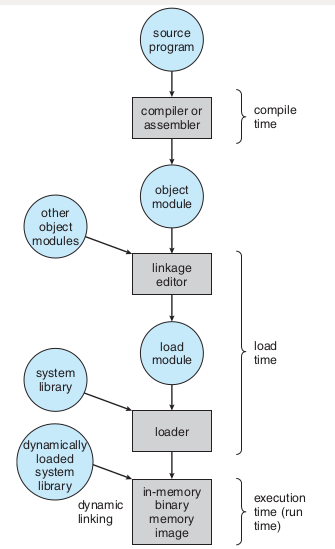

----

.. image:: img/memory/memory_linking_loading_scenario.png
   :align: center
   :scale: 90%

address binding, loader
-----------------------------------------------------------------------------------------------------

.. image:: img/memory/memory_address_binding_loader.png
   :align: center
   :scale: 90%

address binding, linker
-----------------------------------------------------------------------------------------------------

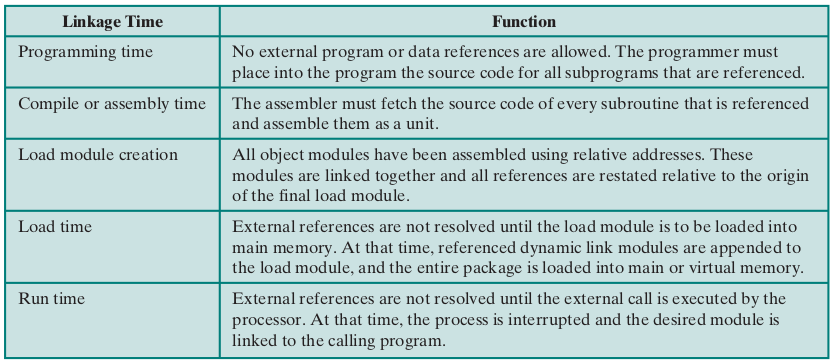

address binding, absolute and relocate loader
-----------------------------------------------------------------------------------------------------

.. image:: img/memory/memory_absolute_relocate_loader.png
   :align: center
   :scale: 90%

چگونگی کارکرد پیوند زدن تابع‌ها از پرونده‌های گوناگون
-----------------------------------------------------------------------------------------------------

.. image:: img/memory/memory_linking_function.png
   :align: center

تخصیص حافظهٔ پیوسته به فرآیندها
===================================================

بخش‌بندی ثابت حافظه
-------------------------------------------------------------------------------------------------------------

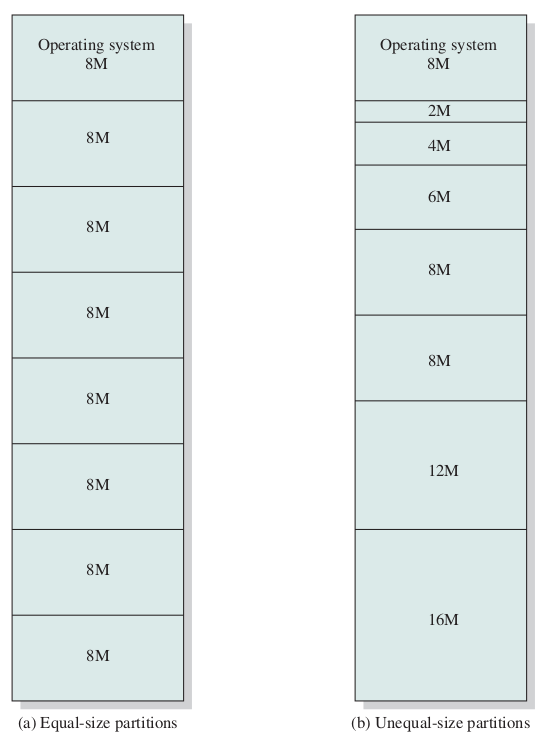

تخصیص حافظه به فرآیندها در حالت بخش‌بندی ثابت حافظه
^^^^^^^^^^^^^^^^^^^^^^^^^^^^^^^^^^^^^^^^^^^^^^^^^^^^^^^^^^^^^^^^^^^^^^^^^^^^^^^^^^^^^^^^^^^^^^^^^^^^^^^^^^^^

.. image:: img/memory/memory_fixed_allocation.png
   :align: center

تکه تکه شدن (پراکندگی) داخلی حافظه Internal Memory Fragmentation
^^^^^^^^^^^^^^^^^^^^^^^^^^^^^^^^^^^^^^^^^^^^^^^^^^^^^^^^^^^^^^^^^^^^^^^^^^^^^^^^^^^^^^^^^^^^^^^^^^^^^^^^^^^^

به کارگیری حافظهٔ نسبی برای نگهداری مکان چندین فرآیند در حافظه
^^^^^^^^^^^^^^^^^^^^^^^^^^^^^^^^^^^^^^^^^^^^^^^^^^^^^^^^^^^^^^^^^^^^^^^^^^^^^^^^^^^^^^^^^^^^^^^^^^^^^^^^^^^^

.. image:: img/memory/base_limit_register.png
   :align: center

حفاظت از حافظه به کمک ثبات‌های پایه و حد
^^^^^^^^^^^^^^^^^^^^^^^^^^^^^^^^^^^^^^^^^^^^^^^^^^^^^^^^^^^^^^^^^^^^^^^^^^^^^^^^^^^^^^^^^^^^^^^^^^^^^^^^^^^^

.. image:: img/memory/hardware_address_protection.png
   :align: center

بخش‌بندی پویای حافظه
------------------------------------------------------------------------------------------

شمارندهٔ برنامه و فرآیندهای درون حافظه
^^^^^^^^^^^^^^^^^^^^^^^^^^^^^^^^^^^^^^^^^^^^^^^^^^^^^^^^^^^^^^^^^^^^^^^^^^^^^^^^^^^^^^^^^^^^^^^^^^^^^^^^^^^^

.. image:: img/memory/memory_management_pc.png
   :align: center

ارتباط میان آدرس فیزیکی و آدرس منطقی در آدرس دهی نسبی به کمکِ واحد مدیریت حافظه (MMU)
^^^^^^^^^^^^^^^^^^^^^^^^^^^^^^^^^^^^^^^^^^^^^^^^^^^^^^^^^^^^^^^^^^^^^^^^^^^^^^^^^^^^^^^^^^^^^^^^^^^^^^^^^^^^

.. image:: img/memory/relocation_register_mmu.png
   :align: center

حافظهٔ فرآیندها در سیستم عامل CTSS
^^^^^^^^^^^^^^^^^^^^^^^^^^^^^^^^^^^^^^^^^^^^^^^^^^^^^^^^^^^^^^^^^^^^^^^^^^^^^^^^^^^^^^^^^^^^^^^^^^^^^^^^^^^^

.. image:: img/memory/memory_of_CTSS.png
   :align: center

اثر به کارگیری حافظهٔ پویا
^^^^^^^^^^^^^^^^^^^^^^^^^^^^^^^^^^^^^^^^^^^^^^^^^^^^^^^^^^^^^^^^^^^^^^^^^^^^^^^^^^^^^^^^^^^^^^^^^^^^^^^^^^^^

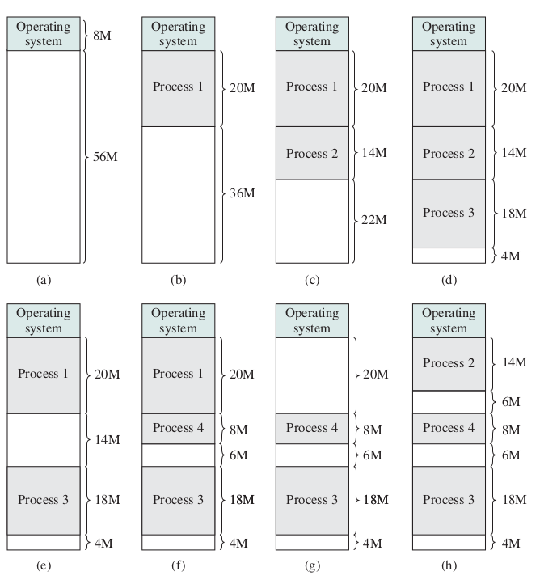

برگزیدن فضای آزاد برای فرآیند تازه وارد
^^^^^^^^^^^^^^^^^^^^^^^^^^^^^^^^^^^^^^^^^^^^^^^^^^^^^^^^^^^^^^^^^^^^^^^^^^^^^^^^^^^^^^^^^^^^^^^^^^^^^^^^^^^^

*  اولین برازش(First Fit)
*  بهترین برازش(Best Fit)
*  بدترین برازش(Worst Fit)
*  درپی برازش (برازش بعدی Next Fit)

.. image:: img/memory/memory_select_part_for_allocation.png
   :align: center

تکه تکه شدن (پراکندگی یا پارگی) خارجی External Fragmentation
^^^^^^^^^^^^^^^^^^^^^^^^^^^^^^^^^^^^^^^^^^^^^^^^^^^^^^^^^^^^^^^^^^^^^^^^^^^^^^^^^^^^^^^^^^

حافظهٔ پویای رفاقتی Buddy system
^^^^^^^^^^^^^^^^^^^^^^^^^^^^^^^^^^^^^^^^^^^^^^^^^^^^^^^^^^^^^^^^^^^^^^^^^^^^^^^^^^^^^^^^^^

.. image:: img/memory/memory_buddy_system1.png
   :align: center

.. image:: img/memory/memory_buddy_system2.png
   :align: center
   :scale: 90%

الگوریتم اجرا

.. image:: img/memory/memory_buddy_system3.png
   :align: center

جابجا کردن فرآیند میان حافظهٔ‌اصلی و حافظهٔ جانبی (دیسک)، شکل ساده‌ای از حافظهٔ مجازی
-------------------------------------------------------------------------------------------------------------

.. image:: img/memory/swapping_processes.png
   :align: center

روی هم انداختن بخش‌های یک فرآیند (overlay)
-------------------------------------------------------------------------------------------------------------

برنامه به صورت چند تکه نوشته می‌شود که تکه‌های مجزای آن نیازی نیست همزمان در حافظه باشند و بخشی مقیم در حافظه از فرآیند تکه‌های دیگر را میان حافظه و دیسک جابجا می‌کند.

حافظهٔ صفحه‌بندی شده
==========================================================================================

شکل سادهٔ صفحه‌بندی
------------------------------------------------------------------------------------------

.. image:: img/memory/paging_model.png
   :align: center

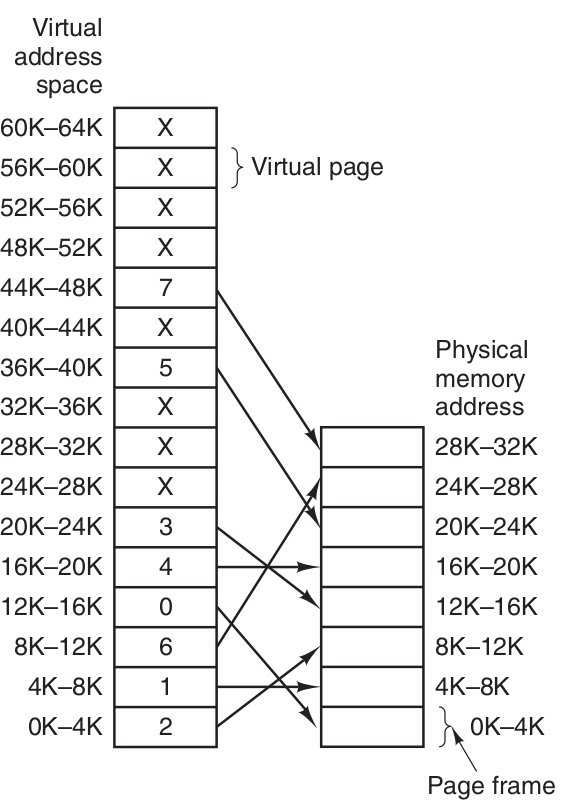

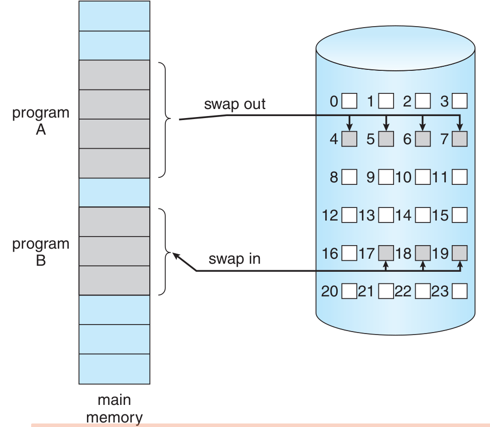

سخت‌افزار صفحه‌بندی
------------------------------------------------------------------------------------------

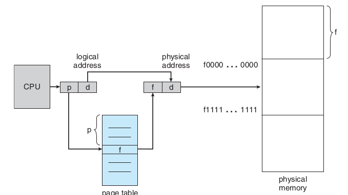

بخش‌بندی ثبات آدرس در حافظهٔ صفحه‌بندی شده
------------------------------------------------------------------------------------------

.. image:: img/memory/page_number_offset.png
   :align: center

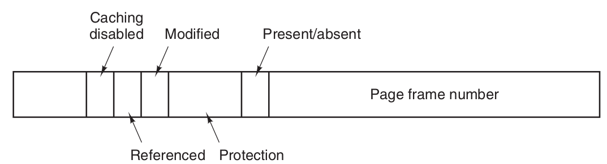

یک حافظهٔ ۳۲ بایتی با صفحه‌های ۴ بایتی
------------------------------------------------------------------------------------------

.. image:: img/memory/paging_example_32_bytes_memory.png
   :align: center

تغییرات فضاهای آزاد پیش و پس از تخصیص حافظه به یک فرآیند
------------------------------------------------------------------------------------------

.. image:: img/memory/paging_free_frames_before_after.png
   :align: center

تغییرات حافظه برای چند فرآیند
------------------------------------------------------------------------------------------

.. image:: img/memory/memory_paging_process.png
   :align: center

.. image:: img/memory/memory_paging_process_page_tables.png
   :align: center

تبدیل آدرس منطقی به آدرس فیزیکی در حافظهٔ صفحه‌بندی شده
------------------------------------------------------------------------------------------

.. image:: img/memory/memory_paging_logical_address_to_physical_address.png
   :align: center

.. image:: img/memory/memory_paging_logical_address_to_physical_address_detail.png
   :align: center

اندازهٔ صفحه
------------------------------------------------------------------------------------------

کوچک یا بزرگ بودن اندازهٔ صفحه‌ها (همان قاب‌های حافظه) بر روی موضوع‌های گوناگونی اثر دارد.

حفاظت از حافظهٔ صفحه‌بندی شده
------------------------------------------------------------------------------------------

.. image:: img/memory/paging_valid_invalid.png
   :align: center

اشتراک گذاری در حافظهٔ صفحه‌بندی شده
------------------------------------------------------------------------------------------

.. image:: img/memory/memory_paging_share_pages.png
   :align: center
   :scale: 70%

.. image:: img/memory/paging_sharing_code.png
   :align: center

تمرین: یک حافظهٔ ۱۶ کیلوبایتی با اندازهٔ قاب ۱ کیلوبایت داریم که تعدادی فرآیند می‌خواهیم در آن بگذاریم با اندازه‌های متفاوت. مشخص کنید تغییرات حافظه چگونه خواهد بود. چگونگی اجرای فرآیندها را توضیح دهید. دقت کنید مراحل پس از بار شدن فرآیند در حافظه (حالت جدید فرآیند) باید به صورت کاملا سخت‌افزاری و خودکار انجام شود. با فرض این که سیستم عامل یک کیلوبایت جا می‌گیرد و در قاب صفر گذاشته شده است.

همین تمرین به جای کیلوبایت مگابایت بگذارید.

تمرین: در حالت صفحه بندی شده چگونه فرآیند از حافظهٔ خود می‌تواند بیرون بزند یا به عبارت دیگر دسترسی غیر مجاز به دیگر قاب‌های حافظه داشته باشد؟

چه نوع پراکندگی و چگونه باقی می‌ماند.

بدی به کارگیری حافظهٔ صفحه‌بندی شده چیست؟

تبدیل آدرس منطقی به فیزیکی
------------------------------------------------------------------------------------------

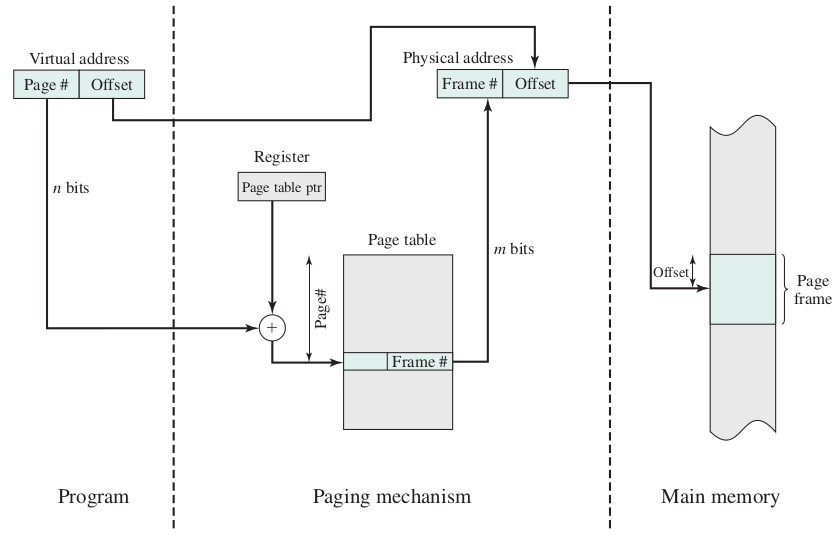

حافظهٔ نهان
============================================================================

سلسه مراتب حافظه
------------------------------------------------------------------------------------------

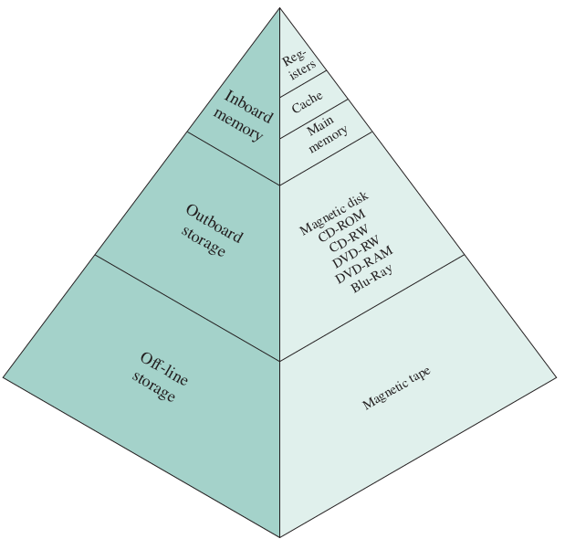

زمان دسترسی مؤثر Effective Access Time (EAT) بدون صفحه‌بندی
------------------------------------------------------------------------------------------

*  t\ :sub:`m` : زمان دسترسی به حافظه‌ی اصلی
*  t\ :sub:`c` : زمان دسترستی به حافظه‌ی نهان
*  h\ :sub:`c` : ضریب اصابت به حافظه‌ی نهان

زمان دسترسی مؤثر برابر خواهد بود با

.. math::
  :class: ltr

   EAT = h_c * t_c + (1-h_c) * (t_m + t_c)

   EAT = h_c * t_c + t_m + t_c - h_c * t_m - h_c * t_c

   EAT = t_c + (1 - h_c) * t_m

برای نمونه اگر ضریب اصابت (یا نسبت اصابت) برای 0.95 باشد و سرعت دسترسی به حافظهٔ اصلی 100 میکرو ثانیه باشد و سرعت دسترسی حافظهٔ نهان ۱ میکرو ثانیه باشد در این صورت زمان دسترسی مؤثر برابر خواهد بود با

.. math::
  :class: ltr

   EAT = 0.95 * 1 + (1 - 0.95)* (100 + 1)

   EAT = 0.95 + 0.05 * 101

   EAT = 0.95 + 5.05

   EAT = 5.1

زمان دسترسی مؤثر برابر ۵٫۱ میکرو ثانیه خواهد شد.

نمودار اثر به کارگیری حافظهٔ نهان در افزایش سرعت کار با حافظه
------------------------------------------------------------------------------------------

.. image:: img/memory/memory_effect_of_cache.png
   :align: center

زمان دسترسی مؤثر Effective Access Time (EAT) با صفحه‌بندی
------------------------------------------------------------------------------------------

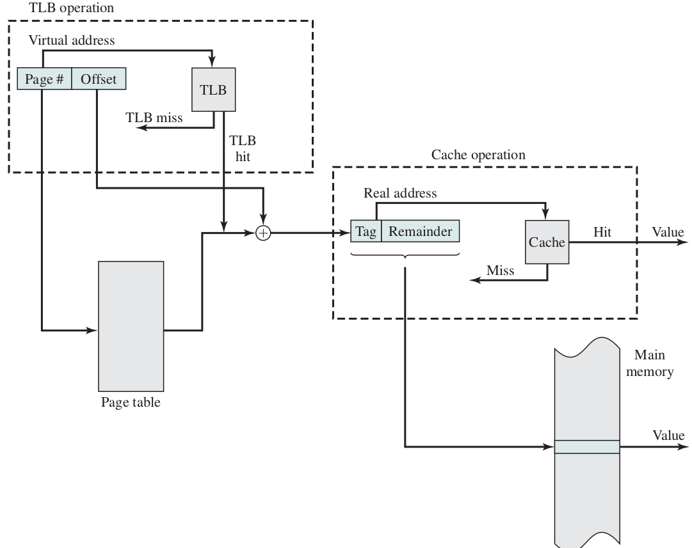

زمان دسترسی مؤثر = `زمان دسترسی به جدول صفحه + زمان دسترسی به حافظه`

.. math::
  :class: ltr

   EAT = 2 * ( h_c * t_c + (1-h_c) * (t_m + t_c) )

   EAT = 2 * ( h_c * t_c + t_m + t_c - h_c * t_m - h_c * t_c )

   EAT = 2 * ( t_c + (1 - h_c) * t_m )

پس با کاهش سرعت روبرو هستیم.

حافظهٔ اصلی با TLB
------------------------------------------------------------------------------------------

.. image:: img/memory/paging_hardware_with_TLB.png
   :align: center
   :scale: 70%

زمان دسترسی مؤثر Effective Access Time (EAT) با صفحه‌بندی همراه با TLB
------------------------------------------------------------------------------------------

*  t\ :sub:`t` : زمان دسترسی به حافظه‌ی نهان جدول صفحه 
*  t\ :sub:`c` : زمان دسترستی به حافظه‌ی نهان
*  t\ :sub:`m` : زمان دسترسی به حافظه‌ی اصلی
*  h\ :sub:`t` : ضریب اصابت به حافظه‌ی نهان جدول صفحه
*  h\ :sub:`c` : ضریب اصابت به حافظه‌ی نهان

.. math::
  :class: ltr
  
  EAT = table +  memory 

  table =  h_t * t_t + ( 1 - h_t ) * ( t_t + t_m )

  memory = h_c * t_c + ( 1 - h_c ) * ( t_m + t_c ) 
    
با فرض برابر بودن نسبت‌های اصابت و زمان‌های یکسان برای دسترسی به حافظهٔ نهان  و حافظهٔ TLB خواهیم داشت

.. math::
  :class: ltr
    
  EAT = 2* (h * t_c + ( 1 - h ) * ( t_c + t_m ))

صفحه‌بندی دو سطحی
==========================================================================================

صفحه‌بندی دو سطحی
------------------------------------------------------------------------------------------

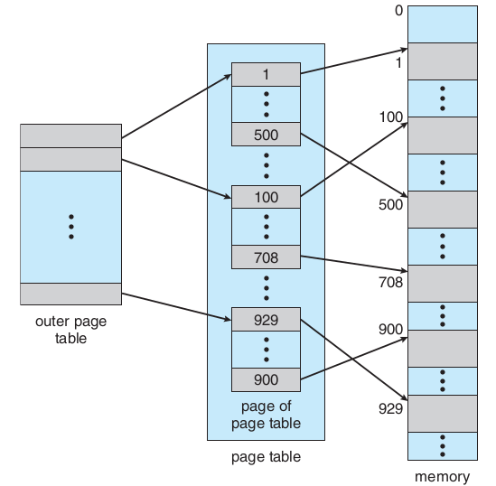

آدرس‌دهی در صفحه‌بندی دو سطحی
------------------------------------------------------------------------------------------

.. image:: img/memory/paging_address_translation_32bit.png
   :align: center

.. image:: img/memory/paging_two_level_32bit_address.png
   :align: center

.. image:: img/memory/memory_paging_Address_Translation_in_a_Two_Level_Paging_System.png
   :align: center
   :scale: 90%

.. image:: img/memory/memory_paging_Two_Level_Hierarchical_Page_Table.png
   :align: center

صفحه‌بندی دو سطحی ۶۴ بیتی
------------------------------------------------------------------------------------------

.. image:: img/memory/paging_two_level_64bit.png
   :align: center

صفحه‌بندی چند سطحی
==========================================================================================

صفحه‌بندی سه سطحی ۶۴ بیتی
------------------------------------------------------------------------------------------

.. image:: img/memory/paging_three_level_64bit_address.png
   :align: center

صفحه‌بندی با جدول صفحهٔ معکوس
==========================================================================================

.. image:: img/memory/memory_paging_Inverted_Page_Table_Structure.png
   :align: center

تمرین:
چرا صفحه‌بندی دو سطحی و بیشتر نیازمندیم؟

مفهوم حافظهٔ مجازی
====================================================================================================

.. image:: img/memory/memory_virtual_memory_general.png
   :align: center
   :scale: 70%

.. image:: img/memory/virtual_memory_concept.png
   :align: center

آدرس‌دهی حافظهٔ مجازی
------------------------------------------------------------------------------------------

.. image:: img/memory/virtual_memory_addressing.png
   :align: center

.. image:: img/memory/memory_virtual_with_TLB.png
   :align: center

Operation of Paging and Translation Lookaside Buffer

.. image:: img/memory/memory_virtual_Operation_of_Paging_and_Translation_Lookaside_Buffer.png
   :align: center

.. image:: img/memory/memory_virtual_valid_invalid.png
   :align: center
   :scale: 70%

مراحل برخورد با نبود صفحه (نقص صفحه Page fault)

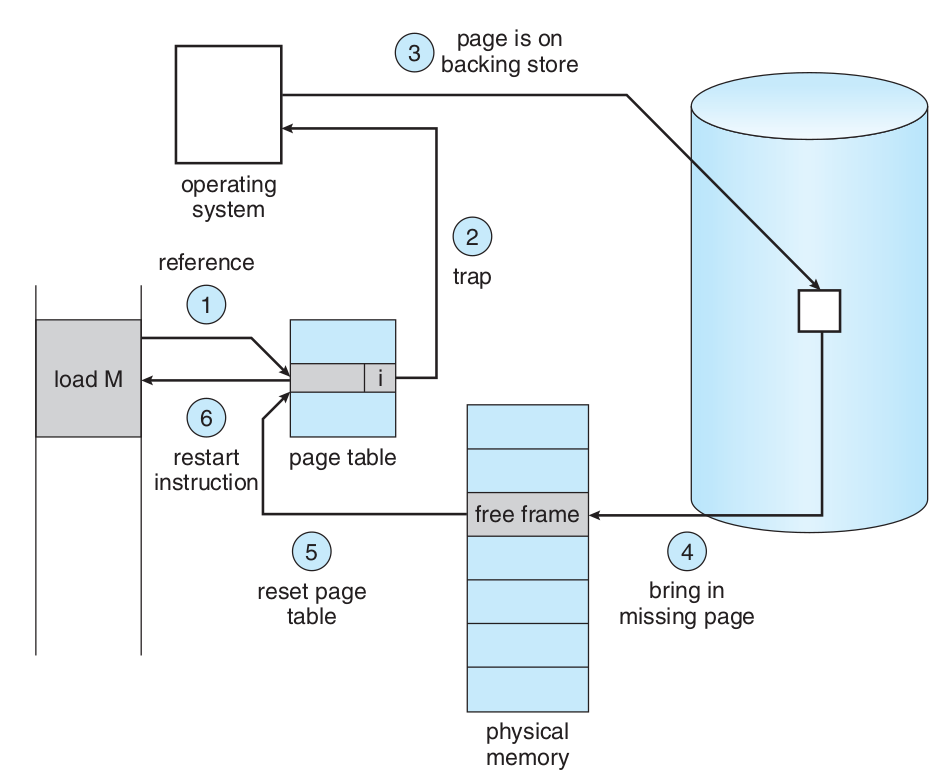

.. class:: ltr

    effective access time = (1 − p) × ma + p × page fault time.

    effective access time = (1 − p) × (200) + p (8 milliseconds) = (1 − p) × 200 + p × 8,000,000 = 200 + 7,999,800 × p

    220 > 200 + 7,999,800 × p,

    20 > 7,999,800 × p,

    p < 0.0000025

تخصیص قاب‌ها Allocation of frames
---------------------------------------------------------

*  درخواستی On demand
*  پیش صفحه‌بندی

روش‌های تخصیص تعداد قاب به هر فرآیند
---------------------------------------------------------

مجموعهٔ مقیم برای هر فرآیند.

*  تعداد ثابت fixed-allocation
*  تعداد متغیر  variable-allocation

بخش کردن قاب‌ها میان فرآیندها

*  تعداد برابر
*  تعداد به نسبت اندازهٔ فرآیند

چگونگی برگزیدن یک قاب برای تخصیص به یک فرآیند

*  تخصیص محلی
*  تخصیص سراسری

سیاست‌های پاک کردن
-------------------------------------------------------

*  پاک کردن درخواستی demand cleaning
*  پیش پاک کردن precleaning

کپی کردن هنگام نوشتن
-------------------------------------------------------

.. image:: img/memory/memory_virtual_copy_on_write_before.png
   :align: center
   :scale: 70%

.. image:: img/memory/memory_virtual_copy_on_write_after.png
   :align: center
   :scale: 70%

جایگزینی صفحه
---------------------------------------------------------

.. image:: img/memory/memory_virtual_need4replacement.png
   :align: center
   :scale: 80%

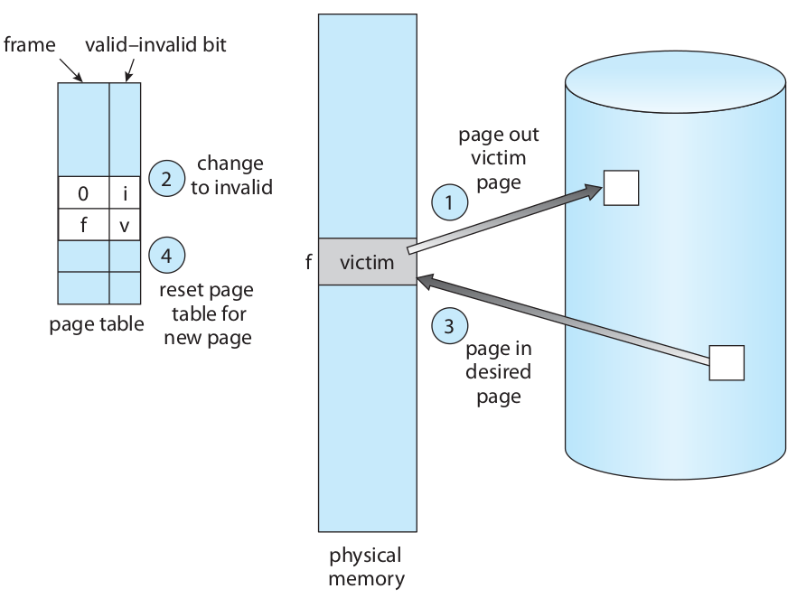

.. class:: ltr

    frame-allocation algorithm and a page-replacement algorithm.

    reference string.

    0100, 0432, 0101, 0612, 0102, 0103, 0104, 0101, 0611, 0102, 0103,
    0104, 0101, 0610, 0102, 0103, 0104, 0101, 0609, 0102, 0105

    At 100 bytes per page, this sequence is reduced to the following reference
    string:

    1, 4, 1, 6, 1, 6, 1, 6, 1, 6, 1

تعداد خطای صفحه بسته به تعداد قاب‌های تخصیص داده شده

.. image:: img/memory/memory_virtual_page_fault_per_frame_allocated.png
   :align: center
   :scale: 80%

الگوریتم جایگزینی FIFO
^^^^^^^^^^^^^^^^^^^^^^^^^^^^^^^^^^^^^^^^^^^^^^^^^^^^^

.. image:: img/memory/memory_virtual_page_replacement_FIFO.png
   :align: center
   :scale: 70%

.. class:: ltr

    Belady’s anomaly: for some page-replacement algorithms, the page-fault rate may increase as the number of allocated frames increases. We would expect that giving more memory to a process would improve its performance. In some early research, investigators noticed that this assumption was not always true. Belady’s anomaly was discovered as a result.

.. image:: img/memory/memory_virtual_page_replacement_FIFO_Blady_anomaly.png
   :align: center
   :scale: 90%

الگوریتم جایگزینی بهینه (Optimal)
^^^^^^^^^^^^^^^^^^^^^^^^^^^^^^^^^^^^^^^^^^^^^^^^^^^^^

.. image:: img/memory/memory_virtual_page_replacement_Optimal.png
   :align: center
   :scale: 70%

الگوریتم جایگزینی LRU
^^^^^^^^^^^^^^^^^^^^^^^^^^^^^^^^^^^^^^^^^^^^^^^^^^^^^

.. image:: img/memory/memory_virtual_page_replacement_LRU.png
   :align: center
   :scale: 70%

.. class:: ltr

    counters

    stacks

    Figure 9.16 Use of a stack to record the most recent page references.

.. image:: img/memory/memory_virtual_page_replacement_LRU_stack.png
   :align: center

الگوریتم جایگزینی کمترین فراوانی LFU
^^^^^^^^^^^^^^^^^^^^^^^^^^^^^^^^^^^^^^^^^^^^^^^^^^^^^^^^^^^^^^^^^^^^^^^^^^^

الگوریتم جایگزینی بیشترین فراوانی MFU
^^^^^^^^^^^^^^^^^^^^^^^^^^^^^^^^^^^^^^^^^^^^^^^^^^^^^^^^^^^^^^^^^^^^^^^^^^^

.. class:: ltr

    page-replacement algorithm is based on the argument that the page with the smallest count was probably just brought in and has yet to be used

Not Recently Used Page Replacement Algorithm
^^^^^^^^^^^^^^^^^^^^^^^^^^^^^^^^^^^^^^^^^^^^^^^^^^^^^^^^^^^^^^^^^^^^^^^^^^^^^^^

الگوریتم جایگزینی بخت دوم (second chance) یا ساعت (clock)
^^^^^^^^^^^^^^^^^^^^^^^^^^^^^^^^^^^^^^^^^^^^^^^^^^^^^^^^^^^^^^^^^^^^^^^^^^^

بیت دسترسی access bit یا بیت ارجاع reference bit یا بیت استفاده use bit

.. image:: img/memory/memory_virtual_page_replacement_second_chance.png
   :align: center
   :scale: 80%

الگوریتم جایگزینی ساعت بهبود یافته
^^^^^^^^^^^^^^^^^^^^^^^^^^^^^^^^^^^^^^^^^^^^^^^^^^^^^^^^^^^^^^^^^^^^^^^^^^^

بیت تغییر modify bit یا بیت کثیف dirty bit

(بیت دسترسی ، بیت تغییر)

۱. جستجو برای (۰،۰)

۲. جستجو برای (۱،۰) و تغییر بیت دسترسی به صفر

۳. برو به گام ۱

الگوریتم میانگیر صفحه PAGE BUFFERING
^^^^^^^^^^^^^^^^^^^^^^^^^^^^^^^^^^^^^^^^^^^^^^^^^^^^^^^^^^^^^^^^^^^^^^^^^^^^

کوبیدگی (Thrashing)
---------------------------------------------------------

.. image:: img/memory/memory_virtual_thrashing.png
   :align: center

اصل محلی بودن

.. image:: img/memory/memory_virtual_locality_principle.png
   :align: center
   :width:  40em
   :height: 30em

روش شناسایی کوبیدگی به کمک مدل مجموعهٔ کاری
^^^^^^^^^^^^^^^^^^^^^^^^^^^^^^^^^^^^^^^^^^^^^^^^^^^^^^^^^^^^^^^^^^^^^^^^^^^^^^^^

.. image:: img/memory/memory_virtual_thrashing_working_set_model.png
   :align: center
   :scale: 80%

.. image:: img/memory/memory_virtual_thrashing_working_set_model_example.png
   :align: center
   :scale: 60%

.. image:: img/memory/memory_virtual_thrashing_working_set_model_graph.png
   :align: center
   :scale: 70%

روش شناسایی کوبیدگی به کمک فراوانی خطای نبود صفحه
^^^^^^^^^^^^^^^^^^^^^^^^^^^^^^^^^^^^^^^^^^^^^^^^^^^^^^^^^^^^^^^^^^^^^^^^^^^^^^^^

page-fault frequency ( PFF )

.. image:: img/memory/memory_virtual_thrashing_page_fault_frequency.png
   :align: center
   :scale: 60%

روش‌های رویارویی با کوبیدگی پس از شناسایی آن
^^^^^^^^^^^^^^^^^^^^^^^^^^^^^^^^^^^^^^^^^^^^^^^^^^^^^^^^^^^^^^^^^^^^^^^^^^^^^^^^

معلق کردن تعدادی فرآیند برگزیده شده

پرونده‌های نگاشت شده به حافظه (Memory-Mapped Files)
------------------------------------------------------------------------------

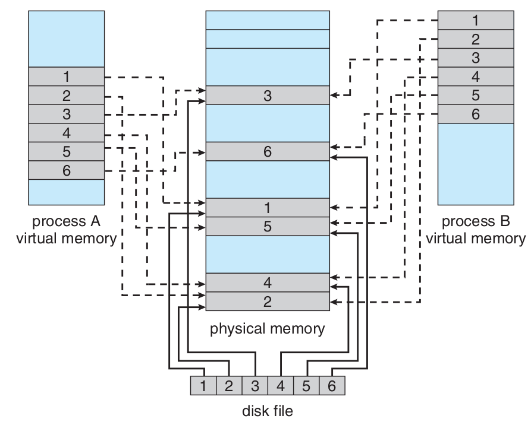

ورودی و خروجی‌های نگاشت شده به حافظه (Memory-Mapped Files)
------------------------------------------------------------------------------------

قفل کردن برخی صفحه‌ها
------------------------------------------------------------------------------------

اثر نوع برنامه‌نویسی و کامپایلر بر حافظهٔ مجازی
------------------------------------------------------------------------------------

.. include:: src/memory_virtual_effect_of_array_programming_row.cpp
  :code: cpp
  :number-lines:
  :class: ltr

.. include:: src/memory_virtual_effect_of_array_programming_column.cpp
  :code: cpp
  :number-lines:
  :class: ltr
  

قطعه‌بندی (segmentation)
======================================================================================================

.. image:: img/memory/memory_segmentation_logical_address.png
   :align: center
   :scale: 80%

.. image:: img/memory/memory_segmentation_example.png
   :align: center
   :scale: 80%

.. image:: img/memory/memory_segmentation_hardware.png
   :align: center
   :scale: 80%

.. image:: img/memory/memory_segmentation_logical2physical_address.png
   :align: center

اشتراک گذاری در قطعه‌بندی

ترکیب قطعه‌بندی و صفحه‌بندی
======================================================================================================

مانند صفحه‌بندی دو سطحی با این تفاوت که در سطح یکم قطعه‌بندی انجام می‌شود و در سطح دوم صفحه‌بندی انجام می‌شود.

ساختار حافظهٔ قطعه‌بندی شده در پردازنده‌های اینتل ۳۲ بیتی (IA32)
===================================================================================================

.. image:: img/memory/memory_real_hardware_example_IA-32_segmentation_logical2physical.png
   :align: center
   :scale: 70%

.. image:: img/memory/memory_real_hardware_example_IA-32_segmentation.png
   :align: center

*  بیشترین حافظه‌ای که می‌تواند پشتیبانی کند: 4GB
*  بیشترین تعداد قطعه در یک فرآیند: 16KB
*  بیشترین تعداد قطعهٔ اختصاصی برای یک فرآیند: 8KB برای دسترسی این بخش local descriptor table ( LDT ) به کار برده می‌شود.
*  بیشترین تعداد قطعهٔ اشتراکی برای یک فرآیند با دیگر فرآیندها: 8KB برای دسترسی به این بخش global descriptor table ( GDT ) به کار برده می‌شود.

.. csv-table:: بخش انتخاب کنندهٔ واحد قطعه‌بندی
   :header: `شمارهٔ قطعه`, `اختصاصی یا اشتراکی`, `حفاظت`
   :class: ltr
   
    13, 1, 2

ساختار حافظهٔ صفحه‌بندی شده در پردازنده‌های اینتل ۳۲ بیتی (IA32)
===================================================================================================

.. csv-table:: صفحه‌بندی ۴ کیلوبایتی
   :header:    `جدولِ صفحهٔ یکم`, `جدولِ صفحهٔ دوم`, `جابجایی`
   :class: ltr
   
    ۱۰, ۱۰, ۱۲

.. csv-table:: صفحه‌بندی ۴ مگابایتی
   :header:  `جدولِ صفحه`, `جابجایی`
   :class: ltr
   
    ۱۰, ۲۲

.. image:: img/memory/memory_real_hardware_example_IA-32_paging_4KB.png
   :align: center

.. image:: img/memory/memory_real_hardware_example_IA-32_paging_4KB_page_address_extension.png
   :align: center
   :scale: 70%

.. image:: img/memory/memory_real_hardware_example_x86_64_4KB_page_size_32_bit_pae_paging.png
   :align: center
   :scale: 120%

ساختار حافظه در پردازنده‌های «اِ اِم دی» ۶۴ بیتی (AMD64 یا `x86_64` )
===================================================================================================

.. image:: img/memory/memory_real_hardware_example_x86_64_4KB_page_size.png
   :align: center
   :scale: 70%

ساختار حافظه در پردازنده‌های «آرم» ۳۲ بیتی (ARM32)
===================================================================================================

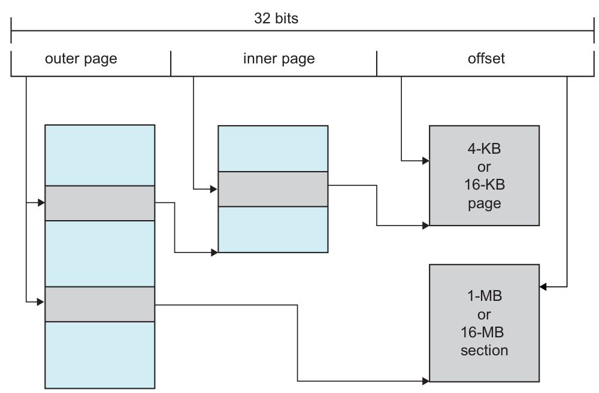

References:
==================================================

* `<https://stackoverflow.com/questions/18550370/calculate-the-effective-access-time>`_
* `<http://os-book.com/>`_
* https://en.wikipedia.org/wiki/Paging

.. comments:

    * `<https://en.wikipedia.org/wiki/Page_(computer_memory)>`_
    * http://blog.cs.miami.edu/burt/2012/10/31/virtual-memory-pages-and-page-frames/
    * `<https://www.tldp.org/LDP/tlk/mm/memory.html>`_
    * https://www.geeksforgeeks.org/operating-system-paging/
    * https://samypesse.gitbooks.io/how-to-create-an-operating-system/Chapter-8/
    * https://www.cse.iitb.ac.in/~mythili/teaching/cs347_autumn2016/notes/07-memory.pdf
    * https://www.kernel.org/doc/html/latest/admin-guide/mm/index.html
    * operating systems paging kernel

.. comments:

   rst2html.py memory.rst memory.html --stylesheet=../../tools/farsi.css,html4css1.css

