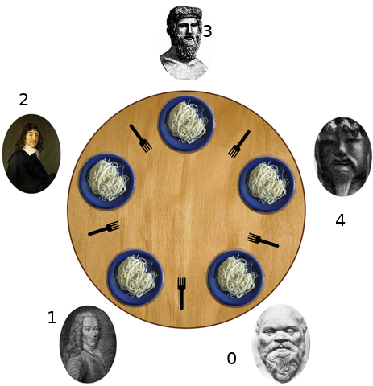

:data-transition-duration: 1000
:skip-help: true
:css: ./style.css ./ps.css
:substep: true
:slide-numbers: true
:skip-help: true

.. title: Operating Systems: Process Synchronization

----

Operating Systems: Process Synchronization
===============================================
Ahmad Yoosofan
-----------------------------
https://yoosofan.github.io

University of Kashan

.. :

  .. raw:: html

      
      
      

----

Sharing Resources
=================================
Critical Section
------------------------
Processes try to use resources simultaneously

.. class:: substep

* Sharing Physical Resources

  * printer
  * scanner
  * etc.

* Sharing Logical Resources

  * files

    * read
    * write

  * variables and arrays
  * lots of queues including Ready Queue

----

:id: ps-desc-i-id

Sharing Simple Variables(I)
=======================================
Share code

.. code:: cpp

  double x = 0, y = 1;

:math:`p_0`

.. code:: cpp
  :number-lines:

  x = y + 4 ;
  y = x - 2 ;

:math:`p_1`

.. code:: cpp
  :number-lines:

  x = y + 4 ;
  y = x - 2 ;

.. class:: substep trace-code

#. :math:`P_0` 1: x=5, y=1
#. :math:`P_0` 2: x=5, y=3
#. :math:`P_1` 1: x=7, y=3
#. :math:`P_1` 2: x=7, y=5

.. class:: substep trace-code

#. :math:`P_1` 1: x=5, y=1
#. :math:`P_1` 2: x=5, y=3
#. :math:`P_0` 1: x=7, y=3
#. :math:`P_0` 2: x=7, y=5

.. class:: substep trace-code

#. :math:`P_0` 1: x=5, y=1
#. :math:`P_1` 1: x=5, y=1
#. :math:`P_0` 2: x=5, y=3
#. :math:`P_1` 2: x=5, y=3

.. class:: substep trace-code

#. :math:`P_1` 1: x=5, y=1
#. :math:`P_0` 1: x=5, y=1
#. :math:`P_0` 2: x=5, y=3
#. :math:`P_1` 2: x=5, y=3

----

:id: ps-desc-ii-id

Sharing Simple Variables(II)
=======================================
Share code

.. code:: cpp

  double x = 0 , y = 1;

:math:`p_0`

.. code:: cpp
  :number-lines:

  x = y + 1 ;
  y = x + 2 ;

:math:`p_1`

.. code:: cpp
  :number-lines:

  x = y + 3 ;
  y = x + 5 ;

.. class:: substep trace-code

#. :math:`P_0` 1: x=2, y=1
#. :math:`P_0` 2: x=2, y=4
#. :math:`P_1` 1: x=7, y=4
#. :math:`P_1` 2: x=7, y=12

.. class:: substep trace-code

#. :math:`P_1` 1: x=4,  y=1
#. :math:`P_1` 2: x=4,  y=9
#. :math:`P_0` 1: x=10, y=9
#. :math:`P_0` 2: x=10, y=12

.. class:: substep trace-code

#. :math:`P_0` 1: x=2, y=1
#. :math:`P_1` 1: x=4, y=1
#. :math:`P_0` 2: x=4, y=6
#. :math:`P_1` 2: x=4, y=9

.. class:: substep trace-code

#. :math:`P_1` 1: x=4, y=1
#. :math:`P_0` 1: x=2, y=1
#. :math:`P_0` 2: x=2, y=4
#. :math:`P_1` 2: x=2, y=7

----

:id: ps-mcode-id

Machine code
=======================================
Share code

.. code:: cpp

  double x = 2;

:math:`p_0`

.. code:: cpp
  :number-lines:

  x = x + 2 ;

.. code:: cpp
  :number-lines:

  t1 = x + 2 ;
  x = t1

:math:`p_1`

.. code:: cpp
  :number-lines:

  x = x - 2 ;

.. code:: cpp
  :number-lines:

  t2 = x - 2 ;
  x = t2

.. class:: substep trace-code

#. :math:`P_0` 1: x=2, t1=4
#. :math:`P_0` 2: x=4, t1=4
#. :math:`P_1` 1: x=4, t2=2
#. :math:`P_1` 2: x=2, t2=2

.. class:: substep trace-code

#. :math:`P_1` 1: x=2, t2=0
#. :math:`P_1` 2: x=0, t2=0
#. :math:`P_0` 1: x=0, t1=2
#. :math:`P_0` 2: x=2, t1=2

.. class:: substep trace-code

#. :math:`P_0` 1: x=2, t1=2
#. :math:`P_1` 1: x=2, t2=0
#. :math:`P_0` 2: x=2, t1=2
#. :math:`P_1` 2: x=0, t2=0

.. class:: substep trace-code

#. :math:`P_1` 1: x=2, t2=0
#. :math:`P_0` 1: x=2, t1=4
#. :math:`P_1` 2: x=0, t2=0
#. :math:`P_0` 2: x=4, t1=4

----

How to solve race condition
================================
.. class:: substep

* Putting Operating System in charge
* Putting a process of Operating System in charge
* Putting different processes in charge of different resoureces
* No process in charge, just write codes the way to solve every race.

General Solutions
--------------------
.. class:: substep

* *Software solution* : (no need to change anything in current cpu)
* *Hardware solution* : (need to add some instructions to cpu)

----

:id: simplyfing-race-conditions-id

Simplifying
=====================================
.. list-table::

  * - .. code:: cpp
        :number-lines:

        P0

        Reminder Section 0

        Critical Section 1

        Remider Section 1

        Critical Section 2

        Reminer Section 2

        Critical Section 1

        ........

    - `.`

    - .. code:: cpp
        :number-lines:

        P1

        Reminder Section 0

        Critical Section 1

        Reminder Section 1

        Critical Section 2

        Reminder Section 2

        Critical Section 1

        Critical Section 2

        ........

    - `.`

.. table::
  :class: smallerelementwithfullborder

  +--------+--------+--------+--------+
  | p0     | p1     | p2     | p3     |
  +========+========+========+========+
  | p0_rs0 | p1_rs0 | p2_rs0 | p3_rs0 |
  +--------+--------+        |        |
  |    cs1 |    cs1 |        |        |
  +--------+--------+--------+        |
  | p0_rs1 | p1_rs1 |    cs3 |        |
  |        +--------+--------+--------+
  |        |    cs1 | p2_rs1 |   cs1  |
  +--------+--------+        |        |
  |        |        |        |        |
  |        |        +--------+--------+
  |        | p1_rs2 |  cs1   |        |
  |        |        |        |        |
  |        +--------+--------+        |
  |    cs2 |    cs1 |    cs2 | p3_rs1 |
  +--------+--------+        +--------+
  |        |        |        |  cs3   |
  | p0_rs2 |   cs2  +--------+--------+
  |        |        |        |        |
  +--------+        |        |        |
  |    cs1 |        | p2_rs2 | p3_rs2 |
  +--------+--------+--------+--------+
  | `....` | `....` | `....` | `....` |
  +--------+--------+--------+--------+

----

:class: t2c

Simplify
===========
.. list-table::

  * - .. code:: cpp
        :number-lines:

        P0

        P0_rs0

        Entry CS1
        CS1
        Exit CS1

        P0_rs1

        Entry CS2
        CS2
        Exit CS2

        P0_rs3

        Entry CS1
        CS1
        Exit CS1

        ........

    - `.`

    - .. code:: cpp
        :number-lines:

        P1

        P1_rs0

        Entry CS1
        CS1
        Exit CS1

        P1_rs1

        Entry CS1
        CS2
        Exit CS1

        P0_rs2

        Entry CS1
        CS1
        Exit CS1

        Entry CS2
        CS2
        Exit CS2

        ........

    - `.`

.. container:: substep

  .. class:: substep

  1. Just for two processes
  2. Just one critical section in code

  .. code:: cpp
    :number-lines:
    :class: substep

    do{

      Entry

      Critical Section

      Exit

      Reminder Section

    }while(1);

----

.. class:: substep

Requirements for Software Based Solution
===============================================
.. class:: substep

#. compilers do not put shared variables in registers
#. MMU of Cpu does not cache the shared section (page)
    * How does it know?
    * .. image:: img/memory/memory_paging_typical_page_table_entry.jpg
        :align: center
        :width: 450px
        :class: substep
#. Memory restriction (one request, no parallel respond)

----

:id: first-try-id

Using one Shared Variable
==============================
.. class:: substep

Share code

.. code:: cpp
  :number-lines:
  :class: substep

  bool busy = false;

.. class:: substep

:math:`P_0`

.. code:: cpp
  :number-lines:
  :class: substep

  do {
      if( busy == false ) // Entry
      {
            busy = true ;

            // Critical Section

            busy = false ; // Exit
      }

      // Reminder Section

  }while(1);

.. class:: substep

:math:`P_1`

.. code:: cpp
  :number-lines:
  :class: substep

  do {
      if( busy == false ) // Entry
      {
            busy = true;

            // Critical Section

            busy = false ; // Exit
      }

      // Reminder Section

  }while(1);

----

:id: second-try-id

Using one Shared Variable(busy)
================================
.. class:: substep

Share code

.. code:: cpp
  :number-lines:
  :class: substep

  bool busy = false;

.. class:: substep

:math:`P_0`

.. code:: cpp
  :number-lines:
  :class: substep

  do {
    while( busy == true ) // Entry
          ;
    busy = true ; // Entry

    // Critical Section

    busy = false ; // Exit

    // Reminder Section

  }  while(1);

.. class:: substep

:math:`P_1`

.. code:: cpp
  :number-lines:
  :class: substep

  do {
    while( busy == true ) // Entry
          ;
    busy = true ; // Entry

    // Critical Section

    busy = false ; // Exit

    // Reminder Section

  }  while(1);

----

:id: second-try-run-id

Mutual Exclusion Violation
================================
.. class:: substep

Share code

.. code:: cpp
  :number-lines:
  :class: substep

  bool busy = false;

.. class:: substep

:math:`P_0`

.. code:: cpp
  :number-lines:
  :class: substep

  while( busy == true )
    ;
  busy = true ; // Entry

  //Critical Section: CS

  busy = false ; // Exit

.. class:: substep

:math:`P_1`

.. code:: cpp
  :number-lines:
  :class: substep

  while( busy == true )
          ;
  busy = true ; // Entry

  //Critical Section: CS

  busy = false ; // Exit

----

:id: second-try-trace-id

Trace Second Try
================================
.. code:: cpp
  :number-lines:
  :class: substep

  bool busy = false;

.. code:: cpp
  :number-lines:
  :class: substep

      while( busy != false ) // P0
          ;
      busy = true ;

      // Critical Section : CS

      busy = false ;

.. code:: cpp
  :number-lines:
  :class: substep

      while( busy != false ) // P1
          ;
      busy = true ;

      // Critical Section : CS

      busy = false ;

.. class:: substep trace-code

#. :math:`P_0` 1
#. :math:`P_0` 3
#. :math:`P_0` 5
#. :math:`P_1` 1
#. :math:`P_1` 1
#. :math:`P_0` 7
#. :math:`P_1` 3
#. :math:`P_1` 5

.. class:: substep trace-code

#. :math:`P_0` 1
#. :math:`P_1` 1
#. :math:`P_0` 3
#. :math:`P_1` 3
#. *Mutual Exclusion Violation*

----

:id: third-try-id

Sharing turn
================================
.. class:: substep

Share code

.. code:: cpp
  :number-lines:
  :class: substep

  int turn = 0;

.. class:: substep

:math:`P_0`

.. code:: cpp
  :number-lines:
  :class: substep

  while(turn == 1)
    ;

  // CS

  turn = 1 ;

.. class:: substep

:math:`P_1`

.. code:: cpp
  :number-lines:
  :class: substep

  while(turn == 0)
    ;

  // CS

  turn = 0 ;

.. class:: substep

  Problem ?

----

:id: software-cs-turn-i-j-id

turn i j
================================
.. code:: cpp
  :number-lines:
  :class: substep

  // Share code
  int turn = 0;

.. code:: cpp
  :number-lines:
  :class: substep

  // P0
  while(turn == 1)
    ;

  // CS

  turn = 1 ;

.. code:: cpp
  :number-lines:
  :class: substep

  // P1
  while(turn == 0)
    ;

  // CS

  turn = 0 ;

.. code:: cpp
  :number-lines:
  :class: substep

  // Share code
  int turn = i;

.. code:: cpp
  :number-lines:
  :class: substep

  // Pi
  while(turn == j)
    ;

  // CS

  turn = j ;

.. code:: cpp
  :number-lines:
  :class: substep

  // Pj
  while(turn == i)
    ;

  // CS

  turn = i ;

----

:id: software-cs-need-id

need CS
================================
.. code:: cpp
  :number-lines:
  :class: substep

  // Share Code
  bool need[2] = {false, false};

.. code:: cpp
  :number-lines:
  :class: substep

  // Pi
  need[i] = true;
  while(need[j] == true)
    ;

  // CS

  need[i] = false ;

.. code:: cpp
  :number-lines:
  :class: substep

  // Pj
  need[j] = true;
  while(need[i] == true)
    ;

  // CS

  need[j] = false ;

.. class:: substep

  Problem ?

.. class:: substep trace-code

#. :math:`P_i` 2
#. :math:`P_j` 2
#. :math:`P_i` 3
#. :math:`P_j` 3
#. ∞

----

:id: software-cs2processes-id

Software Soloution 2 processes
================================
.. code:: cpp
  :number-lines:
  :class: substep

  // Share Code
  bool need[2] = {false, false};
  int turn = i;

.. code:: cpp
  :number-lines:
  :class: substep

  // Pi
  need[i] = true;
  turn = j;
  while(need[j] == true && turn == j)
    ;

  // CS

  need[i] = false ;

.. code:: cpp
  :number-lines:
  :class: substep

  // Pj
  need[j] = true;
  turn = i;
  while(need[i] == true && turn == i)
    ;

  // CS

  need[j] = false ;

.. code:: cpp
  :number-lines:
  :class: substep

  // Pi
  need[i] = true;
  turn = j;
  b1 = (need[j] == true);
  b2 = (turn == j);
  b3 = b1 && b2
  while(b3)
    ;

  // CS

  need[i] = false ;

----

Python Code
================
.. include:: src/ps/software_soloution2processes.py
  :number-lines:
  :code: python
  :start-line: 49
  :end-line: 71

----

:class: t2c

Software Soloution n processes(I)
========================================
.. code:: cpp
   :number-lines:

    // Share section
    int number[n] = {0};

.. code:: cpp
   :number-lines:

    // Each process
    number[i] = max(number, n)+1;
    for(j = (i+1) % n; j != i; j = (j+1) % n)
      while(number[i] > number[j] && number[j] != 0)
          ;
    /* Critical Section */
    number[i] = 0;

.. class:: substep trace-code

#. :math:`P_1` 2: Before assignment
#. :math:`P_2` 2: Get the same number as P1
#. :math:`P_2` 3, 4, 5, 6: in critical section
#. :math:`P_1` 2: assign the number
#. :math:`P_1` 3: given P2 is the only process
#. :math:`P_1` 4: Number[1] == number[2]
#. :math:`P_1` 5: then break
#. :math:`P_1` 6: in cs then mutual exclusion violation

----

:class: t2c

Software Soloution n processes(II)
========================================
.. code:: cpp
   :number-lines:

    // Share section
    int number[n] = {0};

.. code:: cpp
   :number-lines:

    // Each process
    number[i] = max(number, n)+1;
    for(j = (i+1) % n; j != i; j = (j+1) % n)
      while(number[i] >= number[j] && number[j] != 0)
          ;
    /* Critical Section */
    number[i] = 0;

.. class:: substep trace-code

#. :math:`P_1` 2: Before assignment
#. :math:`P_2` 2: Get the same number as P1
#. :math:`P_1` 2: After assignment
#. :math:`P_1` 3: Only for P2 with the same number
#. :math:`P_1` 4: number[1] >= number[2] then wait
#. :math:`P_2` 3: Only for P1 with the same number
#. :math:`P_2` 4: number[2] >= number[1] then wait
#. Unlimited wait or *Dead Lock*  ∞

----

:class: t2c

Software Soloution n processes(III)
========================================
.. code:: cpp
   :number-lines:

    // Each process
    number[i] = max(number, n)+1;
    for(j = (i+1) % n; j != i; j = (j+1) % n)
      while(number[i] >= number[j]
          && number[j] != 0 && i < j)
          ;
    /* Critical Section */
    number[i] = 0;

.. code:: cpp
   :number-lines:

    // Share section
    int number[n]={0};

.. class:: substep trace-code

#. Test

----

:id: software-cs-n-processes-ii-id

Software Soloution n processes(III)
========================================
.. code:: cpp
   :number-lines:

    // Share section
    int number[n] = {0};

.. code:: cpp
   :number-lines:

    // Each process
    number[i]=max(number,n)+1;
    for(j=(i+1)%n;j!=i;j=(j+1)%n){
      while((number[i]>number[j] && number[j]!=0) ||
            ((number[i]==number[j]) && i<j  ) )
          ;
    /* Critical Section */
    number[i] = 0;

----

:class: t2c

Software Soloution n processes(III)
========================================
.. container::

  .. code:: cpp
     :number-lines:

      // Share section
      int number[3] = {0};

  .. code:: cpp
     :number-lines:

      // P0
      t=max(number,3);
      number[0]=t+1;
      for(j=(0+1)%3;j!=0;j=(j+1)%3){
        while((number[0]>number[j] && number[j]!=0)||
              ((number[0]==number[j])&& 0<j))
            ;
      /* Critical Section */
      number[0] = 0;

  .. code:: cpp
     :number-lines:

      // P1
      t=max(number,3);
      number[1]=t+1;
      for(j=(1+1)%n;j!=1;j=(j+1)%n){
        while((number[1]>number[j] && number[j]!=0)||
              ((number[1]==number[j])&& 1<j))
            ;
      /* Critical Section */
      number[1] = 0;

.. class:: substep trace-code

#. P0-2 (number[0]== 0)
#. P1-2 (number[1]== 0)
#. P0-3 (number[0]== 1)
#. P0-4,5(all other number[j]==0)
#. P0-6,7
#. P0-8 (critical section)
#. P1-3 (number[1] == 1)
#. P1-4, 5
#. P1-6 ( i < j  , 1 < 0 ? )
#. P1-7,8 (in critical section)
#. **Mutual exclusion violation**

----

Software Soloution n processes(III)
==========================================
.. code:: cpp
   :number-lines:

    int number[n] = {0};
    bool choose[n]= {false};

.. code:: cpp
   :number-lines:

    choose[i]=true;
    number[i]=max(number,n)+1;
    choose[i]=false;
    for(j = (i+1) % n; j != i; j = (j+1)%n){
      while(choose[j] == true)
          ;
      while((number[i] > number[j] && number[j] != 0) ||
            ((number[i] == number[j]) && i < j  ) )
          ;
    /* Critical Section */
    number[i] = 0;

----

Hardware Soloution(I)
==========================================
.. code:: cpp
  :class: substep
  :number-lines:

  bool testAndSet(bool& lock){
    bool temp = lock;
    lock = true;
    return temp;
  }

.. code:: cpp
  :class: substep
  :number-lines:

    // Share section
    bool lock=false;

.. code:: cpp
  :class: substep
  :number-lines:

    // Each process
    while(testAndSet(lock))
          ;

    //    CRITICAL SECTION

    lock=false;

----

Assembly implementation
==============================
.. code:: asm
  :number-lines:

  enter_region:        ; A "jump to" tag; function entry point.

    tsl reg, flag      ; Test and Set Lock; flag is the
                       ; shared variable; it is copied
                       ; into the register reg and flag
                       ; then atomically set to 1.

    cmp reg, #0        ; Was flag zero on entry_region?

    jnz enter_region   ; Jump to enter_region if
                       ; reg is non-zero; i.e.,
                       ; flag was non-zero on entry.

    ret                ; Exit; i.e., flag was zero on
                       ; entry. If we get here, tsl
                       ; will have set it non-zero; thus,
                       ; we have claimed the resource
                       ; associated with flag.

  leave_region:
    move flag, #0      ; store 0 in flag
    ret                ; return to caller

.. :

  https://en.wikipedia.org/wiki/Test-and-set

----

:id: hardware-cs-i-trace-id

.. code:: cpp
  :number-lines:

    // P0
    do{
      while(TS(lock))
        ;
      // CS
      lock = false;
      // RS
    }while(1);

.. code:: cpp
  :number-lines:

    // P1
    do{
      while(TS(lock))
        ;
      // CS
      lock = false;
      // RS
    }

.. code:: cpp
  :number-lines:

    // P2
    do{
      while(TS(lock))
        ;
      // CS
      lock = false;
      // RS
    }

.. class:: substep trace-code

#. P0-3 , P1-3 , P2-3
#. P0-3 , P1-5 , P2-3
#. P0-3 , P1-6 , P2-3
#. P0-3 , P1-7 , P2-5
#. P0-3 , P1-3 , P2-6
#. P0-3 , P1-5 , P2-7
#. P0-3 , P1-6 , P2-3
#. P0-3 , P1-7 , P2-5
#. P0-3 , P1-3 , P2-6
#. P0-3 , P1-5 , P2-7
#. P0-3 , P1-6 , P2-3
#. `....` , `....`  , `....`
#. **P0 : starve**

----

Hardware Soloution(II)
========================================
.. code:: cpp
  :number-lines:
  :class: substep

  // Share section
  const int n=20;
  bool waiting[n]={false, ... , false};
  bool lock=false;
  // Each Process
  do{
    waiting[i] = true;
    bool key=true;
    while(waiting[i] && key){
      testAndSet(lock);
      key = lock;
    }
    waiting[i]=false;

    // CRITICAL SECTION

    int j=(i+1)%n;
    while((j!=i) && !waiting[j])
       j=(j+1)%n;
    if(j==i)  lock=false;
    else      waiting[j]=false;

    // REMINDER SECTION

  }while(1);

.. class:: substep

busy waiting

----

Can We Use Queue?
====================
.. code:: cpp
  :number-lines:
  :class: substep

  const int max;
  int Queue[max];
  bool lock = false;
  bool busyQueue = false;

.. code:: cpp
  :number-lines:
  :class: substep

    while(testAndset(busyQueue));
    Queue.Append(process_number);
    busyQueue = false;
    bool key = true;
    while(Queue.front() != process_number || key) // or &&
      key = testAndSet(lock);
    //cs

    while(testAndset(busyQueue));
    Queue.remove();
    busyQueue = false;
    lock = false;
    //rs

.. class:: substep

**Wrong Answer**

----

Hardware Soloution(III)
==========================
Swap
-----------------
.. code:: cpp
  :number-lines:
  :class: substep

  void swap(booelan& a, boolean& b){
      boolean temp = a;
      a = b;
      b = temp;
  }

.. code:: cpp
  :number-lines:
  :class: substep

  bool lock = false

.. code:: cpp
  :number-lines:
  :class: substep

  bool key = true;
  while( key == true )
    swap(lock, key);

  // CS

  lock = false;

.. class:: substep

  processor xchg instructions

  http://qcd.phys.cmu.edu/QCDcluster/intel/vtune/reference/6400380.htm

  The memory read and write are guaranteed to be atomic.

  `ARM  SWP <https://developer.arm.com/documentation/dht0008/a/swp-and-swpb/legacy-synchronization-instructions/swp-and-swpb>`_

.. :

  https://developer.arm.com/documentation/dui0489/c/arm-and-thumb-instructions/memory-access-instructions/swp-and-swpb

----

Disable / Enable Interrupt
=============================
Why don't they use this feature of interrupt?
-------------------------------------------------
.. code:: cpp

  DisableInterrupt()

  // CS

  EnableInterrupt()

----

Requirements for Solution
============================
.. class:: substep

* Mutual exclusion
* Progress
* Bounded waiting

----

:class: t2c

Semaphore(I)
================
.. code:: cpp
  :number-lines:
  :class: substep

    class Semaphore{
      int s;
      public:
      Semaphore(int n){s=n;}
      P(void){
        while(s<=0)
          ;
        s--;
      }

      V(void){
        s++;
      }
    }

.. container::

  .. code:: cpp
    :number-lines:
    :class: substep

      // Shared section
      Semaphore mutex=1;

  .. code:: cpp
    :number-lines:
    :class: substep

      // Each process use the following structure for CS
      void f(void){
        do{
          mutex.P();
            // CS
          mutex.V();
            // RS
        }while(true);
      }

----

:class: t2c

Semaphore(II - no busy waiting)
====================================
.. code:: cpp
  :number-lines:

    class semaphore{
      int s; myIntQueue q;
      public:
      void P(){
        s--;
        if(s < 0){
          q.add(getMyProcessPID());
          blockMe();
        }
      }
      void V(void){
        s++;
        if(s <= 0){
          int i = q.del();
          wakeupProcess(i);
        }
      }
      semaphore(int i=1){s=i;}
    };

.. container::

  .. code:: cpp
    :number-lines:
    :class: substep

      // Shared section
      Semaphore mutex=1;

  .. code:: cpp
    :number-lines:
    :class: substep

      void f(void){
        do{
          mutex.P();
            // CS
          mutex.V();
            // RS
        }while(true);
      }

----

:class: t2c

Sempahore(III) extra functions
================================================
.. code:: cpp
  :number-lines:

    bool testAndSet(bool& target)
    {bool rv=target;target=true;return rv;}
    class myIntQueue{
      static const int MAX = 1000;
      int bufferOfQueue[MAX];
      int first, last;
      public:
      myIntQueue(){first=last=0;}
      int add(int i){
        bufferOfQueue[last]=i;
        last=(last+1) % MAX;
        return i;
      }
      int del(void){
        int i = bufferOfQueue[first];
        first = (first+1) % MAX;
        return i;
      }
    };
    void wakeupProcess(int pid);
    void blockMe(void);
    int getMyProcessPID(void);

.. code:: cpp
  :number-lines:

    class semaphore{
      int s;
      myIntQueue q;
      bool lock;
      public:
      void P(void){
        while(testAndSet(lock)) ;
        s--;
        if(s < 0){
          q.add(getMyProcessPID());
          lock = false;
          blockMe();
        }else lock = false;
      }
      void V(void){
        while(testAndSet(lock)) ;
        s++;
        if(s <= 0)
          wakeupProcess(q.del());
        lock = false;
      }
      semaphore(int i)
      {s = i;lock = false;}
    };

----

:class: t2c

Semaphore(IV) Simple Usage
=============================
.. container::

  .. code:: cpp
    :number-lines:

    // shared section
    semaphore mutex=1;

  .. code:: cpp
    :number-lines:

    // Pi

    mutex.P();

    //   Critical Section

    mutex.V()

    //   Reminder Section

.. container::

  .. code:: cpp
    :number-lines:

    semaphore sem_printer=1, sem_scanner=1;

  .. code:: cpp
    :number-lines:

    // Pi

    sem_printer.P();

    // work with printer

    sem_printer.V();

    ....

    sem_scanner.P();

    // Work with scanner

    sem_sanner.V();

----

:class: t2c

Another Forms of Semaphore
==============================
.. container::

  .. code:: cpp
    :number-lines:

    semaphore mutex = 1;

  .. code:: cpp
    :number-lines:

    // Each process

    void f1(void){
      while(true){

        P(mutex);

        // Critical Section

        V(mutex);

        // Reminder Section

      }
    }

.. container::

  .. code:: cpp
    :number-lines:

      semaphore mutex = 1;

  .. code:: cpp
     :number-lines:

      // Each process

      void f1(void){
        while(true){

          wait(mutex);

          // Critical Section

          signal(mutex);

          // Reminder Section

        }
      }

----

Other Types of Semaphore
============================
#. Binary Semaphore
#. Weak Semaphore
#. Priority Semaphore

.. :

  https://ebrary.net/51306/computer_science/burst_fifo_mode_semaphores
  https://cwiki.apache.org/confluence/display/NUTTX/Signaling+Semaphores+and+Priority+Inheritance

  https://en.cppreference.com/w/cpp/thread/counting_semaphore

  std::counting_semaphore, std::binary_semaphore
  https://en.cppreference.com/w/cpp/thread/counting_semaphore

  (constructor)     constructs a counting_semaphore  (public member function)
  (destructor)    destructs the counting_semaphore  (public member function)
  operator=  [deleted]    counting_semaphore is not assignable  (public member function)

  Operations
  release :    increments the internal counter and unblocks acquirers  (public member function)
  acquire :    decrements the internal counter or blocks until it can  (public member function)
  try_acquire :    tries to decrement the internal counter without blocking  (public member function)
  try_acquire_for :    tries to decrement the internal counter, blocking for up to a duration time  (public member function)
  try_acquire_until :    tries to decrement the internal counter, blocking until a point in time  (public member function)

  Constants
  max  [static]    returns the maximum possible value of the internal counter  (public static member function)

  Example

  .. code:: cpp

  // c++ 20
    #include <iostream>
    #include <thread>
    #include <chrono>
    #include <semaphore>

    // global binary semaphore instances
    // object counts are set to zero
    // objects are in non-signaled state
    std::binary_semaphore
      smphSignalMainToThread{0},
      smphSignalThreadToMain{0};

    void ThreadProc()
    {
      // wait for a signal from the main proc
      // by attempting to decrement the semaphore
      smphSignalMainToThread.acquire();

      // this call blocks until the semaphore's count
      // is increased from the main proc

      std::cout << "[thread] Got the signal\n"; // response message

      // wait for 3 seconds to imitate some work
      // being done by the thread
      using namespace std::literals;
      std::this_thread::sleep_for(3s);

      std::cout << "[thread] Send the signal\n"; // message

      // signal the main proc back
      smphSignalThreadToMain.release();
    }

    int main()
    {
      // create some worker thread
      std::thread thrWorker(ThreadProc);

      std::cout << "[main] Send the signal\n"; // message

      // signal the worker thread to start working
      // by increasing the semaphore's count
      smphSignalMainToThread.release();

      // wait until the worker thread is done doing the work
      // by attempting to decrement the semaphore's count
      smphSignalThreadToMain.acquire();

      std::cout << "[main] Got the signal\n"; // response message
      thrWorker.join();
    }

  .. code:: sh

    g++ -std=c++20 -O2 -Wall -pedantic -pthread main.cpp && ./a.out

  https://coliru.stacked-crooked.com/

----

:class: t2c

Simple Deadlock
=======================
.. code:: cpp
  :number-lines:

  semaphore sem_printer=1, sem_scanner=1;

.

.. code:: cpp
  :number-lines:

  // P0

  sem_scanner.P();

  sem_printer.P();

  // work with printer

  sem_printer.V();

  sem_scanner.V();

.. code:: cpp
  :number-lines:

  // P1

  sem_printer.P();

  sem_scanner.P();

  // Work with scanner

  sem_sanner.V();

  sem_printer.V();

----

:class: t2c

Semaphore in Python
====================
.. code:: python
  :number-lines:

  // Share part
  full = Semaphore(0)

  class MyShare:
    n = 0

.. code:: python
  :number-lines:

  def f1(sh1):
    i = 1
    while i < 999999:
      full.acquire() # full.P(); full.wait();

      sh1.n = i
      i += 1

      full.release() # full.V(); full.signal();

.

.. code:: python
  :number-lines:

  if __name__ == "__main__":
    sh1 = MyShare()
    th1=Thread(target=f1,args=(sh1,))
    th2=Thread(target=f1,args=(sh1,))
    th1.start()
    th2.start()
    th1.join()
    th2.join()
    print("counter ", sh1.n)

----

Producer consumer(I)
=======================
.. image:: img/ps/bounded-buffer-problem.webp

.. :

  https://www.studytonight.com/operating-system/bounded-buffer
  http://www.tutorialsspace.com/Operating-System/20-Interprocess-Communication-Producer-Consumer-Problem.aspx

----

Producer consumer(II)
=======================
.. list-table::

  * - .. code:: python
        :number-lines:

        def producer(sh1):
          x = -1
          in1 = 0
          for i in range(5000):
            x = produce(x, in1)
            sh1.buf[in1] = x
            in1 = in1 + 1

    - .. code:: python
        :number-lines:

        def consumer(sh1):
          out = 0
          x=0
          for i in range(5000):
            x = sh1.buf[out];
            out = out +1
            consume(x,out)

  * - .. code:: python
        :number-lines:

        class MyShare:
          counter = 0
          n = 100000
          buf = [-1] * n

        def produce(x, i):
          print('produce ', (x+1)%100,i)
          return (x+1)%100

        def consume(x, i):
          print('consume ',x,i)

    - .. code:: python
        :number-lines:

        if __name__ == "__main__":
          sh1 = MyShare()
          th1=Thread(target=consumer,args=(sh1,))
          th2=Thread(target=producer,args=(sh1,))
          th1.start();
          th2.start();
          th1.join();
          th2.join()
          for i in range(4): print(sh1.buf[i])
          print("counter ", sh1.counter)

----

:class: t2c

Unbounded Buffer(Wrong Answer)
=================================
.. code:: python
  :number-lines:

  mutex = Semaphore(1)

.

.. code:: python
  :number-lines:

  def producer(sh1):
    x = -1
    in1 = 0
    for i in range(5000):
      mutex.acquire()
      x = produce(x, in1)
      sh1.buf[in1] = x
      in1 = in1 + 1
      mutex.release() # empty.V()

.. code:: python
  :number-lines:

  def consumer(sh1):
    out = 0
    x=0
    for i in range(5000):
      mutex.acquire()
      x = sh1.buf[out];
      sh1.buf[out] = -1
      out = out + 1
      consume(x,out)
      mutex.release()

----

:class: t2c

Unbounded Buffer
==================
.. code:: python
  :number-lines:

  full = Semaphore(0)

.

.. code:: python
  :number-lines:

  def producer(sh1):
    x = -1
    in1 = 0
    for i in range(5000):
      x = produce(x, in1)
      sh1.buf[in1] = x
      in1 = in1 + 1
      full.release(); # full.V()

.. code:: python
  :number-lines:

  def consumer(sh1):
    out = 0
    x=0
    for i in range(5000):
      full.acquire() # full.P()
      x = sh1.buf[out];
      sh1.buf[out] = -1
      out = out +1
      consume(x,out)

----

:class: t2c

Buffer(I)
==================
.. code:: python
  :number-lines:

  full = Semaphore(0)

.

.. code:: python
  :number-lines:

  def producer(sh1):
    x = -1
    in1 = 0
    for i in range(5000):
      x = produce(x, in1)
      sh1.buf[in1] = x
      in1 = (in1 + 1) % sh1.n
      full.release(); # full.V()

.. code:: python
  :number-lines:

  def consumer(sh1):
    out = 0
    x=0
    for i in range(5000):
      full.acquire() # full.V()
      x = sh1.buf[out];
      sh1.buf[out] = -1
      out = (out +1) % sh1.n
      consume(x,out)

----

:class: t2c

Bounded Buffer(II)
==================
.. code:: python
  :number-lines:

  class MyShare:
    counter = 0
    n = 100000
    buf = [-1] * n

.. code:: python
  :number-lines:

  full = Semaphore(0)

  empty= Semaphore(MyShare.n)

.. code:: python
  :number-lines:

  def producer(sh1):
    x = -1
    in1 = 0
    for i in range(5000):
      x = produce(x, in1)
      empty.acquire() # empty.P()
      sh1.buf[in1] = x
      in1 = (in1 + 1) % sh1.n
      full.release(); # empty.V()

.. code:: python
  :number-lines:

  def consumer(sh1):
    out = 0
    x=0
    for i in range(5000):
      full.acquire() # full.P()
      x = sh1.buf[out];
      sh1.buf[out] = -1
      out = (out +1) % sh1.n
      empty.release() # empty.V()
      consume(x,out)

----

:class: t2c

Bounded Buffer(Any kind of Queue)
==================================
.. code:: python
  :number-lines:

  Q = Any kind of complex Queue
  // with append and delete

  full = Semaphore(0)

  empty= Semaphore(10)

  mutex = Semaphore(1)

.

.. code:: python
  :number-lines:

  def producer(sh1):
    x = -1
    for i in range(5000):
      x = produce(x, in1)
      empty.acquire() # empty.P()
      mutex.acquire()
      Q.append(x)
      mutex.release()
      in1 = (in1 + 1) % sh1.n
      full.release(); # empty.V()

.. code:: python
  :number-lines:

  def consumer(sh1):
    x=0
    for i in range(5000):
      full.acquire() # full.P()
      mutex.acquire()
      x = Q.delete()
      mutex.release()
      empty.release() # empty.V()
      consume(x,out)

----

:class: t2c

Producer consumer full
==========================
.. include:: src/ps/producer_consumer.8.py
  :code: cpp
  :number-lines:
  :start-line: 0
  :end-line: 33

.. include:: src/ps/producer_consumer.8.py
  :code: cpp
  :number-lines: 33
  :start-line: 33
  :end-line: 70

----

:class: t2c

Bounded Buffer(Percent Empty )
======================================
.. code:: python
  :number-lines:

  class MyShare:
    counter = 0
    n = 100000
    buf = [-1] * n

.. code:: python
  :number-lines:

  full = Semaphore(0)

  empty= Semaphore(MyShare.n % 90)

.. code:: python
  :number-lines:

  def producer(sh1):
    x = -1
    in1 = 0
    for i in range(5000):
      x = produce(x, in1)
      empty.acquire() # empty.P()
      sh1.buf[in1] = x
      in1 = (in1 + 1) % sh1.n
      full.release(); # empty.V()

.. code:: python
  :number-lines:

  def consumer(sh1):
    out = 0
    x=0
    for i in range(5000):
      full.acquire() # full.P()
      x = sh1.buf[out];
      sh1.buf[out] = -1
      out = (out +1) % sh1.n
      empty.release() # empty.V()
      consume(x,out)

----

:class: t2c

Readers and Writers(I)
========================
.. code:: cpp
  :number-lines:
  :class: substep

  SharedObjectType sh1 = InitalValue;

  void write(SharedObjectType a1)
  {sh1 = a1;}

  SharedObjectType read(void)
  {return sh1;}

.

.. code:: cpp
  :number-lines:
  :class: substep

  void writer(void){
    do{
      x = ProduceOrWhatever()
      write(x);
      RemainingWork();
    }while(1);
  }

.. code:: cpp
  :number-lines:
  :class: substep

  void reader(void){
    do{
      x = read()
      consumeOrWhatever(x)
      RemainingWork();
    }while(1);
  }

----

:class: t2c

Readers and Writers(II)
========================
.. code:: cpp
  :number-lines:
  :class: substep

  semaphore wx = 1;

.

.. code:: cpp
  :number-lines:
  :class: substep

  void writer(void){
    do{
      x = ProduceOrWhatever()
      wx.P();
      write(x);
      wx.V();
      RemainingWork();
    }while(1);
  }

.. code:: cpp
  :number-lines:
  :class: substep

  void reader(void){
    do{
      wx.P();
      x = read()
      wx.V();
      consumeOrWhatever(x)
      RemainingWork();
    }while(1);
  }

----

:class: t2c

Readers and Writers(III)
=========================
.. code:: cpp
  :number-lines:
  :class: substep

  semaphore wx = 1;
  int read_count = 0;

.

.. code:: cpp
  :number-lines:
  :class: substep

  void writer(void){
    do{
      wx.P();
      write();
      wx.V();
      RemainingWork();
    }while(1);
  }

.. code:: cpp
  :number-lines:
  :class: substep

  void reader(void){
    do{
      if(read_count == 0)
        wx.P();
      read_count ++;
      read();
      read_count --;
      if(read_count == 0)
          wx.V();
      RemainingWork();
    }while(1);
  }

----

:class: t2c

Readers and Writers(IV)
=========================
.. container::

  .. code:: cpp
    :number-lines:
    :class: substep

    semaphore wrt = 1, mutex = 1;
    int readCount = 0;

  .. code:: cpp
    :number-lines:
    :class: substep

    void writer(void){
       wrt.P();
       // writting perform in  share_variable;
       wrt.V();
    }

.. code:: cpp
  :number-lines:
  :class: substep

  void readers(void){
     mutex.P();
     readCount++;
     if(readCount==1)
        wrt.P();
     mutex.V();
     // reading performed
     mutex.P();
     readCount--;
     if(readCount==0)
        wrt.V();
     mutex.V();
  }

----

Dininig Philosophers(I)
==========================

----

:class: t2c

Dininig Philosophers(II)
==========================
.. code:: cpp
  :number-lines:
  :class: substep

  //
  // Shared Eating Objects
  // Forks
  // Food (Spagetti)
  //

.. code:: cpp
  :number-lines:
  :class: substep

  void philosopher(int i){
    while (1){
      think();
      eat();
      Rest();
    }
  }

.. code:: cpp
  :number-lines:
  :class: substep

  int main(){
    cobegin{
      philosopher(0); philosopher(1);
      philosopher(2); philosopher(3);
      philosopher(4);
    }
  }

----

:class: t2c

Dininig Philosophers(III)
==========================
.. code:: cpp
  :number-lines:
  :class: substep

  // Shared Eating

  void think(void){cout <<"Eating"<<endl;}
  void eat(void){cout<<"thinking"<<endl;}
  semaphore forks[5]={1,1,1,1,1};

.. code:: cpp
  :number-lines:
  :class: substep

  void philosopher(int i){
    while (1){
      think();
      forks[i].P();
      forks[(i+1)%5].P();
      eat();
      forks[(i+1)%5].V();
      forks[i].V();
    }
  }

.. code:: cpp
  :number-lines:
  :class: substep

  int main(){
    cobegin{ philosopher(0);
      philosopher(1); philosopher(2);
      philosopher(3); philosopher(4);
    }
  }

----

:class: t2c

Dininig Philosophers(IV)
==========================
.. code:: cpp
  :number-lines:
  :class: substep

  enum {thinking , hungry , eating }
    state[5];

  semaphore self[5]{0,0,0,0,0};

.. code:: cpp
  :number-lines:
  :class: substep

  void pickup(int i){
    state[i] = hungry;
    if(state[(i-1)%5] == eating ||
        state[(i+1)%5 == eating)
      self[i].P()
    state[i] = eating;
  }

.. code:: cpp
  :number-lines:
  :class: substep

  void putdown(int i){
    if(state[(i-1)%5] == hungry &&
        state[(i-2)%5 != eating )
      self[(i-1)%5].V();
    if(state[(i+1)%5] == hungry &&
        state[(i+2)%5 != eating )
      self[(i+1)%5].V();
    state[i]=thinking;
  }

.. code:: cpp
  :number-lines:
  :class: substep

  void philosopher(int i){
    do{
      //thinking
      pickup(i);
      // eating
      putdown(i);
    }while(1);
  }

.. code:: cpp
  :number-lines:
  :class: substep

  int main(){
    for(int i=0; i<5; i++)
      state[i]= thinking;
    cobegin{ philosopher(0);
      philosopher(1);philosopher(2);
      philosopher(3);philosopher(4);
    }
  }

----

:class: t2c

Dininig Philosophers(VI)
==========================
.. code:: cpp
  :number-lines:
  :class: substep

  // Shared Eating

  void think(void){cout <<"Eating"<<endl;}
  void eat(void){cout<<"thinking"<<endl;}
  semaphore forks[5]={1,1,1,1,1};
  semaphore numberOfPh = 4;

.. code:: cpp
  :number-lines:
  :class: substep

  void philosopher(int i){
    while (1){
      think();
      numberOfPh.P();
      forks[i].P();
      forks[(i+1)%5].P();
      eat();
      forks[(i+1)%5].V();
      forks[i].V();
      numberOfPh.V();
    }
  }

.. code:: cpp
  :number-lines:
  :class: substep

  int main(){
    cobegin{ philosopher(0);
      philosopher(1); philosopher(2);
      philosopher(3); philosopher(4);
    }
  }

----

Monitor
==========

----

END
=======
.. :

  Other links
  ****************
  C++20
  =========
  https://www.modernescpp.com/index.php/multithreading-in-c-17-and-c-20

  .. code:: cpp

    int func() {
      static int i = 0;
      synchronized{
        std::cout << "Not interleaved \n";
        ++i;
        return i;
      }
    }

    int main(){
      std::vector<std::thread> v(10);
      for(auto& t: v)
        t = std::thread([]{ for(int n = 0; n < 10; ++n) func(); });
    }

  https://www.runoob.com/w3cnote/cpp-std-thread.html

  .. code:: cpp

    #include <iostream>
    #include <thread>
    #include <chrono>
    #include <mutex>

    std::mutex g_display_mutex;

    void foo()
    {
      std::thread::id this_id = std::this_thread::get_id();

      g_display_mutex.lock();
      std::cout << "thread " << this_id << " sleeping...\n";
      g_display_mutex.unlock();

      std::this_thread::sleep_for(std::chrono::seconds(1));
    }

    int main()
    {
      std::thread t1(foo);
      std::thread t2(foo);

      t1.join();
      t2.join();
    }

  C#
  ================
  https://developpaper.com/concurrent-programming-in-net-core/
  https://www.shekhali.com/multithreading-in-c/

  https://regi.tankonyvtar.hu/hu/tartalom/tamop412A/2011-0052_23_advanced_programming_laguages/ar01s14.html
  https://stackoverflow.com/questions/49478513/concurrent-programming-operation-order
  https://www.researchgate.net/publication/3298852_A_correct_and_scalable_deadlock_avoidance_policy_for_flexible_manufacturing_systems/figures?lo=1&utm_source=google&utm_medium=organic
  https://stackoverflow.com/questions/49478513/concurrent-programming-operation-order

  Productive parallel programming in Python
  Use Parsl to create parallel programs comprised of Python functions and external components. Execute Parsl programs on any compute resource from laptops to supercomputers.
  https://parsl-project.org/

  https://onlinelibrary.wiley.com/doi/full/10.1002/cpe.4175
  http://kevinpelgrims.com/blog/2010/08/30/parallel-programming-in-net-introduction/
  https://livebook.manning.com/book/concurrency-in-dot-net/chapter-1/
  http://kevinpelgrims.com/blog/2010/08/30/parallel-programming-in-net-introduction/
  https://dev.to/clightning/good-bad-ugly-in-concurrent-programming-with-c-30ke

  https://www.modernescpp.com/index.php/c-core-guidelines-rules-for-concurrency-and-parallelism
  https://www.modernescpp.com/index.php/multithreading-in-c-17-and-c-20
  https://www.heise.de/developer/meldung/Programmiersprache-Der-Entwurf-von-C-20-ist-abgeschlossen-4317206.html
  https://www.toptal.com/software/introduction-to-concurrent-programming
  https://dev.to/clightning/good-bad-ugly-in-concurrent-programming-with-c-30ke

  https://www.shekhali.com/multithreading-in-c/
  https://maharajan-ses.medium.com/asynchronous-programming-part-1-eb1e9df80377

  dividing code parallel programming

  https://sulangsss.github.io/2018/09/16/Java/Thread/Concurrency%20vs%20Parallelism/
  https://medium.com/dev-genius/multi-threading-vs-asynchronous-programming-what-is-the-difference-3ebfe1179a5

  https://www.tutorialspoint.com/operating_system/os_overview.htm

