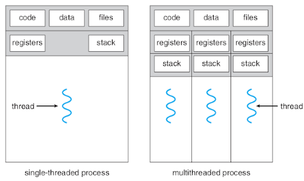
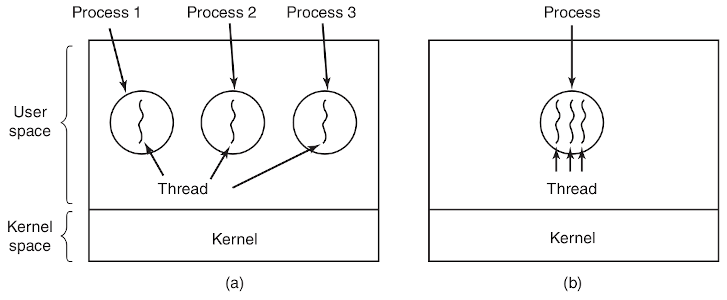
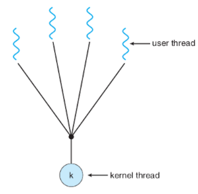

:data-transition-duration: 1000
:skip-help: true
:css: ./style.css ./thread.css
:substep: true
:slide-numbers: true
:skip-help: true

.. title: Operating Systems: Thread

----

Operating Systems: Thread
===============================================
Ahmad Yoosofan
-----------------------------
https://yoosofan.github.io

University of Kashan

----

حالت‌های نخ
==================

.. :

  https://www.tutorialspoint.com/operating_system/os_multi_threading.htm

----

:id: thread-in-python-i-id

Python Thread (I)
=======================
.. include:: src/thread/142.py
  :number-lines:
  :code: python
  :class: substep

.. include:: src/thread/152.py
  :number-lines:
  :code: python
  :class: substep

.. code:: console
  :class: substep

  main
  This is a test
  After f1()

.. code:: console
  :class: substep

  main
  After th1.start()
  This is a test

.. code:: console
  :class: substep

  main
  This is a test
  After th1.start()

.. code:: console
  :class: substep

  main
  This is  After th1.start()
  a test

----

Python main
=======================
.. include:: src/thread/162.py
  :number-lines:
  :code: python
  :class: substep

.. include:: src/thread/172.py
  :number-lines:
  :code: python
  :class: substep

----

:id: thread-in-python-ii-id

Python Thread (II)
=======================
.. include:: src/thread/220.py
  :number-lines:
  :code: python

.. code:: console
  :class: substep

  main
  After f1
  After f2
  In f1
  In f2

.. code:: console
  :class: substep

  main
  After f1
  In f1
  After f2
  In f2

.. code:: console
  :class: substep

  main
  After f1
  In f1
  After f2
  In f2

.. code:: console
  :class: substep

  main
  After f1
  After f2
  In f2
  In f1

.. code:: console
  :class: substep

  main
  After In f1
  After f2
  In f2
  f1

----

:id: thread-in-python-iii-id

Python Thread (III)
=====================
.. include:: src/thread/240.py
  :number-lines:
  :code: python

.. code:: console
  :class: substep

  python3 240.py > 240output65.txt
  python3 240.py > 240output55.txt
  python3 240.py > 240output45.txt
  python3 240.py > 240output35.txt
  python3 240.py > 240output25.txt

.. code:: console
  :class: substep

  5314 __111
  5315 __111 __main
  1459 __main
  1460 __main

  240output55.txt : 9108

.. code:: console
  :class: substep

  2139 __main
  2140 __main
  2141
  2336 __222
  2337 __222

  240output55.txt : 9790

.. code:: console
  :class: substep

  6059 __111
  6060 __111 __main
  2142 __main
  2143 __main

  240output55.txt : 11281

.. code:: console
  :class: substep

  1589 __111
  1590 __1110 __222
  1 __222
  2 __222

  240output65.txt : 1590

----

:id: thread-in-python-join-i-id

Thread Python join(I)
========================
.. include:: src/thread/260.py
  :number-lines:
  :code: python

.. include:: src/thread/270.py
  :number-lines:
  :code: python
  :class: substep

----

:id: thread-in-python-join-ii-id

Thread Python join(II)
========================
.. include:: src/thread/280.py
  :number-lines:
  :code: python

.. include:: src/thread/290.py
  :number-lines:
  :code: python
  :class: substep

----

:id: thread-in-python-parameter-id

Thread Python parameter
========================
.. include:: src/thread/320.py
  :number-lines:
  :code: python

.. include:: src/thread/330.py
  :number-lines:
  :code: python
  :class: substep

----

:id: thread-in-python-sharing-id

Thread Python Sharing
===========================
.. include:: src/thread/350.py
  :number-lines:
  :code: python

.. include:: src/thread/360.py
  :number-lines:
  :code: python
  :class: substep

----

.. :

  :id: paralell-func-id

Create Concurrent / Parallel Code
===================================
.. :

  .. code:: cpp

    f2(x) * f3(x) + f4(x, y) / f5(x, y)

  .. code:: cpp
    :class: substep

    f2(x)
    
  .. code:: cpp
    :class: substep

    f3(x)

  .. code:: cpp
    :class: substep

    f4(x, y)

  .. code:: cpp
    :class: substep

    f5(x, y)

  .. code:: cpp
    :class: substep

    f2(x) *  f3(x)

  .. code:: cpp
    :class: substep

    f4(x, y) / f5(x, y)

  .. code:: cpp
    :class: substep

    +

.. yographviz::
  :height: 500

  digraph{
    Start [label="f2(x) * f3(x) + f4(x, y) / f5(x, y)"]
    A11 [label="f2(x)"]
    A12 [label="f3(x)"]
    A13 [label="f4(x, y)"]
    A14 [label="F5(x, y)"]
    
    A21 [label="*"]
    A22 [label="/"]
    
    A3 [label="+"]
    
    Start -> A11
    Start -> A12
    Start -> A13
    Start -> A14
    
    A11 -> A21
    A12 -> A21
    
    A13 -> A22
    A14 -> A22
    
    A21 -> A3
    A22 -> A3
    
  }
  
----

:id: cpp-thread-id

C++ Thread
===============
.. include:: src/thread/620.cpp
  :number-lines:
  :code: cpp
  :class: substep

.. code:: console
  :class: substep
  
  thread$ ./a.out
  In main
  second in main
  In thread 
  the next output in thread
  thread$ ./a.out

----

:id: cpp-thread-join-id

C++ Thread join
=================
.. include:: src/thread/630.cpp
  :number-lines:
  :code: cpp
  :class: substep

.. include:: src/thread/630_out.txt
  :code: console
  :class: substep

----

:id: cpp-thread-func-array-id

Array of Thread
====================
.. include:: src/thread/640.cpp
  :number-lines:
  :code: cpp
  :class: substep

.. include:: src/thread/640_out10.txt
  :code: console
  :class: substep

----

:id: cpp-thread-func-array-out-id

Array of Thread output
==========================
.. include:: src/thread/640_out20.txt
  :code: console
  :class: substep

.. include:: src/thread/640_out40.txt
  :code: console
  :class: substep

----

:id: cpp-thread-func-array-out2-id

Array of Thread output(II)
==========================
.. include:: src/thread/640_out560.txt
  :code: console
  :class: substep

.. include:: src/thread/640_out50.txt
  :code: console
  :class: substep

----

:id: cpp-thread-func-array-out4-id

Array of Thread(III)
======================
.. include:: src/thread/650.cpp
  :number-lines:
  :code: cpp
  :class: substep

.. include:: src/thread/650_out10.txt
  :code: console
  :class: substep

----

:id: cpp-thread-func-array-out5-id

Array of Thread(III)
======================
.. include:: src/thread/650_out12.txt
  :code: console
  :class: substep

.. include:: src/thread/650_out14.txt
  :code: console
  :class: substep

----

:id: cpp-thread-func-array-out6-id

Array of Thread(III)
======================
.. include:: src/thread/650_out16.txt
  :code: console
  :class: substep

.. include:: src/thread/650_out18.txt
  :code: console
  :class: substep

----

Threads and Processes
============================

----

Many to One Thread
======================

----

Different Types of Threads
===============================
.. image:: img/thread/thread.user_level.kernel.level.png
   :align: center
   :width: 500px
   :height: 350px

----

:id: user-kernel-thread-id

User and Kernel Thread
========================
*  user threads
*  kernel threads

.. :

  ----

  .. image:: img/thread/thread_One_to_one_model.png
     :align: center

  ----

  .. image:: img/thread/thread_many_to_many_model.png
     :align: center

----

.. image:: img/thread/thread.A.user_level.threads.package.b.A.threads.package.managed.by.the.kernel.png
   :align: center
   :width: 500px
   :height: 350px

.. :

  ----

  .. image:: img/thread/thread_two_level_model.png
     :align: center

  ----

  .. image:: img/thread/Actual_Parallelism_Vs_Feel_of_Parallelism.jpg
     :align: center

  `codeproject: Shivprasad koirala <https://www.codeproject.com/Articles/1267757/Concurrency-vs-Parallelism?msg=5573355#xx5573355xx>`_

  ----

  *  Data parallelism
  *  Task parallelism

----

ارتباط میان حالت‌های نخ‌ها
===========================================
.. image:: img/thread/thread.Examples.of.the.Relationships.between.User_Level.Thread.States.and.Process.States.png
   :align: center
   :width: 500px
   :height: 350px

----

سرویس دهندهٔ وب با چند نخ
==========================================
.. image:: img/thread/thread.A.multithreaded.Web.server.png
   :align: center
   :width: 500px
   :height: 350px

----

Threads in Webserver
======================
.. image:: img/thread/thread_Multithreaded_server_architecture.png
   :align: center
   :width: 500px

----

End

.. comments:

  cd yoosofan/course/
  bash run_slide.sh os/slide/thread.rst
  
  hovercraft thread.rst
  
  rst2html.py thread.rst thread.html --stylesheet=../../tools/farsi.css,html4css1.css

  https://www.c-sharpcorner.com/article/programming-concurrency-in-cpp-part-1/
  https://www.codeproject.com/Articles/1271904/Programming-Concurrency-in-Cplusplus-Part-1
  https://www.codeproject.com/Articles/1267757/Concurrency-vs-Parallelism?msg=5573355#xx5573355xx
  https://medium.com/@sanju.skm/parallel-programming-vs-concurrent-programming-f993d3f9ceea
  https://medium.com/@sanju.skm/parallel-programming-vs-concurrent-programming-f993d3f9ceea
  https://www.eclipse.org/lists/platform-ui-dev/msg07521.html
  
