:data-transition-duration: 1000
:data-width: 1024
:data-height: 768
:skip-help: true
:css: ./style.css
:substep: true

.. title: Operating System (By Ahmad Yoosofan)

:slide-numbers: true

.. role:: raw-html(raw)
   :format: html

.. |nbsp| unicode:: 0xA0

.. role:: rtl
    :class: rtl

.. note::

    The assembly code examples in this section were developed with assistance
    from DeepSeek AI to demonstrate Morris Mano computer architecture concepts.

----

Operating Systems
======================
Ahmad Yoosofan

University of Kashan

https://yoosofan.github.io/en/

Yoosofan Imaginary Computer (YIC)
---------------------------------

Based on Morris Mano's famous book

----

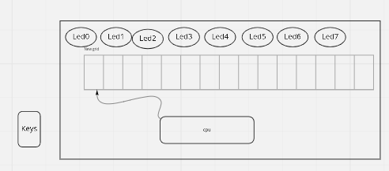

----

:class: t2c

YIC 10, Instruction Set(I)
==========================
.. code:: asm

    AND: Logical AND memory with AC
    ADD: Arithmetic ADD memory with AC
    LDA: Load from memory to AC
    STA: Store AC to memory
    BUN: Branch unconditional
    ISZ: Increment and skip if zero
    CLA: Clear AC
    CLE: Clear E
    CMA: Complement AC
    CME: Complement E
    CIR: Circulate right (AC and E)
    CIL: Circulate left (AC and E)

.. code:: asm

    INC:    Increment AC
    SPA:    Skip if positive AC
    SNA:    Skip if negative AC
    SZA:    Skip if zero AC
    SZE:    Skip if zero E
    HLT:    Halt
    OUT:    Output a character from AC
    SKO:    Skip if output flag
    NOP:    No operation

----

:class: t2c

YIC 10, Instruction Set Bianary(II)
===================================
.. code:: asm

    AND:    00001
    ADD:    00010
    LDA:    00011
    STA:    00100
    BUN:    00101
    ISZ:    00110
    CLA:    00111
    CLE:    01000
    CMA:    01001
    CME:    01010
    CIR:    01011
    CIL:    01100

.. code:: asm

    INC:    01101
    SPA:    01110
    SNA:    01111
    SZA:    10000
    SZE:    10001
    HLT:    10010
    OUT:    10011
    SKO:    10100
    NOP:    10101

----

hex pad connect to microcontroller
==============================================
https://www.circuitstoday.com/interfacing-hex-keypad-to-8051

https://circuitdigest.com/microcontroller-projects/keypad-interfacing-with-avr-atmega32

----

Example
============
* https://github.com/yoosofan/mano-computer-simulator-js
* https://yoosofan.github.io/mano-computer-simulator-js/
* https://github.com/Naheel-Azawy/Simple-Computer-Simulator/blob/master/test/test-symbolic
* https://github.com/Naheel-Azawy/Simple-Computer-Simulator/blob/master/test/test
* https://github.com/Naheel-Azawy/Simple-Computer-Simulator/tree/master/test

----

Other assembly
==================
* http://imrannazar.com/arm-opcode-map
* https://iitd-plos.github.io/col718/ref/arm-instructionset.pdf
* https://wiki.osdev.org/X86-64_Instruction_Encoding
* https://cs.brown.edu/courses/cs033/docs/guides/x64_cheatsheet.pdf
* https://sites.google.com/site/nttrungmtwiki/home/rce/assembly-language/x64-opcode-and-instruction-reference-home
* http://ref.x86asm.net/coder64.html
* arm 32 opcodes

* http://z80-heaven.wikidot.com/instructions-set:ld
* http://z80-heaven.wikidot.com/opcode-reference-chart
* https://smallcomputercentral.files.wordpress.com/2017/12/asm80-com-tutorial-e1-0-01.pdf
* https://stackoverflow.com/questions/22838444/convert-an-8bit-number-to-hex-in-z80-assembler
* https://www.vcfed.org/forum/forum/technical-support/vintage-computer-programming/76419-z80-hello-world-example-in-hex
* https://www.cemetech.net/forum/viewtopic.php?t=15710&start=0
* z80 assembly codes

----

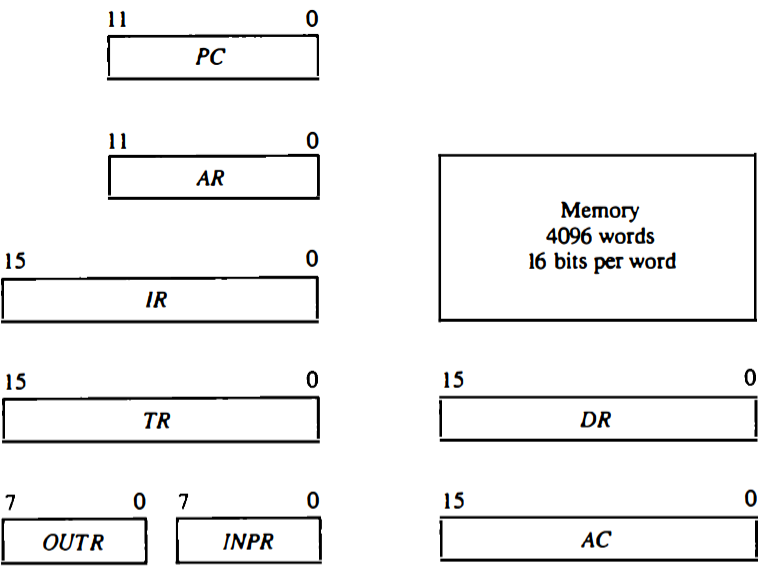

----

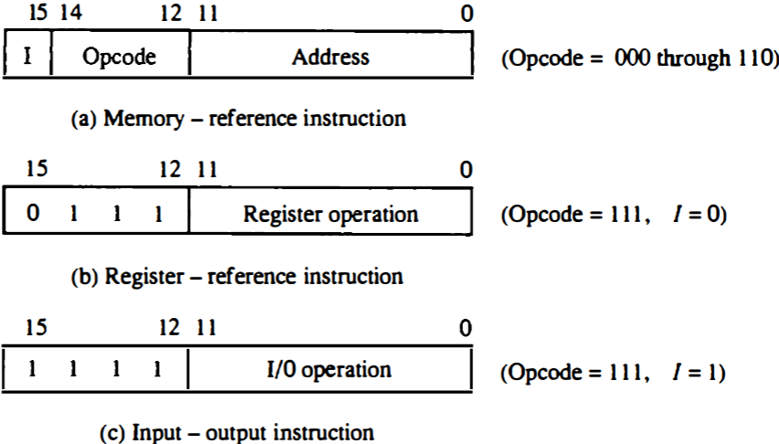

.. :

    img/in/Mano_Basic_computer_instructions_opcodes.png
    img/in/Mano_flowchart4instruction_cycle_1.png

----


.. code:: asm

  00101 00000  1010
  00110 00000  1100
  00111 00000  1110
  01000

  00000

.. class:: rtl

اگر حداکثر ۳۲ دستور داشته باشیم پس پنج بیت برای دستورها نیاز داریم
برای سادگی فرض می‌کنیم که طول همهٔ دستورها یکسان است
یعنی هم دو بایت را می‌گیرند
فرض کنید  دستورها پنج بیت نیاز دارند پس ۱۱ بیت برای
آدرس

حداکثر حافظهٔ این کامپیوتر چقدر می‌تواند باشد.
اگر بخواهیم بایتی آدرس دهی کنیم

۲^۱۱ = ۲kB

B = Byte

اگر آدرس‌دهی را دو بایتی در نظر بگیریم

۴kB (word = 2 byte)

----

Output
==============
LED

seven segment
-----------------
* https://www.rapidtables.com/convert/number/hex-to-binary.html
* convert hex to binary
* https://clrhome.org/asm/

----

:class: t2c

Output Problem
===============
.. code:: asm

  lda a
  add b
  sta c
  out
  hlt
  a, 5
  b, 2
  c, 0

.. code:: asm
    :class: substep

    ..........
    ..........

    LB1: out
        sko
        bun LB1

    ...........
    ...........


----

:class: t2c

Simple LED
==========================
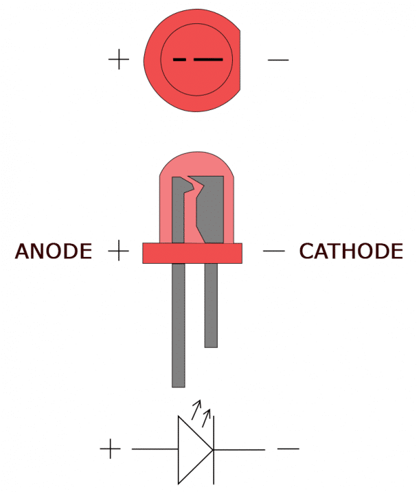

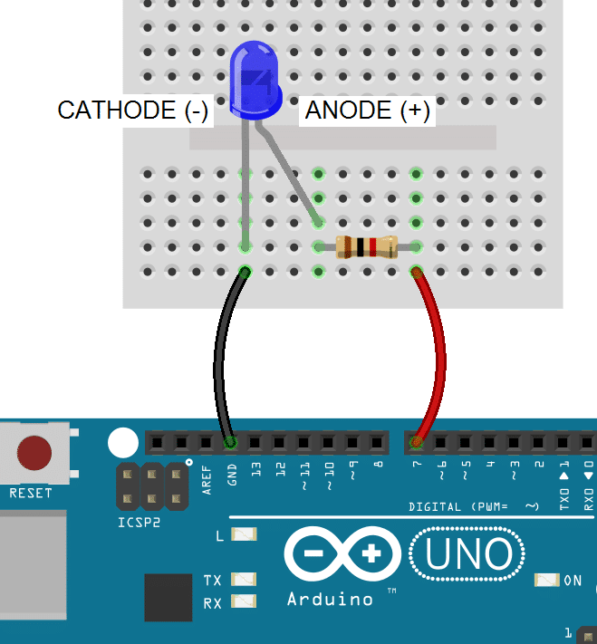

`circuitbasics <https://www.circuitbasics.com/arduino-7-segment-display-tutorial/>`_

----

:class: t2c

Seven segment display
==========================

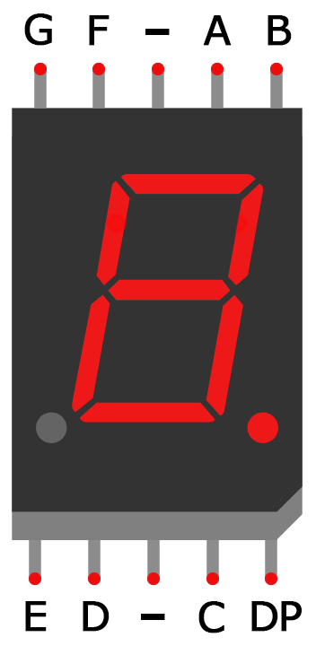

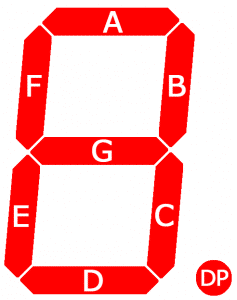

`circuitbasics <https://www.circuitbasics.com/arduino-7-segment-display-tutorial/>`_
`askingthelot <https://askingthelot.com/how-do-i-connect-7-segment-display/>`_

`youtu.be <https://youtu.be/XCJqoae4hgY>`_
`element14 <https://community.element14.com/challenges-projects/element14-presents/thelearningcircuit/w/documents/4523/the-learning-circuit-53---how-to-drive-a-7-segment-display?CMP=SOM-YOUTUBE-PRG-E14PRESENTS-LCIRCUIT-53-COMM-7-SEGMENT-DISPLAY>`_

----

Imaginary Computer
==================
* Consider it as real a computer
* Think about business plan
* Consider customers' need
* Consider other companies

----

YIC 30, Seven segment
=====================
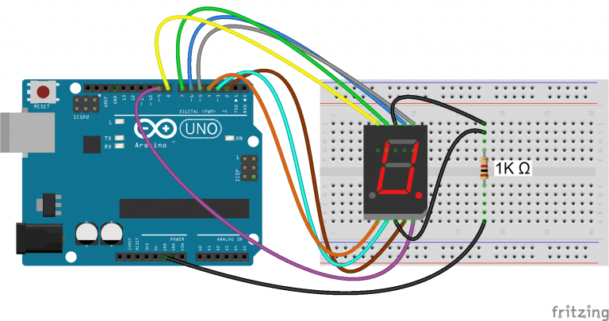

`circuitbasics <https://www.circuitbasics.com/arduino-7-segment-display-tutorial/>`_

----

Issues of YIC 30
================
.. class:: substep

* Convert binary number to 7 segment code
* Old codes only LED
* LED & seven segment
* Changing CPU
* Cost of changes
* Just one 7 segment ?
* for every output, seven segment code should be added

----

Hardware insead of Software
===============================
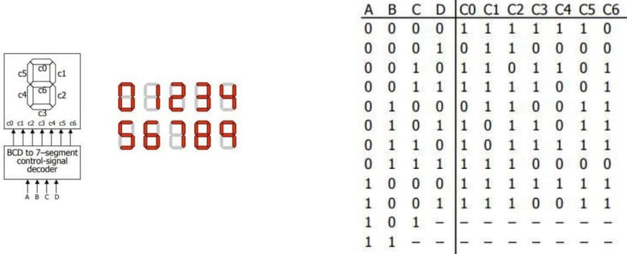

.. :

  جزوهٔ درس معماری کامپیوتر دکتر مختار معصومی
  https://www.electronics-tutorials.ws/blog/7-segment-display-tutorial.html
  https://www.geeksforgeeks.org/bcd-to-7-segment-decoder/

----

:class: t2c

4 Digit 7-Segment Displays
===========================
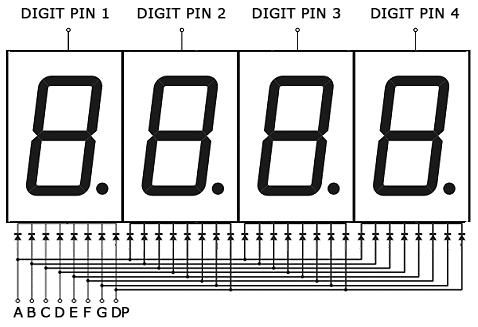

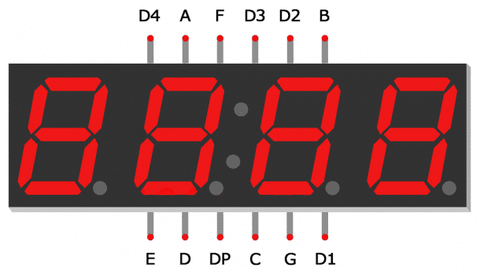

`circuitbasics <https://www.circuitbasics.com/arduino-7-segment-display-tutorial/>`_

----

Connecting 4 Digit 7-Segment Displays
============================================
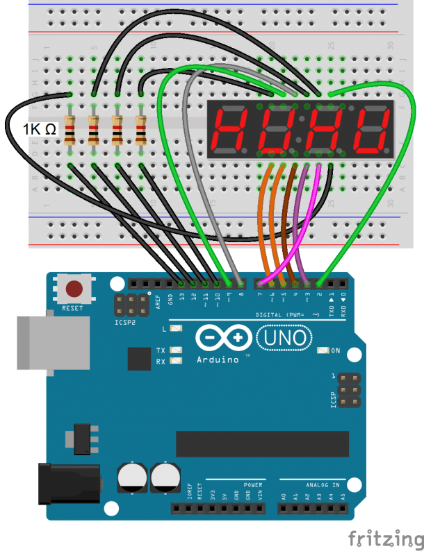

----

:class: t2c

Arduino Print 4 to 7-segment
===============================
.. code:: cpp

  #include "SevSeg.h"
  SevSeg sevseg;

  void setup(){
    byte numDigits = 1;
    byte digitPins[] = {};
    byte segmentPins[] =
      {6, 5, 2, 3, 4, 7, 8, 9};
    bool resistorsOnSegments = true;

    byte hardwareConfig = COMMON_CATHODE;
    sevseg.begin(hardwareConfig,
      numDigits, digitPins, segmentPins,
      resistorsOnSegments
    );
    sevseg.setBrightness(90);
  }

  void loop(){
    sevseg.setNumber(4);
    sevseg.refreshDisplay();
  }

..  csv-table::
  :header-rows: 1
  :class: smallerelementwithfullborder

  Segment Pin, Arduino Pin
  A, 6
  B, 5
  C, 2
  D, 3
  E, 4
  F, 7
  G, 8
  DP, 9

`circuitbasics <https://www.circuitbasics.com/arduino-7-segment-display-tutorial/>`_

.. :

    ----

    Processor Series
    ======================
    * AMD (https://developer.amd.com/resources/developer-guides-manuals/)
    * Intel (https://www.intel.com/content/dam/www/public/us/en/documents/manuals/64-ia-32-architectures-software-developer-instruction-set-reference-manual-325383.pdf)


----

:class: t2c

YIC 40 - BSA
=============
.. class:: substep

#. LED output code
#. 7 segment code
#. Printer
#. output selector
#. Adding porecedures
#. Device Drivers
#. Adding more devices
#. No error checking
#. Send data
#. API (protocol)

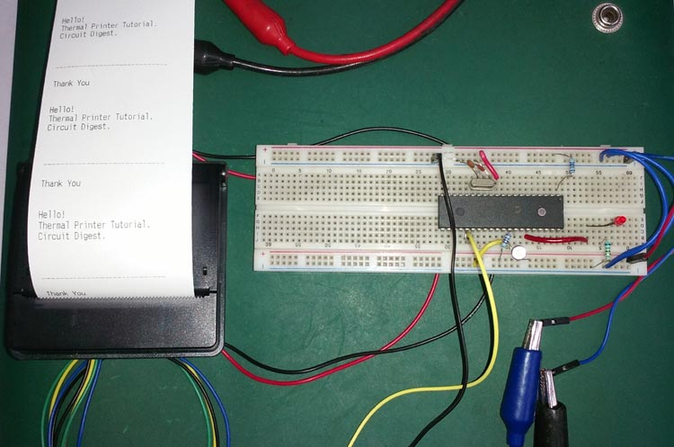

----

Printer Routine
========================================
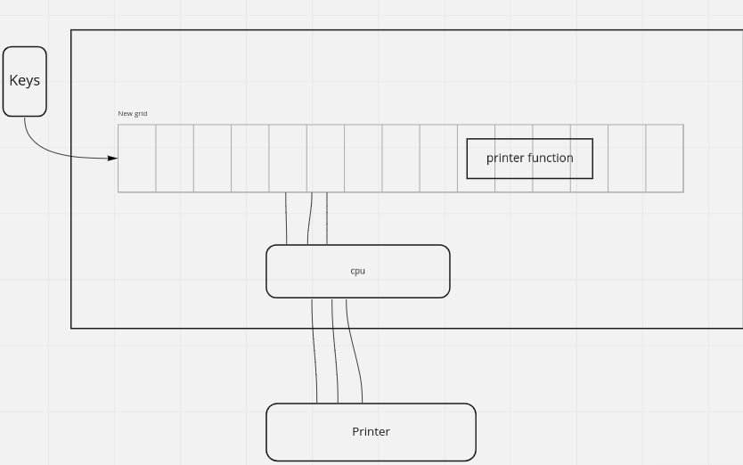

----

Adding procedurs to memory
==========================
.. csv-table::
    :class: yoo-memory center

    User Process (P) , |nbsp| |nbsp| |nbsp| |nbsp| |nbsp| |nbsp| |nbsp| |nbsp|,
    0 ,                              800,                       2048

.. csv-table::
    :class: yoo-memory center

    |nbsp| |nbsp| P |nbsp| |nbsp| , |nbsp| |nbsp| |nbsp| |nbsp| , LED Procedure
    0 ,                              648,                    1024, 2048

.. csv-table::
    :class: yoo-memory center

    |nbsp| |nbsp| P |nbsp| |nbsp| , |nbsp| |nbsp| |nbsp| , LED,  7 segment,
    0 ,                              456,            1024, 1048, 1096,    2048

.. csv-table::
    :class: yoo-memory center

    |nbsp| |nbsp| P |nbsp| |nbsp| , |nbsp| |nbsp| |nbsp| |nbsp|  |nbsp| |nbsp| , LED, 7 , printer, |nbsp| |nbsp|  |nbsp| |nbsp|
    0 ,  456,           1024,                        1048 ,     1096,  1256,   2048

Users (programmers) should know where these precedures are

.. :

    1. protocol

    2. API

    Data:
    1. Fixed Address
    2. Register
    3. Address in register

    Address of functions
    BSA

----

YIC50 - Array of Addresses
==========================
.. csv-table::
    :class: yoo-memory center

    P, |nbsp| |nbsp| |nbsp| |nbsp|  |nbsp| |nbsp|, array , LED, 7 , printer, |nbsp| |nbsp|  |nbsp| |nbsp|
    0,  456,           1000, 1024                       , 1048 ,     1096,  1256,   2048

Array

.. csv-table::
    :class: yoo-memory center

    1024, 1048, 1096 , 1256,
    0,  1, 2, 3, 4,


indirect BSA

User chooses between old cpu or new one

----

:class: t2c

YIC60 - Input Device (Card Reader)
==================================
.. container::

    .. class:: substep

    #. Card Reader
    #. Necessary Loops
    #. Check Errors
    #. Polling Method

    * Hollerith and IBM keypunches, 1890
    * IBM 011 Electric Key Punch(1923)
    * IBM Type 032 Printing Punch(1935)
    * A Key Punch Room in the 1960s

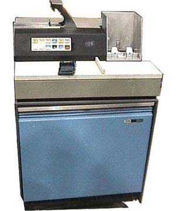

----

:class: n2c

.. container::


    card punch

    .. image:: img/in/punch-card-machine.png

.. container::

    card reader


    .. image:: img/in/pile_of_punch_cards_next2woman.png
      :height: 500px

----

.. code:: asm
    :number-lines:

           ORG 0
    START, BSA READ1
           STA BYTE1
           LDA BYTE1
           BSZ OUTCH
           HLT

    READ1, HEX 0
    RDCNT, SKI
           BUN RDCNT
           INP
           BUN (READ1)

    OUTCH, HEX 0
    OUTPR, SKO
           BUN OUTPR
           OUT
           BUN (OUTCH)

    BYTE1, DEC     0
           END

.. :

    The code is generated by DeepSeek before editing

    .. image:: img/in/315px-Punched_card_program_deck.agr.jpg


    ----

    Other Links for Punch Card Machines
    ====================================
    * https://en.wikipedia.org/wiki/Computer_programming_in_the_punched_card_era
    * old computer operator changing cards
    * https://www.computerhope.com/jargon/p/punccard.htm
    * https://en.wikipedia.org/wiki/IBM_System/3
    * https://en.wikipedia.org/wiki/Tabulating_machine
        *  1890 U.S. Census

    ----

    Card reader
    ===============
    https://www.pinterest.com/pin/326299935478491352/

    old ibm card punch reader

----

:class: t2c

Simple Input Output Code - YIC60
================================
.. include:: src/in/simple_in_out.asm
    :code: c
    :number-lines:
    :start-line: 3
    :end-line: 18


.. include:: src/in/simple_in_out.asm
    :code: cpp
    :number-lines: 15
    :start-line: 18
    :end-line: 47

----

YIC60 - Array of Addresses
==========================
.. csv-table::
    :class: yoo-memory center

    P, |nbsp| |nbsp| |nbsp| |nbsp|  |nbsp| |nbsp|, array , LED, 7 , printer, |nbsp| |nbsp|  |nbsp| |nbsp|
    0,  456,           1000, 1024                       , 1048 ,     1096,  1256,   2048

Array

.. csv-table::
    :class: yoo-memory center

    1024, 1048, 1096 , 1256,
    0,  1, 2, 3, 4,

----

:class: t2c

YIC60 code with array(I)
================================
.. include:: src/in/simple_in_out_array.asm
    :code:  asm
    :number-lines:
    :start-line: 6
    :end-line: 29


.. include:: src/in/simple_in_out_array.asm
    :code: asm
    :number-lines: 19
    :start-line: 29
    :end-line: 48

----

:class: t2c

YIC60 code with array(II)
================================
.. include:: src/in/simple_in_out_array.asm
    :code: asm
    :number-lines:
    :start-line: 42
    :end-line: 60


.. include:: src/in/simple_in_out_array.asm
    :code: asm
    :number-lines: 21
    :start-line: 60
    :end-line: 84

----

YIC70 - Adding Loader
=====================
.. csv-table::
    :class: yoo-memory center

    Loader, user process, |nbsp| |nbsp| |nbsp| |nbsp|  |nbsp| |nbsp|, array , LED, 7 , printer,  Card Reader,|nbsp|  |nbsp| |nbsp| ,
    0, 100,  556,           1000, 1024                       , 1048 ,     1096,  1256, 1450,  2048


Array

.. csv-table::
    :class: yoo-memory center

    1024, 1048, 1096 , 1256,
    0,  1, 2, 3, 4,

-----

:class: grid-3col

.. include:: src/in/loader1.asm
    :code: asm
    :number-lines:
    :start-line: 4
    :end-line: 25


.. include:: src/in/loader1.asm
    :code: asm
    :number-lines: 21
    :start-line: 25
    :end-line: 49

.. include:: src/in/loader1.asm
    :code: asm
    :number-lines: 44
    :start-line: 49

----

YIC75 Relative Address
======================
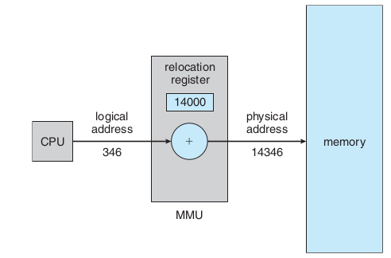

.. :

    src/in/loader4_base_register_comments.asm

    Loaded Program (What gets loaded):

    // This program gets loaded and thinks it starts at address 0
    // All addresses are logical - will be translated by base register

            ORG     0

    MAIN,   // Call input procedure via PVT
            LDA     PVT_INPUT_ADDR  // Logical address 152
            STA     CALL_PTR
            BSA     CALL_PTR I      // Indirect call to input

            STA     NUM1

            // Call output procedure via PVT
            LDA     PVT_OUTPUT_ADDR // Logical address 153
            STA     CALL_PTR
            BSA     CALL_PTR I      // Indirect call to output

            HLT

    // Procedure Vector Table at logical address 150
            ORG     150
    PVT_INPUT,  HEX     200    // Logical address of INPUT
    PVT_OUTPUT, HEX     220    // Logical address of OUTPUT

    // Pointers to PVT entries
    PVT_INPUT_ADDR,  HEX     150    // Address of PVT_INPUT
    PVT_OUTPUT_ADDR, HEX     151    // Address of PVT_OUTPUT

    // Input Procedure at logical address 200
            ORG     200
    INPUT,  HEX     0
            // Input code here
            BSA     READ_CHAR       // Call helper
            BUN     INPUT I

    READ_CHAR, HEX  0
            // Character input code
            BUN     READ_CHAR I

    // Output Procedure at logical address 220
            ORG     220
    OUTPUT, HEX     0
            // Output code here
            BSA     WRITE_CHAR      // Call helper
            BUN     OUTPUT I

    WRITE_CHAR, HEX 0
            // Character output code
            BUN     WRITE_CHAR I

    // Data Section for loaded program
            ORG     300    // Logical address 300
    NUM1,   DEC     0
    CALL_PTR, HEX   0

            END


    Address Translation Example:

    If base register = 256:

        Logical 0 → Physical 256

        Logical 150 (PVT) → Physical 406

        Logical 200 (INPUT) → Physical 456

        Logical 220 (OUTPUT) → Physical 476


----

address binding, absolute and relocate loader

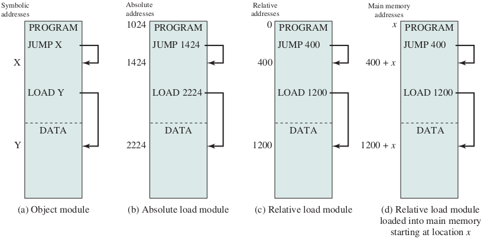

----

YIC80 - Interrupt
=================
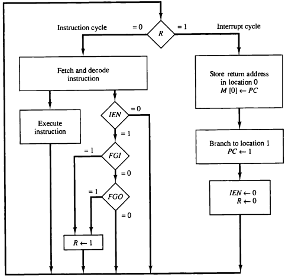

.. :

  .. image:: img/in/interrupt_chart.jpg

----

:class: t2c

Interrupt-Driven Program
===========================
.. include:: src/in/Interrupt_Driven_Program_with_BSA_Subroutines.asm
    :code: asm
    :number-lines:
    :end-line: 19

.. include:: src/in/Interrupt_Driven_Program_with_BSA_Subroutines.asm
    :code: asm
    :number-lines: 20
    :start-line: 19
    :end-line: 35

**Save E flag**

.. :

    `src/yic/Interrupt_save_E.asm`

----

:class: t2c

Input, Add and Output
=====================
.. include:: src/yic/inp.add.out.asm
    :code: asm
    :number-lines:
    :end-line: 28

.. include:: src/yic/inp.add.out.asm
    :code: asm
    :number-lines: 29
    :start-line: 28
    :end-line: 56

----

:class: t4c

.. csv-table::
    :class: yoo-memory center

     , |nbsp| |nbsp| Loader  |nbsp| |nbsp| , READ , WRITE, ISR |nbsp| , DATA, user process,
    0,4                                    , 100  , 150  , 200 , 250,  300         , 1024

.. include:: src/yic/loader1.asm
    :code: asm
    :number-lines:
    :end-line: 32

.. include:: src/yic/loader1.asm
    :code: asm
    :number-lines: 33
    :start-line: 32
    :end-line: 64

.. include:: src/yic/loader1.asm
    :code: asm
    :number-lines: 65
    :start-line: 64
    :end-line: 96

----

Other Loader Samples
=================================
.. code:: sh

    # Advanced: Buffered Input with BSA Subroutines
    src/in/Interrupt_Driven_Program_with_BSA_Subroutines_Advanced_with_buffer.asm
    src/in/Interrupt_Driven_Program_with_BSA_Subroutines_Advanced_with_buffer_comments.asm

    # Enhanced bootstrap loader with error checking
    src/in/Bootstrap_Loader_Program_More_Robust_Version_with_Error_Checking.asm

    # Relocating Bootstrap Loader with Base Register
    src/in/loader4_base_register_comments.asm


    # Simple Bootstrap Loader with Absolute Addressing
    src/in/loader7_interrupt_Simple_Bootstrap_Loader_with_Absolute_Addressing.asm
    src/in/loader7_interrupt_Simple_Bootstrap_Loader_with_Absolute_Addressing_comments.asm

    src/in/loader7_user_program_comments.asm
    src/in/loader7_user_program.asm


    # Uses interrupt-driven I/O instead of polling
    src/in/loader10_interrupt.asm
    src/in/loader10_interrupt_comments.asm

    # Interrupt-driven program that gets loaded
    src/in/loader10_loaded_program.asm
    src/in/loader10_loaded_program_comments.asm

----

:class: t2c

Review YICs
===========
.. class: substep

#. Connect memory to power
#. Connect HEX Pad keyboard to memory.
#. Enter machine code of user
#. Enter machine code of OS Routines
#. Connect cpu to memory
#. Connect output device to cpu
#. Connect input device to cpu
#. Turn on CPU (start runnig codes)
#. HLT at the end of user code
#. Give output(s) to user
#. Back to step 1

----

:class: t2c

Relative Address Problem
======================================
* Normal execution
    * Logical Address
    * Base or Relocation Register
    * Physical address ← PC + Base
    * AR ← Base + PC
    * Kernel Mode
    * UMD: Change CPU mode to user
    * mode = 1, a flag in CPU Like C
* Kernel
    * Interrupt Service Routine (ISR)
    * Boot
    * Loader
    * OS routines and libraries
    * Effective address = logical address
    * KMD: change CPU mode to kernel
    * mode = 0

----

There is a flaw in your code. In YIC 80 and 90, the kernel (loader, ISR and other system routines) put in the memory (RAM, random access memory) directly by a device like HEX Pad(Hexadecimal) keyboard without CPU involvement.

   1.  Turn on memory by connecting to power supply (battery or anything like that) and will not turn off afterwards
   2.  Connect HEX Pad keyboard (or any similar device) to memory.
   3.  Enter kernel machine code by the Hexpad keyboard
   4.  Disconnect  HEX Pad keyboard from memory after kernel entered to the memory
   5.  Connect cpu to memory
   6.  Connect printer or another simple output device to cpu
   7.  Connect card reader or another simple input device to cpu
   8.  Turn on cpu by connecting it to a power supply (battery or anything like that)
   9.  Mano's cpu starts at 0 address
   10. Read user program from input device by loader (part of kernel)
   11. RTI to user program
   12. RTK to loader after the user program finished
   13. Load another user program from input

Your code put a ``hex 0`` in address zero of memory while it should be a ``BUN ``
Please fix this problem and any other problems in your suggested code and rewrite the whole code.

.. code::
   :number-lines:
   :class: substep

    ORG 0
    BUN     LOADER
    BUN     ISR
    LOADER, ION
    LOOP,   BSA READ_WORD
    STA     SIZE
    BSA     LOAD
    UMD
    BSA     300
    BUN     LOOP

    ; ISR
    ; Routines
    END

    ORG     300 ; User program
    UPRG,   HEX 0
    BSA     100
    ADD     TEN
    BSA     150
    BUN     300 I
    TEN,    DEC 10
    END


----

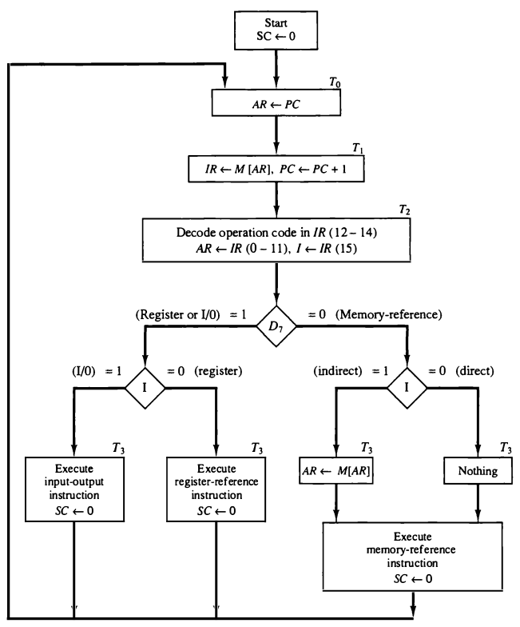

----

YIC90 Interrupt and Relative Address
====================================
RTI instruction
---------------
When the CPU executes `RTI` (while still safely in Kernel Mode), the hardware performs the following sequence during the execution phase:

1. **$t_3$: $AR \leftarrow 0$** *(Put absolute address 0 into the Address Register)*
2. **$t_4$: $DR \leftarrow M[AR]$** *(Read the saved return address from memory into the Data Register)*
3. **$t_5$: $PC \leftarrow DR$, $MODE \leftarrow 1$, $IEN \leftarrow 1$, $SC \leftarrow 0$** *(Simultaneously restore the Program Counter, switch the Mode flip-flop to User, re-enable hardware interrupts, and clear the Sequence Counter to end the instruction)*

.. :

    Thanks, the YIC 90 design described in the following:

    We need kernel mode and user mode because in user mode all addresses must be added to the base register but in kernel mode it directly uses the address.

    Hardware Change:
    1. Adding Base register
    2. Adding a flag as cpu mode. Zero means kernel mode and one means user mode
    3. A new micro-operations for an interrupt must be:
	a. M[0]      ← PC
	b. PC        ← 1
	c. IEN       ← 0
	d. MODE  ← 0
     4. Physical Address = AR + (MODE * Base)

    New Instructions:
    1. `ATB` (AC to Base): Transfers the 12 rightmost bits of the AC into the Base Register. Suggested code: `7004` (Bit 2 is currently unused)

	```assembly
		LDA     PROG_BASE    / Load the starting address (500) into AC
		ATB                  / Move AC to Base Register
	```
    2. Return from Interrupt (RTI) instruction to use at the end of interrupt service routine. RTI should also be used at the loader program for jumping to the loaded (user) program. Before RTI in the loader, the address of the user program must be put in address zero of memory.
    The Micro-Operations for `RTI` :
    When the CPU executes `RTI` (while still safely in Kernel Mode), the hardware performs the following sequence during the execution phase:
	a. t_3: AR ← 0 (Put absolute address 0 into the Address Register)
	b. t_4: DR ← M[AR] (Read the saved return address from memory into the Data Register)
	c. t_5: PC ← DR , MODE ← 1 , IEN ← 1 , SC ← 0 (Simultaneously restore the Program Counter, switch the Mode flip-flop to User, re-enable hardware interrupts, and clear the Sequence Counter to end the instruction)

	```assembly
	/ --- End of Interrupt Service Routine ---
	ISR_EXIT, LDA   SAVE_E          / Restore E flag
		  CIR
		  LDA   SAVE_AC         / Restore Accumulator

		  RTI                   / Atomic: Restores PC from M[0], Enables Interrupts, Switches to User Mode
	```
    3. Return to Kernel (RTK)  micro-operation:
	a. M[030] ← PC  (Save User's logical return address)
	b. PC     ← 031 (Jump to Kernel Syscall Handler)
	c. MODE   ← 0   (Switch to Kernel Mode)
	d. IEN    ← 0   (Disable interrupts so the kernel isn't interrupted while setting up the Syscall)

    4. System Call using RTK (Return to Kernel) by using the Accumulator(AC) for telling the kernel what did happen:
	a. AC = 0: Program is finished (Load the next program).
	b. AC = 1: The user program wants to Read a character.
	c. AC = 2: The user program wants to Write a character.

	User Program

	 ```assembly
		/ User wants to output a character
		LDA     CHAR_TO_PRINT
		STA     USER_OUTPUT_BUFFER  / Save it in a shared memory space
		LDA     WRITE_CODE          / Load '2' into AC
		RTK                         / Jump to OS!
	```

	OS Kernel (at address 030)

	    ```assembly
		ORG     030
	OS_LOOP, SZA                        / Is AC zero?
		 BUN     CHECK_SYSCALL      / No, check if it's a read/write
		 BUN     LOAD_NEXT_PROG     / Yes, program is done!

	CHECK_SYSCALL, ... / Check AC for 1 or 2 and jump to SYS_READ or SYS_WRITE
	```

    5. The Shared Memory "Mailbox": Because `AC` is being used to store the Syscall code (0, 1, or 2), the data must be passed through memory.

    Are the above designs complete? Doesn’t YIC 90 need anything else to add only relative addresses after introducing interrupts in YIC 80?
    Please Write a full assembly loader and ISR (kernel) and user program.

    yic90.int.base.kernel_Gemini_AI.asm


----

Simple Parameters
=========================
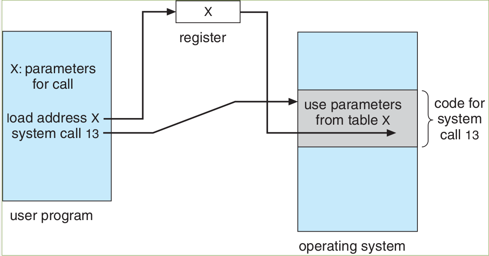

----

YIC 100 Memory Protection
==================================
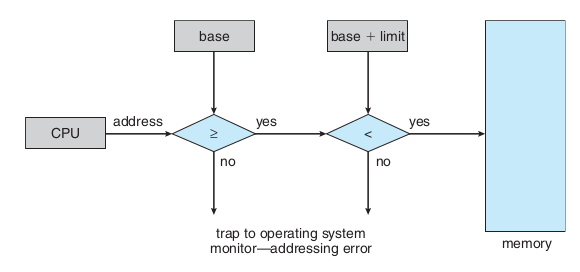

.. class:: substep

#. SKT like SKI and SKO
#. System Call ?
#. Change registers by the running process

----

CPU protection
====================
Timer interrupt
-------------------

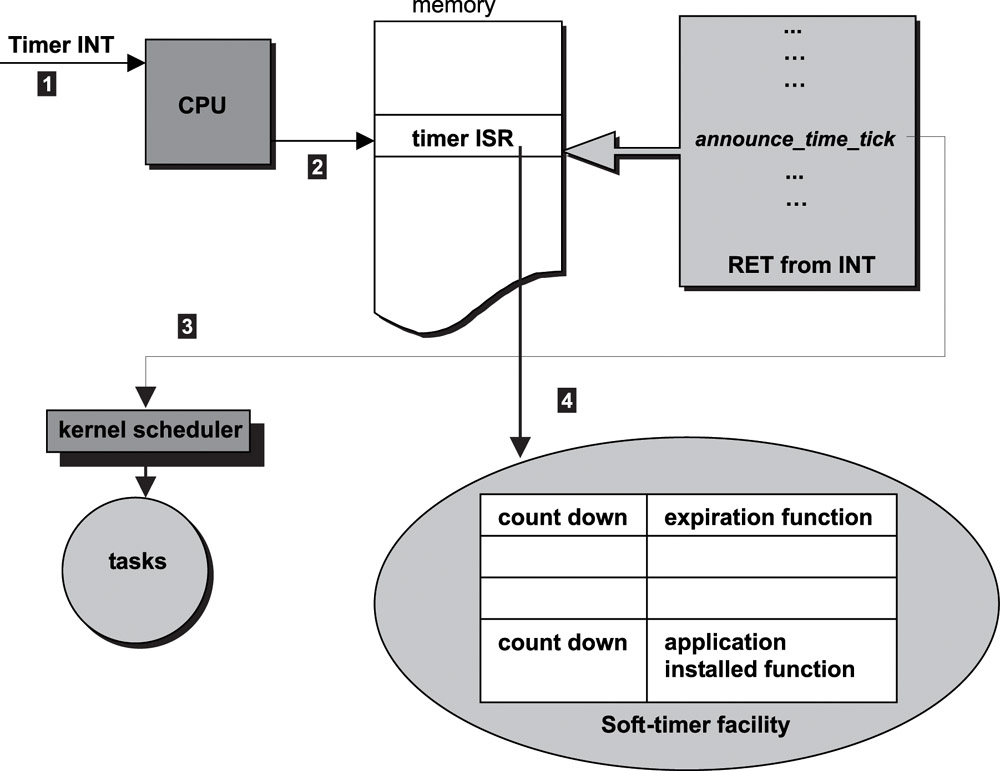

----

YIC 110 cpu protection
======================
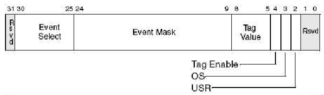

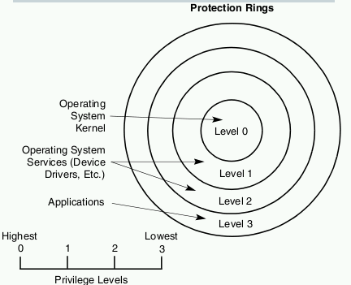

.. :

    #. ARM: Different processor modes (IRQ, SVC, User)
    #. Pentium 4 (ESCR)


----

Function call
-----------------------
* cons of BSA

    * No recursion
    * No explicit data transfer

.. :

    .. image::  img/in/call_stack_layout.png

----

Stack From end
===============
Call,  Ret

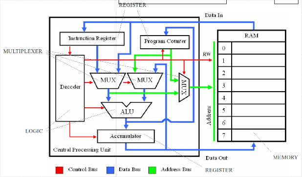

* `Assembly Slides <https://www.cs.princeton.edu/courses/archive/spr11/cos217/lectures/15AssemblyFunctions.pdf>`_

.. :

  https://www.google.com/search?q=character+pixel+font+design+old+computer+dos&oq=character+pixel+font+design+old+computer+dos&aqs=chrome..69i57.13056j0j7&sourceid=chrome&ie=UTF-8
  https://www.instructables.com/Simplest-AVR-Parallel-port-programmer/
  use call return assembly
  https://docs.oracle.com/cd/E19455-01/806-3773/6jct9o0ar/index.html
  https://www.ibm.com/docs/en/cics-ts/5.3?topic=instructions-call-return
  https://zhu45.org/posts/2017/Jul/30/understanding-how-function-call-works/
  old type machine
  https://www.istockphoto.com/photo/very-old-typing-machine-gm1147464007-309525631
  https://www.google.com/imgres?imgurl=https%3A%2F%2Fupload.wikimedia.org%2Fwikipedia%2Fcommons%2Fe%2Fe3%2FOld_type_machine_%2528small_store_at_M%25C3%25A9rida%2529.JPG&imgrefurl=https%3A%2F%2Fcommons.wikimedia.org%2Fwiki%2FFile%3AOld_type_machine_(small_store_at_M%25C3%25A9rida).JPG&tbnid=mrMcugIgUoHXqM&vet=12ahUKEwie26bdgI72AhUS4oUKHQpQCnYQMyg9egQIARBU..i&docid=AFF2jNcwkI8wYM&w=1944&h=2592&q=old%20type%20machine&ved=2ahUKEwie26bdgI72AhUS4oUKHQpQCnYQMyg9egQIARBU
  https://en.wikipedia.org/wiki/Parallel_port
  https://deepbluembedded.com/stm32-keypad-interfacing-library/
  https://www.google.com/url?sa=i&url=https%3A%2F%2Fforum.arduino.cc%2Ft%2Fread-data-from-parallel-port%2F105648&psig=AOvVaw2V2VoyYLu1-O-wNiBUtRXc&ust=1645436236611000&source=images&cd=vfe&ved=2ahUKEwjSv6vk_Y32AhVE3IUKHXn6DWcQ3YkBegQIABAL
  https://deepbluembedded.com/stm32-max7219-dot-matrix-display-interfacing-library/
  https://circuitdigest.com/sites/default/files/projectimage_mic/Thermal-Printer-interfacing-with-PIC16F877A.jpg
  https://www.digikey.in/en/product-highlight/a/analog-devices/adsw4000-eagleeye-people-count-algorithm-and-trial-kit?dclid=CKq0343-jfYCFUkfBgAdqmcKvw
  https://circuitdigest.com/microcontroller-projects/thermal-printer-interfacing-with-pic16f877a
  https://www.researchgate.net/figure/Circuit-Diagram-for-Serial-Port-to-Printer-Parallel-Port-Interface-using-AT89C2051_fig4_230799951
  old microcontroller connect to parallel port
  https://en.wikipedia.org/wiki/Call_stack

  function call stack
  https://youshaohua.com/post/simply-and-easily-understanding-function-call-stack-by-a-vision
  https://www.researchgate.net/figure/HWTI-Function-Call-Stack-Example_fig3_220844363
  https://www.google.com/url?sa=i&url=https%3A%2F%2Fmansfield-devine.com%2Fspeculatrix%2F2017%2F01%2Fgoodbye-old-friend-the-death-of-a-dot-matrix-printer%2F&psig=AOvVaw2IpOs10JxRbuobJUjjgYyE&ust=1645436117621000&source=images&cd=vfe&ved=2ahUKEwiK98yr_Y32AhUEwuAKHcgqCjgQ3YkBegQIABAL
  https://www.google.com/url?sa=i&url=https%3A%2F%2Fwww.electronics-lab.com%2Ftop-10-popular-microcontrollers-among-makers%2F&psig=AOvVaw2EXDnrr7QYg4MMA4wzxdcW&ust=1645436126602000&source=images&cd=vfe&ved=2ahUKEwiei_Gv_Y32AhXFQcAKHclhAKQQ3YkBegQIABAL
  http://www.google.com/url?sa=i&url=https%3A%2F%2Fwww.electronics-lab.com%2Ftop-10-popular-microcontrollers-among-makers%2F&psig=AOvVaw2EXDnrr7QYg4MMA4wzxdcW&ust=1645436126602000&source=images&cd=vfe&ved=2ahUKEwiei_Gv_Y32AhXFQcAKHclhAKQQ3YkBegQIABAL
  https://www.google.com/url?sa=i&url=https%3A%2F%2Fdeepbluembedded.com%2Fstm32-lcd-16x2-tutorial-library-alphanumeric-lcd-16x2-interfacing%2F&psig=AOvVaw0WO3faTRa5sedGIgDKGhNt&ust=1645436135855000&source=images&cd=vfe&ved=2ahUKEwip7aW0_Y32AhVjm1wKHfMUB4oQ3YkBegQIABAL

----

:class: t2c

Software Interrupt
======================
.. code:: asm
    :number-lines:

    ISR,    STA     SAVE
            BSA     IO
            LDA     SAVE
            ION
            BUN     0  I

    IO,     HEX     0
            SKI
            BUN     OUTPUT
            INP
            STA     BUFFER
            BUN     IO  I
    OUTPUT, SKO
            BUN     TRAP
            OUT
    TRAP,   SKT
            BUN     IO  I
            BUN     100

.. code:: asm
    :number-lines:

    mov ah, 0x0e

    ; function number = 0Eh
    ; : Display Character

    mov al, '!'

    ; AL = code of character
    ; to display

    int 0x10

    ; call INT 10h,
    ; BIOS video service

----

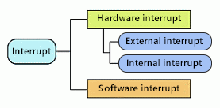

----

Adding PSW
===========
Flags:

* Carry
* E
* Mode

----

YIC 150 - Multiprogramming
===========================

----

Process along Printer Function
========================================
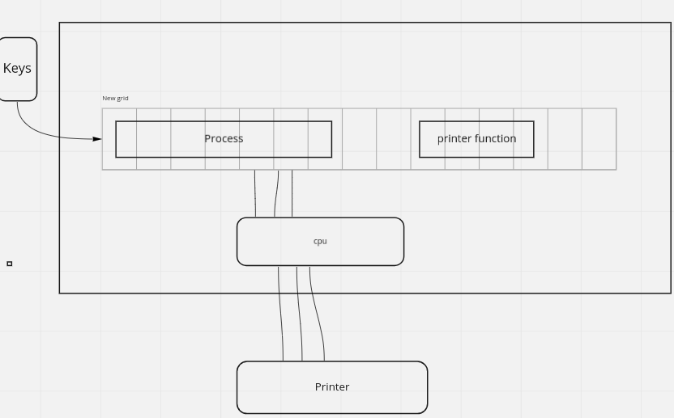

----

Jump to Printer Procedure
========================================
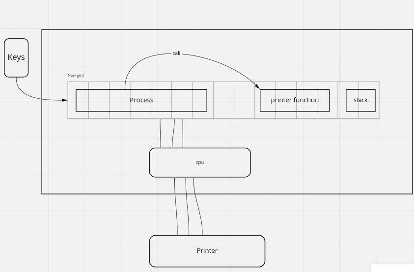

----

Return from Printer Procedure
========================================
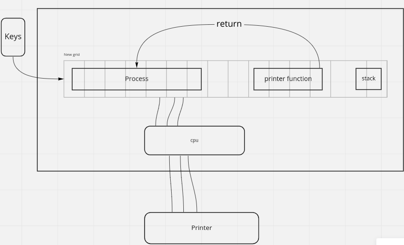

----

Display and Printer Procedure
===================================================
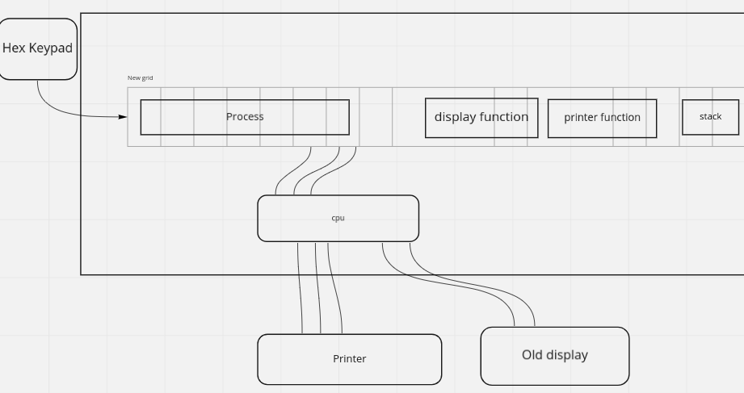

----

BIOS
==========
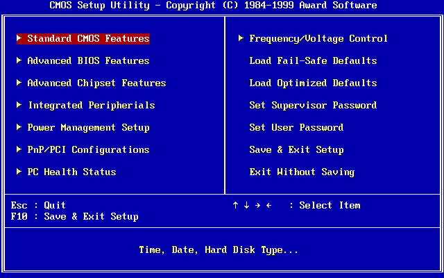

----

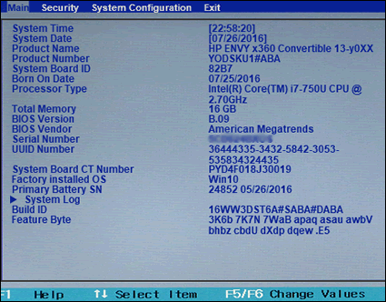

----

Boot sequence
==================
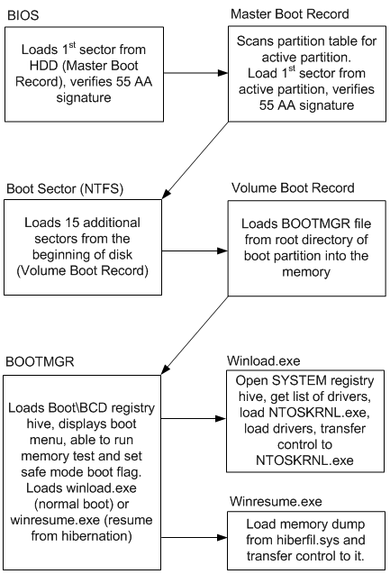

----

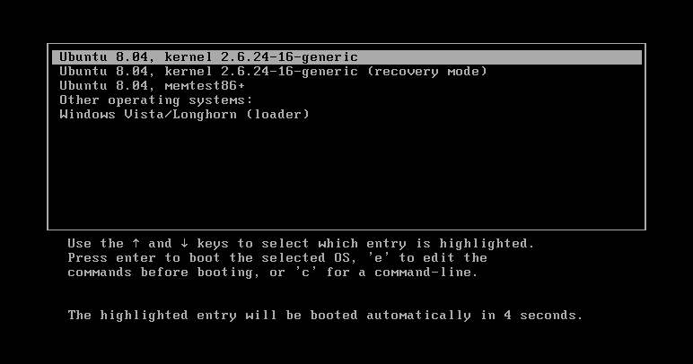

----

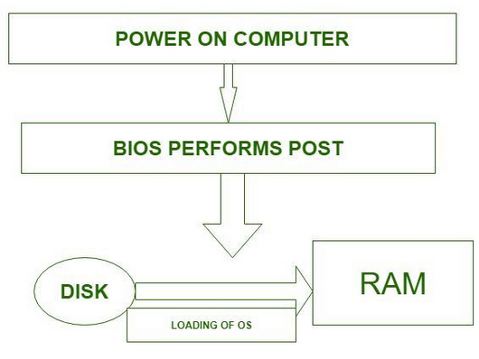

----

* `IEEE Std 1275 1994 Standard for boot initialization <https://archive.org/details/ieee_std_1275_1994_standard_for_boot_initialization_configur/page/n7/mode/2up>`_
* https://openfirmware.info/Welcome_to_OpenBIOS
* https://github.com/openbios
* https://github.com/openbios/openbios

----


System Call
=====================
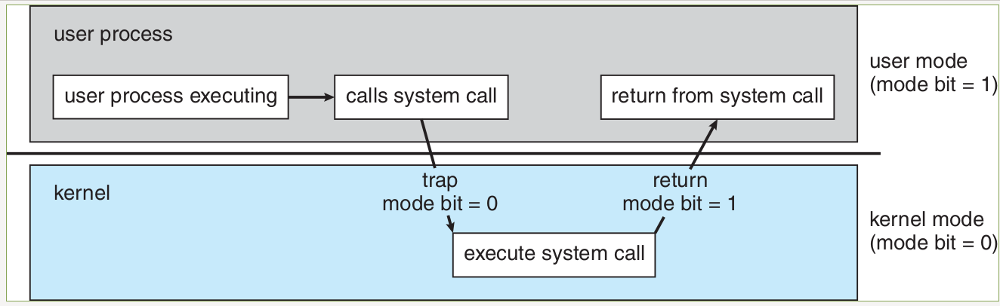

----

C System Call
=====================
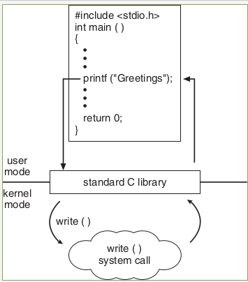

----

YIC120 - Adding Keyboard & Disk
==================================
* terminal (command prompt)
* batch system
* interactive system

----

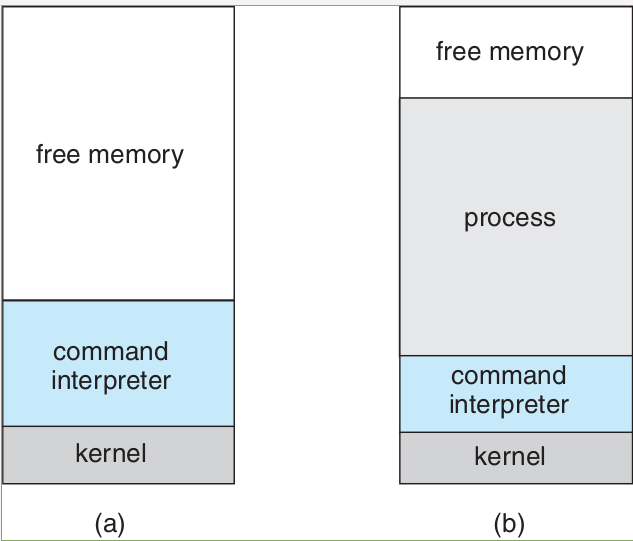

----

When a controller rapidly turns on LEDs in one row at a time
===============================================================
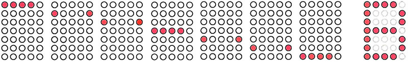

https://www.nutsvolts.com/magazine/article/create-an-led-sign-controller

.. :

  8x8 dot matrix display
  https://www.circuitstoday.com/interfacing-dot-matrix-led-display-to-8051
  https://pic-microcontroller.com/interfacing-dot-matrix-led-display-pic-microcontroller/
  https://www.best-microcontroller-projects.com/led-dot-matrix-display.html
  5x7 dot matrix LED display character patterns
  http://www.farnell.com/datasheets/37926.pdf
  http://elektro.fs.cvut.cz/dokument/LCD/LCD_Manual_ShortVersion.pdf
  https://www.deviceplus.com/arduino/display-characters-with-leds-how-to-use-a-matrix-led/
  https://www.jameco.com/Jameco/workshop/learning-center/electronic-fundamentals-working-with-led-dot-matrix-displays.html
  https://handsontec.com/index.php/modular-dot-matrix-display/
  dot matrix display character set

----

Context Switch
=================
END

.. :

    .. image:: img/in/windows_system_idle_process.jpg
      :align: center

    https://www.drivereasy.com/knowledge/system-idle-process-high-cpu-solved/

    rst2html.py disk.rst disk.html --stylesheet=../../tools/farsi.css,html4css1.css
    https://www.geeksforgeeks.org/disk-scheduling-algorithms/
    http://www.csl.mtu.edu/cs4411.choi/www/Resource/chap11.pdf
