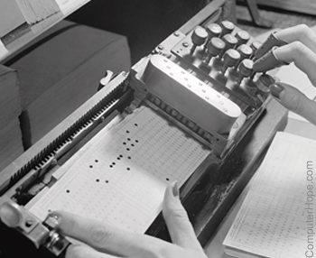

:data-transition-duration: 1000
:data-width: 1024
:data-height: 768
:skip-help: true
:css: ./style.css
:substep: true

.. title: Operating System (By Ahmad Yoosofan)

:slide-numbers: true

.. role:: raw-html(raw)
   :format: html

.. |nbsp| unicode:: 0xA0

.. role:: rtl
    :class: rtl

.. note::

    The assembly code examples in this section were developed with assistance
    from DeepSeek AI to demonstrate Morris Mano computer architecture concepts.

----

Operating Systems
======================
Ahmad Yoosofan

University of Kashan

https://yoosofan.github.io/en/

Yoosofan Imaginary Computer
---------------------------

Based on Morris Mano's famous book
----------------------------------

----

.. image::  img/in/simple_cpu_hex_keypad02.png

----

:class: t2c

Instruction Set(I)
==================
.. code:: asm

    AND: Logical AND memory with AC
    ADD: Arithmetic ADD memory with AC
    LDA: Load from memory to AC
    STA: Store AC to memory
    BUN: Branch unconditional
    ISZ: Increment and skip if zero
    CLA: Clear AC
    CLE: Clear E
    CMA: Complement AC
    CME: Complement E
    CIR: Circulate right (AC and E)
    CIL: Circulate left (AC and E)

.. code:: asm

    INC:    Increment AC
    SPA:    Skip if positive AC
    SNA:    Skip if negative AC
    SZA:    Skip if zero AC
    SZE:    Skip if zero E
    HLT:    Halt
    OUT:    Output a character from AC
    SKO:    Skip if output flag
    NOP:    No operation

----

:class: t2c

Instruction Set Bianary(I)
================================
.. code:: asm

    AND:    00001
    ADD:    00010
    LDA:    00011
    STA:    00100
    BUN:    00101
    ISZ:    00110
    CLA:    00111
    CLE:    01000
    CMA:    01001
    CME:    01010
    CIR:    01011
    CIL:    01100

.. code:: asm

    INC:    01101
    SPA:    01110
    SNA:    01111
    SZA:    10000
    SZE:    10001
    HLT:    10010
    OUT:    10011
    SKO:    10100
    NOP:    10101

----

hex pad connect to microcontroller
==============================================
https://www.circuitstoday.com/interfacing-hex-keypad-to-8051

https://circuitdigest.com/microcontroller-projects/keypad-interfacing-with-avr-atmega32

----

Example
============
* https://github.com/yoosofan/mano-computer-simulator-js
* https://yoosofan.github.io/mano-computer-simulator-js/
* https://github.com/Naheel-Azawy/Simple-Computer-Simulator/blob/master/test/test-symbolic
* https://github.com/Naheel-Azawy/Simple-Computer-Simulator/blob/master/test/test
* https://github.com/Naheel-Azawy/Simple-Computer-Simulator/tree/master/test

----

Other assembly
==================
* http://imrannazar.com/arm-opcode-map
* https://iitd-plos.github.io/col718/ref/arm-instructionset.pdf
* https://wiki.osdev.org/X86-64_Instruction_Encoding
* https://cs.brown.edu/courses/cs033/docs/guides/x64_cheatsheet.pdf
* https://sites.google.com/site/nttrungmtwiki/home/rce/assembly-language/x64-opcode-and-instruction-reference-home
* http://ref.x86asm.net/coder64.html
* arm 32 opcodes

* http://z80-heaven.wikidot.com/instructions-set:ld
* http://z80-heaven.wikidot.com/opcode-reference-chart
* https://smallcomputercentral.files.wordpress.com/2017/12/asm80-com-tutorial-e1-0-01.pdf
* https://stackoverflow.com/questions/22838444/convert-an-8bit-number-to-hex-in-z80-assembler
* https://www.vcfed.org/forum/forum/technical-support/vintage-computer-programming/76419-z80-hello-world-example-in-hex
* https://www.cemetech.net/forum/viewtopic.php?t=15710&start=0
* z80 assembly codes

----

----

.. :

    img/in/Mano_Basic_computer_instructions_opcodes.png
    img/in/Mano_flowchart4instruction_cycle_1.png

----

.. code:: asm

  00101 00000  1010
  00110 00000  1100
  00111 00000  1110
  01000

  00000

.. class:: rtl

اگر حداکثر ۳۲ دستور داشته باشیم پس پنج بیت برای دستورها نیاز داریم
برای سادگی فرض می‌کنیم که طول همهٔ دستورها یکسان است
یعنی هم دو بایت را می‌گیرند
فرض کنید  دستورها پنج بیت نیاز دارند پس ۱۱ بیت برای
آدرس

حداکثر حافظهٔ این کامپیوتر چقدر می‌تواند باشد.
اگر بخواهیم بایتی آدرس دهی کنیم

۲^۱۱ = ۲kB

B = Byte

اگر آدرس‌دهی را دو بایتی در نظر بگیریم

۴kB (word = 2 byte)

----

Output
==============
LED

seven segment
-----------------
* https://www.rapidtables.com/convert/number/hex-to-binary.html
* convert hex to binary
* https://clrhome.org/asm/

----

:class: t2c

Output Problem
===============
.. code:: asm

  lda a
  add b
  sta c
  out
  hlt
  a, 5
  b, 2
  c, 0

.. code:: asm
    :class: substep

    ..........
    ..........

    LB1: out
        sko
        bun LB1

    ...........
    ...........

----

:class: t2c

Simple LED
==========================
.. image::  img/in/led_circut.png
  :height: 300px

.. image::  img/in/arduino7segment.png
  :height: 300px

`circuitbasics <https://www.circuitbasics.com/arduino-7-segment-display-tutorial/>`_

----

:class: t2c

Seven segment display
==========================

.. image::  img/in/7segment01.png
  :height: 300px

.. image::  img/in/7segment02.png
  :height: 300px

`circuitbasics <https://www.circuitbasics.com/arduino-7-segment-display-tutorial/>`_
`askingthelot <https://askingthelot.com/how-do-i-connect-7-segment-display/>`_

`youtu.be <https://youtu.be/XCJqoae4hgY>`_
`element14 <https://community.element14.com/challenges-projects/element14-presents/thelearningcircuit/w/documents/4523/the-learning-circuit-53---how-to-drive-a-7-segment-display?CMP=SOM-YOUTUBE-PRG-E14PRESENTS-LCIRCUIT-53-COMM-7-SEGMENT-DISPLAY>`_

----

Imaginary Computer
==================
* Consider it as real a computer
* Think about business plan
* Consider customers' need
* Consider other companies

----

YIC 30
======
Seven segment
--------------
.. image::  img/in/arduino7segment02.png
  :height: 300px

`circuitbasics <https://www.circuitbasics.com/arduino-7-segment-display-tutorial/>`_

----

Issues of YIC 30
================
.. class:: substep

* Convert binary number to 7 segment code
* Old codes only LED
* LED & seven segment
* Changing CPU
* Cost of changes
* Just one 7 segment ?
* for every output, seven segment code should be added

----

Hardware insead of Software
===============================
.. image:: img/in/BCDto7segment.png
  :width: 800px

.. :

  جزوهٔ درس معماری کامپیوتر دکتر مختار معصومی
  https://www.electronics-tutorials.ws/blog/7-segment-display-tutorial.html
  https://www.geeksforgeeks.org/bcd-to-7-segment-decoder/

----

:class: t2c

4 Digit 7-Segment Displays
===========================
.. image::  img/in/4digits7segment01.png
  :height: 250px

.. image::  img/in/4digits7segment02.png
  :height: 250px

`circuitbasics <https://www.circuitbasics.com/arduino-7-segment-display-tutorial/>`_

----

Connecting 4 Digit 7-Segment Displays
============================================
.. image::  img/in/4digits7segment2arduino.png
  :height: 400px

----

:class: t2c

Arduino Print 4 to 7-segment
===============================
.. code:: cpp

  #include "SevSeg.h"
  SevSeg sevseg;

  void setup(){
    byte numDigits = 1;
    byte digitPins[] = {};
    byte segmentPins[] =
      {6, 5, 2, 3, 4, 7, 8, 9};
    bool resistorsOnSegments = true;

    byte hardwareConfig = COMMON_CATHODE;
    sevseg.begin(hardwareConfig,
      numDigits, digitPins, segmentPins,
      resistorsOnSegments
    );
    sevseg.setBrightness(90);
  }

  void loop(){
    sevseg.setNumber(4);
    sevseg.refreshDisplay();
  }

..  csv-table::
  :header-rows: 1
  :class: smallerelementwithfullborder

  Segment Pin, Arduino Pin
  A, 6
  B, 5
  C, 2
  D, 3
  E, 4
  F, 7
  G, 8
  DP, 9

`circuitbasics <https://www.circuitbasics.com/arduino-7-segment-display-tutorial/>`_

.. :

    ----

    Processor Series
    ======================
    * AMD (https://developer.amd.com/resources/developer-guides-manuals/)
    * Intel (https://www.intel.com/content/dam/www/public/us/en/documents/manuals/64-ia-32-architectures-software-developer-instruction-set-reference-manual-325383.pdf)

----

:class: t2c

YIC 40 - BSA
=============
.. class:: substep

#. LED output code
#. 7 segment code
#. Printer
#. output selector
#. Adding porecedures
#. Device Drivers
#. Adding more devices
#. No error checking
#. Send data
#. API (protocol)

.. image::  img/in/thermal_printer_interfacing_with_PIC16F877A.jpg
    :width: 600px

----

Printer Function
========================================
.. image:: img/in/printer_function.png

----

Process along Printer Function
========================================
.. image:: img/in/process_along_printer_function.png

----

Jump to Printer Procedure
========================================
.. image:: img/in/call_printer_function.png

----

Return from Printer Procedure
========================================
.. image:: img/in/return_from_printer_funtion_with_stack.png

----

Display and Printer Procedure
===================================================
.. image:: img/in/printer_old_display_function.png

----

Adding procedurs to memory
==========================
.. csv-table::
    :class: yoo-memory center

    User Process (P) , |nbsp| |nbsp| |nbsp| |nbsp| |nbsp| |nbsp| |nbsp| |nbsp|,
    0 ,                              800,                       2048

.. csv-table::
    :class: yoo-memory center

    |nbsp| |nbsp| P |nbsp| |nbsp| , |nbsp| |nbsp| |nbsp| |nbsp| , LED Procedure
    0 ,                              648,                    1024, 2048

.. csv-table::
    :class: yoo-memory center

    |nbsp| |nbsp| P |nbsp| |nbsp| , |nbsp| |nbsp| |nbsp| , LED,  7 segment,
    0 ,                              456,            1024, 1048, 1096,    2048

.. csv-table::
    :class: yoo-memory center

    |nbsp| |nbsp| P |nbsp| |nbsp| , |nbsp| |nbsp| |nbsp| |nbsp|  |nbsp| |nbsp| , LED, 7 , printer, |nbsp| |nbsp|  |nbsp| |nbsp|
    0 ,  456,           1024,                        1048 ,     1096,  1256,   2048

Users (programmers) should know where these precedures are

----

YIC50 - Array of Addresses
==========================
.. csv-table::
    :class: yoo-memory center

    P, |nbsp| |nbsp| |nbsp| |nbsp|  |nbsp| |nbsp|, array , LED, 7 , printer, |nbsp| |nbsp|  |nbsp| |nbsp|
    0,  456,           1000, 1024                       , 1048 ,     1096,  1256,   2048

Array

.. csv-table::
    :class: yoo-memory center

    1024, 1048, 1096 , 1256,
    0,  1, 2, 3, 4,

----

:class: t2c

YIC60 - Input Devices
=====================
* Card Reader
* Necessary Loops
* Check Errors
* Polling Method

* Hollerith and IBM keypunches, 1890
* IBM 011 Electric Key Punch(1923)
* IBM Type 032 Printing Punch(1935)
* A Key Punch Room in the 1960s

.. image:: img/in/pile_of_punch_cards_next2woman.png
  :height: 500px

----

:class: n2c

.. code:: asm

           ORG 0
    START, BSA READ1
           STA BYTE1
           LDA BYTE1
           BSZ OUTCH
           HLT

    READ1, HEX 0
    RDCNT, SKI
           BUN RDCNT
           INP
           BUN (READ1)

    OUTCH, HEX 0
           OUT
           BUN (OUTCH)

    BYTE1, DEC     0
           END

.. :

    The code is generated by DeepSeek before editing

    .. image:: img/in/315px-Punched_card_program_deck.agr.jpg

    ----

    Other Links for Punch Card Machines
    ====================================
    * https://en.wikipedia.org/wiki/Computer_programming_in_the_punched_card_era
    * old computer operator changing cards
    * https://www.computerhope.com/jargon/p/punccard.htm
    * https://en.wikipedia.org/wiki/IBM_System/3
    * https://en.wikipedia.org/wiki/Tabulating_machine
        *  1890 U.S. Census

    ----

    Card reader
    ===============
    https://www.pinterest.com/pin/326299935478491352/

    old ibm card punch reader

----

:class: t2c

Simple Input Output Code - YIC60
================================
.. include:: src/in/simple_in_out.asm
    :code: c
    :number-lines:
    :start-line: 3
    :end-line: 18

.. include:: src/in/simple_in_out.asm
    :code: cpp
    :number-lines: 15
    :start-line: 18
    :end-line: 47

----

YIC60 - Array of Addresses
==========================
.. csv-table::
    :class: yoo-memory center

    P, |nbsp| |nbsp| |nbsp| |nbsp|  |nbsp| |nbsp|, array , LED, 7 , printer, |nbsp| |nbsp|  |nbsp| |nbsp|
    0,  456,           1000, 1024                       , 1048 ,     1096,  1256,   2048

Array

.. csv-table::
    :class: yoo-memory center

    1024, 1048, 1096 , 1256,
    0,  1, 2, 3, 4,

----

:class: t2c

YIC60 code with array(I)
================================
.. include:: src/in/simple_in_out_array.asm
    :code:  asm
    :number-lines:
    :start-line: 6
    :end-line: 29

.. include:: src/in/simple_in_out_array.asm
    :code: asm
    :number-lines: 19
    :start-line: 29
    :end-line: 48

----

:class: t2c

YIC60 code with array(II)
================================
.. include:: src/in/simple_in_out_array.asm
    :code: asm
    :number-lines:
    :start-line: 42
    :end-line: 60

.. include:: src/in/simple_in_out_array.asm
    :code: asm
    :number-lines: 21
    :start-line: 60
    :end-line: 84

----

:class: t2c

YIC70 - Adding Loader
=====================
.. csv-table::
    :class: yoo-memory center

    Loader, P, |nbsp| |nbsp| |nbsp| |nbsp|  |nbsp| |nbsp|, array , LED, 7 , printer, |nbsp| |nbsp|  |nbsp| |nbsp|
    0, 100,  556,           1000, 1024                       , 1048 ,     1096,  1256,   2048

Array

.. csv-table::
    :class: yoo-memory center

    1024, 1048, 1096 , 1256,
    0,  1, 2, 3, 4,

-----

:class: n2c

.. include:: src/in/loader1.asm
    :code: asm
    :number-lines:
    :start-line: 5
    :end-line: 27

.. include:: src/in/loader1.asm
    :code: asm
    :number-lines: 21
    :start-line: 27
    :end-line: 44

-----

:class: n2c

.. include:: src/in/loader1.asm
    :code: asm
    :number-lines:
    :start-line: 43
    :end-line: 64

.. include:: src/in/loader1.asm
    :code: asm
    :number-lines: 21
    :start-line: 64
    :end-line: 84

----

YIC75 Relative Address
======================
.. image:: img/memory/relocation_register_mmu.png
   :align: center

.. :

    src/in/loader4_base_register_comments.asm

    Loaded Program (What gets loaded):

    // This program gets loaded and thinks it starts at address 0
    // All addresses are logical - will be translated by base register

            ORG     0

    MAIN,   // Call input procedure via PVT
            LDA     PVT_INPUT_ADDR  // Logical address 152
            STA     CALL_PTR
            BSA     CALL_PTR I      // Indirect call to input

            STA     NUM1

            // Call output procedure via PVT
            LDA     PVT_OUTPUT_ADDR // Logical address 153
            STA     CALL_PTR
            BSA     CALL_PTR I      // Indirect call to output

            HLT

    // Procedure Vector Table at logical address 150
            ORG     150
    PVT_INPUT,  HEX     200    // Logical address of INPUT
    PVT_OUTPUT, HEX     220    // Logical address of OUTPUT

    // Pointers to PVT entries
    PVT_INPUT_ADDR,  HEX     150    // Address of PVT_INPUT
    PVT_OUTPUT_ADDR, HEX     151    // Address of PVT_OUTPUT

    // Input Procedure at logical address 200
            ORG     200
    INPUT,  HEX     0
            // Input code here
            BSA     READ_CHAR       // Call helper
            BUN     INPUT I

    READ_CHAR, HEX  0
            // Character input code
            BUN     READ_CHAR I

    // Output Procedure at logical address 220
            ORG     220
    OUTPUT, HEX     0
            // Output code here
            BSA     WRITE_CHAR      // Call helper
            BUN     OUTPUT I

    WRITE_CHAR, HEX 0
            // Character output code
            BUN     WRITE_CHAR I

    // Data Section for loaded program
            ORG     300    // Logical address 300
    NUM1,   DEC     0
    CALL_PTR, HEX   0

            END

    Address Translation Example:

    If base register = 256:

        Logical 0 → Physical 256

        Logical 150 (PVT) → Physical 406

        Logical 200 (INPUT) → Physical 456

        Logical 220 (OUTPUT) → Physical 476

----

address binding, absolute and relocate loader

.. image:: img/memory/memory_absolute_relocate_loader.png
   :align: center
   :scale: 90%

----

YIC80 - Interrupt
=================
.. :

  .. image:: img/in/interrupt_chart.jpg

.. image:: img/in/Flowchart_for_interrupt_cycle.png
   :align: center
   :height: 600px
   :width: 700px

----

:class: t2c

Interrupt-Driven Program
===========================
.. include:: src/in/Interrupt_Driven_Program_with_BSA_Subroutines.asm
    :code: asm
    :number-lines:
    :start-line: 4
    :end-line: 22

.. include:: src/in/Interrupt_Driven_Program_with_BSA_Subroutines.asm
    :code: asm
    :number-lines: 18
    :start-line: 22
    :end-line: 47

----

Loader with interrupt (bootstrap)
=================================
.. code:: sh

    # Advanced: Buffered Input with BSA Subroutines
    src/in/Interrupt_Driven_Program_with_BSA_Subroutines_Advanced_with_buffer.asm
    src/in/Interrupt_Driven_Program_with_BSA_Subroutines_Advanced_with_buffer_comments.asm

    # Enhanced bootstrap loader with error checking
    src/in/Bootstrap_Loader_Program_More_Robust_Version_with_Error_Checking.asm

    # Relocating Bootstrap Loader with Base Register
    src/in/loader4_base_register_comments.asm

    # Simple Bootstrap Loader with Absolute Addressing
    src/in/loader7_interrupt_Simple_Bootstrap_Loader_with_Absolute_Addressing.asm
    src/in/loader7_interrupt_Simple_Bootstrap_Loader_with_Absolute_Addressing_comments.asm

    src/in/loader7_user_program_comments.asm
    src/in/loader7_user_program.asm

    # Uses interrupt-driven I/O instead of polling
    src/in/loader10_interrupt.asm
    src/in/loader10_interrupt_comments.asm

    # Interrupt-driven program that gets loaded
    src/in/loader10_loaded_program.asm
    src/in/loader10_loaded_program_comments.asm

----

:class: grid-3col

.. include:: src/in/loader7.asm
    :code: asm
    :number-lines:
    :start-line: 4
    :end-line: 34

.. include:: src/in/loader7.asm
    :code: asm
    :number-lines: 30
    :start-line: 34
    :end-line: 64

.. include:: src/in/loader7.asm
    :code: asm
    :number-lines: 60
    :start-line: 64
    :end-line: 95

----

Interrupt and Relative Address Problem
======================================
* Normal execution

.. :

    * Effective address = base + logical address

* Interrupt time

.. :

    * PC contains physical address

* ISR needs

    #. predictable, fixed addresses
    #. resources across all processes
    #. Safety

.. :

    : User programs shouldn't be able to interfere with ISR

    * To run at specific logical addresses but with proper relocation

Solution Dual Address Spaces
----------------------------
#. User mode   (MOD 1)
#. Kernel mode (MOD 0)

.. :

    User mode: Base register active

    Kernel mode Base register = 0 (direct physical addressing)

    Interrupt handling must temporarily bypass relocation because:

    In Modern Systems
    -----------------
    #. x86: Uses privilege levels (ring 0 vs ring 3)
    #. ARM: Different processor modes (IRQ, SVC, User)
    #. All: Have mechanisms to switch address spaces during interrupts

    Dual-Mode System with Manual Mode Switching
    mod 0 = Kernel Mode, mod 1 = User Mode

----

YIC90 - Memory and CPU Protection
==================================
.. image:: img/memory/hardware_address_protection.png
   :align: center

.. class:: substep

#. SKT like SKI and SKO
#. System Call ?
#. Change registers by the running process

----

:class: t2c

Software Interrupt
======================
.. code:: asm

    ISR,    STA     SAVE
            BSA     IO
            ION
            LDA     SAVE
            BUN     0  I

    IO,     HEX     0
            SKI
            BUN     OUTPUT
            INP
            STA     BUFFER
            BUN     IO  I
    OUTPUT, SKO
            BUN     TRAP
            OUT
    TRAP,   SKT
            BUN     IO  I
            BUN     100

.. code:: asm

    mov ah, 0x0e
    ; function number = 0Eh
    ; : Display Character
    mov al, '!'
    ; AL = code of character
    ; to display
    int 0x10
    ; call INT 10h,
    ; BIOS video service

----

.. image:: img/in/interrupt_types.png
   :align: center
   :height: 400px
   :width: 500px

----

System Call
=====================
.. image:: img/in/system_call.png
   :align: center
   :height: 350px
   :width: 800px

----

C System Call
=====================
.. image:: img/in/system_call_c.png
   :align: center

----

Simple Parameters
=========================
.. image:: img/in/systemcallpaprameter.png
   :align: center
   :height: 350px
   :width: 800px

----

* kernel mode
* user mode

Pentium 4 (ESCR)

.. image:: img/in/control_register.png
   :align: center

----

.. image:: img/in/protection_ring.png
   :align: center

----

CPU protection
====================
Timer interrupt
-------------------
Cpu Scheduler

.. image:: img/memory/timer_interrupt.jpg
    :align: center
    :width: 700px
    :height: 500px

----

YIC110 - Multiprogramming
=========================
Function call
-----------------------
* cons of BSA

    * No recursion
    * No explicit data transfer

.. :

    .. image::  img/in/call_stack_layout.png

----

Stack From end
===============
Call,  Ret

.. image::  img/in/simple_cpu02.png

* `Assembly Slides <https://www.cs.princeton.edu/courses/archive/spr11/cos217/lectures/15AssemblyFunctions.pdf>`_

.. :

  https://www.google.com/search?q=character+pixel+font+design+old+computer+dos&oq=character+pixel+font+design+old+computer+dos&aqs=chrome..69i57.13056j0j7&sourceid=chrome&ie=UTF-8
  https://www.instructables.com/Simplest-AVR-Parallel-port-programmer/
  use call return assembly
  https://docs.oracle.com/cd/E19455-01/806-3773/6jct9o0ar/index.html
  https://www.ibm.com/docs/en/cics-ts/5.3?topic=instructions-call-return
  https://zhu45.org/posts/2017/Jul/30/understanding-how-function-call-works/
  old type machine
  https://www.istockphoto.com/photo/very-old-typing-machine-gm1147464007-309525631
  https://www.google.com/imgres?imgurl=https%3A%2F%2Fupload.wikimedia.org%2Fwikipedia%2Fcommons%2Fe%2Fe3%2FOld_type_machine_%2528small_store_at_M%25C3%25A9rida%2529.JPG&imgrefurl=https%3A%2F%2Fcommons.wikimedia.org%2Fwiki%2FFile%3AOld_type_machine_(small_store_at_M%25C3%25A9rida).JPG&tbnid=mrMcugIgUoHXqM&vet=12ahUKEwie26bdgI72AhUS4oUKHQpQCnYQMyg9egQIARBU..i&docid=AFF2jNcwkI8wYM&w=1944&h=2592&q=old%20type%20machine&ved=2ahUKEwie26bdgI72AhUS4oUKHQpQCnYQMyg9egQIARBU
  https://en.wikipedia.org/wiki/Parallel_port
  https://deepbluembedded.com/stm32-keypad-interfacing-library/
  https://www.google.com/url?sa=i&url=https%3A%2F%2Fforum.arduino.cc%2Ft%2Fread-data-from-parallel-port%2F105648&psig=AOvVaw2V2VoyYLu1-O-wNiBUtRXc&ust=1645436236611000&source=images&cd=vfe&ved=2ahUKEwjSv6vk_Y32AhVE3IUKHXn6DWcQ3YkBegQIABAL
  https://deepbluembedded.com/stm32-max7219-dot-matrix-display-interfacing-library/
  https://circuitdigest.com/sites/default/files/projectimage_mic/Thermal-Printer-interfacing-with-PIC16F877A.jpg
  https://www.digikey.in/en/product-highlight/a/analog-devices/adsw4000-eagleeye-people-count-algorithm-and-trial-kit?dclid=CKq0343-jfYCFUkfBgAdqmcKvw
  https://circuitdigest.com/microcontroller-projects/thermal-printer-interfacing-with-pic16f877a
  https://www.researchgate.net/figure/Circuit-Diagram-for-Serial-Port-to-Printer-Parallel-Port-Interface-using-AT89C2051_fig4_230799951
  old microcontroller connect to parallel port
  https://en.wikipedia.org/wiki/Call_stack

  function call stack
  https://youshaohua.com/post/simply-and-easily-understanding-function-call-stack-by-a-vision
  https://www.researchgate.net/figure/HWTI-Function-Call-Stack-Example_fig3_220844363
  https://www.google.com/url?sa=i&url=https%3A%2F%2Fmansfield-devine.com%2Fspeculatrix%2F2017%2F01%2Fgoodbye-old-friend-the-death-of-a-dot-matrix-printer%2F&psig=AOvVaw2IpOs10JxRbuobJUjjgYyE&ust=1645436117621000&source=images&cd=vfe&ved=2ahUKEwiK98yr_Y32AhUEwuAKHcgqCjgQ3YkBegQIABAL
  https://www.google.com/url?sa=i&url=https%3A%2F%2Fwww.electronics-lab.com%2Ftop-10-popular-microcontrollers-among-makers%2F&psig=AOvVaw2EXDnrr7QYg4MMA4wzxdcW&ust=1645436126602000&source=images&cd=vfe&ved=2ahUKEwiei_Gv_Y32AhXFQcAKHclhAKQQ3YkBegQIABAL
  http://www.google.com/url?sa=i&url=https%3A%2F%2Fwww.electronics-lab.com%2Ftop-10-popular-microcontrollers-among-makers%2F&psig=AOvVaw2EXDnrr7QYg4MMA4wzxdcW&ust=1645436126602000&source=images&cd=vfe&ved=2ahUKEwiei_Gv_Y32AhXFQcAKHclhAKQQ3YkBegQIABAL
  https://www.google.com/url?sa=i&url=https%3A%2F%2Fdeepbluembedded.com%2Fstm32-lcd-16x2-tutorial-library-alphanumeric-lcd-16x2-interfacing%2F&psig=AOvVaw0WO3faTRa5sedGIgDKGhNt&ust=1645436135855000&source=images&cd=vfe&ved=2ahUKEwip7aW0_Y32AhVjm1wKHfMUB4oQ3YkBegQIABAL

----

YIC120 - Adding Keyboard & Disk
==================================
* terminal (command prompt)
* batch system
* interactive system

----

.. image:: img/in/kernel1process.png
   :align: center

----

When a controller rapidly turns on LEDs in one row at a time
===============================================================
.. image:: img/in/5x7led_B_refresh.jpg
  :width: 750px

https://www.nutsvolts.com/magazine/article/create-an-led-sign-controller

.. :

  8x8 dot matrix display
  https://www.circuitstoday.com/interfacing-dot-matrix-led-display-to-8051
  https://pic-microcontroller.com/interfacing-dot-matrix-led-display-pic-microcontroller/
  https://www.best-microcontroller-projects.com/led-dot-matrix-display.html
  5x7 dot matrix LED display character patterns
  http://www.farnell.com/datasheets/37926.pdf
  http://elektro.fs.cvut.cz/dokument/LCD/LCD_Manual_ShortVersion.pdf
  https://www.deviceplus.com/arduino/display-characters-with-leds-how-to-use-a-matrix-led/
  https://www.jameco.com/Jameco/workshop/learning-center/electronic-fundamentals-working-with-led-dot-matrix-displays.html
  https://handsontec.com/index.php/modular-dot-matrix-display/
  dot matrix display character set

----

BIOS
==========
.. image:: img/in/Award_BIOS_setup_utility.png
   :align: center

----

.. image:: img/in/bios.gif
   :align: center

----

Boot sequence
==================
.. image:: img/in/boot_sequence.png
   :align: center
   :height: 450px

----

.. image:: img/in/GRUB_with_ubuntu_and_windows_vista.png
   :align: center

----

.. image:: img/in/simple_poweron_computer.png
   :align: center

----

* `IEEE Std 1275 1994 Standard for boot initialization <https://archive.org/details/ieee_std_1275_1994_standard_for_boot_initialization_configur/page/n7/mode/2up>`_
* https://openfirmware.info/Welcome_to_OpenBIOS
* https://github.com/openbios
* https://github.com/openbios/openbios

Context Switch
=================

----

END

.. :

  .. image:: img/in/windows_system_idle_process.jpg
      :align: center

.. :

    https://www.drivereasy.com/knowledge/system-idle-process-high-cpu-solved/

----

.. comments:

    hovercraft in.rst
    hovercraft disk.slide.rst disk.slide/
    rst2html.py disk.rst disk.html --stylesheet=../../tools/farsi.css,html4css1.css
    https://www.geeksforgeeks.org/disk-scheduling-algorithms/
    http://www.csl.mtu.edu/cs4411.choi/www/Resource/chap11.pdf
