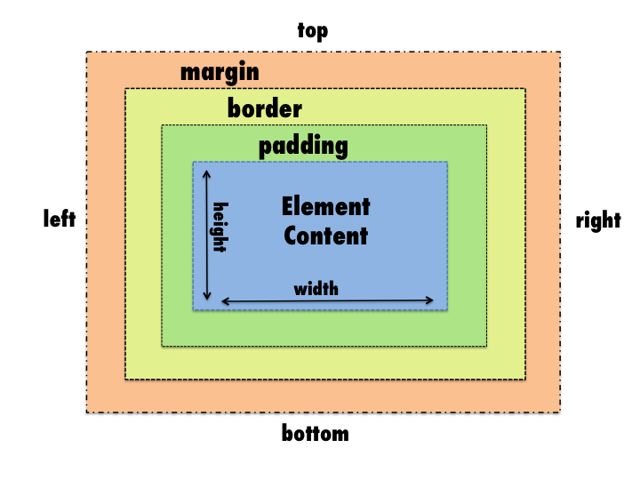
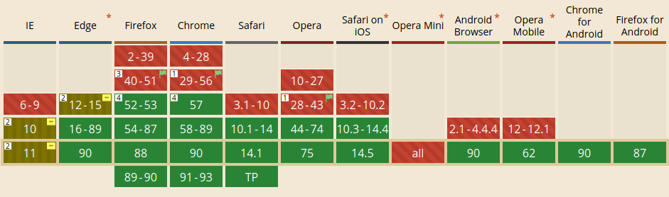

:data-transition-duration: 1000
:skip-help: true
:css: assets/hovercraft.css assets/css.css
:substep: true

.. title: HTML (By Ahmad Yoosofan)

:slide-numbers: true

.. role:: ltr
    :class: ltr

.. role:: rtl
    :class: rtl

Cascade Style Sheet (CSS)
==========================
Ahmad Yoosofan

http://yoosofan.github.io/

Search "Ahmad Yoosofan"

----

Inline Style
===============
.. code:: html

    

----

:class: simple-html01-class

.. include:: src/css/css210.html
    :code: html
    :number-lines:

.. raw:: html

   <iframe src="http://127.0.0.1:8002/src/css/css210.html" title="description" class="output-of-html">
   </iframe>

----

learn css
=============
* https://developer.mozilla.org/en-US/docs/Learn/Getting_started_with_the_web/CSS_basics
* https://developer.mozilla.org/en-US/docs/Web/CSS
* https://web.dev/learn/css/box-model/
* https://www.w3schools.com/css/
* https://developer.mozilla.org/en-US/docs/Learn/CSS
* https://www.smashingmagazine.com/2019/01/how-to-learn-css/
* https://learnlayout.com/no-layout.html

internal vs external css
----------------------------
* https://www.bitdegree.org/learn/style-html#:~:text=The%20internal%20CSS%20is%20for,to%20link%20HTML%20to%20CSS.
* https://www.hostpapa.com/knowledgebase/understanding-inline-internal-external-css-styles/
* https://www.hostinger.vn/huong-dan/khac-biet-giua-inline-external-va-internal-style-css/
* https://stackoverflow.com/questions/553074/internal-vs-external-css

----

Internal Style
==================
.. code:: html

    <head>
    
    </head>

----

:class: t2c

Simple Tag Selector
=========================
.. include:: src/css/css220.html
    :code: html
    :number-lines:

.. raw:: html

   <iframe src="http://127.0.0.1:8002/src/css/css220.html" title="description" class="output-of-html">
   </iframe>

----

Selector(I)
================
Tag selector
---------------
.. code:: html

  
  </head>

.. :

  https://www.w3docs.com/snippets/css/how-to-import-google-fonts-in-css-file.html

  Why You Should STOP Using Google Fonts (And How to Self-Host Your Own Web Fonts)
  https://odysee.com/@ericnmurphy:9/why-you-should-stop-using-google-fonts:f

----

Persian Fonts
==============
#. `myfonts <https://www.myfonts.com/tags/Persian>`_ , `Alfba <https://alefba.us/free-arabic-persian-farsi-urdu-kurdish-fonts/>`_
#. `font store <https://github.com/font-store>`_ , `IranNastaliq <https://github.com/font-store/font-IranNastaliq/tree/master/WebFonts>`_ `Other link <https://github.com/farsi-fonts/iran-nastaliq>`_
#. `Behdad <https://github.com/font-store/BehdadFont/tree/master/dist>`_  , `rastikerdar <https://rastikerdar.github.io/>`_
#. `Wudooh <https://github.com/basshelal/Wudooh/tree/master/src/fonts>`_ , `Font collection(1) <https://github.com/mrlco/persian-web-fonts/tree/master/fonts>`_
#. https://charpa.ir/fonts/
#. `Font collection(2) <https://pixelboy.ir/1320/collection-persian-web-font/>`_ , `Font collection(3-old fonts) <https://github.com/AliMD/1fonts/tree/gh-pages/fonts>`_
#. `Font collection(3) <https://standard-persian-fonts.netlify.app/>`_ , `Arabic google fonts <https://fonts.google.com/?subset=arabic>`_
#. `Lalezar <https://github.com/BornaIz/Lalezar>`_ , `Old farsiweb fonts <https://persian-computing.org/archives/Sharif-FarsiWeb-Inc/Persian_fonts.html>`_
#. `fontiran.com <https://fontiran.com/>`_ , `Yekan <https://github.com/ParsMizban/Yekan-Font>`_

.. code:: css
  :number-lines:

  @font-face { /* Webfont: Yekan */
    font-family: 'Yekan';
    src:url('Yekan.eot'); /* IE9 Compat Modes */
    src:url('Yekan.eot?#iefix') format('embedded-opentype'), /* IE6-IE8 */
        url('Yekan.woff2') format('woff2'), /* Modern Browsers */
        url('Yekan.woff') format('woff'), /* Modern Browsers */
        url('Yekan.otf') format('opentype'), /* Open Type Font */
        url('Yekan.ttf') format('truetype'); /* Safari, Android, iOS */
    font-weight: normal;  font-style: normal;
    text-rendering: optimizeLegibility;  font-display: auto;
  }

.. :

  https://github.com/rastikerdar

----

:id: selector-nth-of-type-id
:class: t2c

Selector() :nth-of-type()/:nth-of-last-type()
==============================================
.. container::

  .. code:: css
    :number-lines:

    /*p:nth-of-type(odd){color:red;}*/
    p:nth-of-type(2n+1){color: red;}
    /*p:nth-of-type(even){color:blue;}*/
    p:nth-of-type(2n){color: blue;}
    p:nth-of-type(1){font-weight: bold;}
    /* :last-of-type */
    p:nth-of-type(-n+2){background-color: lightblue;}
    p:nth-last-of-type(1){font-size:2rem;}
    p.fancy:nth-of-type(2n+1){text-decoration: underline;}

  .. code:: html

    <article class="result">
      
This element isn't counted.

      
1st paragraph.

      
2nd paragraph.

      
This element isn't counted.

      
3rd paragraph.

      
4th paragraph.

      
last of type.

    </article>

.. raw:: html

  <article class="result">
    
This element isn't counted.

    
1st paragraph.

    
2nd paragraph.

    
This element isn't counted.

    
3rd paragraph.

    
4th paragraph.

    
last of type.

  </article>

.. :

  https://www.w3.org/wiki/CSS/Selectors/pseudo-classes/:nth-of-type
  https://developer.mozilla.org/en-US/docs/Web/CSS/:nth-last-of-type
  https://css-tricks.com/almanac/selectors/n/nth-of-type/

  /*This will match the 3rd paragraph as
  * it will match elements which are 2n+1
  * AND have a class of fancy.
  * The second paragraph has a class of
  * fancy but is not matched as it is not
  * :nth-of-type(2n+1) */
  p.fancy:nth-of-type(2n+1)
  {text-decoration: underline;}

----

:id: selector-nth-child-id
:class: t2c

Selector() :nth-child()
==========================
.. container::

  .. code:: css
    :number-lines:

    article{background:lightsteelblue;}
    article :nth-child(even){background:magenta;}
    article .one li:nth-child(-n+3){background:SandyBrown;}
    article .two li:nth-child(1){background:green;}
    article .two .pickme:nth-child(odd){background:Beige;}

  .. code:: html
    :number-lines:

    <article class="result">
      <ol class="one">
        <li>child--41</li>
        <li class="pickme">.pickme1</li>
        <li>child--42</li>
        <li class="pickme">.pickme2</li>
        <li class="pickme">.pickme3</li>
        <li>child--43</li>
      </ol>
      
p1

      
p2

      
p3

      <ol class="two">
        <li>child--44</li>
        <li class="pickme">.pickme6</li>
        <li class="pickme">.pickme7</li>
        <li>child--46</li>
        <li class="pickme">.pickme9</li>
      </ol>
    </article>

.. raw:: html

    <article class="result">
      <ol class="one">
        <li>child--41</li>
        <li class="pickme">.pickme1</li>
        <li>child--42</li>
        <li class="pickme">.pickme2</li>
        <li class="pickme">.pickme3</li>
        <li>child--43</li>
      </ol>
      
p1

      
p2

      
p3

      <ol class="two">
        <li>child--44</li>
        <li class="pickme">.pickme6</li>
        <li class="pickme">.pickme7</li>
        <li>child--46</li>
        <li class="pickme">.pickme9</li>
      </ol>
    </article>

.. :

  https://css-tricks.com/almanac/selectors/n/nth-child/

----

:class: t2c

CSS Selectors pseudo classes
==================================
.. class:: substep

#. `Structural pseudo-classes   <https://www.w3.org/wiki/CSS/Selectors#Structural_pseudo-classes>`_
    #. `:root                   <https://www.w3.org/wiki/CSS/Selectors/pseudo-classes/:root>`_
    #. `:nth-child              <https://www.w3.org/wiki/CSS/Selectors/pseudo-classes/:nth-child>`_
    #. `:nth-last-child         <https://www.w3.org/wiki/CSS/Selectors/pseudo-classes/:nth-last-child>`_
    #. `:nth-of-type            <https://www.w3.org/wiki/CSS/Selectors/pseudo-classes/:nth-of-type>`_
    #. `:nth-last-of-type       <https://www.w3.org/wiki/CSS/Selectors/pseudo-classes/:nth-last-of-type>`_
    #. `:first-child            <https://www.w3.org/wiki/CSS/Selectors/pseudo-classes/:first-child>`_
    #. `:last-child             <https://www.w3.org/wiki/CSS/Selectors/pseudo-classes/:last-child>`_
    #. `:first-of-type          <https://www.w3.org/wiki/CSS/Selectors/pseudo-classes/:first-of-type>`_
    #. `:last-of-type           <https://www.w3.org/wiki/CSS/Selectors/pseudo-classes/:last-of-type>`_
    #. `:only-child             <https://www.w3.org/wiki/CSS/Selectors/pseudo-classes/:only-child>`_
    #. `:only-of-type           <https://www.w3.org/wiki/CSS/Selectors/pseudo-classes/:only-of-type>`_
    #. `:empty                  <https://www.w3.org/wiki/CSS/Selectors/pseudo-classes/:empty>`_
#. `The negation pseudo-classes <https://www.w3.org/wiki/CSS/Selectors#The_negation_pseudo-classes>`_
    #. `:not                    <https://www.w3.org/wiki/CSS/Selectors/pseudo-classes/:not>`_

.. class:: substep

1. `Dynamic pseudo-classes <https://www.w3.org/wiki/CSS/Selectors#Dynamic_pseudo-classes>`_
    #. `:link    <https://www.w3.org/wiki/CSS/Selectors/pseudo-classes/:link>`_
    #. `:visited <https://www.w3.org/wiki/CSS/Selectors/pseudo-classes/:visited>`_
    #. `:hover   <https://www.w3.org/wiki/CSS/Selectors/pseudo-classes/:hover>`_
    #. `:active  <https://www.w3.org/wiki/CSS/Selectors/pseudo-classes/:active>`_
    #. `:focus   <https://www.w3.org/wiki/CSS/Selectors/pseudo-classes/:focus>`_
#. `The target pseudo-classes <https://www.w3.org/wiki/CSS/Selectors#The_target_pseudo-class>`_
    #. `:target <https://www.w3.org/wiki/CSS/Selectors/pseudo-classes/:target>`_
#. `The language pseudo-classes <https://www.w3.org/wiki/CSS/Selectors#The_language_pseudo-class>`_
    #. `:lang <https://www.w3.org/wiki/CSS/Selectors/pseudo-classes/:lang>`_
#. `The UI element states pseudo-classes <https://www.w3.org/wiki/CSS/Selectors#The_UI_element_states_pseudo-classes>`_
    #. `:enabled  <https://www.w3.org/wiki/CSS/Selectors/pseudo-classes/:enabled>`_
    #. `:disabled <https://www.w3.org/wiki/CSS/Selectors/pseudo-classes/:disabled>`_
    #. `:checked  <https://www.w3.org/wiki/CSS/Selectors/pseudo-classes/:checked>`_

.. class:: substep

https://www.w3.org/wiki/CSS/Selectors

.. :

  https://developer.mozilla.org/en-US/docs/Learn/CSS/Building_blocks/Selectors/Pseudo-classes_and_pseudo-elements#what_is_a_pseudo-class
  https://www.webdesignerdepot.com/2016/10/20-essential-css-tricks-every-designer-should-know/
  http://galjot.si/combining-css-selectors

----

:class: t2c

Media(I)
==================
.. code:: css
  :number-lines:

  @media print {
    body { font-size: 10pt; }
  }

  @media screen {
    body { font-size: 13px; }
  }

  @media screen, print {
    body { line-height: 1.2; }
  }

  @media only screen
    and (min-width: 320px)
    and (max-width: 480px)
    and (resolution: 150dpi) {
      body { line-height: 1.4; }
  }

.. code:: css
  :number-lines:

  @media screen and (min-width: 900px) {
    article {
      padding: 1rem 3rem;
    }
  }

  @media only screen and (max-width: 600px) {
    body {
      background-color: lightblue;
    }
  }

  @media screen and (max-width: 600px) {
    div.example {
      display: none;
    }
  }

.. container::

  Media Types

  #. all
  #. print
  #. screen

.. container::

  Logical Operators

  #. and
  #. not
  #. only
  #. ,

----

Media(II)
==================
.. code:: html
  :number-lines:

  <link rel="stylesheet" media="screen" href="screen_style.css" />
  <link rel="stylesheet" media="print" href="print_style.css" />

  <link rel="stylesheet" media="screen and (max-width: 600px)" href="smallscreen.css" />
  <link rel="stylesheet" media="screen and (min-width: 600px)" href="widescreen.css" />

  

  <!-- Served to all users -->
  <link rel="stylesheet" href="all.css" media="all" />
  <!-- Served to screens that are at least 20em wide -->
  <link rel="stylesheet" href="small.css" media="(min-width: 20em)" />
  <!-- Served to screens that are at least 64em wide -->
  <link rel="stylesheet" href="medium.css" media="(min-width: 64em)" />
  <!-- Served to screens that are at least 90em wide -->
  <link rel="stylesheet" href="large.css" media="(min-width: 90em)" />
  <!-- Served to screens that are at least 120em wide -->
  <link rel="stylesheet" href="extra-large.css" media="(min-width: 120em)" />
  <!-- Served to print media, like printers -->
  <link rel="stylesheet" href="print.css" media="print" />

----

Media
========
.. code:: css
  :number-lines:

  @media (height > 600px) {
    body { line-height: 1.4; }
  }

  @media (400px <= width <= 700px) {
    body { line-height: 1.4; }
  }

  /* Nested within another conditional at-rule */
  @supports (display: grid) {
    @media screen and (min-width: 900px) {
      article {
        display: grid;
      }
    }
  }

  @media (min-width: 20em), not all and (min-height: 40em) {
    @media not all and (pointer: none) { ... }
    @media screen and ( (min-width: 50em) and (orientation: landscape) ), print and ( not (color) ) { ... }
  }

.. :

  https://css-tricks.com/a-complete-guide-to-css-media-queries/
  https://drafts.csswg.org/mediaqueries/
  https://css-tricks.com/a-complete-guide-to-css-media-queries/

----

Media features / color
========================
.. code:: css
  :number-lines:

  /* color  */

  p {
    color: black;
  }

  /* Any color device */
  @media (color) {
    p {
      color: red;
    }
  }

  /* Any color device with at least 8 bits per color component */
  @media (min-color: 8) {
    p {
      color: #24ba13;
    }
  }

  /* https://developer.mozilla.org/en-US/docs/Web/CSS/@media/monochrome */

  p {
    display: none;
  }

----

Media features / monochrome
===============================
.. code:: css
  :number-lines:

  /* Any monochrome device */
  @media (monochrome) {
    p.mono {
      display: block;
      color: #333;
    }
  }

  /* Any non-monochrome device */
  @media (monochrome: 0) {
    p.no-mono {
      display: block;
      color: #ee3636;
    }
  }

----

Media features / oreintation
====================================
.. code:: css
  :number-lines:

  /* https://developer.mozilla.org/en-US/docs/Web/CSS/@media/orientation */
  body {
    display: flex;
  }

  div {
    background: yellow;
  }

  @media (orientation: landscape) {
    body {
      flex-direction: row;
    }
  }

  @media (orientation: portrait) {
    body {
      flex-direction: column;
    }
  }

----

Media features / resolution
====================================
.. code:: css
  :number-lines:

  /* https://developer.mozilla.org/en-US/docs/Web/CSS/@media/resolution */
  /* Exact resolution */
  @media (resolution: 150dpi) {
    p {
      color: red;
    }
  }

  /* Minimum resolution */
  @media (min-resolution: 72dpi) {
    p {
      text-decoration: underline;
    }
  }

  /* Maximum resolution */
  @media (max-resolution: 300dpi) {
    p {
      background: yellow;
    }
  }

----

Media features
=====================
.. code:: css
  :number-lines:

  @media (min-width: 30em) and (orientation: landscape) { ... }
  @media screen and (min-width: 30em) and (orientation: landscape) { ... }
  @media (min-height: 680px), screen and (orientation: portrait) { ... }

  @media not all and (monochrome) { ... }
  @media not (all and (monochrome)) { ... }

  @media not screen and (color), print and (color) { ... }
  @media (not (screen and (color))), print and (color) { ... }

  @media (min-width: 30em) and (max-width: 50em) { ... }
  @media (30em <= width <= 50em ) { ... }

  @media (not (color)) or (hover) { ... }

----

import
========
.. code:: css
  :number-lines:

  @import 'custom.css';
  @import url("chrome://communicator/skin/");

  @import url("fineprint.css") print;
  @import url("bluish.css") print, screen;
  @import "common.css" screen;
  @import url('landscape.css') screen and (orientation: landscape);
  @import url("narrow.css") supports(display: flex) screen and (max-width: 400px);

----

:class: t2c

Layer
==========
.. container ::

  .. code:: css
    :number-lines:

    /* utilitis.css */
    @layer utilities {
      .padding-sm {
        padding: .5rem;
      }

      .padding-lg {
        padding: .8rem;
      }
    }

  .. code:: css
    :number-lines:

    /* Another CSS */
    @import 'utilities.css' layer(utilities);

.. code:: css
  :number-lines:

  /*  Nesting Layers */

  @layer framework {
    @layer layout {

    }
  }

  @layer framework.layout {
    p {
      margin-block: 1rem;
    }
  }

.. code:: css
  :number-lines:

  /* Anonymous Layer */

  @layer {
    p {
      margin-block: 1rem;
    }
  }

----

:class: t2c

Layer simple Example
=======================
.. include:: src/css/css3242.html
    :code: html
    :number-lines:

.. raw:: html

  <iframe src="http://127.0.0.1:8002/src/css/css3242.html" title="description" class="output-of-html" height="200">
   </iframe>

----

:class: t2c

Assigning rules to existing layers
=======================================
.. code:: css
  :number-lines:

  @layer base, special;

  @layer special {
    .item {
      color: rebeccapurple;
    }
  }

  @layer base {
    .item {
      color: green;
      border: 5px solid green;
      font-size: 1.3em;
      padding: .5em;
    }
  }

.. :

  https://developer.mozilla.org/en-US/docs/Web/CSS/@layer

----

import
=============
.. code:: css
  :number-lines:

  @import url(headings.css) layer(default);
  @import url(links.css) layer(default);

  @layer default {
    audio[controls] {
      display: block;
    }
  }

  @import url;
  @import url list-of-media-queries;
  @import url supports( supports-query );
  @import url supports( supports-query ) list-of-media-queries;
  @import url layer;
  @import url layer( layer-name );
  @import url layer( layer-name ) list-of-media-queries;
  @import url layer( layer-name ) supports( supports-query ) list-of-media-queries;

----

Variables
===============
.. code:: css
  :number-lines:

  :root{ --background-color-of-header: #2B2E2F;}

  body{
    margin: 0;
    padding: 0;
    background-color:var(--background-color-of-header);
  }

.. code:: css
  :number-lines:

  body {
    --bg-color: white;
    --text-color: black;

    background-color: var(--bg-color);
    color: var(--text-color);
  }

  @media screen and (prefers-color-scheme: dark) {
    body {
      --bg-color: black;
      --text-color: white;
    }
  }

.. :

  https://css-tricks.com/a-complete-guide-to-css-media-queries/

----

Background -
================
.. code:: css
  :number-lines:

  #wrapper {
    width: auto;
    margin: auto;
    text-align: left;
    background-image: url(./img/small-logo.png);
    background-position: left 5px;
    background-repeat: no-repeat;
    min-height: 400px;
  }

.. :

  https://www.smashingmagazine.com/2010/07/how-to-use-css3-media-queries-to-create-a-mobile-version-of-your-website/

  Having created my stylesheet and uploading it I wanted to check how it worked in a real target device. In the iPhone I discovered that the site still loaded zoomed out rather than zooming in on my nice readable single column. A quick search on the Safari developer website gave me my answer - to add a meta tag to the head of the website setting the width of the viewport to the device width.

  <meta name="viewport" content="width=device-width" />
  https://drafts.csswg.org/mediaqueries/#media-types

----

:id: dir-rtl-id

Support CSS
=================================
https://caniuse.com/css-grid

----

CSSdb
=======
What’s next for CSS?
------------------------
cssdb is a comprehensive list of CSS features and their positions in the process of becoming implemented web standards.

https://cssdb.org/

----

CSS Tools
=============
PostCSS
-----------
A tool for transforming CSS with JavaScript

* https://github.com/postcss/postcss
* https://www.postcss.parts/
* https://github.com/postcss/postcss
* https://github.com/postcss/postcss/blob/main/docs/plugins.md

Other Tools
----------------
* `7 ways to deal with CSS <https://odysee.com/@fireship:6/7-ways-to-deal-with-css:3>`_

----

.. include:: src/grid220.html
    :code: html
    :number-lines:

.. raw:: html

   <iframe src="http://127.0.0.1:8002/src/grid220.html" title="description" class="output-of-html" height="200">
   </iframe>

#. https://grid.layoutit.com/
#. https://gridbyexample.com/examples/
#. https://css-tricks.com/snippets/css/complete-guide-grid/
#. https://www.w3schools.com/cssref/pr_grid-template-rows.asp

----

.. include:: src/grid222.html
    :code: html
    :number-lines:

.. raw:: html

   <iframe src="http://127.0.0.1:8002/src/grid222.html" title="description" class="output-of-html">
   </iframe>

----

:id: grid224-id

.. include:: src/grid224.html
    :code: html
    :number-lines:

.. raw:: html

   <iframe src="http://127.0.0.1:8002/src/grid224.html" title="description" class="output-of-html" height="460">
   </iframe>

----

:id: dir-ltr-id

Direction (dir : ltr)
=================================
.. code:: html

  <!DOCTYPE html>
  <html dir="ltr">

.. code:: css

    display: none !important;

----

web browser engine
=====================
webkit
----------
https://webkit.org/
* Safari
* Mail
* App Store
* Apps on macOS, iOS, and Linux.

Blink
-------
* Chrome(28)
* Microsoft Edge(79)
* Opera(15+)
* Vivaldi
* Brave
* Amazon Silk
* Other Chromium-based

chromium
https://www.chromium.org/Home

Gecko
-------
Gecko is a browser engine developed by Mozilla. It is used in the Firefox browser, the Thunderbird email client, and many other projects.

Other
-------
https://en.wikipedia.org/wiki/Browser_engine
https://en.wikipedia.org/wiki/Comparison_of_browser_engines

----

Improve Responsiveness with flex-wrap in CSS
================================================
* https://www.digitalocean.com/community/tutorials/css-improve-responsiveness-flex-wrap
* https://codepen.io/jsarachan/pen/XeaZLR
* https://www.geeksforgeeks.org/advance-css-layout-with-flexbox/
* https://github.com/afonsopacifer/awesome-flexbox

----

More on flexbox
=====================
* https://alligator.io/css/
* https://flexbox.webflow.com/
* https://www.vojtechruzicka.com/css-flexbox/
* https://www.oreilly.com/library/view/flexbox-in-css/9781491981474/ch04.html
* https://cssreference.io/flexbox/
* https://jstutorial.medium.com/the-complete-css-flex-box-tutorial-d17971950bdc

----

Testing Css flexbox
========================
* https://flexbox.help/
* https://www.cssmine.com/ebook/flexbox-examples

----

CSS Only Magic
=================
* https://codepen.io/_fbrz/pen/vlrnd
* https://codepen.io/johnmotyljr/pen/cDpEH
* https://codepen.io/neoberg/details/istyp
* https://codepen.io/_fbrz/pen/whxbF

----

SCSS
========
* https://codepen.io/ste-vg/pen/oKYjKV
* https://codepen.io/davidkpiano/pen/wBGjMr
* https://codepen.io/davidkpiano/pen/aqNZxX

----

Less
=======
* https://codepen.io/ste-vg/pen/oKYjKV

----

Importing the font
======================
.. :

  First, you have to make sure, your site has that font in case the average user who vistits your site doesn't have it.

Option 1 - Import from external provider
----------------------------------------------
.. :

  You can import the whole font file and and settings from an external font host like Google Fonts. Just place this code to your HTML to import it externally:

.. code:: html

  <link rel="stylesheet" type="text/css"
    href="http://fonts.googleapis.com/css?family=Ubuntu:regular,bold&subset=Latin">

Option 2 - Store it in your server
-----------------------------------------
.. :

  You could just download then upload the font files to your server then import them via @font-face in your CSS. In this example the place of your font file will be http://example.com/fonts/ubuntu.woff.

.. code:: css

  @font-face {
    font-family: 'Ubuntu';
    font-style: normal;
    font-weight: 400;
    src: local('Ubuntu'), url(http://example.com/fonts/ubuntu.woff) format('woff');
  }

Using the font

Then you have to specify where do you want to use that font. Just add Ubuntu to your font-family list:

.. code:: css

    body {
        font-family: Ubuntu, "times new roman", times, roman, serif;
    }

This example code will give the Ubuntu Font for every text in your HTML page if it is avilable.

https://stackoverflow.com/a/20818596/886607

https://askubuntu.com/questions/16556/embed-ubuntu-font-on-any-web-page

https://askubuntu.com/questions/16556/embed-ubuntu-font-on-any-web-page/18455#18455

https://developer.mozilla.org/en-US/docs/Web/CSS/font-family

https://www.cssfontstack.com/monospace

----

CSS print
==========

.. code:: css

      @media screen {
         p.bodyText {font-family:verdana, arial, sans-serif;}
      }

      @media print {
         p.bodyText {font-family:georgia, times, serif;}
      }
      @media screen, print {
         p.bodyText {font-size:10pt}
      }

or

.. code:: css
    :class: substep

    @import url(print-style.css) print;

.. ::

  https://www.tutorialspoint.com/css/css_printing.htm
  http://edutechwiki.unige.ch/en/CSS_for_print_tutorial

----

.. code:: html

    <link rel="stylesheet" href="main.css" />
    <link rel="stylesheet" media="print" href="print.css" />

The print.css styles will be applied in addition to screen styles when the page is printed.

.. code:: html

    /* main.css */
    body {
      margin: 2em;
      color: #fff;
      background-color: #000;
    }

    /* override styles when printing */
    @media print {

      body {
        margin: 0;
        color: #000;
        background-color: #fff;
      }

    }

----

.. code:: html

    <!--These styles styles are only for screens as set by the media value-->
    <link rel="stylesheet" href="css/main.css" media="screen">

    <!--These styles styles are only for print as set by the media value-->
    <link rel="stylesheet" href="css/print.css" media="print">

.. ::

    https://stackoverflow.com/a/12773239

.. code:: css

    /* main.css */

    /* on-screen styles */
    @media screen {

      body {
        margin: 2em;
        color: #fff;
        background-color: #000;
      }

    }

    /* print styles */
    @media print {

      body {
        margin: 0;
        color: #000;
        background-color: #fff;
      }

    }

.. ::

    https://www.sitepoint.com/css-printer-friendly-pages/

----

Remove Unnecessary Sections
=============================
A4 or letter

.. code:: css

    /* print.css */
    header, footer, aside, nav, form, iframe, .menu, .hero, .adslot {
      display: none;
    }

.. code:: css

    display: none !important;

Printer Styling
------------------
.. class:: substep

    * ensure you use dark text on a white background
    * consider using a serif font, which may be easier to read
    * adjust the text size to 12pt or higher
    * modify paddings and margins where necessary. Standard cm, mm, or in units may be more practical.
    * Use Borders Instead of Background Colors

----

Remove or Invert Images
==============================================
.. code:: css

    /* print.css */
    * {
      background-image: none !important;
    }

    img, svg {
      display: none !important;
    }

    img.print, svg.print {
      display: block;
      max-width: 100%;
    }

----

Add Supplementary Content(I)
=============================
* ::before
* ::after

.. code:: css

    /* print.css */
    a::after {
      content: " (" attr(href) ")";
    }

.. code:: css

    /* print.css */
    main::after {
      content: "Copyright site.com";
      display: block;
      text-align: center;
    }

----

Add Supplementary Content(II)
==============================
.. code:: html

    

      Article printed at 1:23pm 5 September 2020.
      Please see https://site.com/page for the latest version.
    

.. code::css

    /* hidden on-screen */
    .print {
      display: none;
    }

    @media print {

      /* visible when printed */
      .print {
        display: block;
      }

    }

----

Hyperlinks
==============
.. code:: css

    @media print {
      a {
        text-decoration: underline;
      }
    }

.. code:: css
    :class: substep

    a:after {
       content: " (" attr(href) ") ";
       font-size: 80%;
    }

----

.. code:: css
    :class: substep

    #page-content a[href^="http"]:after {
      content: " (" attr(href) ")";
      font-size: 80%;
    }

.. code:: css
    :class: substep

    a[href^="http://"]:after, a[href^="ftp://"]:after {
      content: " (" attr(href) ")";
      color: blue;
      font-size: small;
    }

----

@Page Rule
=============
.. code:: css

    /* Default left, right, top, bottom margin is 2cm */
    @page { margin: 2cm }

    /* First page, 10 cm margin on top */
    @page :first {
      margin-top: 10cm;
    }

    /* Left pages, a wider margin on the left */
    @page :left {
      margin-left: 3cm;
      margin-right: 2cm;
    }

    @page :right {
      margin-left: 2cm;
      margin-right: 3cm;
    }

    @page :blank {
      @top-center { content: "This page is intentionally left blank" }
    }

.. ::

    https://www.w3.org/TR/css-page-3/#page-size

----

Page Margin Boxes
======================
.. code:: css

    @page {
      @top-center {
        content: "Vojtech Ruzicka's Programming Blog";
      }
      @top-right-corner {
        content: url(logo.png);
      }
      @bottom-right {
        content: "Page " counter(page)
      }
    }

----

.. code:: css

    @page {
      @top-center {
        content: "Vojtech Ruzicka's Programming Blog";
        font-family: sans-serif;
        font-weight: bold;
        font-size: 2em;
      }
    }

----

Chapter Number
==================
.. code:: css

    body {counter-reset: chapter;}
    div.chapter {counter-increment: chapter;}
    @page {
      margin: 10%;
      @top-center { content: "Chapter" counter(chapter) }
    }

----

Page size
============
.. code:: css
    :class: substep

    @page {
    size: A4 landscape;
    }

.. code:: css
    :class: substep

    /* style sheet for "A4" printing */
    @media print and (width: 21cm) and (height: 29.7cm) {
      @page {
         margin: 3cm;
      }
     }

    /* style sheet for "letter" printing */
    @media print and (width: 8.5in) and (height: 11in) {
      @page {
      margin: 1in;
      }
    }

.. ::

    https://www.w3.org/TR/css-page-3/#page-size

----

Page Breaks
============
* break-before
* break-after

Values
--------
*   auto: the default — a break is permitted but not forced
*   avoid: avoid a break on the page, column or region
*   avoid-page: avoid a page break
*   page: force a page break
*   always: an alias of page
*   left: force page breaks so the next is a left page
*   right: force page breaks so the next is a right page

.. code::css

    /* print.css */
    h1 {
      break-before: always;
    }

----

.. code:: css

    /* print.css */
    table, img, svg {
      break-inside: avoid;
    }

    pre {
      break-inside: avoid-page;
    }

    h1, h2, h3 {
      break-after: avoid-page;
    }

    h2 {
      break-before: page;
    }

----

The widows property specifies the minimum number of lines in a block that must be shown at the top of a page. Imagine a block with five lines of text. The browser wants to make a page break after line four so the last line appears at the top of the next page. Setting widows: 3; breaks on or before line two so at least three lines carry over to the next page.

The orphans property is similar to widows except it controls the minimum number of lines to show at the bottom of a page.

The box-decoration-break property controls element borders across pages. When an element with a border has an inner page break:

* slice: the default, splits the layout. The top border is shown on the first page and the bottom border is shown on the second page.
* clone: replicates the margin, padding, and border. All four borders are shown on both pages.

----

Paragraph splitting
=========================
Orphans: When a paragraph gets split over two pages, orphans property defines how many lines at a minimum should be kept on the first page.

.. code:: css

    p {
      orphans: 4;
    }

Widows:
This is very similar to orphans. It is the minimal number of lines, which should be on the second page when a paragraph is split on two pages.

.. code:: css

    p {
      widows: 5;
    }

----

@page
=======
.. code:: css

    /* print.css */
    /* target all pages */
    @page {
      margin: 2cm;
    }

    /* target the first page only */
    @page :first {
      margin-top: 6cm;
    }

    /* target left (even-numbered) pages only */
    @page :left {
      margin-right: 4cm;
    }

    /* target right (odd-numbered) pages only */
    @page :right {
      margin-left: 4cm;
    }

----

Be aware that page break control is little more than a suggestion to the browser. There’s no guarantee a break will be forced or avoided because layout is restricted to the confines of the paper.

----

Another sample
===============
.. code:: css

    body {
      font-family: Georgia, serif;
      background: none;
      color: black;
    }
    #page {
      width: 100%;
      margin: 0; padding: 0;
      background: none;
    }
    #header, #menu-bar, #sidebar, h2#postcomment, form#commentform, #footer {
      display: none;
    }
    .entry a:after {
      content: " [" attr(href) "] ";
    }
    #printed-article {
      border: 1px solid #666;
      padding: 10px;
    }

----

CSS3 Multiple columns
============================
.. code:: css

    body {
         column-count: 2;
         column-gap: 2em;
         column-rule: thin solid black;
     }

    /* This would create an h1 title that spans across the page */
    h1 {
      column-span: all
      break-before: column;
      break-inside: avoid-column;
      break-after: avoid-column;
    }

.. ::

    http://edutechwiki.unige.ch/en/CSS_for_print_tutorial

----

.. code:: html

    <link rel="stylesheet" href="just-so-stories.css" type="text/css">
    <link rel="stylesheet" href="just-so-stories-print.css" type="text/css" media="print">
    .........
    
<a href="#copyright">Copyright information</a>

    .........
    <h2 class="noprint">Copyright Information</h2>

.. code:: css

    h1, h2 {
        page-break-after: avoid;
        page-break-before: always;
    }

    p {
          orphans:3;
          widows:3;
    }

    .noprint, pre.copyright {
         display:none;
     }

.. ::

    http://edutechwiki.unige.ch/en/CSS_for_print_tutorial

----

Printing Pains
===============
* printer-friendly style sheets can be retro-fitted to any site
* most printer styling will work in the majority of browsers
* print styles will not affect or break existing functionality
* the development costs are minimal.

.. class:: substep

  1. Make the type as readable as possible
  2. Use as much of the page as possible
  3. Default styling ain’t bad for print
  4. Remove the extra stuff (Removing unnecessary content)
  5. Display the URLs in the body content
  6. Include a thank-you note
  7. Optional: Page breaks

----

References
==============
#. https://developer.mozilla.org
#. https://drafts.csswg.org
#. https://www.freecodecamp.org
#. https://www.w3.org/TR/
#. https://css-tricks.com
#. https://developers.google.com/web
#. https://www.w3schools.com
#. https://www.khanacademy.org/computing/computer-programming

.. ::

  img/css/webbrowser_css_rendering.svg
  https://developer.mozilla.org/en-US/docs/Learn/CSS/First_steps/How_CSS_works

  https://learncssgrid.com
  https://developer.mozilla.org/en-US/docs/Web/CSS/CSS_Grid_Layout/Basic_Concepts_of_Grid_Layout
  https://developer.mozilla.org/en-US/docs/Web/CSS/CSS_Grid_Layout
  https://css-tricks.com/snippets/css/complete-guide-grid/
  https://www.freecodecamp.org/learn/responsive-web-design/css-grid/
  https://www.cssgrid.cc/css-grid-guide.html
  https://gridbyexample.com/examples/
  https://www.w3.org/TR/css-grid-1/
  https://developer.mozilla.org/en-US/docs/Web/CSS/CSS_Grid_Layout/Box_Alignment_in_CSS_Grid_Layout
  https://developer.mozilla.org/en-US/docs/Learn/CSS/CSS_layout/Grids
  https://css-tricks.com/dont-overthink-flexbox-grids/
  https://scotch.io/tutorials/a-visual-guide-to-css3-flexbox-properties
  https://responsivedesign.is/articles/creating-the-periodic-table-with-grid-css/
  https://developer.mozilla.org/en-US/docs/Web/CSS/CSS_Grid_Layout/Basic_Concepts_of_Grid_Layout
  https://www.w3schools.com/css/css_templates.asp
  https://cssgrid-generator.netlify.app/
  https://css-tricks.com/snippets/css/complete-guide-grid/
  https://twitter.com/bdc/
  https://developers.google.com/web
  https://developer.mozilla.org/en-US/docs/Learn
  https://www.khanacademy.org/computing/computer-programming

  https://www.w3schools.com/css/css_grid.asp
  https://www.w3schools.com/css/css_grid_container.asp
  https://www.w3schools.com/css/css_grid_item.asp
  https://www.w3schools.com/css/css_templates.asp

  https://learncssgrid.com/
  https://webflow.com/blog/web-design-courses
  https://ebooks.webflow.com/

  https://css-tricks.com/snippets/css/complete-guide-grid/
  https://developer.mozilla.org/en-US/docs/Web/CSS/CSS_Grid_Layout/Box_Alignment_in_CSS_Grid_Layout

  2022/05/05 23:19:54
  -------------------------
  https://www.w3schools.com/css/
  https://www.w3schools.com/cssref/css_ref_aural.asp

  CSS media
  https://www.w3schools.com/cssref/css3_pr_mediaquery.asp
  https://www.w3schools.com/css/css_rwd_mediaqueries.asp
  https://www.w3schools.com/css/css3_mediaqueries_ex.asp
  https://drafts.csswg.org/mediaqueries/
  https://www.quirksmode.org/mobile/viewports.html
  https://developer.mozilla.org/en-US/docs/Glossary/Layout_viewport
  https://w3c.github.io/manifest/#the-display-mode-media-feature
  https://www.w3docs.com/learn-css/media.html
  https://css-tricks.com/a-complete-guide-to-css-media-queries/
  https://www.w3schools.com/cssref/css_ref_aural.asp
  https://www.w3.org/TR/css-speech-1/#aural-box-model
  https://www.w3schools.com/cssref/default.asp

  http://sd.blackball.lv/library/CSS3_Foundations_2013.pdf
  https://www.wiley.com/en-us/CSS3+Foundations-p-9781118356548
  https://github.com/IanLunn?tab=repositories
  https://ianlunn.co.uk/portfolio/css3-foundations
