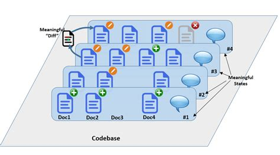
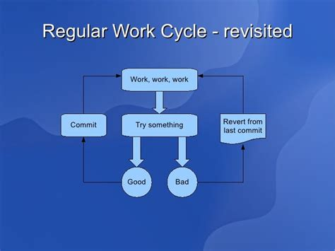
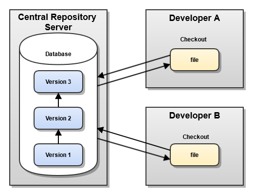
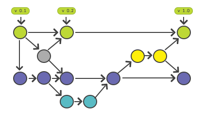
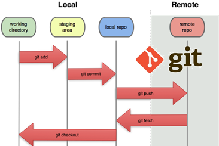
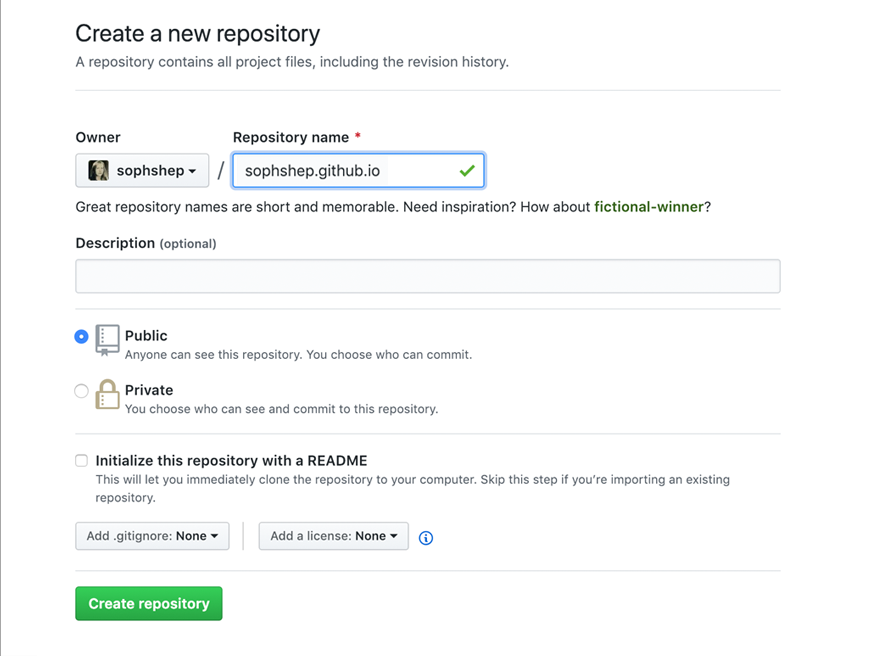

:data-transition-duration: 1000
:skip-help: true
:css: assets/hovercraft.css
:substep: true

.. title: rst (By Ahmad Yoosofan)

:slide-numbers: true

.. role:: ltr
    :class: ltr

.. role:: rtl
    :class: rtl

.. role:: raw-html(raw)
   :format: html

Source Code Manager
======================
Git
----
Ahmad Yoosofan

http://yoosofan.github.io/

Search "Ahmad Yoosofan"

----

:class: t2c

Having Backup
===================
Folders for Changes in code
------------------------------
* ./1400-01-15-01/
* ./1400-01-15-02/
* ./1400-01-15-03/
* ./1400-01-16-01/
* ./1400-01-16-02/
* ./1400-01-16-03/
* ./1400-01-16-04/

Several Programmers
----------------------
* ./Yoosofan/1400-01-15-01/
* ./Yoosofan/1400-01-15-02/
* ./Yaghoobi/1400-01-15-01/
* ./Yaghoobi/1400-01-16-01/
* ./Yaghoobi/1400-01-16-02/
* ./merge/1400-01-16-01/
* ./Yoosofan/1400-01-16-01/

Copy to Several Places
------------------------
* Disks
* Remote Computer
* Internet, cloud, etc.

----

States of Code
================

https://tmail21.com/blog/how-businesses-are-missing-out-on-one-of-the-most-powerful-collaboration-techniques/

----

https://tse2.mm.bing.net/th?id=OIP.xxH5S18w591-yShwuVN3fwHaFj

----

Central Version Control (CVS, SVN, etc)
============================================

https://cloudogu.com/images/blog/2013/04/CentralizedVCS.png

----

Other Decenteralised SCM
=========================
#. bazaar
#. Mercurial
#. `fossil <https://fossil-scm.org/home/doc/trunk/www/index.wiki>`_

----

Graph of Changes
=================

----

States of Changes
======================

----

.. image:: img/git.distributed.png
  :height: 500px

----

.. image:: img/git.deltas.snapshot.png

http://git-scm.com/book/en/v2/Getting-Started-What-is-Git%3F

----

.. image:: img/git.snapshots.png

http://git-scm.com/book/en/v2/Getting-Started-What-is-Git%3F

----

Git Three Stages
==================
.. image:: img/git3stages.png

http://git-scm.com/book/en/v2/Getting-Started-What-is-Git%3F

----

Install git
================
Ubuntu
---------
.. code:: sh

  sudo apt install git-all

Installing on Windows
-------------------------
* https://git-scm.com/download/win
* https://gitforwindows.org/

Simple Tests
------------------
.. code:: sh
  :number-lines:

  git --version

  git clone

  git help <verb>

  git <verb> --help

  man git-<verb>

  git help config

----

Git Configuration
======================
.. code:: sh
  :number-lines:

  git config --global user.email "your email"
  git config --global user.name "your name"

  git config --global user.name "John Doe"
  git config --global user.email johndoe@example.com

  git config --global core.editor vim
  git config --global core.editor /usr/bin/geany

  git config --global core.editor "'C:/Program Files/Notepad++/notepad++.exe' \
    -multiInst -notabbar -nosession -noPlugin"

Checking Your Settings
---------------------------
.. code:: sh
  :number-lines:

  git config --list

.. code:: console
  :number-lines:

  user.name=John Doe
  user.email=johndoe@example.com
  color.status=auto
  color.branch=auto
  color.interactive=auto
  color.diff=auto
  ...

----

Directories
================
Initializing a Repository in an Existing Directory
------------------------------------------------------
.. code:: sh
  :number-lines:

  # for Linux:
  cd /home/user/projects

  # for macOS:
  cd /Users/user/projects

  # for Windows:
  cd C:/Users/user/projects

  mkdir project32
  cd    project32

.. code:: sh
  :number-lines:

  git init .

* Copy or Create some files

.. code:: sh
  :number-lines:

  git add *.c
  git add LICENSE
  git commit -am 'Initial project version'

Cloning an Existing Repository
-----------------------------------
.. code:: sh
  :number-lines:

  git clone https://github.com/yoosofan/yoosofan.github.io.git

----

Recording Changes to the Repository
========================================
.. image:: img/git.files.lifecycle.png

----

:class: t2c

Checking the Status of Your Files
=====================================
.. code:: sh
  :number-lines:

  git status

.. code:: console
  :number-lines:

  On branch master
  Your branch is up-to-date with 'origin/master'.
  nothing to commit, working tree clean

.. code:: sh

  echo 'My Project' > README
  git status

.. code:: console
  :number-lines:

  On branch master
  Your branch is up-to-date with 'origin/master'.
  Untracked files:
    (use "git add <file>..." to include in what will be committed)

      README

  nothing added to commit but untracked files present
  (use "git add" to track)

----

:class: t2c

Tracking New Files
=====================================
.. code:: sh
  :number-lines:

  git add README
  git status

.. code:: console
  :number-lines:

  On branch master
  Your branch is up-to-date with 'origin/master'.
  Changes to be committed:
    (use "git restore --staged <file>..." to unstage)

      new file:   README

----

:class: t2c

Staging Modified Files(I)
===============================
.. code:: sh

  git status

.. code:: console
  :number-lines:

  On branch master
  Your branch is up-to-date with 'origin/master'.
  Changes to be committed:
    (use "git reset HEAD <file>..." to unstage)

      new file:   README

  Changes not staged for commit:
    (use "git add <file>..." to update what will be committed)
    (use "git checkout -- <file>..." to
      discard changes in working directory)

      modified:   CONTRIBUTING.md

.. code:: sh
  :number-lines:

  git add CONTRIBUTING.md
  git status

.. code:: console
  :number-lines:

  On branch master
  Your branch is up-to-date with 'origin/master'.
  Changes to be committed:
    (use "git reset HEAD <file>..." to unstage)

      new file:   README
      modified:   CONTRIBUTING.md

----

:class: t2c

Staging Modified Files(II)
===============================
.. code:: sh
  :number-lines:

  $ git add CONTRIBUTING.md
  $ git status

  On branch master
  Your branch is up-to-date with 'origin/master'.
  Changes to be committed:
    (use "git reset HEAD <file>..." to unstage)

      new file:   README
      modified:   CONTRIBUTING.md

  Changes not staged for commit:
    (use "git add <file>..." to
      update what will be committed)
    (use "git checkout -- <file>..."
      to discard changes in working directory)

      modified:   CONTRIBUTING.md

.. code:: sh
  :number-lines:

  $ git add CONTRIBUTING.md
  $ git status

  On branch master
  Your branch is up-to-date with 'origin/master'.
  Changes to be committed:
    (use "git reset HEAD <file>..." to unstage)

      new file:   README
      modified:   CONTRIBUTING.md

----

Short Status
================
.. code:: sh
  :number-lines:

  $ git status -s

  M  README
  MM Rakefile
  A  lib/git.rb
  M  lib/simplegit.rb
  ?? LICENSE.txt

Ignoring Files
------------------
.. code:: sh
  :number-lines:

  $ cat .gitignore

  *.[oa]
  *.log
  *~

#. Blank lines or lines starting with # are ignored.
#. Standard glob patterns work, and will be applied recursively throughout the entire working tree.
#. You can start patterns with a forward slash (/) to avoid recursivity.
#. You can end patterns with a forward slash (/) to specify a directory.
#. You can negate a pattern by starting it with an exclamation point (!).

----

Repo-to-repo collaboration: git push
=========================================
#. *git clone*: configure your repo with a remote pointed to the Git URL you cloned it from.
#. *git init*: to make a fresh repo, you'll have no remote repo to push changes to

.. code:: sh

  git remote add <remote_name> <remote_repo_url>

.. code:: sh

  git push -u <remote_name> <local_branch_name>

.. code:: sh
  :number-lines:

  $ cd /path/to/code
  $ git init
  $ git add .  # git add hello.py
  $ git commit

  $ git remote add origin https://yoosofan@bitbucket.org/project/repository.git

  $ git push -u origin master
  $ git push -u origin main

----

Reading diffs: outputs
===========================
.. code:: sh

  $ git add CONTRIBUTING.md
  $ echo '# test line' >> CONTRIBUTING.md
  $ git diff
  diff --git a/CONTRIBUTING.md b/CONTRIBUTING.md
  index 643e24f..87f08c8 100644
  --- a/CONTRIBUTING.md
  +++ b/CONTRIBUTING.md
  @@ -119,3 +119,4 @@ at the
   ## Starter Projects

   See our [projects list](https://github.com/libgit2/libgit2/blob/development/PROJECTS.md).
  +# test line

.. code:: sh

  $ git diff --cached # --staged
  diff --git a/CONTRIBUTING.md b/CONTRIBUTING.md
  index 8ebb991..643e24f 100644
  --- a/CONTRIBUTING.md
  +++ b/CONTRIBUTING.md
  @@ -65,7 +65,8 @@ branch directly, things can get messy.
   Please include a nice description of your changes when you submit your PR;
   if we have to read the whole diff to figure out why you're contributing
   in the first place, you're less likely to get feedback and have your change
  -merged in.
  +merged in. Also, split your changes into comprehensive chunks if your patch is
  +longer than a dozen lines.

.. code:: sh

  $ git commit

----

Changing files
================
.. code:: sh

  git rm file1

  git mv file1 file2

----

Viewing the Commit History
=============================
.. code:: sh

  $ git log
  commit ca82a6dff817ec66f44342007202690a93763949
  Author: Scott Chacon <schacon@gee-mail.com>
  Date:   Mon Mar 17 21:52:11 2008 -0700

      Change version number

  commit 085bb3bcb608e1e8451d4b2432f8ecbe6306e7e7
  Author: Scott Chacon <schacon@gee-mail.com>
  Date:   Sat Mar 15 16:40:33 2008 -0700

      Remove unnecessary test

  commit a11bef06a3f659402fe7563abf99ad00de2209e6
  Author: Scott Chacon <schacon@gee-mail.com>
  Date:   Sat Mar 15 10:31:28 2008 -0700

      Initial commit

.. code:: sh

  $ git log -p -2

  $ git log --stat

----

Undoing Things
=================
.. code:: sh
  :number-lines:

  $ git commit --amend

  $ git commit -m 'Initial commit'
  $ git add forgotten_file
  $ git commit --amend

  $ git reset HEAD CONTRIBUTING.md

  # Undoing things with git restore
  $ git restore

  # discard the changes
  $ git checkout -- CONTRIBUTING.md

----

The most popular Git solutions
=================================
* https://bitbucket.org/
* https://github.com/
* https://about.gitlab.com/

----

SSH Key
===========
.. code:: sh
  :number-lines:

  $ ssh-keygen -t rsa -b 4096 -C "your_email@example.com"

  > Enter a file in which to save the key (/Users/you/.ssh/id_rsa): [Press enter]

  > Enter passphrase (empty for no passphrase): [Type a passphrase]
  > Enter same passphrase again: [Type passphrase again]

  $ eval "$(ssh-agent -s)"
  > Agent pid 59566

  $ ssh-add -K /Users/you/.ssh/id_rsa

Git URL protocols
----------------------
#. *ssh*  : ssh://[user@]host.xz[:port]/path/to/repo.git/
#. *git* : git://host.xz[:port]/path/to/repo.git/
#. *http[s]* : http[s]://host.xz[:port]/path/to/repo.git/

.. :

  https://www.w3docs.com/learn-git/ssh-key.html

----

Working with Remotes
=========================
.. code:: sh
  :number-lines:

  $ git remote -v

  $ git remote add pb https://github.com/paulboone/ticgit

  $ git remote -v
  origin  https://github.com/schacon/ticgit (fetch)
  origin  https://github.com/schacon/ticgit (push)
  pb  https://github.com/paulboone/ticgit (fetch)
  pb  https://github.com/paulboone/ticgit (push)

  $ git fetch <remote>

  $ git pull origin master
  $ git pull origin main

  $ git push origin master
  $ git push origin main

  $ git push pb master
  $ git push pb main

  $ git remote rename pb paul

  $ git remote remove paul

----

Simple Commits
====================
.. image:: img/basic-branching-1.png

----

Branch
============
.. code:: sh
  :number-lines:

  $ git branch iss53
  $ git checkout iss53

  $ git checkout -b iss53
  Switched to a new branch "iss53"

.. image:: img/basic-branching-2.png

----

Change in current Branch
==========================
.. code:: sh
  :number-lines:

  $ vim index.html
  $ git commit -a -m 'Create new footer [issue 53]'

.. image:: img/basic-branching-3.png

----

Another Branch
=================
.. code:: sh
  :number-lines:

  $ git checkout master
  Switched to branch 'master'

.. code:: sh

  $ git checkout -b hotfix
  Switched to a new branch 'hotfix'
  $ vim index.html
  $ git commit -a -m 'Fix broken email address'
  [hotfix 1fb7853] Fix broken email address
  1 file changed, 2 insertions(+)

.. image:: img/basic-branching-4.png

----

Merge
========
.. code:: sh
  :number-lines:

  $ git checkout master
  $ git merge hotfix
  Updating f42c576..3a0874c
  Fast-forward
   index.html | 2 ++
   1 file changed, 2 insertions(+)

.. image:: img/basic-branching-5.png
  :height: 400px

----

Remove branch
=================
.. code:: sh
  :number-lines:

  $ git branch -d hotfix
  Deleted branch hotfix (3a0874c).

  $ git checkout iss53
  Switched to branch "iss53"
  $ vim index.html
  $ git commit -a -m 'Finish the new footer [issue 53]'
  [iss53 ad82d7a] Finish the new footer [issue 53]
  1 file changed, 1 insertion(+)

.. image:: img/basic-branching-6.png

----

.. code:: sh
  :number-lines:

  $ git branch testing

  $ git checkout testing

  $ git checkout master
  $ git checkout main

----

Website on GitHub
=================
Create a repository
-------------------
Create a new public repository named username.github.io

  
----

What git client are you using?
==============================
1. terminal
2. GitHub Desktop
3. other git tools

----

Clone the repository
====================
Go to the folder where you want to store your project, and clone the new repository:

.. code:: sh

    git clone https://github.com/username/username.github.io

----

Hello World
===========
Enter the project folder and add an index.html file:

.. code:: sh

    cd username.github.io

    echo "Hello World" > index.html

----

Push it
=======
Add, commit, and push your changes:

.. code:: sh

    git add --all

    git commit -m "Initial commit"

    git push -u origin main

* https://pages.github.com/
* https://docs.github.com/en/pages/quickstart
* https://docs.github.com/en/pages/getting-started-with-github-pages/about-github-pages

----

END

.. :

  https://www.atlassian.com/git/tutorials/source-code-management
  https://unity.com/solutions/source-code-management
  https://www.techopedia.com/definition/3879/source-code-manager-scm
  http://git-scm.com/book/en/v2/Git-Basics-Recording-Changes-to-the-Repository
  https://www.w3docs.com/learn-git/source-code-management.html
  http://git-scm.com/book/en/v2/Git-Branching-Basic-Branching-and-Merging
  http://git-scm.com/book/en/v2/Git-Tools-Reset-Demystified#_git_reset
  https://www.atlassian.com/git/tutorials/saving-changes/gitignore
  https://www.w3docs.com/learn-git/git-alias.html
  https://wac-cdn.atlassian.com/dam/jcr:e7e22f25-bba2-4ef1-a197-53f46b6df4a5/SWTM-2088_Atlassian-Git-Cheatsheet.pdf?cdnVersion=309

