:data-transition-duration: 1000
:skip-help: true
:css: assets/hovercraft.css assets/html.css
:substep: true

.. :

  ../../../other/setting/office/restructuredtext/style_of_slide.css
  /media/ahmad/yoosofan/yoosofanFiles/yoosofan/other/setting/office/restructuredtext/style_of_slide.css
  #run slides
  hovercraft html.rst

  #run samples in iframes of slides
  python3 server_samples.py

.. title: HTML (By Ahmad Yoosofan)

:slide-numbers: true

.. role:: ltr
    :class: ltr

.. role:: rtl
    :class: rtl

HTML
======================
Ahmad Yoosofan

http://yoosofan.github.io/

Search "Ahmad Yoosofan"

----

History of writing
=======================
* Sumerian pictographs
* Egyptian hieroglyphs
* Chinese ideograms
* Old Persian cuneiform
* Roman alphabet
* South Asian Devanagari

----

Old Persian cuneiform
===========================
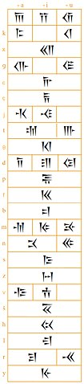

----

Darius the Great (circa 490 BC)
===================================
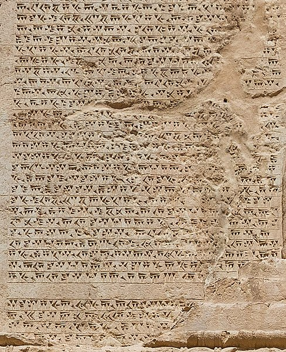

----

.. class:: rtl

* بحث‌های اجتماعی - انسانی
* عادت و احساس تمرکز بهتر با فناوری قدیمی‌تر
* امنیت در سطوح متفاوت
* کم کردن احتمال کپی و به کارگیری اصل

.. class:: ltr

* https://en.wikipedia.org/wiki/Neil_Postman
* `<https://www.agahbookshop.com/سيطره-كميت-و-علائم-آخرالزمان_8747>`_

.. class:: rtl

سه گانهٔ عصر اطلاعات (۱۹۹۷) این کتاب توسط احمد علیقلیان، افشین خاکباز و حسن چاوشیان به فارسی ترجمه شده‌است.

`<https://fa.wikipedia.org/wiki/مانوئل_کاستلز>`_

Information Technology, Globalization and Social Development

Manuel Castells

.. :

  https://en.wikipedia.org/wiki/Neil_Postman
  https://en.wikipedia.org/wiki/Amusing_Ourselves_to_Death

  https://fa.wikipedia.org/wiki/مانوئل_کاستلز
  https://fa.wikipedia.org/wiki/مانوئل_کاستلز

  https://www.agahbookshop.com/سيطره-كميت-و-علائم-آخرالزمان_8747

  https://fa.m.wikipedia.org/wiki/ماشین_انیگما

  wwii native american secret comunication
  https://en.wikipedia.org/wiki/Joe_Medicine_Crow
  https://en.wikipedia.org/wiki/103rd_Infantry_Division_(United_States)
  https://www.nationalww2museum.org/war/articles/american-indian-code-talkers
  https://www.history.com/news/world-war-is-native-american-code-talkers
  https://artsandculture.google.com/story/native-american-code-talkers-national-museum-of-the-american-indian/yAXBAYZ9wwV7Jw?hl=en
  https://www.uso.org/stories/2511-how-navajo-code-talker-marines-used-their-indigenous-language-to-help-win-world-war-ii

----

A bit of history
===================
Character Encoding war!
-------------------------
Mapping byte number to characters

----

EBCDIC(IBM - 8bit) 1963
===========================
.. :

  .. image:: img/ebcdic.jpg

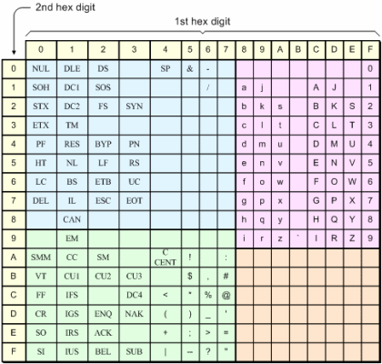

.. :

  https://www.edn.com/how-it-was-ascii-ebcdic-iso-and-unicode/
  https://cosme.cc/codigo-ebcdic-92/

----

ASCII(ANSI - 7bit) 1963
=======================

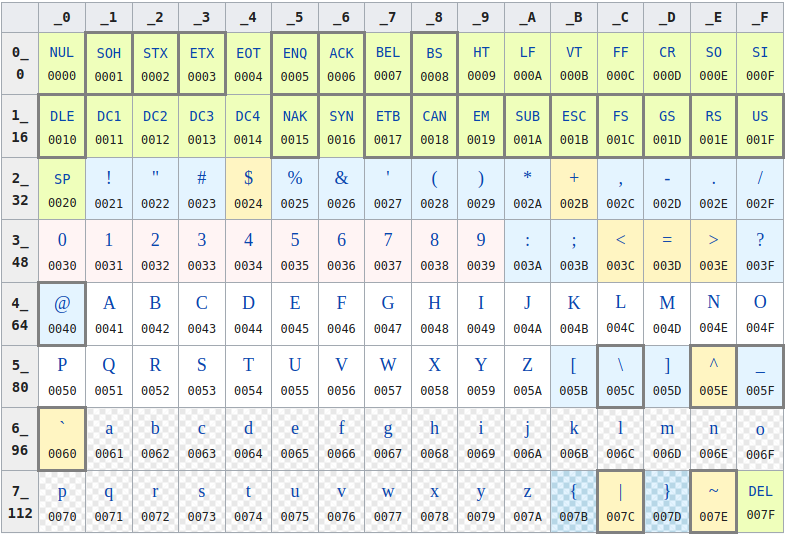

.. :

  https://en.wikipedia.org/wiki/ASCII

----

How a document can be formatted
=================================
IETF https://www.ietf.org

https://www.rfc-editor.org/rfc-index.html

* RFC text files (https://www.rfc-editor.org/rfc/rfc1.txt  https://www.rfc-editor.org/rfc/rfc98.txt)
* Images ?
* Formulas?
* Size of screen?
* Other different issues
    * page size
    * header
    * footer
    * ...

----

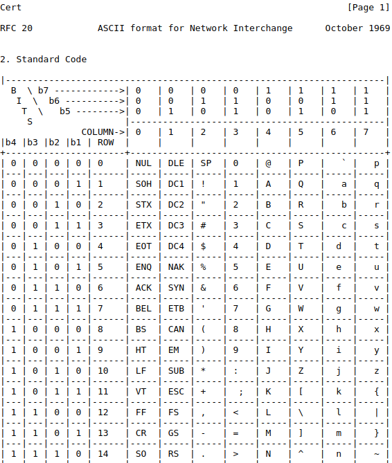

----

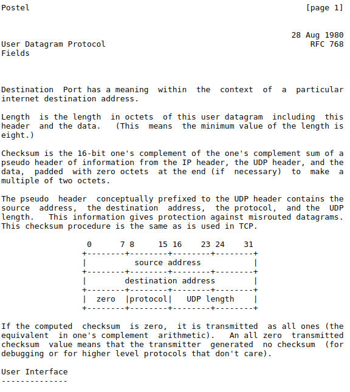

----

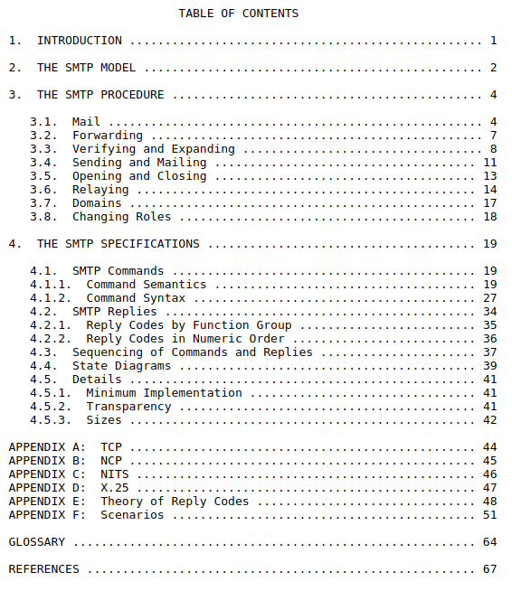

----

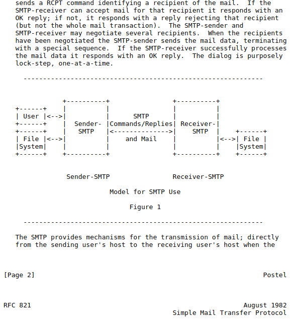

----

* https://www.rfc-editor.org/rfc/rfc20.txt
* https://www.rfc-editor.org/rfc/rfc768.txt
* https://www.rfc-editor.org/rfc/rfc821.txt
* https://www.rfc-editor.org/rfc/rfc9083.txt
* https://www.rfc-editor.org/rfc-index.txt
* https://www.rfc-editor.org

----

New Line
==============
\n \r

https://www.editpadpro.com/tricklinebreak.html

Editor
-----------
https://en.wikipedia.org/wiki/XEDIT

old ibm line editor

----

Fonts, glyph
===============
* https://fontforge.org/en-US/
* https://en.wikipedia.org/wiki/FontForge
* https://upload.wikimedia.org/wikipedia/commons/6/68/FontForge_20200314_screenshot.png
* https://www.myfonts.com/tags/Persian/
* https://rastikerdar.github.io/vazir-font/
* https://upload.wikimedia.org/wikipedia/commons/6/68/FontForge_20200314_screenshot.png
* https://coolsymbol.com/cool-fancy-text-generator.html
* https://lingojam.com/FontChanger
* https://perishablepress.com/dos-fx-theme/

----

ISO
==========
* International Organization for Standardization (ISO)
* adapt the ASCII code to accommodate other languages.
* In 1967, the organization released its recommendation ISO 646.
* starting in the early 1980s, American computer companies began to consider their own solutions to the problem of supporting multilingual character sets and codes.
* https://en.wikipedia.org/wiki/ISO/IEC_8859-1

.. :

  https://www.edn.com/how-it-was-ascii-ebcdic-iso-and-unicode/

----

Code Pages
==============
* 874  – Windows Thai
* 1250 – Windows Central Europe
* 1251 – Windows Cyrillic
* 1252 – Windows Western
* 1253 – Windows Greek
* 1254 – Windows Turkish
* 1255 – Windows Hebrew
* 1256 – Windows Arabic
* 1257 – Windows Baltic
* 1258 – Windows Vietnamese

*  https://www.charset.org/charsets/windows-1256
*  https://en.wikipedia.org/wiki/Windows-1256

----

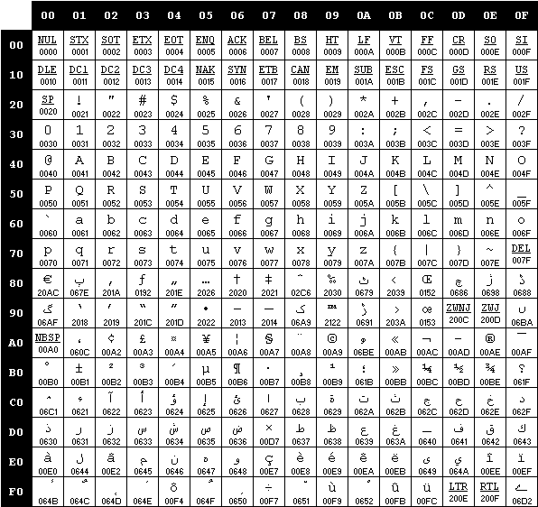

----

Unicode(UCS)
=================
* https://en.wikipedia.org/wiki/Unicode
* https://en.wikipedia.org/wiki/List_of_Unicode_characters
* https://home.unicode.org/
* https://en.wikipedia.org/wiki/Bidirectional_text
* https://en.wikipedia.org/wiki/Arabic_script_in_Unicode

----

UTF-8
=======
https://en.wikipedia.org/wiki/UTF-8

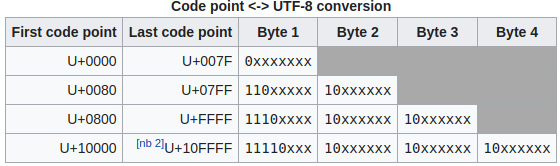

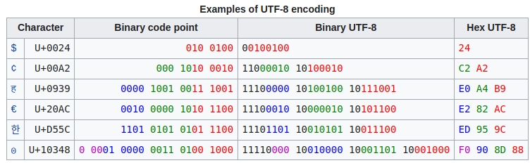

----

BOM
====
Byte Order Mark
-------------------
https://en.wikipedia.org/wiki/Byte_order_mark

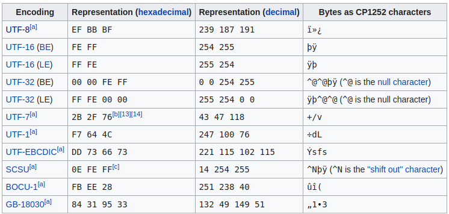

----

* https://unicode.org/emoji/charts/full-emoji-list.html
* geany.org
* hexdump

----

History of html
==================
* https://www.w3.org/History/1945/vbush/
* https://www.w3.org/History/1989/proposal.html
* https://www.w3.org/History/1991-WWW-NeXT/
* https://www.w3.org/History/19921103-hypertext/hypertext/WWW/MarkUp/Tags.html

----

SGML
======
Standard Generalized Markup Language
----------------------------------------
* SGML; ISO 8879:1986
* https://en.wikipedia.org/wiki/Standard_Generalized_Markup_Language

----

:id: html-dom-model-image-id

.. image:: img/800px-DOM-model.svg.png

.. code:: html

  <!DOCTYPE html>
  <html>
    <head>
      <title>
        My Title
      </title>
    </head>
    <body>
      <h1>
        A heading
      </h1>
      <a href="#">
        Link Text
      </a>
    </body>
  </html>

.. ::

  `wikipedia <https://en.wikipedia.org/wiki/Document_Object_Model>`_

----

:id: meta-charset-UTF-8-id

meta charset UTF-8
=========================
.. code:: html

  <!DOCTYPE html>
  <html>
    <head>
      <meta charset="utf-8" />
      <title>
        My Title
      </title>
    </head>
    <body>
      <h1>
        A heading
      </h1>
      <a href="#">
        Link Text
      </a>
    </body>
  </html>

----

:id: dir-rtl-id

Direction (dir : rtl , ltr)
=================================
.. include:: src/css/css210.html
    :code: html
    :number-lines:

.. raw:: html

   <iframe src="http://127.0.0.1:8002/src/css/css210.html" title="description" class="output-of-html">
   </iframe>

----

:id: dir-ltr-id

Direction (dir : ltr)
=================================
.. code:: html

  <!DOCTYPE html>
  <html dir="ltr">
  <head>
    <meta charset="utf-8">
    <title>این یک آزمایش است</title>
  </head>
  <body>
    

    نخستین نمونه‌ی کلاس
    

    

    بخش دوم
    

  </body>
  </html>

.. raw:: html

  

    

    نخستین نمونه‌ی کلاس
    

    

    بخش دوم
    

  

----

:class: simple-html01-class

.. include:: src/html/html180_rtl.html
    :code: html
    :number-lines:

.. raw:: html

   <iframe src="http://127.0.0.1:8002/src/html/html180_rtl.html" title="description" class="output-of-html">
   </iframe>

----

:id: dir-ltr-in-tags-id

Direction (in tags dir : ltr)
=================================
.. code:: html

  <!DOCTYPE html>
  <html>
  <head>
    <meta charset="utf-8">
    <title>این یک آزمایش است</title>
  </head>
  <body>
    

      This is a test
    

    

    نخستین نمونه‌ی کلاس
    

    

    بخش دوم
    

  </body>
  </html>

.. raw:: html

  

    

      This is a test
    

    

    نخستین نمونه‌ی کلاس
    

    

    بخش دوم
    

  

----

:class: simple-html01-class

.. include:: src/html/html220_h1.html
    :code: html
    :number-lines:

.. raw:: html

   <iframe src="http://127.0.0.1:8002/src/html/html220_h1.html" title="description" class="output-of-html">
   </iframe>

----

:class: simple-html01-class

.. include:: src/html/html240_p.html
    :code: html
    :number-lines:

.. raw:: html

   <iframe src="http://127.0.0.1:8002/src/html/html240_p.html" title="description" class="output-of-html">
   </iframe>

----

:class: simple-html01-class

.. include:: src/html/html260_p_div.html
    :code: html
    :number-lines:

.. raw:: html

   <iframe src="http://127.0.0.1:8002/src/html/html260_p_div.html" title="description" class="output-of-html">
   </iframe>

----

:class: simple-html01-class

.. include:: src/html/html280_br.html
    :code: html
    :number-lines:

.. raw:: html

   <iframe src="http://127.0.0.1:8002/src/html/html280_br.html" title="description" class="output-of-html">
   </iframe>

----

:class: simple-html01-class

.. include:: src/html/html300_a.html
    :code: html
    :number-lines:

.. raw:: html

   <iframe src="http://127.0.0.1:8002/src/html/html300_a.html" title="description" class="output-of-html">
   </iframe>

----

:class: simple-html01-class

.. include:: src/html/html320_ul.html
    :code: html
    :number-lines:

.. raw:: html

   <iframe src="http://127.0.0.1:8002/src/html/html320_ul.html" title="description" class="output-of-html">
   </iframe>

----

:class: simple-html01-class

.. include:: src/html/html330_ol.html
    :code: html
    :number-lines:

.. raw:: html

   <iframe src="http://127.0.0.1:8002/src/html/html330_ol.html" title="description" class="output-of-html">
   </iframe>

----

:class: simple-html01-class

.. include:: src/html/html330_ol.html
    :code: html
    :number-lines:

.. raw:: html

   <iframe src="http://127.0.0.1:8002/src/html/html330_ol.html" title="description" class="output-of-html">
   </iframe>

----

:class: simple-html01-class

.. include:: src/html/html330_ol_ol.html
    :code: html
    :number-lines:

.. raw:: html

   <iframe src="http://127.0.0.1:8002/src/html/html330_ol_ol.html" title="description" class="output-of-html">
   </iframe>

----

:class: simple-html01-class

.. include:: src/html/html340_img.html
    :code: html
    :number-lines:

.. raw:: html

   <iframe src="http://127.0.0.1:8002/src/html/html340_img.html" title="description" class="output-of-html">
   </iframe>

----

:class: simple-html01-class

.. include:: src/html/html350_img_width_height.html
    :code: html
    :number-lines:

.. raw:: html

   <iframe src="http://127.0.0.1:8002/src/html/html350_img_width_height.html" title="description" class="output-of-html">
   </iframe>

----

:class: simple-html01-class

.. include:: src/html/html360_img_alt.html
    :code: html
    :number-lines:

.. raw:: html

   <iframe src="http://127.0.0.1:8002/src/html/html360_img_alt.html" title="description" class="output-of-html">
   </iframe>

----

:class: simple-html01-class

.. include:: src/html/html370_pre.html
    :code: html
    :number-lines:

.. raw:: html

   <iframe src="http://127.0.0.1:8002/src/html/html370_pre.html" title="description" class="output-of-html">
   </iframe>

----

:class: simple-html01-class

.. include:: src/html/html375_b_strong_i.html
    :code: html
    :number-lines:

.. raw:: html

   <iframe src="http://127.0.0.1:8002/src/html/html375_b_strong_i.html" title="description" class="output-of-html">
   </iframe>

----

:class: simple-html01-class

.. include:: src/html/html375_em_small_del.html
    :code: html
    :number-lines:

.. raw:: html

   <iframe src="http://127.0.0.1:8002/src/html/html375_em_small_del.html" title="description" class="output-of-html">
   </iframe>

----

:class: simple-html01-class

.. include:: src/html/html375_ins_sub_sup.html
    :code: html
    :number-lines:

.. raw:: html

   <iframe src="http://127.0.0.1:8002/src/html/html375_ins_sub_sup.html" title="description" class="output-of-html">
   </iframe>

----

:class: simple-html01-class

.. include:: src/html/html380_hr_sub_sup.html
    :code: html
    :number-lines:

.. raw:: html

   <iframe src="http://127.0.0.1:8002/src/html/html380_hr_sub_sup.html" title="description" class="output-of-html">
   </iframe>

----

:class: simple-html01-class

.. include:: src/html/html385_table_tr_td.html
    :code: html
    :number-lines:

.. raw:: html

   <iframe src="http://127.0.0.1:8002/src/html/html385_table_tr_td.html" title="description" class="output-of-html">
   </iframe>

----

:class: simple-html01-class

.. include:: src/html/html390_table_border.html
    :code: html
    :number-lines:

.. raw:: html

   <iframe src="http://127.0.0.1:8002/src/html/html390_table_border.html" title="description" class="output-of-html">
   </iframe>

----

:class: simple-html01-class

.. include:: src/html/html395_table_different_td.html
    :code: html
    :number-lines:

.. raw:: html

   <iframe src="http://127.0.0.1:8002/src/html/html395_table_different_td.html" title="description" class="output-of-html">
   </iframe>

----

:class: simple-html01-class

.. include:: src/html/html400_table_different_td_colspan.html
    :code: html
    :number-lines:

.. raw:: html

   <iframe src="http://127.0.0.1:8002/src/html/html400_table_different_td_colspan.html" title="description" class="output-of-html">
   </iframe>

----

:class: simple-html01-class

.. include:: src/html/html405_table_different_td_rowpan.html
    :code: html
    :number-lines:

.. raw:: html

   <iframe src="http://127.0.0.1:8002/src/html/html405_table_different_td_rowpan.html" title="description" class="output-of-html">
   </iframe>

.. :

  https://www.educba.com/html-colspan/

----

:class: t2c

Center Tag
==============
.. include:: src/html/html410_table_center.html
    :code: html
    :number-lines:
    :start-line: 7
    :end-line: 35

.. raw:: html

   <iframe src="http://127.0.0.1:8002/src/html/html410_table_center.html" title="description" class="output-of-html">
   </iframe>

----

:class: t2c

Remove Center Tag
===================
.. include:: src/html/html412_remove_table_center.html
    :code: html
    :number-lines:
    :start-line: 7
    :end-line: 36

.. raw:: html

   <iframe src="http://127.0.0.1:8002/src/html/html412_remove_table_center.html" title="description" class="output-of-html">
   </iframe>

----

:class: simple-html01-class

.. include:: src/html/html415_table_thead.html
    :code: html
    :number-lines:

.. raw:: html

   <iframe src="http://127.0.0.1:8002/src/html/html415_table_thead.html" title="description" class="output-of-html">
   </iframe>

----

:class: simple-html01-class

.. include:: src/html/html420_table_tfoot.html
    :code: html
    :number-lines:

.. raw:: html

   <iframe src="http://127.0.0.1:8002/src/html/html420_table_tfoot.html" title="description" class="output-of-html">
   </iframe>

.. :

    https://developer.mozilla.org/en-US/docs/Web/HTML/Element/tfoot
    https://developer.mozilla.org/en-US/docs/Web/HTML/Element/table

----

:class: simple-html01-class

.. include:: src/html/html420_table_caption.html
    :code: html
    :number-lines:

.. raw:: html

   <iframe src="http://127.0.0.1:8002/src/html/html420_table_caption.html" title="description" class="output-of-html">
   </iframe>

.. :

  https://riptutorial.com/html/example/8562/table-with-thead--tbody--tfoot--and-caption
  https://thepaciellogroup.github.io/AT-browser-tests/test-files/table-caption-thead-tbody-tfoot-tr-th-td.html
  https://www.w3schools.com/tags/tag_tfoot.asp
  https://www.w3schools.com/tags/tag_thead.asp
  https://developer.mozilla.org/en-US/docs/Web/HTML/Element/tfoot
  https://developer.mozilla.org/en-US/docs/Web/HTML/Element/caption
  https://developer.mozilla.org/en-US/docs/Web/HTML/Element/colgroup

----

Comments & Named Characters
=============================
.. include:: src/html/html422_entries_quote.html
    :code: html
    :number-lines:

* https://developer.mozilla.org/en-US/docs/Glossary/Entity
* https://www.htmlhelp.com/reference/html40/entities/special.html
* https://www.w3schools.com/html/html_entities.asp
* https://html.spec.whatwg.org/multipage/named-characters.html#named-character-references
* https://unicode-table.com/en/sets/mathematical-signs/

.. raw:: html

   <iframe src="http://127.0.0.1:8002/src/html/html422_entries_quote.html" title="description" class="output-of-html">
   </iframe>

----

:class: t2c

Absolute URLs vs. Relative URLs
==================================
.. include:: src/html/html424_absolute_url_vs_relative_urls.html
    :code: html
    :number-lines:
    :start-line: 6
    :end-line: 17

.. raw:: html

  <iframe src="http://127.0.0.1:8002/src/html/html424_absolute_url_vs_relative_urls.html" title="description" class="output-of-html">
  </iframe>

----

:class: t2c

HTML Links - Use an Image as a Link
========================================
.. include:: src/html/html426_use_an_image_as_a_link.html
    :code: html
    :number-lines:
    :start-line: 6
    :end-line: 10

.. raw:: html

  <iframe src="http://127.0.0.1:8002/src/html/html426_use_an_image_as_a_link.html" title="description" class="output-of-html">
  </iframe>

----

Link to an Email Address
=============================
.. code:: html

  <a href="mailto:someone@example.com">Send email</a>

  email: someone AT example DOT com

----

:class: t2c

Link Target
========================================
.. include:: src/html/html428_link_target.html
    :code: html
    :number-lines:
    :start-line: 6
    :end-line: 30

.. raw:: html

  <iframe src="http://127.0.0.1:8002/src/html/html428_link_target.html" title="description" class="output-of-html">
  </iframe>

* _blank
* _parent
* _self
* _top

----

:class: t2c

Title Attribute
====================
.. include:: src/html/html550_title.html
    :code: html
    :number-lines:

.. raw:: html

   <iframe src="http://127.0.0.1:8002/src/html/html550_title.html" title="description" class="output-of-html">
   </iframe>

----

:class: t2c

Abbr Tag
====================
.. include:: src/html/html555_abbr.html
    :code: html
    :number-lines:

.. raw:: html

   <iframe src="http://127.0.0.1:8002/src/html/html555_abbr.html" title="description" class="output-of-html">
   </iframe>

----

:class: t2c

rtl Attribute
====================
.. include:: src/html/html505_div.html
    :code: html
    :number-lines:

.. raw:: html

   <iframe src="http://127.0.0.1:8002/src/html/html505_div.html" title="description" class="output-of-html">
   </iframe>

----

:class: t2c

Span Tag
====================
.. include:: src/html/html505_span_div.html
    :code: html
    :number-lines:

.. raw:: html

   <iframe src="http://127.0.0.1:8002/src/html/html505_span_div.html" title="description" class="output-of-html">
   </iframe>

.. :

  https://html.com/
  * colgroup

----

:class: t2c

Image is nonblock
========================================
.. include:: src/html/html506_use_an_image_as_a_link_nonblock.html
    :code: html
    :number-lines:
    :start-line: 6
    :end-line: 19

.. raw:: html

  <iframe src="http://127.0.0.1:8002/src/html/html506_use_an_image_as_a_link_nonblock.html" title="description" class="output-of-html">
  </iframe>

----

Common Image Formats
=======================
.. csv-table::
  :header-rows: 1
  :class: smallerelementwithfullborder center

    Abbreviation,   File Format,  File Extension
    APNG,   Animated Portable Network Graphics,   .apng
    GIF,  Graphics Interchange Format,  .gif
    ICO,  Microsoft Icon,   .ico .cur
    JPEG,   Joint Photographic Expert Group image,  .jpg .jpeg .jfif .pjpeg .pjp
    PNG,  Portable Network Graphics,  .png
    SVG,  Scalable Vector Graphics,   .svg

----

Units
==========
Absolute Length Units
-------------------------
* cm, mm, pc, in, pt, px

1in = 2.54cm = 25.4mm = 72pt = 6pc

Relative Units
------------------
* em, rem, ch, ex, %

Viewport Length Units
----------------------
* vm, vh, vmin, vmax

.. :

    https://www.w3.org/Style/Examples/007/units.en.html
    https://oreillymedia.github.io/Using_SVG/guide/units.html
    https://www.tutorialbrain.com/css_tutorial/css_units/
    http://www.endmemo.com/sconvert/pixel_cmpixel_mm.php

----

:class: t2c

Semantic Tags
=================
* <article>   </article>
* <header>    </header>
* nav
* footer
* section
* main
* aside

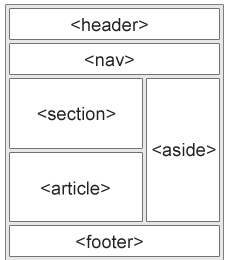

.. :

  https://www.w3schools.com/html/html5_semantic_elements.asp

----

Block / Non Block Element
============================
block-level elements
-------------------------
* <address>, <article>, <aside>, <blockquote>, <canvas>
* <dd>, 
, <dl>, <dt>, <fieldset>, <figcaption>
* <figure>, <footer>, <form>, <h1>-<h6>, <header>
* 
, <li>, <main>, <nav>, <noscript>, <ol>
* 
, <pre>, <section>, <table>, <tfoot>, <ul>
* <video>

inline elements
-------------------
* <a>, <abbr>, <acronym>, <b>, <bdo>, <big>
*  , <button>, <cite>, <code>, <dfn>,<em>
* <i>, , <input>, <kbd>, <label>, <map>
* <object>, <output>, <q>, <samp>, <script>
* <select>, <small>, , <strong>, 
* , <textarea>, <time>, <tt>, <var>

----

:class: t2c

Blockquote
=================
.. include:: src/html/html507.blockquote.html
    :code: html
    :number-lines:

.. raw:: html

   <iframe src="http://127.0.0.1:8002/src/html/html507.blockquote.html" title="description" class="output-of-html" allowfullscreen >
   </iframe>

----

:class: t2c

Short quotations
==================
.. include:: src/html/html507.quotations.html
    :code: html
    :number-lines:
    :start-line: 6
    :end-line: 19

.. raw:: html

  <iframe src="http://127.0.0.1:8002/src/html/html507.quotations.html" title="description" class="output-of-html">
  </iframe>

----

HTML <bdo> for Bi-Directional Override
========================================
<bdo dir="rtl">This text will be written from right to left</bdo>

----

:class: simple-html01-class

.. include:: src/html/html510_dl_dt_dd.html
    :code: html
    :number-lines:

.. raw:: html

   <iframe src="http://127.0.0.1:8002/src/html/html510_dl_dt_dd.html" title="description" class="output-of-html" allowfullscreen >
   </iframe>

https://developer.mozilla.org/en-US/docs/Web/HTML/Element/dl

.. :

  https://www.w3docs.com/snippets/html/what-is-the-difference-between-the-id-and-name-attributes.html
  http://xahlee.info/js/html_allowed_chars_in_attribute.html#:~:text=The%20attribute%20value%20may%20only%20contain%20letters%20%28a-z,to%20eliminate%20them.%20Attribute%20names%20are%20always%20case-insensitive.
  https://stackoverflow.com/questions/1397592/difference-between-id-and-name-attributes-in-html

----

:class: simple-html01-class

.. include:: src/html/html615_class.html
    :code: html
    :number-lines:

.. raw:: html

   <iframe src="http://127.0.0.1:8002/src/html/html615_class.html" title="description" class="output-of-html" allowfullscreen >
   </iframe>

----

:class: t2c

Tab
========
.. include:: src/html/html620_tabindex.html
    :code: html
    :number-lines:

.. raw:: html

   <iframe src="http://127.0.0.1:8002/src/html/html620_tabindex.html" title="description" class="output-of-html" allowfullscreen >
   </iframe>

----

:class: t2c

Access Key
====================
.. include:: src/html/html645_acceskey.html
    :code: html
    :number-lines:

.. raw:: html

   <iframe src="http://127.0.0.1:8002/src/html/html645_acceskey.html" title="description" class="output-of-html" allowfullscreen >
   </iframe>

https://developer.mozilla.org/en-US/docs/Web/HTML/Global_attributes/accesskey

----

.. :

  seo
  search engine optimaization
  surferseo.com
  https://www.woorank.com/en/blog/underscores-in-urls-why-are-they-not-recommended
  https://studiohawk.com.au/blog/dash-or-underscore-in-url-heres-how-its-affecting-your-seo/

  SEO
  --------
  search engine optimizaton schema html
  https://www.wikidata.org/wiki/User:Yoosofan
  https://www.wikidata.org/wiki/Wikidata:Property_proposal/Lexemes

:class: t2c

Lang Attribute
====================
.. include:: src/html/html630_lang.html
    :code: html
    :number-lines:

.. raw:: html

   <iframe src="http://127.0.0.1:8002/src/html/html630_lang.html" title="description" class="output-of-html" allowfullscreen >
   </iframe>

----

:class: t2c

Content Editable Attribute
===============================
.. include:: src/html/html635_contenteditable.html
    :code: html
    :number-lines:

.. raw:: html

   <iframe src="http://127.0.0.1:8002/src/html/html635_contenteditable.html" title="description" class="output-of-html" allowfullscreen >
   </iframe>

.. :

  https://developer.mozilla.org/en-US/docs/Web/Guide/HTML/Editable_content

----

:class: t2c

.. :

  seo
  search engine optimaization
  surferseo.com

Hidden Attribute
====================
.. include:: src/html/html640_hidden.html
    :code: html
    :number-lines:

.. raw:: html

   <iframe src="http://127.0.0.1:8002/src/html/html640_hidden.html" title="description" class="output-of-html" allowfullscreen >
   </iframe>

----

GLOBAL ATTRIBUTES
====================
* accesskey
* class
* contenteditable
* dir
* draggable
* dropzone
* hidden
* id
* lang
* spellcheck
* style
* tabindex
* title

https://www.w3docs.com/learn-html/html-attributes.html

----

:class: t2c

List(I)
==========
.. include:: src/html/html660_ol_start.html
    :code: html
    :number-lines:

.. raw:: html

   <iframe src="http://127.0.0.1:8002/src/html/html660_ol_start.html" title="description" class="output-of-html" allowfullscreen >
   </iframe>

----

:class: t2c

List(II)
==========
.. include:: src/html/html662_ol_type.html
    :code: html
    :number-lines:

.. raw:: html

   <iframe src="http://127.0.0.1:8002/src/html/html662_ol_type.html" title="description" class="output-of-html" allowfullscreen >
   </iframe>

https://www.w3docs.com/learn-html/html-lists.html

----

:class: t2c

List(III)
==========
.. include:: src/html/html665_ul_type.html
    :code: html
    :number-lines:

.. raw:: html

   <iframe src="http://127.0.0.1:8002/src/html/html665_ul_type.html" title="description" class="output-of-html" allowfullscreen >
   </iframe>

https://www.w3docs.com/learn-html/html-lists.html

----

:class: t2c

Disabled
============
.. include:: src/html/html680_bottom.html
    :code: html
    :number-lines:

.. raw:: html

   <iframe src="http://127.0.0.1:8002/src/html/html680_bottom.html" title="description" class="output-of-html" allowfullscreen >
   </iframe>

.. :

  https://www.w3docs.com/learn-html/html-basic.html

----

:class: t2c

Select / option
=====================
.. include:: src/html/html685_select.html
    :code: html
    :number-lines:

.. raw:: html

   <iframe src="http://127.0.0.1:8002/src/html/html685_select.html" title="description" class="output-of-html" allowfullscreen >
   </iframe>

.. :

  https://www.w3docs.com/learn-html/html-select-tag.html

----

:class: t2c

Input
=========
.. include:: src/html/html690_input.html
    :code: html
    :number-lines:

.. raw:: html

   <iframe src="http://127.0.0.1:8002/src/html/html690_input.html" title="description" class="output-of-html" allowfullscreen >
   </iframe>

.. :

  https://www.w3docs.com/learn-html/html-textarea-tag.html

----

:class: t2c

Fieldset
================
.. include:: src/html/html695_fieldset.html
    :code: html
    :number-lines:

.. raw:: html

   <iframe src="http://127.0.0.1:8002/src/html/html695_fieldset.html" title="description" class="output-of-html" allowfullscreen >
   </iframe>

----

Jalali Date
==============
* https://developer.mozilla.org/en-US/docs/Web/HTML/Element/input/datetime-local
* `<http://amib.ir/weblog/نمایش-تاریخ-شمسی-با-جاوااسکریپت-برای-ص/>`_
* https://github.com/farhadi/JalaliJSCalendar/blob/master/examples/jalali.html

----

:class: t2c

Area(I)
=========
.. include:: src/html/html730_area.html
  :code: html
  :number-lines:

.. raw:: html

  <iframe src="http://127.0.0.1:8002/src/html/html730_area.html" title="description" class="output-of-html" allowfullscreen >
  </iframe>

----

:class: t2c

Area(II)
==========
.. include:: src/html/html735_area.html
  :code: html
  :number-lines:

.. raw:: html

  <iframe src="http://127.0.0.1:8002/src/html/html735_area.html" title="description" class="output-of-html" allowfullscreen >
  </iframe>

----

Create map
================
* https://imagemap.org/
* https://www.html-map.com/index.php
* https://www.image-maps.com/index.php
* https://www.w3schools.com/tags/tag_map.asp
* https://summerstyle.github.io/summer/
* https://www.image-map.net/
* https://www.image-maps.com/index.php

Some Links for Map
---------------------
* https://www.w3schools.com/html/tryit.asp?filename=tryhtml_images_map2
* https://www.w3schools.com/html/html_images_imagemap.asp
* https://developer.mozilla.org/en-US/docs/Web/HTML/Element/map
* https://en.wikipedia.org/wiki/Image_map
* https://www.w3docs.com/learn-html/html-area-tag.html
* https://htmlcheatsheet.com/
* https://www.w3.org/Style/CSS/Overview.en.html
* https://www.w3.org/TR/css-2020/
* https://htmldog.com
* https://html.spec.whatwg.org/
* https://html.com/

----

Terminal Based Browsers
=================================
* https://en.wikipedia.org/wiki/Links_(web_browser)
* https://en.wikipedia.org/wiki/Lynx_(web_browser)
* browsh: A fully interactive, real-time, and modern text-based browser rendered to TTYs and browsers https://github.com/browsh-org/browsh
* https://www.brow.sh/

Other similar projects
----------------------------
* https://surf.suckless.org/
* https://github.com/qutebrowser/qutebrowser
* https://github.com/qutebrowser/qutebrowser#similar-projects
* https://github.com/luakit/luakit
* https://github.com/atlas-engineer/nyxt
* https://github.com/Jelmerro/Vieb

Extension
-----------
* https://vimium.github.io/
* https://github.com/brookhong/Surfingkeys
* https://github.com/lydell/LinkHints

----

Some Tools
=============
* https://codepen.io
* https://jsfiddle.net/
* https://js.do/
* https://jsbin.com
* https://caniuse.com/
* http://www.html-tidy.org
* http://binaries.html-tidy.org/
* https://github.com/htacg/tidy-html5
* http://www.html-tidy.org/
* http://www.htacg.org/
* http://validator.w3.org/
* https://github.com/w3c
* https://en.wikipedia.org/wiki/Gopher_(protocol)

----

webhost
=============
* https://gigfa.com/
* https://www.freewebhostingarea.com/
* https://filezilla-project.org/

----

iframe
===========
* https://iframe-html.com/

.. code:: html

  <iframe src=""
  style="border:2px #ffffff solid;"
  name="myiFrame"
  scrolling="yes"
  frameborder="1"
  marginheight="0px"
  marginwidth="0px"
  height="400px"
  width="600px"
  allowfullscreen>
  </iframe>
  

.. code:: html

  <iframe src="http:www.example.com/iframe‐
  example" width="ɫ00" height="ɪ00">
    
Your browser does not support iframes.
  

  </iframe>

----

Picture / media
================
.. code:: html
  :number-lines:

  <picture>

    <!-- Use this image if the screen is at least 800px wide -->
    <source srcset="cat-landscape.png" media="(min-width: 800px)">

    <!-- Use this image if the screen is at least 600px wide -->
    <source srcset="cat-cropped.png" media="(min-width: 600px)">

    <!-- Use this image if nothing matches -->
    

  </picture>

* https://www.w3schools.com/html/html_images_picture.asp
* https://www.w3schools.com/html/tryit.asp?filename=tryhtml_images_picture1
* https://css-tricks.com/a-complete-guide-to-css-media-queries/

----

* svg
* mathml
* meta
* name
* viewport

----

Oldest page layout
=======================
table
---------

.. :

  https://www.w3docs.com/learn-html/html-layout-templates.html

----

.. code:: html

  <label>Choose a browser from this list:
  <input list="browsers" name="myBrowser" />
  </label>
  <datalist id="browsers">
    <option value="Chrome">
    <option value="Firefox">
    <option value="Internet Explorer">
    <option value="Opera">
    <option value="Safari">
    <option value="Microsoft Edge">
  </datalist>

----

.. code:: html

  <form action="test.php" method="post">
    <fieldset>
      <legend>Title</legend>
      <input type="radio" id="radio">
      <label for="radio">Click me</label>
    </fieldset>
  </form>

----

.. code:: html

  <progress value="33" max="100"></progress>

----

.. code:: html

  <embed type="video/quicktime" src="movie.mov"
  width="640" height="480">

----

.. code:: html

  <object data="move.swf" type="application/x‐shockwave‐flash">
    <param name="foo" value="bar">
  </object>

----

* https://www.w3schools.com/html/html_media.asp
* https://www.w3schools.com/html/html5_video.asp
* https://www.w3schools.com/html/html5_audio.asp

----

.. code:: html

  <video controls poster="/images/sample.gif">
     <source src="sample.mp4" type="video/mp4">
     <source src="sample.ogv" type="video/ogv">
     <track kind="captions"
       src="sampleCaptions.vtt" srclang="en">
     <track kind="descriptions"
       src="sampleDescriptions.vtt" srclang="en">
     <track kind="chapters"
       src="sampleChapters.vtt" srclang="en">
     <track kind="subtitles"
       src="sampleSubtitles_de.vtt" srclang="de">
     <track kind="subtitles"
       src="sampleSubtitles_en.vtt" srclang="en">
     <track kind="subtitles"
       src="sampleSubtitles_ja.vtt" srclang="ja">
     <track kind="subtitles"
       src="sampleSubtitles_oz.vtt" srclang="oz">
     <track kind="metadata" src="keyStageɨ.vtt"
       srclang="en" label="Key Stage 1">
     <track kind="metadata" src="keyStageɩ.vtt"
       srclang="en" label="Key Stage 2">
     <track kind="metadata" src="keyStageɪ.vtt"  srclang="en" label="Key Stage 3">
  </video>

----

.. code:: html

  <audio
  src="http://developer.mozilla.org/@api/deki/fi
  les/2966/=AudioTest_(1).ogg" autoplay>
    Your browser does not support the
  <code>audio</code> element.
  </audio>

----

.. code:: html

  <menu type="context" id="popup‐menu">
    <menuitem>Action</menuitem>
    <menuitem>Another action</menuitem>
    

    <menuitem>Separated action</menuitem>
  </menu>

----

.. code:: html

  <canvas id="canvas" width="300"
  height="300">An alternative text describing
  what your canvas displays.</canvas>

----

Tag Description
==================
#. <article>
#. <aside>
#. <bdi> For bi-directional text formatting
#. 
 details of an element
#. <dialog> part of an application is interactive.
#. <figgcaption> caption for the တဠgure element.
#. <figure> a group of media content, and their caption
#. <footer> a footer for a section or page
#. <header> a group of introductory or navigational aids, including hgroup elements
#. <main> the main content area of an HTML document.
#. <mark> marked text
#. <menuitem> a command that a user can invoke from a popup menu.
#. <meter> measurement within a predefined range
#. <nav> navigation links
#. <progress> progress of a task of any kind
#. <section> a section
#. 
 a summary / caption for the 
 element
#. <time> a date/time
#. <wbr> a line break opportunity for very long words and strings of text with no space

----

Reference
=============
* https://www.sitepoint.com/css-printer-friendly-pages/
* https://flaviocopes.com/css-printing/
* https://css-tricks.com/css-tricks-finally-gets-a-print-stylesheet/
* https://developer.mozilla.org/en-US/docs/Web/CSS/@page
* https://www.vojtechruzicka.com/css-printing/
* http://edutechwiki.unige.ch/en/CSS_for_print_tutorial
* https://www.w3.org/TR/css-page-3/#page-size
* https://css-tricks.com/a-complete-guide-to-css-media-queries/

.. :

    web design course vs web development
    web page design course
    https://www.google.com/search?newwindow=1&client=ubuntu&hs=zYG&channel=fs&sxsrf=ALeKk02q1ytJX8vvMWBrbfBEaJ9fiqwvQA%3A1615278122875&ei=KjBHYI_uNIHbkwXz9IKgCg&q=web+design+course+vs+web+development&oq=web+design+course+vs+web+development&gs_lcp=Cgdnd3Mtd2l6EAMyBggAEBYQHjoHCAAQsAMQQzoHCAAQRxCwAzoECAAQQzoGCAAQBxAeOgIIADoHCAAQhwIQFDoKCAAQhwIQyQMQFDoFCAAQyQM6BQghEKABOggIIRAWEB0QHlCwO1iUngFgiqABaAZwAngAgAHMAYgBmBuSAQYwLjE5LjGYAQCgAQGqAQdnd3Mtd2l6yAEJwAEB&sclient=gws-wiz&ved=0ahUKEwiPq-j146LvAhWB7aQKHXO6AKQQ4dUDCAw&uact=5
    https://www.coursera.org/courses?query=web%20development&page=1
    https://www.codecademy.com/
    https://www.khanacademy.org/computing/computer-programming
    https://ocw.mit.edu/courses/electrical-engineering-and-computer-science/
    https://www.coursera.org/
    https://developer.mozilla.org/en-US/docs/Learn
    https://developers.google.com/web
    https://www.html5rocks.com/en/tutorials/
    https://alistapart.com/article/building-nonlinear-narratives-for-the-web/
    https://algorithm.codingdojo.com/
    https://www.udemy.com/topic/html5/
    https://www.coursera.org/courses?query=web%20design
    https://www.coursera.org/specializations/ui-ux-design
    https://www.coursera.org/specializations/web-design
    https://www.coursera.org/learn/html-css-javascript-for-web-developers
    https://www.coursera.org/learn/web-development
    https://www.coursera.org/specializations/website-development
    https://webflow.com/blog/web-design-courses
    https://www.purelybranded.com/insights/web-design-or-web-development-whats-the-difference/
    https://skillcrush.com/blog/decide-between-web-designer-or-developer/
    https://www.websitebuilderexpert.com/designing-websites/web-designer-vs-web-developer/
    https://www.google.com/search?channel=fs&client=ubuntu&q=%D8%B3%D8%B1%D9%81%D8%B5%D9%84+%D8%AF%D8%B1%D8%B3+%D8%B7%D8%B1%D8%A7%D8%AD%DB%8C+%D8%B5%D9%81%D8%AD%D8%A7%D8%AA+%D9%88%D8%A8
    http://chap.sch.ir/sites/default/files/lbooks/97-98/409/C311150.pdf
    http://computer-en.blogfa.com/post/35
    http://dl.aftab.cc/ebooks/web-designing-pdf/beginning-web-programming-with-html-xhtml-and-css-2nd-edition/
    http://download.aftab.cc/niroomand.ir/Web-Niroomand.pdf
    http://com.iauba.ac.ir/file/download/page/1550675774-web-new.pdf
    http://computer9401.blog.ir/1396/10/13
    http://computer-mollaie.blogfa.com/post/145
    http://edu-com.blogfa.com/post/5
    http://iaubnd.ir/index.php?/topic/63-%D8%AF%D8%A7%D9%86%D9%84%D9%88%D8%AF-%D8%AC%D8%B2%D9%88%D8%A7%D8%AA-%D8%AF%D8%B1%D8%B3-%D8%B7%D8%B1%D8%A7%D8%AD%DB%8C-%D8%B5%D9%81%D8%AD%D8%A7%D8%AA-%D9%88%D8%A8-%D8%AF%D8%A7%D9%86%D8%B4%DA%AF%D8%A7%D9%87-%D8%A2%D8%B2%D8%A7%D8%AF-%D9%88%D8%A7%D8%AD/
    http://ketabesabz.com/tag/%D8%AC%D8%B2%D9%88%D9%87-%D8%B7%D8%B1%D8%A7%D8%AD%DB%8C-%D8%B5%D9%81%D8%AD%D8%A7%D8%AA-%D9%88%D8%A8
    http://kchuast.ac.ir/smf2.pdf
    https://dsearch.com/search?q=Beginning+Web+Programming+with+HTML%2C+XHTML%2C+and+CSS+Second+Edition+Jon+Ducke
    ftp://ftp.micronet-rostov.ru/linux-support/books/programming/HTML-CSS/[Wiley.%20Wrox]%20-%20Beginning%20HTML,%20XHTML,%20CSS,%20and%20JavaScript%20-%20[Duckett].pdf
    https://www.doc-developpement-durable.org/file/Projets-informatiques/cours-&-manuels-informatiques/htm-html-xml-ccs/Sams%20Teach%20Yourself%20HTML,%20CSS,%20and%20JavaScript%20All%20in%20One.pdf
    https://www.w3.org/TR/html51/single-page.html
    file:///tmp/mozilla_ahmad0/HTML,%20XHTML%20&%20CSS%20for%20Dummies%20-%20Ed%20Tittel%20&%20Jeff%20Noble_9349.pdf
    https://issuu.com/chuquang/docs/web_design_-_creating_cool_web_site
    https://oseven.in/files/58ce5021925bd.pdf
    http://www.dgt-factory.com/uploads/2018/10/1026/Head%20First%20HTML5.pdf.pdf
    http://127.0.0.1:8000/#/dir-rtl-ltr-id
    https://www.google.com/search?channel=fs&client=ubuntu&q=html+css+grid+border+internal
    https://codepen.io/mary_pieroszkiewicz/pen/owGzBz
    https://stackoverflow.com/questions/49554727/border-inside-grid-layout
    https://robleto.medium.com/how-to-set-internal-border-lines-on-a-css-grid-layout-f2f1eeaafb61
    https://www.gmx.com/
    https://mail.google.com/mail/u/0/#inbox
    https://www.google.com/search?channel=fs&client=ubuntu&q=css+grid+justify+content
    https://css-tricks.com/snippets/css/complete-guide-grid/
    https://developer.mozilla.org/en-US/docs/Web/CSS/CSS_Grid_Layout/Box_Alignment_in_CSS_Grid_Layout
    https://developer.mozilla.org/en-US/docs/Web/CSS/justify-content
